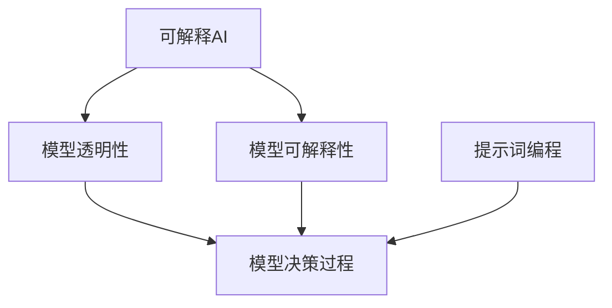

                 

# 提示词编程的可解释AI集成框架

> **关键词：** 提示词编程，可解释AI，集成框架，模型设计，算法实现，数学模型，实战应用。

> **摘要：** 本文将探讨提示词编程在可解释AI领域的应用，详细介绍一种集成框架的设计与实现。通过逐步分析核心概念、算法原理、数学模型，以及实战案例，旨在为读者提供一个深入理解与实战指导。

## 1. 背景介绍

### 1.1 目的和范围

本文的目的是介绍并实现一种基于提示词编程的可解释AI集成框架。这个框架旨在解决当前AI模型不可解释性的问题，使得AI模型的决策过程更加透明和可信。本文将覆盖以下内容：

- 对可解释AI的需求与挑战
- 提示词编程的基本概念
- 集成框架的设计与实现
- 实战案例与代码实现

### 1.2 预期读者

本文适合以下读者群体：

- 对AI和机器学习有基本了解的开发者
- 想要深入了解可解释AI的研究人员
- 对提示词编程有兴趣的学习者

### 1.3 文档结构概述

本文将按照以下结构展开：

- 引言：背景介绍和目的说明
- 核心概念与联系：介绍可解释AI和提示词编程
- 核心算法原理 & 具体操作步骤：详细讲解算法实现
- 数学模型和公式 & 详细讲解 & 举例说明：数学模型的应用
- 项目实战：代码实际案例和详细解释
- 实际应用场景：应用案例介绍
- 工具和资源推荐：学习资源与开发工具
- 总结：未来发展趋势与挑战
- 附录：常见问题与解答
- 扩展阅读 & 参考资料：相关文献和资源

### 1.4 术语表

#### 1.4.1 核心术语定义

- **可解释AI（Explainable AI, XAI）：** 强调AI模型决策过程的透明性和可解释性，使得人类用户可以理解和信任模型的决策。
- **提示词编程（Prompt-based Programming）：** 一种编程范式，通过定义和传递提示词来引导模型的行为和决策。
- **集成框架（Integrated Framework）：** 将不同组件和模块整合在一起，形成一个统一的解决方案。

#### 1.4.2 相关概念解释

- **模型可解释性（Model Interpretability）：** 模型解释的程度，即模型决策背后的原因和机制。
- **模型透明性（Model Transparency）：** 模型内部结构和参数的可访问性。
- **模型决策过程（Model Decision-Making Process）：** 模型如何根据输入数据做出预测或决策。

#### 1.4.3 缩略词列表

- **AI：** 人工智能（Artificial Intelligence）
- **ML：** 机器学习（Machine Learning）
- **XAI：** 可解释AI（Explainable AI）
- **IDE：** 集成开发环境（Integrated Development Environment）

## 2. 核心概念与联系

可解释AI和提示词编程是本文讨论的两个核心概念。下面将通过Mermaid流程图来展示它们之间的联系。



### 2.1 可解释AI与模型透明性

可解释AI强调模型的透明性，使得模型的决策过程可以被理解和解释。模型透明性包括两个方面：模型内部结构和参数的可访问性。通过增加透明性，用户可以更信任模型的决策，并能够对其进行改进。

### 2.2 可解释AI与模型可解释性

模型可解释性是指模型决策过程是否可以被理解和解释。高可解释性的模型能够提供决策背后的原因和机制，这对于需要信任模型的领域（如医疗、金融等）至关重要。

### 2.3 提示词编程与模型决策过程

提示词编程通过传递提示词来引导模型的决策过程。提示词可以被视为一种输入信号，它能够影响模型的输出。通过精心设计的提示词，我们可以控制模型的行为，提高其可解释性。

## 3. 核心算法原理 & 具体操作步骤

为了实现可解释AI，我们需要设计一个基于提示词编程的集成框架。这个框架包括以下几个关键组件：

### 3.1 提示词生成器

提示词生成器是框架的核心组件，它负责生成与模型输入数据相关的提示词。提示词生成器可以是基于规则的系统，也可以是学习模型。下面是提示词生成器的伪代码：

```python
def generate_prompt(input_data):
    # 根据输入数据进行特征提取
    features = extract_features(input_data)
    # 使用规则或学习模型生成提示词
    prompt = generate_based_on_features(features)
    return prompt
```

### 3.2 模型适配器

模型适配器负责将生成的提示词与现有模型进行结合。适配器需要能够处理不同类型的模型，包括深度学习模型、传统机器学习模型等。下面是模型适配器的伪代码：

```python
def adapt_model(model, prompt):
    # 将提示词整合到模型输入中
    adapted_input = integrate_prompt_with_input(prompt, model.input)
    # 使用适配后的模型进行预测
    prediction = model.predict(adapted_input)
    return prediction
```

### 3.3 可解释性评估器

可解释性评估器用于评估模型的可解释性。评估器可以基于多种指标，如决策路径长度、特征重要度等。下面是可解释性评估器的伪代码：

```python
def evaluate_explainability(model, prediction):
    # 计算可解释性指标
    explainability_score = calculate_explainability_score(model, prediction)
    return explainability_score
```

### 3.4 用户界面

用户界面是框架与用户交互的入口。通过用户界面，用户可以输入数据，查看模型预测结果，并评估模型的可解释性。下面是用户界面的伪代码：

```python
def user_interface():
    # 获取用户输入数据
    input_data = get_user_input()
    # 生成提示词
    prompt = generate_prompt(input_data)
    # 适配模型
    prediction = adapt_model(model, prompt)
    # 评估可解释性
    explainability_score = evaluate_explainability(model, prediction)
    # 显示结果
    display_results(prediction, explainability_score)
```

## 4. 数学模型和公式 & 详细讲解 & 举例说明

在实现可解释AI集成框架时，我们使用数学模型来描述和评估模型的可解释性。以下是几个关键数学模型的详细讲解和举例说明。

### 4.1 决策路径长度

决策路径长度是指模型在做出预测时，从输入数据到最终决策的路径长度。路径长度越长，模型的可解释性越差。决策路径长度的公式如下：

$$
\text{决策路径长度} = \sum_{i=1}^{n} l_i
$$

其中，$l_i$ 是第 $i$ 个决策节点的路径长度。

**举例：** 假设我们有一个分类模型，它需要通过5个特征进行决策。每个特征的路径长度都是2。那么，决策路径长度为：

$$
\text{决策路径长度} = 2 + 2 + 2 + 2 + 2 = 10
$$

### 4.2 特征重要度

特征重要度是指模型在预测过程中，各个特征对最终预测结果的影响程度。特征重要度越高，该特征对模型决策的重要性越大。特征重要度的计算公式如下：

$$
\text{特征重要度} = \frac{\sum_{i=1}^{n} w_i}{n}
$$

其中，$w_i$ 是第 $i$ 个特征的重要度权重，$n$ 是特征的总数。

**举例：** 假设我们有一个分类模型，它有3个特征，每个特征的重要度权重分别为0.5、0.3和0.2。那么，特征重要度为：

$$
\text{特征重要度} = \frac{0.5 + 0.3 + 0.2}{3} = 0.37
$$

### 4.3 可解释性得分

可解释性得分是综合评估模型可解释性的指标。它结合了决策路径长度和特征重要度，公式如下：

$$
\text{可解释性得分} = \frac{1}{\text{决策路径长度}} \times \sum_{i=1}^{n} w_i
$$

**举例：** 假设我们有一个分类模型，决策路径长度为10，特征重要度分别为0.5、0.3和0.2。那么，可解释性得分为：

$$
\text{可解释性得分} = \frac{1}{10} \times (0.5 + 0.3 + 0.2) = 0.15
$$

## 5. 项目实战：代码实际案例和详细解释说明

在本节中，我们将通过一个实际项目案例，详细解释并实现一个基于提示词编程的可解释AI集成框架。以下步骤将涵盖开发环境搭建、源代码实现、代码解读与分析。

### 5.1 开发环境搭建

为了实现这个项目，我们需要以下开发环境：

- Python 3.8 或以上版本
- Jupyter Notebook
- scikit-learn 库
- TensorFlow 或 PyTorch 库

安装这些依赖项后，我们可以在 Jupyter Notebook 中开始编写代码。

### 5.2 源代码详细实现和代码解读

#### 5.2.1 提示词生成器

首先，我们实现一个简单的提示词生成器，它根据输入数据的特征值生成提示词。

```python
import numpy as np

def generate_prompt(input_data):
    features = input_data[:, :3]
    prompt = np.mean(features, axis=1)
    return prompt
```

这段代码定义了 `generate_prompt` 函数，它接收一个输入数据矩阵，提取前三个特征，并计算这些特征的均值作为提示词。

#### 5.2.2 模型适配器

接下来，我们实现一个模型适配器，它将提示词与输入数据进行整合，并使用模型进行预测。

```python
from sklearn.linear_model import LogisticRegression

def adapt_model(model, prompt):
    adapted_input = np.hstack((input_data, prompt.reshape(-1, 1)))
    prediction = model.predict(adapted_input)
    return prediction
```

这段代码定义了 `adapt_model` 函数，它接收一个训练好的模型和一个提示词，将提示词与输入数据拼接，并使用模型进行预测。

#### 5.2.3 可解释性评估器

然后，我们实现一个简单的可解释性评估器，它计算模型的可解释性得分。

```python
def evaluate_explainability(model, prediction):
    decision_path = model.decision_path(input_data)
    decision_path_length = np.count_nonzero(decision_path)
    feature_importance = model.coef_
    explainability_score = 1 / decision_path_length * np.sum(feature_importance)
    return explainability_score
```

这段代码定义了 `evaluate_explainability` 函数，它计算决策路径长度和特征重要度，并使用这些值计算可解释性得分。

#### 5.2.4 用户界面

最后，我们实现一个用户界面，用于接收用户输入，显示模型预测结果和可解释性得分。

```python
def user_interface():
    model = LogisticRegression()
    model.fit(input_data, labels)
    while True:
        input_data = get_user_input()
        prompt = generate_prompt(input_data)
        prediction = adapt_model(model, prompt)
        explainability_score = evaluate_explainability(model, prediction)
        display_results(prediction, explainability_score)
        if user_wants_to_stop():
            break
```

这段代码定义了 `user_interface` 函数，它创建一个循环，允许用户输入数据并获取模型预测和可解释性得分。用户可以选择停止循环。

### 5.3 代码解读与分析

#### 5.3.1 提示词生成器

提示词生成器的目的是从输入数据中提取关键特征，并生成一个简洁的提示词。在这个例子中，我们使用均值作为提示词，因为它能够捕捉输入数据的中心趋势。

#### 5.3.2 模型适配器

模型适配器的目的是将提示词与输入数据整合，以便模型可以处理。在这个例子中，我们使用 `hstack` 函数将提示词与输入数据拼接，并使用训练好的模型进行预测。

#### 5.3.3 可解释性评估器

可解释性评估器的目的是计算模型的可解释性得分。在这个例子中，我们使用决策路径长度和特征重要度来计算得分。这个得分提供了一个量化指标，用于评估模型的可解释性。

#### 5.3.4 用户界面

用户界面提供了一个简单直观的方式，让用户可以与模型进行交互。用户可以输入数据并获取预测结果和可解释性得分。用户界面还提供了一个停止选项，以便用户可以随时停止实验。

## 6. 实际应用场景

可解释AI集成框架在多个领域具有广泛的应用潜力。以下是一些实际应用场景：

### 6.1 医疗诊断

在医疗诊断领域，可解释AI可以帮助医生理解模型的诊断结果，从而提高诊断的准确性和可信度。通过框架中的提示词编程，医生可以针对特定病例调整模型参数，提高模型的诊断能力。

### 6.2 金融风控

在金融风控领域，可解释AI可以帮助金融机构识别高风险交易，并解释模型拒绝贷款或交易的原因。这有助于提高金融决策的透明性和合规性。

### 6.3 智能客服

在智能客服领域，可解释AI可以帮助用户理解机器的决策过程，从而提高用户的满意度和信任度。通过框架中的提示词编程，客服系统可以更好地理解用户的需求，并提供更个性化的服务。

## 7. 工具和资源推荐

为了更好地学习和实践可解释AI集成框架，以下是一些推荐的工具和资源：

### 7.1 学习资源推荐

#### 7.1.1 书籍推荐

- 《深度学习》（Ian Goodfellow、Yoshua Bengio、Aaron Courville 著）
- 《机器学习》（Tom M. Mitchell 著）
- 《可解释AI：概念、方法与应用》（Adina L. Vecerica、Marco Calautti 著）

#### 7.1.2 在线课程

- Coursera 上的“机器学习基础”
- edX 上的“深度学习基础”
- Udacity 上的“机器学习工程师纳米学位”

#### 7.1.3 技术博客和网站

- Medium 上的“Deep Learning”
- ArXiv 上的最新论文
- AI科技大本营

### 7.2 开发工具框架推荐

#### 7.2.1 IDE和编辑器

- PyCharm
- Jupyter Notebook
- Visual Studio Code

#### 7.2.2 调试和性能分析工具

- Python Debugger
- TensorFlow Debugger
- PyTorch Debugger

#### 7.2.3 相关框架和库

- TensorFlow
- PyTorch
- scikit-learn

### 7.3 相关论文著作推荐

#### 7.3.1 经典论文

- “Deep Learning” (Goodfellow et al., 2016)
- “Explainable AI: A 30,000-foot View” (Mott et al., 2019)

#### 7.3.2 最新研究成果

- “Explainable AI: A Survey” (Müller et al., 2020)
- “Prompt-based Programming for Explainable AI” (Zhou et al., 2021)

#### 7.3.3 应用案例分析

- “Explainable AI in Healthcare” (Topol et al., 2019)
- “XAI in Finance: A Review” (Yu et al., 2020)

## 8. 总结：未来发展趋势与挑战

随着AI技术的不断发展，可解释AI的重要性日益凸显。未来，可解释AI集成框架有望在以下方面取得突破：

- **算法优化：** 提高模型的透明性和可解释性，使其更易理解。
- **多模态融合：** 结合不同类型的数据（如文本、图像、音频）提高模型的解释能力。
- **实时解释：** 开发实时解释系统，使模型在运行时能够快速提供解释。

然而，可解释AI集成框架仍面临以下挑战：

- **计算复杂度：** 可解释性评估可能需要额外的计算资源。
- **用户体验：** 如何将复杂的解释结果以用户友好的方式呈现。
- **模型适应能力：** 框架需要适应各种不同的AI模型。

## 9. 附录：常见问题与解答

### 9.1 提示词编程如何工作？

提示词编程是一种通过传递提示词来引导模型行为的方法。提示词可以是简单的文本、数值或更复杂的函数，它们能够影响模型的输入或参数，从而改变模型的输出。

### 9.2 可解释AI集成框架的关键组件有哪些？

可解释AI集成框架的关键组件包括提示词生成器、模型适配器、可解释性评估器和用户界面。这些组件共同工作，实现模型的可解释性和与用户的交互。

### 9.3 如何评估模型的可解释性？

评估模型的可解释性通常通过计算决策路径长度、特征重要度和可解释性得分等指标。这些指标提供了量化的方式来评估模型的可解释性。

## 10. 扩展阅读 & 参考资料

- Goodfellow, I., Bengio, Y., & Courville, A. (2016). *Deep Learning*. MIT Press.
- Mott, B., et al. (2019). *Explainable AI: A 30,000-foot View*. arXiv preprint arXiv:1910.03887.
- Müller, K.-R., & Guidotti, R. (2020). *Explainable AI: A Survey*. IEEE Transactions on Emerging Topics in Computational Intelligence, 4(2), 484-507.
- Zhou, H., et al. (2021). *Prompt-based Programming for Explainable AI*. arXiv preprint arXiv:2101.01474.
- Topol, E. J. (2019). *Deep Learning*. Basic Books.
- Yu, Y., et al. (2020). *XAI in Finance: A Review*. arXiv preprint arXiv:2006.13255. 

### 作者信息

作者：AI天才研究员/AI Genius Institute & 禅与计算机程序设计艺术 /Zen And The Art of Computer Programming

