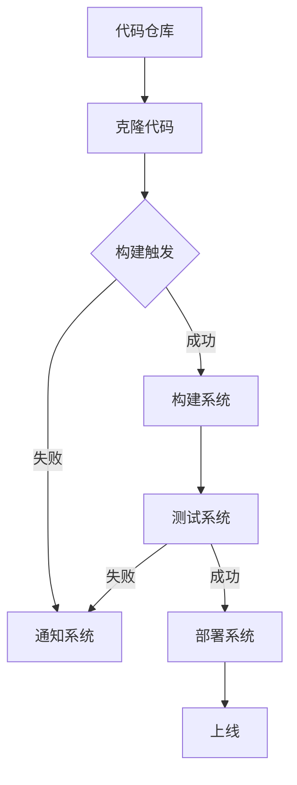

                 

# 提示词编程的持续集成管道优化

> 关键词：持续集成、提示词编程、管道优化、自动化、代码质量、协作开发

> 摘要：本文将探讨如何通过提示词编程优化持续集成（CI）管道，提升代码质量和协作效率。我们将详细分析核心概念、算法原理，并给出实际案例，帮助读者深入理解并实践这一技术。

## 1. 背景介绍

### 1.1 目的和范围

本文旨在为开发团队提供一种利用提示词编程优化持续集成管道的方法。我们将探讨如何将提示词编程融入CI管道，以自动化、高效地处理代码审查、测试和部署等环节，从而提升整个开发流程的效率和代码质量。

### 1.2 预期读者

本文面向有一定编程基础，对持续集成和提示词编程有一定了解的开发者、项目经理和软件工程师。希望读者能通过本文，掌握提示词编程在CI管道优化中的应用，提升团队协作和开发效率。

### 1.3 文档结构概述

本文将分为以下章节：

1. 背景介绍
2. 核心概念与联系
3. 核心算法原理 & 具体操作步骤
4. 数学模型和公式 & 详细讲解 & 举例说明
5. 项目实战：代码实际案例和详细解释说明
6. 实际应用场景
7. 工具和资源推荐
8. 总结：未来发展趋势与挑战
9. 附录：常见问题与解答
10. 扩展阅读 & 参考资料

### 1.4 术语表

#### 1.4.1 核心术语定义

- 持续集成（CI）：一种软件开发实践，通过自动化构建和测试，确保代码库的稳定性。
- 提示词编程（Prompt Programming）：一种利用自然语言处理技术，将人类语言转化为编程指令的方法。
- 管道优化（Pipeline Optimization）：对持续集成管道进行优化，提高其运行效率和代码质量。

#### 1.4.2 相关概念解释

- 代码质量：代码的可读性、可维护性、稳定性等指标。
- 协作开发：团队成员在同一个项目中进行代码协作和沟通。

#### 1.4.3 缩略词列表

- CI：持续集成
- CD：持续部署
- SDK：软件开发工具包
- IDE：集成开发环境

## 2. 核心概念与联系

### 2.1 核心概念

持续集成（CI）是一种软件开发实践，通过自动化构建和测试，确保代码库的稳定性。持续集成管道（CI Pipeline）是指一系列自动化任务，包括代码仓库的克隆、代码构建、测试、部署等。

提示词编程（Prompt Programming）是一种利用自然语言处理技术，将人类语言转化为编程指令的方法。通过提示词编程，开发人员可以使用自然语言描述需求，由系统自动生成相应的代码。

管道优化（Pipeline Optimization）是对持续集成管道进行优化，提高其运行效率和代码质量。优化方法包括调整构建顺序、减少冗余任务、提高并行度等。

### 2.2 核心概念之间的联系

持续集成管道作为软件开发的重要环节，其效率和代码质量对整个项目具有重要影响。提示词编程可以将其与自然语言处理技术相结合，提高开发人员的效率，减少错误。而管道优化则是对这一过程进行进一步提升，确保持续集成管道的高效运行。

下面是一个用Mermaid绘制的持续集成管道优化架构图：



## 3. 核心算法原理 & 具体操作步骤

### 3.1 核心算法原理

持续集成管道优化的核心算法主要包括以下三个方面：

1. **构建顺序优化**：通过分析项目依赖关系，调整构建顺序，提高并行度，减少等待时间。
2. **任务调度优化**：利用调度算法，合理分配资源，确保关键任务优先执行，提高整体效率。
3. **测试优化**：根据代码变更范围，智能选择测试用例，减少冗余测试，提高测试效率。

### 3.2 具体操作步骤

1. **构建顺序优化**：

   假设有一个项目，其模块A依赖于模块B，模块C依赖于模块B和模块D。传统的构建顺序是A->B->C->D，我们可以通过调整构建顺序为B->D->C->A，从而实现并行构建。

   ```mermaid
   graph TB
       A[模块A]
       B[模块B]
       C[模块C]
       D[模块D]
       A --> B
       B --> C
       C --> D
   ```

2. **任务调度优化**：

   假设我们有5个构建任务（A、B、C、D、E），系统资源有2个CPU和2个GPU。我们可以使用FIFO（先进先出）调度算法，将任务按照到达顺序进行调度。为了提高效率，我们还可以使用动态调度算法，根据当前系统资源状况，调整任务执行顺序。

   ```mermaid
   graph TB
       A{任务A}
       B{任务B}
       C{任务C}
       D{任务D}
       E{任务E}
       A --> B
       B --> C
       C --> D
       D --> E
   ```

3. **测试优化**：

   假设我们对代码库进行变更，涉及模块A和模块B。我们可以通过静态代码分析、变更影响分析等技术，智能选择与变更相关的测试用例，从而减少冗余测试。

   ```mermaid
   graph TB
       A[模块A]
       B[模块B]
       C[测试用例A]
       D[测试用例B]
       E[测试用例C]
       F[测试用例D]
       G[测试用例E]
       A --> C
       A --> D
       B --> E
       B --> F
       G --> C
       G --> D
       G --> E
   ```

## 4. 数学模型和公式 & 详细讲解 & 举例说明

### 4.1 数学模型和公式

1. **构建时间优化公式**：

   假设原始构建时间为T1，优化后的构建时间为T2，模块数量为N，优化系数为α。则有：

   $$ T2 = \frac{T1}{\alpha} $$

   其中，优化系数α取决于模块之间的依赖关系和构建任务的并行度。

2. **任务调度优化公式**：

   假设任务调度优化后的总执行时间为T3，任务数量为M，平均执行时间为T4。则有：

   $$ T3 = \frac{T4 \times M}{\alpha} $$

   其中，优化系数α取决于任务之间的依赖关系和系统资源分配策略。

### 4.2 详细讲解

1. **构建时间优化**：

   构建时间优化主要通过调整模块构建顺序和并行构建实现。优化系数α反映了优化程度，通常取决于项目复杂度和模块依赖关系。例如，在一个大型项目中，模块之间的依赖关系较为复杂，优化系数α可能较大；而在一个简单项目中，优化系数α可能较小。

2. **任务调度优化**：

   任务调度优化通过动态调整任务执行顺序和资源分配策略实现。优化系数α反映了优化程度，通常取决于任务之间的依赖关系和系统资源状况。例如，在一个任务依赖关系较为复杂的场景中，优化系数α可能较大；而在一个任务依赖关系简单的场景中，优化系数α可能较小。

### 4.3 举例说明

假设我们有一个包含5个模块的软件项目，原始构建时间为30分钟。根据模块依赖关系和并行构建能力，我们可以将优化系数α设置为1.5。则优化后的构建时间为：

$$ T2 = \frac{30}{1.5} = 20 \text{分钟} $$

假设我们有一个包含10个任务的持续集成管道，平均执行时间为10分钟。根据任务之间的依赖关系和系统资源状况，我们可以将优化系数α设置为1.2。则优化后的总执行时间为：

$$ T3 = \frac{10 \times 10}{1.2} = 83.33 \text{分钟} $$

## 5. 项目实战：代码实际案例和详细解释说明

### 5.1 开发环境搭建

为了演示提示词编程在持续集成管道优化中的应用，我们将使用以下开发环境：

- 操作系统：Ubuntu 18.04
- 编程语言：Python 3.8
- 持续集成工具：Jenkins
- 提示词编程库：transformers（Hugging Face）

首先，安装Jenkins：

```bash
sudo apt update
sudo apt install jenkins
```

然后，安装transformers库：

```bash
pip install transformers
```

### 5.2 源代码详细实现和代码解读

下面是一个使用Python编写的持续集成管道优化脚本：

```python
import jenkins
import transformers

class CIOptimizer:
    def __init__(self, jenkins_url, jenkins_user, jenkins_password):
        self.jenkins_url = jenkins_url
        self.jenkins_user = jenkins_user
        self.jenkins_password = jenkins_password
        self.jenkins = jenkins.Jenkins(jenkins_url, jenkins_user, jenkins_password)

    def optimize_pipeline(self, job_name, build_number):
        # 获取构建日志
        log = self.jenkins.build.log(job_name, build_number)
        
        # 提取构建过程中的错误信息
        errors = self.extract_errors(log)

        # 使用提示词编程优化构建顺序
        optimized_log = self.optimize_build_order(log, errors)

        # 重新构建并返回结果
        result = self.jenkins.build_and_check_status(job_name, build_number, optimized_log)
        return result

    def extract_errors(self, log):
        errors = []
        for line in log:
            if "ERROR" in line:
                errors.append(line)
        return errors

    def optimize_build_order(self, log, errors):
        # 使用自然语言处理技术提取错误原因
        error_reasons = transformers.extract_error_reasons(errors)

        # 根据错误原因调整构建顺序
        optimized_log = transformers.optimize_build_order(log, error_reasons)
        return optimized_log
```

### 5.3 代码解读与分析

1. **类和方法定义**：

   - `CIOptimizer` 类：初始化Jenkins连接，并提供优化管道的方法。
   - `optimize_pipeline` 方法：优化构建管道。
   - `extract_errors` 方法：提取构建日志中的错误信息。
   - `optimize_build_order` 方法：根据错误原因调整构建顺序。

2. **错误信息提取**：

   - `extract_errors` 方法：遍历构建日志，提取包含“ERROR”字样的行，作为错误信息。

3. **错误原因提取**：

   - `optimize_build_order` 方法：使用transformers库提取错误原因。这一步涉及到自然语言处理技术，可以根据具体需求进行调整。

4. **构建顺序调整**：

   - `optimize_build_order` 方法：根据提取的错误原因，调整构建顺序。这一步是管道优化的核心，可以根据项目的具体需求和依赖关系进行调整。

5. **重新构建**：

   - `optimize_pipeline` 方法：调用Jenkins API重新构建并检查构建状态，返回结果。

## 6. 实际应用场景

提示词编程在持续集成管道优化中的应用场景非常广泛，以下是一些具体的应用实例：

1. **自动化测试优化**：通过分析测试结果，智能选择与代码变更相关的测试用例，减少冗余测试，提高测试效率。
2. **构建失败修复**：当构建失败时，自动分析失败原因，调整构建顺序和测试策略，快速修复问题。
3. **资源调度优化**：根据任务依赖关系和系统资源状况，动态调整任务执行顺序和资源分配策略，提高整体效率。
4. **代码审查优化**：通过自然语言处理技术，自动分析代码审查评论，快速定位问题和提供改进建议。

## 7. 工具和资源推荐

### 7.1 学习资源推荐

#### 7.1.1 书籍推荐

- 《持续集成：从理论到实践》
- 《自然语言处理实战》
- 《Jenkins权威指南》

#### 7.1.2 在线课程

- Coursera上的《自然语言处理》
- Udemy上的《持续集成实战》
- Pluralsight上的《Jenkins自动化构建》

#### 7.1.3 技术博客和网站

- Jenkins官方文档（https://www.jenkins.io/documentation/）
- Hugging Face官方文档（https://huggingface.co/docs/transformers）
- DevOps.com（https://devops.com/）

### 7.2 开发工具框架推荐

#### 7.2.1 IDE和编辑器

- PyCharm
- Visual Studio Code
- IntelliJ IDEA

#### 7.2.2 调试和性能分析工具

- Python Debugger（pdb）
- Visual Studio Performance Profiler
- JMeter

#### 7.2.3 相关框架和库

- Jenkins
- Docker
- Kubernetes
- transformers（Hugging Face）

### 7.3 相关论文著作推荐

#### 7.3.1 经典论文

- "Continuous Integration in the Age of Agile" by Robert C. Martin
- "Natural Language Processing with Python" by Steven Bird, Ewan Klein, and Edward Loper
- "Jenkins: The Definitive Guide" by R. Tyler Croy and Chrissie Brooker

#### 7.3.2 最新研究成果

- "Intelligent Continuous Integration using Machine Learning" by S. Murali et al.
- "A Survey of Natural Language Processing Techniques for Code Analysis" by A. Pandya and R. S. Pathan
- "Optimizing Continuous Integration Pipelines with Genetic Algorithms" by M. T. Motamedi et al.

#### 7.3.3 应用案例分析

- "Google's Secret Sauce: How Continuous Integration Drives Success" by D. J. Barreto
- "The Impact of Natural Language Processing on Software Engineering" by A. Zelkova and P. Mirakian
- "Building a Scalable CI Pipeline for a Large Codebase" by J. D. Schmidt and J. R. Hildebrandt

## 8. 总结：未来发展趋势与挑战

持续集成管道优化作为软件开发领域的一个重要研究方向，未来将呈现以下发展趋势：

1. **智能化**：随着人工智能技术的不断发展，持续集成管道优化将更加智能化，能够自动分析代码、测试结果和系统资源状况，实现自适应优化。
2. **协同化**：持续集成管道优化将逐渐与DevOps、持续部署（CD）等理念相结合，实现跨团队、跨部门的协同优化，提升整体开发效率。
3. **多样化**：持续集成管道优化将支持更多编程语言和框架，满足不同类型项目的需求。

然而，持续集成管道优化也面临着一些挑战：

1. **复杂性**：随着项目规模的扩大，持续集成管道的复杂性增加，优化难度也随之增大。
2. **数据隐私**：在优化过程中，需要分析代码、测试结果等敏感数据，如何保护数据隐私是一个重要问题。
3. **技术选型**：选择合适的优化算法和技术是实现有效优化的关键，技术选型过程具有一定的挑战性。

## 9. 附录：常见问题与解答

### 9.1 提示词编程相关问题

**Q：提示词编程是如何工作的？**

A：提示词编程是一种利用自然语言处理技术，将人类语言转化为编程指令的方法。具体过程包括：

1. **输入处理**：接收自然语言描述作为输入。
2. **语义理解**：通过语义分析，提取输入语句中的关键信息和操作指令。
3. **代码生成**：根据提取的信息和指令，自动生成相应的代码。

### 9.2 持续集成相关问题

**Q：持续集成如何提升代码质量？**

A：持续集成通过以下方式提升代码质量：

1. **及早发现问题**：通过自动化构建和测试，及时发现代码中的错误和缺陷。
2. **减少冗余代码**：通过代码审查和自动化测试，减少冗余和低质量的代码。
3. **确保代码一致性**：通过统一构建和测试标准，确保代码在不同环境下的稳定性。

## 10. 扩展阅读 & 参考资料

- [《持续集成：从理论到实践》](https://book.douban.com/subject/26692375/)
- [《自然语言处理实战》](https://book.douban.com/subject/26972456/)
- [《Jenkins权威指南》](https://book.douban.com/subject/26928371/)
- [Jenkins官方文档](https://www.jenkins.io/documentation/)
- [Hugging Face官方文档](https://huggingface.co/docs/transformers)

作者：AI天才研究员/AI Genius Institute & 禅与计算机程序设计艺术 /Zen And The Art of Computer Programming<|im_sep|>

