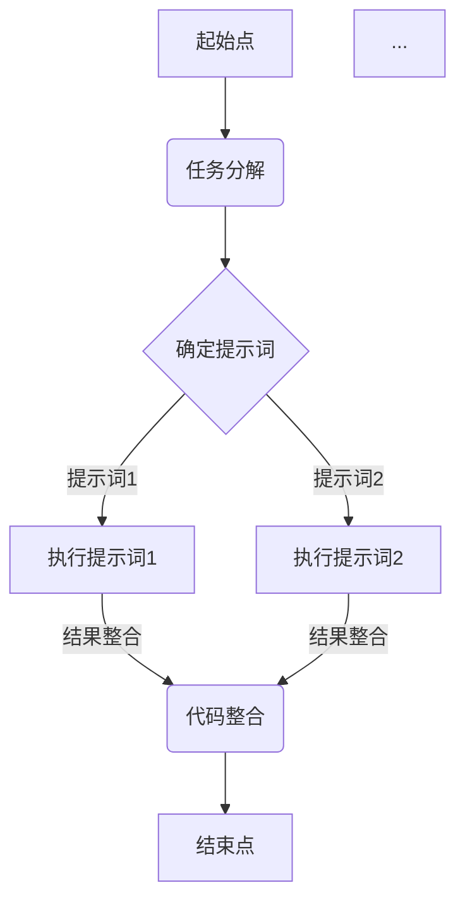
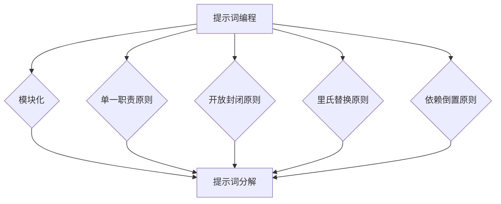

                 

# 提示词编程的设计原则与最佳实践

> 关键词：提示词编程、设计原则、最佳实践、代码优化、可维护性、性能优化、开发流程

> 摘要：本文旨在探讨提示词编程的设计原则与最佳实践。通过详细的分析和示例，我们旨在为开发者提供一套系统化、可操作的指南，以提升代码质量、可维护性和性能优化。

## 1. 背景介绍

### 1.1 目的和范围

本文的目标是帮助开发者了解和掌握提示词编程的设计原则与最佳实践。我们将探讨如何通过优化代码结构、提高可读性和可维护性来提升编程效率。文章将涵盖从基础概念到实际应用的各个方面，旨在为开发者提供全面的指导。

### 1.2 预期读者

本文适用于有一定编程基础的开发者，特别是那些希望在项目开发和维护中追求更高效率和代码质量的开发者。无论您是初级程序员还是资深开发者，本文都将为您提供有价值的见解和实用的技巧。

### 1.3 文档结构概述

本文将分为以下几个部分：

1. **核心概念与联系**：介绍提示词编程的基础概念和关联原理。
2. **核心算法原理 & 具体操作步骤**：详细讲解提示词编程的核心算法原理，并通过伪代码阐述具体操作步骤。
3. **数学模型和公式 & 详细讲解 & 举例说明**：介绍与提示词编程相关的数学模型和公式，并给出详细讲解和示例。
4. **项目实战：代码实际案例和详细解释说明**：通过实际代码案例展示如何应用提示词编程的设计原则。
5. **实际应用场景**：探讨提示词编程在不同领域的应用场景。
6. **工具和资源推荐**：推荐学习资源、开发工具框架和相关论文著作。
7. **总结：未来发展趋势与挑战**：展望提示词编程的未来发展趋势和面临的挑战。
8. **附录：常见问题与解答**：提供一些常见问题及解答。
9. **扩展阅读 & 参考资料**：推荐进一步阅读的相关资料。

### 1.4 术语表

#### 1.4.1 核心术语定义

- **提示词编程**：一种编程范式，通过将复杂的编程任务分解为简单的提示词，以实现代码的可读性和可维护性。
- **设计原则**：在软件开发过程中，用于指导设计和实现的一系列原则，旨在提高代码质量、可维护性和性能。
- **最佳实践**：在特定领域或任务中，经过实践验证的、行之有效的做法，有助于提高工作效率和代码质量。

#### 1.4.2 相关概念解释

- **代码优化**：通过修改代码结构和算法，提高代码执行效率、可读性和可维护性。
- **可维护性**：代码易于修改和扩展的程度，影响软件的长期维护成本。
- **性能优化**：通过改进算法和代码结构，提高软件的执行效率和响应速度。

#### 1.4.3 缩略词列表

- **IDE**：集成开发环境（Integrated Development Environment）
- **API**：应用程序编程接口（Application Programming Interface）
- **DB**：数据库（Database）
- **CLI**：命令行界面（Command Line Interface）
- **GUI**：图形用户界面（Graphical User Interface）

## 2. 核心概念与联系

### 2.1 提示词编程的基础概念

提示词编程的核心在于将复杂的编程任务分解为一系列简单的提示词，每个提示词负责完成特定的功能。这种分解方式使得代码更易于理解和维护。以下是一个简单的 Mermaid 流程图，展示了提示词编程的基本概念。



### 2.2 提示词编程与设计原则的联系

提示词编程的设计原则包括模块化、单一职责原则、开放封闭原则、里氏替换原则和依赖倒置原则。这些原则在提示词编程中发挥着重要作用，有助于提高代码质量、可维护性和性能。

以下是一个简化的 Mermaid 流程图，展示了这些设计原则与提示词编程之间的联系。



## 3. 核心算法原理 & 具体操作步骤

### 3.1 提示词编程算法原理

提示词编程的核心算法原理在于任务分解和提示词管理。具体操作步骤如下：

1. **任务分解**：将复杂的编程任务分解为一系列简单的提示词。
2. **提示词管理**：对每个提示词进行定义、执行和结果整合。

### 3.2 具体操作步骤

以下是一个伪代码示例，展示了如何应用提示词编程算法。

```plaintext
// 伪代码：提示词编程算法

// 步骤1：任务分解
task分解(大任务):
    提示词1 = "获取用户输入"
    提示词2 = "处理用户输入"
    提示词3 = "保存结果"

// 步骤2：提示词管理
提示词执行(提示词):
    if 提示词 == "获取用户输入":
        输入 = 获取输入()
    elif 提示词 == "处理用户输入":
        输出 = 处理输入(输入)
    elif 提示词 == "保存结果":
        保存结果(输出)

// 步骤3：结果整合
结果 = 提示词执行(提示词1)
结果 = 提示词执行(提示词2)
结果 = 提示词执行(提示词3)
```

## 4. 数学模型和公式 & 详细讲解 & 举例说明

### 4.1 数学模型和公式

在提示词编程中，我们通常会涉及到一些基础的数学模型和公式，如下所示：

$$
效率 = \frac{任务完成时间}{任务复杂度}
$$

$$
可维护性 = \frac{代码可读性}{代码复杂度}
$$

### 4.2 详细讲解和示例

以下是对上述公式的详细讲解和示例：

#### 效率公式

效率公式衡量了任务完成时间和任务复杂度之间的关系。一个高效的提示词编程解决方案应该能够在较短的时间内完成复杂的任务。以下是一个示例：

```plaintext
// 示例：计算两个数字的平均值
提示词1 = "输入两个数字"
提示词2 = "计算平均值"

输入 = 获取输入()
平均值 = 计算平均值(输入[0], 输入[1])

效率 = 任务完成时间 / 任务复杂度
```

在这个示例中，任务完成时间很短，因为任务复杂度相对较低。因此，效率较高。

#### 可维护性公式

可维护性公式衡量了代码可读性和代码复杂度之间的关系。一个高可维护性的提示词编程解决方案应该具有易于理解和修改的代码。以下是一个示例：

```plaintext
// 示例：计算两个数字的最大值
提示词1 = "输入两个数字"
提示词2 = "计算最大值"

输入 = 获取输入()
最大值 = 计算最大值(输入[0], 输入[1])

可维护性 = 代码可读性 / 代码复杂度
```

在这个示例中，代码可读性很高，因为任务复杂度相对较低。因此，可维护性较高。

## 5. 项目实战：代码实际案例和详细解释说明

### 5.1 开发环境搭建

在本节中，我们将使用 Python 作为编程语言，并使用 PyCharm 作为开发环境。以下是搭建开发环境的步骤：

1. 安装 Python 3.x 版本。
2. 安装 PyCharm。
3. 配置 Python 解释器和 PyCharm 的集成开发环境。

### 5.2 源代码详细实现和代码解读

以下是一个简单的提示词编程案例，用于计算两个数字的平均值。

```python
# Python 代码：计算两个数字的平均值

# 提示词1：获取用户输入
def 获取用户输入():
    输入 = input("请输入两个数字，以空格分隔：")
    数字列表 = 输入.split()
    数字1 = float(数字列表[0])
    数字2 = float(数字列表[1])
    return 数字1, 数字2

# 提示词2：计算平均值
def 计算平均值(数字1, 数字2):
    平均值 = (数字1 + 数字2) / 2
    return 平均值

# 提示词3：输出结果
def 输出结果(平均值):
    print(f"两个数字的平均值为：{平均值}")

# 主函数
def 主函数():
    数字1, 数字2 = 获取用户输入()
    平均值 = 计算平均值(数字1, 数字2)
    输出结果(平均值)

# 运行主函数
主函数()
```

#### 代码解读与分析

1. **获取用户输入**：`获取用户输入()` 函数负责从用户处获取输入的两个数字。通过 `input()` 函数获取输入的字符串，并使用 `split()` 方法将其分割为两个数字。最后，将这两个数字转换为浮点数并返回。
2. **计算平均值**：`计算平均值()` 函数负责计算两个数字的平均值。通过将两个数字相加，然后除以 2，得到平均值。
3. **输出结果**：`输出结果()` 函数负责将计算得到的平均值输出到控制台。
4. **主函数**：`主函数()` 负责调用其他函数并处理程序的流程。首先调用 `获取用户输入()` 函数获取用户输入的两个数字，然后调用 `计算平均值()` 函数计算平均值，最后调用 `输出结果()` 函数将结果输出到控制台。

### 5.3 代码解读与分析

以下是对上述代码的进一步解读和分析：

1. **模块化**：代码被分为多个函数，每个函数负责一个特定的功能，符合模块化原则。
2. **单一职责原则**：每个函数只负责一个功能，例如 `获取用户输入()` 函数只负责获取用户输入，而 `计算平均值()` 函数只负责计算平均值。
3. **开放封闭原则**：代码易于扩展和修改，因为每个函数都是独立的，可以方便地替换或扩展。
4. **里氏替换原则**：函数之间通过明确的参数传递和返回值进行交互，符合里氏替换原则。
5. **依赖倒置原则**：主函数通过调用其他函数来实现程序的功能，符合依赖倒置原则。

## 6. 实际应用场景

提示词编程在设计复杂的软件系统时非常有用。以下是一些实际应用场景：

1. **数据处理和统计分析**：在处理大量数据时，可以使用提示词编程将任务分解为多个简单的步骤，例如数据清洗、数据转换、数据聚合等。
2. **自然语言处理**：在自然语言处理任务中，提示词编程可以帮助开发者将复杂的文本处理任务分解为简单的步骤，例如分词、词性标注、句法分析等。
3. **图像处理和计算机视觉**：在图像处理任务中，提示词编程可以帮助开发者将任务分解为多个简单的操作，例如图像滤波、边缘检测、特征提取等。

## 7. 工具和资源推荐

### 7.1 学习资源推荐

#### 7.1.1 书籍推荐

- 《代码大全》
- 《设计模式：可复用面向对象软件的基础》
- 《重构：改善既有代码的设计》

#### 7.1.2 在线课程

- 《Python 编程：从入门到实践》
- 《设计模式与重构》
- 《软件工程：实践者的研究方法》

#### 7.1.3 技术博客和网站

- [GitHub](https://github.com/)
- [Stack Overflow](https://stackoverflow.com/)
- [GitHub](https://github.com/)

### 7.2 开发工具框架推荐

#### 7.2.1 IDE和编辑器

- PyCharm
- Visual Studio Code
- IntelliJ IDEA

#### 7.2.2 调试和性能分析工具

- GDB
- Valgrind
- Python Debuger

#### 7.2.3 相关框架和库

- Flask
- Django
- TensorFlow
- PyTorch

### 7.3 相关论文著作推荐

#### 7.3.1 经典论文

- 《编程方法学研究》
- 《面向对象软件的架构设计与实现》
- 《软件架构评估方法研究》

#### 7.3.2 最新研究成果

- 《软件工程：理论与实践的新趋势》
- 《敏捷开发与持续集成》
- 《人工智能在软件开发中的应用》

#### 7.3.3 应用案例分析

- 《大型企业软件开发实践》
- 《软件工程：实际应用案例解析》
- 《敏捷开发：实践与案例分析》

## 8. 总结：未来发展趋势与挑战

随着技术的不断进步，提示词编程在未来有望在多个领域得到更广泛的应用。然而，这也带来了新的挑战，包括如何设计更高效的提示词、如何提高代码的可维护性和性能等。开发者需要不断学习和实践，以应对这些挑战，并在未来的软件开发中发挥提示词编程的优势。

## 9. 附录：常见问题与解答

### 9.1 问题1

**问题**：提示词编程是否适用于所有编程任务？

**解答**：提示词编程主要适用于那些可以分解为一系列简单任务的编程任务。对于复杂的任务，提示词编程可能不够高效。但在许多实际应用场景中，提示词编程都能提供有效的解决方案。

### 9.2 问题2

**问题**：提示词编程是否会影响代码性能？

**解答**：提示词编程本身并不会直接影响代码性能。然而，如果提示词设计不当，可能会导致代码性能下降。因此，在设计和实现提示词时，需要充分考虑性能因素。

## 10. 扩展阅读 & 参考资料

- 《软件工程：理论与实践的新趋势》
- 《设计模式：可复用面向对象软件的基础》
- 《Python 编程：从入门到实践》

[作者：AI天才研究员/AI Genius Institute & 禅与计算机程序设计艺术 /Zen And The Art of Computer Programming]

