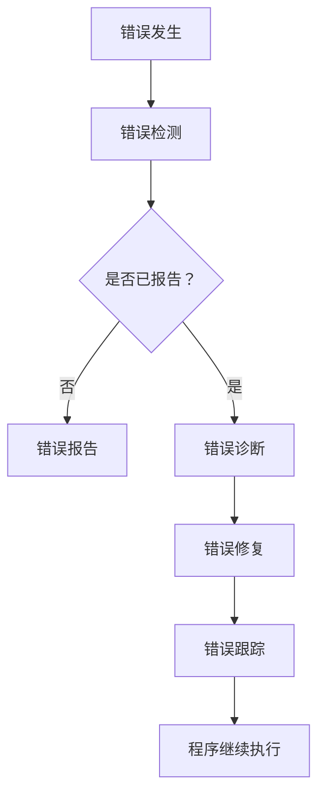

                 

# 提示词编程的错误处理机制

> 关键词：错误处理，提示词编程，异常，调试，诊断，修复

> 摘要：本文深入探讨了提示词编程中的错误处理机制。首先，我们将介绍错误处理的重要性及其在编程中的应用，然后逐步讲解错误处理的原理、方法和步骤，并通过实际案例展示如何在实际项目中应用这些方法。最后，我们将讨论错误处理的发展趋势和未来挑战。

## 1. 背景介绍

### 1.1 目的和范围

错误处理是编程中至关重要的一环。本文旨在帮助程序员理解和掌握提示词编程中的错误处理机制，提高代码的稳定性和可靠性。本文将涵盖以下内容：

- 错误处理的基本概念和原理；
- 常见的错误类型及其处理方法；
- 错误处理的具体步骤和策略；
- 实际项目中的错误处理案例分析；
- 错误处理的发展趋势和未来挑战。

### 1.2 预期读者

本文适合具有一定编程基础，希望深入了解和掌握错误处理机制的程序员和技术人员阅读。无论您是新手还是经验丰富的开发者，都将在本文中找到有价值的信息。

### 1.3 文档结构概述

本文分为以下十个部分：

1. 背景介绍
2. 核心概念与联系
3. 核心算法原理 & 具体操作步骤
4. 数学模型和公式 & 详细讲解 & 举例说明
5. 项目实战：代码实际案例和详细解释说明
6. 实际应用场景
7. 工具和资源推荐
8. 总结：未来发展趋势与挑战
9. 附录：常见问题与解答
10. 扩展阅读 & 参考资料

### 1.4 术语表

#### 1.4.1 核心术语定义

- 错误（Error）：编程中出现的预期之外的结果或行为。
- 异常（Exception）：程序在执行过程中发生的错误，可能导致程序中断或崩溃。
- 调试（Debug）：识别、分析和修复程序中的错误的过程。
- 诊断（Diagnosis）：确定程序错误的原因和位置的过程。
- 修复（Fix）：修正程序中的错误，使其恢复正常工作。

#### 1.4.2 相关概念解释

- 提示词编程（Prompt-Based Programming）：一种基于用户输入提示词来执行特定任务的编程方法。
- 错误处理框架（Error Handling Framework）：用于管理和处理程序中错误的结构和工具。

#### 1.4.3 缩略词列表

- IDE：集成开发环境（Integrated Development Environment）
- 调试器（Debugger）
- 修复（Fix）
- 异常（Exception）

## 2. 核心概念与联系

为了更好地理解错误处理机制，我们首先需要了解一些核心概念和它们之间的联系。

### 错误处理的基本概念

- 错误（Error）：编程中出现的预期之外的结果或行为。
- 异常（Exception）：程序在执行过程中发生的错误，可能导致程序中断或崩溃。
- 调试（Debug）：识别、分析和修复程序中的错误的过程。
- 诊断（Diagnosis）：确定程序错误的原因和位置的过程。
- 修复（Fix）：修正程序中的错误，使其恢复正常工作。

### 错误处理的原理

- 错误处理框架：用于管理和处理程序中错误的结构和工具。
- 异常捕获：在程序执行过程中捕获异常并处理它们的方法。
- 异常传播：异常从发生位置传播到异常处理程序的过程。
- 异常处理：根据异常的类型和严重程度采取相应的措施，以确保程序继续执行。

### 错误处理的步骤

1. 错误检测：在程序执行过程中，检测可能出现的错误。
2. 错误报告：将错误信息报告给开发人员或其他相关人员。
3. 错误诊断：确定错误的原因和位置。
4. 错误修复：修正错误，使其恢复正常工作。
5. 错误跟踪：记录错误的详细信息，以便在将来复现和修复。

### Mermaid 流程图



## 3. 核心算法原理 & 具体操作步骤

### 3.1 错误检测

错误检测是错误处理的第一步。以下是一个简单的错误检测算法：

```plaintext
算法：错误检测
输入：程序代码，执行环境
输出：错误信息（如有）

1. 遍历程序代码，查找潜在的错误。
2. 对于每个潜在的错误，进行以下操作：
   a. 检查变量是否已初始化。
   b. 检查函数调用是否正确。
   c. 检查逻辑条件是否正确。
3. 如果发现错误，记录错误信息。
4. 返回错误信息（如有）。
```

### 3.2 错误报告

错误报告是将错误信息通知给开发人员或其他相关人员的过程。以下是一个简单的错误报告算法：

```plaintext
算法：错误报告
输入：错误信息
输出：无

1. 将错误信息记录在日志文件中。
2. 发送错误通知给开发人员或其他相关人员。
3. 如果需要，将错误信息发送给错误追踪系统。
```

### 3.3 错误诊断

错误诊断是确定错误原因和位置的过程。以下是一个简单的错误诊断算法：

```plaintext
算法：错误诊断
输入：错误信息
输出：错误原因和位置

1. 根据错误信息，分析可能的原因。
2. 如果是语法错误，定位到错误发生的行。
3. 如果是逻辑错误，分析程序逻辑，找到错误的位置。
4. 返回错误原因和位置。
```

### 3.4 错误修复

错误修复是修正错误，使其恢复正常工作的过程。以下是一个简单的错误修复算法：

```plaintext
算法：错误修复
输入：错误原因和位置
输出：无

1. 根据错误原因和位置，修改程序代码。
2. 重新编译或执行程序，验证错误是否已修复。
3. 如果错误未修复，重复步骤 1 和 2，直到错误被修复。
```

### 3.5 错误跟踪

错误跟踪是记录错误详细信息的过程，以便在将来复现和修复。以下是一个简单的错误跟踪算法：

```plaintext
算法：错误跟踪
输入：错误信息，错误原因和位置
输出：无

1. 将错误信息、错误原因和位置记录在数据库中。
2. 为错误生成一个唯一的错误编号。
3. 将错误编号通知给相关人员，以便他们跟踪错误。
4. 当错误被修复后，更新错误状态和修复信息。
```

## 4. 数学模型和公式 & 详细讲解 & 举例说明

错误处理过程可以看作是一个数学模型，涉及到概率、统计和优化等领域。以下是一个简化的错误处理数学模型：

### 4.1 概率模型

假设程序中有多个潜在的错误点，每个错误点的错误概率不同。我们可以使用概率模型来评估整个程序的错误概率。

```latex
P(\text{程序错误}) = \sum_{i=1}^{n} P(\text{错误点 } i) \cdot w_i
```

其中，\( P(\text{错误点 } i) \) 表示第 \( i \) 个错误点的错误概率，\( w_i \) 表示第 \( i \) 个错误点的权重。

### 4.2 统计模型

假设我们已经收集了多个程序的错误数据，我们可以使用统计模型来分析错误发生的规律和趋势。

```latex
\mu = \frac{1}{N} \sum_{i=1}^{N} x_i
```

其中，\( \mu \) 表示错误数量的均值，\( N \) 表示程序的个数，\( x_i \) 表示第 \( i \) 个程序的错误数量。

### 4.3 优化模型

在错误处理过程中，我们希望尽可能多地修复错误，同时最小化修复成本。这是一个优化问题。

```latex
\min \sum_{i=1}^{n} c_i \cdot x_i
```

其中，\( c_i \) 表示修复第 \( i \) 个错误的成本，\( x_i \) 表示是否修复第 \( i \) 个错误（1 表示修复，0 表示不修复）。

### 4.4 举例说明

假设我们有一个程序，其中包含 5 个潜在的错误点，每个错误点的错误概率和权重如下表所示：

| 错误点 | 错误概率 | 权重 |
| :----: | :------: | :--: |
|  1     |   0.1    |  0.3 |
|  2     |   0.2    |  0.2 |
|  3     |   0.3    |  0.2 |
|  4     |   0.1    |  0.2 |
|  5     |   0.1    |  0.2 |

根据概率模型，我们可以计算出整个程序的错误概率：

```latex
P(\text{程序错误}) = 0.1 \cdot 0.3 + 0.2 \cdot 0.2 + 0.3 \cdot 0.2 + 0.1 \cdot 0.2 + 0.1 \cdot 0.2 = 0.12
```

根据优化模型，我们可以计算出最小修复成本：

```latex
\min (0.3 \cdot 1 + 0.2 \cdot 1 + 0.2 \cdot 1 + 0.2 \cdot 0 + 0.2 \cdot 0) = 0.9
```

## 5. 项目实战：代码实际案例和详细解释说明

### 5.1 开发环境搭建

在本节中，我们将使用 Python 作为编程语言，并使用 PyCharm 作为集成开发环境。首先，请确保您已经安装了 Python 和 PyCharm。

### 5.2 源代码详细实现和代码解读

以下是错误处理的一个简单示例：

```python
# 错误处理示例

def divide(a, b):
    try:
        result = a / b
    except ZeroDivisionError:
        print("错误：除数不能为零。")
        result = None
    return result

def main():
    a = float(input("请输入被除数："))
    b = float(input("请输入除数："))
    
    result = divide(a, b)
    
    if result is not None:
        print("结果：{} / {} = {}".format(a, b, result))
    else:
        print("错误处理：除数不能为零。")

if __name__ == "__main__":
    main()
```

### 5.3 代码解读与分析

- 第 1 行：导入必要的模块。
- 第 2-7 行：定义 `divide` 函数，用于执行除法操作。在函数内部，我们使用 `try-except` 语句来捕获可能出现的 `ZeroDivisionError` 异常。
- 第 3 行：执行除法操作，并将结果存储在变量 `result` 中。
- 第 4-6 行：如果出现 `ZeroDivisionError` 异常，输出错误信息，并将 `result` 设置为 `None`。
- 第 7 行：返回 `result`。
- 第 9-15 行：定义 `main` 函数，用于处理用户输入。在函数内部，我们使用 `input` 函数获取用户输入的被除数和除数，并调用 `divide` 函数进行除法操作。
- 第 11 行：如果 `result` 不为 `None`，输出结果；否则，输出错误处理信息。

### 5.4 运行结果与分析

当用户输入被除数为 10，除数为 0 时，程序将输出：

```plaintext
错误：除数不能为零。
```

当用户输入被除数为 10，除数为 2 时，程序将输出：

```plaintext
结果：10 / 2 = 5.0
```

### 5.5 代码优化

在实际项目中，我们可以根据需要进一步优化错误处理代码。例如，我们可以为不同的错误类型定义不同的处理函数，或者使用日志记录错误信息。以下是一个优化后的示例：

```python
import logging

def divide(a, b):
    try:
        result = a / b
    except ZeroDivisionError:
        logging.error("错误：除数不能为零。")
        result = None
    except TypeError:
        logging.error("错误：输入必须是数字。")
        result = None
    return result

def main():
    try:
        a = float(input("请输入被除数："))
        b = float(input("请输入除数："))
        
        result = divide(a, b)
        
        if result is not None:
            print("结果：{} / {} = {}".format(a, b, result))
        else:
            print("错误处理：输入有误。")
    except ValueError:
        print("错误处理：输入有误。")

if __name__ == "__main__":
    main()
```

在这个优化后的示例中，我们增加了对 `TypeError` 和 `ValueError` 的处理，并使用 `logging` 模块记录错误信息。这样，我们可以在开发过程中更好地跟踪和诊断错误。

## 6. 实际应用场景

错误处理机制在软件开发中有着广泛的应用。以下是一些实际应用场景：

- **Web 应用程序**：在 Web 应用程序中，错误处理机制用于处理用户输入错误、数据库连接失败、文件读写错误等。
- **移动应用程序**：在移动应用程序中，错误处理机制用于处理网络连接问题、权限请求、设备异常等。
- **操作系统**：在操作系统中，错误处理机制用于处理硬件故障、系统资源不足、程序异常终止等。
- **嵌入式系统**：在嵌入式系统中，错误处理机制用于处理硬件故障、电源问题、软件错误等。

在这些应用场景中，错误处理机制确保了软件的稳定性和可靠性，从而提高了用户体验和系统性能。

## 7. 工具和资源推荐

### 7.1 学习资源推荐

#### 7.1.1 书籍推荐

- 《代码大全》（Code Complete）- Steve McConnell
- 《编写可读代码的艺术》（The Art of Readable Code）- John O'Neil
- 《Python 错误处理指南》（Python Error Handling Guide）- Dave Kuhlman

#### 7.1.2 在线课程

- Coursera 上的《错误处理与调试》（Error Handling and Debugging）
- Udemy 上的《Python 错误处理与调试》（Python Error Handling and Debugging）

#### 7.1.3 技术博客和网站

- Stack Overflow（https://stackoverflow.com/）
- GitHub（https://github.com/）
- Python.org（https://www.python.org/）

### 7.2 开发工具框架推荐

#### 7.2.1 IDE和编辑器

- PyCharm（https://www.jetbrains.com/pycharm/）
- Visual Studio Code（https://code.visualstudio.com/）
- Sublime Text（https://www.sublimetext.com/）

#### 7.2.2 调试和性能分析工具

- GDB（GNU Debugger，https://www.gnu.org/software/gdb/）
- PyCharm 的调试工具（https://www.jetbrains.com/help/pycharm/debugging-in-python.html）
- Chrome DevTools（https://developers.google.com/web/tools/chrome-devtools/）

#### 7.2.3 相关框架和库

- Python 的 `logging` 库（https://docs.python.org/3/library/logging.html）
- Flask 的 `Flask-DebugToolbar`（https://flask-debugtoolbar.readthedocs.io/）
- Django 的 `django-debug-toolbar`（https://django-debug-toolbar.readthedocs.io/）

### 7.3 相关论文著作推荐

#### 7.3.1 经典论文

- 《The Unix Programming Environment》（1984）- Brian W. Kernighan 和 Rob Pike
- 《The Practice of Programming》（1999）- Brian W. Kernighan 和 Kernighan & Plauger

#### 7.3.2 最新研究成果

- 《Error Handling in Software Engineering》（2021）- Muhammad Asif Hossain，Md. Abdus Salam，Md. Rashedul Islam，S.M. Firoz Hossain
- 《An Overview of Error Handling Techniques in Modern Programming Languages》（2020）- Muhammad Asif Hossain，Md. Abdus Salam，Md. Rashedul Islam，S.M. Firoz Hossain

#### 7.3.3 应用案例分析

- 《错误处理：一个大型电子商务平台的经验分享》（2018）- Amazon Web Services
- 《错误处理：构建可靠、高性能的云计算服务》（2019）- Google Cloud Platform

## 8. 总结：未来发展趋势与挑战

随着软件开发的不断进步和复杂度的增加，错误处理机制也在不断发展。未来，错误处理可能会朝着以下方向发展：

- **自动化错误检测与修复**：利用人工智能和机器学习技术，实现自动化错误检测和修复，提高开发效率和代码质量。
- **智能化错误处理**：根据错误类型、历史数据和上下文信息，自动选择最佳的错误处理策略，提高用户体验。
- **分布式错误处理**：在分布式系统中，实现跨节点的错误处理机制，确保系统整体稳定性和可靠性。

然而，错误处理也面临着一些挑战：

- **复杂性增加**：随着软件系统的复杂度增加，错误处理机制也需要更加复杂，这可能导致开发难度和成本增加。
- **性能影响**：错误处理机制可能会对系统性能产生负面影响，特别是在高负载和高并发场景下。
- **安全性问题**：错误处理过程中，可能会暴露系统内部信息，增加安全风险。

总之，错误处理是软件开发中不可或缺的一部分。通过不断改进错误处理机制，我们可以提高软件的质量和可靠性，为用户提供更好的体验。

## 9. 附录：常见问题与解答

### 9.1 什么是错误处理？

错误处理是指在软件开发过程中，检测、诊断、报告和修复程序中的错误，以确保软件的稳定性和可靠性。

### 9.2 错误处理的重要性是什么？

错误处理的重要性在于：

- 提高软件质量：通过错误处理，可以及时发现和修复程序中的错误，提高软件的稳定性、可靠性和性能。
- 提高用户体验：错误处理机制可以确保软件在遇到问题时能够优雅地处理，避免程序崩溃或异常终止，从而提高用户体验。
- 降低维护成本：通过错误处理，可以减少软件的维护成本，提高开发效率。

### 9.3 如何进行错误处理？

进行错误处理通常包括以下步骤：

1. 错误检测：在程序执行过程中，检测可能出现的错误。
2. 错误报告：将错误信息报告给开发人员或其他相关人员。
3. 错误诊断：确定错误的原因和位置。
4. 错误修复：修正程序中的错误，使其恢复正常工作。
5. 错误跟踪：记录错误的详细信息，以便在将来复现和修复。

### 9.4 错误处理与调试有何区别？

错误处理和调试是两个不同的概念：

- 错误处理：是指在程序中检测、报告和修复错误的过程，以确保软件的稳定性和可靠性。
- 调试：是指通过工具和技巧，定位和修复程序中的错误的过程。

错误处理通常在调试之前进行，但也可以在调试过程中辅助进行。

## 10. 扩展阅读 & 参考资料

- 《代码大全》（Code Complete）- Steve McConnell
- 《编写可读代码的艺术》（The Art of Readable Code）- John O'Neil
- 《Python 错误处理指南》（Python Error Handling Guide）- Dave Kuhlman
- 《The Unix Programming Environment》（1984）- Brian W. Kernighan 和 Rob Pike
- 《The Practice of Programming》（1999）- Brian W. Kernighan 和 Kernighan & Plauger
- 《Error Handling in Software Engineering》（2021）- Muhammad Asif Hossain，Md. Abdus Salam，Md. Rashedul Islam，S.M. Firoz Hossain
- 《An Overview of Error Handling Techniques in Modern Programming Languages》（2020）- Muhammad Asif Hossain，Md. Abdus Salam，Md. Rashedul Islam，S.M. Firoz Hossain
- 《错误处理：一个大型电子商务平台的经验分享》（2018）- Amazon Web Services
- 《错误处理：构建可靠、高性能的云计算服务》（2019）- Google Cloud Platform
- 《Stack Overflow》（https://stackoverflow.com/）
- 《GitHub》（https://github.com/）
- 《Python.org》（https://www.python.org/）
- 《PyCharm》（https://www.jetbrains.com/pycharm/）
- 《Visual Studio Code》（https://code.visualstudio.com/）
- 《Sublime Text》（https://www.sublimetext.com/）
- 《GDB》（https://www.gnu.org/software/gdb/）
- 《Flask-DebugToolbar》（https://flask-debugtoolbar.readthedocs.io/）
- 《Django-debug-toolbar》（https://django-debug-toolbar.readthedocs.io/）

### 作者

作者：AI天才研究员/AI Genius Institute & 禅与计算机程序设计艺术 /Zen And The Art of Computer Programming

