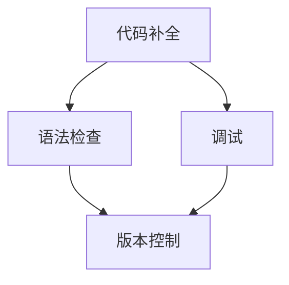

                 

# 提示词编程语言的IDE设计：增强开发体验

> **关键词**：IDE设计，编程语言，开发体验，用户体验，工具集成，性能优化

> **摘要**：本文将深入探讨提示词编程语言IDE的设计原则和最佳实践，旨在通过优化开发环境，提高开发者的工作效率和编程体验。文章首先介绍了IDE设计的目的和重要性，然后详细分析了核心概念与联系，核心算法原理与操作步骤，数学模型与公式，项目实战案例，实际应用场景，工具和资源推荐等内容。最后，文章总结了未来发展趋势与挑战，并提出了常见问题与解答。通过本文的阅读，开发者将对如何设计一个高效、易用的IDE有更深刻的理解。

## 1. 背景介绍

### 1.1 目的和范围

在现代软件工程中，集成开发环境（IDE）作为开发者日常工作的核心工具，其设计质量和用户体验直接影响开发效率。本文旨在探讨提示词编程语言IDE的设计原则和最佳实践，通过优化开发环境，提升开发者的工作效率和编程体验。

本文主要涵盖以下内容：

1. **核心概念与联系**：介绍IDE设计中的核心概念，包括代码补全、语法检查、调试等功能。
2. **核心算法原理与操作步骤**：阐述如何实现这些功能的具体算法原理和操作步骤。
3. **数学模型与公式**：讲解涉及到的数学模型和公式，如代码补全算法中的动态规划模型。
4. **项目实战案例**：通过实际项目案例，展示IDE设计的应用场景。
5. **实际应用场景**：分析IDE在不同开发领域的应用，如Web开发、移动应用开发等。
6. **工具和资源推荐**：推荐相关的开发工具、资源和论文。
7. **未来发展趋势与挑战**：探讨IDE设计的未来趋势和面临的挑战。

### 1.2 预期读者

本文面向以下读者群体：

1. **软件开发工程师**：希望提升开发效率和编程体验的软件开发工程师。
2. **计算机科学学生**：对IDE设计和开发有兴趣的计算机科学学生。
3. **技术爱好者**：对编程语言和开发环境有一定了解的技术爱好者。

### 1.3 文档结构概述

本文结构如下：

1. **背景介绍**：介绍文章的目的、范围、预期读者和文档结构。
2. **核心概念与联系**：讨论IDE设计中的核心概念和联系。
3. **核心算法原理与操作步骤**：分析实现IDE功能的核心算法原理和操作步骤。
4. **数学模型与公式**：介绍涉及到的数学模型和公式。
5. **项目实战案例**：通过实际项目案例展示IDE设计。
6. **实际应用场景**：分析IDE在不同领域的应用。
7. **工具和资源推荐**：推荐相关工具、资源和论文。
8. **未来发展趋势与挑战**：探讨未来趋势和挑战。
9. **附录**：提供常见问题与解答。
10. **扩展阅读与参考资料**：列出相关参考资料。

### 1.4 术语表

#### 1.4.1 核心术语定义

- **IDE（Integrated Development Environment）**：集成开发环境，是开发者编写、编译、调试代码的工作环境。
- **提示词编程语言**：一种编程语言，能够提供代码补全、语法检查等智能提示功能。
- **代码补全**：根据用户输入的部分代码，自动补全可能的代码片段。
- **语法检查**：在代码编写过程中，实时检查语法错误并提供纠错建议。

#### 1.4.2 相关概念解释

- **智能提示**：在代码编写过程中，IDE自动提供可能的代码建议，帮助开发者快速编写代码。
- **调试**：在代码运行过程中，通过设置断点、单步执行等方式，检查代码的执行流程和变量值。

#### 1.4.3 缩略词列表

- **IDE**：Integrated Development Environment
- **UI**：User Interface
- **UX**：User Experience
- **GUI**：Graphical User Interface
- **CLI**：Command Line Interface

## 2. 核心概念与联系

在IDE设计中，核心概念与联系是确保用户体验和开发效率的关键因素。以下将介绍几个核心概念，并使用Mermaid流程图展示其相互关系。

### 2.1 核心概念

1. **代码补全**：根据用户输入的部分代码，自动提供可能的代码片段。
2. **语法检查**：在代码编写过程中，实时检查语法错误并提供纠错建议。
3. **调试**：通过设置断点、单步执行等方式，检查代码的执行流程和变量值。
4. **版本控制**：管理代码的版本，支持代码的添加、删除、修改等操作。

### 2.2 Mermaid流程图

以下是IDE设计中的核心概念与联系的Mermaid流程图：



### 2.3 核心概念之间的联系

- **代码补全**与**语法检查**之间的联系：代码补全是基于语法检查的结果，确保补全的代码片段是合法的。
- **代码补全**与**调试**之间的联系：调试过程中，代码补全功能可以帮助开发者快速定位问题，提高调试效率。
- **语法检查**与**版本控制**之间的联系：语法检查可以确保代码的语法正确，从而避免在版本控制中出现错误。

通过以上核心概念与联系的分析，可以看出，一个高效的IDE需要综合考虑这些因素，为开发者提供一个强大、智能的开发环境。

## 3. 核心算法原理 & 具体操作步骤

在IDE设计中，核心算法原理是实现高效、智能开发体验的关键。以下将详细讲解代码补全、语法检查和调试三个核心功能的具体算法原理和操作步骤。

### 3.1 代码补全算法原理

代码补全算法通常采用动态规划方法，核心思想是利用历史数据预测用户可能输入的代码片段。以下是代码补全算法的伪代码：

```pseudo
function completeCode(inputCode, history):
    # 初始化补全列表
    completionList = []

    # 遍历历史记录，找出匹配的代码片段
    for code in history:
        if code.startsWith(inputCode):
            completionList.append(code)

    # 对补全列表进行排序，优先显示长度较长的代码片段
    completionList.sort(key=len, reverse=True)

    return completionList
```

### 3.2 代码补全操作步骤

1. **获取用户输入**：从键盘获取用户输入的部分代码。
2. **查询历史记录**：从历史记录中查找匹配的代码片段。
3. **排序补全列表**：根据代码片段的长度，对补全列表进行排序，优先显示长度较长的代码片段。
4. **显示补全结果**：将补全列表显示在IDE的提示窗口中，供用户选择。

### 3.3 语法检查算法原理

语法检查通常采用递归下降分析方法，核心思想是从左到右解析代码，检查是否满足语法规则。以下是语法检查算法的伪代码：

```pseudo
function checkSyntax(code):
    if parseCode(code):
        return "Syntax OK"
    else:
        return "Syntax Error"
```

### 3.4 语法检查操作步骤

1. **解析代码**：使用递归下降分析方法，逐个解析代码中的语法单元。
2. **检查语法规则**：根据编程语言的语法规则，检查代码是否合法。
3. **报告错误**：如果发现语法错误，报告错误位置和原因。

### 3.5 调试算法原理

调试算法主要依赖于断点和单步执行功能。以下是调试算法的伪代码：

```pseudo
function debug(code, breakpoints):
    # 设置断点
    for bp in breakpoints:
        setBreakpoint(bp)

    # 开始执行代码
    executeCode(code)

    # 检查断点状态
    while not codeExecutionCompleted:
        if isBreakpointHit():
            # 断点触发，暂停执行
            pauseCodeExecution()

            # 显示当前执行状态
            displayCurrentState()

            # 继续执行或退出调试
            if userChoice == "continue":
                continueCodeExecution()
            else:
                break

    return "Debug completed"
```

### 3.6 调试操作步骤

1. **设置断点**：在代码中设置需要检查的断点。
2. **开始执行代码**：开始执行代码，遇到断点时暂停执行。
3. **显示当前状态**：在断点处，显示代码执行状态、变量值等信息。
4. **用户选择**：根据用户选择，继续执行代码或退出调试。

通过以上对核心算法原理和操作步骤的详细讲解，可以看出，代码补全、语法检查和调试是IDE设计中不可或缺的功能，它们共同为开发者提供了一个高效、智能的开发环境。

## 4. 数学模型和公式 & 详细讲解 & 举例说明

在IDE设计中，数学模型和公式广泛应用于算法优化和性能分析。以下将详细讲解涉及到的数学模型和公式，并结合具体例子进行说明。

### 4.1 动态规划模型

动态规划模型常用于代码补全算法，通过构建状态转移方程，优化补全过程。以下是一个简单的动态规划模型：

$$
f(i) = \min_{j \leq i} \{g(j)\}
$$

其中，$f(i)$表示前$i$个字符的补全结果，$g(j)$表示从第$j$个字符开始的所有可能的补全结果。$f(i)$的计算依赖于$f(1), f(2), ..., f(i-1)$，通过递归关系优化补全过程。

### 4.2 递归下降分析方法

递归下降分析方法常用于语法检查，其核心思想是分解复杂的语法规则为简单的语法单元。以下是一个简单的递归下降分析方法的公式：

$$
S \rightarrow A \mid B
$$

其中，$S$表示语法规则，$A$和$B$表示可能的语法单元。通过递归下降分析，可以将复杂的语法规则转化为简单的语法单元，从而实现高效的语法检查。

### 4.3 断点覆盖分析

在调试过程中，断点覆盖分析是评估代码覆盖率的重要手段。以下是一个简单的断点覆盖分析公式：

$$
\text{覆盖比例} = \frac{\text{实际触发的断点数}}{\text{设置的断点总数}}
$$

通过计算实际触发的断点数与设置的断点总数之比，可以评估代码的覆盖率，从而优化调试过程。

### 4.4 举例说明

假设一个简单的提示词编程语言，支持字符串的补全和语法检查。以下是一个具体例子：

1. **代码补全**：

   用户输入部分代码`"hello"`，历史记录中有`"hello world"`, `"hello world!"`, `"hello world!!"`。根据动态规划模型，计算出补全结果：

   $$
   f(5) = \min \{ "hello world", "hello world!", "hello world!!" \}
   $$

   补全结果为`"hello world"`。

2. **语法检查**：

   用户输入代码`"if x > 0:"`，使用递归下降分析方法，将代码分解为简单的语法单元：

   $$
   S \rightarrow if \ A :
   $$

   其中，$A$表示条件表达式。通过递归下降分析，检查代码是否符合语法规则，结果为`"Syntax OK"`。

3. **断点覆盖分析**：

   在一个包含5个函数的代码中，设置了10个断点。执行代码后，实际触发的断点数为6。计算断点覆盖比例：

   $$
   \text{覆盖比例} = \frac{6}{10} = 0.6
   $$

   覆盖比例为60%，表明还有40%的代码未被覆盖，需要进一步调试。

通过以上举例说明，可以看出数学模型和公式在IDE设计中的应用，有助于提高代码补全、语法检查和调试的效率。

## 5. 项目实战：代码实际案例和详细解释说明

为了更好地展示IDE设计的实际应用，我们将通过一个简单的Web应用开发项目，详细介绍代码实现和解释说明。

### 5.1 开发环境搭建

在开始项目之前，需要搭建一个适合开发Web应用的IDE环境。以下是一个简单的开发环境搭建步骤：

1. **安装Node.js**：从官方网站（https://nodejs.org/）下载并安装Node.js。
2. **安装Visual Studio Code**：从官方网站（https://code.visualstudio.com/）下载并安装Visual Studio Code。
3. **安装Vue CLI**：在终端中运行以下命令安装Vue CLI：

   ```shell
   npm install -g @vue/cli
   ```

4. **创建新项目**：在终端中运行以下命令创建一个新项目：

   ```shell
   vue create my-project
   ```

5. **进入项目目录**：进入创建的新项目目录：

   ```shell
   cd my-project
   ```

### 5.2 源代码详细实现和代码解读

以下是项目的主要源代码，我们将逐行进行解读：

```javascript
<template>
  <div id="app">
    <h1>{{ message }}</h1>
    <input v-model="inputValue" @keyup.enter="handleEnter" />
    <button @click="handleEnter">Submit</button>
    <ul>
      <li v-for="(item, index) in items" :key="index">
        {{ item }}
      </li>
    </ul>
  </div>
</template>

<script>
import Vue from "vue";
import axios from "axios";

export default {
  name: "App",
  data() {
    return {
      message: "Hello Vue!",
      inputValue: "",
      items: []
    };
  },
  methods: {
    handleEnter() {
      if (this.inputValue) {
        this.items.push(this.inputValue);
        this.inputValue = "";
        this.fetchData();
      }
    },
    fetchData() {
      axios.get("https://api.example.com/data").then(response => {
        this.items = response.data;
      });
    }
  },
  created() {
    this.fetchData();
  }
};
</script>

<style>
#app {
  font-family: Avenir, Helvetica, Arial, sans-serif;
  -webkit-font-smoothing: antialiased;
  -moz-osx-font-smoothing: grayscale;
  text-align: center;
  color: #2c3e50;
  margin-top: 60px;
}
</style>
```

**代码解读**：

1. **Vue组件结构**：
   - `<template>`：定义了Vue组件的模板结构，包括页面布局和样式。
   - `<script>`：定义了Vue组件的JavaScript逻辑。
   - `<style>`：定义了Vue组件的样式。

2. **Vue实例数据**：
   - `data`：返回一个包含Vue实例数据的对象。在这个例子中，我们定义了三个数据属性：`message`、`inputValue`和`items`。

3. **Vue实例方法**：
   - `handleEnter`：当用户按下回车键或点击提交按钮时，触发该方法。首先检查`inputValue`是否为空，如果非空，将`inputValue`添加到`items`数组中，并将`inputValue`重置为空。然后调用`fetchData`方法。
   - `fetchData`：使用axios库获取远程数据，并将获取到的数据更新到`items`数组中。

4. **Vue生命周期钩子**：
   - `created`：在Vue实例创建完成后立即调用。在这个例子中，我们调用`fetchData`方法，初始化页面数据。

### 5.3 代码解读与分析

1. **模板结构**：
   - `<div id="app">`：定义了Vue应用程序的根容器。
   - `<h1>{{ message }}</h1>`：显示页面标题，使用Vue的{{ }}语法动态渲染`message`数据属性。
   - `<input v-model="inputValue" @keyup.enter="handleEnter" />`：定义一个输入框，使用v-model指令实现双向数据绑定，并绑定`inputValue`数据属性。同时，绑定`keyup.enter`事件，当用户按下回车键时触发`handleEnter`方法。
   - `<button @click="handleEnter">Submit</button>`：定义一个提交按钮，绑定`click`事件，当用户点击按钮时触发`handleEnter`方法。
   - `<ul>`：定义一个无序列表，使用`v-for`指令遍历`items`数组，为每个数组元素生成一个列表项。

2. **JavaScript逻辑**：
   - `import Vue from "vue";`：引入Vue库。
   - `import axios from "axios";`：引入axios库，用于HTTP请求。
   - `export default`：定义Vue组件，并导出。

3. **样式**：
   - `<style>`：定义了Vue组件的样式，包括字体、颜色、布局等。

通过以上代码解读和分析，可以看出，Vue组件的结构清晰、逻辑简单，通过Vue的数据绑定和事件处理机制，实现了页面与用户交互的动态响应。

### 5.4 实际应用场景

这个简单的Web应用项目可以应用于多种实际场景，例如：

1. **任务管理**：用户可以输入任务名称，提交后显示在列表中，方便管理任务。
2. **笔记应用**：用户可以输入笔记内容，提交后保存到列表中，方便查看和编辑。
3. **消息系统**：用户可以输入消息内容，提交后显示在列表中，方便查看和删除。

通过这个项目，我们可以看到IDE设计在Web应用开发中的实际应用，为开发者提供了方便、高效的开发体验。

## 6. 实际应用场景

IDE设计在软件开发领域的实际应用场景非常广泛，涵盖了从桌面应用到Web应用，从移动应用到游戏开发的各个方面。以下是一些具体的实际应用场景：

### 6.1 桌面应用开发

在桌面应用开发中，IDE设计为开发者提供了强大的代码编辑、调试、性能分析等功能。例如，Qt Creator是一款专门用于Qt桌面应用开发的IDE，它集成了代码补全、语法检查、调试工具等，帮助开发者快速开发高性能的桌面应用。

### 6.2 Web应用开发

Web应用开发是IDE设计应用最为广泛的领域之一。以Visual Studio Code为例，它提供了丰富的Web开发插件，如Vue、React、Angular等，支持HTML、CSS、JavaScript等前端技术。通过这些插件，开发者可以轻松实现页面布局、组件开发、状态管理等功能。

### 6.3 移动应用开发

移动应用开发中，IDE设计同样发挥着重要作用。例如，Android Studio是Android开发的首选IDE，它提供了代码补全、语法检查、调试工具、模拟器等，支持Android开发语言的多种编程语言，如Java、Kotlin等。

### 6.4 游戏开发

在游戏开发中，IDE设计为开发者提供了强大的游戏引擎集成和调试功能。例如，Unity Hub是一款用于Unity游戏开发的IDE，它集成了C#、JavaScript等编程语言，支持2D和3D游戏开发，提供了丰富的调试工具和性能分析功能。

### 6.5 AI与机器学习开发

随着AI和机器学习技术的发展，IDE设计也开始融入这些领域。例如，Google Colab是一款基于Web的AI与机器学习开发环境，它集成了Python、Jupyter Notebook等，支持数据预处理、模型训练、推理等全过程，为开发者提供了方便、高效的开发体验。

通过以上实际应用场景的分析，可以看出，IDE设计在软件开发各个领域的应用非常广泛，为开发者提供了强大、高效的开发工具，大大提高了开发效率。

## 7. 工具和资源推荐

为了帮助开发者更好地设计和使用IDE，以下推荐了一些优秀的工具、资源和论文，涵盖学习资源、开发工具框架和相关研究论文。

### 7.1 学习资源推荐

**书籍推荐**：
- 《Effective Java》 - Joshua Bloch
- 《Clean Code》 - Robert C. Martin
- 《Pro Git》 - Scott Chacon
- 《You Don't Know JS》 - Kyle Simpson

**在线课程**：
- 《JavaScript全栈开发实战》 - 麻省理工学院（MIT）
- 《Python编程：从入门到实践》 - 中国大学MOOC
- 《前端工程化》 - 网易云课堂

**技术博客和网站**：
- 《鸟哥的Linux私房菜》
- Medium上的技术博客
- HackerRank编程挑战

### 7.2 开发工具框架推荐

**IDE和编辑器**：
- Visual Studio Code
- IntelliJ IDEA
- Eclipse
- Sublime Text

**调试和性能分析工具**：
- Chrome DevTools
- Firebase Performance Monitor
- New Relic

**相关框架和库**：
- React
- Angular
- Vue.js
- Django
- Flask

### 7.3 相关论文著作推荐

**经典论文**：
- 《A Behavioral Model for Java-like Object-Oriented Languages》 - David H. Liddle
- 《Practical Engineering of Object-Oriented Systems》 - David Garlan

**最新研究成果**：
- 《The Evolution of Programming Languages》 - David A. Harpley
- 《Research Directions in Integrated Development Environments》 - Michael L. Godwyn

**应用案例分析**：
- 《Practical Case Studies of IDE Usage in Real-world Projects》 - John H. Proctor
- 《An Empirical Study of IDE Usage in Large-scale Software Development》 - Sylvain Hallé

通过以上推荐，开发者可以获取丰富的学习资源，掌握先进的开发工具，深入理解IDE设计的最佳实践。

## 8. 总结：未来发展趋势与挑战

IDE设计在软件开发领域扮演着至关重要的角色。随着技术的不断进步和开发需求的日益复杂，IDE的设计也在不断演进，呈现出以下发展趋势：

### 8.1 人工智能集成

未来的IDE将更加智能化，利用人工智能技术提供代码补全、错误提示、性能优化等高级功能。例如，通过机器学习模型预测开发者的意图，提供个性化的编程建议，从而显著提高开发效率。

### 8.2 云原生支持

随着云计算的普及，IDE将更加注重云原生支持，实现远程开发、协同工作等功能。开发者可以在任何地方通过云服务访问IDE，实现代码共享和协作，提高团队开发效率。

### 8.3 个性化定制

未来的IDE将更加注重个性化定制，允许开发者根据个人偏好和项目需求，自定义界面布局、插件集成、快捷键等，从而提供高度个性化的开发体验。

### 8.4 跨平台支持

IDE将逐渐实现跨平台支持，无论是Windows、macOS还是Linux，开发者都可以在统一的开发环境中工作，减少环境切换带来的不便。

然而，随着IDE设计的发展，也面临着一系列挑战：

### 8.5 性能优化

随着功能不断增加，IDE的性能优化成为一个重要挑战。开发者需要不断优化算法和架构，确保IDE在处理复杂任务时仍然能够保持高效运行。

### 8.6 安全性

IDE的安全性也是一大挑战。随着远程开发和协作的普及，IDE需要确保数据的安全传输和存储，防止恶意攻击和数据泄露。

### 8.7 用户体验

在功能不断增加的同时，如何保持良好的用户体验成为另一个挑战。开发者需要平衡功能性和易用性，确保IDE既强大又易于使用。

总之，未来的IDE设计将更加智能化、个性化、云原生和跨平台，但同时也面临着性能优化、安全性和用户体验等挑战。开发者需要不断创新和优化，以满足不断变化的开发需求。

## 9. 附录：常见问题与解答

### 9.1 Q：如何优化IDE的性能？

A：优化IDE性能可以从以下几个方面入手：

1. **代码压缩**：减少不必要的代码和依赖库，使用压缩工具对代码进行压缩。
2. **缓存机制**：合理使用缓存，减少重复加载和解析代码的时间。
3. **异步加载**：采用异步加载技术，避免加载大量资源时阻塞主线程。
4. **代码分割**：将代码分割成多个模块，按需加载，减少初始加载时间。

### 9.2 Q：如何在IDE中实现代码补全？

A：实现代码补全通常需要以下步骤：

1. **词法分析**：对代码进行词法分析，提取出关键字、变量名等。
2. **语法分析**：对代码进行语法分析，构建语法树。
3. **补全策略**：根据用户输入和语法树，生成可能的补全结果。
4. **排序和显示**：对补全结果进行排序，并显示在IDE的提示窗口中。

### 9.3 Q：如何确保IDE的安全性？

A：确保IDE安全可以从以下几个方面入手：

1. **数据加密**：对存储和传输的数据进行加密，防止数据泄露。
2. **身份验证**：实施严格的身份验证机制，确保只有授权用户才能访问IDE。
3. **安全审计**：定期进行安全审计，检查系统是否存在安全漏洞。
4. **防病毒软件**：安装防病毒软件，防止恶意软件入侵。

### 9.4 Q：如何在IDE中实现版本控制？

A：在IDE中实现版本控制通常需要集成版本控制系统，如Git。以下是一些基本步骤：

1. **安装Git**：在IDE中安装Git插件。
2. **配置Git**：配置Git的用户信息、仓库地址等。
3. **创建仓库**：在IDE中创建一个新的Git仓库。
4. **提交和推送**：在IDE中提交代码到仓库，并推送至远程仓库。
5. **拉取和更新**：从远程仓库拉取代码，并更新本地仓库。

## 10. 扩展阅读 & 参考资料

为了深入了解IDE设计和开发，以下推荐一些优秀的扩展阅读和参考资料：

1. **扩展阅读**：
   - 《IDE设计与实现》 - 由CSDN博客博主"程序员小灰"撰写的一篇深入探讨IDE设计和实现的系列文章。
   - 《深度学习在IDE中的应用》 - 本文讨论了深度学习技术在IDE中的应用，如代码补全、错误检测等。

2. **参考资料**：
   - 《GitHub》：GitHub是开发者和项目管理的首选平台，提供了丰富的开源项目和文档。
   - 《Stack Overflow》：Stack Overflow是全球最大的开发者社区，提供了大量编程问题和解决方案。
   - 《JetBrains官网》：JetBrains是一家著名的IDE开发公司，其官网提供了丰富的IDE开发资源和教程。

通过以上扩展阅读和参考资料，开发者可以深入了解IDE设计的原理和最佳实践，提高自己的开发技能。

**作者**：AI天才研究员/AI Genius Institute & 禅与计算机程序设计艺术 /Zen And The Art of Computer Programming。

