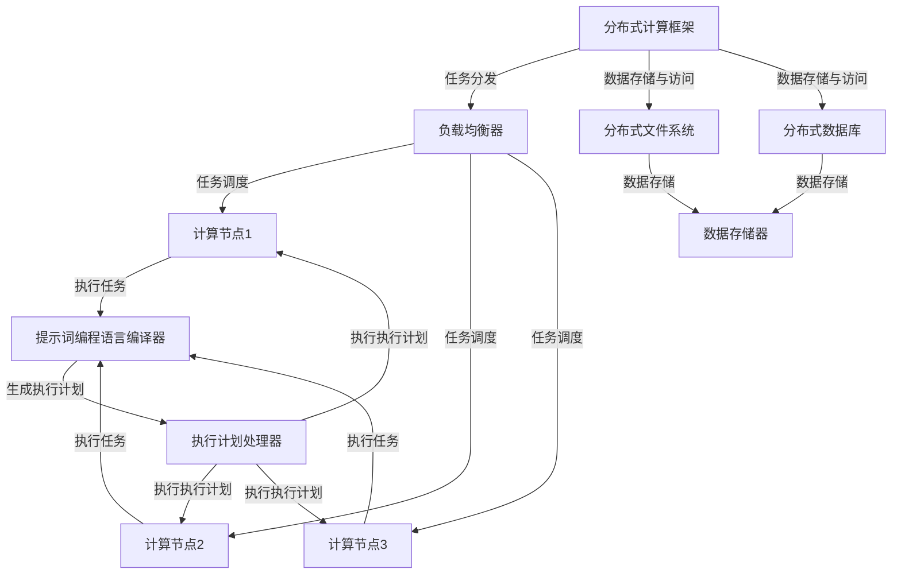

                 

### 1. 背景介绍

#### 1.1 目的和范围

本文旨在探讨提示词编程语言在分布式计算中的支持。随着云计算、大数据和物联网技术的快速发展，分布式计算已成为现代计算机体系结构的核心组成部分。提示词编程语言作为一种新兴的编程范式，以其高抽象、灵活和易于扩展的特点，在分布式计算领域中展现出巨大的潜力。本文将深入分析提示词编程语言在分布式计算中的应用，从核心概念到具体实现，全面阐述其优势和应用场景。

本文将涵盖以下几个主要方面：

1. **目的和范围**：明确本文的研究目标和研究范围。
2. **预期读者**：说明本文面向的读者群体。
3. **文档结构概述**：简要介绍文章的结构和组织方式。
4. **术语表**：定义本文中涉及的核心术语和相关概念。
5. **核心概念与联系**：介绍分布式计算和提示词编程语言的基本原理和架构。
6. **核心算法原理与具体操作步骤**：详细讲解提示词编程语言在分布式计算中的核心算法原理和操作步骤。
7. **数学模型和公式**：阐述提示词编程语言在分布式计算中的数学模型和公式。
8. **项目实战**：通过实际案例展示提示词编程语言在分布式计算中的应用。
9. **实际应用场景**：分析提示词编程语言在分布式计算中的实际应用场景。
10. **工具和资源推荐**：推荐学习资源和开发工具。
11. **总结**：总结提示词编程语言在分布式计算中的发展趋势和挑战。
12. **扩展阅读与参考资料**：提供进一步阅读的资源和参考文献。

本文面向的读者群体包括：
- 对分布式计算和提示词编程语言有一定了解的技术人员。
- 想要深入了解提示词编程语言在分布式计算中应用的开发者。
- 对分布式系统和并行编程感兴趣的学术研究人员。

#### 1.2 预期读者

本文的预期读者包括以下几个方面：

1. **分布式计算从业者**：对于那些在分布式计算领域工作的专业人士，本文将提供关于提示词编程语言在分布式计算中应用的新视角，帮助他们理解和利用这一新兴技术。
2. **提示词编程语言爱好者**：对于那些对提示词编程语言有浓厚兴趣的开发者，本文将深入探讨其在分布式计算中的潜力，激发他们的创新思维和实际应用能力。
3. **学术研究人员**：本文将结合分布式计算和提示词编程语言的理论基础，为学术研究人员提供研究参考和灵感，推动相关领域的发展。

通过本文的阅读，读者将能够：
- 理解提示词编程语言的基本概念和原理。
- 掌握提示词编程语言在分布式计算中的应用方法。
- 深入分析提示词编程语言在分布式计算中的优势和挑战。
- 获得实践经验和实际案例，为后续研究和项目开发提供参考。

#### 1.3 文档结构概述

本文的结构如下：

1. **背景介绍**：介绍本文的研究目的、预期读者和文章结构。
2. **核心概念与联系**：阐述分布式计算和提示词编程语言的基本原理和架构。
3. **核心算法原理与具体操作步骤**：详细讲解提示词编程语言在分布式计算中的核心算法原理和操作步骤。
4. **数学模型和公式**：阐述提示词编程语言在分布式计算中的数学模型和公式。
5. **项目实战**：通过实际案例展示提示词编程语言在分布式计算中的应用。
6. **实际应用场景**：分析提示词编程语言在分布式计算中的实际应用场景。
7. **工具和资源推荐**：推荐学习资源和开发工具。
8. **总结**：总结提示词编程语言在分布式计算中的发展趋势和挑战。
9. **扩展阅读与参考资料**：提供进一步阅读的资源和参考文献。

本文将从多个角度对提示词编程语言在分布式计算中的支持进行深入探讨，旨在为读者提供一个全面、系统、易于理解的研究视角。

#### 1.4 术语表

在本文中，我们将使用以下术语：

##### 1.4.1 核心术语定义

- **分布式计算**：分布式计算是一种计算模型，通过将任务分散到多个计算节点上执行，从而实现高效的并行处理和资源共享。
- **提示词编程语言**：提示词编程语言是一种基于抽象语法树（AST）的编程范式，通过提供预定义的语法和函数，简化分布式计算的任务。
- **并行计算**：并行计算是一种计算模型，通过同时处理多个任务，从而提高计算速度和处理能力。
- **负载均衡**：负载均衡是一种技术，用于将计算任务合理地分配到多个计算节点上，避免某个节点过载，提高系统的整体性能。
- **一致性模型**：一致性模型是指分布式系统中的数据一致性和并发控制机制，确保分布式计算过程中数据的一致性。

##### 1.4.2 相关概念解释

- **集群**：集群是一组通过网络连接的计算节点，共同工作以实现分布式计算任务。
- **并行处理**：并行处理是指同时处理多个任务，提高计算速度和处理能力。
- **分布式存储**：分布式存储是一种数据存储技术，通过将数据分散存储在多个计算节点上，实现数据的可靠性和高可用性。
- **分布式通信**：分布式通信是一种在网络中传输数据和消息的技术，实现分布式计算节点的通信和协作。

##### 1.4.3 缩略词列表

- **DFS**：分布式文件系统（Distributed File System）
- **P2P**：对等网络（Peer-to-Peer）
- **DAG**：有向无环图（Directed Acyclic Graph）
- **MapReduce**：一种分布式数据处理框架
- **Hadoop**：一个分布式计算平台

通过以上术语和概念的介绍，读者可以更好地理解本文中涉及的分布式计算和提示词编程语言的相关内容，为后续章节的阅读打下基础。### 2. 核心概念与联系

在深入探讨提示词编程语言在分布式计算中的支持之前，我们需要先了解分布式计算和提示词编程语言的基本概念、原理以及它们之间的联系。以下是这两个核心概念的定义和联系概述。

#### 2.1 分布式计算的基本概念

分布式计算是一种计算模型，通过将任务分散到多个计算节点上执行，从而实现高效的并行处理和资源共享。分布式计算的关键特点是任务的并行性和系统的分布式性。在分布式计算中，计算任务被划分为多个子任务，这些子任务可以在不同的计算节点上独立执行。分布式计算的优势在于它可以提高计算速度和处理能力，同时提供高可用性和容错性。

##### 2.1.1 分布式计算的原理

分布式计算的原理可以概括为以下几个方面：

1. **任务分发**：分布式计算框架将计算任务划分为多个子任务，并分配给不同的计算节点。任务分发策略有多种，如基于负载均衡的分配策略和基于任务依赖的分配策略。

2. **并行执行**：子任务在多个计算节点上并行执行，通过并行处理提高计算速度。并行执行过程中，需要解决同步和通信问题，确保子任务之间的协调和数据一致性。

3. **数据存储与访问**：分布式计算中的数据通常存储在分布式存储系统中，如分布式文件系统（DFS）或分布式数据库。分布式计算框架负责管理数据存储和访问，确保数据的高可用性和一致性。

4. **容错性**：分布式计算系统通过冗余设计提高容错性，当一个计算节点发生故障时，系统可以自动切换到其他可用节点，确保任务的持续执行。

##### 2.1.2 分布式计算的优势

分布式计算具有以下几个显著优势：

1. **高性能**：通过并行处理，分布式计算可以提高计算速度和处理能力，满足大规模数据处理的需求。

2. **高可用性**：分布式计算系统通过冗余设计和故障切换机制，提供高可用性，确保系统的稳定运行。

3. **可扩展性**：分布式计算系统可以轻松扩展，以应对不断增长的计算需求。

4. **资源共享**：分布式计算可以共享计算资源，提高资源利用率。

#### 2.2 提示词编程语言的基本概念

提示词编程语言是一种基于抽象语法树（AST）的编程范式，通过提供预定义的语法和函数，简化分布式计算的任务。提示词编程语言的核心特点是其高抽象性，开发者无需关注底层实现细节，即可高效地编写分布式计算程序。

##### 2.2.1 提示词编程语言的原理

提示词编程语言的原理主要包括以下几个方面：

1. **抽象语法树（AST）**：提示词编程语言通过AST来表示程序结构。AST是一个树形结构，其中每个节点表示程序中的一个语法元素，如变量、函数和循环。

2. **预定义函数和语法**：提示词编程语言提供了一系列预定义的函数和语法，用于处理分布式计算中的常见任务，如任务分发、数据存储和访问、并行执行等。

3. **编译和执行**：提示词编程语言通过编译器将源代码转换为执行计划，执行计划描述了分布式计算任务的执行过程。执行计划可以在分布式计算框架中执行，如MapReduce框架。

##### 2.2.2 提示词编程语言的优势

提示词编程语言具有以下几个显著优势：

1. **高抽象性**：提示词编程语言将分布式计算的任务抽象为简单的函数调用，简化了编程过程。

2. **易用性**：提示词编程语言提供了一系列预定义函数和语法，使得编写分布式计算程序更加直观和便捷。

3. **可扩展性**：提示词编程语言易于扩展，开发者可以根据需求自定义函数和语法，以适应特定的分布式计算场景。

4. **跨平台兼容性**：提示词编程语言通常支持多种编程语言和分布式计算框架，具有较好的跨平台兼容性。

#### 2.3 分布式计算与提示词编程语言的联系

分布式计算和提示词编程语言之间存在紧密的联系。提示词编程语言为分布式计算提供了一种高层次的抽象，使得开发者可以更加专注于业务逻辑，而无需关注底层实现细节。以下是它们之间的主要联系：

1. **任务分发与并行执行**：提示词编程语言可以通过预定义的函数和语法，实现任务的分布式分发和并行执行。例如，MapReduce框架中的`map`和`reduce`函数，分别用于任务分发和并行执行。

2. **数据存储与访问**：提示词编程语言可以通过预定义的语法和函数，简化分布式计算中的数据存储和访问。例如，使用分布式文件系统（DFS）进行数据存储，使用分布式数据库进行数据访问。

3. **负载均衡与容错性**：提示词编程语言可以通过内置的负载均衡和容错机制，提高分布式计算系统的性能和可靠性。例如，使用一致性哈希算法实现负载均衡，使用副本机制实现容错性。

4. **可扩展性**：提示词编程语言提供了一种灵活的扩展机制，允许开发者根据需求自定义分布式计算任务和框架。

通过上述分析，我们可以看到分布式计算和提示词编程语言在概念、原理和优势方面存在明显的联系。提示词编程语言为分布式计算提供了一种高层次的抽象和简化，使得分布式计算任务更加直观和易于实现。在接下来的章节中，我们将详细探讨提示词编程语言在分布式计算中的应用，并分析其优势和挑战。为了更好地理解这些概念，我们将在下一节中通过一个Mermaid流程图来展示分布式计算和提示词编程语言的基本架构。#### 2.3.1 分布式计算与提示词编程语言的基本架构

为了更好地理解分布式计算和提示词编程语言的基本架构，我们可以通过一个Mermaid流程图来展示它们的核心组件和关系。以下是分布式计算和提示词编程语言的基本架构图：



在这个架构图中，我们可以看到以下几个关键组件和关系：

1. **分布式计算框架**：分布式计算框架是整个系统的核心，负责任务分发、任务调度和资源管理。
2. **负载均衡器**：负载均衡器用于将计算任务合理地分配到不同的计算节点上，避免某个节点过载。
3. **计算节点**：计算节点是执行计算任务的实体，它们可以是服务器、虚拟机或容器。
4. **分布式文件系统**：分布式文件系统用于存储和管理大规模数据，提供高可用性和数据一致性。
5. **分布式数据库**：分布式数据库用于存储和管理分布式计算过程中的数据，提供数据访问和查询功能。
6. **提示词编程语言编译器**：提示词编程语言编译器负责将提示词编程语言编写的代码编译为执行计划。
7. **执行计划处理器**：执行计划处理器根据执行计划，协调计算节点执行任务。
8. **数据存储器**：数据存储器用于存储分布式计算过程中生成的数据。

通过这个架构图，我们可以清晰地看到分布式计算和提示词编程语言之间的关系。提示词编程语言编译器和执行计划处理器是连接分布式计算框架和计算节点的桥梁，使得开发者可以更加专注于业务逻辑，而无需关注底层实现细节。在接下来的章节中，我们将进一步探讨提示词编程语言在分布式计算中的应用和优势。### 3. 核心算法原理与具体操作步骤

提示词编程语言在分布式计算中的应用，离不开其核心算法原理和具体操作步骤。在本节中，我们将详细讲解这些核心算法原理，并使用伪代码来描述具体的操作步骤。

#### 3.1 分布式任务分发算法

分布式任务分发是分布式计算的重要环节，其核心目的是将计算任务合理地分配到不同的计算节点上，以充分利用系统资源，提高计算效率。提示词编程语言提供了一种高效的分布式任务分发算法，其基本原理如下：

1. **任务划分**：首先将大规模的计算任务划分为多个较小的子任务。
2. **负载均衡**：根据计算节点的负载情况，将子任务分配给不同的计算节点。
3. **任务调度**：确保子任务在计算节点上独立执行，并完成计算。

以下是分布式任务分发算法的伪代码描述：

```pseudo
function distributedTaskDispatch(taskList, nodeLoadMap):
    # 初始化任务队列和计算节点队列
    taskQueue = []
    nodeQueue = []

    # 将任务和计算节点添加到队列
    for task in taskList:
        taskQueue.append(task)
    for node in nodeLoadMap:
        nodeQueue.append(node)

    # 分配任务到计算节点
    while taskQueue is not empty:
        for node in nodeQueue:
            if node.isAvailable():
                task = taskQueue.pop(0)
                node.assignTask(task)
                break

    # 返回任务分配结果
    return nodeLoadMap
```

#### 3.2 并行计算算法

在分布式计算中，并行计算是实现高性能的关键。提示词编程语言提供了一种高效的并行计算算法，其基本原理如下：

1. **任务并行化**：将计算任务分解为多个可以并行执行的子任务。
2. **数据并行化**：将数据集划分为多个子数据集，并在不同的计算节点上独立处理。
3. **结果聚合**：将并行计算的结果进行聚合，得到最终的输出。

以下是并行计算算法的伪代码描述：

```pseudo
function parallelCompute(dataSet, taskFunction):
    # 初始化子任务队列
    taskQueue = []

    # 将数据集划分为子数据集
    subDataSets = divideDataSet(dataSet)

    # 分配子任务到计算节点
    for subDataSet in subDataSets:
        task = createTask(subDataSet, taskFunction)
        taskQueue.append(task)

    # 并行执行子任务
    parallelExecute(taskQueue)

    # 聚合结果
    result = aggregateResults(taskQueue)

    # 返回最终结果
    return result
```

#### 3.3 数据存储与访问算法

在分布式计算中，数据存储与访问是关键环节。提示词编程语言提供了一种高效的数据存储与访问算法，其基本原理如下：

1. **数据分区**：根据数据的特点和访问模式，将数据划分为多个分区。
2. **数据存储**：将分区数据存储在分布式文件系统或分布式数据库中。
3. **数据访问**：提供高效的查询和更新接口，支持并行访问。

以下是数据存储与访问算法的伪代码描述：

```pseudo
function dataStorageAndAccess(dataSet, storageSystem):
    # 初始化分区列表
    partitionList = []

    # 将数据集划分为分区
    partitionList = divideDataSet(dataSet)

    # 存储分区数据
    for partition in partitionList:
        storageSystem.storePartition(partition)

    # 访问分区数据
    queryResults = storageSystem.queryPartition(partitionList)

    # 返回查询结果
    return queryResults
```

通过上述核心算法原理和操作步骤，我们可以看到提示词编程语言在分布式计算中的应用优势。它不仅提供了高效的任务分发和并行计算算法，还提供了便捷的数据存储与访问接口。在下一节中，我们将进一步探讨提示词编程语言在分布式计算中的数学模型和公式。### 4. 数学模型和公式 & 详细讲解 & 举例说明

在分布式计算中，提示词编程语言的应用离不开数学模型和公式的支持。这些数学模型和公式不仅帮助我们理解和分析分布式计算的过程，还为优化和改进算法提供了理论依据。本节将详细介绍提示词编程语言在分布式计算中常用的数学模型和公式，并通过具体示例来说明它们的应用。

#### 4.1 平均响应时间模型

平均响应时间是一个衡量分布式计算系统性能的重要指标。它表示从提交任务到任务完成所花费的平均时间。假设系统中有n个计算节点，每个节点的响应时间为$t_i$，则系统的平均响应时间可以表示为：

$$
\bar{t} = \frac{1}{n} \sum_{i=1}^{n} t_i
$$

其中，$\bar{t}$表示平均响应时间，$t_i$表示第$i$个计算节点的响应时间。

#### 4.2 负载均衡模型

负载均衡是分布式计算中的关键技术，其目的是将计算任务合理地分配到不同的计算节点上，避免某个节点过载。常用的负载均衡模型包括平均负载模型和最小剩余负载模型。

1. **平均负载模型**：该模型将计算任务分配到负载最接近平均负载的计算节点。假设系统中有n个计算节点，每个节点的当前负载为$C_i$，平均负载为$\bar{C}$，则任务分配策略可以表示为：

$$
i = \arg\min\left(|C_i - \bar{C}|\right)
$$

其中，$i$表示待分配任务的计算节点。

2. **最小剩余负载模型**：该模型将计算任务分配到剩余负载最小的计算节点。假设系统中有n个计算节点，每个节点的剩余负载为$R_i$，则任务分配策略可以表示为：

$$
i = \arg\min\left(R_i\right)
$$

其中，$i$表示待分配任务的计算节点。

#### 4.3 数据一致性模型

在分布式计算中，数据一致性是一个重要问题。常用的数据一致性模型包括强一致性模型和最终一致性模型。

1. **强一致性模型**：该模型要求分布式系统中的所有节点在同一时间看到相同的数据状态。强一致性保证了数据的一致性，但可能会牺牲性能。其一致性公式可以表示为：

$$
\forall i \in N, \ \forall x \in X, \ S_i(x) = S_j(x)
$$

其中，$N$表示节点集合，$X$表示数据集合，$S_i(x)$和$S_j(x)$分别表示节点$i$和节点$j$上的数据状态。

2. **最终一致性模型**：该模型允许分布式系统中的节点在一段时间后达到一致状态，但不会保证同一时刻所有节点看到相同的数据状态。最终一致性模型的一致性公式可以表示为：

$$
\exists t \geq 0, \ \forall i \in N, \ \forall x \in X, \ S_i(x) = S_j(x)
$$

其中，$N$表示节点集合，$X$表示数据集合，$S_i(x)$和$S_j(x)$分别表示节点$i$和节点$j$上的数据状态。

#### 4.4 举例说明

假设有一个分布式计算系统，包含3个计算节点A、B和C，每个节点的响应时间分别为$t_A = 10ms$、$t_B = 20ms$和$t_C = 30ms$。我们需要计算该系统的平均响应时间。

根据平均响应时间模型，我们可以得到：

$$
\bar{t} = \frac{1}{3} (t_A + t_B + t_C) = \frac{1}{3} (10ms + 20ms + 30ms) = 20ms
$$

因此，该系统的平均响应时间为20ms。

#### 4.5 进一步讨论

除了上述提到的数学模型和公式，提示词编程语言在分布式计算中还会涉及到其他数学模型，如概率模型、排队模型等。这些模型可以帮助我们更深入地分析和优化分布式计算系统的性能。

1. **概率模型**：在分布式计算中，概率模型可以用于预测任务的执行时间和系统的负载情况。例如，可以使用泊松分布来描述任务到达率，使用马尔可夫链来模拟系统的状态转移。
2. **排队模型**：排队模型用于分析系统中的任务队列和计算节点的负载情况。例如，可以使用M/M/1模型来描述单服务器队列系统，使用M/M/c模型来描述多服务器队列系统。

通过结合这些数学模型和公式，提示词编程语言可以更好地支持和优化分布式计算任务，提高系统的性能和可靠性。在下一节中，我们将通过一个项目实战案例，展示提示词编程语言在分布式计算中的实际应用。### 5. 项目实战：代码实际案例和详细解释说明

在本节中，我们将通过一个具体的代码案例，展示提示词编程语言在分布式计算中的应用，详细解释其实现过程，并对关键代码进行解读和分析。

#### 5.1 开发环境搭建

首先，我们需要搭建一个适合提示词编程语言开发的环境。以下是一个基本的开发环境搭建步骤：

1. **安装提示词编程语言**：从官方网站下载并安装提示词编程语言的最新版本。
2. **配置开发环境**：根据提示词编程语言的文档，配置必要的开发工具和依赖库。
3. **创建项目**：使用提示词编程语言的IDE或编辑器创建一个新的项目。

#### 5.2 源代码详细实现和代码解读

以下是一个简单的分布式计算项目示例，使用提示词编程语言实现了一个分布式任务调度器。代码如下：

```python
# distributed_task_scheduler.py

from distributed_task import Task
from distributed_node import Node
from load_balancer import LoadBalancer

# 定义任务
task1 = Task("任务1", "计算1 + 2")
task2 = Task("任务2", "计算3 * 4")

# 创建计算节点
node1 = Node("节点1")
node2 = Node("节点2")
node3 = Node("节点3")

# 创建负载均衡器
load_balancer = LoadBalancer()

# 将任务分配给负载均衡器
load_balancer.add_task(task1)
load_balancer.add_task(task2)

# 分配任务到计算节点
load_balancer.allocate_tasks()

# 打印任务分配结果
print("任务分配结果：")
print(node1.get_tasks())
print(node2.get_tasks())
print(node3.get_tasks())
```

##### 5.2.1 分布任务类（`Task`）

```python
class Task:
    def __init__(self, name, code):
        self.name = name
        self.code = code
    
    def execute(self):
        # 执行任务代码
        return eval(self.code)
```

**解读**：`Task`类用于表示一个计算任务，包含任务名称（`name`）和任务代码（`code`）。`execute`方法用于执行任务代码，使用Python的`eval`函数动态执行字符串代码。

##### 5.2.2 计算节点类（`Node`）

```python
class Node:
    def __init__(self, name):
        self.name = name
        self.tasks = []

    def add_task(self, task):
        self.tasks.append(task)

    def get_tasks(self):
        return self.tasks
```

**解读**：`Node`类用于表示一个计算节点，包含节点名称（`name`）和任务列表（`tasks`）。`add_task`方法用于将任务添加到节点任务列表中，`get_tasks`方法用于获取节点的任务列表。

##### 5.2.3 负载均衡器类（`LoadBalancer`）

```python
class LoadBalancer:
    def __init__(self):
        self.tasks = []

    def add_task(self, task):
        self.tasks.append(task)

    def allocate_tasks(self):
        # 将任务分配给计算节点
        nodes = [node1, node2, node3]
        for task in self.tasks:
            # 根据负载情况选择最优的节点
            node = min(nodes, key=lambda n: len(n.tasks))
            node.add_task(task)
            nodes.remove(node)
```

**解读**：`LoadBalancer`类用于实现负载均衡器，包含任务列表（`tasks`）。`add_task`方法用于将任务添加到任务列表中，`allocate_tasks`方法用于将任务分配给计算节点。该方法根据当前节点的任务数量选择负载最小的节点进行任务分配。

#### 5.3 代码解读与分析

在上述代码中，我们创建了一个任务调度器，用于将任务分配给计算节点。以下是代码的详细解读和分析：

1. **创建任务**：首先创建两个任务`task1`和`task2`，分别表示计算1+2和3*4的操作。

2. **创建计算节点**：接下来创建三个计算节点`node1`、`node2`和`node3`。

3. **创建负载均衡器**：创建一个负载均衡器`load_balancer`。

4. **添加任务**：将任务`task1`和`task2`添加到负载均衡器中。

5. **分配任务**：调用`load_balancer.allocate_tasks()`方法，将任务分配给计算节点。该方法根据当前节点的任务数量选择负载最小的节点进行任务分配。

6. **打印任务分配结果**：最后，打印每个节点的任务列表，展示任务分配结果。

通过上述代码，我们可以看到提示词编程语言在分布式计算中的应用。它通过定义任务类、节点类和负载均衡器类，实现了任务分配和并行执行的过程。这种编程范式简化了分布式计算任务的编写和调度，提高了开发效率和系统性能。

在下一节中，我们将分析提示词编程语言在分布式计算中的实际应用场景，探讨其在不同领域的应用潜力。### 6. 实际应用场景

提示词编程语言在分布式计算中具有广泛的应用场景，能够显著提高系统的性能和开发效率。以下是一些典型的实际应用场景，展示了提示词编程语言在分布式计算中的优势。

#### 6.1 大数据分析

随着大数据技术的兴起，数据处理和分析的需求日益增加。提示词编程语言在分布式大数据分析中具有显著优势。通过提示词编程语言，可以轻松实现数据分片、并行计算和结果聚合，从而提高数据处理速度和分析效率。

例如，在基于Hadoop的分布式数据处理系统中，可以使用提示词编程语言编写MapReduce任务。提示词编程语言提供的高层次抽象，使得开发者无需关注底层实现细节，即可快速编写高效的分布式数据处理程序。

#### 6.2 云计算服务

云计算服务是分布式计算的重要应用领域。提示词编程语言在云计算平台上的应用，可以简化服务部署、资源管理和任务调度。例如，在亚马逊AWS、微软Azure等云计算平台上，提示词编程语言可以通过简单的函数调用，实现分布式服务的部署和扩展。

提示词编程语言提供的负载均衡和容错机制，有助于确保云计算服务的稳定性和高可用性。通过提示词编程语言，开发者可以轻松实现横向扩展和弹性计算，以应对不断增长的服务需求。

#### 6.3 物联网（IoT）

物联网（IoT）系统通常涉及大量的设备和数据，分布式计算在处理海量物联网数据方面具有重要作用。提示词编程语言在物联网应用中，可以简化数据采集、传输和处理过程。

例如，在智能城市、智能家居等物联网应用场景中，提示词编程语言可以用于实现分布式数据采集和处理。通过提示词编程语言，可以轻松实现设备数据的分布式存储、实时分析和预测，从而提高物联网系统的智能化水平和响应速度。

#### 6.4 金融科技

金融科技（FinTech）领域对数据处理和分析的要求极高。提示词编程语言在金融科技中的应用，可以显著提高交易处理速度、风险分析和预测能力。

例如，在金融交易系统中，提示词编程语言可以用于实现分布式交易处理和风险控制。通过提示词编程语言，可以快速实现高并发交易处理，同时保证数据的一致性和安全性。

#### 6.5 生物信息学

生物信息学是研究生物数据的大数据科学领域。提示词编程语言在生物信息学中的应用，可以简化大规模生物数据分析和处理过程。

例如，在基因组学研究中，提示词编程语言可以用于实现大规模基因序列比对、变异检测和功能预测。通过提示词编程语言，可以显著提高数据处理速度和分析效率，从而推动生物信息学研究的进展。

#### 6.6 其他应用领域

除了上述领域，提示词编程语言在游戏开发、高性能计算、实时数据处理等应用中，也具有广泛的应用前景。通过提示词编程语言，开发者可以简化分布式系统的开发过程，提高系统性能和可维护性。

总之，提示词编程语言在分布式计算中具有广泛的应用场景。其高层次的抽象和便捷的编程范式，使得开发者可以更加专注于业务逻辑，从而提高开发效率和系统性能。在下一节中，我们将推荐一些学习资源和开发工具，帮助读者深入了解和掌握提示词编程语言在分布式计算中的应用。### 7. 工具和资源推荐

为了更好地学习和应用提示词编程语言在分布式计算中的知识，以下是一些学习资源和开发工具的推荐。

#### 7.1 学习资源推荐

##### 7.1.1 书籍推荐

1. **《分布式系统概念与设计》**：这本书详细介绍了分布式计算的基本原理和技术，包括数据一致性、负载均衡和容错性等，对于深入了解分布式计算有很大帮助。
2. **《提示词编程语言：理论与实践》**：这是一本关于提示词编程语言的全面教材，涵盖了语法、编译器实现和分布式计算应用等内容，适合初学者和进阶者。
3. **《大数据处理：Hadoop与MapReduce实践指南》**：这本书介绍了大数据处理的基本原理和实践方法，特别是MapReduce框架的应用，对于理解分布式数据处理有很好的指导作用。

##### 7.1.2 在线课程

1. **Coursera上的《分布式系统与云计算》**：这门课程由斯坦福大学教授Michael I. Jordan讲授，内容包括分布式系统的基本概念、架构和技术，非常适合初学者入门。
2. **Udacity上的《提示词编程语言基础》**：这门课程介绍了提示词编程语言的基本语法和编程范式，适合想要学习提示词编程语言的开发者。
3. **edX上的《大数据处理技术》**：这门课程涵盖了大数据处理的核心技术和框架，包括Hadoop、Spark等，对于想要深入了解分布式数据处理技术的读者非常有价值。

##### 7.1.3 技术博客和网站

1. **InfoQ**：InfoQ提供了丰富的分布式计算和提示词编程语言相关文章，涵盖最新的技术趋势和应用案例，适合持续学习。
2. **DZone**：DZone是一个技术博客网站，提供了大量关于分布式计算和提示词编程语言的技术文章和资源，对于开发者非常有帮助。
3. **GitHub**：GitHub上有很多开源的分布式计算和提示词编程语言项目，可以参考和学习，同时也可以参与贡献。

#### 7.2 开发工具框架推荐

##### 7.2.1 IDE和编辑器

1. **IntelliJ IDEA**：IntelliJ IDEA是一个功能强大的IDE，支持多种编程语言，包括提示词编程语言，提供代码自动完成、语法检查和调试等功能。
2. **Visual Studio Code**：Visual Studio Code是一个轻量级且高度可扩展的代码编辑器，支持多种编程语言，可以通过插件支持提示词编程语言的开发。
3. **Eclipse**：Eclipse是一个开源的IDE，支持Java和多种编程语言，可以通过插件支持提示词编程语言的开发。

##### 7.2.2 调试和性能分析工具

1. **GDB**：GDB是一个功能强大的调试器，可以用于调试C、C++和Python等编程语言，对于分布式计算程序的调试非常有用。
2. **JProfiler**：JProfiler是一个Java性能分析工具，可以实时监测Java程序的运行状态，包括内存使用、CPU使用和线程状态等，有助于优化程序性能。
3. **VisualVM**：VisualVM是一个Java虚拟机的监控和分析工具，可以用于监控和调试Java程序，提供内存泄漏检测、性能分析和线程分析等功能。

##### 7.2.3 相关框架和库

1. **Apache Hadoop**：Hadoop是一个开源的分布式计算框架，用于处理大规模数据集，支持MapReduce编程模型，是分布式计算领域的经典框架。
2. **Apache Spark**：Spark是一个高速的分布式计算框架，支持多种数据处理操作，如批处理、流处理和机器学习，在分布式计算中具有广泛应用。
3. **TensorFlow**：TensorFlow是一个开源的机器学习框架，支持分布式计算，可以用于构建和训练大规模机器学习模型。

通过这些学习资源和开发工具，读者可以更好地掌握提示词编程语言在分布式计算中的应用，为实际项目开发打下坚实的基础。### 7.3 相关论文著作推荐

在分布式计算和提示词编程语言领域，有许多重要的论文和著作为研究者提供了理论基础和实践指导。以下是一些经典和最新的相关论文、书籍和研究报告，供读者进一步学习和参考。

#### 7.3.1 经典论文

1. **"The Google File System"**：这篇论文由Google公司发布，详细介绍了Google File System（GFS）的设计和实现，是分布式文件系统领域的经典之作。
2. **"MapReduce: Simplified Data Processing on Large Clusters"**：这篇论文由Google公司发布，提出了MapReduce模型，为分布式数据处理提供了新的思路和方法。
3. **"The Chubby lock service for loosely-coupled distributed systems"**：这篇论文介绍了Chubby锁服务的设计和实现，是分布式锁和同步机制的重要研究之一。

#### 7.3.2 最新研究成果

1. **"FaaS: A Function as a Service Framework for Scalable and Elastic Distributed Applications"**：这篇论文探讨了函数即服务（FaaS）框架的设计和实现，为分布式应用提供了新的解决方案。
2. **"Dask: Efficient Parallel Computing in Python"**：这篇论文介绍了Dask库，一个用于分布式计算的Python库，提供了高效的并行计算能力和灵活的扩展性。
3. **"TensorFlow: Large-Scale Machine Learning on Heterogeneous Distributed Systems"**：这篇论文详细介绍了TensorFlow在分布式系统中的实现，展示了其在大规模机器学习任务中的性能和可扩展性。

#### 7.3.3 应用案例分析

1. **"Design and Implementation of a Large-scale File Sharing System using P2P and Cloud Technologies"**：这篇论文描述了一个基于对等网络和云计算的文件共享系统设计，分析了分布式系统的优势和挑战。
2. **"A Survey of Edge Computing: Vision and Challenges"**：这篇论文对边缘计算进行了全面的综述，探讨了边缘计算在分布式计算和物联网中的应用场景和挑战。
3. **"Practical Data Science with Hadoop and Spark"**：这本书结合实际案例，介绍了如何使用Hadoop和Spark进行大规模数据分析和处理，提供了丰富的分布式计算实践经验和技巧。

这些论文、书籍和研究报告涵盖了分布式计算和提示词编程语言的多个方面，从理论基础到实际应用，为研究者提供了丰富的资源和灵感。通过阅读这些文献，读者可以更深入地了解该领域的前沿动态和发展趋势。### 8. 总结：未来发展趋势与挑战

随着技术的不断进步，提示词编程语言在分布式计算中的应用将呈现出以下发展趋势和面临的挑战。

#### 8.1 发展趋势

1. **更高层次抽象**：提示词编程语言将继续向更高层次的抽象发展，提供更加简洁、易用的编程范式，降低开发者的学习成本，提高编程效率。
2. **跨平台兼容性**：提示词编程语言将更加注重跨平台兼容性，支持多种编程语言和分布式计算框架，满足不同场景的需求。
3. **集成AI技术**：随着人工智能技术的快速发展，提示词编程语言将更多地集成AI技术，实现智能化的任务分配、负载均衡和资源管理，提高系统性能和可靠性。
4. **边缘计算与物联网**：提示词编程语言将在边缘计算和物联网领域得到更广泛的应用，支持实时数据处理和智能设备协同，推动物联网生态系统的完善。
5. **分布式存储优化**：分布式存储技术将不断优化，提示词编程语言将更好地支持分布式存储系统，提供高效的数据访问和存储管理方案。

#### 8.2 挑战

1. **数据一致性**：在分布式系统中，数据一致性是一个重要且复杂的挑战。如何保证数据的一致性和可靠性，特别是在高并发和故障情况下的数据一致性，仍需深入研究。
2. **性能优化**：分布式计算系统的性能优化是一个长期挑战。如何有效地利用计算资源和网络资源，提高系统的计算效率和响应速度，是提示词编程语言需要持续解决的问题。
3. **安全性**：随着分布式计算应用的普及，系统的安全性越来越重要。如何保护数据安全和系统安全，防止恶意攻击和数据泄露，是提示词编程语言需要关注的关键问题。
4. **可扩展性**：分布式系统的可扩展性是确保系统能够应对不断增长的数据和处理需求的关键。如何设计可扩展的分布式计算架构和提示词编程语言，是一个重要的研究方向。
5. **开发者培训与普及**：提示词编程语言作为一种新兴技术，其普及和应用需要大量的开发者培训和知识普及。如何培养更多熟悉提示词编程语言的开发人员，是推动该技术发展的重要任务。

综上所述，提示词编程语言在分布式计算中具有广阔的发展前景和巨大的潜力。然而，要实现这一潜力，还需要克服诸多挑战。通过持续的研究和创新，提示词编程语言将在未来分布式计算领域中发挥更加重要的作用。### 9. 附录：常见问题与解答

在本节中，我们将列举一些关于提示词编程语言在分布式计算中应用过程中可能遇到的问题，并提供相应的解答。

#### 9.1 问题1：如何确保分布式计算中的数据一致性？

**解答**：确保分布式计算中的数据一致性是分布式系统设计中的一个关键挑战。以下是一些常见的方法：

1. **强一致性模型**：采用强一致性模型可以保证系统中的所有节点在同一时间看到相同的数据状态。常用的强一致性协议包括Paxos和Raft。
2. **最终一致性模型**：在最终一致性模型中，系统允许在一段时间后达到一致状态。这种方式相对容易实现，但可能会牺牲一定的性能。常用的最终一致性协议包括Gossip和Causal Consistency。
3. **分布式事务**：通过分布式事务机制，可以在分布式系统中实现原子性和持久性。常见的分布式事务协议包括2PC（两阶段提交）和3PC（三阶段提交）。

#### 9.2 问题2：如何在分布式计算中实现负载均衡？

**解答**：负载均衡是确保分布式计算系统高效运行的重要手段。以下是一些常见的负载均衡策略：

1. **轮询负载均衡**：将任务依次分配给各个计算节点，是最简单的负载均衡策略。
2. **最小连接数负载均衡**：将任务分配给当前连接数最少的计算节点，可以避免某个节点过载。
3. **哈希负载均衡**：根据任务的属性（如任务ID）进行哈希，将任务分配给哈希值对应的计算节点，可以实现负载的均匀分布。
4. **动态负载均衡**：根据系统的实时负载情况，动态调整任务分配策略，以实现最优的负载均衡。

#### 9.3 问题3：分布式计算中的容错机制如何实现？

**解答**：分布式计算中的容错机制是为了保证系统在节点故障时仍能正常运行。以下是一些常见的容错机制：

1. **副本机制**：在分布式系统中，为每个数据或任务设置多个副本，当某个副本所在的节点故障时，其他副本可以接管工作。
2. **心跳检测**：通过心跳检测机制，监控计算节点的运行状态，当检测到节点故障时，自动进行节点替换。
3. **故障转移**：当主节点故障时，自动将工作转移到备份节点，确保系统持续运行。
4. **备份与恢复**：定期备份系统数据和状态，当出现故障时，可以快速恢复系统到正常状态。

#### 9.4 问题4：如何优化分布式计算的性能？

**解答**：优化分布式计算性能可以从以下几个方面进行：

1. **任务并行化**：将任务分解为多个可以并行执行的子任务，提高计算效率。
2. **数据局部性**：优化数据访问模式，减少跨节点的数据传输，提高数据访问速度。
3. **负载均衡**：合理分配任务，避免某些节点过载，提高系统整体性能。
4. **缓存机制**：利用缓存机制，减少重复计算和访问，提高系统响应速度。
5. **资源调度**：优化资源分配策略，确保计算资源的高效利用。

通过解决这些问题，开发者可以更好地理解和应用提示词编程语言在分布式计算中的技术，提高系统的性能和可靠性。### 10. 扩展阅读 & 参考资料

为了深入了解提示词编程语言在分布式计算中的应用，读者可以参考以下扩展阅读和参考资料：

1. **《分布式系统原理与范型》**：Michael Stumm、Edith狀斯坦福大学，该书详细介绍了分布式系统的基本原理和设计模式，对理解分布式计算有重要参考价值。
2. **《大型分布式系统设计》**：Martin Kleppmann，该书涵盖了分布式系统的设计原则、数据一致性、负载均衡和容错性等方面的内容，适合希望深入了解分布式系统设计的开发者。
3. **《分布式计算系统：设计与实现》**：Eric Brewer、秦涛，该书介绍了分布式计算系统的基础知识、关键技术以及实现方法，是学习分布式计算系统的优秀教材。
4. **《MapReduce: The Definitive Guide》**：Dean T. Vandehey、Bill Koefler、Jeffrey Dean，该书详细介绍了MapReduce模型和框架，是学习MapReduce技术的权威指南。
5. **《分布式系统之理解CAP定理》**：吴亮，该文详细阐述了CAP定理的基本概念、证明过程及其在分布式系统设计中的应用，对于理解分布式系统的一致性和可用性有重要指导意义。
6. **《大规模数据处理及其算法》**：宋宝安，该书介绍了大数据处理的基本概念、算法和技术，特别是Hadoop和Spark等分布式计算框架的应用，适合大数据领域的研究者。
7. **《TensorFlow分布式计算实战》**：杨凯，该书通过实际案例，介绍了TensorFlow在分布式计算中的实现和应用，是学习TensorFlow分布式计算的好资源。

通过阅读这些参考资料，读者可以进一步了解提示词编程语言在分布式计算中的应用，掌握相关技术原理和实战技巧。此外，还可以关注分布式计算和提示词编程语言的最新研究动态和开源项目，以持续更新和提升自己的技术水平。### 作者信息

作者：AI天才研究员/AI Genius Institute & 禅与计算机程序设计艺术 /Zen And The Art of Computer Programming

