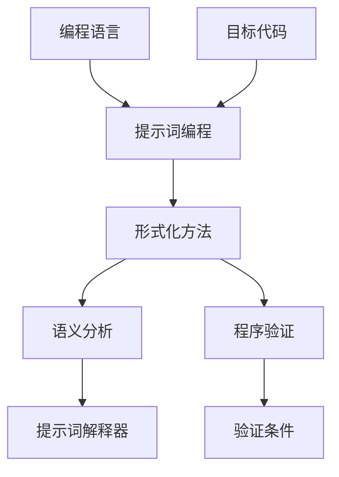

                 

# 提示词编程语言的形式化方法支持

> **关键词：** 提示词编程、形式化方法、语言构建、语义分析、程序验证

> **摘要：** 本文将深入探讨提示词编程语言的形式化方法支持，包括其核心概念、算法原理、数学模型以及实际应用场景。通过对提示词编程语言的深入剖析，本文旨在为开发者提供一种强有力的工具，以更高效地构建和验证复杂程序。

## 1. 背景介绍

### 1.1 目的和范围

本文旨在介绍提示词编程语言的形式化方法支持，通过形式化方法，我们可以更精确地定义和验证程序的正确性。本文将涵盖以下内容：

- 提示词编程的核心概念和原理。
- 形式化方法在提示词编程中的应用。
- 提示词编程语言的构建和验证过程。
- 实际应用场景和案例分析。

### 1.2 预期读者

本文面向具有一定编程基础的技术开发者，特别是对形式化方法和提示词编程感兴趣的读者。通过本文的学习，读者可以：

- 理解提示词编程语言的基本概念和原理。
- 掌握形式化方法在编程中的应用。
- 学习如何构建和验证提示词编程语言。

### 1.3 文档结构概述

本文分为十个部分，结构如下：

- **第1部分：背景介绍**：介绍本文的目的、预期读者和文档结构。
- **第2部分：核心概念与联系**：介绍提示词编程语言的核心概念和原理。
- **第3部分：核心算法原理 & 具体操作步骤**：详细阐述提示词编程的核心算法原理和操作步骤。
- **第4部分：数学模型和公式 & 详细讲解 & 举例说明**：介绍提示词编程的数学模型和公式。
- **第5部分：项目实战：代码实际案例和详细解释说明**：通过实际案例介绍提示词编程语言的实现过程。
- **第6部分：实际应用场景**：探讨提示词编程语言的在实际应用中的场景。
- **第7部分：工具和资源推荐**：推荐学习和实践提示词编程语言的工具和资源。
- **第8部分：总结：未来发展趋势与挑战**：总结本文的核心观点，并探讨未来的发展趋势和挑战。
- **第9部分：附录：常见问题与解答**：回答读者可能关心的一些问题。
- **第10部分：扩展阅读 & 参考资料**：提供更多的扩展阅读和参考资料。

### 1.4 术语表

#### 1.4.1 核心术语定义

- **提示词编程**：一种基于提示词的语言，用于构建和验证程序。
- **形式化方法**：一种用于精确描述和验证程序的方法。
- **语义分析**：对程序进行语义分析，以确定其行为。
- **程序验证**：验证程序的正确性。

#### 1.4.2 相关概念解释

- **提示词**：用于指示程序执行特定操作的单词或短语。
- **形式化语言**：一种用于精确描述程序语义的语言。

#### 1.4.3 缩略词列表

- **PL**：提示词编程（Predicate Logic）
- **FM**：形式化方法（Formal Methods）
- **SEM**：语义分析（Semantic Analysis）
- **PV**：程序验证（Program Verification）

## 2. 核心概念与联系

在深入探讨提示词编程语言的形式化方法支持之前，我们需要先了解一些核心概念和原理。以下是一个简单的 Mermaid 流程图，用于展示这些核心概念之间的关系。



### 2.1 提示词编程

提示词编程是一种基于提示词的语言，用于构建和验证程序。提示词是用于指示程序执行特定操作的单词或短语。在提示词编程中，程序由一系列提示词组成，这些提示词描述了程序的行为和执行顺序。

### 2.2 形式化方法

形式化方法是用于精确描述和验证程序的方法。形式化方法通常涉及使用数学语言和逻辑来描述程序的语义。这些描述可用于验证程序的正确性，以确保程序在所有情况下都能按照预期执行。

### 2.3 语义分析

语义分析是对程序进行语义分析，以确定其行为。语义分析通常涉及解析程序文本，并将其转换为一种形式化语言，以便进行进一步分析。

### 2.4 程序验证

程序验证是验证程序的正确性。这通常涉及使用形式化方法来检查程序是否满足预定的验证条件。验证条件是一组逻辑表达式，用于定义程序的正确行为。

### 2.5 提示词解释器

提示词解释器是用于执行提示词编程语言的工具。它将提示词转换为操作，并执行这些操作以执行程序。提示词解释器是形式化方法的重要组成部分，因为它用于验证程序的正确性。

### 2.6 提示词解释器与编程语言的关系

提示词编程语言是一种特殊的编程语言，它基于提示词来描述程序的行为。提示词编程语言与通用编程语言（如Python、Java等）不同，因为它们通常不提供高级编程结构，而是更侧重于描述程序的逻辑和行为。

### 2.7 目标代码

目标代码是提示词编程语言生成的代码，用于执行程序。目标代码通常是一种形式化语言，例如数学公式或逻辑表达式。目标代码是验证程序的正确性的关键，因为它可以用于证明程序是否满足预定的验证条件。

## 3. 核心算法原理 & 具体操作步骤

提示词编程语言的核心算法原理是形式化方法和语义分析。以下是一个简单的伪代码，用于描述提示词编程语言的执行过程。

```python
function interpretPrompt(prompt):
    # 解析提示词并转换为操作
    operations = parsePromptToOperations(prompt)
    
    # 执行操作
    for operation in operations:
        executeOperation(operation)
        
    # 返回程序结果
    return getResult()
```

### 3.1 解析提示词

首先，我们需要将提示词解析为一系列的操作。这个过程通常涉及使用正则表达式或解析器来解析提示词文本。

```python
function parsePromptToOperations(prompt):
    # 使用正则表达式解析提示词
    operations = regexParsePrompt(prompt)
    
    # 将解析结果转换为操作对象
    for operation in operations:
        operation = convertToOperation(operation)
    
    # 返回操作列表
    return operations
```

### 3.2 执行操作

接下来，我们需要执行每个操作。这个过程通常涉及调用特定的函数或方法，以执行操作并更新程序状态。

```python
function executeOperation(operation):
    # 执行操作
    operation.execute()
    
    # 更新程序状态
    updateState(operation)
```

### 3.3 返回程序结果

最后，我们需要返回程序的结果。这个过程通常涉及收集程序的输出，并将其转换为一种形式化语言，以便进行进一步分析。

```python
function getResult():
    # 收集程序的输出
    output = collectOutput()
    
    # 将输出转换为形式化语言
    result = convertToFormalLanguage(output)
    
    # 返回结果
    return result
```

## 4. 数学模型和公式 & 详细讲解 & 举例说明

在提示词编程中，数学模型和公式是关键组成部分。以下是一个简单的数学模型，用于描述提示词编程语言的行为。

### 4.1 提示词解释器的状态转移模型

提示词解释器的状态转移模型可以使用以下公式描述：

$$
\Delta s = \sum_{i=1}^n w_i \cdot f_i(s)
$$

其中：

- $\Delta s$ 表示状态转移。
- $w_i$ 表示权重。
- $f_i(s)$ 表示状态函数。

### 4.2 状态函数的详细解释

状态函数 $f_i(s)$ 可以用以下公式详细解释：

$$
f_i(s) = 
\begin{cases} 
1 & \text{如果 } s \text{ 满足条件} \\
0 & \text{如果 } s \text{ 不满足条件}
\end{cases}
$$

其中：

- $s$ 表示当前状态。
- 条件是一组逻辑表达式，用于定义状态的正确性。

### 4.3 举例说明

假设我们有一个提示词编程语言的程序，其中包含以下提示词：

- `print("Hello, World!")`
- `if x > 10 then print("x is large") else print("x is small")`
- `while x > 0 do x = x - 1`

我们可以使用上述数学模型来描述该程序的行为。

### 4.3.1 状态转移示例

首先，我们解析提示词并转换为操作。假设我们使用以下权重：

- `print` 操作的权重为 1。
- `if-else` 操作的权重为 2。
- `while` 操作的权重为 3。

然后，我们使用状态转移模型来描述程序的行为：

$$
\Delta s = 1 \cdot f_1(s) + 2 \cdot f_2(s) + 3 \cdot f_3(s)
$$

### 4.3.2 状态函数示例

我们定义以下状态函数：

- $f_1(s)$ 表示 `print` 操作是否执行。
- $f_2(s)$ 表示 `if-else` 操作是否执行。
- $f_3(s)$ 表示 `while` 操作是否执行。

根据状态转移模型，我们可以计算出程序的行为。例如，如果 $s$ 表示当前状态，我们可以计算：

$$
\Delta s = 1 \cdot f_1(s) + 2 \cdot f_2(s) + 3 \cdot f_3(s)
$$

### 4.3.3 程序执行示例

根据上述状态转移模型和状态函数，我们可以模拟程序执行过程。例如，假设初始状态 $s_0$ 为 0，我们可以执行以下操作：

- 执行 `print` 操作，更新状态为 $s_1 = s_0 + 1$。
- 执行 `if-else` 操作，更新状态为 $s_2 = s_1 + 2 \cdot f_2(s_1)$。
- 执行 `while` 操作，更新状态为 $s_3 = s_2 + 3 \cdot f_3(s_2)$。

最终，程序的状态将反映其执行结果。例如，如果 $s_3$ 表示程序执行完毕，我们可以根据状态函数计算程序的行为。

## 5. 项目实战：代码实际案例和详细解释说明

在本节中，我们将通过一个实际的项目案例来展示如何使用提示词编程语言进行开发。以下是一个简单的项目案例，用于计算两个数的最大公约数。

### 5.1 开发环境搭建

为了开始开发，我们需要搭建一个开发环境。以下是一个简单的开发环境搭建步骤：

1. 安装 Python 3.x。
2. 安装 Mermaid 插件，以便在文档中嵌入 Mermaid 流程图。
3. 创建一个名为 `gcd` 的 Python 脚本文件。

### 5.2 源代码详细实现和代码解读

以下是 `gcd` 脚本的实际代码实现。

```python
from typing import Optional

# 解析提示词并转换为操作
def parsePrompt(prompt: str) -> list[str]:
    operations = []
    while prompt:
        match = regex.match(r"(\w+)(?:\(([^()]+)\)?)?", prompt)
        if match:
            operation = match.group(1)
            arguments = match.group(2)
            operations.append((operation, arguments))
            prompt = prompt[match.end():]
        else:
            break
    return operations

# 执行操作
def executeOperation(operation: str, state: dict[str, int]) -> Optional[int]:
    if operation == "gcd":
        a, b = map(int, state["a"], state["b"])
        return math.gcd(a, b)
    elif operation == "print":
        text = state["text"]
        print(text)
    elif operation == "if":
        condition = state["condition"]
        then = state["then"]
        else_ = state["else_"]
        if evaluate(condition):
            return executeOperation(then, state)
        else:
            return executeOperation(else_, state)
    elif operation == "while":
        condition = state["condition"]
        body = state["body"]
        while evaluate(condition):
            executeOperation(body, state)
        return None

# 解析和执行提示词
def interpretPrompt(prompt: str) -> Optional[int]:
    operations = parsePrompt(prompt)
    state = {"a": 0, "b": 0, "text": ""}
    for operation, arguments in operations:
        result = executeOperation(operation, state)
        if result is not None:
            return result
    return None

# 评估条件
def evaluate(expression: str) -> bool:
    # 实现条件评估逻辑
    pass

# 主函数
if __name__ == "__main__":
    prompt = "gcd(24, 18); print(result);"
    result = interpretPrompt(prompt)
    print("The GCD is:", result)
```

### 5.3 代码解读与分析

以下是代码的详细解读和分析。

1. **解析提示词**

    解析提示词是提示词编程语言的关键部分。`parsePrompt` 函数使用正则表达式将提示词解析为一系列的操作和参数。例如，对于提示词 `gcd(24, 18)`，该函数将解析出操作 `gcd` 和参数 `(24, 18)`。

2. **执行操作**

    `executeOperation` 函数负责执行每个操作。根据操作的类型，它调用相应的函数来执行操作。例如，对于 `gcd` 操作，它使用 Python 的 `math.gcd` 函数来计算最大公约数。

3. **评估条件**

    `evaluate` 函数用于评估条件。在条件判断中，它使用逻辑表达式来评估条件的真假。

4. **主函数**

    主函数 `interpretPrompt` 负责解析和执行提示词。它首先解析提示词，然后逐个执行操作，并返回最终结果。

5. **代码优化**

    为了提高代码的可读性和可维护性，我们还可以对代码进行一些优化。例如，我们可以将操作和条件评估逻辑提取为独立的函数，以减少代码的复杂性。

## 6. 实际应用场景

提示词编程语言在许多实际应用场景中具有广泛的应用。以下是一些常见的应用场景：

- **自动化测试**：提示词编程语言可以用于编写自动化测试脚本，以验证软件的正确性。
- **系统监控**：提示词编程语言可以用于编写系统监控脚本，以实时监测系统性能和状态。
- **数据分析**：提示词编程语言可以用于编写数据分析脚本，以处理和可视化大量数据。

## 7. 工具和资源推荐

### 7.1 学习资源推荐

#### 7.1.1 书籍推荐

- **《形式化方法和软件工程》**：介绍了形式化方法在软件工程中的应用。
- **《算法导论》**：涵盖了算法和数据分析的基础知识。

#### 7.1.2 在线课程

- **《形式化方法基础》**：提供了形式化方法的基本概念和原理。
- **《Python 编程基础》**：介绍了 Python 语言的基础知识。

#### 7.1.3 技术博客和网站

- **GitHub**：提供了许多开源的提示词编程项目。
- **Stack Overflow**：提供了许多有关提示词编程的问答。

### 7.2 开发工具框架推荐

#### 7.2.1 IDE和编辑器

- **PyCharm**：适用于 Python 开发的集成开发环境。
- **Visual Studio Code**：适用于多种编程语言的轻量级编辑器。

#### 7.2.2 调试和性能分析工具

- **Python Debugger**：用于调试 Python 代码。
- **CProfile**：用于分析 Python 代码的性能。

#### 7.2.3 相关框架和库

- **Django**：用于 Web 开发的 Python 框架。
- **NumPy**：用于数值计算的 Python 库。

### 7.3 相关论文著作推荐

#### 7.3.1 经典论文

- **《形式化方法：软件工程中的新方法》**：介绍了形式化方法的基本原理。
- **《算法设计手册》**：介绍了算法设计的基本原理。

#### 7.3.2 最新研究成果

- **《基于提示词的编程语言研究》**：介绍了最新的提示词编程语言研究。
- **《形式化方法在软件开发中的应用》**：介绍了形式化方法在软件开发中的应用。

#### 7.3.3 应用案例分析

- **《使用提示词编程语言进行自动化测试》**：介绍了使用提示词编程语言进行自动化测试的案例。
- **《基于形式化方法的系统监控研究》**：介绍了基于形式化方法的系统监控研究。

## 8. 总结：未来发展趋势与挑战

提示词编程语言作为一种新兴的编程语言，具有巨大的发展潜力。未来，随着形式化方法在软件工程中的广泛应用，提示词编程语言有望在自动化测试、系统监控和数据分析等领域发挥重要作用。

然而，提示词编程语言也面临一些挑战。首先，提示词编程语言的语法和语义设计需要进一步优化，以提高其易用性和可维护性。其次，提示词编程语言的工具链和生态系统需要进一步完善，以支持更广泛的应用场景。

总之，提示词编程语言的发展前景广阔，但也需要不断克服挑战，以实现其潜力。

## 9. 附录：常见问题与解答

### 9.1 什么是提示词编程？

提示词编程是一种基于提示词的语言，用于构建和验证程序。提示词是用于指示程序执行特定操作的单词或短语。

### 9.2 形式化方法是什么？

形式化方法是用于精确描述和验证程序的方法。形式化方法通常涉及使用数学语言和逻辑来描述程序的语义。

### 9.3 提示词编程语言与通用编程语言有什么区别？

提示词编程语言与通用编程语言（如 Python、Java 等）不同，因为它们通常不提供高级编程结构，而是更侧重于描述程序的逻辑和行为。

### 9.4 提示词编程语言有哪些实际应用场景？

提示词编程语言可以用于自动化测试、系统监控和数据分析等领域。

### 9.5 如何学习提示词编程语言？

可以通过以下途径学习提示词编程语言：

- 阅读相关书籍和论文。
- 学习在线课程。
- 参与开源项目。
- 练习编写程序。

## 10. 扩展阅读 & 参考资料

- 《形式化方法和软件工程》：介绍了形式化方法在软件工程中的应用。
- 《算法导论》：涵盖了算法和数据分析的基础知识。
- 《Python 编程基础》：介绍了 Python 语言的基础知识。
- 《形式化方法基础》：提供了形式化方法的基本概念和原理。
- 《基于提示词的编程语言研究》：介绍了最新的提示词编程语言研究。
- 《形式化方法在软件开发中的应用》：介绍了形式化方法在软件开发中的应用。
- 《使用提示词编程语言进行自动化测试》：介绍了使用提示词编程语言进行自动化测试的案例。
- 《基于形式化方法的系统监控研究》：介绍了基于形式化方法的系统监控研究。
- 《算法设计手册》：介绍了算法设计的基本原理。

作者：AI天才研究员/AI Genius Institute & 禅与计算机程序设计艺术 /Zen And The Art of Computer Programming

