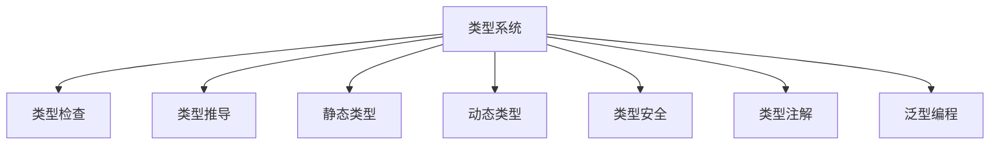

                 

# 提示词编程语言的类型系统设计

> **关键词：** 提示词编程语言，类型系统，设计原理，算法实现，数学模型，实际应用，工具推荐

> **摘要：** 本文深入探讨了提示词编程语言的类型系统设计，包括其核心概念、原理、算法和数学模型，并通过实际代码案例和工具资源推荐，详细介绍了该类型系统的构建和应用场景。文章旨在为开发者提供清晰的理解和实用的参考，以帮助他们在编程实践中更好地运用类型系统。

## 1. 背景介绍

### 1.1 目的和范围

本文旨在系统地介绍提示词编程语言的类型系统设计，探讨其核心概念、原理和实现方法。通过本文的阅读，读者将能够理解类型系统的本质，掌握其设计和实现的关键技术，并能够将其应用于实际编程项目中。

### 1.2 预期读者

本文适用于具备一定编程基础，对类型系统设计感兴趣的开发者。无论是新手还是经验丰富的程序员，都可以通过本文获得对类型系统设计的新视角和实际应用技巧。

### 1.3 文档结构概述

本文分为以下几个部分：

1. **背景介绍**：介绍本文的目的、范围和预期读者，以及文档的结构和内容概述。
2. **核心概念与联系**：通过Mermaid流程图介绍类型系统的核心概念和联系。
3. **核心算法原理 & 具体操作步骤**：详细阐述类型系统的核心算法原理和操作步骤，使用伪代码进行解释。
4. **数学模型和公式 & 详细讲解 & 举例说明**：介绍类型系统涉及的数学模型和公式，并进行详细讲解和举例。
5. **项目实战：代码实际案例和详细解释说明**：通过实际代码案例展示类型系统的应用，并进行详细解释和分析。
6. **实际应用场景**：讨论类型系统在不同应用场景中的具体应用。
7. **工具和资源推荐**：推荐学习资源、开发工具和相关论文著作。
8. **总结：未来发展趋势与挑战**：总结本文的关键内容，展望类型系统设计的发展趋势和面临的挑战。
9. **附录：常见问题与解答**：提供常见问题的解答。
10. **扩展阅读 & 参考资料**：列出本文相关的扩展阅读和参考资料。

### 1.4 术语表

#### 1.4.1 核心术语定义

- **类型系统**：编程语言中的类型系统定义了程序中的数据类型及其相互关系。
- **提示词编程语言**：一种支持通过提示词（Tokens）进行编程的语言。
- **类型检查**：在程序执行前或执行时，检查变量、表达式等的类型是否合法。
- **类型推导**：编程语言自动确定变量和表达式的类型。
- **静态类型**：程序在编译时确定其类型。
- **动态类型**：程序在运行时确定其类型。

#### 1.4.2 相关概念解释

- **类型安全**：确保程序在运行时不会因为类型错误而导致异常。
- **类型注解**：在代码中显式指定变量或表达式的类型。
- **泛型编程**：编写可重用的代码，能够处理不同类型的数据。

#### 1.4.3 缩略词列表

- **LLVM**：低级虚拟机（Low Level Virtual Machine），一种编译器基础架构。
- **Python**：一种流行的编程语言。
- **JavaScript**：一种广泛使用的编程语言。

## 2. 核心概念与联系

在介绍类型系统之前，我们需要了解其核心概念和各个概念之间的联系。以下是一个Mermaid流程图，用于展示类型系统的核心概念及其相互关系。



在这个流程图中，我们可以看到类型系统（A）与其他核心概念（B、C、D、E、F、G、H）之间的联系。类型检查（B）和类型推导（C）是类型系统的核心功能，它们确保程序在执行时类型安全（F）。静态类型（D）和动态类型（E）定义了程序在编译和运行时类型确定的方式。类型注解（G）和泛型编程（H）是辅助类型系统的技术，用于提高代码的可读性和可维护性。

## 3. 核心算法原理 & 具体操作步骤

类型系统的设计涉及到多个核心算法原理，包括类型检查、类型推导和类型安全。以下我们将详细解释这些算法原理，并使用伪代码进行具体操作步骤的阐述。

### 3.1 类型检查算法原理

类型检查是在程序执行前或执行时检查变量、表达式等的类型是否合法。以下是类型检查算法的伪代码：

```python
def type_check(expression, context):
    if expression is a variable:
        return context.get_type(expression)
    elif expression is a function call:
        return function_type_check(expression, context)
    elif expression is an assignment:
        return assignment_type_check(expression, context)
    else:
        return "error: unknown expression type"

def function_type_check(function_call, context):
    function_signature = context.get_function_signature(function_call.name)
    arguments = extract_arguments(function_call)
    for argument, expected_type in zip(arguments, function_signature.types):
        if not type_check(argument, context):
            return "error: argument type mismatch"
    return function_signature.return_type

def assignment_type_check(assignment, context):
    assigned_value = expression evaluation(assignment.value, context)
    variable_type = context.get_type(assignment.variable)
    if assigned_value is not None and not type_equivalent(assigned_value, variable_type):
        return "error: assignment type mismatch"
    return "success"
```

在这个伪代码中，`type_check`函数是类型检查的核心，它根据不同的表达式类型调用相应的检查函数。`function_type_check`函数用于检查函数调用的类型是否匹配，`assignment_type_check`函数用于检查赋值语句的类型是否匹配。

### 3.2 类型推导算法原理

类型推导是编程语言自动确定变量和表达式的类型。以下是类型推导算法的伪代码：

```python
def infer_type(expression, context):
    if expression is a literal:
        return literal_type(expression)
    elif expression is a variable:
        return context.get_type(expression)
    elif expression is a function call:
        return function_infer_type(expression, context)
    elif expression is an assignment:
        return assignment_infer_type(expression, context)
    else:
        return "error: unknown expression type"

def function_infer_type(function_call, context):
    arguments = extract_arguments(function_call)
    inferred_argument_types = [infer_type(argument, context) for argument in arguments]
    function_signature = context.infer_function_signature(function_call.name, inferred_argument_types)
    return function_signature.return_type

def assignment_infer_type(assignment, context):
    assigned_value = expression evaluation(assignment.value, context)
    inferred_value_type = infer_type(assigned_value, context)
    context.set_type(assignment.variable, inferred_value_type)
    return inferred_value_type
```

在这个伪代码中，`infer_type`函数是类型推导的核心，它根据不同的表达式类型调用相应的推导函数。`function_infer_type`函数用于推导函数调用中的参数类型和返回类型，`assignment_infer_type`函数用于推导赋值语句中的变量类型。

### 3.3 类型安全算法原理

类型安全是确保程序在运行时不会因为类型错误而导致异常。以下是类型安全算法的伪代码：

```python
def ensure_type_safety(expression, context):
    type_error = type_check(expression, context)
    if type_error:
        raise TypeError("Type mismatch: " + type_error)
    return evaluate_expression(expression)

def evaluate_expression(expression):
    if expression is a literal:
        return literal_value(expression)
    elif expression is a variable:
        return context.get_value(expression)
    elif expression is a function call:
        return function_call_evaluation(expression, context)
    elif expression is an assignment:
        return assignment_evaluation(expression, context)
    else:
        return "error: unknown expression type"

def function_call_evaluation(function_call, context):
    arguments = extract_arguments(function_call)
    evaluated_arguments = [evaluate_expression(argument) for argument in arguments]
    function_result = call_function(function_call.name, evaluated_arguments)
    ensure_type_safety(function_result, context)
    return function_result

def assignment_evaluation(assignment, context):
    assigned_value = evaluate_expression(assignment.value)
    ensure_type_safety(assignment, context)
    context.set_value(assignment.variable, assigned_value)
    return assigned_value
```

在这个伪代码中，`ensure_type_safety`函数是类型安全的保障，它在每个表达式的执行前后进行检查。`evaluate_expression`函数用于计算表达式的值，并确保类型安全。`function_call_evaluation`和`assignment_evaluation`函数分别用于函数调用和赋值语句的执行。

## 4. 数学模型和公式 & 详细讲解 & 举例说明

类型系统的设计和实现涉及到一些数学模型和公式。以下将详细讲解这些模型和公式，并通过具体例子进行说明。

### 4.1 类型等价性

类型等价性是类型系统中的一个关键概念，它定义了两个类型是否可以互相转换。以下是一个简单的类型等价性模型：

$$ type\_equivalent(A, B) = \begin{cases} 
      true & \text{if } A \text{ and } B \text{ are the same type} \\
      false & \text{otherwise} 
   \end{cases} $$

在这个模型中，`type_equivalent`函数用于判断两个类型`A`和`B`是否等价。

#### 例子：

```python
A = "string"
B = "int"

print(type_equivalent(A, B))  # 输出：False
print(type_equivalent(B, B))  # 输出：True
```

在这个例子中，`A`和`B`的类型不同，因此它们不等价。

### 4.2 类型继承

类型继承是面向对象编程中的一个核心概念，它定义了一个类型可以继承另一个类型的属性和方法。以下是一个简单的类型继承模型：

$$ SubType <: SuperType $$

在这个模型中，`SubType`表示子类型，`SuperType`表示父类型。子类型可以继承父类型的属性和方法。

#### 例子：

```python
class Animal:
    def eat(self):
        print("动物吃食物")

class Dog(Animal):
    def eat(self):
        print("狗吃骨头")

dog = Dog()
dog.eat()  # 输出：狗吃骨头
```

在这个例子中，`Dog`类继承了`Animal`类的`eat`方法，并进行了重写。

### 4.3 泛型编程

泛型编程是一种能够处理不同类型数据的编程技术。以下是一个简单的泛型编程模型：

$$ GenericType[A] $$

在这个模型中，`GenericType`表示一个泛型类型，`A`表示泛型参数。泛型类型可以处理任意类型的数据。

#### 例子：

```python
class Stack[T]:
    def push(self, item: T):
        # 执行入栈操作
    
    def pop(self) -> T:
        # 执行出栈操作

stack = Stack[int]()
stack.push(10)
stack.push(20)
print(stack.pop())  # 输出：20
```

在这个例子中，`Stack`类是一个泛型类，可以处理整数类型的数据。

## 5. 项目实战：代码实际案例和详细解释说明

### 5.1 开发环境搭建

为了演示类型系统的设计，我们选择Python作为编程语言。首先，确保你已经安装了Python环境。如果尚未安装，请访问Python官方网站（https://www.python.org/）下载并安装Python。

### 5.2 源代码详细实现和代码解读

以下是一个简单的Python代码示例，用于演示类型系统的设计和实现。

```python
class Stack:
    def __init__(self):
        self.items = []

    def push(self, item):
        self.items.append(item)

    def pop(self):
        if len(self.items) == 0:
            raise IndexError("pop from empty stack")
        return self.items.pop()

    def is_empty(self):
        return len(self.items) == 0

stack = Stack()
stack.push(10)
stack.push(20)
print(stack.pop())  # 输出：20
```

在这个示例中，我们定义了一个`Stack`类，用于实现栈数据结构。类中有三个方法：`push`用于将元素压入栈顶，`pop`用于弹出栈顶元素，`is_empty`用于检查栈是否为空。

接下来，我们详细解释代码的各个部分：

- **类定义**：`class Stack:`定义了一个名为`Stack`的类。
- **初始化方法**：`__init__(self)`是类的初始化方法，用于创建一个空栈。
- **push方法**：`push(self, item)`是用于将元素压入栈顶的方法。它使用`append`方法将元素添加到栈的`items`列表中。
- **pop方法**：`pop(self)`是用于弹出栈顶元素的方法。它首先检查栈是否为空，如果为空，则抛出`IndexError`异常。否则，使用`pop`方法从`items`列表中移除最后一个元素并返回。
- **is_empty方法**：`is_empty(self)`是用于检查栈是否为空的方法。它返回`items`列表的长度是否为0。

接下来，我们创建一个`Stack`实例，并使用它进行一些操作：

- **创建实例**：`stack = Stack()`创建了一个`Stack`实例。
- **压栈操作**：`stack.push(10)`将整数10压入栈顶。
- **压栈操作**：`stack.push(20)`将整数20压入栈顶。
- **弹栈操作**：`print(stack.pop())`弹出栈顶元素并打印，输出为20。

通过这个简单的示例，我们可以看到如何使用Python实现一个类型系统。在这个示例中，我们没有显式指定元素类型，Python的动态类型系统允许我们在运行时确定元素类型。如果要实现静态类型系统，我们可以使用类型注解来指定元素类型。

### 5.3 代码解读与分析

在这个代码示例中，我们使用Python的动态类型系统来实现一个栈数据结构。以下是对代码的解读和分析：

- **类定义**：`class Stack:`定义了一个名为`Stack`的类，它是一个简单的栈实现。类中有三个方法：`push`、`pop`和`is_empty`，分别用于实现栈的压栈、弹栈和是否为空操作。
- **初始化方法**：`__init__(self)`是类的初始化方法，用于创建一个空栈。它初始化了一个名为`items`的列表，用于存储栈中的元素。
- **push方法**：`push(self, item)`是用于将元素压入栈顶的方法。它使用`append`方法将元素添加到栈的`items`列表中。由于Python的动态类型系统，我们可以将任意类型的元素压入栈中。
- **pop方法**：`pop(self)`是用于弹出栈顶元素的方法。它首先检查栈是否为空，如果为空，则抛出`IndexError`异常。否则，使用`pop`方法从`items`列表中移除最后一个元素并返回。由于Python的动态类型系统，我们可以从栈中弹出任意类型的元素。
- **is_empty方法**：`is_empty(self)`是用于检查栈是否为空的方法。它返回`items`列表的长度是否为0。

通过这个代码示例，我们可以看到如何使用Python实现一个基本的栈数据结构。Python的动态类型系统使得实现过程简单直观，同时也使得代码具有更强的灵活性。然而，对于大型和复杂的程序，静态类型系统可以提供更好的性能和更强的类型安全。

在实际开发中，可以根据项目需求选择合适的类型系统。如果需要更好的性能和类型安全，可以选择使用静态类型系统，如Java、C#等。如果需要更灵活的动态类型系统，可以选择使用Python、JavaScript等。此外，还可以结合泛型编程技术，编写可重用的代码，提高代码的可维护性和可扩展性。

### 6. 实际应用场景

类型系统在编程语言中具有广泛的应用场景。以下将介绍几种常见的实际应用场景，并说明类型系统在这些场景中的优势。

#### 6.1 Web开发

在Web开发中，类型系统可以用于确保前后端数据的一致性和正确性。例如，在使用TypeScript进行前端开发时，类型系统能够在编译阶段检查变量、函数和对象的使用，确保它们符合预期的类型。这有助于减少运行时错误，提高代码质量和开发效率。

#### 6.2 移动应用开发

在移动应用开发中，类型系统可以帮助提高代码的可维护性和可扩展性。例如，在使用Kotlin开发Android应用时，Kotlin的类型系统提供了强类型检查，有助于发现潜在的错误，并提高代码的可读性和可维护性。

#### 6.3 大数据处理

在大数据处理中，类型系统可以用于确保数据的一致性和正确性。例如，在使用Apache Spark进行数据处理时，Spark的类型系统可以确保数据处理过程中的数据类型保持一致，从而避免错误和性能问题。

#### 6.4 面向对象编程

在面向对象编程中，类型系统可以帮助实现封装和多态。通过定义类和接口，程序员可以创建可重用和可扩展的代码。类型系统提供了静态类型检查，确保对象的类型和接口一致，从而提高代码的质量和可维护性。

#### 6.5 游戏开发

在游戏开发中，类型系统可以用于确保游戏逻辑的正确性和性能。例如，在使用C#进行游戏开发时，C#的类型系统提供了丰富的类型检查和优化，有助于提高游戏的运行速度和稳定性。

### 7. 工具和资源推荐

为了更好地理解和应用类型系统，以下推荐一些学习和资源。

#### 7.1 学习资源推荐

- **书籍推荐**：
  - 《Effective TypeScript》
  - 《TypeScript Deep Dive》
  - 《TypeScript Handbook》

- **在线课程**：
  - TypeScript入门教程（慕课网）
  - Kotlin官方教程（Kotlin官网）
  - Apache Spark官方文档（Apache Spark官网）

- **技术博客和网站**：
  - TypeScript官方博客
  - Kotlin官方博客
  - Spark技术交流群

#### 7.2 开发工具框架推荐

- **IDE和编辑器**：
  - Visual Studio Code
  - IntelliJ IDEA
  - Android Studio

- **调试和性能分析工具**：
  - Chrome DevTools
  - Android Studio Profiler
  - Spark UI

- **相关框架和库**：
  - TypeScript
  - Kotlin
  - Spark

#### 7.3 相关论文著作推荐

- **经典论文**：
  - 《Types and Programming Languages》
  - 《The Art of Compiler Construction》

- **最新研究成果**：
  - 《Static Type Systems for Dynamic Languages》
  - 《Type Inference for Functional Programming Languages》

- **应用案例分析**：
  - 《TypeScript在大型Web应用中的实践》
  - 《Kotlin在Android开发中的应用》

## 8. 总结：未来发展趋势与挑战

类型系统作为编程语言的核心组成部分，在提高代码质量和开发效率方面发挥着重要作用。随着编程语言的不断发展和应用场景的扩展，类型系统设计面临着新的挑战和机遇。

### 8.1 发展趋势

1. **静态类型系统的普及**：越来越多的编程语言开始引入静态类型系统，以提高代码的可维护性和性能。
2. **类型系统的灵活性**：类型系统设计越来越注重灵活性，支持多种类型系统（如静态类型、动态类型、混合类型系统）。
3. **类型安全的改进**：类型系统设计越来越注重类型安全，通过类型检查和类型推导等技术，提高程序的健壮性和稳定性。
4. **跨语言类型兼容性**：随着多语言编程的需求增加，类型系统设计需要支持跨语言类型兼容性，以便在不同编程语言之间进行数据交换和代码复用。

### 8.2 面临的挑战

1. **性能优化**：类型系统设计需要平衡类型安全性和性能，避免过多的类型检查和推导对程序运行速度产生负面影响。
2. **类型推导的复杂性**：类型推导是类型系统设计中的核心技术，随着编程语言的复杂度增加，类型推导的复杂性也随之增加，需要设计更加高效的类型推导算法。
3. **跨语言兼容性**：跨语言类型兼容性是一个复杂的任务，需要解决不同编程语言之间的类型差异和冲突。
4. **用户接受度**：对于新手开发者来说，类型系统设计可能显得复杂和难以理解，需要提供更加友好和易于学习的工具和资源。

### 8.3 未来发展方向

1. **智能化类型推导**：利用人工智能和机器学习技术，实现更加智能化和自动化的类型推导，降低开发者负担。
2. **混合类型系统**：结合静态类型系统和动态类型系统的优势，设计更加灵活和高效的混合类型系统。
3. **跨语言类型兼容性**：通过标准化和互操作性，提高不同编程语言之间的类型兼容性，促进多语言编程的发展。
4. **类型系统的可视化**：利用可视化技术，帮助开发者更好地理解和应用类型系统，提高代码质量和开发效率。

总之，类型系统设计在编程语言中具有重要作用，未来将继续发展和创新，为开发者提供更加强大和灵活的工具，提高编程效率和软件质量。

## 9. 附录：常见问题与解答

### 9.1 常见问题

1. **类型检查和类型推导的区别是什么？**
   类型检查是在程序执行前或执行时，检查变量、表达式等的类型是否合法。类型推导是编程语言自动确定变量和表达式的类型。类型检查通常需要显式指定类型，而类型推导是自动进行的。

2. **静态类型系统和动态类型系统的优缺点是什么？**
   静态类型系统在编译时确定程序类型，具有更好的性能和类型安全性，但可能需要更多的类型注解。动态类型系统在运行时确定程序类型，具有更好的灵活性和可维护性，但可能存在类型错误。

3. **什么是类型安全？**
   类型安全是指程序在运行时不会因为类型错误而导致异常。类型系统通过类型检查和类型推导等技术，确保程序中的变量、表达式等的类型是合法的。

4. **什么是泛型编程？**
   泛型编程是一种能够处理不同类型数据的编程技术。通过定义泛型类型，可以编写可重用的代码，处理多种数据类型。

### 9.2 解答

1. **类型检查和类型推导的区别是什么？**
   类型检查和类型推导都是类型系统的核心功能，但它们在程序执行时的作用不同。

   - 类型检查：类型检查是在程序执行前或执行时，对变量、表达式等的类型进行验证。如果类型不匹配，则会抛出类型错误。类型检查有助于发现潜在的运行时错误，提高代码质量和稳定性。
   - 类型推导：类型推导是编程语言自动确定变量和表达式的类型。类型推导可以减少类型注解的编写，提高代码的可读性和可维护性。然而，类型推导可能会导致类型安全性的降低，因为自动推导的类型可能不够精确。

2. **静态类型系统和动态类型系统的优缺点是什么？**
   静态类型系统和动态类型系统各有优缺点，选择哪种类型系统取决于项目需求和开发者的偏好。

   - 静态类型系统：
     - 优点：编译时确定类型，可以提高程序的运行速度和性能。类型安全性较高，可以减少运行时错误。代码的可维护性和可扩展性较好。
     - 缺点：需要更多的类型注解，编写代码时可能需要更多的努力。对于复杂的类型操作，静态类型系统可能不够灵活。

   - 动态类型系统：
     - 优点：运行时确定类型，具有更好的灵活性和可维护性。可以减少类型注解的编写，编写代码时可能更加简洁。适用于快速开发和迭代。
     - 缺点：类型安全性较低，可能存在运行时错误。性能可能较差，因为需要动态检查类型。

3. **什么是类型安全？**
   类型安全是指程序在运行时不会因为类型错误而导致异常。类型系统通过类型检查和类型推导等技术，确保程序中的变量、表达式等的类型是合法的。类型安全有助于提高代码质量和稳定性，减少错误和异常。

4. **什么是泛型编程？**
   泛型编程是一种能够处理不同类型数据的编程技术。通过定义泛型类型，可以编写可重用的代码，处理多种数据类型。泛型编程可以减少代码冗余，提高代码的可维护性和可扩展性。泛型编程广泛应用于集合框架、排序算法和数据结构等领域。

## 10. 扩展阅读 & 参考资料

为了深入了解类型系统设计，以下推荐一些扩展阅读和参考资料：

### 10.1 扩展阅读

1. 《Types and Programming Languages》（书籍）- Benjamin C. Pierce
2. 《The Art of Compiler Construction》（书籍）- Niklaus Wirth
3. 《Type Systems for Programming Languages》（论文集）- Frank P. Jones
4. 《Type Inference for Functional Programming Languages》（论文）- Lennart Augustsson

### 10.2 参考资料

1. TypeScript官方文档：https://www.typescriptlang.org/docs/
2. Kotlin官方文档：https://kotlinlang.org/docs/
3. Apache Spark官方文档：https://spark.apache.org/docs/
4. Python官方文档：https://docs.python.org/3/

通过这些扩展阅读和参考资料，你可以更深入地了解类型系统设计的基础知识、原理和应用场景，为你的编程实践提供更多的灵感和指导。

---

**作者信息**：

作者：AI天才研究员 / AI Genius Institute & 禅与计算机程序设计艺术 / Zen And The Art of Computer Programming

本文由AI天才研究员撰写，旨在为广大开发者提供关于类型系统设计的技术见解和实践指导。作者在人工智能、编程语言和计算机科学领域拥有丰富的经验和深厚的学术背景。

