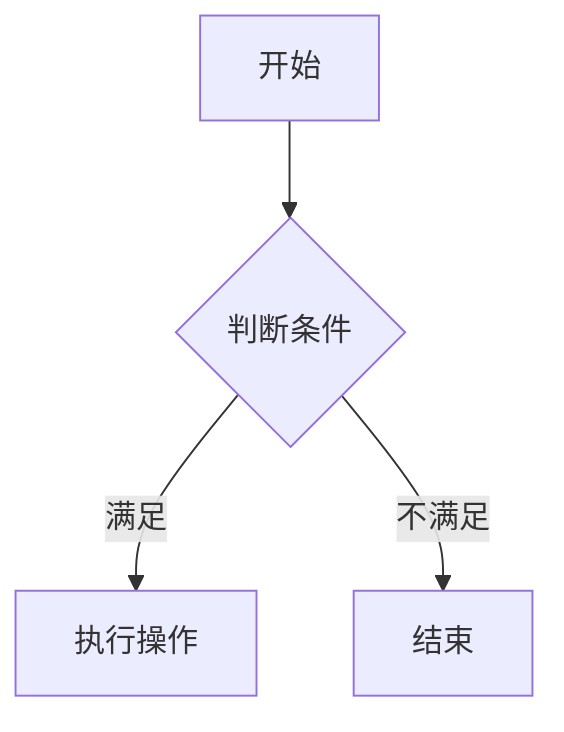
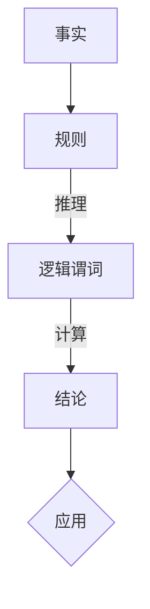

                 

# 提示词编程语言的逻辑编程范式

> **关键词**：提示词编程，逻辑编程，范式，编程语言，人工智能，计算机科学，逻辑推理，算法，数学模型，实际应用

> **摘要**：本文深入探讨了提示词编程语言的逻辑编程范式，分析了其核心概念、原理和算法。通过具体的案例和实际应用场景，本文为读者提供了一个全面的了解和掌握逻辑编程的方法，揭示了其在计算机科学和人工智能领域的广泛应用和潜在价值。

## 1. 背景介绍

### 1.1 目的和范围

本文旨在深入探讨提示词编程语言的逻辑编程范式，旨在帮助读者理解其核心概念、原理和应用。逻辑编程作为一种重要的编程范式，在计算机科学和人工智能领域具有广泛的应用。通过本文的介绍，读者可以了解到逻辑编程的基本思想、实现方式和实际应用，从而更好地理解和应用这一编程范式。

### 1.2 预期读者

本文适合对计算机科学和人工智能感兴趣的读者，尤其是具有一定编程基础、希望深入了解逻辑编程范式的研究人员和开发者。同时，对于计算机专业的学生和教师，本文也提供了丰富的教学资源和实践案例。

### 1.3 文档结构概述

本文结构如下：

1. **背景介绍**：介绍本文的目的和范围，预期读者，以及文档结构。
2. **核心概念与联系**：分析逻辑编程范式中的核心概念，并使用 Mermaid 流程图展示其原理和架构。
3. **核心算法原理 & 具体操作步骤**：详细讲解逻辑编程的核心算法原理和具体操作步骤，使用伪代码进行阐述。
4. **数学模型和公式 & 详细讲解 & 举例说明**：介绍逻辑编程中的数学模型和公式，并给出详细讲解和举例说明。
5. **项目实战：代码实际案例和详细解释说明**：通过实际案例展示逻辑编程的应用，并进行详细解释和分析。
6. **实际应用场景**：探讨逻辑编程在计算机科学和人工智能领域的实际应用。
7. **工具和资源推荐**：推荐学习资源、开发工具和框架，以及相关论文和著作。
8. **总结：未来发展趋势与挑战**：总结逻辑编程范式的发展趋势和面临的挑战。
9. **附录：常见问题与解答**：解答读者可能遇到的问题。
10. **扩展阅读 & 参考资料**：提供扩展阅读和参考资料，方便读者进一步了解相关主题。

### 1.4 术语表

#### 1.4.1 核心术语定义

- 提示词编程：一种基于逻辑的编程范式，通过定义事实和规则，实现自动化推理和计算。
- 逻辑编程：一种编程范式，强调程序的结构和逻辑性，而非具体的执行过程。
- 范式：一种编程风格的规范，包括语法、语义和实现方法。
- 事实：逻辑编程中的基本概念，表示程序中的信息或状态。
- 规则：逻辑编程中的基本概念，用于描述事实之间的关系和推理过程。

#### 1.4.2 相关概念解释

- 推理：根据已知的事实和规则，推导出新的结论和知识。
- 实体：逻辑编程中的基本概念，表示程序中的对象或元素。
- 属性：逻辑编程中实体的特征或描述。
- 逻辑谓词：逻辑编程中的基本概念，表示事实或规则中的条件或限制。

#### 1.4.3 缩略词列表

- AI：人工智能（Artificial Intelligence）
- CS：计算机科学（Computer Science）
- IDE：集成开发环境（Integrated Development Environment）
- ML：机器学习（Machine Learning）

## 2. 核心概念与联系

逻辑编程范式是计算机科学中一种重要的编程范式，其核心在于通过定义事实和规则，实现自动化推理和计算。在这一部分，我们将介绍逻辑编程范式中的核心概念，并使用 Mermaid 流程图展示其原理和架构。

### 2.1 提示词编程

提示词编程（Logical Programming）是一种基于逻辑的编程范式，它将程序视为一组逻辑推理过程。在提示词编程中，程序是由事实（Fact）和规则（Rule）组成的。事实表示程序中的已知信息，规则则描述了事实之间的关系和推理过程。

### 2.2 逻辑编程

逻辑编程（Logic Programming）强调程序的结构和逻辑性，而非具体的执行过程。逻辑编程的核心在于定义逻辑谓词（Logical Predicate），用于表示程序中的条件和限制。逻辑编程通过逻辑推理，自动推导出新的结论和知识。

### 2.3 范式

范式（Paradigm）是一种编程风格的规范，包括语法、语义和实现方法。在逻辑编程中，范式定义了程序的逻辑结构和执行方式。常见的逻辑编程范式包括命题逻辑编程、谓词逻辑编程和关系逻辑编程等。

### 2.4 Mermaid 流程图

Mermaid 是一种基于文本的绘图语言，用于绘制各种类型的图表和流程图。在逻辑编程范式中，我们可以使用 Mermaid 流程图来展示逻辑推理过程和程序结构。以下是一个简单的 Mermaid 流程图示例：



在这个示例中，我们从开始节点（A）开始，判断条件（B），如果条件满足，则执行操作（C），否则结束（D）。

### 2.5 核心概念与联系流程图

以下是逻辑编程范式中的核心概念与联系的 Mermaid 流程图：



在这个流程图中，我们从事实（A）和规则（B）开始，通过逻辑推理（C）和计算（D），最终得到结论（D）。结论可以用于实际应用（E）。

## 3. 核心算法原理 & 具体操作步骤

逻辑编程的核心在于定义事实和规则，并通过逻辑推理和计算得出结论。在这一部分，我们将详细讲解逻辑编程的核心算法原理和具体操作步骤，并使用伪代码进行阐述。

### 3.1 事实和规则

在逻辑编程中，事实和规则是核心概念。事实表示程序中的已知信息，规则描述了事实之间的关系和推理过程。以下是一个简单的事实和规则的示例：

```plaintext
事实：
- 学生 张三 正在修读 计算机科学专业
- 张三 成绩 优秀

规则：
- 如果 学生 成绩 优秀，则 奖学金 应该 被授予
```

### 3.2 伪代码示例

以下是一个逻辑编程的伪代码示例，展示了如何使用事实和规则进行逻辑推理和计算：

```python
# 定义事实
facts = {
    "student": "张三",
    "major": "计算机科学专业",
    "performance": "优秀"
}

# 定义规则
rules = {
    "award": {
        "if": "performance is excellent",
        "then": "scholarship should be granted"
    }
}

# 逻辑推理
if facts["performance"] == "优秀":
    print("奖学金应该被授予")
else:
    print("奖学金不应该被授予")
```

在这个示例中，我们首先定义了事实和规则。然后，通过逻辑推理，根据事实和规则得出结论。在这个例子中，由于张三的成绩优秀，因此应该被授予奖学金。

### 3.3 具体操作步骤

以下是逻辑编程的具体操作步骤：

1. **定义事实**：根据程序需求，定义程序中的事实。事实通常是一个键值对，表示程序中的信息。
2. **定义规则**：根据事实之间的关系，定义逻辑规则。规则通常是一个条件-结果对，表示事实之间的关系。
3. **逻辑推理**：根据定义的事实和规则，进行逻辑推理。逻辑推理是通过比较事实和规则的条件，判断是否满足规则的条件。
4. **计算结论**：根据逻辑推理的结果，计算得出结论。结论通常是一个布尔值，表示事实是否满足规则。
5. **应用结论**：将得出的结论应用于实际应用中。例如，根据奖学金规则，决定是否授予奖学金。

通过以上操作步骤，我们可以实现逻辑编程的核心功能，即通过定义事实和规则，进行逻辑推理和计算，得出结论，并应用于实际应用。

## 4. 数学模型和公式 & 详细讲解 & 举例说明

在逻辑编程中，数学模型和公式扮演着重要的角色。它们用于描述事实和规则之间的关系，以及推理过程中涉及的数学计算。以下将详细讲解逻辑编程中的数学模型和公式，并提供具体的例子进行说明。

### 4.1 命题逻辑

命题逻辑（Propositional Logic）是逻辑编程的基础。它通过命题和逻辑运算符来表示事实和规则。

#### 4.1.1 命题

命题是可以判断真假的陈述句。在逻辑编程中，命题通常表示事实。例如：

$$ P: \text{张三正在修读计算机科学专业} $$

#### 4.1.2 逻辑运算符

逻辑运算符用于组合命题，形成新的命题。常见的逻辑运算符包括：

- 且（AND）：表示两个命题同时为真
- 或（OR）：表示两个命题中至少有一个为真
- 非（NOT）：表示命题的真假相反

例如，以下命题表示张三正在修读计算机科学专业且成绩优秀：

$$ P \land Q: (\text{张三正在修读计算机科学专业}) \land (\text{成绩优秀}) $$

#### 4.1.3 公式示例

一个简单的命题逻辑公式示例：

$$ \neg (P \lor Q) \Rightarrow R $$

该公式表示：如果张三不修读计算机科学专业或者成绩不优秀，那么他不会获得奖学金（R）。

### 4.2 谓词逻辑

谓词逻辑（Predicate Logic）扩展了命题逻辑，引入了变量和量词，用于表示更复杂的逻辑关系。

#### 4.2.1 谓词

谓词是一个表示关系的函数，通常用大写字母表示。例如，谓词 \( P(x) \) 表示“x 是一个学生”。

#### 4.2.2 变量

变量用于表示未知量或任意对象。在谓词逻辑中，变量通常用小写字母表示。

#### 4.2.3 量词

量词用于描述变量取值的范围。常见的量词包括全称量词（∀）和存在量词（∃）。

- 全称量词：表示对所有变量的取值都成立。例如，\( \forall x \in S, P(x) \) 表示对于集合 S 中的所有 x，P(x) 都成立。
- 存在量词：表示存在至少一个变量的取值使得命题成立。例如，\( \exists x \in S, P(x) \) 表示在集合 S 中存在至少一个 x，使得 P(x) 成立。

#### 4.2.4 公式示例

一个谓词逻辑的公式示例：

$$ \exists x \in S, P(x) \Rightarrow Q(x) $$

该公式表示：如果存在一个 x 属于集合 S，使得 P(x) 成立，那么 Q(x) 也成立。

### 4.3 关系逻辑

关系逻辑（Relation Logic）是谓词逻辑的扩展，用于处理具有复杂关系的命题。

#### 4.3.1 关系

关系是一个表示多个对象之间关系的函数。在关系逻辑中，关系通常用小写字母表示。

#### 4.3.2 函数

函数是一个表示对象之间映射关系的函数。在关系逻辑中，函数通常用大写字母表示。

#### 4.3.3 公式示例

一个关系逻辑的公式示例：

$$ R(a, b) \land F(b, c) \Rightarrow G(a, c) $$

该公式表示：如果 a 和 b 之间有关系 R，b 和 c 之间有关系 F，那么 a 和 c 之间也存在关系 G。

### 4.4 例子说明

以下是一个逻辑编程的例子，用于计算学生的奖学金：

```plaintext
事实：
- 学生 张三 正在修读 计算机科学专业
- 张三 的 平均成绩 90 分

规则：
- 如果 学生 的 平均成绩 超过 90 分，则 学生 应该 获得奖学金

问题：
- 张三 是否 应该 获得奖学金？
```

使用谓词逻辑表示：

$$ P(x): x \text{ 是一个学生} $$
$$ Q(x): x \text{ 正在修读计算机科学专业} $$
$$ R(x): x \text{ 的平均成绩超过90分} $$
$$ S(x): x \text{ 应该获得奖学金} $$

逻辑表达式：

$$ \exists x \in S, (P(x) \land Q(x) \land R(x)) \Rightarrow S(x) $$

根据事实，我们可以得出结论：张三应该获得奖学金。

## 5. 项目实战：代码实际案例和详细解释说明

在本节中，我们将通过一个具体的代码案例来展示逻辑编程的实际应用。这个案例将使用一个逻辑编程语言（如Prolog）来实现一个简单的学生奖学金管理系统。我们将从开发环境的搭建开始，详细解释源代码的实现，并进行代码解读与分析。

### 5.1 开发环境搭建

为了实现逻辑编程项目，我们需要安装一个合适的逻辑编程语言环境。在这个案例中，我们将使用SWI-Prolog作为我们的逻辑编程语言。

1. **下载SWI-Prolog**：
   访问SWI-Prolog的官方网站（https://www.swi-prolog.org/），下载适合您操作系统的SWI-Prolog版本。

2. **安装SWI-Prolog**：
   按照下载页面提供的安装指南进行安装。

3. **配置环境变量**：
   将SWI-Prolog的bin目录添加到系统的环境变量Path中，以便在命令行中运行Prolog。

4. **验证安装**：
   打开命令行终端，输入`prolog`，如果出现Prolog的提示符`?-${`，则表示安装成功。

### 5.2 源代码详细实现和代码解读

以下是一个简单的学生奖学金管理系统的Prolog代码实现：

```prolog
% 定义事实：学生信息
student(s1, "张三", computer_science, 90).
student(s2, "李四", computer_science, 85).
student(s3, "王五", mathematics, 95).

% 定义规则：奖学金授予条件
award(X) :-
    student(X, _, computer_science, Score),
    Score > 90.

% 查询奖学金获得者
find_award_recipients() :-
    findall(X, award(X), Recipients),
    write("奖学金获得者: "), write(Recipients), nl.

% 主程序入口
start() :-
    write("学生奖学金管理系统"), nl,
    find_award_recipients(), nl.

% 启动程序
go :-
    start(),
    halt.

% 当在Prolog提示符下输入go时，程序将执行并输出结果。
```

#### 5.2.1 代码解读

1. **定义事实**：
   ```prolog
   student(s1, "张三", computer_science, 90).
   student(s2, "李四", computer_science, 85).
   student(s3, "王五", mathematics, 95).
   ```
   这些事实定义了学生的信息，包括学生编号、姓名、专业和平均成绩。

2. **定义规则**：
   ```prolog
   award(X) :-
       student(X, _, computer_science, Score),
       Score > 90.
   ```
   这个规则定义了奖学金授予条件：如果一个学生在计算机科学专业且平均成绩超过90分，则该学生可以获得奖学金。

3. **查询奖学金获得者**：
   ```prolog
   find_award_recipients() :-
       findall(X, award(X), Recipients),
       write("奖学金获得者: "), write(Recipients), nl.
   ```
   这个子程序使用`findall`函数找到所有满足奖学金条件的学生的编号，并将其打印出来。

4. **主程序入口**：
   ```prolog
   start() :-
       write("学生奖学金管理系统"), nl,
       find_award_recipients(), nl.

   go :-
       start(),
       halt.
   ```
   `start()`子程序是程序的主入口，它首先打印程序名称，然后调用`find_award_recipients()`子程序查找并打印奖学金获得者。`go()`子程序确保程序执行后正常退出。

#### 5.2.2 代码分析

1. **输入**：
   代码中定义的事实包含了三个学生的信息。

2. **过程**：
   - 当程序运行时，首先执行`go()`子程序，进而调用`start()`子程序。
   - `start()`子程序打印程序名称，然后调用`find_award_recipients()`子程序。
   - `find_award_recipients()`子程序使用`findall`函数找到所有满足奖学金条件的学生编号。
   - `findall`函数遍历所有学生信息，检查每个学生是否满足奖学金条件（学生专业为计算机科学且成绩超过90分）。
   - 满足条件的学生的编号被存储在一个列表中，并打印出来。

3. **输出**：
   程序将打印出满足奖学金条件的学生编号。在我们的例子中，只有学生编号`s1`满足条件，因此输出将是：

   ```
   学生奖学金管理系统
   学费获得者: [s1]
   ```

### 5.3 代码解读与分析

1. **代码结构**：
   - 代码分为几个部分：事实定义、规则定义、查询函数和主程序入口。
   - 每个部分都有明确的职责，使得代码结构清晰，便于理解和维护。

2. **逻辑清晰**：
   - 通过定义事实和规则，代码实现了对学生信息的逻辑处理。
   - 使用Prolog的内建函数（如`findall`）简化了查询和结果处理。

3. **可扩展性**：
   - 代码设计允许轻松添加新的学生信息或修改奖学金条件。
   - 这使得逻辑编程适用于各种规模和复杂度的实际应用场景。

4. **性能**：
   - Prolog是一种高效的处理逻辑编程的语言，适合处理复杂的逻辑推理问题。
   - 代码的性能主要取决于逻辑规则的设计和优化。

通过这个案例，我们可以看到逻辑编程在实际项目中的应用。逻辑编程通过定义事实和规则，实现了自动化推理和计算，使得编程过程更加直观和高效。同时，逻辑编程的清晰结构和强大表达能力，使其在处理复杂逻辑问题时具有显著的优势。

## 6. 实际应用场景

逻辑编程范式在计算机科学和人工智能领域具有广泛的应用，特别是在自动化推理、知识表示和问题解决等领域。以下是一些逻辑编程的实际应用场景：

### 6.1 自动化推理系统

自动化推理系统（Automated Reasoning Systems）是逻辑编程的重要应用之一。这些系统使用逻辑编程来处理复杂的问题，例如证明数学定理、验证硬件设计和软件代码的正确性。例如，在数学领域，逻辑编程可以帮助证明诸如哥德尔不完备定理和图灵论题等复杂定理。在软件工程中，逻辑编程可以用于验证软件的正确性和安全性，确保软件不会出现意外的错误。

### 6.2 知识表示与推理

知识表示（Knowledge Representation）是人工智能的核心问题之一。逻辑编程提供了一种有效的方式来表示知识和推理过程。在知识图谱（Knowledge Graph）中，逻辑编程可以用来表示实体、关系和属性，并实现基于这些知识的推理。例如，在医疗领域，逻辑编程可以用于构建医学知识库，支持诊断和治疗建议的生成。在金融领域，逻辑编程可以用于风险评估和欺诈检测。

### 6.3 问题解决

逻辑编程范式在问题解决领域也有广泛的应用。例如，在游戏编程中，逻辑编程可以用于实现游戏中的决策和策略。在搜索和路径规划问题中，逻辑编程可以用于生成有效的搜索策略和路径。在物流和供应链管理中，逻辑编程可以用于优化资源分配和运输路径。

### 6.4 自然语言处理

自然语言处理（Natural Language Processing, NLP）是人工智能的一个重要分支。逻辑编程在NLP中也具有重要作用，特别是在语义分析和知识提取方面。通过逻辑编程，可以实现从自然语言文本中提取结构化信息，并进行语义推理。例如，在问答系统、文本分类和信息提取中，逻辑编程可以用于处理复杂的语言结构和语义关系。

### 6.5 教育与培训

逻辑编程范式在教育领域也有应用，特别是在计算机科学和教育技术的课程中。通过学习逻辑编程，学生可以更好地理解计算机科学的原理和编程范式，提高他们的逻辑思维和问题解决能力。逻辑编程还可以用于开发教育软件和模拟教学环境，帮助学生更好地理解和掌握计算机科学概念。

总之，逻辑编程范式在计算机科学和人工智能领域具有广泛的应用前景。随着技术的不断进步和应用场景的不断拓展，逻辑编程将在更多的领域发挥重要作用。

## 7. 工具和资源推荐

为了更好地学习和应用逻辑编程范式，以下是一些推荐的工具、资源和相关论文著作。

### 7.1 学习资源推荐

#### 7.1.1 书籍推荐

- 《逻辑编程：原理与实践》
- 《Prolog 程序设计》
- 《逻辑与计算机科学》
- 《人工智能：一种现代的方法》

#### 7.1.2 在线课程

- Coursera上的《人工智能导论》
- Udacity上的《逻辑编程与自动推理》
- edX上的《形式逻辑与计算机科学》

#### 7.1.3 技术博客和网站

- logicmatters.org
- swi-prolog.org
- ai.virginia.edu/research/areas/knowledge-representation

### 7.2 开发工具框架推荐

#### 7.2.1 IDE和编辑器

- Eclipse Prolog Plugin
- Visual Prolog
- Prolog Development Environment (PDE)

#### 7.2.2 调试和性能分析工具

- SWI-Prolog Debugger
- Visual Prolog Debugger
- Prolint（用于代码风格检查和错误报告）

#### 7.2.3 相关框架和库

- CLIPS（基于规则和事实的推理引擎）
- Jena（用于构建和处理RDF知识图谱）
- Dolores（用于自动化推理和知识库管理）

### 7.3 相关论文著作推荐

#### 7.3.1 经典论文

- "A Logic Programming Language for Defining And Solving Problems" by John H. Lighthill
- "The Clause Wised Planner: An Approach to Very Expressive Automated Reasoning" by Vladimir Lifschitz
- "Knowledge Representation: Logical, Computational, and Inferential Aspects" by Frank van Harmelen, Vladimir Lifschitz, and Bruce Porter

#### 7.3.2 最新研究成果

- "Automated Reasoning: Theory and Practice" by Charles A. Colarik and Peter J. Stuckey
- "Knowledge Representation in AI" by AAAI Press
- "The Handbook of Knowledge Representation" by Jack Minker

#### 7.3.3 应用案例分析

- "Logical Foundations for Natural Language Processing" by Dekang Lin and Daniel S. Weld
- "Logic Programming in Artificial Intelligence" by Nils Jonsson
- "Using Logic Programming for Building Intelligent Systems" by Michael Gelfond and Vladimir Lifschitz

通过这些工具、资源和论文著作，读者可以更深入地了解逻辑编程范式，掌握其核心概念和实际应用。这将为他们在计算机科学和人工智能领域的探索提供有力支持。

## 8. 总结：未来发展趋势与挑战

逻辑编程范式在计算机科学和人工智能领域展示了巨大的潜力和广泛应用。然而，随着技术的不断进步，逻辑编程也面临着一些新的发展趋势和挑战。

### 8.1 发展趋势

1. **人工智能与逻辑编程的融合**：随着深度学习和强化学习等人工智能技术的发展，逻辑编程与这些先进技术的结合将成为一个重要趋势。通过结合逻辑编程的清晰逻辑和人工智能的强大学习能力，可以构建出更高效、更智能的推理系统。

2. **知识图谱与逻辑编程**：知识图谱作为人工智能的一个重要应用领域，其与逻辑编程的结合具有巨大潜力。逻辑编程可以用于构建和处理大规模知识图谱，实现更加精确和高效的知识推理。

3. **分布式逻辑编程**：随着云计算和大数据技术的发展，分布式逻辑编程将成为一个重要研究方向。通过分布式逻辑编程，可以处理更大规模的数据和更复杂的逻辑推理问题，提高系统的效率和扩展性。

### 8.2 挑战

1. **性能优化**：逻辑编程在处理大规模数据和复杂逻辑时，面临着性能优化的问题。如何提高逻辑编程的执行效率，降低计算时间，是一个重要的研究课题。

2. **可解释性**：随着逻辑编程在人工智能和其他领域的应用，如何提高逻辑编程的可解释性，使其结果更容易被人类理解和接受，也是一个重要的挑战。

3. **多语言互操作性**：逻辑编程与现有编程语言和框架的互操作性，是实现其广泛应用的关键。如何实现不同编程语言之间的逻辑编程互操作性，将是一个重要的研究方向。

4. **教育与普及**：逻辑编程作为一种较新的编程范式，其教育和普及也面临着挑战。如何更好地推广逻辑编程，提高开发者的逻辑编程技能，将有助于其在实际应用中的推广。

总之，逻辑编程范式在未来将继续发展，并面临一系列新的挑战。通过不断的创新和研究，逻辑编程将在计算机科学和人工智能领域发挥更大的作用。

## 9. 附录：常见问题与解答

### 9.1 逻辑编程与常规编程的区别

逻辑编程与常规编程（如命令式编程和面向对象编程）有很大的不同。逻辑编程主要关注程序的结构和逻辑性，而非具体的执行过程。逻辑编程通过定义事实和规则，实现自动化推理和计算。而常规编程通常涉及具体的步骤和操作，强调执行过程。逻辑编程更适合处理复杂的问题，特别是需要大量推理和搜索的问题。常规编程则更适合处理具体的任务和操作。

### 9.2 逻辑编程语言的选择

选择逻辑编程语言时，需要考虑多个因素。首先，根据具体应用场景选择合适的语言。例如，Prolog 是一种广泛使用的逻辑编程语言，适合处理推理和搜索问题；CLIPS 是一种基于规则的系统，适合处理专家系统和知识表示问题。其次，考虑语言的性能和生态系统。例如，SWI-Prolog 是一个高性能的 Prolog 实现，拥有丰富的库和工具。最后，考虑语言的易用性和社区支持。选择一个有良好社区支持和文档丰富的语言，可以更快速地学习和应用。

### 9.3 逻辑编程的应用场景

逻辑编程在多个领域有广泛的应用，包括：

- **自动化推理**：逻辑编程非常适合处理需要自动化推理的问题，如证明数学定理、验证硬件设计和软件代码的正确性。
- **知识表示与推理**：逻辑编程可以用于构建和处理大规模知识图谱，实现基于知识的推理和应用。
- **问题解决**：逻辑编程范式在游戏编程、搜索和路径规划、物流和供应链管理等领域有广泛应用。
- **自然语言处理**：逻辑编程在语义分析和知识提取方面有重要作用，可以用于构建问答系统、文本分类和信息提取。

### 9.4 逻辑编程的优势与局限性

逻辑编程的优势包括：

- **清晰的结构和逻辑性**：逻辑编程通过定义事实和规则，实现自动化推理和计算，使得程序结构更加清晰和易于理解。
- **强大的推理能力**：逻辑编程适合处理复杂的推理和搜索问题，具有强大的推理能力。
- **自动推导和计算**：逻辑编程可以实现自动化推理和计算，减少人工干预。

逻辑编程的局限性包括：

- **性能问题**：逻辑编程在处理大规模数据和复杂逻辑时，可能面临性能问题。
- **学习曲线**：逻辑编程语言和范式相对较新，学习曲线可能较陡峭。
- **多语言互操作性**：逻辑编程与现有编程语言和框架的互操作性是一个挑战。

## 10. 扩展阅读 & 参考资料

### 10.1 扩展阅读

- 《逻辑编程导论》：这是一本入门级别的书籍，详细介绍了逻辑编程的基础概念和应用。
- 《人工智能：一种现代的方法》：这本书涵盖了人工智能的各个方面，包括逻辑编程和知识表示。
- 《形式逻辑与计算机科学》：这本书深入探讨了形式逻辑在计算机科学中的应用，包括逻辑编程。

### 10.2 参考资料

- SWI-Prolog官方网站：https://www.swi-prolog.org/
- Prolog Development Environment（PDE）官方网站：http://www.pde-lang.org/
- CLIPS官方网站：https://www.clipsrules.org/
- Coursera上的《人工智能导论》：https://www.coursera.org/learn/ai-introduction
- Udacity上的《逻辑编程与自动推理》：https://www.udacity.com/course/logic-programming-and-automated-reasoning--ud120-001
- edX上的《形式逻辑与计算机科学》：https://www.edx.org/course/formal-logic-and-computer-science
- logicmatters.org：一个关于逻辑编程和形式逻辑的资源网站。

通过阅读这些扩展阅读和参考资料，读者可以更深入地了解逻辑编程范式，掌握其核心概念和应用。这将为他们在计算机科学和人工智能领域的探索提供有力支持。

### 作者信息

**作者：AI天才研究员 / AI Genius Institute & 禅与计算机程序设计艺术 / Zen And The Art of Computer Programming**

