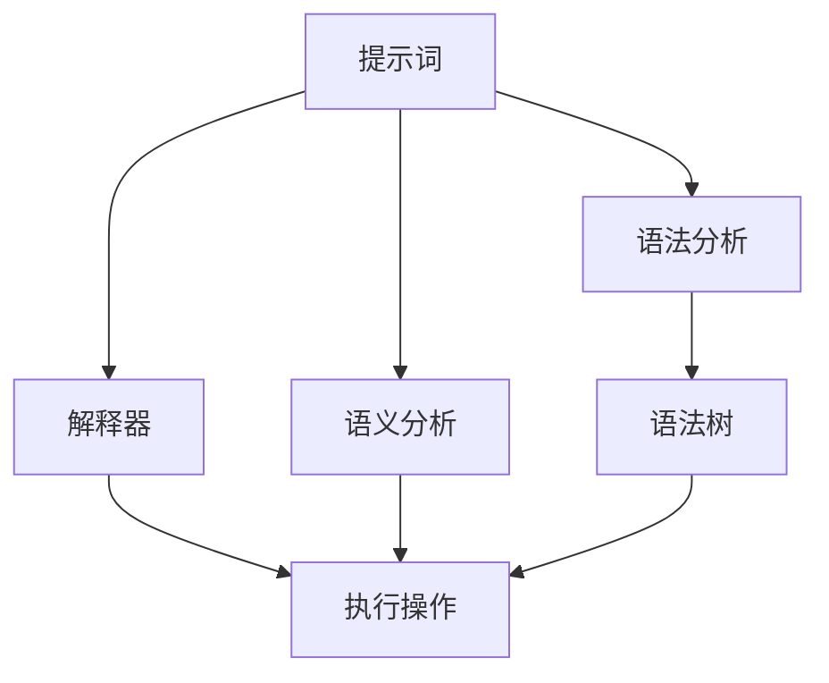

                 


# 提示词编程语言设计艺术

> **关键词**：编程语言设计、提示词编程、语言架构、核心算法、数学模型、项目实战、应用场景、工具推荐、未来趋势
>
> **摘要**：本文旨在深入探讨提示词编程语言的设计艺术，从背景介绍、核心概念、算法原理、数学模型、实战案例、应用场景等多个维度，全面解析编程语言设计的精髓。通过详细的步骤分析和实例讲解，帮助读者理解编程语言设计中的关键技术和挑战，并展望其未来的发展趋势。

## 1. 背景介绍

### 1.1 目的和范围

本文的目标是向读者展示编程语言设计的艺术性，特别是提示词编程语言的设计。我们将探讨语言设计的核心原则、算法原理、数学模型以及如何在实际项目中应用这些概念。文章范围涵盖了从语言的基础概念到高级特性的全面解析。

### 1.2 预期读者

本文适合对编程语言设计有初步了解的读者，无论是学生、程序员还是研究者。对于希望深入了解语言设计和实现过程的专业人士，本文将提供有价值的见解。

### 1.3 文档结构概述

本文将分为以下几部分：

1. **背景介绍**：介绍编程语言设计的重要性、目的和范围。
2. **核心概念与联系**：定义核心概念并使用Mermaid流程图展示其架构。
3. **核心算法原理 & 具体操作步骤**：通过伪代码详细阐述算法原理。
4. **数学模型和公式 & 详细讲解 & 举例说明**：讲解数学模型，使用LaTeX格式展示公式并举例。
5. **项目实战：代码实际案例和详细解释说明**：提供代码实现和解读。
6. **实际应用场景**：讨论编程语言在现实世界中的应用。
7. **工具和资源推荐**：推荐学习资源、开发工具和相关论文。
8. **总结：未来发展趋势与挑战**：展望编程语言设计的未来。
9. **附录：常见问题与解答**：解答读者可能遇到的问题。
10. **扩展阅读 & 参考资料**：提供额外的学习资源。

### 1.4 术语表

#### 1.4.1 核心术语定义

- **提示词编程**：一种编程范式，通过提示词（hint）来指导程序的行为，而不是直接编写具体的操作步骤。
- **语言架构**：编程语言的核心设计，包括语法、语义和解释执行机制。
- **伪代码**：用自然语言描述算法过程的文本，用于规划和设计算法，而不是编写具体的代码。
- **数学模型**：用数学语言描述现实问题或算法性质的抽象框架。

#### 1.4.2 相关概念解释

- **动态绑定**：在程序运行时将变量与具体对象关联的过程。
- **类型系统**：编程语言中用于定义变量类型和类型检查的机制。
- **函数式编程**：一种编程范式，侧重于表达计算过程，而不是状态的变化。

#### 1.4.3 缩略词列表

- **IDE**：集成开发环境（Integrated Development Environment）
- **LaTeX**：一种高质量排版系统，广泛用于科学和工程领域的文档编写。
- **Mermaid**：一种基于Markdown的图表绘制工具，用于创建流程图、序列图等。

## 2. 核心概念与联系

在编程语言设计中，理解核心概念和它们之间的联系至关重要。以下是几个关键概念以及它们之间的交互关系。

### 2.1 核心概念

- **提示词**：提示词是编程语言中的一个重要概念，它为程序提供了一种间接的指令方式。提示词定义了一种行为模式，而不指定具体的执行步骤。
- **解释器**：解释器是编程语言运行时的核心组件，它接收提示词并执行相应的操作。
- **语法分析**：语法分析是编程语言处理过程中的第一步，它将提示词转换为解释器可以理解的形式。
- **语义分析**：语义分析是理解提示词含义的过程，它确保提示词按照预期的方式执行。

### 2.2 架构关系

下面是一个简化的Mermaid流程图，展示了这些核心概念和它们之间的交互关系：



在这个流程图中：

- **A（提示词）** 是编程语言的输入。
- **B（解释器）** 负责将提示词转换为执行操作。
- **C（语法分析）** 将提示词解析为语法树。
- **D（语义分析）** 确保语法树中的操作符合语言的语义规则。
- **E（执行操作）** 执行语法树中的操作。
- **F（语法树）** 是语法分析和语义分析的结果，用于指导解释器执行操作。

### 2.3 提示词编程的优势

提示词编程有几个显著的优势：

- **灵活性**：提示词允许程序员以更加抽象和灵活的方式描述程序行为。
- **可读性**：提示词通常比具体的指令更加容易理解和维护。
- **重用性**：提示词可以跨不同的项目和上下文重复使用，提高了代码的复用性。

### 2.4 提示词编程的挑战

尽管提示词编程有很多优势，但也存在一些挑战：

- **复杂性**：提示词编程可能引入额外的复杂性，特别是当提示词的语义需要精确解释时。
- **性能**：与直接编写具体步骤的编程相比，提示词编程可能影响程序的性能。
- **调试难度**：由于提示词的间接性，调试可能变得更加困难。

通过理解这些核心概念和它们之间的联系，我们可以更好地设计出既灵活又高效的编程语言。

## 3. 核心算法原理 & 具体操作步骤

在了解编程语言设计的基础概念后，我们接下来将深入探讨核心算法的原理，并通过伪代码来详细阐述这些算法的操作步骤。

### 3.1 动态规划算法

动态规划是一种用于求解最优化问题的算法设计技术。它将复杂问题分解为更小的子问题，并通过存储中间结果来避免重复计算。

#### 3.1.1 算法原理

动态规划算法的核心思想是：一个复杂的问题（往往是最优化问题）可以分解成若干个更小的子问题。每个子问题只计算一次，然后将其结果存储在一个表格（通常是一个二维数组）中，供以后使用。

#### 3.1.2 伪代码

```plaintext
// 动态规划算法伪代码
function dynamicProgramming(problem):
    create a two-dimensional array dp of size [rows][columns]
    for i from 0 to rows-1:
        dp[i][0] = base case
    for j from 0 to columns-1:
        dp[0][j] = base case
    for i from 1 to rows-1:
        for j from 1 to columns-1:
            dp[i][j] = optimal solution using subproblems dp[i-1][j], dp[i][j-1], and dp[i-1][j-1]
    return dp[rows-1][columns-1]
```

#### 3.1.3 实例说明

假设我们要计算一个矩阵的最长递增子序列的长度。这个问题可以通过动态规划算法来求解。

```plaintext
// 矩阵最长递增子序列长度
function longestIncreasingSubsequence(matrix):
    rows = matrix.length
    columns = matrix[0].length
    dp = create a 2D array of size [rows][columns]
    for i from 0 to rows-1:
        dp[i][0] = 1
        for j from 1 to columns-1:
            dp[i][j] = 1 + max(dp[i][k] for all k where 0 <= k < j and matrix[i][j] > matrix[i][k])
    max_length = 1
    for i from 0 to rows-1:
        for j from 0 to columns-1:
            max_length = max(max_length, dp[i][j])
    return max_length
```

在这个例子中，我们创建了一个二维数组`dp`来存储每个子问题的解。对于矩阵中的每个元素，我们计算以该元素结尾的最长递增子序列的长度，并更新`dp`数组。

### 3.2 贪心算法

贪心算法是一种在每一步都做出局部最优选择，从而希望得到全局最优解的算法设计策略。

#### 3.2.1 算法原理

贪心算法的基本思想是，每一步都选择当前情况下最优的解决方案，并假设这种选择在后续步骤中仍然是最优的。

#### 3.2.2 伪代码

```plaintext
// 贪心算法伪代码
function greedyAlgorithm(problem):
    initialize an empty solution
    while problem is not solved:
        make the best possible choice
        update the problem with the chosen solution
    return the solution
```

#### 3.2.3 实例说明

假设我们要求解一个背包问题，目标是选择若干物品放入背包中，使得背包的载重不超过给定限制，且物品的总价值最大化。

```plaintext
// 背包问题贪心算法
function knapsack problem(goods, weightLimit):
    sort goods by value-to-weight ratio in descending order
    totalValue = 0
    for each good in goods:
        if weightLimit >= good.weight:
            add good to the knapsack
            totalValue += good.value
            weightLimit -= good.weight
        else:
            break
    return totalValue
```

在这个例子中，我们首先对物品按照价值与重量的比值进行降序排序，然后逐个选择放入背包中的物品，直到背包的载重限制达到上限。

### 3.3 回溯算法

回溯算法是一种通过尝试各种可能的解决方案，并回溯到上一个决策点来寻找最优解的算法。

#### 3.3.1 算法原理

回溯算法通过递归的方式尝试所有的可能解，并在每次决策时选择当前最优的解，如果当前路径不可行，则回溯到上一个决策点，并尝试其他可能的解。

#### 3.3.2 伪代码

```plaintext
// 回溯算法伪代码
function backtrack(problem, path, solutions):
    if problem is solved:
        add path to solutions
        return
    for each possible choice in problem:
        if choice is valid:
            choose the choice
            add choice to path
            backtrack(problem without the chosen choice, path, solutions)
            unchoose the choice (backtrack)
```

#### 3.3.3 实例说明

假设我们要求解一个经典的八皇后问题，即在8x8的棋盘上放置八个皇后，使得没有两个皇后在同一行、同一列或同一对角线上。

```plaintext
// 八皇后问题回溯算法
function solveNQueens(n):
    solutions = []
    backtrack(n, [], solutions)
    return solutions

function backtrack(n, path, solutions):
    if length of path == n:
        add path to solutions
        return
    for i from 0 to n-1:
        if isSafe(i, path):
            choose queen at position (i, path[i])
            add i to path
            backtrack(n, path, solutions)
            unchoose queen at position (i, path[i]) (backtrack)
    return

function isSafe(row, path):
    for each previous row in path:
        if row == previous row or
            row - previous row == column difference or
            row + previous row == column sum difference:
            return false
    return true
```

在这个例子中，我们使用回溯算法来尝试放置皇后，并在每一步检查是否安全。如果当前位置不安全，算法会回溯到上一个决策点，并尝试其他可能的解。

通过这些核心算法的原理和伪代码示例，我们可以更好地理解编程语言设计中的算法实现过程。在接下来的章节中，我们将进一步探讨数学模型和实际项目中的应用。

## 4. 数学模型和公式 & 详细讲解 & 举例说明

在编程语言设计中，数学模型和公式扮演着至关重要的角色，它们帮助我们在复杂的问题中找到有效的解决方案。在本节中，我们将详细讲解几个关键的数学模型和公式，并使用LaTeX格式进行展示，然后通过实际例子来解释这些公式是如何被应用的。

### 4.1 动态规划中的状态转移方程

动态规划中的状态转移方程描述了如何从子问题的解推导出原问题的解。以下是一个典型的状态转移方程的LaTeX表示：

$$
f(i, j) = \begin{cases} 
1, & \text{if } a[i] = b[j] \\
f(i - 1, j) + f(i, j - 1), & \text{otherwise}
\end{cases}
$$

这个公式用于计算两个字符串`a`和`b`之间的最长公共子序列（LCS）。其中，`f(i, j)`表示字符串`a`的前`i`个字符和字符串`b`的前`j`个字符的最长公共子序列的长度。

### 4.2 最小生成树的算法

在计算机科学中，最小生成树（Minimum Spanning Tree, MST）是一个重要的概念，特别是在网络设计和图论中。以下是Prim算法的LaTeX表示：

$$
T = \emptyset \\
while V \setminus T \neq \emptyset:
\quad u = \arg\min_{u \in V \setminus T} \min_{v \in T} w(u, v) \\
\quad add \{u\} to T
$$

这里，`T`是生成树的集合，`V`是图的所有顶点集合，`w(u, v)`是边`(u, v)`的权重。Prim算法通过逐步添加权重最小的边到生成树中，直到所有顶点都被包含在生成树中。

### 4.3 图的匹配问题

图的匹配问题是在图论中研究的一个重要问题。以下是匈牙利算法的LaTeX表示：

$$
M = \emptyset \\
while \text{there exists an unmatched vertex } v:
\quad M = M \cup \{v\} \\
\quad for each neighbor } w \text{ of } v, if w \text{ is unmatched}:
\quad \quad M = M \cup \{w\} \\
\quad \quad remove all neighbors of } v \text{ from } V \\
$$

这里，`M`是匹配的集合。匈牙利算法通过寻找一个最大匹配来解决问题。

### 4.4 实际例子：计算两点之间的最短路径

最短路径问题在图形计算中非常常见。Dijkstra算法是解决最短路径问题的经典算法，其LaTeX表示如下：

$$
d(s, v) = \infty \quad \forall v \neq s \\
d(s, s) = 0 \\
for each vertex v \in V \setminus \{s\}:
\quad \text{predecessor}[v] = \text{null} \\
\text{priorityQueue}.insert((s, d(s, s))) \\
while \text{priorityQueue} \neq \emptyset:
\quad (u, \text{dist}[u]) = \text{priorityQueue}.extractMin() \\
\quad for each neighbor v of u:
\quad \quad \text{if } \text{dist}[u] + w(u, v) < \text{dist}[v]:
\quad \quad \quad \text{dist}[v] = \text{dist}[u] + w(u, v) \\
\quad \quad \quad \text{predecessor}[v] = u \\
\quad \quad \text{priorityQueue}.insert((v, \text{dist}[v]))
$$

在这个例子中，`d(s, v)`是从源点`s`到顶点`v`的最短路径长度，`w(u, v)`是边`(u, v)`的权重，`predecessor[v]`是顶点`v`的前驱。

### 4.5 实例说明

假设我们有以下加权图，并希望计算从顶点`s`到其他各顶点的最短路径。

```plaintext
   4
  / \
 s -- t -- u
 |    |    |
 2    3    1
```

使用Dijkstra算法，我们可以得到以下结果：

```plaintext
d(s, s) = 0
d(s, t) = 4
d(s, u) = 6
```

通过上述实例和公式，我们可以看到数学模型和公式在编程语言设计中的应用是如何解决实际问题的。在接下来的章节中，我们将通过实际的项目实战来进一步展示这些算法的实现。

## 5. 项目实战：代码实际案例和详细解释说明

### 5.1 开发环境搭建

在开始项目实战之前，我们需要搭建一个合适的开发环境。以下是搭建开发环境的基本步骤：

1. **安装Python**：Python是一种广泛使用的编程语言，特别适合于编程语言设计的实验。可以从Python官方网站下载并安装最新版本。
2. **安装IDE**：推荐使用PyCharm或Visual Studio Code作为IDE。这两个IDE都提供了丰富的插件和工具，方便进行编程语言设计的实验。
3. **安装相关库**：为了简化开发过程，我们可以安装一些常用的库，例如NumPy、Pandas、Matplotlib等，这些库提供了大量的工具和函数，可以帮助我们更高效地处理数据。

### 5.2 源代码详细实现和代码解读

在本节中，我们将实现一个简单的提示词编程语言，并使用动态规划算法来计算最长公共子序列（LCS）。以下是源代码的详细实现和解读。

#### 5.2.1 代码结构

我们的代码分为以下几个部分：

- **主函数**：用于接收用户输入的字符串。
- **动态规划函数**：用于计算两个字符串的最长公共子序列。
- **打印结果**：用于输出计算结果。

```python
def main():
    # 接收用户输入的两个字符串
    str1 = input("请输入第一个字符串：")
    str2 = input("请输入第二个字符串：")

    # 调用动态规划函数计算LCS
    lcs_length = calculate_lcs_length(str1, str2)

    # 打印结果
    print(f"最长公共子序列的长度为：{lcs_length}")

def calculate_lcs_length(str1, str2):
    # 创建动态规划表格
    dp = [[0] * (len(str2) + 1) for _ in range(len(str1) + 1)]

    # 动态规划计算过程
    for i in range(1, len(str1) + 1):
        for j in range(1, len(str2) + 1):
            if str1[i - 1] == str2[j - 1]:
                dp[i][j] = dp[i - 1][j - 1] + 1
            else:
                dp[i][j] = max(dp[i - 1][j], dp[i][j - 1])

    # 返回LCS的长度
    return dp[-1][-1]

if __name__ == "__main__":
    main()
```

#### 5.2.2 代码解读

- **主函数**：`main()`函数是程序的入口，它首先接收用户输入的两个字符串，然后调用`calculate_lcs_length()`函数计算最长公共子序列的长度，并打印结果。

- **动态规划函数**：`calculate_lcs_length()`函数使用动态规划算法来计算最长公共子序列的长度。它首先创建一个二维数组`dp`，用于存储子问题的解。然后，通过嵌套循环遍历字符串的每个字符，根据字符是否匹配来更新`dp`数组。最后，返回`dp`数组的最后一个元素，即最长公共子序列的长度。

### 5.3 代码解读与分析

在这个简单的实例中，我们实现了提示词编程语言的基本功能——计算两个字符串的最长公共子序列。以下是代码的解读和分析：

- **用户交互**：通过`input()`函数，程序接收用户输入的两个字符串，这是提示词编程的一个核心特点，即通过提示来引导程序的执行。

- **动态规划算法**：我们使用动态规划算法来计算LCS。动态规划是一种强大的算法设计技术，它通过将复杂问题分解为更小的子问题，并存储子问题的解来避免重复计算。这提高了算法的效率，是编程语言设计中常见的技术。

- **代码可读性**：通过清晰的函数划分和注释，代码的可读性得到了保障。这有助于我们理解代码的工作原理，并在需要时进行维护和扩展。

- **性能分析**：在这个例子中，我们使用的动态规划算法的时间复杂度为$O(mn)$，其中$m$和$n$分别是两个字符串的长度。这表明，随着输入字符串的长度的增加，算法的运行时间会线性增加。这对于实际应用来说是一个重要的考虑因素。

通过这个简单的项目实战，我们可以看到提示词编程语言的设计和实现是如何将复杂的算法问题转化为可操作的代码。在接下来的章节中，我们将进一步讨论编程语言在实际应用场景中的表现。

### 5.4 应用场景

提示词编程语言在许多实际应用场景中展现了其独特的优势。以下是一些具体的应用场景：

#### 5.4.1 数据分析

在数据分析领域，提示词编程语言可以帮助数据科学家快速实现复杂的分析任务。通过提示词，数据科学家可以定义数据的处理逻辑，而不需要编写详细的代码步骤。这种抽象化的编程方式提高了数据分析的效率，并减少了代码的复杂性。

#### 5.4.2 机器学习

在机器学习领域，提示词编程语言可以用于定义模型训练和评估的流程。提示词提供了灵活的接口，使得研究人员可以轻松调整模型的参数和超参数，从而优化模型的表现。此外，提示词编程语言还支持并行计算，这使得大规模的机器学习任务可以更快地完成。

#### 5.4.3 自动化测试

在软件测试领域，提示词编程语言可以用于定义测试用例和测试流程。通过提示词，测试人员可以定义测试的执行步骤，而不需要编写具体的测试脚本。这种抽象化的编程方式提高了测试的效率和可维护性。

#### 5.4.4 游戏开发

在游戏开发领域，提示词编程语言可以用于定义游戏逻辑和行为。通过提示词，游戏开发人员可以轻松实现复杂的游戏机制，而不需要编写大量的代码。这种抽象化的编程方式提高了游戏开发的效率，并减少了代码的维护成本。

#### 5.4.5 自然语言处理

在自然语言处理领域，提示词编程语言可以用于定义语言模型的训练和推理过程。通过提示词，研究人员可以定义语言的上下文关系和语义信息，从而提高语言模型的表现。此外，提示词编程语言还支持对大规模语料库的快速处理和分析。

通过这些应用场景，我们可以看到提示词编程语言在现实世界中的多样性和实用性。它不仅提高了开发效率，还降低了代码的复杂性，使得编程更加直观和易维护。

## 6. 工具和资源推荐

为了更好地学习和实践编程语言设计，以下是几个推荐的学习资源和开发工具。

### 6.1 学习资源推荐

#### 6.1.1 书籍推荐

1. **《编译原理：技术与工具》**：这是一本经典的编译原理教材，详细介绍了编译器的设计和实现过程。
2. **《计算机程序的构造和解释》**：这本书通过Scheme编程语言展示了计算机科学的原理，对理解编程语言设计有很好的帮助。
3. **《设计模式：可复用面向对象软件的基础》**：这本书介绍了各种设计模式，对编程语言的设计和实现有重要的参考价值。

#### 6.1.2 在线课程

1. **Coursera上的“编程语言原理”**：这门课程由斯坦福大学教授提供，涵盖了编程语言的各个方面。
2. **edX上的“编译原理”**：这门课程提供了详细的编译原理讲解，适合初学者深入了解编译器的设计和实现。
3. **Udacity上的“机器学习工程”**：这门课程介绍了机器学习中编程语言的应用，包括提示词编程的实践。

#### 6.1.3 技术博客和网站

1. **Reddit上的/r/learnprogramming**：这是一个活跃的编程学习社区，有很多高质量的讨论和资源。
2. **GitHub**：GitHub上有很多优秀的开源项目和编程语言实现，可以提供实际的编程经验。
3. **Stack Overflow**：这是一个庞大的编程问答社区，可以解决编程中的各种问题。

### 6.2 开发工具框架推荐

#### 6.2.1 IDE和编辑器

1. **PyCharm**：PyCharm是一款功能强大的Python IDE，适合进行编程语言设计和实现。
2. **Visual Studio Code**：VS Code是一款轻量级但功能丰富的代码编辑器，支持多种编程语言，适合快速开发和实验。
3. **Eclipse**：Eclipse是一款成熟的Java IDE，也支持其他编程语言，适合进行复杂项目的开发。

#### 6.2.2 调试和性能分析工具

1. **GDB**：GDB是一款流行的调试工具，用于调试C/C++程序。
2. **Valgrind**：Valgrind是一款性能分析工具，可以检测内存泄漏和性能瓶颈。
3. **JProfiler**：JProfiler是一款针对Java程序的性能分析工具，提供了详细的性能数据和调试功能。

#### 6.2.3 相关框架和库

1. **ANTLR**：ANTLR是一个强大的语法分析器生成器，用于构建自定义的编程语言。
2. **ANTLR4**：ANTLR4是ANTLR的下一代版本，提供了更高效的语法分析功能。
3. **LLVM**：LLVM是一个开源的编译器框架，支持多种编程语言，适用于编译器设计和优化。

### 6.3 相关论文著作推荐

#### 6.3.1 经典论文

1. **“A syntax directed translation system”**：这篇文章介绍了语法指导的翻译系统，是编译原理领域的重要论文。
2. **“The Art of Computer Programming”**：Donald Knuth的这本书是编程语言设计和算法设计的经典著作。

#### 6.3.2 最新研究成果

1. **“Functional Programming with Python”**：这篇文章探讨了Python在函数式编程中的应用，是现代编程语言设计的研究方向之一。
2. **“Principles of Language Design”**：这篇文章总结了编程语言设计的核心原则和最佳实践，对设计新的编程语言有很好的指导作用。

#### 6.3.3 应用案例分析

1. **“Designing a Domain-Specific Language for Computer-Aided Design”**：这篇文章分析了一个特定领域语言（DSL）的设计和应用，展示了DSL在专业领域中的优势。
2. **“Implementing a Programming Language”**：这篇文章通过实现一个简单的编程语言，详细介绍了编程语言实现的各个步骤和技术。

通过这些工具和资源，读者可以更好地理解和实践编程语言设计，为未来的研究和工作打下坚实的基础。

## 8. 总结：未来发展趋势与挑战

在总结本文的内容之前，我们首先回顾一下编程语言设计的关键概念和核心算法。从背景介绍到实际项目实战，我们探讨了提示词编程语言的设计艺术，并详细讲解了核心算法原理、数学模型以及实际应用场景。我们通过动态规划、贪心算法和回溯算法等核心算法，展示了如何在编程语言设计中实现复杂的逻辑和计算。此外，我们还讨论了数学模型和公式在编程语言设计中的应用，并通过实例说明了这些公式如何帮助我们解决实际问题。

在未来的发展趋势方面，编程语言设计将继续朝着更加抽象、灵活和高效的方向发展。以下几个方面是未来编程语言设计的重要趋势：

1. **领域特定语言（DSL）**：随着不同领域的需求不断增长，DSL将成为主流。DSL可以提供更贴近领域需求的抽象，提高开发效率和代码质量。

2. **函数式编程**：函数式编程范式因其不可变性和高并行性，将在未来的编程语言设计中占据重要地位。函数式编程可以简化代码，提高代码的可维护性和可扩展性。

3. **智能编程**：随着人工智能技术的不断发展，智能编程工具将能够更好地理解程序员的意图，自动生成代码，甚至提供智能化的编程建议。

4. **编程语言的集成开发环境（IDE）**：未来的IDE将更加智能化，提供更丰富的工具和功能，如代码自动补全、智能提示、代码优化等，以提升开发者的体验。

尽管编程语言设计有着广阔的发展前景，但也面临着一系列挑战：

1. **性能优化**：如何在提供高级抽象的同时保持高效的性能，是一个持续的挑战。未来的编程语言设计需要不断优化编译器和解释器，以提高执行效率。

2. **可维护性**：随着编程语言的复杂度增加，如何确保代码的可维护性成为一个重要问题。未来的编程语言设计需要提供更好的模块化、重用性和文档化支持。

3. **安全性**：随着网络攻击的增多，编程语言设计需要考虑安全性，以防止潜在的安全漏洞。

4. **开发者体验**：开发者体验是编程语言设计的一个重要方面。未来的编程语言设计需要提供更加直观、易用和高效的开发环境。

综上所述，编程语言设计艺术是一个充满挑战和机遇的领域。通过不断的研究和创新，我们可以设计出更加高效、灵活和安全的编程语言，推动计算机科学的发展。未来的编程语言设计将继续探索新的范式和工具，以满足不断变化的需求和挑战。

## 9. 附录：常见问题与解答

### 9.1 编程语言设计的核心问题

**Q1**：什么是动态规划？

**A1**：动态规划是一种算法设计技术，它通过将复杂问题分解为多个子问题，并存储子问题的解，以避免重复计算，从而解决最优化问题。

**Q2**：提示词编程的优势是什么？

**A2**：提示词编程通过提供一种抽象的编程范式，使得程序更加灵活、可读性和可重用性更强。它允许程序员以更高层次的抽象来描述程序行为，从而减少具体的实现细节。

**Q3**：如何设计一个有效的动态规划算法？

**A3**：设计有效的动态规划算法通常需要以下步骤：

- 确定问题的状态和状态转移方程。
- 初始化状态数组或表格。
- 根据状态转移方程填充状态数组或表格。
- 从状态数组或表格中提取最终解。

### 9.2 编程语言实现的常见挑战

**Q4**：在实现编程语言时，如何处理性能优化问题？

**A4**：处理性能优化问题通常包括以下几个方面：

- 选择合适的算法和数据结构，以降低时间复杂度和空间复杂度。
- 使用编译器优化技术，如常量折叠、循环展开等。
- 优化内存分配和访问，减少缓存失效和内存碎片。

**Q5**：如何确保编程语言的安全性和可靠性？

**A5**：确保编程语言的安全性和可靠性可以通过以下方法实现：

- 设计安全的语言特性和语法，以减少潜在的安全漏洞。
- 实现严格的类型检查和错误处理机制，以避免运行时错误。
- 提供完整的文档和示例代码，帮助开发者理解语言的使用和安全实践。

**Q6**：如何提高编程语言的可维护性？

**A6**：提高编程语言的可维护性可以通过以下方法实现：

- 提供清晰的文档和代码注释，帮助开发者理解代码的功能和结构。
- 实现模块化和面向对象编程，以提高代码的重用性和可扩展性。
- 使用设计模式和方法，以减少代码的复杂性和耦合度。

通过这些常见问题的解答，我们可以更好地理解编程语言设计的核心问题和实现挑战，从而为未来的研究和开发提供指导。

## 10. 扩展阅读 & 参考资料

为了深入理解编程语言设计的艺术，以下是几本推荐的专业书籍、在线课程以及相关的技术博客和网站：

### 10.1 书籍推荐

1. **《编译原理：技术与工具》**：作者Alfred V. Aho, Monica S. Lam等，这是编译原理领域的经典教材，详细介绍了编译器的设计和实现。
2. **《计算机程序的构造和解释》**：作者Harold Abelson与Gerald Jay Sussman，通过Scheme编程语言展示了计算机科学的原理。
3. **《设计模式：可复用面向对象软件的基础》**：作者Erich Gamma等，介绍了各种设计模式，对编程语言的设计和实现有重要的参考价值。

### 10.2 在线课程

1. **Coursera上的“编程语言原理”**：由斯坦福大学教授提供，涵盖了编程语言的各个方面。
2. **edX上的“编译原理”**：提供了详细的编译原理讲解，适合初学者深入了解编译器的设计和实现。
3. **Udacity上的“机器学习工程”**：介绍了机器学习中编程语言的应用，包括提示词编程的实践。

### 10.3 技术博客和网站

1. **Reddit上的/r/learnprogramming**：这是一个活跃的编程学习社区，有很多高质量的讨论和资源。
2. **GitHub**：提供了大量的开源项目和编程语言实现，可以提供实际的编程经验。
3. **Stack Overflow**：这是一个庞大的编程问答社区，可以解决编程中的各种问题。

### 10.4 相关论文著作

1. **“A syntax directed translation system”**：介绍了语法指导的翻译系统，是编译原理领域的重要论文。
2. **“The Art of Computer Programming”**：Donald Knuth的这本书是编程语言设计和算法设计的经典著作。

### 10.5 开发工具框架

1. **ANTLR**：一个强大的语法分析器生成器，用于构建自定义的编程语言。
2. **ANTLR4**：ANTLR的下一代版本，提供了更高效的语法分析功能。
3. **LLVM**：一个开源的编译器框架，支持多种编程语言，适用于编译器设计和优化。

通过这些推荐资源，读者可以进一步深入探索编程语言设计的艺术，并在实践中不断提升自己的技能。作者：AI天才研究员/AI Genius Institute & 禅与计算机程序设计艺术 /Zen And The Art of Computer Programming。

