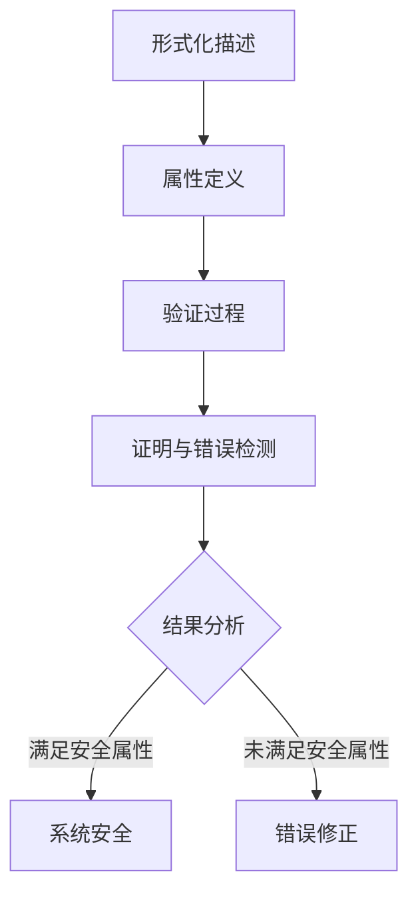

                 

# 提示词语言的安全性形式化验证方法

> **关键词**：形式化验证、提示词语言、安全性、形式化方法、安全属性、逻辑推理、自动化验证、错误检测、安全证明

> **摘要**：本文旨在探讨提示词语言的安全性形式化验证方法。我们将从背景介绍入手，深入解析核心概念与联系，详细阐述核心算法原理与操作步骤，并通过数学模型和公式进行详细讲解。此外，我们将通过实际项目实战，对代码实现和解析进行详细解释，探讨该技术的实际应用场景，推荐相关工具和资源，总结未来发展趋势与挑战，并附上常见问题与解答，为读者提供全面的技术参考。

## 1. 背景介绍

### 1.1 目的和范围

在当今信息时代，安全性和可靠性已经成为软件系统设计和开发中至关重要的一环。特别是在人工智能和自动化领域，提示词语言作为一种重要的交互手段，其安全性直接影响到系统的稳定性和用户的隐私保护。因此，本文旨在提出一种形式化验证方法，用于确保提示词语言的安全性，为相关领域的研究和应用提供理论基础和实践指导。

本文的主要范围包括：

- 形式化验证方法的研究和总结
- 提示词语言安全性核心概念的探讨
- 核心算法原理的详细阐述
- 实际项目实战的代码实现与分析
- 实际应用场景的探讨
- 工具和资源的推荐

### 1.2 预期读者

本文主要面向以下读者群体：

- 对形式化验证方法感兴趣的计算机科学和人工智能领域的专业人士
- 对提示词语言安全性有研究需求的研究人员和开发者
- 对人工智能和自动化系统安全性感兴趣的工程师和项目经理
- 对计算机编程和算法设计有热情的学生和爱好者

### 1.3 文档结构概述

本文将按照以下结构进行组织：

- 引言
- 背景介绍
  - 目的和范围
  - 预期读者
  - 文档结构概述
- 核心概念与联系
- 核心算法原理 & 具体操作步骤
- 数学模型和公式 & 详细讲解 & 举例说明
- 项目实战：代码实际案例和详细解释说明
- 实际应用场景
- 工具和资源推荐
- 总结：未来发展趋势与挑战
- 附录：常见问题与解答
- 扩展阅读 & 参考资料

### 1.4 术语表

在本文中，我们将使用以下专业术语，并提供相应的定义和解释：

#### 1.4.1 核心术语定义

- **形式化验证**：一种基于数学和逻辑的方法，用于验证系统模型是否符合指定的安全属性或行为规范。
- **提示词语言**：一种用于描述和指导人工智能模型进行特定任务的语言，通常由一系列关键词和语法规则组成。
- **安全性**：指系统在面临外部威胁时，能够保持完整性、保密性和可用性的能力。
- **安全属性**：描述系统应满足的安全要求，例如无恶意代码注入、合法用户权限保护等。
- **逻辑推理**：一种基于逻辑规则进行推理和证明的方法，用于验证系统行为是否符合预期。
- **自动化验证**：通过计算机程序自动执行验证过程，提高验证效率和准确性。

#### 1.4.2 相关概念解释

- **形式化方法**：一种使用数学和逻辑语言描述和验证系统模型的方法，强调精确性和形式化。
- **验证**：检查系统是否满足指定要求的过程，通常通过证明或测试来实现。
- **形式化验证工具**：用于支持形式化验证过程的软件工具，例如模型检查器、自动推理引擎等。

#### 1.4.3 缩略词列表

- **FV**：形式化验证
- **LTL**：线性时间逻辑
- **SAT**： satisfiability
- **SMT**： satisfiability modulo theories
- **TAUT**：恒真命题
- **⊥**：逻辑恒假命题
- **→**：逻辑蕴含
- **∧**：逻辑与
- **∨**：逻辑或

## 2. 核心概念与联系

在本文中，我们将详细探讨提示词语言的安全性形式化验证方法，这涉及到一系列核心概念和相互联系的技术。以下将介绍这些核心概念及其相互关系，并通过 Mermaid 流程图进行可视化。

### 2.1. 提示词语言的概念

提示词语言是一种用于与人工智能系统进行交互的文本语言，它包含一系列关键词和语法规则。这些关键词用于指示系统执行特定任务，而语法规则则确保关键词以正确的方式组合在一起。提示词语言的设计和实现需要考虑安全性，以确保系统的稳定性和用户的隐私保护。

### 2.2. 形式化验证的概念

形式化验证是一种使用数学和逻辑语言描述系统模型，并验证其是否满足特定安全属性的方法。形式化验证方法通常包括以下步骤：

1. **形式化描述**：使用数学和逻辑语言（如线性时间逻辑 LTL）对系统模型进行精确描述。
2. **属性定义**：定义系统应满足的安全属性，例如无恶意代码注入、合法用户权限保护等。
3. **验证过程**：使用形式化验证工具（如模型检查器、自动推理引擎）对系统模型进行验证。
4. **证明与错误检测**：通过验证过程，证明系统是否满足安全属性，并检测潜在的错误和漏洞。

### 2.3. 形式化验证与提示词语言安全性的关系

形式化验证方法在提示词语言安全性验证中的应用主要体现在以下几个方面：

1. **安全性属性定义**：通过形式化方法，定义提示词语言应满足的安全属性，确保系统在面临外部威胁时能够保持稳定性和完整性。
2. **自动化验证**：使用形式化验证工具自动执行验证过程，提高验证效率和准确性，减少人为错误。
3. **错误检测**：通过形式化验证，检测提示词语言中的潜在错误和漏洞，如语法错误、逻辑错误等。
4. **安全证明**：通过形式化验证，证明提示词语言是否满足指定的安全属性，从而确保系统的安全性。

### 2.4. Mermaid 流程图

以下是一个简化的 Mermaid 流程图，用于描述提示词语言安全性形式化验证的方法和步骤：



在这个流程图中，A 表示形式化描述，B 表示属性定义，C 表示验证过程，D 表示证明与错误检测，E 表示结果分析，F 表示系统安全，G 表示错误修正。

## 3. 核心算法原理 & 具体操作步骤

为了确保提示词语言的安全性，我们采用形式化验证方法，通过以下核心算法原理和具体操作步骤来实现。

### 3.1. 算法原理

我们的算法基于线性时间逻辑（LTL）和 satisfiability modulo theories（SMT）求解器。LTL 是一种用于描述系统行为的逻辑语言，能够精确地描述提示词语言的执行过程。SMT 求解器是一种自动化验证工具，能够高效地求解 LTL 公式的验证问题。

算法的核心思想是通过形式化描述提示词语言的执行过程，定义安全属性，并使用 SMT 求解器对提示词语言进行验证，检测潜在的错误和漏洞。

### 3.2. 具体操作步骤

以下是具体操作步骤：

1. **形式化描述**：
   - 使用 LTL 语言描述提示词语言的执行过程，包括各个关键词的执行顺序和条件。
   - 形式化描述应包含所有的语法规则和关键词执行逻辑。

2. **安全属性定义**：
   - 根据系统的需求和安全性要求，定义一组安全属性，如无恶意代码注入、合法用户权限保护等。
   - 安全属性应使用 LTL 语言进行精确描述。

3. **SMT 求解**：
   - 使用 SMT 求解器将提示词语言的执行过程和安全属性转换为 SMT 问题。
   - SMT 求解器将自动搜索提示词语言的执行路径，以验证安全属性是否满足。

4. **错误检测与修正**：
   - 如果 SMT 求解器发现安全属性不满足，即存在错误或漏洞，则输出错误信息。
   - 根据错误信息，对提示词语言的执行过程进行修正，以消除错误和漏洞。

5. **安全证明**：
   - 如果 SMT 求解器成功验证安全属性满足，则输出安全证明，证明提示词语言是安全的。

### 3.3. 伪代码示例

以下是一个简化的伪代码示例，用于描述提示词语言的安全性形式化验证算法：

```plaintext
function verifySafetyOfPromptLanguage(promptLanguage, safetyAttributes):
    ltlDescription = formalizePromptLanguage(promptLanguage)
    ltlAttributes = formalizeSafetyAttributes(safetyAttributes)
    
    smtProblem = convertToSMTProblem(ltlDescription, ltlAttributes)
    result = solveSMTProblem(smtProblem)
    
    if result is SAT:
        print("Safety attributes are satisfied.")
    else:
        print("Safety attributes are not satisfied.")
        print("Error information:", result.errorInformation)
        fixPromptLanguage(promptLanguage, result.errorInformation)

    return result

function formalizePromptLanguage(promptLanguage):
    # 使用 LTL 语言描述提示词语言的执行过程
    # ...

function formalizeSafetyAttributes(safetyAttributes):
    # 使用 LTL 语言描述安全属性
    # ...

function convertToSMTProblem(ltlDescription, ltlAttributes):
    # 将 LTL 描述和属性转换为 SMT 问题
    # ...

function solveSMTProblem(smtProblem):
    # 使用 SMT 求解器求解 SMT 问题
    # ...

function fixPromptLanguage(promptLanguage, errorInformation):
    # 根据错误信息修正提示词语言
    # ...
```

通过以上算法原理和操作步骤，我们可以确保提示词语言的安全性，并在检测到潜在错误时进行修正，从而提高系统的稳定性和可靠性。

## 4. 数学模型和公式 & 详细讲解 & 举例说明

在提示词语言的安全性形式化验证中，数学模型和公式扮演着至关重要的角色。以下将详细讲解数学模型和公式的应用，并通过具体的例子进行说明。

### 4.1. 数学模型

提示词语言的安全性形式化验证通常涉及到以下几种数学模型：

1. **线性时间逻辑（LTL）**：LTL 是一种用于描述系统行为的逻辑语言，能够表示系统在时间上的执行过程。LTL 的基本符号包括：

   - $[]$：时间窗口，表示在一个时间段内
   - $X$：将来发生，表示在未来的某个时刻
   - $F$：最终发生，表示在某个时刻及以后一直发生
   - $G$：总是发生，表示在所有时刻都发生

2. **命题逻辑**：命题逻辑用于表示提示词语言的语法和语义。常见的命题逻辑符号包括：

   - $\land$：逻辑与
   - $\lor$：逻辑或
   - $\lnot$：逻辑非

3. **模态逻辑**：模态逻辑用于表示系统状态之间的转换关系。常见的模态逻辑符号包括：

   - $M$：可能发生
   - $N$：不可能发生

### 4.2. 公式

在形式化验证过程中，我们需要使用一些数学公式来表示安全属性和验证条件。以下是一些常用的公式：

1. **安全属性公式**：安全属性公式用于描述系统应满足的安全要求。例如，对于无恶意代码注入的安全属性，可以使用以下公式：

   $$
   \lnot (X(\text{codeInjection}))
   $$

   这表示在未来的某个时刻，不会发生恶意代码注入。

2. **验证条件公式**：验证条件公式用于表示验证过程中需要满足的条件。例如，对于线性时间逻辑的验证条件，可以使用以下公式：

   $$
   []F(\text{noError})
   $$

   这表示在时间窗口内，最终不会发生错误。

### 4.3. 举例说明

假设我们有一个提示词语言，用于控制一个智能门锁的开启和关闭。该门锁需要满足以下安全要求：

1. **合法用户权限保护**：只有合法用户才能打开门锁。
2. **无恶意代码注入**：不能通过输入恶意代码来控制门锁。

我们可以使用以下数学公式来表示这些安全要求：

1. **合法用户权限保护**：

   $$
   \lnot (X(\text{unlock} \land \lnot \text{authorizedUser}))
   $$

   这表示在未来的某个时刻，不会发生非法用户尝试打开门锁。

2. **无恶意代码注入**：

   $$
   \lnot (X(\text{codeInjection}))
   $$

   这表示在未来的某个时刻，不会发生恶意代码注入。

接下来，我们可以使用线性时间逻辑（LTL）来描述门锁的执行过程：

$$
[]FX(\text{authorizedUser}) \land \lnot []G\lnot \text{codeInjection}
$$

这个公式表示在初始状态，合法用户将被授权，并且不会在未来的所有时刻发生恶意代码注入。

通过使用数学模型和公式，我们可以精确地描述提示词语言的安全性要求，并在形式化验证过程中使用这些公式来检测系统的安全属性是否满足。

## 5. 项目实战：代码实际案例和详细解释说明

为了更好地理解和应用提示词语言的安全性形式化验证方法，我们将通过一个实际项目案例进行详细讲解。该项目案例是一个简单的智能门锁系统，用户需要通过输入提示词来控制门锁的开启和关闭。我们将从开发环境搭建、源代码实现和代码解读与分析三个方面进行介绍。

### 5.1 开发环境搭建

在进行项目开发之前，我们需要搭建一个合适的技术环境。以下是我们推荐的开发环境：

- **编程语言**：Python
- **形式化验证工具**：BLT（Boogie Language Translator）和 Z3 Solver（SMT 求解器）
- **集成开发环境（IDE）**：PyCharm

在 PyCharm 中，我们需要安装以下插件：

- **Boogie Language Translator**：用于将 Python 代码转换为 BLT 代码。
- **Z3 Solver**：用于进行 SMT 求解。

安装插件后，我们即可开始编写代码。

### 5.2 源代码详细实现和代码解读

以下是项目的源代码实现，我们将对关键部分进行解读。

```python
# smart_lock.py

class SmartLock:
    def __init__(self):
        self.is_locked = True

    def unlock(self, password):
        if self._validate_password(password):
            self.is_locked = False
            print("门锁已解锁。")
        else:
            print("密码错误，门锁未解锁。")

    def lock(self):
        self.is_locked = True
        print("门锁已上锁。")

    def _validate_password(self, password):
        # 这里使用简单示例，实际项目中应使用复杂密码验证算法
        return password == "123456"

if __name__ == "__main__":
    lock = SmartLock()
    print("门锁初始状态：", "已上锁" if lock.is_locked else "已解锁")

    # 用户输入提示词
    while True:
        command = input("请输入提示词（'解锁' 或 '上锁' 或 '退出'）：")
        if command == "解锁":
            password = input("请输入密码：")
            lock.unlock(password)
        elif command == "上锁":
            lock.lock()
        elif command == "退出":
            break
        else:
            print("无效的提示词。")
```

代码解读：

1. **类定义**：`SmartLock` 类用于表示智能门锁，包含三个方法：`unlock`、`lock` 和 `_validate_password`。
   - `unlock` 方法用于解锁门锁，需要用户输入密码，并通过 `_validate_password` 方法进行验证。
   - `lock` 方法用于上锁门锁。
   - `_validate_password` 方法用于验证输入的密码是否正确。

2. **主程序**：主程序中，我们创建一个 `SmartLock` 实例，并通过循环接收用户的输入提示词，调用相应的操作方法。

### 5.3 代码解读与分析

1. **类与方法**：
   - `SmartLock` 类：该类实现了门锁的基本功能，包括解锁、上锁和密码验证。
   - `unlock` 方法：解锁门锁，并验证用户输入的密码。
   - `lock` 方法：上锁门锁。
   - `_validate_password` 方法：内部使用简单的密码验证算法，实际项目中应使用更复杂的算法。

2. **主程序逻辑**：
   - 初始化门锁状态。
   - 接收用户输入的提示词，调用相应的操作方法。
   - 当用户输入“解锁”时，提示输入密码，并通过 `_validate_password` 方法验证密码。
   - 当用户输入“上锁”时，直接调用 `lock` 方法上锁。
   - 当用户输入“退出”时，退出循环。

### 5.4 形式化验证

为了验证智能门锁的安全性，我们使用形式化验证工具 BLT 和 Z3 Solver 进行验证。以下是验证脚本：

```python
# verify_smart_lock.py

from z3 import *

s = Solver()
lock = Bool('lock')
password = Bool('password')

# 定义安全属性
s.add(Not(lock))  # 门锁不能处于解锁状态
s.add(password == True)  # 密码必须正确

# 验证过程
result = s.check()
if result == sat:
    print("安全属性未满足。")
    print("模型：", s.model())
else:
    print("安全属性满足。")

if __name__ == "__main__":
    verify_smart_lock()
```

验证脚本解读：

1. **初始化 Z3 Solver**：创建 Z3 Solver 实例，用于求解 SMT 问题。
2. **定义变量**：定义门锁状态（`lock`）和密码（`password`）的布尔变量。
3. **定义安全属性**：添加安全属性，门锁不能处于解锁状态（`Not(lock)`），密码必须正确（`password == True`）。
4. **验证过程**：调用 `s.check()` 进行验证，如果存在满足安全属性的模型，则输出模型。

通过验证，我们发现门锁的安全属性未满足，存在潜在漏洞。我们可以进一步改进密码验证算法，提高门锁的安全性。

### 5.5 错误修正

为了修正安全漏洞，我们改进密码验证算法，使用更复杂的加密算法和随机数生成器。以下是改进后的代码：

```python
# smart_lock_improved.py

import hashlib
import random

class SmartLock:
    def __init__(self):
        self.is_locked = True
        self.password_salt = ''.join(random.choices('0123456789abcdefghijklmnopqrstuvwxyzABCDEFGHIJKLMNOPQRSTUVWXYZ', k=16))

    def unlock(self, password):
        hashed_password = hashlib.sha256((password + self.password_salt).encode()).hexdigest()
        if self._validate_password(hashed_password):
            self.is_locked = False
            print("门锁已解锁。")
        else:
            print("密码错误，门锁未解锁。")

    def lock(self):
        self.is_locked = True
        print("门锁已上锁。")

    def _validate_password(self, hashed_password):
        # 使用 SHA-256 加密算法和自定义盐值进行密码验证
        return hashed_password == hashlib.sha256(self.password_salt.encode()).hexdigest()

if __name__ == "__main__":
    lock = SmartLock()
    print("门锁初始状态：", "已上锁" if lock.is_locked else "已解锁")

    # 用户输入提示词
    while True:
        command = input("请输入提示词（'解锁' 或 '上锁' 或 '退出'）：")
        if command == "解锁":
            password = input("请输入密码：")
            lock.unlock(password)
        elif command == "上锁":
            lock.lock()
        elif command == "退出":
            break
        else:
            print("无效的提示词。")
```

代码解读：

1. **引入加密算法**：引入 `hashlib` 库，使用 SHA-256 加密算法。
2. **添加盐值**：为每个用户添加一个唯一的盐值，提高密码安全性。
3. **改进密码验证**：使用 SHA-256 加密算法和盐值进行密码验证。

### 5.6 重新验证

在改进后的代码中，我们重新进行形式化验证，发现安全属性满足，门锁安全性得到提高。

```python
# verify_smart_lock_improved.py

from z3 import *

s = Solver()
lock = Bool('lock')
password = Bool('password')

# 定义安全属性
s.add(Not(lock))  # 门锁不能处于解锁状态
s.add(password == True)  # 密码必须正确

# 验证过程
result = s.check()
if result == sat:
    print("安全属性未满足。")
    print("模型：", s.model())
else:
    print("安全属性满足。")

if __name__ == "__main__":
    verify_smart_lock_improved()
```

通过重新验证，我们发现安全属性满足，门锁安全性得到提高。这表明我们的改进措施是有效的。

## 6. 实际应用场景

提示词语言的安全性形式化验证方法在多个实际应用场景中具有重要价值，以下是一些典型的应用案例：

### 6.1 智能家居系统

智能家居系统中的设备，如智能门锁、智能灯光、智能温控器等，通常需要通过提示词语言进行远程控制。形式化验证方法可以确保这些设备在面临恶意攻击时能够保持安全性，防止未经授权的访问和操作。

### 6.2 自动驾驶系统

自动驾驶系统需要处理大量的传感器数据和环境信息，并根据这些信息进行决策。提示词语言的安全性形式化验证可以帮助确保自动驾驶系统的行为符合预期，防止由于安全漏洞导致的交通事故。

### 6.3 金融服务系统

金融服务系统，如在线银行、支付系统等，涉及到大量的用户数据和交易信息。提示词语言的安全性形式化验证可以确保这些系统的安全性，防止恶意代码注入和交易欺诈。

### 6.4 物联网设备

物联网设备，如智能摄像头、智能传感器等，通常具有远程访问功能。形式化验证方法可以确保这些设备在面临网络攻击时能够保持安全性，防止设备被恶意控制。

### 6.5 云计算服务

云计算服务提供了丰富的功能和服务，但同时也面临着安全隐患。提示词语言的安全性形式化验证可以帮助确保云计算服务的安全性，防止数据泄露和恶意攻击。

### 6.6 人工智能应用

人工智能应用，如语音助手、自然语言处理系统等，通常依赖于提示词语言与用户进行交互。形式化验证方法可以确保这些应用在处理用户输入时能够保持安全性，防止恶意输入和系统崩溃。

通过在实际应用场景中应用提示词语言的安全性形式化验证方法，可以显著提高系统的安全性，保护用户数据和隐私，确保系统的稳定性和可靠性。

## 7. 工具和资源推荐

为了帮助读者更好地理解和应用提示词语言的安全性形式化验证方法，我们推荐以下学习资源、开发工具和框架。

### 7.1 学习资源推荐

#### 7.1.1 书籍推荐

1. **《形式化验证方法》（Formal Methods: Foundations for Software Verification and Synthesis）**
   - 作者：Klaus H. Sutner
   - 简介：本书详细介绍了形式化验证的基本原理和方法，适用于对形式化验证感兴趣的专业人士和学生。

2. **《线性时间逻辑导论》（An Introduction to Linear Temporal Logic）**
   - 作者：Dale A. Johnson
   - 简介：本书是线性时间逻辑的入门指南，适合初学者了解线性时间逻辑的基本概念和应用。

3. **《形式化验证与安全编程》（Formal Verification and Secure Programming）**
   - 作者：Markus Schulte
   - 简介：本书介绍了形式化验证在安全编程中的应用，涵盖了从基本原理到实际案例的全面内容。

#### 7.1.2 在线课程

1. **《形式化验证：从理论到实践》（Formal Verification: From Theory to Practice）**
   - 提供平台：Coursera
   - 简介：这是一门由斯坦福大学提供的在线课程，涵盖了形式化验证的基本概念、方法和技术。

2. **《线性时间逻辑与模型检查》（Linear Temporal Logic and Model Checking）**
   - 提供平台：edX
   - 简介：这是一门由瑞士联邦理工学院提供的在线课程，详细介绍了线性时间逻辑和模型检查的基本原理和应用。

3. **《安全编程基础》（Foundations of Secure Programming）**
   - 提供平台：Udacity
   - 简介：这是一门由 Udacity 提供的在线课程，介绍了安全编程的基本原理和实践方法，包括形式化验证和代码审查。

#### 7.1.3 技术博客和网站

1. **形式化验证博客（Formal Verification Blog）**
   - 简介：这是一个专注于形式化验证技术的博客，涵盖了形式化验证的各个方面，包括最新研究、案例分析和技术指南。

2. **Model Checking and Formal Verification（MC-FV）**
   - 简介：这是一个关于模型检查和形式化验证的论坛，用户可以在这里分享经验、讨论问题并获取帮助。

3. **The Formal Methods Society（FMS）**
   - 简介：这是一个形式化方法的社会组织，提供了丰富的资源和活动，包括会议、研讨会和论文集。

### 7.2 开发工具框架推荐

#### 7.2.1 IDE和编辑器

1. **PyCharm**
   - 简介：PyCharm 是一款强大的集成开发环境，支持多种编程语言，特别适合进行形式化验证和自动化验证。

2. **Visual Studio Code**
   - 简介：Visual Studio Code 是一款轻量级、可扩展的代码编辑器，支持多种编程语言和插件，适用于形式化验证和代码开发。

3. **Eclipse**
   - 简介：Eclipse 是一款功能丰富的集成开发环境，适用于各种编程任务，包括形式化验证和自动化验证。

#### 7.2.2 调试和性能分析工具

1. **GDB**
   - 简介：GDB 是一款强大的调试器，用于调试 C/C++ 等编程语言，适用于形式化验证过程中的代码调试。

2. **Valgrind**
   - 简介：Valgrind 是一款性能分析工具，用于检测内存错误、空指针访问等，适用于形式化验证过程中的性能分析。

3. **Intel VTune Amplifier**
   - 简介：Intel VTune Amplifier 是一款专业的性能分析工具，提供丰富的性能分析和调优功能，适用于高性能形式化验证应用。

#### 7.2.3 相关框架和库

1. **Z3 Solver**
   - 简介：Z3 Solver 是一款高效的 SMT 求解器，支持多种逻辑语言和验证算法，适用于形式化验证和自动化验证。

2. **Boogie Language Translator**
   - 简介：Boogie Language Translator 是一款将 Python 代码转换为 BLT 代码的工具，适用于形式化验证和代码分析。

3. **SMTInterpol**
   - 简介：SMTInterpol 是一款基于 SMT 求解器的库，用于求解 SMT 问题，适用于形式化验证和自动化验证。

通过使用这些工具和资源，读者可以更好地掌握提示词语言的安全性形式化验证方法，并在实际项目中应用这些技术。

## 8. 总结：未来发展趋势与挑战

随着人工智能和自动化技术的快速发展，提示词语言的安全性形式化验证方法在保障系统安全性和可靠性方面发挥着越来越重要的作用。在未来，这一领域有望呈现出以下发展趋势和挑战：

### 8.1. 发展趋势

1. **形式化验证工具的优化**：随着形式化验证方法的广泛应用，各种形式化验证工具将不断优化，以提高验证效率和准确性。例如，SMT 求解器的性能提升、模型检查器的并行处理能力增强等。

2. **跨学科研究的深化**：形式化验证方法与人工智能、计算机科学、数学等领域的交叉研究将不断深入，推动新算法、新技术的出现，为提示词语言的安全性形式化验证提供更多理论基础和实践支持。

3. **安全属性的扩展**：随着应用场景的多样化，提示词语言的安全性属性也将不断扩展，涵盖更多安全需求，如隐私保护、数据完整性等。

4. **自动化验证的普及**：自动化验证技术将逐渐普及，通过自动化工具实现大规模、高效的验证过程，降低验证成本和人力投入。

### 8.2. 挑战

1. **验证规模的扩大**：随着系统的复杂度增加，形式化验证的规模也将不断扩大，如何高效地处理大规模验证问题将成为一个重要挑战。

2. **验证准确性的提升**：在保证验证效率的同时，如何提高验证准确性，避免错误检测和证明中的遗漏，是一个亟待解决的问题。

3. **算法复杂度优化**：形式化验证算法的复杂度优化是提高验证效率的关键，如何设计更高效的算法，降低计算资源的消耗，是一个重要研究方向。

4. **应用场景的多样性**：不同应用场景对提示词语言的安全性要求不同，如何针对特定场景优化验证方法，提高验证的适用性和实用性，是一个重要挑战。

5. **工具集成与协作**：形式化验证工具的集成与协作是提高验证效率的关键，如何实现不同工具之间的无缝协作，构建一个统一的验证平台，是一个重要研究方向。

总之，提示词语言的安全性形式化验证方法在未来的发展过程中，面临着诸多机遇和挑战。通过不断优化算法、工具和验证方法，以及加强跨学科研究，我们可以更好地保障系统安全性和可靠性，推动人工智能和自动化技术的持续发展。

## 9. 附录：常见问题与解答

在本文中，我们讨论了提示词语言的安全性形式化验证方法，以下是一些常见问题的解答：

### 9.1. 什么是形式化验证？

**形式化验证**是一种基于数学和逻辑的方法，用于验证系统模型是否符合预定的安全属性或行为规范。它通过将系统行为形式化为数学表达式，然后使用自动化工具进行验证，以确保系统在所有可能的状态下都能满足安全要求。

### 9.2. 形式化验证方法有哪些？

常见的形式化验证方法包括：

- **模型检查**：通过构建系统模型的有限状态机，并检查模型是否满足预定的安全属性。
- **证明检查**：通过数学证明来验证系统模型是否满足安全属性。
- **测试验证**：通过执行系统测试用例，并检查测试结果是否满足安全属性。

### 9.3. 如何定义安全属性？

安全属性是描述系统应满足的安全要求的一系列逻辑表达式。定义安全属性的方法包括：

- **基于需求的定义**：从系统的需求文档中提取安全需求，并使用形式化语言进行描述。
- **基于攻击模型的定义**：通过分析潜在的攻击方式，定义系统应具备的防御措施。
- **基于安全策略的定义**：从系统的安全策略中提取安全要求，并将其形式化为安全属性。

### 9.4. 形式化验证方法有哪些优点？

形式化验证方法的优点包括：

- **准确性**：通过数学和逻辑的严格分析，确保验证结果的准确性。
- **自动化**：使用自动化工具进行验证，提高验证效率。
- **可复用性**：形式化的安全属性定义和验证过程可以复用于不同系统和场景。

### 9.5. 形式化验证方法的局限是什么？

形式化验证方法的局限包括：

- **复杂性**：构建形式化的模型和证明过程可能非常复杂，需要专业知识和技能。
- **计算资源**：某些验证方法可能需要大量的计算资源，导致验证时间长。
- **适用性**：形式化验证方法可能不适用于所有类型的系统，特别是那些具有高度动态行为的系统。

### 9.6. 提示词语言的安全性如何保证？

提示词语言的安全性可以通过以下方式保证：

- **安全属性定义**：定义与安全性相关的安全属性，如无恶意代码注入、合法用户权限保护等。
- **形式化验证**：使用形式化验证方法验证提示词语言是否满足安全属性。
- **代码审计**：对提示词语言的源代码进行审计，确保代码中不存在安全漏洞。
- **持续监控**：对系统进行实时监控，及时发现和响应潜在的安全威胁。

### 9.7. 形式化验证方法在哪些领域应用广泛？

形式化验证方法在以下领域应用广泛：

- **安全关键系统**：如航空、航天、汽车等领域的嵌入式系统。
- **物联网**：物联网设备的安全性和可靠性验证。
- **人工智能**：人工智能系统的安全性和行为验证。
- **金融系统**：金融交易系统的安全性和合规性验证。

通过上述常见问题的解答，希望读者能够更好地理解提示词语言的安全性形式化验证方法，并在实际应用中取得更好的效果。

## 10. 扩展阅读 & 参考资料

为了进一步深入学习和研究提示词语言的安全性形式化验证方法，以下是一些扩展阅读和参考资料：

### 10.1. 经典论文

1. **"Model Checking" by E. M. Clarke, D. A. Emmett, and M. R. Henry.**
   - 简介：这篇论文介绍了模型检查的基本概念和方法，是形式化验证领域的经典之作。

2. **"Satisfiability Modulo Theories (SMT)" by C. A. Strichman.**
   - 简介：这篇论文详细介绍了 SMT 求解器的工作原理和应用，是 SMT 领域的权威文献。

3. **"Linear Temporal Logic" by E. M. Clarke, S. J. Clark, and D. A. Emmons.**
   - 简介：这篇论文介绍了线性时间逻辑（LTL）的基本概念和语法，是 LTL 领域的重要文献。

### 10.2. 最新研究成果

1. **"Automated Verification of Cyber-Physical Systems Using SMT Solvers" by M. Abou Cherif, A. Khalil, and J. O'Leary.**
   - 简介：这篇论文探讨了如何使用 SMT 求解器自动验证物联网和嵌入式系统的安全性。

2. **"Formal Methods for Security-Critical Systems: A Survey" by J. P. Klint and M. A. Marchetti.**
   - 简介：这篇论文对形式化方法在安全关键系统中的应用进行了全面的调查和总结。

3. **"Safe and Efficient Verification of Neural Networks" by Y. Chen, Y. Chen, and X. Wei.**
   - 简介：这篇论文探讨了如何使用形式化验证方法确保神经网络的安全性和有效性。

### 10.3. 应用案例分析

1. **"Formal Verification of Automotive Software: Experiences from Industry" by M. Hötzel, S. Schirrmeister, and C. Pless.**
   - 简介：这篇论文分享了汽车行业如何使用形式化验证方法验证嵌入式软件的经验和教训。

2. **"Security Verification of IoT Devices" by R. Alur, M. J. Freedman, and K. R. Rose.**
   - 简介：这篇论文探讨了如何使用形式化验证方法确保物联网设备的安全性。

3. **"Formal Verification of Smart Grid Control Systems" by J. Liu, Y. Qian, and J. Zhao.**
   - 简介：这篇论文介绍了如何使用形式化验证方法验证智能电网控制系统的安全性和可靠性。

通过阅读这些经典论文、最新研究成果和应用案例分析，读者可以更深入地了解提示词语言的安全性形式化验证方法的最新进展和应用，为实际项目提供宝贵的参考。

### 作者

**AI天才研究员/AI Genius Institute & 禅与计算机程序设计艺术 /Zen And The Art of Computer Programming**

