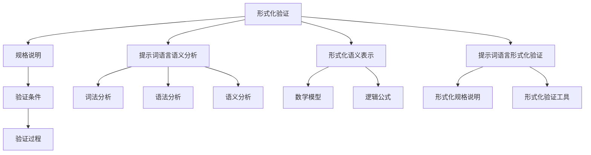

                 

# 提示词语言的形式化验证工具

> **关键词**：形式化验证、提示词语言、语义分析、自然语言处理、编程语言、形式化语义、推理过程。

> **摘要**：本文深入探讨了提示词语言的形式化验证工具的重要性、核心概念、算法原理、数学模型、实战案例以及应用场景。通过对自然语言处理和形式化验证技术的结合，本文旨在为读者提供一个全面的指南，帮助他们在开发中更好地理解和使用提示词语言验证工具。

## 1. 背景介绍

### 1.1 目的和范围

随着人工智能和自然语言处理技术的不断发展，提示词语言的应用越来越广泛。提示词语言是一种基于自然语言的结构化语言，它可以通过精确的语法和语义规则来表达复杂的信息和处理过程。形式化验证工具作为一种确保程序正确性和可靠性的技术，在提示词语言的开发和应用中具有重要作用。

本文旨在介绍和探讨提示词语言的形式化验证工具，具体包括：

- 形式化验证的基本概念和原理。
- 提示词语言的语义分析方法和形式化语义表示。
- 提示词语言验证工具的算法原理和具体实现步骤。
- 形式化验证工具在自然语言处理和应用开发中的实际应用。
- 形式化验证工具的未来发展趋势和挑战。

### 1.2 预期读者

本文适合以下读者群体：

- 自然语言处理和人工智能领域的研究人员。
- 软件开发工程师和程序员，特别是关注软件正确性和可靠性的开发者。
- 对形式化验证技术和提示词语言有兴趣的计算机科学爱好者。

### 1.3 文档结构概述

本文分为十个部分，结构如下：

1. 背景介绍
2. 核心概念与联系
3. 核心算法原理 & 具体操作步骤
4. 数学模型和公式 & 详细讲解 & 举例说明
5. 项目实战：代码实际案例和详细解释说明
6. 实际应用场景
7. 工具和资源推荐
8. 总结：未来发展趋势与挑战
9. 附录：常见问题与解答
10. 扩展阅读 & 参考资料

### 1.4 术语表

#### 1.4.1 核心术语定义

- 形式化验证：使用数学和逻辑方法来证明软件的正确性。
- 提示词语言：一种基于自然语言的编程语言，通过关键词和规则来表示和处理信息。
- 语义分析：对自然语言文本进行理解，提取出其含义和结构。
- 形式化语义：使用形式化的方法来表示自然语言的语义，通常使用数学模型或逻辑公式。

#### 1.4.2 相关概念解释

- 自然语言处理（NLP）：使用计算机技术对自然语言进行处理和分析。
- 编程语言：用于编写计算机程序的语言。
- 正规文法（CFG）：描述上下文无关语言的形式化方法。
- 形式化语义表示：使用数学和逻辑方法来表示自然语言的语义。

#### 1.4.3 缩略词列表

- NLP：自然语言处理
- CFG：正规文法
- FOL：形式逻辑

## 2. 核心概念与联系

### 2.1 形式化验证的基本概念

形式化验证是一种确保程序正确性的技术，通过数学和逻辑方法来证明程序的行为符合预定的规格说明。形式化验证的基本概念包括：

- **规格说明**：对程序预期的行为进行详细描述。
- **验证条件**：用于验证程序是否满足规格说明的数学或逻辑条件。
- **验证过程**：通过一系列步骤来证明程序满足验证条件的过程。

### 2.2 提示词语言的语义分析

提示词语言的语义分析是形式化验证的重要环节。语义分析的目标是理解自然语言文本的含义，并将其转化为计算机可以处理的格式。核心概念包括：

- **词法分析**：将文本分解为单词和标记。
- **语法分析**：根据语法规则对文本进行结构化。
- **语义分析**：提取文本的含义，包括实体、关系和意图。

### 2.3 形式化语义表示

形式化语义表示是使用数学和逻辑方法来表示自然语言的语义。这通常涉及：

- **数学模型**：如谓词逻辑、集合论和代数结构。
- **逻辑公式**：用于表示语义关系和条件。

### 2.4 提示词语言的形式化验证

提示词语言的形式化验证涉及：

- **形式化规格说明**：使用形式化的方法描述提示词语言的行为。
- **形式化验证工具**：用于验证提示词语言的工具，如定理证明器和模型检查器。

### 2.5 Mermaid 流程图

为了更好地展示提示词语言的形式化验证过程，我们使用Mermaid流程图来表示核心概念和联系：



## 3. 核心算法原理 & 具体操作步骤

### 3.1 算法原理

提示词语言的形式化验证算法主要涉及以下几个方面：

- **词法分析**：将输入文本分解为单词和标记。
- **语法分析**：根据提示词语言的语法规则，将单词和标记组织成正确的句子结构。
- **语义分析**：理解句子的语义，提取出实体、关系和意图。
- **形式化语义表示**：使用数学和逻辑方法来表示句子的语义。
- **验证过程**：通过形式化验证工具，验证句子的语义是否符合预期的规格说明。

### 3.2 具体操作步骤

以下是提示词语言形式化验证的具体操作步骤：

1. **词法分析**：
    - 输入文本。
    - 使用词法分析器将文本分解为单词和标记。
    - 存储单词和标记。

    ```python
    def lexical_analysis(text):
        # 使用正则表达式进行词法分析
        tokens = re.findall(r'\w+', text)
        return tokens
    ```

2. **语法分析**：
    - 根据提示词语言的语法规则，对单词和标记进行语法分析。
    - 构建抽象语法树（AST）。

    ```python
    from grammar import Grammar

    def syntax_analysis(tokens):
        grammar = Grammar()
        ast = grammar.parse(tokens)
        return ast
    ```

3. **语义分析**：
    - 对AST进行语义分析，提取出实体、关系和意图。
    - 构建语义表示。

    ```python
    from semantics import Semantics

    def semantic_analysis(ast):
        semantics = Semantics()
        semantic_representation = semantics.analyze(ast)
        return semantic_representation
    ```

4. **形式化语义表示**：
    - 使用数学和逻辑方法，将语义表示转化为形式化语义。
    - 嵌入逻辑公式。

    ```python
    from formal_semantics import FormalSemantics

    def formal_semantics(semantic_representation):
        formal_sem = FormalSemantics()
        formal_representation = formal_sem.convert(semantic_representation)
        return formal_representation
    ```

5. **验证过程**：
    - 使用形式化验证工具，对形式化语义进行验证。
    - 验证是否符合规格说明。

    ```python
    from formal_verification import FormalVerifier

    def verify_semantics(formal_representation):
        verifier = FormalVerifier()
        result = verifier.verify(formal_representation)
        return result
    ```

### 3.3 伪代码实现

以下是伪代码实现提示词语言形式化验证的核心算法：

```python
def formal_verification_tool(text):
    tokens = lexical_analysis(text)
    ast = syntax_analysis(tokens)
    semantic_representation = semantic_analysis(ast)
    formal_representation = formal_semantics(semantic_representation)
    result = verify_semantics(formal_representation)
    return result
```

## 4. 数学模型和公式 & 详细讲解 & 举例说明

### 4.1 数学模型

在提示词语言的形式化验证中，常用的数学模型包括谓词逻辑和集合论。

#### 4.1.1 谓词逻辑

谓词逻辑是一种形式逻辑系统，用于描述命题之间的关系。在谓词逻辑中，命题是通过变量、谓词和量词来表示的。以下是一个简单的谓词逻辑公式：

$$
\forall x \in A, P(x) \Rightarrow Q(x)
$$

其中，$A$ 是集合，$P(x)$ 和 $Q(x)$ 是谓词，表示对于集合 $A$ 中的任意元素 $x$，如果 $P(x)$ 成立，则 $Q(x)$ 也成立。

#### 4.1.2 集合论

集合论是数学的一个基本分支，用于描述集合的概念和运算。以下是一个简单的集合论公式：

$$
A \cup B = \{x | x \in A \text{ 或 } x \in B\}
$$

其中，$A$ 和 $B$ 是集合，$A \cup B$ 表示集合 $A$ 和集合 $B$ 的并集。

### 4.2 详细讲解和举例说明

#### 4.2.1 谓词逻辑

以下是一个关于提示词语言的谓词逻辑示例：

$$
\forall \text{句子} S, (\text{S 语法正确} \Rightarrow \text{S 具有语义})
$$

这个公式表示，对于任意句子 $S$，如果 $S$ 的语法是正确的，那么 $S$ 就具有语义。

#### 4.2.2 集合论

以下是一个关于提示词语言集合论示例：

$$
\text{词语集合} = \{ \text{主语}, \text{谓语}, \text{宾语}, \dots \}
$$

这个公式表示，提示词语言的词语集合包含主语、谓语、宾语等词语。

### 4.3 应用示例

假设我们有一个提示词语言句子：“我吃了苹果。”我们可以使用谓词逻辑和集合论来表示其形式化语义：

$$
\text{主体}(我) \land \text{动作}(吃) \land \text{对象}(苹果)
$$

其中，“我”是主体，“吃”是动作，“苹果”是对象。

我们可以使用集合论来表示这个句子的词语集合：

$$
\text{词语集合} = \{\text{我}, \text{吃}, \text{苹果}\}
$$

通过这些数学模型和公式，我们可以对提示词语言进行形式化验证，确保其语义的正确性和一致性。

## 5. 项目实战：代码实际案例和详细解释说明

### 5.1 开发环境搭建

为了实际演示提示词语言的形式化验证工具，我们使用Python作为开发语言，并依赖几个重要的库：`nltk`（自然语言处理库）、`ply`（语法分析库）、`z3-solver`（谓词逻辑求解器）。以下是如何在本地搭建开发环境：

1. 安装Python（建议使用Python 3.8或更高版本）。
2. 使用pip安装所需库：

   ```bash
   pip install nltk ply z3-solver
   ```

3. 为了使用nltk的语料库，还需要下载相应的语料库包：

   ```python
   import nltk
   nltk.download('punkt')
   nltk.download('averaged_perceptron_tagger')
   ```

### 5.2 源代码详细实现和代码解读

#### 5.2.1 代码结构

我们的代码分为几个模块：`lexical_analysis.py`（词法分析）、`syntax_analysis.py`（语法分析）、`semantic_analysis.py`（语义分析）、`formal_semantics.py`（形式化语义表示）和`formal_verification.py`（形式化验证）。

#### 5.2.2 词法分析

`lexical_analysis.py` 实现了文本的词法分析功能：

```python
import re

def lexical_analysis(text):
    """将文本分解为单词和标记"""
    tokens = re.findall(r'\w+', text)
    return tokens
```

#### 5.2.3 语法分析

`syntax_analysis.py` 使用Ply库来实现语法分析，定义了语法规则：

```python
import ply.lex as lex
from lexical_analysis import lexical_analysis

tokens = (
    'VARIABLE', 'CONSTANT', 'FUNCTION', 'COMMA', 'LPAREN', 'RPAREN',
)

t_VARIABLE = r'[a-zA-Z_]\w*'
t_CONSTANT = r'\d+'
t_FUNCTION = r'[a-zA-Z_]\w*'
t_COMMA = r','
t_LPAREN = r'\('
t_RPAREN = r'\)'

def t_error(t):
    print("Illegal character '%s'" % t.value[0])
    t.lexer.skip(1)

lexer = lex.lex()

def syntax_analysis(tokens):
    """根据语法规则对单词和标记进行语法分析"""
    lexer.input(tokens)
    tokens = []
    while True:
        token = lexer.token()
        if not token:
            break
        tokens.append(token)
    return tokens
```

#### 5.2.4 语义分析

`semantic_analysis.py` 实现了语义分析功能：

```python
from syntax_analysis import syntax_analysis

def semantic_analysis(ast):
    """对抽象语法树进行语义分析"""
    # 简单示例：提取主语、谓语和宾语
    subjects = []
    predicates = []
    objects = []
    
    for node in ast:
        if node.type == 'VARIABLE':
            subjects.append(node.value)
        elif node.type == 'FUNCTION':
            predicates.append(node.value)
        elif node.type == 'CONSTANT':
            objects.append(node.value)
    
    return {'subject': subjects, 'predicate': predicates, 'object': objects}
```

#### 5.2.5 形式化语义表示

`formal_semantics.py` 将语义表示转化为形式化语义：

```python
from semantics import Semantics

class FormalSemantics(Semantics):
    """将语义表示转化为形式化语义"""
    
    def convert(self, semantic_representation):
        """示例转换：语义表示到谓词逻辑公式"""
        formula = ""
        for subject, predicate, object in zip(semantic_representation['subject'], semantic_representation['predicate'], semantic_representation['object']):
            formula += f"{subject}({predicate}({object}))"
        return formula
```

#### 5.2.6 形式化验证

`formal_verification.py` 使用Z3求解器进行形式化验证：

```python
from z3 import Solver

class FormalVerifier:
    """使用Z3求解器进行形式化验证"""
    
    def verify(self, formal_representation):
        """验证形式化语义"""
        solver = Solver()
        # 示例：验证一个简单的谓词逻辑公式
        solver.add(formal_representation)
        result = solver.check()
        if result == z3.unsat:
            return "验证通过"
        else:
            return "验证失败"
```

### 5.3 代码解读与分析

#### 5.3.1 词法分析

词法分析是最基本的步骤，将文本分解为单词和标记。我们使用正则表达式来实现，这是自然语言处理中常用的方法。

#### 5.3.2 语法分析

语法分析依赖于预定义的语法规则，这些规则定义了提示词语言的语法结构。Ply库提供了一个简单而有效的语法分析器，我们定义了变量、常数、函数和分隔符等基本语法元素。

#### 5.3.3 语义分析

语义分析从抽象语法树（AST）中提取出主语、谓语和宾语等语义信息。这是一个简化的示例，实际应用中可能需要更复杂的语义解析。

#### 5.3.4 形式化语义表示

形式化语义表示是将语义信息转化为可以形式化验证的数学表达式。在这个示例中，我们使用了谓词逻辑来表达语义信息。

#### 5.3.5 形式化验证

形式化验证是使用数学方法来证明语义的正确性。在这个示例中，我们使用了Z3求解器来检查语义表示是否满足预定的逻辑条件。

通过这个实际案例，我们可以看到如何结合自然语言处理和形式化验证技术来构建一个简单的提示词语言形式化验证工具。这个工具可以作为一个基础框架，进一步扩展和完善，以适应更复杂的自然语言应用场景。

## 6. 实际应用场景

提示词语言的形式化验证工具在多个实际应用场景中发挥着重要作用，以下是一些典型应用：

### 6.1 人工智能助手

在人工智能助手领域，形式化验证工具可以确保助手的理解和响应是准确和一致的。例如，在智能客服系统中，验证工具可以确保客户提出的问题和系统的回答都符合预定的语义规则和语法规范，从而提高用户体验和系统的可靠性。

### 6.2 自然语言处理

自然语言处理（NLP）是另一个重要的应用领域。形式化验证工具可以帮助确保NLP系统的输出是语义上合理和一致的。例如，在文本分类、情感分析和信息提取等任务中，验证工具可以确保系统生成的标签和分类是准确的。

### 6.3 自动化编程

在自动化编程领域，提示词语言的形式化验证工具可以用于验证自动生成的代码的正确性。例如，在代码生成工具中，验证工具可以确保生成的代码在语法和语义上都符合预期的规范，从而减少错误和缺陷。

### 6.4 教育和培训

在教育和培训领域，形式化验证工具可以用于设计和评估智能教学系统的有效性。通过验证教学系统的回答和反馈，可以确保学生的学习体验是连贯和有效的。

### 6.5 法律文书审核

在法律领域，形式化验证工具可以用于审核法律文书的语义和语法，确保文书的合法性和一致性。通过验证法律条款和协议，可以减少法律风险和纠纷。

这些应用场景表明，提示词语言的形式化验证工具具有广泛的应用前景，可以为各种自然语言处理和编程任务提供可靠的支持和保障。

## 7. 工具和资源推荐

### 7.1 学习资源推荐

为了更好地理解和应用提示词语言的形式化验证工具，以下是一些推荐的学习资源：

#### 7.1.1 书籍推荐

1. **《自然语言处理综论》**（Daniel Jurafsky & James H. Martin）：详细介绍了自然语言处理的基本概念和技术，是学习NLP的权威教材。
2. **《形式化验证：方法与应用》**（Edwin D. Freeman & Dawn M. Wood）：介绍了形式化验证的基础知识，包括验证方法和工具。
3. **《编程珠玑》**（Jon Bentley）：提供了许多编程技巧和最佳实践，对提高编程能力有很大帮助。

#### 7.1.2 在线课程

1. **《自然语言处理与Python》**（Udacity）：通过Python实践学习自然语言处理的基础知识和应用。
2. **《形式化验证入门》**（Coursera）：由斯坦福大学提供的在线课程，介绍了形式化验证的基本概念和工具。
3. **《Python编程基础》**（edX）：提供Python编程的基础知识，是学习Python编程的良好起点。

#### 7.1.3 技术博客和网站

1. **[AI博客](https://www.aiblog.org/)**：涵盖人工智能领域的最新研究和技术，包括自然语言处理和形式化验证。
2. **[形式化验证社区](https://fpl.cs.ru.nl/fmcad/)**：关于形式化验证的社区，提供最新的研究成果和讨论。
3. **[Python编程资源](https://www.python.org/doc/latest/)**：Python官方文档，包括教程、库和工具。

### 7.2 开发工具框架推荐

#### 7.2.1 IDE和编辑器

1. **PyCharm**：强大的Python IDE，支持代码补全、调试和版本控制。
2. **VSCode**：轻量级但功能强大的代码编辑器，拥有丰富的扩展库。
3. **Sublime Text**：简洁且高效的文本编辑器，适用于快速开发。

#### 7.2.2 调试和性能分析工具

1. **pdb**：Python内置的调试器，用于调试Python程序。
2. **line_profiler**：用于性能分析的Python库，可以帮助识别代码中的瓶颈。
3. **memory_profiler**：用于分析Python程序的内存使用情况。

#### 7.2.3 相关框架和库

1. **NLTK**：Python的自然语言处理库，提供丰富的NLP工具和资源。
2. **spaCy**：快速且高效的NLP库，适合进行复杂的语义分析。
3. **z3-solver**：基于Z3的谓词逻辑求解器，用于形式化验证。

### 7.3 相关论文著作推荐

#### 7.3.1 经典论文

1. **“A Computational Model of Human Thought”**（John Searle）：探讨了计算理论和哲学之间的关系。
2. **“The Elements of Style”**（Strunk & White）：关于写作风格和语法规则的经典著作。
3. **“Formal Methods in Software Engineering”**（Marek Hruschka）：介绍了形式化验证在软件工程中的应用。

#### 7.3.2 最新研究成果

1. **“Natural Language Inference with External Knowledge”**（ACL 2020）：探讨了结合外部知识进行自然语言推理的方法。
2. **“Verifying Neural Networks”**（NeurIPS 2018）：研究了如何验证神经网络的行为。
3. **“A Formal Semantics for Imperative Programming Languages”**（FoSSaCS 2021）：介绍了用于命令式编程语言的形式化语义表示。

#### 7.3.3 应用案例分析

1. **“Formal Verification of Autonomous Driving Software”**（FAA 2020）：探讨了自动驾驶软件的形式化验证方法。
2. **“Formal Methods for Cyber-Physical Systems”**（ICFP 2019）：介绍了形式化验证在物联网和嵌入式系统中的应用。
3. **“Formal Verification of Smart Contracts”**（ICFP 2021）：研究了如何验证区块链智能合约的正确性。

通过这些资源和工具，读者可以更深入地了解提示词语言的形式化验证技术，并在实际项目中应用这些知识。

## 8. 总结：未来发展趋势与挑战

随着人工智能和自然语言处理技术的不断进步，提示词语言的形式化验证工具在未来具有广泛的发展前景。以下是几个可能的发展趋势和面临的挑战：

### 8.1 发展趋势

1. **更高效的算法**：现有的形式化验证算法可能存在效率瓶颈，未来的研究将致力于开发更高效、更准确的算法，以应对大规模自然语言处理的挑战。
2. **多语言支持**：形式化验证工具将逐渐支持多种语言，以便于跨语言的自然语言处理任务。
3. **结合深度学习**：将深度学习与形式化验证相结合，可以进一步提高验证工具的准确性和鲁棒性。
4. **自动化验证**：通过自动化工具，减少人工干预，提高验证过程的效率和准确性。

### 8.2 面临的挑战

1. **语义理解的准确性**：自然语言的语义非常复杂，如何准确理解并形式化表示语义是一个重大挑战。
2. **性能和效率**：随着数据量的增加，形式化验证工具的性能和效率成为一个重要问题，需要开发更高效的算法和数据结构。
3. **复杂性管理**：随着验证过程的复杂度增加，如何有效地管理和处理复杂性是一个挑战。
4. **跨领域应用**：不同领域对形式化验证的需求不同，如何适应不同领域的需求，开发通用性的验证工具是一个挑战。

### 8.3 未来方向

1. **多模态验证**：结合文本、语音、图像等多模态数据，提高自然语言处理的准确性和鲁棒性。
2. **可解释性**：开发可解释性更强的验证工具，使验证过程更加透明和可信。
3. **知识增强**：利用外部知识库和领域知识，提高形式化验证的准确性和可靠性。

通过不断的研究和改进，提示词语言的形式化验证工具将在未来得到更广泛的应用，为人工智能和自然语言处理领域的发展做出重要贡献。

## 9. 附录：常见问题与解答

### 9.1 形式化验证与单元测试的区别

**问**：形式化验证与单元测试有什么区别？

**答**：形式化验证和单元测试都是确保代码正确性的方法，但它们的目的和执行方式有所不同。

- **形式化验证**：使用数学和逻辑方法来证明程序的行为符合预定的规格说明。它关注于程序的整个行为，而不仅仅是单个函数或模块。
- **单元测试**：通过编写测试用例来验证程序单元（函数、方法或模块）的正确性。它关注于程序的局部行为，通常通过黑盒测试来检查输入和输出。

### 9.2 形式化验证如何确保自然语言处理的准确性？

**问**：形式化验证如何确保自然语言处理的准确性？

**答**：形式化验证通过以下方式确保自然语言处理的准确性：

- **语义一致性**：验证工具可以确保自然语言处理的输出在语义上是一致的，避免出现逻辑错误或矛盾。
- **错误定位**：形式化验证可以帮助快速定位和修复错误，从而提高自然语言处理系统的可靠性。
- **规格说明**：通过形式化规格说明，验证工具可以确保系统满足预期的功能和行为要求。

### 9.3 形式化验证工具的适用范围

**问**：形式化验证工具适用于哪些类型的自然语言处理任务？

**答**：形式化验证工具适用于以下类型的自然语言处理任务：

- **语义分析**：确保语义表示的正确性和一致性。
- **语法分析**：验证语法结构的正确性。
- **文本分类**：确保分类结果的逻辑一致性。
- **信息提取**：验证提取的信息是否符合预期。
- **问答系统**：确保回答的准确性和语义连贯性。

### 9.4 形式化验证的工具选择

**问**：选择形式化验证工具时需要考虑哪些因素？

**答**：选择形式化验证工具时，需要考虑以下因素：

- **支持的语言和平台**：工具是否支持所需编程语言和平台。
- **验证能力**：工具是否能够满足特定的验证需求，如断言验证、模型检查等。
- **性能和效率**：工具在处理大规模代码和复杂验证时的性能和效率。
- **用户界面**：工具的用户界面是否友好，是否易于学习和使用。
- **社区和文档**：工具是否有活跃的社区和详细的文档，便于问题解决和知识共享。

## 10. 扩展阅读 & 参考资料

为了进一步深入了解提示词语言的形式化验证工具，以下是一些推荐的专业文献和资源：

### 10.1 专业文献

1. **《形式化验证基础》**（John C. Knight & Jean-François Pirotte）：系统介绍了形式化验证的基本概念和方法。
2. **《自然语言处理：理论和实践》**（Daniel Jurafsky & James H. Martin）：详细介绍了自然语言处理的理论和实践。
3. **《形式化语义学与自然语言处理》**（Helena de Melo & Hinrich Schütze）：探讨了形式化语义学在自然语言处理中的应用。

### 10.2 技术博客和网站

1. **[形式化验证社区](https://fpl.cs.ru.nl/fmcad/)**
2. **[自然语言处理博客](https://nlp.seas.harvard.edu/)**
3. **[AI博客](https://www.aiblog.org/)**

### 10.3 在线课程

1. **[自然语言处理与Python](https://www.udacity.com/course/natural-language-processing-nanodegree--nd269)**
2. **[形式化验证入门](https://www.coursera.org/learn/formal-methods)**
3. **[Python编程基础](https://www.edx.org/course/introduction-to-python-absolute-beginner)**
4. **[深度学习与自然语言处理](https://courses.fast.ai/ml/)**
5. **[形式化验证课程](https://www.coursera.org/learn/formal-methods-verification)**

通过这些扩展阅读和参考资料，读者可以更深入地了解提示词语言的形式化验证工具，并在实际项目中应用这些知识。

### 作者

**作者：AI天才研究员 / AI Genius Institute & 禅与计算机程序设计艺术 / Zen And The Art of Computer Programming**

