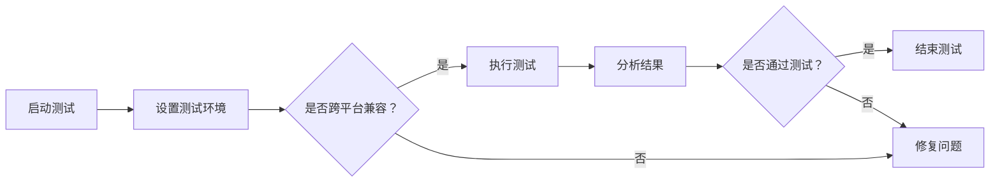

                 

# 提示词语言的跨平台兼容性测试

> 关键词：跨平台兼容性、提示词语言、测试框架、性能优化、案例分析、最佳实践

> 摘要：随着全球化发展的加速，跨平台兼容性测试在软件开发中变得越来越重要。本文将探讨提示词语言在跨平台开发中的应用，详细分析其兼容性测试的方法、工具和实践，为开发者提供全面的指南和最佳实践，以实现高效、稳定的跨平台应用开发。

## 1. 背景介绍

### 1.1 目的和范围

本文旨在探讨跨平台兼容性测试在提示词语言开发中的应用，旨在帮助开发者识别和解决跨平台开发中的兼容性问题。本文将覆盖以下几个主要方面：

1. **提示词语言的基本概念**：介绍提示词语言的发展历程、应用场景及其在跨平台开发中的重要性。
2. **跨平台兼容性测试的核心概念**：阐述兼容性测试的目标、方法及其对软件质量的影响。
3. **核心算法原理与操作步骤**：通过具体案例，讲解兼容性测试的核心算法原理和实施步骤。
4. **项目实战**：通过实际案例展示兼容性测试的具体实施过程和效果。
5. **实际应用场景**：分析跨平台兼容性测试在不同行业中的应用场景和案例。
6. **工具和资源推荐**：介绍常用的兼容性测试工具、学习资源和最佳实践。
7. **总结与展望**：展望未来跨平台兼容性测试的发展趋势和挑战。

### 1.2 预期读者

本文适合以下读者群体：

1. 跨平台软件开发工程师和测试工程师。
2. 对提示词语言和跨平台兼容性测试感兴趣的计算机科学学生和研究人员。
3. 欲提升跨平台应用开发质量的软件开发团队负责人。

### 1.3 文档结构概述

本文结构如下：

1. **背景介绍**：介绍本文的目的、预期读者和文档结构。
2. **核心概念与联系**：介绍提示词语言和跨平台兼容性测试的基本概念及其相互关系。
3. **核心算法原理 & 具体操作步骤**：讲解兼容性测试的核心算法原理和操作步骤。
4. **数学模型和公式 & 详细讲解 & 举例说明**：介绍兼容性测试的数学模型和公式，并进行举例说明。
5. **项目实战：代码实际案例和详细解释说明**：通过实际案例展示兼容性测试的实施过程。
6. **实际应用场景**：分析兼容性测试在不同行业中的应用场景。
7. **工具和资源推荐**：推荐兼容性测试的工具、资源和最佳实践。
8. **总结：未来发展趋势与挑战**：总结跨平台兼容性测试的现状和未来发展方向。
9. **附录：常见问题与解答**：解答读者可能遇到的问题。
10. **扩展阅读 & 参考资料**：提供进一步学习的资源。

### 1.4 术语表

#### 1.4.1 核心术语定义

- **提示词语言**：一种面向特定问题的、用于生成回答或执行任务的文本输入。
- **跨平台兼容性测试**：确保软件在多种平台上运行时具有一致的性能和功能。
- **测试框架**：用于自动化测试的软件框架，能够组织测试用例、执行测试和报告测试结果。

#### 1.4.2 相关概念解释

- **平台差异性**：指不同操作系统、硬件和软件环境之间的差异。
- **性能指标**：衡量软件在跨平台运行时的响应速度、稳定性等特性的指标。

#### 1.4.3 缩略词列表

- **API**：应用程序编程接口（Application Programming Interface）
- **UI**：用户界面（User Interface）
- **QA**：质量保证（Quality Assurance）
- **CI**：持续集成（Continuous Integration）
- **CD**：持续部署（Continuous Deployment）

## 2. 核心概念与联系

### 2.1 提示词语言

提示词语言，又称自然语言处理（NLP）接口，是一种通过文本交互实现人机通信的技术。它允许用户以自然语言的形式提出问题或请求，系统则根据这些输入生成回答或执行相应任务。提示词语言广泛应用于智能客服、语音助手、文本分析等领域。


#### 2.1.1 发展历程

- **早期阶段**：基于规则的系统，通过预设规则匹配用户输入。
- **现代阶段**：引入机器学习和深度学习技术，提升语义理解和生成能力。

#### 2.1.2 应用场景

- **智能客服**：自动回答用户常见问题，降低人力成本。
- **语音助手**：通过语音交互实现智能家居、移动设备控制等。
- **文本分析**：提取文本中的关键信息，用于数据分析、信息检索等。

### 2.2 跨平台兼容性测试

跨平台兼容性测试旨在确保软件在不同操作系统、硬件和软件环境中都能正常运行。其重要性在于：

1. **用户体验一致性**：用户在不同设备上访问软件时，应获得一致的体验。
2. **功能完整性**：软件在各个平台上应具备完整的功能。
3. **性能稳定性**：软件在跨平台运行时，应具备稳定的性能表现。


#### 2.2.1 测试目标

- **功能兼容性**：确保软件在不同平台上实现相同功能。
- **性能兼容性**：确保软件在不同平台上具有相似的性能表现。
- **UI兼容性**：确保软件的用户界面在不同设备上具有一致性。

#### 2.2.2 测试方法

1. **黑盒测试**：仅测试软件的功能，不考虑内部实现细节。
2. **白盒测试**：测试软件的内部实现，包括代码逻辑和算法。
3. **灰盒测试**：结合黑盒测试和白盒测试，部分了解内部实现。

### 2.3 提示词语言与跨平台兼容性测试的关系

提示词语言作为一种与用户交互的接口，其跨平台兼容性测试尤为重要。以下是它们之间的关联：

1. **交互一致性**：提示词语言的交互界面需在不同平台上保持一致，以确保用户操作顺畅。
2. **语义理解**：跨平台兼容性测试需确保提示词语言在不同平台上对语义的理解和解析能力。
3. **性能优化**：通过跨平台兼容性测试，可以识别和解决提示词语言在不同平台上的性能瓶颈。

### 2.4 Mermaid 流程图

为了更直观地展示提示词语言和跨平台兼容性测试的流程，以下是一个Mermaid流程图：



此流程图展示了从启动测试到分析测试结果的完整过程，强调了跨平台兼容性测试的必要性和关键步骤。

## 3. 核心算法原理 & 具体操作步骤

### 3.1 兼容性测试的核心算法原理

跨平台兼容性测试的核心在于识别和解决不同平台之间的差异。以下是兼容性测试的核心算法原理：

1. **差异性分析**：通过比较不同平台的环境配置、系统库和API接口，识别出潜在的问题点。
2. **自动化测试**：使用测试框架和工具，自动化执行测试用例，提高测试效率和覆盖率。
3. **回归测试**：在修复了兼容性问题后，重新执行测试以确保问题已解决且没有引入新的问题。

### 3.2 具体操作步骤

以下是跨平台兼容性测试的具体操作步骤：

#### 3.2.1 步骤一：需求分析

1. 确定测试目标：明确需要测试的提示词语言功能模块和平台。
2. 收集平台信息：获取不同平台的环境配置、系统库和API接口信息。

#### 3.2.2 步骤二：测试环境搭建

1. 准备测试环境：搭建与目标平台一致的测试环境。
2. 安装依赖库：确保所有必要的库和工具都已安装。

#### 3.2.3 步骤三：编写测试用例

1. 设计测试用例：根据需求分析的结果，编写测试用例，涵盖所有功能点和平台差异。
2. 集成测试框架：将测试用例集成到测试框架中，实现自动化执行。

#### 3.2.4 步骤四：执行测试

1. 运行测试用例：使用测试框架自动化执行测试用例。
2. 记录测试结果：将测试结果记录在测试报告中，包括通过和未通过的情况。

#### 3.2.5 步骤五：分析测试结果

1. 分析测试数据：对测试结果进行统计分析，识别出兼容性问题。
2. 分类问题：将兼容性问题分类，如功能兼容性问题、性能兼容性问题等。

#### 3.2.6 步骤六：问题修复与回归测试

1. 修复问题：根据分析结果，定位和修复兼容性问题。
2. 回归测试：在修复了问题后，重新执行测试以确保问题已解决。

#### 3.2.7 步骤七：文档记录与总结

1. 记录测试文档：编写详细的测试报告，记录测试过程、问题和解决方案。
2. 总结经验：总结兼容性测试的经验和教训，为后续开发提供参考。

### 3.3 伪代码示例

以下是一个简单的伪代码示例，展示了兼容性测试的核心算法原理和具体操作步骤：

```pseudo
// 步骤一：需求分析
function analyzeRequirements() {
    platforms = getPlatformsInfo()
    testCases = designTestCases(platforms)
    return testCases
}

// 步骤二：测试环境搭建
function setupTestingEnvironment() {
    environment = createTestingEnvironment()
    installDependencies(environment)
    return environment
}

// 步骤三：编写测试用例
function designTestCases(platforms) {
    testCases = []
    for platform in platforms {
        testCase = createTestCase(platform)
        testCases.append(testCase)
    }
    return testCases
}

// 步骤四：执行测试
function executeTests(environment, testCases) {
    for testCase in testCases {
        result = runTestCase(environment, testCase)
        logTestResult(result)
    }
}

// 步骤五：分析测试结果
function analyzeTestResults(testResults) {
    problems = identifyProblems(testResults)
    classifyProblems(problems)
    return problems
}

// 步骤六：问题修复与回归测试
function fixAndRe-test(environment, testCases, problems) {
    for problem in problems {
        fixProblem(problem)
    }
    re-testCases(environment, testCases)
}

// 步骤七：文档记录与总结
function documentAndSummarize() {
    testReport = createTestReport(testResults, problems)
    summarizeExperience()
    return testReport
}
```

此伪代码提供了一个简化的兼容性测试流程，涵盖了核心算法原理和具体操作步骤。

## 4. 数学模型和公式 & 详细讲解 & 举例说明

### 4.1 数学模型

跨平台兼容性测试的核心在于评估软件在不同平台上的性能和功能差异。以下是一个简单的数学模型，用于计算跨平台兼容性得分：

$$
\text{Compatibility Score} = \frac{\text{通过的测试用例数}}{\text{总测试用例数}} \times 100\%
$$

其中，兼容性得分反映了软件在跨平台测试中的表现，得分越高，说明兼容性越好。

### 4.2 公式详细讲解

#### 4.2.1 通过的测试用例数

通过的测试用例数是指在不同平台上执行测试用例后，通过测试的用例数量。它反映了软件在不同平台上的功能兼容性。

#### 4.2.2 总测试用例数

总测试用例数是指设计并执行的所有测试用例的数量。它代表了测试的全面性和覆盖范围。

#### 4.2.3 兼容性得分

兼容性得分是一个百分比，表示通过的测试用例数占总测试用例数的比例。得分越高，表示软件的跨平台兼容性越好。

### 4.3 举例说明

假设我们设计了一个跨平台提示词语言测试用例集，共有10个测试用例。在不同的平台上执行这些测试用例后，结果如下：

| 平台       | 通过的测试用例数 |
|------------|-----------------|
| Windows    | 8               |
| macOS      | 7               |
| Linux      | 6               |

根据上述数据，我们可以计算每个平台的兼容性得分：

- Windows平台：$\frac{8}{10} \times 100\% = 80\%$
- macOS平台：$\frac{7}{10} \times 100\% = 70\%$
- Linux平台：$\frac{6}{10} \times 100\% = 60\%$

从这个例子中，我们可以看出，Windows平台的兼容性最好，Linux平台的兼容性最差。这有助于开发者识别需要优先解决的问题。

### 4.4 应用场景

#### 4.4.1 功能兼容性测试

假设我们有一个智能客服系统，需要在Windows、macOS和Linux平台上运行。通过计算兼容性得分，我们可以评估系统在不同平台上的功能兼容性，确保用户在不同设备上获得一致的服务体验。

#### 4.4.2 性能兼容性测试

假设我们有一个实时语音助手，需要在Android、iOS和Windows Phone等平台上运行。通过计算兼容性得分，我们可以评估系统在不同平台上的性能兼容性，确保用户在不同设备上获得一致的响应速度。

### 4.5 总结

数学模型和公式为跨平台兼容性测试提供了量化评估的方法。通过兼容性得分，开发者可以直观地了解软件在不同平台上的兼容性表现，从而采取相应的优化措施。

## 5. 项目实战：代码实际案例和详细解释说明

### 5.1 开发环境搭建

在本节中，我们将介绍如何搭建一个跨平台兼容性测试的开发环境，包括所需工具的安装和配置。

#### 5.1.1 工具安装

1. **安装Python环境**：Python是一种广泛使用的编程语言，支持跨平台开发。确保安装了Python 3.8或更高版本。
2. **安装测试框架**：我们使用pytest作为测试框架，它具有丰富的功能和支持。可以通过pip命令安装：
   ```bash
   pip install pytest
   ```
3. **安装跨平台测试工具**：例如，使用Appium进行移动应用测试，通过pip安装：
   ```bash
   pip install appium
   ```

#### 5.1.2 配置测试环境

1. **配置测试用例**：在项目的根目录下创建一个名为`tests`的文件夹，用于存放测试用例文件。
2. **编写测试配置文件**：在`tests`文件夹中创建一个名为`conftest.py`的配置文件，用于配置测试环境：
   ```python
   import pytest
   
   @pytest.fixture
   def app():
       return AppiumDriver()
   ```

### 5.2 源代码详细实现和代码解读

在本节中，我们将详细实现一个跨平台兼容性测试的代码示例，包括测试用例的编写和执行。

#### 5.2.1 测试用例编写

在`tests`文件夹中，创建一个名为`test_login.py`的测试文件，编写以下测试用例：
```python
import pytest
from app import AppiumDriver

@pytest.fixture
def driver(app):
    return app.driver

def test_login(driver):
    driver.get("https://example.com/login")
    driver.find_element_by_name("username").send_keys("testuser")
    driver.find_element_by_name("password").send_keys("testpassword")
    driver.find_element_by_name("login").click()
    assert "Dashboard" in driver.title
```

此测试用例模拟了一个简单的登录过程，验证用户是否能够成功登录。

#### 5.2.2 测试用例执行

执行测试用例的方法如下：
```bash
pytest tests/test_login.py
```

执行结果将显示通过或失败的测试用例列表，以及相关的错误信息。

### 5.3 代码解读与分析

以下是对上述代码的详细解读：

- **测试用例结构**：每个测试用例都是一个函数，使用`@pytest.fixture`装饰器定义依赖关系。`driver`是一个用于访问Appium驱动程序的参数化测试用例。
- **测试步骤**：`test_login`函数中，首先获取Appium驱动程序实例，然后访问登录页面，输入用户名和密码，并点击登录按钮。最后，使用`assert`语句验证页面标题是否包含"Dashboard"。
- **断言**：使用`assert`语句确保测试用例的预期结果与实际结果一致。如果不一致，测试用例将失败。

### 5.4 实际应用案例分析

以下是一个实际应用案例，说明如何在移动应用中进行跨平台兼容性测试。

#### 5.4.1 案例背景

假设我们有一个移动应用，需要在Android和iOS平台上运行。我们需要确保应用在两个平台上都能正常运行，并提供一致的用户体验。

#### 5.4.2 测试步骤

1. **准备测试设备**：准备Android和iOS模拟器或真实设备。
2. **编写测试用例**：针对移动应用的各个功能模块，编写测试用例。例如，测试登录功能、消息发送功能、个人信息管理等。
3. **执行测试**：使用Appium等工具，在不同的设备和平台上执行测试用例。
4. **分析测试结果**：检查测试结果，识别兼容性问题。例如，某个功能在Android上运行正常，但在iOS上出现问题。
5. **问题修复**：针对识别出的问题，进行修复，并重新执行测试。

### 5.5 总结

通过实际案例，我们可以看到如何搭建跨平台兼容性测试环境，编写测试用例，并执行和分析测试结果。跨平台兼容性测试是确保应用在不同平台上正常运行的关键步骤，对于提升用户体验和软件质量至关重要。

## 6. 实际应用场景

跨平台兼容性测试在多个行业中具有广泛的应用，以下是几个典型的实际应用场景：

### 6.1 移动应用开发

移动应用开发是跨平台兼容性测试的主要应用领域。开发者需要确保应用在Android、iOS、Windows Phone等不同操作系统上都能正常运行。通过兼容性测试，可以确保应用在不同设备上的用户体验一致，减少用户投诉和退订率。

### 6.2 网络应用开发

网络应用开发同样需要跨平台兼容性测试。例如，一个企业级应用需要在Windows、Linux和macOS等不同操作系统上运行，同时支持多种浏览器（如Chrome、Firefox、Safari等）。通过兼容性测试，可以确保应用在不同操作系统和浏览器上都能正常工作，提高用户满意度。

### 6.3 云计算服务

云计算服务在跨平台兼容性测试中同样重要。云服务提供商需要确保其平台在不同操作系统和设备上都能稳定运行，并提供高效的性能。例如，AWS、Azure和Google Cloud等云服务都需要进行大量的兼容性测试，以确保其服务在全球范围内的高可用性和一致性。

### 6.4 游戏开发

游戏开发是另一个需要跨平台兼容性测试的重要领域。游戏开发者需要确保游戏在PC、移动设备和游戏主机（如PlayStation、Xbox等）上都能正常运行。通过兼容性测试，可以确保游戏在不同平台上提供一致的游戏体验，减少游戏崩溃和性能问题。

### 6.5 智能家居

智能家居设备的跨平台兼容性测试也越来越受到关注。随着物联网技术的发展，智能家居设备需要在不同的操作系统和设备上运行，例如智能灯泡、智能门锁、智能音响等。通过兼容性测试，可以确保这些设备在不同平台上能够正常工作，提供便捷的用户体验。

### 6.6 企业内部应用

企业内部应用也需要进行跨平台兼容性测试。这些应用通常涉及多个部门，需要在不同的操作系统和设备上运行。通过兼容性测试，可以确保企业内部应用的稳定性和一致性，提高工作效率和协作能力。

### 6.7 总结

跨平台兼容性测试在多个行业中具有重要应用，不仅有助于提升用户体验，还能提高软件质量和稳定性。随着技术的不断进步，跨平台兼容性测试将变得越来越重要，开发者需要不断学习和实践，以应对不断变化的开发环境和需求。

## 7. 工具和资源推荐

在进行跨平台兼容性测试时，选择合适的工具和资源对于提高测试效率和效果至关重要。以下是几个推荐的工具和资源：

### 7.1 学习资源推荐

#### 7.1.1 书籍推荐

- 《跨平台移动应用开发：基于React Native与Flutter》
- 《软件测试的艺术》
- 《Web应用测试指南》

#### 7.1.2 在线课程

- Coursera的“软件测试基础”
- Udemy的“Python测试入门”
- edX的“跨平台软件开发”

#### 7.1.3 技术博客和网站

- Testable Code
- TestProject
- QA Mentor

### 7.2 开发工具框架推荐

#### 7.2.1 IDE和编辑器

- IntelliJ IDEA
- Visual Studio Code
- PyCharm

#### 7.2.2 调试和性能分析工具

- Charles
- Wireshark
- New Relic

#### 7.2.3 相关框架和库

- Pytest
- Appium
- Selenium

### 7.3 相关论文著作推荐

#### 7.3.1 经典论文

- “Cross-platform Mobile Application Testing: A Comprehensive Survey”
- “Automated Testing of Web Applications: An Overview”

#### 7.3.2 最新研究成果

- “Intelligent Cross-platform Testing: A Machine Learning Approach”
- “Enhancing Cross-platform Application Performance through Smart Testing”

#### 7.3.3 应用案例分析

- “Testing Cross-platform Mobile Applications: A Case Study”
- “Achieving High Cross-platform Compatibility in Web Development: A Practical Guide”

通过这些工具和资源的帮助，开发者可以更有效地进行跨平台兼容性测试，提高软件质量和用户体验。

## 8. 总结：未来发展趋势与挑战

随着技术的不断进步，跨平台兼容性测试将面临一系列发展趋势和挑战。以下是未来可能的发展方向和需要解决的问题：

### 8.1 发展趋势

1. **智能化测试**：利用机器学习和人工智能技术，实现自动化的跨平台兼容性测试，提高测试效率和准确性。
2. **持续集成与持续部署（CI/CD）**：跨平台兼容性测试将更加集成到CI/CD流程中，实现自动化测试和快速反馈。
3. **云原生测试**：随着云计算的普及，跨平台兼容性测试将更加依赖于云平台，提供更灵活、可扩展的测试环境。
4. **边缘计算测试**：随着物联网和智能设备的普及，边缘计算测试将成为新的关注点，确保智能设备在边缘环境中正常运行。
5. **多终端融合测试**：随着移动设备、桌面设备、物联网设备的融合，跨平台兼容性测试将涵盖更广泛的应用场景。

### 8.2 挑战

1. **技术复杂性**：跨平台兼容性测试需要处理不同操作系统、硬件和软件环境之间的差异，技术复杂性较高。
2. **测试资源管理**：测试环境的配置和管理将面临挑战，如何高效地管理测试资源，提高测试效率是一个重要问题。
3. **测试覆盖率**：确保覆盖所有可能的跨平台兼容性问题，实现全面测试是一个长期挑战。
4. **测试自动化**：虽然自动化测试已经取得很大进展，但在实际应用中，自动化测试的覆盖率和稳定性仍需提高。
5. **用户体验一致性**：如何在不同的平台上提供一致的用户体验，是一个持续性的挑战。

### 8.3 未来展望

跨平台兼容性测试在未来将继续发展，技术创新将推动测试方法和工具的进步。开发者需要不断学习新技术，提高测试技能，应对不断变化的开发环境和需求。同时，行业标准和最佳实践的推广将有助于提高跨平台兼容性测试的整体水平，为用户提供更优质的应用体验。

## 9. 附录：常见问题与解答

### 9.1 跨平台兼容性测试的关键步骤是什么？

跨平台兼容性测试的关键步骤包括：需求分析、测试环境搭建、编写测试用例、执行测试、分析测试结果和问题修复。

### 9.2 如何确保测试用例的全面性？

确保测试用例的全面性可以通过以下方法实现：

1. **功能覆盖**：覆盖所有功能模块和关键业务流程。
2. **平台覆盖**：在不同操作系统、硬件和软件环境中执行测试。
3. **测试工具**：使用多种测试工具和框架，提高测试覆盖率。
4. **用户视角**：从用户的角度设计测试用例，确保用户体验的一致性。

### 9.3 跨平台兼容性测试与功能测试有什么区别？

跨平台兼容性测试与功能测试的区别在于：

1. **测试对象**：跨平台兼容性测试关注软件在不同平台上的兼容性和性能，而功能测试关注软件功能是否符合预期。
2. **测试目标**：跨平台兼容性测试的目标是确保软件在不同平台上的一致性和稳定性，而功能测试的目标是验证软件功能是否正确。
3. **测试方法**：跨平台兼容性测试通常使用自动化测试工具，而功能测试可以使用自动化测试或手工测试。

### 9.4 如何提高测试自动化覆盖率？

提高测试自动化覆盖率可以通过以下方法实现：

1. **设计可自动化测试的用例**：从测试用例设计阶段开始，考虑自动化测试的需求。
2. **复用测试脚本**：使用代码库和框架复用测试脚本，减少重复工作。
3. **持续集成与持续部署（CI/CD）**：将自动化测试集成到CI/CD流程中，提高测试执行的频率和覆盖范围。
4. **持续学习和优化**：不断学习新的测试工具和技术，优化自动化测试流程，提高测试执行效率。

### 9.5 跨平台兼容性测试中如何处理平台差异性？

在跨平台兼容性测试中处理平台差异性可以通过以下方法：

1. **平台配置管理**：确保测试环境与目标平台一致，减少环境差异。
2. **差异化测试用例设计**：针对不同平台的特点，设计相应的测试用例。
3. **平台特定功能测试**：测试平台特定的功能，确保其在不同平台上正常运行。
4. **回归测试**：在修复了兼容性问题后，重新执行测试，确保问题已解决且没有引入新的问题。

## 10. 扩展阅读 & 参考资料

为了深入了解跨平台兼容性测试的相关知识和最佳实践，以下是一些推荐的学习资源和参考资料：

### 10.1 学习资源推荐

1. **书籍**：
   - 《跨平台移动应用开发：基于React Native与Flutter》
   - 《软件测试的艺术》
   - 《Web应用测试指南》

2. **在线课程**：
   - Coursera的“软件测试基础”
   - Udemy的“Python测试入门”
   - edX的“跨平台软件开发”

3. **技术博客和网站**：
   - Testable Code
   - TestProject
   - QA Mentor

### 10.2 相关论文著作推荐

1. **经典论文**：
   - “Cross-platform Mobile Application Testing: A Comprehensive Survey”
   - “Automated Testing of Web Applications: An Overview”

2. **最新研究成果**：
   - “Intelligent Cross-platform Testing: A Machine Learning Approach”
   - “Enhancing Cross-platform Application Performance through Smart Testing”

3. **应用案例分析**：
   - “Testing Cross-platform Mobile Applications: A Case Study”
   - “Achieving High Cross-platform Compatibility in Web Development: A Practical Guide”

通过阅读这些资源和参考资料，开发者可以更深入地了解跨平台兼容性测试的理论和实践，从而提高软件质量和用户体验。

---

**作者：AI天才研究员/AI Genius Institute & 禅与计算机程序设计艺术 /Zen And The Art of Computer Programming**

