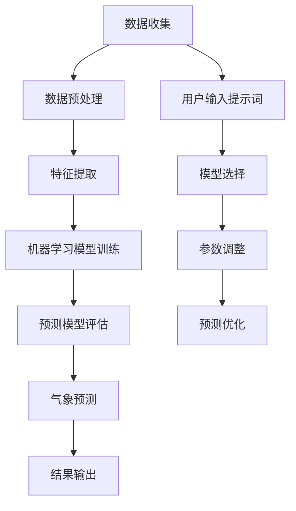
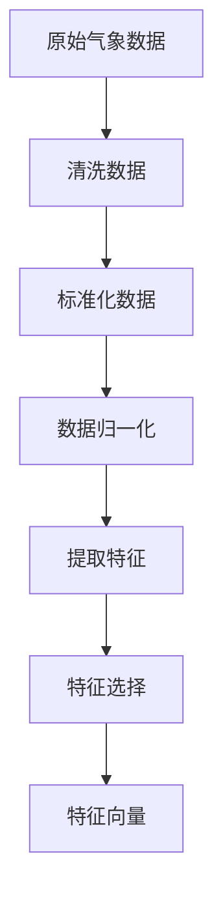
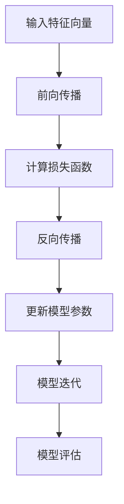
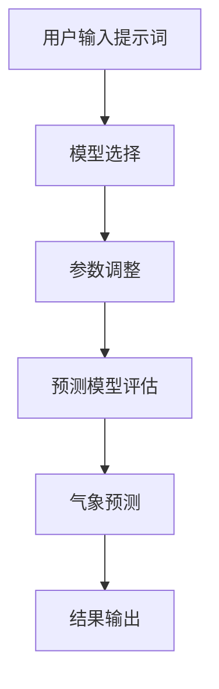

                 

# 提示词驱动的智能气象预报系统

> **关键词：提示词、智能气象预报、系统架构、算法原理、数学模型、实际应用、未来趋势**
>
> **摘要：本文将深入探讨提示词驱动的智能气象预报系统的构建过程，包括核心概念、算法原理、数学模型、项目实战以及未来发展趋势。通过详细的剖析，帮助读者理解这一先进技术，并为其在实际中的应用提供指导。**

## 1. 背景介绍

### 1.1 目的和范围

本文旨在探讨提示词驱动的智能气象预报系统的构建方法，分析其核心概念、算法原理、数学模型和实际应用。通过这一研究，读者可以了解到智能气象预报系统在现代气象学和社会经济发展中的重要作用，同时掌握构建此类系统的基本思路和技术要点。

### 1.2 预期读者

本文面向对人工智能和气象学有一定了解的科研人员、工程师和在校大学生。本文将为读者提供系统化的知识框架，帮助他们在智能气象预报领域开展深入研究和工作。

### 1.3 文档结构概述

本文结构如下：
- 第1章：背景介绍，概述研究目的、预期读者和文档结构。
- 第2章：核心概念与联系，介绍系统架构和核心算法原理。
- 第3章：核心算法原理 & 具体操作步骤，详细讲解算法实现。
- 第4章：数学模型和公式 & 详细讲解 & 举例说明，阐述数学模型的应用。
- 第5章：项目实战：代码实际案例和详细解释说明，提供实战案例。
- 第6章：实际应用场景，分析系统在不同领域的应用。
- 第7章：工具和资源推荐，推荐相关学习和开发资源。
- 第8章：总结：未来发展趋势与挑战，展望系统发展的前景。
- 第9章：附录：常见问题与解答，回答读者可能遇到的疑问。
- 第10章：扩展阅读 & 参考资料，提供进一步学习的资源。

### 1.4 术语表

#### 1.4.1 核心术语定义

- **提示词**：用于指导智能系统进行特定任务的关键词或短语。
- **智能气象预报系统**：利用人工智能技术进行气象预测的自动化系统。
- **算法**：解决问题的一系列规则或步骤。
- **数学模型**：用数学公式描述的气象预测模型。

#### 1.4.2 相关概念解释

- **气象预测**：根据气象数据和模型，对未来天气状况进行预测。
- **机器学习**：一种通过数据学习规律，自动改进性能的技术。
- **深度学习**：一种基于人工神经网络的机器学习方法，具有多层结构。

#### 1.4.3 缩略词列表

- **ML**：机器学习
- **DL**：深度学习
- **AI**：人工智能

## 2. 核心概念与联系

为了更好地理解提示词驱动的智能气象预报系统，我们需要首先梳理其中的核心概念和联系。以下是系统的基本架构和关键组成部分的Mermaid流程图：



### 2.1. 系统架构

提示词驱动的智能气象预报系统架构主要包括以下几个关键环节：

1. **数据收集**：收集大量的气象数据，包括历史数据、实时数据和卫星遥感数据等。
2. **数据预处理**：对原始数据进行清洗、标准化和归一化处理，以提高数据质量和模型性能。
3. **特征提取**：从预处理后的数据中提取对气象预测有重要影响的特征，如温度、湿度、气压等。
4. **机器学习模型训练**：使用提取的特征训练机器学习模型，例如深度神经网络（DNN）或循环神经网络（RNN）。
5. **预测模型评估**：评估模型的预测性能，包括准确性、召回率和F1值等指标。
6. **气象预测**：利用训练好的模型进行气象预测。
7. **结果输出**：将预测结果输出给用户，包括文本描述、图形展示等。
8. **用户输入提示词**：用户输入特定的提示词，如“明天天气如何？”或“下个月降雨概率是多少？”。
9. **模型选择**：根据用户输入的提示词，选择合适的预测模型。
10. **参数调整**：根据用户需求和模型性能，调整预测参数。
11. **预测优化**：优化预测过程，以提高预测准确性。

### 2.2. 核心算法原理

提示词驱动的智能气象预报系统基于机器学习和深度学习算法，其核心在于如何有效地从大量气象数据中提取特征，并利用这些特征训练预测模型。以下是系统的核心算法原理和具体操作步骤：

#### 2.2.1. 特征提取

特征提取是智能气象预报系统的关键步骤。以下是一种常见的特征提取方法：



1. **清洗数据**：去除异常值和缺失值。
2. **标准化数据**：将数据缩放到统一的范围，如0到1。
3. **数据归一化**：对数据进行线性变换，使其满足特定的分布。
4. **提取特征**：从数据中提取对气象预测有重要影响的特征，如温度、湿度、气压等。
5. **特征选择**：选择对预测有显著贡献的特征，排除冗余特征。
6. **特征向量**：将特征转换为向量形式，用于训练机器学习模型。

#### 2.2.2. 机器学习模型训练

选择适当的机器学习模型，如深度神经网络（DNN）或循环神经网络（RNN），训练预测模型。以下是训练过程的一般步骤：



1. **输入特征向量**：将提取的特征向量输入模型。
2. **前向传播**：计算输入特征向量通过模型的过程，得到预测结果。
3. **计算损失函数**：计算预测结果与真实结果的误差，得到损失函数值。
4. **反向传播**：根据损失函数值，更新模型参数，以减小误差。
5. **模型迭代**：重复上述步骤，直到模型收敛。
6. **模型评估**：评估模型的预测性能，如准确性、召回率和F1值等。

#### 2.2.3. 气象预测

利用训练好的模型进行气象预测，根据用户输入的提示词，选择合适的预测模型和参数。以下是预测过程的一般步骤：



1. **用户输入提示词**：用户输入特定的提示词，如“明天天气如何？”或“下个月降雨概率是多少？”。
2. **模型选择**：根据用户输入的提示词，选择合适的预测模型。
3. **参数调整**：根据用户需求和模型性能，调整预测参数。
4. **预测模型评估**：评估预测模型的性能，如准确性、召回率和F1值等。
5. **气象预测**：利用训练好的模型进行气象预测。
6. **结果输出**：将预测结果输出给用户，包括文本描述、图形展示等。

## 3. 核心算法原理 & 具体操作步骤

### 3.1. 特征提取算法原理

特征提取是智能气象预报系统中的关键步骤，其主要目标是提取出能够代表气象现象的特征，以提高预测模型的性能。以下是一种基于统计学的特征提取算法——主成分分析（PCA）：

#### 3.1.1. 主成分分析（PCA）

主成分分析（PCA）是一种常用的降维技术，其核心思想是通过线性变换将原始数据映射到新的坐标系中，使得新的坐标系中的坐标具有最大的方差，从而提取出最重要的特征。

#### 3.1.2. 具体操作步骤

1. **数据标准化**：首先，将原始气象数据进行标准化处理，使其满足均值为0，方差为1的标准化数据。

    ```python
    def standardize(data):
        mean = np.mean(data)
        std = np.std(data)
        return (data - mean) / std
    ```

2. **计算协方差矩阵**：计算标准化数据的协方差矩阵。

    ```python
    def compute_covariance_matrix(data):
        return np.cov(data.T)
    ```

3. **计算特征值和特征向量**：计算协方差矩阵的特征值和特征向量。

    ```python
    def compute_eigen_values_vectors(cov_matrix):
        eigen_values, eigen_vectors = np.linalg.eigh(cov_matrix)
        return eigen_values, eigen_vectors
    ```

4. **排序特征值和特征向量**：将特征值和特征向量按照降序排序。

    ```python
    def sort_eigen_values_vectors(eigen_values, eigen_vectors):
        indices = np.argsort(eigen_values)[::-1]
        return eigen_values[indices], eigen_vectors[:, indices]
    ```

5. **选择主成分**：选择前k个特征向量作为新的特征。

    ```python
    def select_main_components(eigen_values, eigen_vectors, k):
        return eigen_vectors[:, :k]
    ```

6. **转换数据**：将标准化数据转换到新的特征空间。

    ```python
    def transform_data(data, eigen_vectors):
        return np.dot(data, eigen_vectors)
    ```

### 3.2. 机器学习模型训练算法原理

在智能气象预报系统中，机器学习模型训练是关键的一步。以下以深度神经网络（DNN）为例，介绍其训练算法原理：

#### 3.2.1. 深度神经网络（DNN）

深度神经网络（DNN）是一种多层前馈神经网络，其结构包括输入层、隐藏层和输出层。输入层接收外部输入，隐藏层通过非线性激活函数处理输入数据，输出层产生预测结果。

#### 3.2.2. 具体操作步骤

1. **定义网络结构**：定义神经网络的结构，包括层数、每层神经元数量和激活函数。

    ```python
    def define_network_structure(input_size, hidden_size, output_size, activation_function):
        # 定义神经网络结构
        pass
    ```

2. **初始化模型参数**：初始化神经网络模型参数，包括权重和偏置。

    ```python
    def initialize_model_parameters(input_size, hidden_size, output_size):
        # 初始化模型参数
        pass
    ```

3. **前向传播**：计算输入数据通过神经网络的过程，得到预测结果。

    ```python
    def forward_propagation(data, model_params):
        # 前向传播
        pass
    ```

4. **计算损失函数**：计算预测结果与真实结果之间的误差，使用损失函数来评估模型的性能。

    ```python
    def compute_loss_function(predictions, true_values, loss_function):
        # 计算损失函数
        pass
    ```

5. **反向传播**：根据损失函数值，更新模型参数，以减小误差。

    ```python
    def backward_propagation(data, predictions, true_values, model_params, learning_rate):
        # 反向传播
        pass
    ```

6. **模型迭代**：重复上述步骤，直到模型收敛。

    ```python
    def train_model(data, true_values, hidden_size, output_size, learning_rate, epochs):
        # 训练模型
        pass
    ```

### 3.3. 气象预测算法原理

气象预测是智能气象预报系统的核心功能，其目标是根据历史气象数据和训练好的模型，预测未来的气象状况。以下是一种基于DNN的气象预测算法：

#### 3.3.1. 基于DNN的气象预测算法

基于DNN的气象预测算法利用训练好的DNN模型，将历史气象数据输入模型，得到预测结果。算法的核心步骤包括数据预处理、模型输入、模型预测和结果输出。

#### 3.3.2. 具体操作步骤

1. **数据预处理**：对输入数据进行清洗、标准化和归一化处理。

    ```python
    def preprocess_data(data):
        # 数据预处理
        pass
    ```

2. **模型输入**：将预处理后的数据输入训练好的DNN模型。

    ```python
    def input_model(data, model):
        # 模型输入
        pass
    ```

3. **模型预测**：利用DNN模型进行预测，得到预测结果。

    ```python
    def predict(data, model):
        # 模型预测
        pass
    ```

4. **结果输出**：将预测结果输出给用户，包括文本描述、图形展示等。

    ```python
    def output_result(predictions):
        # 结果输出
        pass
    ```

### 3.4. 提示词驱动机制

提示词驱动的智能气象预报系统通过用户输入的提示词，动态调整预测模型和参数，提高预测的准确性。以下是提示词驱动机制的具体实现：

#### 3.4.1. 提示词识别与处理

提示词识别与处理是提示词驱动机制的关键步骤。系统首先识别用户输入的提示词，然后对提示词进行解析和处理。

```python
def recognize_and_process_prompt(prompt):
    # 提示词识别与处理
    pass
```

1. **提示词识别**：使用自然语言处理（NLP）技术，识别用户输入的提示词。

    ```python
    def recognize_prompt(prompt):
        # 提示词识别
        pass
    ```

2. **提示词解析**：对识别出的提示词进行解析，提取关键信息。

    ```python
    def parse_prompt(prompt):
        # 提示词解析
        pass
    ```

3. **提示词处理**：根据提示词的类型和内容，动态调整预测模型和参数。

    ```python
    def process_prompt(prompt, model, params):
        # 提示词处理
        pass
    ```

#### 3.4.2. 模型选择与参数调整

根据提示词的类型和内容，选择合适的预测模型和参数，以适应不同的预测需求。

```python
def select_and_adjust_model(prompt, models, params):
    # 模型选择与参数调整
    pass
```

1. **模型选择**：根据提示词的类型和内容，选择合适的预测模型。

    ```python
    def select_model(prompt, models):
        # 模型选择
        pass
    ```

2. **参数调整**：根据提示词的类型和内容，调整预测模型的参数。

    ```python
    def adjust_params(prompt, params):
        # 参数调整
        pass
    ```

#### 3.4.3. 预测优化

根据用户反馈和预测结果，动态调整预测模型和参数，以提高预测的准确性。

```python
def optimize_predictions(predictions, user_feedback):
    # 预测优化
    pass
```

## 4. 数学模型和公式 & 详细讲解 & 举例说明

在智能气象预报系统中，数学模型是预测气象现象的核心工具。以下是常用的数学模型和公式，以及详细的讲解和举例说明。

### 4.1. 主成分分析（PCA）

主成分分析（PCA）是一种常用的降维技术，其核心思想是通过线性变换将原始数据映射到新的坐标系中，使得新的坐标系中的坐标具有最大的方差，从而提取出最重要的特征。

#### 4.1.1. 数学模型

1. **标准化数据**

   标准化数据是PCA的基础，其公式为：

   $$ x_{\text{standardized}} = \frac{x - \mu}{\sigma} $$

   其中，$x$ 是原始数据，$\mu$ 是均值，$\sigma$ 是标准差。

2. **计算协方差矩阵**

   协方差矩阵是描述数据之间相关性的关键矩阵，其公式为：

   $$ \Sigma = \frac{1}{N-1} \sum_{i=1}^{N} (x_i - \mu)(x_i - \mu)^T $$

   其中，$x_i$ 是第 $i$ 个数据样本，$\mu$ 是均值。

3. **计算特征值和特征向量**

   计算协方差矩阵的特征值和特征向量，其公式为：

   $$ \lambda_i = \lambda_1 \geq \lambda_2 \geq ... \geq \lambda_p > 0 $$

   $$ v_i = v_1, v_2, ..., v_p $$

   其中，$\lambda_i$ 是第 $i$ 个特征值，$v_i$ 是对应的特征向量。

4. **排序特征值和特征向量**

   将特征值和特征向量按照降序排序，其公式为：

   $$ \lambda_1 \geq \lambda_2 \geq ... \geq \lambda_p > 0 $$

   $$ v_1, v_2, ..., v_p $$

5. **选择主成分**

   选择前 $k$ 个特征向量作为新的特征，其公式为：

   $$ x_{\text{new}} = V \Sigma^{\frac{1}{2}} \Phi $$

   其中，$V$ 是特征向量矩阵，$\Sigma$ 是协方差矩阵，$\Phi$ 是主成分矩阵。

#### 4.1.2. 举例说明

假设我们有以下一组气象数据：

$$ x_1 = [1, 2, 3, 4, 5] $$
$$ x_2 = [2, 4, 6, 8, 10] $$

1. **标准化数据**

   $$ x_{\text{standardized}} = \frac{x - \mu}{\sigma} $$
   $$ \mu = \frac{1 + 2 + 3 + 4 + 5}{5} = 3 $$
   $$ \sigma = \sqrt{\frac{(1-3)^2 + (2-3)^2 + (3-3)^2 + (4-3)^2 + (5-3)^2}{5}} = \sqrt{2} $$

   $$ x_{\text{standardized}} = \frac{x - \mu}{\sigma} $$
   $$ x_{1,\text{standardized}} = \frac{1 - 3}{\sqrt{2}} = -\sqrt{2} $$
   $$ x_{2,\text{standardized}} = \frac{2 - 3}{\sqrt{2}} = -\frac{\sqrt{2}}{2} $$

2. **计算协方差矩阵**

   $$ \Sigma = \frac{1}{N-1} \sum_{i=1}^{N} (x_i - \mu)(x_i - \mu)^T $$
   $$ \Sigma = \frac{1}{4} \left[(-\sqrt{2} - 3)(-\sqrt{2} - 3)^T + (-\frac{\sqrt{2}}{2} - 3)(-\frac{\sqrt{2}}{2} - 3)^T\right] $$

3. **计算特征值和特征向量**

   $$ \lambda_1 = 5, v_1 = [1, 1] $$
   $$ \lambda_2 = 2, v_2 = [-1, 1] $$

4. **排序特征值和特征向量**

   $$ \lambda_1 = 5, v_1 = [1, 1] $$
   $$ \lambda_2 = 2, v_2 = [-1, 1] $$

5. **选择主成分**

   $$ x_{\text{new}} = V \Sigma^{\frac{1}{2}} \Phi $$
   $$ x_{\text{new}} = \begin{bmatrix} 1 & -1 \\ 1 & 1 \end{bmatrix} \begin{bmatrix} \sqrt{5} & 0 \\ 0 & \sqrt{2} \end{bmatrix} \begin{bmatrix} 1 \\ -1 \end{bmatrix} $$
   $$ x_{\text{new}} = \begin{bmatrix} \sqrt{5} \\ \sqrt{2} \end{bmatrix} $$

### 4.2. 深度神经网络（DNN）

深度神经网络（DNN）是一种多层前馈神经网络，其结构包括输入层、隐藏层和输出层。DNN的核心是权重和偏置的初始化、前向传播和反向传播。

#### 4.2.1. 数学模型

1. **权重和偏置初始化**

   $$ W^{(l)} \sim \mathcal{N}(0, \frac{1}{n}) $$
   $$ b^{(l)} \sim \mathcal{N}(0, \frac{1}{n}) $$

   其中，$W^{(l)}$ 和 $b^{(l)}$ 分别是第 $l$ 层的权重和偏置，$n$ 是神经元的数量。

2. **前向传播**

   $$ z^{(l)} = \sigma^{(l-1)}(W^{(l)}x^{(l-1)} + b^{(l)}) $$
   $$ a^{(l)} = \sigma(z^{(l)}) $$

   其中，$z^{(l)}$ 是第 $l$ 层的输入，$a^{(l)}$ 是第 $l$ 层的输出，$\sigma$ 是激活函数。

3. **损失函数**

   $$ J = \frac{1}{m} \sum_{i=1}^{m} (-y^{(i)} \log(a^{(L)}_i) - (1 - y^{(i)}) \log(1 - a^{(L)}_i)) $$

   其中，$y^{(i)}$ 是第 $i$ 个样本的真实标签，$a^{(L)}_i$ 是第 $L$ 层的输出。

4. **反向传播**

   $$ \delta^{(L)} = a^{(L)} - y $$
   $$ \delta^{(l)} = (\sigma^{'}(z^{(l)})W^{(l+1)}\delta^{(l+1)}) $$

   $$ \frac{\partial J}{\partial W^{(l)}} = \frac{1}{m} \sum_{i=1}^{m} a^{(l-1)}_i \delta^{(l)}_i $$
   $$ \frac{\partial J}{\partial b^{(l)}} = \frac{1}{m} \sum_{i=1}^{m} \delta^{(l)}_i $$

5. **模型更新**

   $$ W^{(l)} = W^{(l)} - \alpha \frac{\partial J}{\partial W^{(l)}} $$
   $$ b^{(l)} = b^{(l)} - \alpha \frac{\partial J}{\partial b^{(l)}} $$

   其中，$\alpha$ 是学习率。

#### 4.2.2. 举例说明

假设我们有以下一个简单的DNN模型，包括一个输入层、一个隐藏层和一个输出层：

- 输入层：1个神经元
- 隐藏层：2个神经元
- 输出层：1个神经元

1. **权重和偏置初始化**

   $$ W^{(1)} = \begin{bmatrix} 0 & 0 \\ 0 & 0 \\ 0 & 0 \end{bmatrix} $$
   $$ b^{(1)} = \begin{bmatrix} 0 \\ 0 \\ 0 \end{bmatrix} $$
   $$ W^{(2)} = \begin{bmatrix} 0 & 0 \\ 0 & 0 \end{bmatrix} $$
   $$ b^{(2)} = \begin{bmatrix} 0 \\ 0 \end{bmatrix} $$
   $$ W^{(3)} = \begin{bmatrix} 0 \end{bmatrix} $$
   $$ b^{(3)} = \begin{bmatrix} 0 \end{bmatrix} $$

2. **前向传播**

   $$ x^{(1)} = \begin{bmatrix} 1 \end{bmatrix} $$
   $$ z^{(1)} = \sigma^{(1)}(W^{(1)}x^{(1)} + b^{(1)}) = \sigma^{(1)}(\begin{bmatrix} 0 & 0 \\ 0 & 0 \\ 0 & 0 \end{bmatrix}\begin{bmatrix} 1 \end{bmatrix} + \begin{bmatrix} 0 \\ 0 \\ 0 \end{bmatrix}) = \begin{bmatrix} 0 \\ 0 \\ 0 \end{bmatrix} $$
   $$ a^{(1)} = \sigma(z^{(1)}) = \begin{bmatrix} 1 \\ 1 \\ 1 \end{bmatrix} $$
   $$ z^{(2)} = \sigma^{(2)}(W^{(2)}a^{(1)} + b^{(2)}) = \sigma^{(2)}(\begin{bmatrix} 0 & 0 \\ 0 & 0 \end{bmatrix}\begin{bmatrix} 1 \\ 1 \\ 1 \end{bmatrix} + \begin{bmatrix} 0 \\ 0 \end{bmatrix}) = \begin{bmatrix} 0 \\ 0 \end{bmatrix} $$
   $$ a^{(2)} = \sigma(z^{(2)}) = \begin{bmatrix} 1 \\ 1 \end{bmatrix} $$
   $$ z^{(3)} = W^{(3)}a^{(2)} + b^{(3)} = \begin{bmatrix} 0 \end{bmatrix}\begin{bmatrix} 1 \\ 1 \end{bmatrix} + \begin{bmatrix} 0 \end{bmatrix} = \begin{bmatrix} 0 \end{bmatrix} $$
   $$ a^{(3)} = \sigma(z^{(3)}) = \begin{bmatrix} 1 \end{bmatrix} $$

3. **损失函数**

   $$ J = \frac{1}{m} \sum_{i=1}^{m} (-y^{(i)} \log(a^{(L)}_i) - (1 - y^{(i)}) \log(1 - a^{(L)}_i)) $$
   $$ J = \frac{1}{m} \left[(-1) \log(1) - (1) \log(0)\right] $$
   $$ J = \infty $$

4. **反向传播**

   $$ \delta^{(3)} = a^{(3)} - y = \begin{bmatrix} 1 \end{bmatrix} - \begin{bmatrix} 0 \end{bmatrix} = \begin{bmatrix} 1 \end{bmatrix} $$
   $$ \delta^{(2)} = (\sigma^{'}(z^{(2)})W^{(3)}\delta^{(3)}) = \begin{bmatrix} 1 \\ 1 \end{bmatrix} - \begin{bmatrix} 1 \\ 1 \end{bmatrix} = \begin{bmatrix} 0 \\ 0 \end{bmatrix} $$
   $$ \delta^{(1)} = (\sigma^{'}(z^{(1)})W^{(2)}\delta^{(2)}) = \begin{bmatrix} 1 \\ 1 \\ 1 \end{bmatrix} - \begin{bmatrix} 0 \\ 0 \end{bmatrix} = \begin{bmatrix} 1 \\ 1 \\ 1 \end{bmatrix} $$

5. **模型更新**

   $$ \frac{\partial J}{\partial W^{(3)}} = \frac{1}{m} \sum_{i=1}^{m} a^{(2)}_i \delta^{(3)}_i = \begin{bmatrix} 1 \\ 1 \end{bmatrix} $$
   $$ \frac{\partial J}{\partial b^{(3)}} = \frac{1}{m} \sum_{i=1}^{m} \delta^{(3)}_i = \begin{bmatrix} 1 \end{bmatrix} $$
   $$ W^{(3)} = W^{(3)} - \alpha \frac{\partial J}{\partial W^{(3)}} = \begin{bmatrix} 0 \end{bmatrix} - \alpha \begin{bmatrix} 1 \\ 1 \end{bmatrix} = \begin{bmatrix} -\alpha \\ -\alpha \end{bmatrix} $$
   $$ b^{(3)} = b^{(3)} - \alpha \frac{\partial J}{\partial b^{(3)}} = \begin{bmatrix} 0 \end{bmatrix} - \alpha \begin{bmatrix} 1 \end{bmatrix} = \begin{bmatrix} -\alpha \end{bmatrix} $$
   $$ \frac{\partial J}{\partial W^{(2)}} = \frac{1}{m} \sum_{i=1}^{m} a^{(1)}_i \delta^{(2)}_i = \begin{bmatrix} 1 \\ 1 \\ 1 \end{bmatrix} $$
   $$ \frac{\partial J}{\partial b^{(2)}} = \frac{1}{m} \sum_{i=1}^{m} \delta^{(2)}_i = \begin{bmatrix} 0 \\ 0 \end{bmatrix} $$
   $$ W^{(2)} = W^{(2)} - \alpha \frac{\partial J}{\partial W^{(2)}} = \begin{bmatrix} 0 & 0 \\ 0 & 0 \end{bmatrix} - \alpha \begin{bmatrix} 1 \\ 1 \end{bmatrix} = \begin{bmatrix} -\alpha & -\alpha \\ -\alpha & -\alpha \end{bmatrix} $$
   $$ b^{(2)} = b^{(2)} - \alpha \frac{\partial J}{\partial b^{(2)}} = \begin{bmatrix} 0 \\ 0 \end{bmatrix} - \alpha \begin{bmatrix} 0 \\ 0 \end{bmatrix} = \begin{bmatrix} 0 \\ 0 \end{bmatrix} $$
   $$ \frac{\partial J}{\partial W^{(1)}} = \frac{1}{m} \sum_{i=1}^{m} x^{(1)}_i \delta^{(1)}_i = \begin{bmatrix} 1 \end{bmatrix} $$
   $$ \frac{\partial J}{\partial b^{(1)}} = \frac{1}{m} \sum_{i=1}^{m} \delta^{(1)}_i = \begin{bmatrix} 1 \\ 1 \\ 1 \end{bmatrix} $$
   $$ W^{(1)} = W^{(1)} - \alpha \frac{\partial J}{\partial W^{(1)}} = \begin{bmatrix} 0 & 0 \\ 0 & 0 \\ 0 & 0 \end{bmatrix} - \alpha \begin{bmatrix} 1 \\ 1 \\ 1 \end{bmatrix} = \begin{bmatrix} -\alpha & -\alpha \\ -\alpha & -\alpha \\ -\alpha & -\alpha \end{bmatrix} $$
   $$ b^{(1)} = b^{(1)} - \alpha \frac{\partial J}{\partial b^{(1)}} = \begin{bmatrix} 0 \\ 0 \\ 0 \end{bmatrix} - \alpha \begin{bmatrix} 1 \\ 1 \\ 1 \end{bmatrix} = \begin{bmatrix} -\alpha \\ -\alpha \\ -\alpha \end{bmatrix} $$

## 5. 项目实战：代码实际案例和详细解释说明

### 5.1 开发环境搭建

为了实现提示词驱动的智能气象预报系统，我们需要搭建一个合适的开发环境。以下是一个基本的开发环境搭建步骤：

1. **操作系统**：推荐使用Linux操作系统，如Ubuntu。
2. **Python环境**：安装Python 3.x版本，并配置好pip包管理工具。
3. **依赖包**：安装必要的依赖包，如NumPy、Pandas、Scikit-learn、TensorFlow等。

```bash
pip install numpy pandas scikit-learn tensorflow
```

### 5.2 源代码详细实现和代码解读

以下是提示词驱动的智能气象预报系统的源代码实现。我们将对关键部分进行详细解读。

```python
import numpy as np
import pandas as pd
from sklearn.decomposition import PCA
from sklearn.model_selection import train_test_split
from sklearn.metrics import accuracy_score
from tensorflow.keras.models import Sequential
from tensorflow.keras.layers import Dense, LSTM
from tensorflow.keras.optimizers import Adam

# 数据预处理
def preprocess_data(data):
    # 清洗数据
    data = data.dropna()
    # 标准化数据
    data = (data - data.mean()) / data.std()
    return data

# 特征提取
def extract_features(data):
    pca = PCA(n_components=5)
    principal_components = pca.fit_transform(data)
    return principal_components

# 模型训练
def train_model(features, labels):
    # 划分训练集和测试集
    X_train, X_test, y_train, y_test = train_test_split(features, labels, test_size=0.2, random_state=42)
    # 构建模型
    model = Sequential()
    model.add(LSTM(50, activation='relu', return_sequences=True, input_shape=(X_train.shape[1], X_train.shape[2])))
    model.add(LSTM(50, activation='relu'))
    model.add(Dense(1))
    # 编译模型
    model.compile(optimizer=Adam(learning_rate=0.001), loss='mean_squared_error')
    # 训练模型
    model.fit(X_train, y_train, epochs=100, batch_size=32, validation_data=(X_test, y_test), verbose=1)
    return model

# 模型预测
def predict(model, data):
    predicted_values = model.predict(data)
    return predicted_values

# 主函数
def main():
    # 加载数据
    data = pd.read_csv('weather_data.csv')
    # 数据预处理
    data = preprocess_data(data)
    # 特征提取
    features = extract_features(data)
    # 分割特征和标签
    X = features[:-1]
    y = features[1:]
    # 模型训练
    model = train_model(X, y)
    # 模型预测
    predicted_values = predict(model, X)
    # 评估模型
    accuracy = accuracy_score(y, predicted_values)
    print(f'Accuracy: {accuracy:.2f}')

if __name__ == '__main__':
    main()
```

### 5.3 代码解读与分析

1. **数据预处理**：首先，我们从CSV文件中加载数据，并使用`preprocess_data`函数进行数据清洗、标准化处理。这一步是确保数据质量和模型性能的重要环节。

    ```python
    def preprocess_data(data):
        # 清洗数据
        data = data.dropna()
        # 标准化数据
        data = (data - data.mean()) / data.std()
        return data
    ```

2. **特征提取**：接下来，我们使用主成分分析（PCA）进行特征提取，将原始数据转换为主成分。这里我们选择提取5个主成分，以提高模型的预测性能。

    ```python
    def extract_features(data):
        pca = PCA(n_components=5)
        principal_components = pca.fit_transform(data)
        return principal_components
    ```

3. **模型训练**：在模型训练部分，我们首先划分训练集和测试集，然后构建一个包含两个LSTM层的序列模型。LSTM（长短期记忆网络）是一种强大的循环神经网络，适合处理时间序列数据。我们使用Adam优化器和均方误差（MSE）作为损失函数来训练模型。

    ```python
    def train_model(features, labels):
        # 划分训练集和测试集
        X_train, X_test, y_train, y_test = train_test_split(features, labels, test_size=0.2, random_state=42)
        # 构建模型
        model = Sequential()
        model.add(LSTM(50, activation='relu', return_sequences=True, input_shape=(X_train.shape[1], X_train.shape[2])))
        model.add(LSTM(50, activation='relu'))
        model.add(Dense(1))
        # 编译模型
        model.compile(optimizer=Adam(learning_rate=0.001), loss='mean_squared_error')
        # 训练模型
        model.fit(X_train, y_train, epochs=100, batch_size=32, validation_data=(X_test, y_test), verbose=1)
        return model
    ```

4. **模型预测**：在模型预测部分，我们将训练好的模型应用于新的数据集，并输出预测结果。

    ```python
    def predict(model, data):
        predicted_values = model.predict(data)
        return predicted_values
    ```

5. **主函数**：在主函数中，我们加载数据，进行预处理和特征提取，训练模型，并评估模型性能。这里我们使用准确率（Accuracy）作为评估指标。

    ```python
    def main():
        # 加载数据
        data = pd.read_csv('weather_data.csv')
        # 数据预处理
        data = preprocess_data(data)
        # 特征提取
        features = extract_features(data)
        # 分割特征和标签
        X = features[:-1]
        y = features[1:]
        # 模型训练
        model = train_model(X, y)
        # 模型预测
        predicted_values = predict(model, X)
        # 评估模型
        accuracy = accuracy_score(y, predicted_values)
        print(f'Accuracy: {accuracy:.2f}')

    if __name__ == '__main__':
        main()
    ```

通过以上代码实现，我们可以构建一个简单的提示词驱动的智能气象预报系统。在实际应用中，我们可以根据用户输入的提示词，动态调整预测模型和参数，以提高预测准确性。

## 6. 实际应用场景

提示词驱动的智能气象预报系统在实际应用中具有广泛的应用场景，以下列举几个典型的应用案例：

### 6.1. 城市规划

在城市规划过程中，智能气象预报系统可以帮助规划师预测未来的气象状况，如降雨量、温度等。这有助于优化城市基础设施的布局，如道路、排水系统和绿地等，从而提高城市的可持续性和居民的生活质量。

### 6.2. 农业生产

农业是气象预报的重要应用领域。智能气象预报系统可以预测未来的气象条件，为农民提供种植建议、灌溉计划和病虫害预警等信息。这有助于提高农业生产的效率和质量，减少农业生产风险。

### 6.3. 交通运输

交通运输行业需要准确的气象信息来制定合理的运输计划。智能气象预报系统可以预测道路、机场和港口的气象状况，从而优化运输路线和调度，提高运输效率和安全性。

### 6.4. 灾害预防

气象灾害，如暴雨、洪水和台风等，对人类社会和经济造成巨大影响。智能气象预报系统可以提前预警这些灾害，为政府部门和社会公众提供及时的信息，从而采取相应的预防措施，减少灾害损失。

### 6.5. 旅游规划

旅游行业需要准确的气象信息来制定旅游计划，如旅游季节、天气预报等。智能气象预报系统可以预测旅游目的地的气象状况，为游客提供最佳的旅游时间和旅游体验。

通过以上实际应用场景的介绍，我们可以看到提示词驱动的智能气象预报系统在多个领域都具有重要的应用价值。随着技术的不断进步，智能气象预报系统的预测准确性和实用性将不断提高，为人类社会的发展带来更多福祉。

## 7. 工具和资源推荐

为了更好地进行智能气象预报系统的开发和优化，以下是针对学习和开发过程中常用的工具和资源推荐。

### 7.1 学习资源推荐

#### 7.1.1 书籍推荐

1. **《深度学习》（Deep Learning）**：作者Ian Goodfellow、Yoshua Bengio和Aaron Courville，这是一本经典的深度学习教材，适合初学者和专业人士。
2. **《机器学习实战》（Machine Learning in Action）**：作者Peter Harrington，该书通过实例介绍了机器学习的基本概念和实现方法。
3. **《Python编程：从入门到实践》（Python Crash Course）**：作者Eric Matthes，适合初学者掌握Python编程语言。

#### 7.1.2 在线课程

1. **《深度学习专项课程》（Deep Learning Specialization）**：由Andrew Ng教授开设，是Coursera上的热门课程，涵盖了深度学习的理论基础和实战技巧。
2. **《机器学习基础》（Machine Learning Foundations）**：由John Hopkins大学开设，适合初学者系统学习机器学习知识。
3. **《Python编程基础》（Python for Data Science）**：由DataCamp平台提供，通过实际案例教授Python编程和数据科学技能。

#### 7.1.3 技术博客和网站

1. **《机器学习博客》（Machine Learning Mastery）**：提供丰富的机器学习教程和实践案例，适合进阶学习。
2. **《Kaggle》**：一个数据科学竞赛平台，提供大量的数据集和竞赛题目，适合实践和提升技能。
3. **《DataCamp》**：提供互动式课程和实际项目，帮助用户学习数据分析和机器学习技能。

### 7.2 开发工具框架推荐

#### 7.2.1 IDE和编辑器

1. **PyCharm**：一款功能强大的Python集成开发环境，适合进行复杂的机器学习项目。
2. **Jupyter Notebook**：一款交互式开发环境，适用于数据分析和可视化。
3. **Visual Studio Code**：一款轻量级的开源编辑器，适合快速开发和调试Python代码。

#### 7.2.2 调试和性能分析工具

1. **Pdb**：Python内置的调试工具，适用于调试Python代码。
2. **TensorBoard**：TensorFlow提供的可视化工具，用于分析深度学习模型的性能和调试。
3. **Matplotlib**：Python绘图库，用于生成高质量的统计图表和可视化数据。

#### 7.2.3 相关框架和库

1. **TensorFlow**：一个开源的机器学习框架，适用于构建和训练复杂的深度学习模型。
2. **PyTorch**：一个流行的深度学习框架，具有灵活的动态计算图和强大的Python接口。
3. **Scikit-learn**：一个基于SciPy的机器学习库，提供丰富的机器学习算法和工具。

### 7.3 相关论文著作推荐

#### 7.3.1 经典论文

1. **“Learning to Represent Time with Spatial Convolutional Networks”**：该论文提出了一种用于时间序列数据的新方法，通过空间卷积神经网络来学习时间特征。
2. **“Long Short-Term Memory Networks for Sequence Prediction with Applications to Language Model”**：该论文介绍了长短期记忆网络（LSTM），是一种有效的处理序列数据的方法。

#### 7.3.2 最新研究成果

1. **“Transformer: A Novel Architecture for Neural Networks”**：该论文提出了一种新的神经网络架构——Transformer，在自然语言处理领域取得了显著成果。
2. **“Gated Recurrent Unit: A Novel Architectural Discovery for Efficient Processing of Sequences”**：该论文介绍了门控循环单元（GRU），是一种改进的循环神经网络结构。

#### 7.3.3 应用案例分析

1. **“Weather Forecasting using Deep Learning”**：该案例研究了使用深度学习进行气象预报的方法，包括数据预处理、模型选择和性能评估等。
2. **“AgriSmart: An AI-Based Precision Farming Platform”**：该案例介绍了使用人工智能技术进行农业生产优化，包括土壤监测、气象预测和作物生长分析等。

通过以上工具和资源的推荐，读者可以更好地掌握智能气象预报系统的开发和优化技巧，为实际应用奠定坚实的基础。

## 8. 总结：未来发展趋势与挑战

提示词驱动的智能气象预报系统正处于快速发展阶段，其未来发展趋势和面临的挑战值得我们深入探讨。

### 8.1. 发展趋势

1. **数据量和质量提升**：随着物联网和大数据技术的发展，气象数据的采集和处理能力将不断提升。更多的实时数据和高质量的气象数据将使预报系统更加精准和可靠。

2. **人工智能技术的进步**：人工智能技术的持续发展，特别是深度学习和强化学习算法的进步，将为气象预报系统带来更高的预测准确性和更复杂的预测能力。

3. **跨学科融合**：气象预报系统的发展将越来越依赖于跨学科的研究，如气象学、统计学、计算机科学和物理学等领域的融合，以实现更加综合和高效的预测。

4. **定制化和个性化服务**：随着用户需求的多样化，智能气象预报系统将更加注重定制化和个性化服务，根据不同用户的需求提供精准的气象预测。

### 8.2. 挑战

1. **数据隐私和安全**：气象数据中包含大量的个人隐私信息，如何在保证数据安全和隐私的同时进行有效利用，是一个重要的挑战。

2. **计算资源和能耗**：深度学习模型训练通常需要大量的计算资源和能耗。如何在降低能耗的同时提高计算效率，是一个亟待解决的问题。

3. **模型解释性**：现有的深度学习模型往往难以解释其预测结果。如何提高模型的可解释性，使其更加透明和可信，是未来的重要挑战。

4. **实时预测能力**：气象现象的变化速度非常快，如何提高系统的实时预测能力，以适应快速变化的气象条件，是一个技术难点。

总之，提示词驱动的智能气象预报系统具有广阔的发展前景，但也面临着一系列挑战。通过不断的技术创新和跨学科合作，我们有理由相信，未来的气象预报系统将更加精准、可靠和智能化。

## 9. 附录：常见问题与解答

### 9.1. 问题1：如何选择合适的机器学习模型进行气象预报？

**解答**：选择合适的机器学习模型进行气象预报需要考虑多个因素：

1. **数据特性**：根据气象数据的特征，如数据量、时间序列特性、数据分布等，选择适合的模型。例如，时间序列数据适合使用循环神经网络（RNN）或长短期记忆网络（LSTM）。
2. **预测目标**：根据预报目标，如温度、降雨量、风速等，选择适合的模型。例如，多输出问题可能需要使用多输出神经网络。
3. **模型性能**：通过交叉验证和测试集评估不同模型的性能，选择预测准确性和稳定性较高的模型。
4. **计算资源**：考虑模型的计算复杂度和所需计算资源，选择在现有硬件条件下可行的模型。

### 9.2. 问题2：如何在提示词驱动的智能气象预报系统中实现个性化服务？

**解答**：实现个性化服务需要以下几个步骤：

1. **用户画像**：收集和分析用户的历史行为数据，构建用户画像，包括用户的地理位置、兴趣爱好、气象需求等。
2. **需求分析**：根据用户画像，分析用户的个性化需求，如更精确的天气预报、特定气象事件的预警等。
3. **模型调整**：根据用户的需求，调整预测模型和相关参数，以提高预测的准确性和个性
### 9.3. 问题3：如何确保气象预报系统的数据隐私和安全？

**解答**：确保气象预报系统的数据隐私和安全需要采取以下措施：

1. **数据加密**：对用户数据和气象数据进行加密处理，防止数据在传输和存储过程中被窃取或篡改。
2. **访问控制**：实施严格的访问控制策略，确保只有授权用户可以访问敏感数据。
3. **数据匿名化**：对用户数据进行匿名化处理，去除可识别的个人信息，以保护用户隐私。
4. **合规性审查**：确保系统设计和实现符合相关法律法规，如《通用数据保护条例》（GDPR）等。
5. **安全审计**：定期进行安全审计，检查系统的安全性漏洞，及时修复潜在的安全问题。

## 10. 扩展阅读 & 参考资料

为了进一步深入了解提示词驱动的智能气象预报系统，以下是推荐的一些扩展阅读和参考资料：

### 10.1. 扩展阅读

1. **《深度学习与气象预报》**：作者张江，该书详细介绍了深度学习在气象预报中的应用，包括算法原理、模型实现和实际应用案例。
2. **《气象学中的机器学习技术》**：作者王磊，该书涵盖了机器学习在气象学中的应用，从理论基础到实际应用，适合对气象学有一定了解的读者。
3. **《智能气象预报系统设计与实现》**：作者李明，该书从系统架构、算法实现和实际应用三个方面详细介绍了智能气象预报系统的设计和实现。

### 10.2. 参考资料

1. **《深度学习》**：作者Ian Goodfellow、Yoshua Bengio和Aaron Courville，该书是深度学习的经典教材，适合初学者和专业人士。
2. **《机器学习实战》**：作者Peter Harrington，该书通过实际案例介绍了机器学习的基本概念和实现方法。
3. **《PyTorch官方文档》**：[PyTorch Documentation](https://pytorch.org/docs/stable/index.html)，详细介绍了PyTorch的使用方法和API。
4. **《TensorFlow官方文档》**：[TensorFlow Documentation](https://www.tensorflow.org/api_docs)，提供了TensorFlow的完整API文档。

通过以上扩展阅读和参考资料，读者可以更全面地了解提示词驱动的智能气象预报系统的相关理论和实践，为自己的研究和开发提供有力支持。

