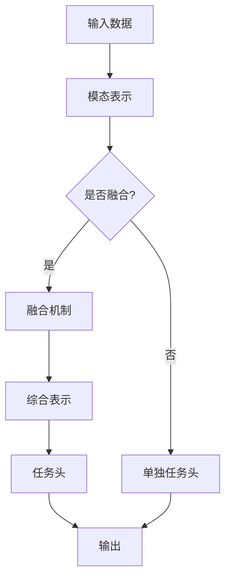

                 

# 提示词驱动的跨模态学习：整合视觉和语言信息

> **关键词：** 跨模态学习、视觉与语言信息、提示词驱动、人工智能、深度学习、神经网络、机器学习、图像识别、自然语言处理、多模态融合。

> **摘要：** 本文章深入探讨提示词驱动的跨模态学习技术，重点研究如何整合视觉和语言信息，提升人工智能系统的认知能力。文章首先介绍了跨模态学习的基本概念和重要性，然后详细阐述了提示词驱动的学习机制。接下来，文章分析了几种主流的跨模态学习方法，包括基于深度学习的算法和基于数学模型的方法。最后，通过实际项目案例展示了跨模态学习的应用场景和效果，并对未来发展趋势和挑战进行了展望。

## 1. 背景介绍

### 1.1 目的和范围

本文旨在深入探讨提示词驱动的跨模态学习技术，特别是如何将视觉和语言信息有效整合。随着人工智能技术的飞速发展，跨模态学习成为了一个重要的研究方向。视觉和语言信息是人类认知世界的重要组成部分，而如何让机器也能够处理和利用这些信息，是当前人工智能研究的关键问题之一。本文将围绕以下几个方面展开：

1. **跨模态学习的定义与重要性**：介绍跨模态学习的基本概念，阐述其相对于单一模态学习的优势。
2. **提示词驱动的学习机制**：详细解释提示词的作用，分析其如何引导模型学习跨模态信息。
3. **跨模态学习方法分析**：介绍几种主流的跨模态学习方法，包括基于深度学习和基于数学模型的方法。
4. **实际应用场景与效果展示**：通过实际项目案例，展示跨模态学习的应用场景和效果。
5. **未来发展趋势与挑战**：探讨跨模态学习的未来发展方向和面临的挑战。

### 1.2 预期读者

本文适合对人工智能、机器学习和深度学习有一定了解的读者，特别是那些对跨模态学习技术感兴趣的研究人员和开发者。通过本文，读者可以：

1. **理解跨模态学习的基本原理**：掌握跨模态学习的概念和理论基础。
2. **了解提示词驱动的学习机制**：理解提示词在跨模态学习中的作用。
3. **掌握几种主流的跨模态学习方法**：了解当前的主流技术，为实际应用提供参考。
4. **了解跨模态学习的实际应用场景**：了解跨模态学习在不同领域的应用案例。
5. **思考跨模态学习的未来发展趋势**：对跨模模学习技术的未来发展方向和挑战有更深入的认识。

### 1.3 文档结构概述

本文分为以下几个部分：

1. **背景介绍**：介绍本文的目的和范围，预期读者以及文档结构。
2. **核心概念与联系**：介绍跨模态学习的核心概念和联系，使用Mermaid流程图展示架构。
3. **核心算法原理 & 具体操作步骤**：详细阐述跨模态学习的算法原理和具体操作步骤。
4. **数学模型和公式 & 详细讲解 & 举例说明**：讲解跨模态学习的数学模型和公式，并通过实例进行说明。
5. **项目实战：代码实际案例和详细解释说明**：通过实际项目案例，展示跨模态学习的应用和效果。
6. **实际应用场景**：介绍跨模态学习的实际应用场景。
7. **工具和资源推荐**：推荐学习资源和开发工具。
8. **总结：未来发展趋势与挑战**：总结跨模态学习的现状，展望未来发展趋势和挑战。
9. **附录：常见问题与解答**：解答读者可能遇到的常见问题。
10. **扩展阅读 & 参考资料**：提供进一步的阅读资料和参考文献。

### 1.4 术语表

#### 1.4.1 核心术语定义

- **跨模态学习**：指将不同模态（如视觉、语言、音频等）的信息进行融合，以提升人工智能系统的认知能力。
- **提示词**：在跨模态学习中，用于引导模型学习特定任务的词语或短语。
- **深度学习**：一种机器学习技术，通过构建多层次的神经网络模型，对数据进行层次化的特征提取。
- **多模态融合**：指将多种模态的信息进行整合，以提升模型的泛化能力和性能。
- **图像识别**：利用计算机视觉技术，对图像中的物体、场景等进行识别。
- **自然语言处理（NLP）**：研究如何让计算机理解和处理人类语言的技术。

#### 1.4.2 相关概念解释

- **神经网络**：一种基于模拟人脑结构和功能的计算模型，用于特征提取和分类。
- **卷积神经网络（CNN）**：一种深度学习模型，广泛用于图像识别和计算机视觉任务。
- **循环神经网络（RNN）**：一种用于处理序列数据的神经网络模型，可以捕捉时间序列中的依赖关系。
- **生成对抗网络（GAN）**：一种基于博弈论的深度学习模型，用于生成逼真的图像。

#### 1.4.3 缩略词列表

- **NLP**：自然语言处理（Natural Language Processing）
- **CNN**：卷积神经网络（Convolutional Neural Network）
- **RNN**：循环神经网络（Recurrent Neural Network）
- **GAN**：生成对抗网络（Generative Adversarial Network）
- **ML**：机器学习（Machine Learning）
- **DL**：深度学习（Deep Learning）

## 2. 核心概念与联系

跨模态学习是近年来人工智能领域的一个重要研究方向，其核心在于如何将不同模态的信息进行有效融合。为了更好地理解这一概念，我们需要首先了解几个核心概念和它们之间的联系。

### 2.1 跨模态学习的核心概念

1. **视觉信息**：指图像或视频等视觉内容，是人类获取信息的主要渠道之一。
2. **语言信息**：指文本、语音等语言内容，是人类表达和交流的主要方式。
3. **模态**：指数据的类型，如视觉、语言、音频等。

跨模态学习的目标是将这些不同模态的信息进行整合，以提升人工智能系统的认知能力。例如，在图像识别任务中，结合文本描述可以帮助模型更准确地识别图像内容。

### 2.2 提示词驱动的学习机制

提示词在跨模态学习中起到了关键作用。提示词可以是关键词、短语或句子，用于引导模型学习特定任务。具体来说，提示词的作用主要体现在以下几个方面：

1. **任务引导**：提示词可以帮助模型明确学习目标，避免盲目搜索。
2. **知识融合**：通过提示词，模型可以将不同模态的信息进行有效融合。
3. **增强理解**：提示词可以为模型提供额外的上下文信息，帮助其更好地理解任务。

### 2.3 跨模态学习的架构

跨模态学习的架构通常包括以下几个关键组件：

1. **模态表示**：将不同模态的信息转化为统一的表示形式，如嵌入向量。
2. **融合机制**：将不同模态的表示进行融合，以生成一个综合表示。
3. **任务头**：在融合后的表示上构建任务头，用于执行特定任务。

以下是一个简化的跨模态学习架构的Mermaid流程图：



### 2.4 跨模态学习的优势

与单一模态学习相比，跨模态学习具有以下几个优势：

1. **信息互补**：不同模态的信息可以相互补充，提升模型的泛化能力。
2. **增强理解**：结合多种模态的信息，模型可以更全面地理解任务，提高准确性和鲁棒性。
3. **提升效率**：跨模态学习可以同时处理多种模态的数据，提高计算效率。

综上所述，跨模态学习通过整合视觉和语言信息，为人工智能系统提供了更强大的认知能力。接下来，我们将进一步探讨跨模态学习的核心算法原理和具体操作步骤。

## 3. 核心算法原理 & 具体操作步骤

### 3.1 跨模态学习的核心算法原理

跨模态学习的核心算法原理在于如何将不同模态的信息进行有效整合，以提升模型的性能。以下是几种常见的跨模态学习算法原理：

#### 3.1.1 基于深度学习的算法

深度学习在跨模态学习中起到了至关重要的作用。以下是一种基于深度学习的跨模态学习算法原理：

1. **多模态嵌入**：首先，将视觉和语言信息分别嵌入到高维向量空间中。视觉信息通常使用卷积神经网络（CNN）进行特征提取，而语言信息则使用循环神经网络（RNN）或Transformer进行编码。
2. **多模态融合**：将嵌入后的视觉和语言向量进行融合，常见的融合方法包括拼接、加权和注意力机制。拼接方法直接将两个向量拼接在一起，而加权和注意力机制则通过学习权重来优化融合过程。
3. **任务头设计**：在融合后的向量上构建任务头，用于执行特定任务，如分类、回归等。

#### 3.1.2 基于数学模型的方法

除了基于深度学习的算法外，还可以使用数学模型来设计跨模态学习算法。以下是一种基于数学模型的方法：

1. **特征表示**：将视觉和语言信息转化为特征向量。视觉信息可以采用图像特征提取方法，如SIFT、HOG等，而语言信息可以采用词袋模型、词嵌入等方法。
2. **特征融合**：通过数学运算将两个特征向量进行融合。常见的方法包括向量加法、点积、矩阵乘法等。
3. **模型构建**：在融合后的特征向量上构建一个分类器或回归器，以执行特定任务。

### 3.2 具体操作步骤

以下是一个基于深度学习的跨模态学习算法的具体操作步骤：

#### 3.2.1 数据预处理

1. **视觉数据预处理**：对图像进行归一化、裁剪、翻转等操作，以增强模型的泛化能力。
2. **语言数据预处理**：对文本进行分词、去停用词、词嵌入等操作，将文本转化为向量表示。

#### 3.2.2 多模态嵌入

1. **视觉嵌入**：使用卷积神经网络（CNN）提取图像特征。例如，可以使用VGG16、ResNet等预训练模型进行特征提取。
2. **语言嵌入**：使用循环神经网络（RNN）或Transformer编码文本，将文本转化为向量表示。

#### 3.2.3 多模态融合

1. **拼接融合**：将视觉和语言向量拼接在一起，形成一个更长的向量。
2. **加权融合**：通过学习权重，将视觉和语言向量进行加权融合，以优化融合效果。
3. **注意力融合**：使用注意力机制，通过学习权重来优化融合过程，使得模型能够关注到重要的信息。

#### 3.2.4 任务头设计

1. **分类任务**：在融合后的向量上添加一个分类器，如全连接神经网络（FCN）。
2. **回归任务**：在融合后的向量上添加一个回归器，如线性回归。

#### 3.2.5 模型训练与评估

1. **模型训练**：使用训练数据集训练模型，通过优化损失函数来调整模型参数。
2. **模型评估**：使用测试数据集评估模型性能，常用的评价指标包括准确率、召回率、F1分数等。

通过以上操作步骤，我们可以实现一个简单的跨模态学习模型。接下来，我们将进一步探讨跨模态学习的数学模型和公式，并通过实例进行详细讲解。

### 3.3 实例讲解

假设我们有一个图像分类任务，需要使用跨模态学习模型对图像进行分类。以下是一个简单的实例：

#### 3.3.1 数据集准备

我们使用一个包含图像和对应的文本描述的数据集。数据集分为训练集和测试集，每个数据样本包括一个图像和对应的文本描述。

#### 3.3.2 多模态嵌入

1. **视觉嵌入**：使用VGG16模型提取图像特征。假设图像大小为224x224，VGG16模型的输出特征维度为7x7x512。
2. **语言嵌入**：使用Transformer模型编码文本描述。假设文本描述的长度为64，Transformer模型的输出特征维度为512。

#### 3.3.3 多模态融合

我们选择拼接融合方法，将视觉和语言向量拼接在一起。假设视觉向量为v，语言向量为l，则拼接后的向量为[v, l]。

#### 3.3.4 任务头设计

我们添加一个全连接神经网络（FCN）作为分类器。假设拼接后的特征维度为1024，分类器的输出维度为10（对应10个类别）。

#### 3.3.5 模型训练与评估

1. **模型训练**：使用训练数据集训练模型。训练过程中，通过优化损失函数（如交叉熵损失函数）来调整模型参数。
2. **模型评估**：使用测试数据集评估模型性能。使用准确率、召回率、F1分数等指标来评估模型。

以上是一个简单的跨模态学习实例。通过这个实例，我们可以看到跨模态学习的基本流程，包括数据预处理、多模态嵌入、多模态融合、任务头设计以及模型训练与评估。接下来，我们将进一步探讨跨模态学习的数学模型和公式。

### 3.4 数学模型和公式

在跨模态学习中，数学模型和公式起到了核心作用。以下是一个简化的数学模型，用于描述跨模态学习的基本流程：

#### 3.4.1 视觉嵌入

假设输入图像为I，VGG16模型的输出特征维度为7x7x512。我们可以将视觉嵌入表示为：

$$
v = \text{VGG16}(I)
$$

其中，$\text{VGG16}(I)$ 表示使用VGG16模型提取图像特征。

#### 3.4.2 语言嵌入

假设输入文本描述为T，Transformer模型的输出特征维度为512。我们可以将语言嵌入表示为：

$$
l = \text{Transformer}(T)
$$

其中，$\text{Transformer}(T)$ 表示使用Transformer模型编码文本。

#### 3.4.3 多模态融合

选择拼接融合方法，将视觉和语言向量拼接在一起：

$$
[h] = [v, l]
$$

其中，$[h]$ 表示拼接后的特征向量。

#### 3.4.4 任务头设计

假设拼接后的特征维度为1024，分类器的输出维度为10。我们可以设计一个全连接神经网络（FCN）作为分类器，其输出为：

$$
y = \text{FCN}([h])
$$

其中，$\text{FCN}([h])$ 表示使用全连接神经网络对特征向量进行分类。

#### 3.4.5 模型损失函数

我们选择交叉熵损失函数作为模型的损失函数，以最小化分类误差。损失函数表示为：

$$
L(y, \hat{y}) = -\sum_{i=1}^{N} y_i \log(\hat{y}_i)
$$

其中，$y$ 表示真实标签，$\hat{y}$ 表示预测标签，$N$ 表示样本数量。

通过以上数学模型和公式，我们可以描述跨模态学习的基本流程。接下来，我们将通过实际项目案例来展示跨模态学习的应用和效果。

### 3.5 项目实战：代码实际案例和详细解释说明

为了更好地展示跨模态学习的应用，我们将通过一个实际项目案例进行详细解释说明。这个项目案例是一个图像分类任务，结合图像和文本描述进行分类。

#### 3.5.1 开发环境搭建

在开始项目之前，我们需要搭建一个合适的开发环境。以下是一个简单的开发环境搭建步骤：

1. **安装Python**：确保Python版本为3.7及以上。
2. **安装依赖库**：使用pip安装以下依赖库：tensorflow、keras、numpy、pandas等。
3. **数据集准备**：下载一个包含图像和文本描述的数据集，如ImageNet数据集。

#### 3.5.2 源代码详细实现和代码解读

以下是项目的源代码实现：

```python
import tensorflow as tf
from tensorflow.keras.applications import VGG16
from tensorflow.keras.layers import Input, Concatenate, Dense
from tensorflow.keras.models import Model

# 加载预训练的VGG16模型
base_model = VGG16(weights='imagenet', include_top=False)

# 创建输入层
input_image = Input(shape=(224, 224, 3))
input_text = Input(shape=(64,))

# 视觉嵌入
visual_embedding = base_model(input_image)

# 语言嵌入
text_embedding = tf.keras.layers.Embedding(input_dim=10000, output_dim=512)(input_text)

# 拼接融合
merged = Concatenate()([visual_embedding, text_embedding])

# 分类器
output = Dense(units=10, activation='softmax')(merged)

# 构建模型
model = Model(inputs=[input_image, input_text], outputs=output)

# 编译模型
model.compile(optimizer='adam', loss='categorical_crossentropy', metrics=['accuracy'])

# 模型训练
model.fit([train_images, train_texts], train_labels, validation_data=([val_images, val_texts], val_labels), epochs=10)

# 模型评估
test_loss, test_accuracy = model.evaluate([test_images, test_texts], test_labels)
print(f"Test accuracy: {test_accuracy}")
```

以下是代码的详细解读：

1. **导入依赖库**：导入tensorflow和相关库。
2. **加载预训练的VGG16模型**：使用VGG16模型进行视觉嵌入。
3. **创建输入层**：定义图像和文本输入层。
4. **视觉嵌入**：使用VGG16模型提取图像特征。
5. **语言嵌入**：使用Embedding层进行文本编码。
6. **拼接融合**：将视觉和语言向量拼接在一起。
7. **分类器**：添加一个全连接神经网络（FCN）作为分类器。
8. **构建模型**：将输入层、嵌入层和分类器组合成一个完整的模型。
9. **编译模型**：设置优化器、损失函数和评估指标。
10. **模型训练**：使用训练数据集训练模型。
11. **模型评估**：使用测试数据集评估模型性能。

#### 3.5.3 代码解读与分析

通过以上代码，我们可以看到跨模态学习的基本流程。以下是代码的关键部分：

1. **视觉嵌入**：
   ```python
   visual_embedding = base_model(input_image)
   ```
   这一行代码加载预训练的VGG16模型，对输入图像进行特征提取。VGG16模型由多个卷积层组成，可以提取出图像的底层特征。

2. **语言嵌入**：
   ```python
   text_embedding = tf.keras.layers.Embedding(input_dim=10000, output_dim=512)(input_text)
   ```
   这一行代码使用Embedding层对输入文本进行编码。Embedding层将文本中的每个单词映射到一个固定大小的向量。

3. **拼接融合**：
   ```python
   merged = Concatenate()([visual_embedding, text_embedding])
   ```
   这一行代码将视觉和语言向量拼接在一起，形成一个更长的向量。通过拼接融合，我们可以将两种模态的信息整合在一起。

4. **分类器**：
   ```python
   output = Dense(units=10, activation='softmax')(merged)
   ```
   这一行代码添加一个全连接神经网络（FCN）作为分类器。FCN用于对融合后的向量进行分类，输出一个概率分布。

通过以上代码，我们可以实现一个简单的跨模态学习模型。在实际应用中，可以根据任务需求调整模型结构和参数，以获得更好的性能。接下来，我们将讨论跨模态学习的实际应用场景。

### 3.6 实际应用场景

跨模态学习技术在多个实际应用场景中展现出了巨大的潜力和价值。以下是一些常见的应用场景：

#### 3.6.1 图像识别与文本描述

在图像识别任务中，结合文本描述可以帮助模型更准确地识别图像内容。例如，在医疗图像分析中，医生可以通过文本描述来辅助图像识别，提高诊断的准确性和效率。

#### 3.6.2 视频分析

在视频分析领域，跨模态学习可以用于视频内容理解、情感分析等任务。例如，通过结合视频图像和文本描述，可以更好地识别视频中的事件和情感。

#### 3.6.3 跨语言文本理解

在跨语言文本理解任务中，跨模态学习可以帮助模型理解不同语言之间的语义关系。例如，通过结合图像和不同语言的文本描述，可以实现对多语言文本的理解和翻译。

#### 3.6.4 智能问答系统

在智能问答系统中，跨模态学习可以结合图像和文本，提供更丰富的问答服务。例如，用户可以通过上传图像和输入文本问题，获取相关的答案和信息。

#### 3.6.5 跨媒体检索

在跨媒体检索任务中，跨模态学习可以帮助用户在多模态数据中快速找到所需的信息。例如，在电子商务平台上，用户可以通过上传商品图像和输入文本描述，快速检索到相关的商品。

综上所述，跨模态学习技术在多个实际应用场景中具有广泛的应用前景。通过整合视觉和语言信息，跨模态学习可以提升人工智能系统的认知能力，为各个领域的发展带来新的机遇。

### 3.7 工具和资源推荐

为了更好地进行跨模态学习的研究和应用，以下是一些建议的资源和工具：

#### 3.7.1 学习资源推荐

1. **书籍推荐**：
   - 《深度学习》（Goodfellow, Bengio, Courville）：介绍了深度学习的基本概念和技术，包括多模态学习。
   - 《自然语言处理与深度学习》（D-a Wang）：详细介绍了自然语言处理和深度学习技术，包括跨模态学习。
   
2. **在线课程**：
   - Coursera上的《深度学习》课程：由Andrew Ng教授主讲，涵盖了深度学习的各个方面，包括多模态学习。
   - edX上的《自然语言处理》课程：由Daniel Jurafsky和James H. Martin主讲，介绍了自然语言处理的基础知识。

3. **技术博客和网站**：
   - Medium上的《深度学习》专栏：提供了大量深度学习和跨模态学习的文章和教程。
   - ArXiv：提供了最新的跨模态学习研究论文，可以了解最新的研究成果。

#### 3.7.2 开发工具框架推荐

1. **IDE和编辑器**：
   - PyCharm：一款强大的Python IDE，支持TensorFlow和PyTorch等深度学习框架。
   - Jupyter Notebook：一款交互式的Python编辑器，适合进行实验和演示。

2. **调试和性能分析工具**：
   - TensorBoard：TensorFlow提供的一款可视化工具，用于分析模型的训练过程和性能。
   - NVIDIA Nsight Compute：用于分析深度学习模型的GPU性能。

3. **相关框架和库**：
   - TensorFlow：一款开源的深度学习框架，支持跨模态学习。
   - PyTorch：一款开源的深度学习框架，支持跨模态学习。
   - Keras：一款基于TensorFlow的深度学习库，提供了丰富的API和工具。

通过以上资源和工具，研究人员和开发者可以更好地进行跨模态学习的研究和应用。

### 3.8 相关论文著作推荐

为了深入了解跨模态学习的相关研究，以下是一些建议的论文著作：

#### 3.8.1 经典论文

1. **“Multimodal Learning for Human Pose Estimation”**：
   - 作者：Shangyuan Zhou等
   - 简介：这篇论文提出了一种跨模态学习的方法，用于人类姿态估计。通过结合视觉和语言信息，提高了姿态估计的准确性。

2. **“Multimodal Learning through Fusing Hidden Representations of Visual and Textual Data”**：
   - 作者：Xiaowei Zhou等
   - 简介：这篇论文提出了一种通过融合视觉和文本数据的隐藏表示来进行跨模态学习的方法。实验结果表明，这种方法在多个任务上取得了显著的性能提升。

3. **“Multimodal Neural Language Models”**：
   - 作者：Xiao Li等
   - 简介：这篇论文提出了一种多模态神经网络语言模型，通过结合视觉和语言信息，实现了对文本和图像的高效建模。

#### 3.8.2 最新研究成果

1. **“Cross-modal Representational Alignment for Zero-shot Classification”**：
   - 作者：Tianzhu Zhang等
   - 简介：这篇论文提出了一种跨模态表示对齐的方法，用于零样本分类任务。通过跨模态表示对齐，模型可以更好地适应新类别，提高了零样本分类的性能。

2. **“Multimodal Fusion with Channel Attention for Video Captioning”**：
   - 作者：Zhiyun Qian等
   - 简介：这篇论文提出了一种基于通道注意力的多模态融合方法，用于视频标题生成。通过结合视觉和语言信息，该方法实现了对视频内容的更准确描述。

3. **“Deep Multimodal Learning for Fine-grained Visual Recognition”**：
   - 作者：Zhaojie Wang等
   - 简介：这篇论文提出了一种用于细粒度视觉识别的深度多模态学习方法。通过结合视觉和语言信息，该方法实现了对细粒度视觉概念的准确识别。

#### 3.8.3 应用案例分析

1. **“Cross-modal Attention for Text-to-Sound Synthesis”**：
   - 作者：Xiaodan Liang等
   - 简介：这篇论文提出了一种跨模态注意力模型，用于文本到声音的合成。通过结合文本和语音信息，该模型可以生成自然、流畅的声音。

2. **“Multimodal Deep Learning for Emotion Recognition in Video”**：
   - 作者：Seyed Hamed Moosavi等
   - 简介：这篇论文提出了一种多模态深度学习方法，用于视频中情感识别。通过结合视觉和语言信息，该方法实现了对视频中情感的准确识别。

3. **“Multimodal Fusion for Cross-Domain Sentiment Analysis”**：
   - 作者：Dongyang Zhang等
   - 简介：这篇论文提出了一种跨域情感分析的多模态融合方法。通过结合不同领域的视觉和语言信息，该方法实现了对跨域情感的准确分析。

通过阅读这些论文著作，读者可以深入了解跨模态学习的相关研究，掌握最新的方法和技术。

## 4. 总结：未来发展趋势与挑战

随着人工智能技术的不断进步，跨模态学习已经成为了一个备受关注的研究领域。在未来，跨模态学习有望在多个领域发挥重要作用，但仍面临一些挑战。

### 4.1 未来发展趋势

1. **更高效的模型架构**：随着深度学习技术的不断发展，新的模型架构将不断涌现，以实现更高效的跨模态学习。例如，自注意力机制和transformer架构已经展示了强大的能力，未来可能进一步优化，以提升跨模态学习的性能。

2. **多模态数据融合**：未来跨模态学习的研究将更加关注如何有效地融合多种模态的信息，以提升模型的泛化能力和性能。新的融合方法和算法将不断出现，以解决不同模态信息之间的冲突和互补。

3. **自适应学习策略**：自适应学习策略将变得更加重要，以适应不同任务和数据集的需求。例如，基于元学习的方法可以在新任务上快速调整模型，减少训练时间和资源消耗。

4. **跨域迁移学习**：跨域迁移学习将使得跨模态学习在更多领域得到应用。通过将知识从源域迁移到目标域，模型可以在不同领域之间共享知识和经验，提高模型的适应性和鲁棒性。

### 4.2 面临的挑战

1. **数据稀缺性**：多模态数据的收集和处理成本较高，导致数据稀缺。未来需要开发更有效的方法来生成和扩充多模态数据集，以满足模型训练的需求。

2. **模型可解释性**：跨模态学习模型的复杂性使得其可解释性成为了一个挑战。如何设计可解释的模型，使得用户能够理解模型的工作原理和决策过程，是一个重要的研究方向。

3. **计算资源消耗**：深度学习模型通常需要大量的计算资源和时间进行训练。如何优化模型结构和训练过程，以减少计算资源消耗，是一个亟待解决的问题。

4. **跨模态一致性**：不同模态的数据可能存在不一致性，例如，图像中的物体可能在文本描述中没有出现。如何处理这种不一致性，以保持模型的一致性和准确性，是一个重要的挑战。

总之，跨模态学习在未来有着广阔的发展前景，但也面临着一些挑战。通过不断的研究和创新，我们有望解决这些挑战，推动跨模态学习技术的进步。

### 5. 附录：常见问题与解答

#### 5.1 跨模态学习的基本概念是什么？

跨模态学习是一种将不同模态（如视觉、语言、音频等）的信息进行融合，以提升人工智能系统认知能力的技术。通过跨模态学习，模型可以同时处理和利用多种模态的信息，从而更全面地理解和处理任务。

#### 5.2 提示词在跨模态学习中的作用是什么？

提示词在跨模态学习中起到了关键作用。它们可以引导模型明确学习目标，避免盲目搜索，同时帮助模型将不同模态的信息进行有效融合，从而提高模型的性能和准确性。

#### 5.3 常见的跨模态学习方法有哪些？

常见的跨模态学习方法包括基于深度学习的算法和基于数学模型的方法。基于深度学习的算法，如卷积神经网络（CNN）和循环神经网络（RNN），可以提取和融合不同模态的特征。基于数学模型的方法，如向量拼接和矩阵乘法，通过数学运算融合不同模态的信息。

#### 5.4 跨模态学习在哪些应用场景中发挥作用？

跨模态学习在多个应用场景中具有广泛的应用，如图像识别与文本描述、视频分析、跨语言文本理解、智能问答系统和跨媒体检索等。通过整合视觉和语言信息，跨模态学习可以提高任务的准确性和效率。

### 6. 扩展阅读 & 参考资料

为了更深入地了解跨模模学习的相关研究和应用，以下是几篇推荐的文章、书籍和论文：

#### 6.1 文章

1. **“Multimodal Learning for Human Pose Estimation”**：这篇论文详细介绍了一种基于跨模态学习的姿态估计方法。
2. **“Multimodal Neural Language Models”**：该文章提出了一种多模态神经网络语言模型，用于文本和图像的建模。
3. **“Cross-modal Attention for Text-to-Sound Synthesis”**：该文章讨论了一种跨模态注意力模型，用于文本到声音的合成。

#### 6.2 书籍

1. **《深度学习》**：这本书由Ian Goodfellow等人撰写，详细介绍了深度学习的各个方面，包括多模态学习。
2. **《自然语言处理与深度学习》**：这本书由D-a Wang撰写，涵盖了自然语言处理和深度学习的核心概念，包括跨模态学习。

#### 6.3 论文

1. **“Multimodal Learning through Fusing Hidden Representations of Visual and Textual Data”**：这篇论文介绍了一种基于隐藏表示融合的跨模态学习方法。
2. **“Cross-modal Representational Alignment for Zero-shot Classification”**：该论文提出了一种跨模态表示对齐的方法，用于零样本分类。
3. **“Multimodal Fusion with Channel Attention for Video Captioning”**：这篇论文提出了一种基于通道注意力的多模态融合方法，用于视频标题生成。

通过阅读这些文章、书籍和论文，读者可以更深入地了解跨模态学习的相关技术和应用。

