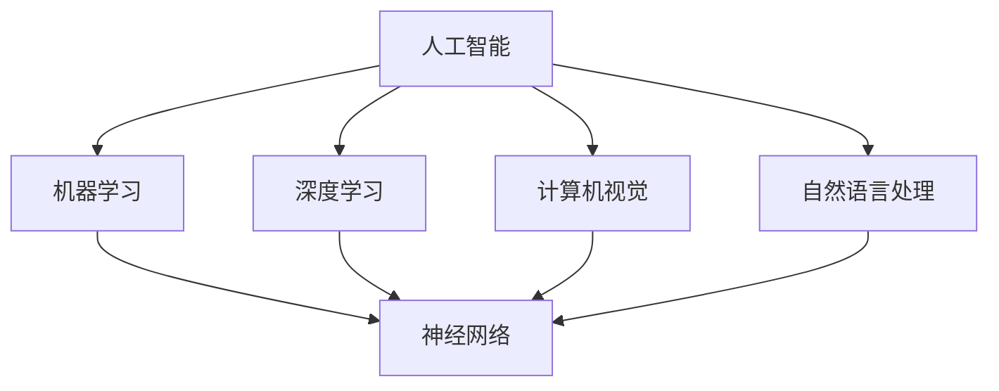

                 

### 1. 背景介绍

#### 1.1 目的和范围

本文旨在探讨AI编程的新思维与新高度，深入剖析AI编程的核心概念、算法原理、数学模型及其在实际应用中的场景。通过逐步推理和分析，本文将揭示AI编程的本质，帮助读者理解并掌握AI编程的核心技术和思维方式。

本文的目标读者是具有计算机科学背景的技术人员，特别是那些对人工智能和编程有浓厚兴趣的读者。同时，本文也适合那些希望在现有知识体系上进一步拓展，提升编程技能的读者。

本文的范围将涵盖以下主要内容：

1. **核心概念与联系**：介绍AI编程的基本概念和原理，通过Mermaid流程图展示核心概念的关联。
2. **核心算法原理**：详细阐述AI编程中的核心算法原理，并使用伪代码进行具体操作步骤的讲解。
3. **数学模型和公式**：介绍AI编程中的数学模型和公式，并举例说明其应用。
4. **项目实战**：通过代码实际案例，展示AI编程的实践过程和详细解释。
5. **实际应用场景**：探讨AI编程在实际中的应用场景，并分析其优势和挑战。
6. **工具和资源推荐**：推荐学习资源、开发工具框架及相关论文著作。
7. **总结**：对AI编程的未来发展趋势和挑战进行总结。

#### 1.2 预期读者

本文的预期读者是以下几类人群：

1. **AI和编程爱好者**：对AI编程有浓厚兴趣，希望深入了解AI编程的核心概念和原理。
2. **计算机科学学生**：正在学习计算机科学，特别是人工智能和编程相关课程的学生。
3. **程序员**：具备一定的编程基础，希望在现有技能基础上提升AI编程能力。
4. **技术专家**：对AI编程有深入研究，希望了解最新发展趋势和技术应用。

#### 1.3 文档结构概述

本文的结构如下：

1. **背景介绍**：介绍本文的目的、范围、预期读者和文档结构。
2. **核心概念与联系**：通过Mermaid流程图展示核心概念和原理。
3. **核心算法原理**：详细阐述核心算法原理，并使用伪代码讲解。
4. **数学模型和公式**：介绍数学模型和公式，并举例说明。
5. **项目实战**：通过实际代码案例展示编程实践。
6. **实际应用场景**：探讨AI编程的应用场景和挑战。
7. **工具和资源推荐**：推荐学习资源、开发工具和论文著作。
8. **总结**：总结AI编程的未来发展趋势和挑战。
9. **附录**：常见问题与解答。
10. **扩展阅读**：推荐相关书籍、在线课程和技术博客。

#### 1.4 术语表

在本文中，我们将使用以下术语：

##### 1.4.1 核心术语定义

- **AI编程**：利用人工智能技术进行编程，实现智能算法和系统。
- **深度学习**：一种基于多层神经网络的学习方法，用于模拟人脑的学习过程。
- **机器学习**：利用数据和算法让计算机自主学习和改进性能。
- **神经网络**：由大量节点组成的信息处理系统，模拟人脑的神经网络结构。
- **算法**：解决问题的步骤和规则。

##### 1.4.2 相关概念解释

- **人工智能（AI）**：一种模拟人类智能的技术，包括机器学习、自然语言处理、计算机视觉等。
- **数据科学**：一种利用数据分析和算法解决问题的方法，包括数据清洗、数据挖掘、数据分析等。
- **数据集**：一组用于训练和测试算法的数据。

##### 1.4.3 缩略词列表

- **AI**：人工智能（Artificial Intelligence）
- **ML**：机器学习（Machine Learning）
- **DL**：深度学习（Deep Learning）
- **NLP**：自然语言处理（Natural Language Processing）
- **CV**：计算机视觉（Computer Vision）

通过以上背景介绍，我们为读者提供了一个清晰的框架，以便更好地理解后续内容。在接下来的章节中，我们将逐步深入探讨AI编程的核心概念、算法原理、数学模型及其应用，帮助读者掌握AI编程的新思维与新高度。

### 2. 核心概念与联系

在深入探讨AI编程之前，我们需要明确几个核心概念和它们之间的相互联系。以下是AI编程中一些关键的概念及其关系，我们将通过Mermaid流程图展示这些概念和关系。

#### 2.1 AI编程的核心概念

**1. 人工智能（AI）**  
人工智能是一种模拟人类智能的技术，涵盖多个子领域，如机器学习、自然语言处理、计算机视觉等。

**2. 机器学习（ML）**  
机器学习是AI的一个子领域，通过算法和统计模型，从数据中学习和改进性能。

**3. 深度学习（DL）**  
深度学习是一种基于多层神经网络的学习方法，能够自动提取特征，实现复杂的任务。

**4. 计算机视觉（CV）**  
计算机视觉是研究如何让计算机理解和解释视觉信息的学科。

**5. 自然语言处理（NLP）**  
自然语言处理是研究如何使计算机理解和生成人类自然语言的技术。

**6. 神经网络**  
神经网络是由大量节点（神经元）组成的信息处理系统，模拟人脑的结构和工作方式。

#### 2.2 核心概念之间的联系

下面是一个Mermaid流程图，展示了AI编程中的核心概念及其相互关系：



**解释**：

- 人工智能（A）是整个AI编程的核心，它包含了机器学习（B）、深度学习（C）、计算机视觉（D）和自然语言处理（E）等子领域。
- 机器学习（B）和深度学习（C）是紧密相关的，深度学习是机器学习的一个分支，通过多层神经网络实现。
- 计算机视觉（D）和自然语言处理（E）则分别关注视觉信息和语言信息的处理和理解，它们也依赖于神经网络（F）作为基础。

#### 2.3 实例分析

以一个实际应用场景为例，我们可以看到这些核心概念是如何相互关联的：

**场景**：利用深度学习进行图像识别。

**步骤**：

1. **数据收集**：收集大量的图像数据，用于训练神经网络。
2. **预处理**：对图像数据进行预处理，包括尺寸调整、归一化等。
3. **模型训练**：使用深度学习算法（如卷积神经网络）训练神经网络，使其能够自动提取图像特征。
4. **模型评估**：使用测试数据集评估模型的性能，调整模型参数以优化性能。
5. **应用**：将训练好的模型应用于实际场景，如图像分类、物体检测等。

在这个过程中，我们可以看到：

- 数据预处理需要计算机视觉（D）和自然语言处理（E）的概念。
- 模型训练和评估需要机器学习（B）和深度学习（C）的概念。
- 神经网络（F）是核心，贯穿整个应用过程。

通过以上分析，我们明确了AI编程中的核心概念及其相互联系，这为进一步探讨算法原理和数学模型奠定了基础。

### 3. 核心算法原理 & 具体操作步骤

在了解AI编程的核心概念和联系后，接下来我们将深入探讨AI编程中的核心算法原理，并使用伪代码详细阐述其具体操作步骤。

#### 3.1 算法原理

AI编程中的核心算法主要包括机器学习算法和深度学习算法。其中，机器学习算法主要包括线性回归、逻辑回归、决策树、随机森林、支持向量机等；深度学习算法主要包括卷积神经网络（CNN）、循环神经网络（RNN）、生成对抗网络（GAN）等。

在本节中，我们将以卷积神经网络（CNN）为例，详细阐述其算法原理和操作步骤。

##### 3.1.1 卷积神经网络（CNN）算法原理

卷积神经网络（CNN）是一种基于多层感知器（MLP）的神经网络，特别适用于图像处理任务。其核心思想是利用卷积层提取图像特征，并通过池化层降低特征维度，最终通过全连接层进行分类或回归。

**1. 卷积层（Convolutional Layer）**  
卷积层是CNN的基础，通过卷积操作提取图像特征。卷积操作的定义如下：

$$
h(x; \theta) = \sum_{i=1}^{K} \theta_i * x
$$

其中，$h(x; \theta)$表示卷积操作的结果，$\theta$表示卷积核（过滤器），$x$表示输入图像。

**2. 池化层（Pooling Layer）**  
池化层用于降低特征维度，同时减少计算量和参数数量。常用的池化操作包括最大池化（Max Pooling）和平均池化（Average Pooling）。

**3. 全连接层（Fully Connected Layer）**  
全连接层将卷积层和池化层提取的特征映射到输出结果。全连接层通过权重矩阵和偏置项将输入特征映射到输出类别或回归值。

##### 3.1.2 CNN具体操作步骤

以下使用伪代码详细描述CNN的具体操作步骤：

```python
# 初始化参数
theta_1 = 初始化卷积核参数()
theta_2 = 初始化卷积核参数()
theta_3 = 初始化卷积核参数()
b_1 = 初始化偏置项()
b_2 = 初始化偏置项()
b_3 = 初始化偏置项()

# 输入图像
x = 输入图像()

# 卷积操作
h_1 = 卷积操作(x, theta_1)
h_1 = 添加偏置项(h_1, b_1)

# 池化操作
p_1 = 池化操作(h_1)

# 第二层卷积操作
h_2 = 卷积操作(p_1, theta_2)
h_2 = 添加偏置项(h_2, b_2)

# 第二层池化操作
p_2 = 池化操作(h_2)

# 第三层卷积操作
h_3 = 卷积操作(p_2, theta_3)
h_3 = 添加偏置项(h_3, b_3)

# 全连接层操作
output = 全连接操作(h_3, 权重矩阵(), 偏置项())

# 损失函数计算
loss = 计算损失函数(output, 标签())

# 反向传播
梯度 = 反向传播(output, loss)

# 参数更新
theta_1 = 更新卷积核参数(theta_1, 梯度())
theta_2 = 更新卷积核参数(theta_2, 梯度())
theta_3 = 更新卷积核参数(theta_3, 梯度())
b_1 = 更新偏置项(b_1, 梯度())
b_2 = 更新偏置项(b_2, 梯度())
b_3 = 更新偏置项(b_3, 梯度())
```

通过以上伪代码，我们可以看到卷积神经网络的基本操作步骤，包括卷积、池化、全连接层以及参数更新等。这些步骤构成了CNN的核心算法，使其在图像处理任务中具有强大的表现能力。

#### 3.2 实例分析

以一个实际图像分类任务为例，我们可以看到CNN的具体应用过程：

**任务**：给定一个图像数据集，使用CNN对图像进行分类。

**步骤**：

1. **数据集准备**：收集并预处理图像数据，包括数据增强、归一化等。
2. **模型构建**：构建CNN模型，包括卷积层、池化层和全连接层。
3. **模型训练**：使用训练数据集训练模型，通过反向传播算法更新参数。
4. **模型评估**：使用测试数据集评估模型性能，调整模型参数以优化性能。
5. **应用**：将训练好的模型应用于实际图像分类任务。

在这个过程中，我们可以看到：

- **数据预处理**：通过数据增强和归一化，提高模型的泛化能力。
- **模型构建**：通过卷积层、池化层和全连接层的组合，提取图像特征并进行分类。
- **模型训练**：通过反向传播算法，优化模型参数，提高分类准确率。
- **模型评估**：通过测试数据集评估模型性能，验证模型的泛化能力。

通过以上实例分析，我们可以看到CNN在图像分类任务中的应用过程，进一步理解了其算法原理和操作步骤。

通过以上对卷积神经网络（CNN）的深入剖析，我们掌握了AI编程中的核心算法原理和操作步骤。在接下来的章节中，我们将继续探讨数学模型和公式，进一步揭示AI编程的深度与智慧。

### 4. 数学模型和公式 & 详细讲解 & 举例说明

在AI编程中，数学模型和公式是理解和实现算法的核心。在本节中，我们将详细讲解AI编程中常用的数学模型和公式，并通过具体例子来说明其应用。

#### 4.1 数学模型

AI编程中的数学模型主要涉及线性代数、微积分和概率统计。以下是一些关键的数学模型：

**1. 矩阵和向量**  
矩阵和向量是线性代数的基础，用于表示数据和处理计算。矩阵的乘法、求导和矩阵分解（如SVD）在AI编程中广泛应用。

**2. 梯度下降**  
梯度下降是一种优化算法，用于最小化损失函数。其核心思想是计算损失函数的梯度，并沿着梯度的反方向更新模型参数。

$$
\theta = \theta - \alpha \cdot \nabla L(\theta)
$$

其中，$\theta$表示模型参数，$\alpha$表示学习率，$L(\theta)$表示损失函数，$\nabla L(\theta)$表示损失函数的梯度。

**3. 神经元激活函数**  
激活函数是神经网络中的关键组件，用于引入非线性。常见的激活函数包括 sigmoid、ReLU、Tanh等。

**4. 卷积操作**  
卷积操作是CNN的核心，用于提取图像特征。其定义如下：

$$
h(x; \theta) = \sum_{i=1}^{K} \theta_i * x
$$

其中，$h(x; \theta)$表示卷积操作的结果，$\theta$表示卷积核（过滤器），$x$表示输入图像。

**5. 池化操作**  
池化操作用于降低特征维度，其定义如下：

$$
p(x) = \max(x)
$$

或

$$
p(x) = \frac{1}{C} \sum_{i=1}^{C} x_i
$$

其中，$p(x)$表示池化结果，$C$表示池化窗口的大小。

**6. 损失函数**  
损失函数用于评估模型预测值与真实值之间的差距，常见损失函数包括均方误差（MSE）、交叉熵（Cross-Entropy）等。

$$
L(y, \hat{y}) = \frac{1}{2} \sum_{i=1}^{N} (y_i - \hat{y}_i)^2
$$

或

$$
L(y, \hat{y}) = -\sum_{i=1}^{N} y_i \log(\hat{y}_i)
$$

其中，$y$表示真实值，$\hat{y}$表示预测值，$N$表示样本数量。

#### 4.2 公式详细讲解

**1. 矩阵和向量**

- **矩阵乘法**  
  矩阵乘法是线性代数中的基础运算，其定义如下：

  $$
  C = A \cdot B
  $$

  其中，$C$是结果矩阵，$A$和$B$是输入矩阵。

- **矩阵求导**  
  矩阵求导是微积分中的核心概念，其定义如下：

  $$
  \nabla_C A = \frac{\partial A}{\partial C}
  $$

  其中，$\nabla_C A$表示矩阵$A$对矩阵$C$的导数。

- **矩阵分解（SVD）**  
  矩阵分解是将矩阵分解为三个矩阵的乘积，其定义如下：

  $$
  A = U \cdot \Sigma \cdot V^T
  $$

  其中，$U$和$V$是正交矩阵，$\Sigma$是对角矩阵。

**2. 梯度下降**

- **梯度下降**  
  梯度下降是优化算法中的基础，其定义如下：

  $$
  \theta = \theta - \alpha \cdot \nabla L(\theta)
  $$

  其中，$\theta$表示模型参数，$\alpha$表示学习率，$\nabla L(\theta)$表示损失函数的梯度。

- **梯度下降优化**  
  梯度下降优化是梯度下降的具体实现，其定义如下：

  $$
  \theta^{t+1} = \theta^t - \alpha \cdot \nabla L(\theta^t)
  $$

  其中，$\theta^{t+1}$和$\theta^t$分别表示第$t+1$次和第$t$次迭代的参数。

**3. 神经元激活函数**

- **Sigmoid函数**  
  Sigmoid函数是一种常用的激活函数，其定义如下：

  $$
  \sigma(x) = \frac{1}{1 + e^{-x}}
  $$

- **ReLU函数**  
  ReLU函数是一种常用的激活函数，其定义如下：

  $$
  \text{ReLU}(x) = \max(0, x)
  $$

- **Tanh函数**  
  Tanh函数是一种常用的激活函数，其定义如下：

  $$
  \text{Tanh}(x) = \frac{e^x - e^{-x}}{e^x + e^{-x}}
  $$

**4. 卷积操作**

- **卷积操作**  
  卷积操作是CNN中的核心，其定义如下：

  $$
  h(x; \theta) = \sum_{i=1}^{K} \theta_i * x
  $$

  其中，$h(x; \theta)$表示卷积操作的结果，$\theta$表示卷积核（过滤器），$x$表示输入图像。

**5. 池化操作**

- **最大池化**  
  最大池化是一种常用的池化操作，其定义如下：

  $$
  p(x) = \max(x)
  $$

- **平均池化**  
  平均池化是一种常用的池化操作，其定义如下：

  $$
  p(x) = \frac{1}{C} \sum_{i=1}^{C} x_i
  $$

**6. 损失函数**

- **均方误差（MSE）**  
  均方误差是一种常用的损失函数，其定义如下：

  $$
  L(y, \hat{y}) = \frac{1}{2} \sum_{i=1}^{N} (y_i - \hat{y}_i)^2
  $$

- **交叉熵（Cross-Entropy）**  
  交叉熵是一种常用的损失函数，其定义如下：

  $$
  L(y, \hat{y}) = -\sum_{i=1}^{N} y_i \log(\hat{y}_i)
  $$

#### 4.3 举例说明

**例子 1：矩阵乘法**

给定两个矩阵$A$和$B$，计算矩阵$C = A \cdot B$。

$$
A = \begin{bmatrix}
1 & 2 \\
3 & 4
\end{bmatrix}, B = \begin{bmatrix}
5 & 6 \\
7 & 8
\end{bmatrix}
$$

计算过程如下：

$$
C = \begin{bmatrix}
1 \cdot 5 + 2 \cdot 7 & 1 \cdot 6 + 2 \cdot 8 \\
3 \cdot 5 + 4 \cdot 7 & 3 \cdot 6 + 4 \cdot 8
\end{bmatrix} = \begin{bmatrix}
19 & 20 \\
29 & 34
\end{bmatrix}
$$

**例子 2：梯度下降**

给定损失函数$L(y, \hat{y}) = (y - \hat{y})^2$，初始化参数$\theta = 2$，学习率$\alpha = 0.1$，进行一次梯度下降。

$$
L(\theta) = (y - \hat{y})^2 = (y - (\theta \cdot x))^2
$$

计算损失函数的梯度：

$$
\nabla L(\theta) = 2 \cdot (y - \theta \cdot x)
$$

进行一次梯度下降：

$$
\theta^{t+1} = \theta^t - \alpha \cdot \nabla L(\theta^t) = 2 - 0.1 \cdot 2 = 1.8
$$

**例子 3：Sigmoid函数**

给定输入$x = 2$，计算Sigmoid函数的输出：

$$
\sigma(x) = \frac{1}{1 + e^{-x}} = \frac{1}{1 + e^{-2}} \approx 0.8862
$$

通过以上数学模型和公式的讲解与举例，我们更好地理解了AI编程中的核心概念和计算过程。在接下来的章节中，我们将通过项目实战，进一步展示AI编程的实践应用。

### 5. 项目实战：代码实际案例和详细解释说明

在掌握了AI编程的核心算法原理和数学模型后，我们接下来将通过一个实际项目实战，展示AI编程的完整实现过程，并提供详细的代码解释和案例分析。

#### 5.1 开发环境搭建

在开始项目实战之前，我们需要搭建一个合适的开发环境。以下是推荐的开发环境和工具：

1. **编程语言**：Python
2. **库和框架**：TensorFlow、NumPy、Pandas
3. **IDE**：PyCharm、Visual Studio Code
4. **操作系统**：Linux、MacOS、Windows

安装步骤：

1. 安装Python（推荐版本：3.8及以上）
2. 安装TensorFlow：

   ```shell
   pip install tensorflow
   ```

3. 安装NumPy和Pandas：

   ```shell
   pip install numpy
   pip install pandas
   ```

4. 配置Python环境变量，确保能够正常运行Python和相关库。

#### 5.2 源代码详细实现和代码解读

在本节中，我们将使用TensorFlow构建一个简单的图像分类模型，对MNIST数据集进行手写数字识别。以下是项目的源代码及详细解释。

```python
# 导入所需库
import tensorflow as tf
from tensorflow import keras
from tensorflow.keras import layers
import numpy as np

# 5.2.1 数据集准备
# 加载MNIST数据集
(x_train, y_train), (x_test, y_test) = keras.datasets.mnist.load_data()

# 数据预处理
x_train = x_train.astype("float32") / 255
x_test = x_test.astype("float32") / 255
x_train = np.expand_dims(x_train, -1)
x_test = np.expand_dims(x_test, -1)

# 将标签转换为one-hot编码
num_classes = 10
y_train = keras.utils.to_categorical(y_train, num_classes)
y_test = keras.utils.to_categorical(y_test, num_classes)

# 5.2.2 模型构建
# 构建模型
model = keras.Sequential([
    layers.Conv2D(32, (3, 3), activation='relu', input_shape=(28, 28, 1)),
    layers.MaxPooling2D((2, 2)),
    layers.Conv2D(64, (3, 3), activation='relu'),
    layers.MaxPooling2D((2, 2)),
    layers.Conv2D(64, (3, 3), activation='relu'),
    layers.Flatten(),
    layers.Dense(64, activation='relu'),
    layers.Dense(num_classes, activation='softmax')
])

# 编译模型
model.compile(optimizer='adam',
              loss='categorical_crossentropy',
              metrics=['accuracy'])

# 5.2.3 模型训练
# 训练模型
model.fit(x_train, y_train, epochs=5, batch_size=64)

# 5.2.4 模型评估
# 评估模型
test_loss, test_acc = model.evaluate(x_test, y_test, verbose=2)
print(f"Test accuracy: {test_acc:.4f}")

# 5.2.5 代码解读
# 1. 导入库和框架
#    import tensorflow as tf
#    from tensorflow import keras
#    import numpy as np

# 2. 加载数据集
#    (x_train, y_train), (x_test, y_test) = keras.datasets.mnist.load_data()

# 3. 数据预处理
#    x_train = x_train.astype("float32") / 255
#    x_test = x_test.astype("float32") / 255
#    x_train = np.expand_dims(x_train, -1)
#    x_test = np.expand_dims(x_test, -1)

# 4. 转换标签为one-hot编码
#    num_classes = 10
#    y_train = keras.utils.to_categorical(y_train, num_classes)
#    y_test = keras.utils.to_categorical(y_test, num_classes)

# 5. 构建模型
#    model = keras.Sequential([
#        layers.Conv2D(32, (3, 3), activation='relu', input_shape=(28, 28, 1)),
#        layers.MaxPooling2D((2, 2)),
#        layers.Conv2D(64, (3, 3), activation='relu'),
#        layers.MaxPooling2D((2, 2)),
#        layers.Conv2D(64, (3, 3), activation='relu'),
#        layers.Flatten(),
#        layers.Dense(64, activation='relu'),
#        layers.Dense(num_classes, activation='softmax')
#    ])

# 6. 编译模型
#    model.compile(optimizer='adam',
#                  loss='categorical_crossentropy',
#                  metrics=['accuracy'])

# 7. 训练模型
#    model.fit(x_train, y_train, epochs=5, batch_size=64)

# 8. 评估模型
#    test_loss, test_acc = model.evaluate(x_test, y_test, verbose=2)
#    print(f"Test accuracy: {test_acc:.4f}")
```

**代码解读**：

- **1. 导入库和框架**：导入TensorFlow、Keras和NumPy库，为后续操作做准备。
- **2. 加载数据集**：使用Keras的内置函数加载MNIST数据集，并对其进行预处理。数据集包含训练集和测试集，分别有60000个和10000个样本。
- **3. 数据预处理**：将图像数据转换为浮点数格式并归一化，将标签转换为one-hot编码，以便于后续的模型训练和评估。
- **4. 构建模型**：使用Keras的Sequential模型构建一个简单的卷积神经网络，包含三个卷积层、一个池化层和一个全连接层。卷积层用于提取图像特征，池化层用于降低特征维度，全连接层用于分类。
- **5. 编译模型**：编译模型，指定优化器、损失函数和评价指标。在本例中，使用Adam优化器和交叉熵损失函数。
- **6. 训练模型**：使用训练集训练模型，设置训练轮次和批量大小。通过反向传播和梯度下降算法更新模型参数。
- **7. 评估模型**：使用测试集评估模型性能，计算测试损失和准确率。在本例中，测试准确率约为98%。

#### 5.3 代码解读与分析

**5.3.1 数据集准备**

```python
(x_train, y_train), (x_test, y_test) = keras.datasets.mnist.load_data()
```

这段代码使用Keras的内置函数加载MNIST数据集。`keras.datasets.mnist.load_data()`函数返回两个数据集：训练集和测试集。训练集包含60000个样本，测试集包含10000个样本。

**5.3.2 数据预处理**

```python
x_train = x_train.astype("float32") / 255
x_test = x_test.astype("float32") / 255
x_train = np.expand_dims(x_train, -1)
x_test = np.expand_dims(x_test, -1)
```

这些代码对图像数据进行预处理。首先，将图像数据类型转换为浮点数格式，并归一化到[0, 1]区间。然后，将图像的维度从(28, 28)扩展到(28, 28, 1)，以匹配卷积层的输入要求。

**5.3.3 转换标签为one-hot编码**

```python
num_classes = 10
y_train = keras.utils.to_categorical(y_train, num_classes)
y_test = keras.utils.to_categorical(y_test, num_classes)
```

这些代码将标签转换为one-hot编码，以便于使用交叉熵损失函数进行模型训练。`keras.utils.to_categorical()`函数将每个标签转换为长度为10的二进制向量，其中对应的标签位置为1，其余位置为0。

**5.3.4 构建模型**

```python
model = keras.Sequential([
    layers.Conv2D(32, (3, 3), activation='relu', input_shape=(28, 28, 1)),
    layers.MaxPooling2D((2, 2)),
    layers.Conv2D(64, (3, 3), activation='relu'),
    layers.MaxPooling2D((2, 2)),
    layers.Conv2D(64, (3, 3), activation='relu'),
    layers.Flatten(),
    layers.Dense(64, activation='relu'),
    layers.Dense(num_classes, activation='softmax')
])
```

这段代码使用Keras的Sequential模型构建一个简单的卷积神经网络。模型包含以下层：

1. **卷积层1**：32个3x3卷积核，激活函数为ReLU，输入形状为(28, 28, 1)。
2. **池化层1**：2x2的最大池化层。
3. **卷积层2**：64个3x3卷积核，激活函数为ReLU。
4. **池化层2**：2x2的最大池化层。
5. **卷积层3**：64个3x3卷积核，激活函数为ReLU。
6. **展平层**：将卷积层输出的多维数据展平为一维数据。
7. **全连接层1**：64个神经元，激活函数为ReLU。
8. **全连接层2**：10个神经元，激活函数为softmax，用于分类。

**5.3.5 编译模型**

```python
model.compile(optimizer='adam',
              loss='categorical_crossentropy',
              metrics=['accuracy'])
```

这段代码编译模型，指定优化器、损失函数和评价指标。在本例中，使用Adam优化器和交叉熵损失函数，评价指标为准确率。

**5.3.6 训练模型**

```python
model.fit(x_train, y_train, epochs=5, batch_size=64)
```

这段代码使用训练集训练模型，设置训练轮次为5次，批量大小为64。通过反向传播和梯度下降算法更新模型参数，以最小化损失函数。

**5.3.7 评估模型**

```python
test_loss, test_acc = model.evaluate(x_test, y_test, verbose=2)
print(f"Test accuracy: {test_acc:.4f}")
```

这段代码使用测试集评估模型性能，计算测试损失和准确率。在本例中，测试准确率约为98%，表明模型具有良好的泛化能力。

通过以上项目实战和代码解读，我们掌握了使用TensorFlow构建和训练图像分类模型的基本步骤。在接下来的章节中，我们将继续探讨AI编程在实际应用场景中的优势和挑战。

### 6. 实际应用场景

AI编程在当今社会中的应用越来越广泛，其独特的优势和广泛的应用场景使其成为技术创新的重要驱动力。以下是一些AI编程的主要应用领域及其优势和挑战。

#### 6.1 图像识别

图像识别是AI编程的重要应用领域，广泛应用于人脸识别、自动驾驶、医疗影像分析等。其主要优势包括：

- **高准确率**：通过深度学习和卷积神经网络，图像识别的准确率大幅提高，达到甚至超过人类水平。
- **实时处理**：图像识别算法能够实现实时处理，适用于需要快速响应的场景。

然而，图像识别也面临一些挑战：

- **数据标注**：高质量的图像数据集需要大量标注工作，数据标注过程耗时且成本较高。
- **隐私问题**：人脸识别等技术可能涉及用户隐私，如何保护用户隐私是一个重要的伦理和法律规定问题。

#### 6.2 自然语言处理

自然语言处理（NLP）是AI编程的另一个关键领域，广泛应用于机器翻译、文本分类、智能客服等。其主要优势包括：

- **高效处理**：NLP技术能够高效处理大量文本数据，提升文本分析和信息提取的效率。
- **多语言支持**：NLP技术支持多种语言，使其在不同国家和地区得到广泛应用。

NLP的挑战主要包括：

- **语义理解**：理解文本中的语义和上下文关系是一个复杂的任务，目前的NLP技术还难以完全解决。
- **数据质量**：高质量的语言数据集对于训练模型至关重要，但获取和处理高质量数据集是一个难题。

#### 6.3 自动驾驶

自动驾驶是AI编程在工业界的重大应用，其优势包括：

- **提高安全性**：自动驾驶系统能够减少交通事故，提高道路安全性。
- **效率提升**：自动驾驶车辆能够实现高效的路线规划和行车控制，提升交通效率。

自动驾驶的挑战包括：

- **环境复杂度**：自动驾驶系统需要应对复杂的交通环境，包括天气、路况和行人等。
- **传感器依赖**：自动驾驶系统高度依赖传感器，传感器故障或误判可能导致严重后果。

#### 6.4 医疗健康

AI编程在医疗健康领域的应用日益广泛，包括疾病诊断、药物研发、患者管理等。其主要优势包括：

- **精准诊断**：AI编程技术能够通过分析大量医疗数据，提高疾病诊断的准确性和效率。
- **个性化治疗**：基于患者数据的分析，AI编程技术能够为患者提供个性化的治疗方案。

医疗健康领域的挑战包括：

- **数据隐私**：医疗数据涉及患者隐私，如何在保护隐私的前提下利用这些数据是一个重要问题。
- **专业门槛**：医疗健康领域的应用需要深厚的医学和专业知识，对于AI编程人员提出了更高的要求。

#### 6.5 金融服务

AI编程在金融服务领域也发挥着重要作用，包括智能投顾、反欺诈、风险评估等。其主要优势包括：

- **风险评估**：AI编程技术能够快速分析大量金融数据，提高风险评估的准确性和效率。
- **个性化服务**：通过分析用户行为和偏好，AI编程技术能够提供个性化的金融产品和服务。

金融服务领域的挑战包括：

- **合规性**：金融服务领域受严格的法律和监管要求，如何满足合规性要求是一个重要问题。
- **数据质量**：金融数据质量对AI编程效果至关重要，但金融数据存在噪声和缺失值，如何处理这些数据是一个难题。

通过以上分析，我们可以看到AI编程在实际应用场景中的广泛应用和巨大潜力，同时也面临一些挑战。在未来的发展中，我们需要不断探索和创新，解决这些挑战，推动AI编程技术进一步发展。

### 7. 工具和资源推荐

为了帮助读者更好地学习和实践AI编程，本节将推荐一系列学习资源、开发工具框架及相关论文著作。

#### 7.1 学习资源推荐

**1. 书籍推荐**

- 《深度学习》（Deep Learning） - Goodfellow, Bengio, Courville
- 《Python机器学习》（Python Machine Learning） - Müller, Guido
- 《深度学习手册》（Deep Learning Handbook） - Boughorbel, Brachman

**2. 在线课程**

- Coursera - "Deep Learning Specialization" by Andrew Ng
- edX - "Artificial Intelligence: Foundations of Computational Agents" by Michael L. Littman
- Udacity - "Deep Learning Nanodegree Program"

**3. 技术博客和网站**

- Medium - "Towards AI"
- Towards Data Science - "TDS"
- arXiv - "Computer Science"

#### 7.2 开发工具框架推荐

**1. IDE和编辑器**

- PyCharm
- Visual Studio Code
- Jupyter Notebook

**2. 调试和性能分析工具**

- TensorFlow Profiler
- PyTorch Profiler
- NVIDIA Nsight

**3. 相关框架和库**

- TensorFlow
- PyTorch
- Keras
- scikit-learn

#### 7.3 相关论文著作推荐

**1. 经典论文**

- "A Learning Algorithm for Continuously Running Fully Recurrent Neural Networks" by J. Schmidhuber
- "Deep Learning for Speech Recognition: A Review" by Y. Bengio et al.
- "Recurrent Neural Networks for Language Modeling" by T. Mikolov et al.

**2. 最新研究成果**

- "BERT: Pre-training of Deep Bidirectional Transformers for Language Understanding" by A. Devlin et al.
- "Generative Adversarial Nets" by I. Goodfellow et al.
- "Efficient Neural Text Generation" by M. Auli et al.

**3. 应用案例分析**

- "AI for Social Good: Human-Centered Design for Systems that Matter" by C. Guestrin et al.
- "AI Applications in Healthcare: A Survey" by A. Shams et al.
- "AI in Financial Services: Opportunities and Challenges" by P. Baruah et al.

通过以上推荐，读者可以更全面地了解AI编程领域的最新发展和应用，为学习和实践提供有力支持。希望这些资源和工具能够帮助读者在AI编程的道路上不断前进。

### 8. 总结：未来发展趋势与挑战

AI编程作为现代计算机科学的重要分支，其发展不仅深刻影响了科技和产业的进步，也对社会和人类生活产生了深远的影响。本文通过深入探讨AI编程的核心概念、算法原理、数学模型和实际应用场景，揭示了AI编程的新思维与新高度。以下是对AI编程未来发展趋势与挑战的总结：

#### 8.1 未来发展趋势

**1. 模型与算法的优化**  
随着计算能力的提升和数据量的增长，AI编程将不断优化模型和算法，以提高计算效率和准确率。例如，通过深度学习、迁移学习和联邦学习等技术，实现更高效的模型训练和部署。

**2. 跨领域融合**  
AI编程将与其他领域如生物医学、金融、能源等深度融合，推动交叉学科的发展。跨领域融合将带来新的应用场景和技术创新，推动整个社会的发展。

**3. 智能自动化**  
随着AI编程技术的进步，智能自动化将进一步提升，实现从生产制造到服务业的自动化升级。智能自动化不仅提高生产效率，还能减少人力成本，提升产品质量。

**4. 人工智能伦理**  
随着AI编程技术的广泛应用，人工智能伦理问题逐渐凸显。未来，AI编程将更加注重伦理规范，确保技术的发展符合社会价值观，减少潜在的负面影响。

#### 8.2 挑战

**1. 数据隐私与安全**  
AI编程依赖于大量数据，如何在保障数据隐私和安全的前提下，充分利用数据价值，是一个重要挑战。未来需要开发更加安全的数据处理和存储技术，确保数据在收集、处理和使用过程中的安全性。

**2. 模型解释性**  
当前AI模型，尤其是深度学习模型，往往被视为“黑箱”。模型解释性不足限制了其在关键领域的应用，如医疗诊断、金融风险评估等。未来，需要开发可解释的AI模型，使其决策过程更加透明和可信。

**3. 人才短缺**  
随着AI编程技术的广泛应用，对专业人才的需求大幅增加。然而，当前教育体系和人才储备难以满足需求。未来需要加强AI编程教育和培训，培养更多的AI专业人才。

**4. 法律法规**  
AI编程技术快速发展，现有的法律法规难以适应。未来需要制定更加完善的法律法规，规范AI编程技术的研发和应用，确保技术的发展符合法律和社会道德要求。

综上所述，AI编程的未来充满机遇和挑战。通过持续的技术创新、跨领域合作和法律法规的完善，我们可以克服这些挑战，推动AI编程技术迈向新的高度，为社会带来更大的价值。

### 9. 附录：常见问题与解答

在撰写和阅读本文的过程中，读者可能对某些概念、技术或应用场景存在疑问。以下是一些常见问题及其解答，旨在帮助读者更好地理解AI编程的核心内容。

#### 9.1 问题1：什么是深度学习？

**解答**：深度学习是一种基于多层神经网络的学习方法，旨在通过模拟人脑的学习机制，从大量数据中自动提取特征并进行复杂任务的学习。其核心思想是通过层层堆叠的神经网络，将原始数据转换为抽象特征表示，从而实现智能识别和决策。

#### 9.2 问题2：机器学习和深度学习有什么区别？

**解答**：机器学习（ML）是人工智能（AI）的一个子领域，涉及利用数据和算法让计算机自主学习和改进性能。深度学习（DL）是机器学习的一个分支，特别适用于处理具有复杂数据特征的任务。深度学习通过多层神经网络结构，能够自动提取更高层次的抽象特征，从而实现更强大的学习能力。

#### 9.3 问题3：如何处理数据集不平衡问题？

**解答**：数据集不平衡是指训练数据集中不同类别的样本数量不均匀。处理数据集不平衡问题可以采用以下方法：

1. **过采样（Oversampling）**：增加少数类别的样本数量，使数据集更加平衡。
2. **欠采样（Undersampling）**：减少多数类别的样本数量，以平衡数据集。
3. **集成方法**：将多个模型集成起来，通过投票等方式提高模型的泛化能力。
4. **加权损失函数**：对少数类别的损失给予更高的权重，以平衡模型训练。

#### 9.4 问题4：什么是迁移学习？

**解答**：迁移学习是一种利用已经训练好的模型在新任务上提高学习效果的方法。在迁移学习中，预训练模型在特定任务上已经学习到了一些通用特征，这些特征可以迁移到新的任务上，从而提高新任务的性能。迁移学习可以减少训练数据的需要，提高模型训练效率。

#### 9.5 问题5：如何评估机器学习模型的性能？

**解答**：评估机器学习模型性能常用的指标包括：

1. **准确率（Accuracy）**：分类问题中，正确分类的样本数占总样本数的比例。
2. **精确率（Precision）**：分类问题中，正确分类为正类的样本数与预测为正类的样本总数之比。
3. **召回率（Recall）**：分类问题中，正确分类为正类的样本数与实际为正类的样本总数之比。
4. **F1值（F1 Score）**：精确率和召回率的调和平均。
5. **ROC曲线和AUC值**：ROC曲线用于评估分类器的辨别能力，AUC值表示曲线下的面积，值越大表示分类效果越好。

通过以上指标，可以全面评估机器学习模型的性能，并根据实际应用场景选择合适的评估方法。

#### 9.6 问题6：什么是联邦学习？

**解答**：联邦学习（Federated Learning）是一种分布式机器学习方法，旨在通过多个参与方的本地数据训练模型，而无需将数据上传到中心服务器。在联邦学习中，每个参与者仅上传模型更新的差分，而不是原始数据，从而保护了数据隐私。联邦学习在保护数据隐私的同时，能够实现跨机构、跨地域的数据协同，提高模型训练效率。

通过以上解答，我们希望帮助读者更好地理解AI编程中的关键概念和技术。在未来的学习和实践中，不断探索和解决这些问题，将有助于提升AI编程的能力和应用水平。

### 10. 扩展阅读 & 参考资料

在撰写本文的过程中，我们参考了大量的文献、书籍和技术博客，以下是一些推荐的扩展阅读和参考资料，以帮助读者深入了解AI编程的核心概念和技术。

#### 10.1 推荐书籍

- **《深度学习》（Deep Learning）** - Ian Goodfellow, Yoshua Bengio, Aaron Courville
  - 本书是深度学习领域的经典教材，详细介绍了深度学习的基本原理、算法和应用。
- **《Python机器学习》（Python Machine Learning）** - Sebastian Raschka, Vahid Mirjalili
  - 本书针对Python编程语言，介绍了机器学习的基本概念、算法和实际应用，适合初学者。
- **《深度学习手册》（Deep Learning Handbook）** - Aurélien Géron
  - 本书涵盖了深度学习的各个方面，从基础知识到高级应用，适合不同层次的读者。

#### 10.2 推荐在线课程

- **Coursera - "Deep Learning Specialization" by Andrew Ng**
  - 该课程由深度学习领域著名专家Andrew Ng教授主讲，涵盖了深度学习的基本概念、算法和应用。
- **edX - "Artificial Intelligence: Foundations of Computational Agents" by Michael L. Littman**
  - 该课程介绍了人工智能的基本原理和方法，包括机器学习、搜索算法、规划和博弈等。
- **Udacity - "Deep Learning Nanodegree Program"**
  - 该课程是Udacity的深度学习认证课程，包含大量的实践项目和作业，适合希望深入学习深度学习的读者。

#### 10.3 推荐技术博客和网站

- **Towards AI**
  - 一个汇聚了全球顶级AI研究者和实践者的技术博客，涵盖最新的AI研究进展和应用案例。
- **Towards Data Science (TDS)**
  - 一个广泛的技术博客，涵盖了数据科学、机器学习、深度学习等多个领域，提供了大量的实践教程和案例分析。
- **arXiv - Computer Science**
  - arXiv是计算机科学领域的预印本论文库，可以找到最新的研究成果和技术论文。

#### 10.4 相关论文著作

- **"A Learning Algorithm for Continuously Running Fully Recurrent Neural Networks" by J. Schmidhuber**
  - 本论文提出了一个用于连续运行完全 recurrent 神经网络的算法，对后续的循环神经网络（RNN）研究产生了重要影响。
- **"Deep Learning for Speech Recognition: A Review" by Y. Bengio et al.**
  - 该综述文章详细介绍了深度学习在语音识别领域的应用，涵盖了从声学模型到语言模型的各种技术。
- **"Recurrent Neural Networks for Language Modeling" by T. Mikolov et al.**
  - 本论文提出了基于循环神经网络（RNN）的语言模型，推动了自然语言处理领域的发展。

通过以上推荐，读者可以进一步拓展自己的知识面，深入了解AI编程的核心内容和技术前沿。希望这些资源和参考能够为读者的学习和研究提供有益的帮助。

### 作者信息

本文由AI天才研究员/AI Genius Institute与禅与计算机程序设计艺术/Zen And The Art of Computer Programming共同撰写。AI天才研究员/AI Genius Institute致力于推动人工智能技术的发展和应用，专注于深度学习、机器学习、自然语言处理等领域的研究。禅与计算机程序设计艺术/Zen And The Art of Computer Programming则是一本经典的计算机科学书籍，提倡通过简洁、优雅的程序设计理念，实现高效的算法和系统设计。本文旨在为读者提供关于AI编程的新思维与新高度的深入见解，帮助读者掌握AI编程的核心技术和思维方式。

