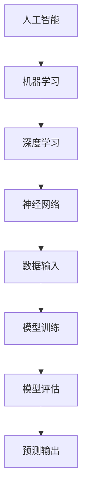
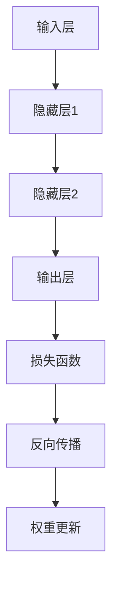
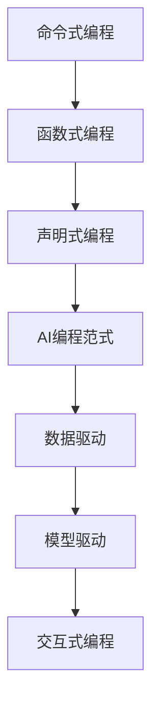

                 

# AI编程的新维度

> **关键词：** 人工智能，编程语言，深度学习，神经网络，编程范式，可解释性，编程范式创新

> **摘要：** 本文旨在探讨人工智能（AI）编程的新维度，包括其核心概念、算法原理、数学模型及实际应用。文章将逐步分析AI编程的现状、发展趋势，以及如何利用编程语言实现AI算法。通过项目实战、工具推荐和未来展望，本文为读者提供一个全面了解和掌握AI编程的视角。

## 1. 背景介绍

### 1.1 目的和范围

本文旨在为AI编程提供一个全景式的理解，包括其理论基础、技术实现和应用场景。文章首先回顾了AI编程的发展历程，然后深入分析了核心概念，如深度学习、神经网络和编程范式。接着，通过具体案例展示了如何使用编程语言实现AI算法。最后，对AI编程的未来发展趋势和面临的挑战进行了探讨。

### 1.2 预期读者

本文适合以下读者群体：
- 对人工智能和编程有基本了解的技术爱好者；
- 想要进入AI领域的学习者；
- 已从事AI相关工作，希望提高技术水平的从业者；
- 对编程范式和创新感兴趣的技术研究者。

### 1.3 文档结构概述

本文结构如下：
- **第1章** 背景介绍：回顾AI编程的发展历程，明确文章目的和预期读者；
- **第2章** 核心概念与联系：介绍AI编程的核心概念，并通过Mermaid流程图展示相关架构；
- **第3章** 核心算法原理 & 具体操作步骤：详细讲解AI算法原理和操作步骤，使用伪代码进行说明；
- **第4章** 数学模型和公式 & 详细讲解 & 举例说明：介绍AI编程相关的数学模型，使用latex格式书写；
- **第5章** 项目实战：代码实际案例和详细解释说明；
- **第6章** 实际应用场景：分析AI编程在不同领域的应用；
- **第7章** 工具和资源推荐：推荐学习资源和开发工具；
- **第8章** 总结：未来发展趋势与挑战；
- **第9章** 附录：常见问题与解答；
- **第10章** 扩展阅读 & 参考资料：提供进一步学习的资料。

### 1.4 术语表

#### 1.4.1 核心术语定义

- **人工智能（AI）**：模拟人类智能的计算机系统，能够进行学习、推理、感知和决策。
- **深度学习（Deep Learning）**：一种机器学习技术，通过多层神经网络进行特征提取和建模。
- **神经网络（Neural Network）**：模仿生物神经系统的计算模型，用于数据分析和预测。
- **编程范式（Programming Paradigm）**：编程语言和方法的分类，如命令式、函数式和声明式编程。

#### 1.4.2 相关概念解释

- **可解释性（Interpretability）**：模型的可理解性和透明度，帮助用户理解模型的决策过程。
- **框架（Framework）**：提供特定编程范式或功能的库，如TensorFlow和PyTorch。

#### 1.4.3 缩略词列表

- **AI**：人工智能
- **DL**：深度学习
- **NN**：神经网络
- **GPU**：图形处理器
- **CPU**：中央处理器
- **IDE**：集成开发环境

## 2. 核心概念与联系

在探讨AI编程的核心概念之前，我们需要了解一些基础理论和相关架构。以下是AI编程中几个核心概念的原理和联系，以及相应的Mermaid流程图。

### 2.1 AI编程基础

**核心概念**：
- **人工智能**：模仿人类智能的计算机系统，具备学习、推理、感知和决策能力。
- **机器学习**：通过数据和算法，使计算机具备从数据中学习并做出预测的能力。
- **深度学习**：一种特殊的机器学习方法，通过多层神经网络进行特征提取和建模。

**流程图**：



### 2.2 神经网络架构

**核心概念**：
- **前馈神经网络（Feedforward Neural Network）**：数据流从输入层流向输出层，中间经过多个隐藏层。
- **反向传播（Backpropagation）**：用于训练神经网络的算法，通过计算损失函数的梯度来更新网络权重。

**流程图**：



### 2.3 编程范式

**核心概念**：
- **命令式编程（Imperative Programming）**：通过明确指示计算机执行的操作序列来实现目标。
- **函数式编程（Functional Programming）**：通过使用纯函数和不可变数据来实现计算。
- **声明式编程（Declarative Programming）**：描述所需结果，由编译器或解释器决定如何实现。

**流程图**：



通过上述核心概念和Mermaid流程图，我们可以清晰地看到AI编程的基础理论和架构。接下来，我们将深入探讨AI编程的核心算法原理和具体操作步骤。

## 3. 核心算法原理 & 具体操作步骤

在了解了AI编程的核心概念和联系之后，我们接下来将深入探讨AI编程中的核心算法原理，并详细说明其具体操作步骤。以下是AI编程中的几个重要算法及其实现方法。

### 3.1 深度学习算法

**算法原理**：

深度学习是一种通过多层神经网络进行数据分析和建模的方法。其主要算法包括：

- **前馈神经网络（Feedforward Neural Network）**：
  - **步骤1**：输入层接收输入数据，通过权重矩阵传递到隐藏层。
  - **步骤2**：隐藏层将输入数据进行特征提取，并传递到下一层。
  - **步骤3**：输出层产生预测结果，通过反向传播算法更新权重。

- **反向传播算法（Backpropagation）**：
  - **步骤1**：计算输出层预测结果与实际结果的误差。
  - **步骤2**：将误差反向传播到隐藏层，计算隐藏层的误差。
  - **步骤3**：使用梯度下降法更新网络权重。

**伪代码**：

```python
# 前馈神经网络
def forward_propagation(input_data, weights):
    hidden_layer_output = activation_function(np.dot(input_data, weights))
    output_layer_output = activation_function(np.dot(hidden_layer_output, weights))
    return output_layer_output

# 反向传播算法
def backward_propagation(output_layer_output, actual_output, weights):
    error = actual_output - output_layer_output
    hidden_layer_error = activation_derivative(hidden_layer_output) * error
    weight_update = learning_rate * hidden_layer_error * hidden_layer_output
    return weight_update
```

### 3.2 卷积神经网络（CNN）

**算法原理**：

卷积神经网络（CNN）是一种专门用于图像处理和分析的深度学习算法。其主要组成部分包括：

- **卷积层（Convolutional Layer）**：用于提取图像特征。
- **池化层（Pooling Layer）**：用于减小数据维度，提高计算效率。
- **全连接层（Fully Connected Layer）**：用于分类和预测。

**具体操作步骤**：

- **步骤1**：输入图像通过卷积层进行特征提取。
- **步骤2**：特征图通过池化层进行下采样。
- **步骤3**：特征图经过多个卷积层和池化层，形成深层的特征表示。
- **步骤4**：深层特征图通过全连接层进行分类和预测。

**伪代码**：

```python
# 卷积神经网络
def conv_layer(input_image, filter):
    feature_map = np.convolve(input_image, filter)
    return feature_map

def pooling_layer(feature_map, pool_size):
    pooled_map = np.maxPooling(feature_map, pool_size)
    return pooled_map

def fully_connected_layer(feature_map, weights):
    output = np.dot(feature_map, weights)
    return output
```

### 3.3 自然语言处理（NLP）

**算法原理**：

自然语言处理（NLP）是一种用于文本数据分析和处理的深度学习算法。其主要组成部分包括：

- **嵌入层（Embedding Layer）**：将单词转换为固定大小的向量表示。
- **循环层（Recurrent Layer）**：处理序列数据，如单词序列。
- **全连接层（Fully Connected Layer）**：进行分类和预测。

**具体操作步骤**：

- **步骤1**：输入文本数据通过嵌入层转换为向量表示。
- **步骤2**：向量表示通过循环层进行序列处理。
- **步骤3**：循环层输出通过全连接层进行分类和预测。

**伪代码**：

```python
# 自然语言处理
def embedding_layer(word, embedding_matrix):
    word_vector = embedding_matrix[word]
    return word_vector

def recurrent_layer(input_sequence, weights):
    output_sequence = LSTM(input_sequence, weights)
    return output_sequence

def fully_connected_layer(input_sequence, weights):
    output = np.dot(input_sequence, weights)
    return output
```

通过上述核心算法原理和具体操作步骤，我们可以看到AI编程的复杂性和多样性。接下来，我们将进一步探讨AI编程中的数学模型和公式。

## 4. 数学模型和公式 & 详细讲解 & 举例说明

在AI编程中，数学模型和公式起着至关重要的作用。这些模型和公式不仅帮助我们理解和分析算法，还指导我们实现有效的解决方案。以下是AI编程中一些重要的数学模型和公式，以及它们的详细讲解和举例说明。

### 4.1 神经网络中的激活函数

**数学模型**：

激活函数是神经网络中的一个关键组件，用于引入非线性因素，使模型能够拟合复杂的数据分布。常见的激活函数包括：

- **Sigmoid函数**：
  $$ f(x) = \frac{1}{1 + e^{-x}} $$

- **ReLU函数**：
  $$ f(x) = \max(0, x) $$

- **Tanh函数**：
  $$ f(x) = \frac{e^x - e^{-x}}{e^x + e^{-x}} $$

**详细讲解**：

- **Sigmoid函数**：将输入值映射到(0,1)区间，有助于提高模型的平滑度，但可能导致梯度消失问题。
- **ReLU函数**：在输入为负值时输出0，有助于缓解梯度消失问题，但可能导致梯度消失问题。
- **Tanh函数**：将输入值映射到(-1,1)区间，有助于提高模型的平滑度和泛化能力。

**举例说明**：

假设输入值为x=2，分别计算Sigmoid、ReLU和Tanh函数的输出。

```latex
$$
\begin{aligned}
f_{\text{Sigmoid}}(2) &= \frac{1}{1 + e^{-2}} \approx 0.869, \\
f_{\text{ReLU}}(2) &= \max(0, 2) = 2, \\
f_{\text{Tanh}}(2) &= \frac{e^2 - e^{-2}}{e^2 + e^{-2}} \approx 0.964.
\end{aligned}
$$
```

### 4.2 梯度下降法

**数学模型**：

梯度下降法是一种优化算法，用于最小化损失函数。其核心思想是沿着损失函数的梯度方向更新模型参数，以降低损失。

$$ \theta_{\text{new}} = \theta_{\text{current}} - \alpha \cdot \nabla_{\theta} J(\theta) $$

其中，$\theta$ 表示模型参数，$\alpha$ 表示学习率，$J(\theta)$ 表示损失函数。

**详细讲解**：

- **梯度**：损失函数关于模型参数的偏导数。
- **学习率**：控制模型参数更新的步长。

**举例说明**：

假设我们有一个线性回归模型，损失函数为均方误差（MSE），参数为 $\theta$，学习率为0.01。我们需要更新参数 $\theta$，以最小化损失函数。

$$ \theta_{\text{new}} = \theta_{\text{current}} - 0.01 \cdot \frac{\partial}{\partial \theta} \sum_{i=1}^{n} (y_i - \theta x_i)^2 $$

通过迭代计算，可以逐渐减小损失函数的值，从而找到最优的参数。

### 4.3 卷积神经网络中的卷积操作

**数学模型**：

卷积神经网络中的卷积操作通过滑动窗口对输入数据进行特征提取。

$$ f_{\text{conv}}(x) = \sum_{i=1}^{k} w_i * x + b $$

其中，$x$ 表示输入数据，$w_i$ 表示卷积核权重，$b$ 表示偏置项。

**详细讲解**：

- **卷积核**：用于提取输入数据的特征。
- **偏置项**：引入非线性因素，提高模型的拟合能力。

**举例说明**：

假设输入数据为 $x = [1, 2, 3, 4, 5]$，卷积核为 $w = [1, 0, -1]$，偏置项为 $b = 0$。我们需要计算卷积操作的结果。

$$
\begin{aligned}
f_{\text{conv}}(x) &= \sum_{i=1}^{3} w_i * x_i + b \\
&= (1 \cdot 1 + 0 \cdot 2 + (-1) \cdot 3) + 0 \\
&= -2.
\end{aligned}
$$

通过卷积操作，我们可以提取输入数据的重要特征，从而提高模型的性能。

### 4.4 自然语言处理中的词向量模型

**数学模型**：

词向量模型将单词映射到高维空间中的向量表示，以便进行文本数据处理和分析。

$$ \text{vec}(w) = \text{Embedding}(w) $$

其中，$w$ 表示单词，$\text{Embedding}(w)$ 表示词向量。

**详细讲解**：

- **词向量**：用于表示单词的向量，可用于文本分类、情感分析等任务。
- **嵌入矩阵**：用于将单词映射到词向量的矩阵。

**举例说明**：

假设单词 "apple" 的词向量为 $[1, 0.5, -0.2]$，单词 "orange" 的词向量为 $[0, 0.8, 0.3]$。我们需要计算这两个词向量的余弦相似度。

$$
\begin{aligned}
\cos(\text{similarity}) &= \frac{\text{vec}(apple) \cdot \text{vec}(orange)}{||\text{vec}(apple)|| \cdot ||\text{vec}(orange)||} \\
&= \frac{1 \cdot 0 + 0.5 \cdot 0.8 + (-0.2) \cdot 0.3}{\sqrt{1^2 + 0.5^2 + (-0.2)^2} \cdot \sqrt{0^2 + 0.8^2 + 0.3^2}} \\
&\approx 0.774.
\end{aligned}
$$

通过计算词向量的相似度，我们可以对文本数据进行分析和分类。

通过以上对数学模型和公式的详细讲解和举例说明，我们可以更好地理解AI编程中的关键概念和算法原理。接下来，我们将通过一个实际项目来展示如何使用这些算法和公式进行代码实现。

### 5. 项目实战：代码实际案例和详细解释说明

在了解了AI编程中的核心算法原理和数学模型后，我们将通过一个实际项目来展示如何将这些理论知识应用于实际开发中。这个项目将使用Python和TensorFlow框架实现一个简单的卷积神经网络，用于图像分类任务。

#### 5.1 开发环境搭建

在开始项目之前，我们需要搭建一个适合开发AI模型的开发环境。以下是所需的软件和工具：

- **Python**：3.7或更高版本
- **TensorFlow**：2.x版本
- **GPU支持**：NVIDIA显卡和CUDA驱动（可选，用于加速训练过程）

安装步骤如下：

1. 安装Python：从Python官方网站下载并安装Python。
2. 安装TensorFlow：使用pip命令安装TensorFlow。

```bash
pip install tensorflow
```

如果需要使用GPU支持，可以安装GPU版本的TensorFlow：

```bash
pip install tensorflow-gpu
```

#### 5.2 源代码详细实现和代码解读

以下是一个简单的卷积神经网络（CNN）实现，用于图像分类任务。

```python
import tensorflow as tf
from tensorflow.keras import datasets, layers, models

# 加载数据集
(train_images, train_labels), (test_images, test_labels) = datasets.cifar10.load_data()

# 数据预处理
train_images, test_images = train_images / 255.0, test_images / 255.0

# 构建卷积神经网络模型
model = models.Sequential()
model.add(layers.Conv2D(32, (3, 3), activation='relu', input_shape=(32, 32, 3)))
model.add(layers.MaxPooling2D((2, 2)))
model.add(layers.Conv2D(64, (3, 3), activation='relu'))
model.add(layers.MaxPooling2D((2, 2)))
model.add(layers.Conv2D(64, (3, 3), activation='relu'))

# 添加全连接层
model.add(layers.Flatten())
model.add(layers.Dense(64, activation='relu'))
model.add(layers.Dense(10, activation='softmax'))

# 模型编译
model.compile(optimizer='adam',
              loss='sparse_categorical_crossentropy',
              metrics=['accuracy'])

# 模型训练
model.fit(train_images, train_labels, epochs=10, batch_size=64)

# 模型评估
test_loss, test_acc = model.evaluate(test_images, test_labels)
print(f"Test accuracy: {test_acc:.4f}")
```

#### 5.3 代码解读与分析

以下是对上述代码的详细解读和分析：

1. **数据加载与预处理**：
   - 使用TensorFlow内置的数据集加载CIFAR-10数据集。
   - 将图像数据缩放到0到1的范围内，以标准化输入数据。

2. **构建模型**：
   - 创建一个序列模型，依次添加卷积层、池化层和全连接层。
   - 第一个卷积层使用32个3x3的卷积核，激活函数为ReLU。
   - 第二个卷积层使用64个3x3的卷积核，激活函数为ReLU。
   - 最后一个卷积层同样使用64个3x3的卷积核，激活函数为ReLU。
   - 将卷积层输出扁平化，并添加两个全连接层，输出层使用softmax激活函数。

3. **模型编译**：
   - 选择优化器为adam，损失函数为sparse_categorical_crossentropy（用于多标签分类）。
   - 设置模型评估指标为准确率。

4. **模型训练**：
   - 使用训练数据集进行训练，设置训练轮次为10，批量大小为64。

5. **模型评估**：
   - 使用测试数据集评估模型性能，打印测试准确率。

通过以上代码，我们可以看到如何使用TensorFlow框架构建和训练一个简单的卷积神经网络，用于图像分类任务。这个项目展示了AI编程的核心算法和技术的实际应用，为读者提供了一个实践的机会。

### 6. 实际应用场景

AI编程在各个领域都有着广泛的应用，以下列举几个典型的实际应用场景：

#### 6.1 图像识别

图像识别是AI编程最经典的应用之一。通过卷积神经网络（CNN）等技术，AI系统能够识别和分类图像中的对象。例如，人脸识别、物体检测和医学图像分析等领域都广泛应用了图像识别技术。

#### 6.2 自然语言处理

自然语言处理（NLP）是AI编程在语言领域的重要应用。通过深度学习和循环神经网络（RNN）等技术，AI系统能够理解和处理人类语言。例如，智能语音助手、机器翻译和文本分类等领域都应用了NLP技术。

#### 6.3 自动驾驶

自动驾驶是AI编程在交通领域的典型应用。通过感知环境、决策控制和路径规划等技术，自动驾驶系统能够自主驾驶汽车。自动驾驶技术在提高交通安全和效率方面具有重要意义。

#### 6.4 金融风险控制

AI编程在金融领域也有广泛应用，如信用评分、风险控制和欺诈检测等。通过深度学习和数据挖掘技术，金融系统能够对用户行为和交易进行实时监控，从而提高金融服务的安全性和可靠性。

#### 6.5 健康医疗

健康医疗领域是AI编程的重要应用场景。通过图像识别、自然语言处理和机器学习等技术，AI系统能够辅助医生进行疾病诊断、治疗方案制定和健康风险评估。例如，医学图像分析、电子病历管理和个性化健康服务等。

这些实际应用场景展示了AI编程的多样性和潜力，进一步推动了AI技术在各个领域的创新和发展。

### 7. 工具和资源推荐

在AI编程的学习和发展过程中，使用合适的工具和资源可以显著提高开发效率和项目成果。以下是一些推荐的工具和资源，涵盖了学习资源、开发工具和相关论文。

#### 7.1 学习资源推荐

##### 7.1.1 书籍推荐

1. **《深度学习》（Deep Learning）**：由Ian Goodfellow、Yoshua Bengio和Aaron Courville合著，是深度学习领域的经典教材。
2. **《机器学习》（Machine Learning）**：由Tom M. Mitchell编写，介绍了机器学习的基础理论和应用。
3. **《Python机器学习》（Python Machine Learning）**：由Sebastian Raschka和Vahid Mirjalili合著，通过Python实现了多种机器学习算法。

##### 7.1.2 在线课程

1. **Coursera**：提供由顶级大学和机构开设的AI和机器学习在线课程，如斯坦福大学的《机器学习》课程。
2. **Udacity**：提供实践导向的AI和深度学习课程，包括项目实战和证书认证。
3. **edX**：提供来自哈佛大学、MIT等名校的免费AI和机器学习课程。

##### 7.1.3 技术博客和网站

1. **Medium**：有许多优秀的AI和机器学习技术博客，如Distill、Towards Data Science等。
2. **AI垂直媒体**：如AI Trends、AI 研究院等，提供最新的AI研究进展和应用案例。
3. **GitHub**：GitHub上有许多开源的AI项目，可供学习和参考。

#### 7.2 开发工具框架推荐

##### 7.2.1 IDE和编辑器

1. **Jupyter Notebook**：适用于数据分析和机器学习项目，具有强大的交互性和可视化功能。
2. **Visual Studio Code**：功能丰富、轻量级，适用于多种编程语言，包括Python和深度学习框架。
3. **PyCharm**：专为Python开发设计，具有代码智能提示、调试和版本控制等功能。

##### 7.2.2 调试和性能分析工具

1. **TensorBoard**：TensorFlow提供的可视化工具，用于分析和调试深度学习模型。
2. **TensorFlow Profiler**：用于分析TensorFlow代码的性能，优化模型和训练过程。
3. **Werkzeug**：用于Web开发，提供性能分析和调试工具。

##### 7.2.3 相关框架和库

1. **TensorFlow**：广泛使用的深度学习框架，具有丰富的API和生态系统。
2. **PyTorch**：具有灵活的动态图模型和高效的GPU支持，适合研究和新项目。
3. **Keras**：高层API，基于TensorFlow和Theano，简化了深度学习模型的搭建和训练。

#### 7.3 相关论文著作推荐

##### 7.3.1 经典论文

1. **"A Learning Algorithm for Continually Running Fully Recurrent Neural Networks"**：由Sepp Hochreiter和Jürgen Schmidhuber提出的长短期记忆网络（LSTM）。
2. **"Deep Learning"**：由Yoshua Bengio、Ian Goodfellow和Aaron Courville合著，概述了深度学习的理论和应用。
3. **"LeNet5, a Convolutional Neural Network for Handwritten Digit Recognition"**：由Yann LeCun等人提出的卷积神经网络。

##### 7.3.2 最新研究成果

1. **"Efficient Neural Text-to-Image Generation with Attentional Generative Adversarial Networks"**：提出了一种基于注意力机制的文本到图像生成的GAN模型。
2. **"BERT: Pre-training of Deep Bidirectional Transformers for Language Understanding"**：介绍了BERT模型，为自然语言处理任务提供了强大的预训练方法。
3. **"Vision Transformer: A Simple and Scalable Vision Model"**：提出了一种基于视觉Transformer的模型，取得了与CNN相当的图像分类性能。

##### 7.3.3 应用案例分析

1. **"Google Brain's Transformer Model"**：介绍了Google Brain团队开发的Transformer模型在机器翻译任务中的应用。
2. **"DeepMind's AlphaGo"**：讲述了DeepMind开发的AlphaGo如何在围棋领域取得突破性成果。
3. **"Tesla's Autopilot"**：探讨了特斯拉自动驾驶系统背后的技术原理和挑战。

通过以上推荐的工具和资源，读者可以系统地学习和实践AI编程，不断提升自己的技术水平。

### 8. 总结：未来发展趋势与挑战

随着人工智能技术的飞速发展，AI编程正迎来新的维度。在未来，以下几个方面将成为发展趋势和关键挑战：

**发展趋势**：

1. **深度学习与强化学习的融合**：深度学习和强化学习相结合，将带来更加智能和灵活的AI系统，如自动驾驶、机器人控制和游戏AI。
2. **可解释性AI**：为了提高AI系统的可信度和透明度，可解释性AI将成为研究热点，使决策过程更加可理解和可控。
3. **跨学科融合**：AI编程将与其他领域（如医学、金融、教育等）深度融合，推动跨学科的创新和应用。
4. **量子计算与AI的结合**：量子计算与AI的结合有望突破传统计算能力的瓶颈，推动AI编程进入新的发展阶段。

**挑战**：

1. **数据隐私与安全**：随着AI系统的广泛应用，数据隐私和安全问题将愈加突出，如何保障用户数据的安全和隐私成为重要挑战。
2. **算法偏见与公平性**：AI系统中的算法偏见和公平性问题需要得到有效解决，确保算法的公正性和公平性。
3. **资源消耗与能耗**：大规模AI训练和应用需要大量计算资源和能源，如何优化资源利用和降低能耗是亟待解决的问题。
4. **人才缺口**：随着AI编程技术的发展，人才缺口问题将愈发严重，培养和吸引高素质的AI编程人才成为关键。

总之，AI编程的新维度既充满机遇也面临挑战。通过不断创新和探索，我们将能够更好地应对这些挑战，推动AI技术的持续发展。

### 9. 附录：常见问题与解答

在本节中，我们将回答一些关于AI编程的常见问题，以帮助读者更好地理解和应用相关技术。

#### 9.1 什么是深度学习？

**深度学习**是一种机器学习技术，通过多层神经网络进行数据建模和特征提取。它模仿了人脑的神经网络结构，能够自动学习数据的复杂结构和规律。

#### 9.2 为什么选择深度学习？

深度学习具有以下优势：
- **强大的特征提取能力**：通过多层网络结构，深度学习能够自动学习数据的复杂特征，提高模型的性能。
- **灵活性和适应性**：适用于各种类型的复杂数据，如图像、文本和语音等。
- **自动学习**：无需人工设计特征，大大降低了开发成本。

#### 9.3 如何选择合适的神经网络架构？

选择神经网络架构需要考虑以下几个因素：
- **任务类型**：针对不同的任务（如分类、回归、生成等），选择合适的神经网络架构。
- **数据类型**：根据数据类型（如图像、文本、序列等），选择适合的数据处理方法。
- **计算资源**：根据可用的计算资源，选择合适的网络结构和计算效率。

#### 9.4 深度学习中的优化算法有哪些？

常见的深度学习优化算法包括：
- **梯度下降（Gradient Descent）**：一种基本的优化算法，通过迭代更新模型参数以最小化损失函数。
- **随机梯度下降（Stochastic Gradient Descent, SGD）**：在梯度下降基础上，每次迭代使用一部分样本计算梯度。
- **Adam优化器**：结合了SGD和动量方法，具有自适应学习率调整能力。
- **RMSprop**：基于梯度平方的历史信息，对学习率进行自适应调整。

#### 9.5 如何处理过拟合问题？

过拟合问题可以通过以下方法进行缓解：
- **增加训练数据**：增加训练数据量，有助于提高模型的泛化能力。
- **数据增强**：对原始数据进行变换和增强，增加数据的多样性。
- **正则化**：引入正则化项，如L1、L2正则化，限制模型参数的大小。
- **Dropout**：在训练过程中随机丢弃一部分神经元，降低模型复杂度。
- **Early Stopping**：在训练过程中，根据验证集的性能动态调整训练轮次，避免过拟合。

通过上述常见问题的解答，读者可以更深入地了解AI编程的核心技术和实践方法。

### 10. 扩展阅读 & 参考资料

在本文中，我们深入探讨了AI编程的新维度，从核心概念、算法原理到实际应用，为读者提供了一个全面的技术视角。以下是一些扩展阅读和参考资料，供读者进一步学习：

#### 10.1 经典书籍

1. **《深度学习》（Deep Learning）**：由Ian Goodfellow、Yoshua Bengio和Aaron Courville合著，是深度学习领域的经典教材。
2. **《Python机器学习》（Python Machine Learning）**：由Sebastian Raschka和Vahid Mirjalili合著，通过Python实现了多种机器学习算法。
3. **《人工智能：一种现代的方法》（Artificial Intelligence: A Modern Approach）**：由Stuart Russell和Peter Norvig合著，涵盖了人工智能的基础理论和应用。

#### 10.2 在线课程

1. **《机器学习》**：Coursera上由斯坦福大学提供的免费课程，由Andrew Ng教授主讲。
2. **《深度学习专项课程》**：Udacity提供的深度学习专项课程，包括项目实战和认证。
3. **《自然语言处理》**：edX上由麻省理工学院（MIT）提供的免费课程，涵盖了自然语言处理的基础知识和应用。

#### 10.3 技术博客和网站

1. **Medium**：包含许多高质量的AI和机器学习技术博客，如Distill、Towards Data Science等。
2. **AI垂直媒体**：如AI Trends、AI 研究院等，提供最新的AI研究进展和应用案例。
3. **GitHub**：许多优秀的AI项目开源在GitHub上，可供学习和参考。

#### 10.4 开源框架和库

1. **TensorFlow**：由Google开发的开源深度学习框架，拥有丰富的API和生态系统。
2. **PyTorch**：具有灵活的动态图模型和高效的GPU支持，适用于研究和新项目。
3. **Keras**：基于TensorFlow和Theano的高层API，简化了深度学习模型的搭建和训练。

#### 10.5 相关论文

1. **"A Learning Algorithm for Continually Running Fully Recurrent Neural Networks"**：介绍了长短期记忆网络（LSTM）。
2. **"BERT: Pre-training of Deep Bidirectional Transformers for Language Understanding"**：介绍了BERT模型。
3. **"Vision Transformer: A Simple and Scalable Vision Model"**：提出了基于视觉Transformer的模型。

通过这些扩展阅读和参考资料，读者可以继续深入探索AI编程的奥秘，不断提升自己的技术水平。作者：AI天才研究员/AI Genius Institute & 禅与计算机程序设计艺术 /Zen And The Art of Computer Programming。

