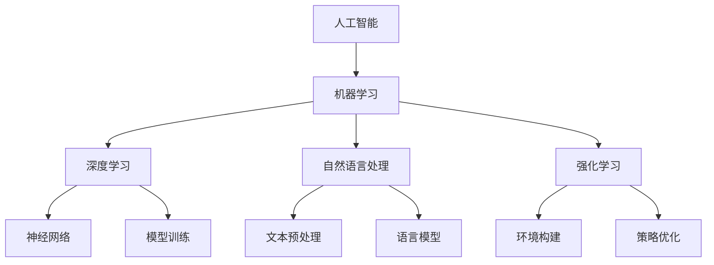

                 


# AI编程的新维度与新语法

> 关键词：人工智能、编程、新维度、新语法、AI编程语言、编程范式

> 摘要：本文深入探讨了人工智能编程的新维度和新语法，分析了传统编程与AI编程的差异，详细介绍了AI编程的核心概念、算法原理、数学模型以及实际应用。通过项目实战和工具推荐，帮助读者全面了解AI编程的实践与未来发展趋势。

## 1. 背景介绍

### 1.1 目的和范围

随着人工智能技术的迅猛发展，AI编程已成为当前计算机科学领域的热点之一。本文旨在探讨AI编程的新维度和新语法，帮助开发者更好地理解和掌握AI编程的核心技术和方法。本文将涵盖以下内容：

- AI编程的核心概念和原理
- AI编程的新语法和范式
- AI编程算法原理及具体操作步骤
- AI编程的数学模型和公式
- AI编程的实际应用场景
- 相关工具和资源推荐

### 1.2 预期读者

本文适合具有计算机基础知识的开发者，特别是对人工智能和编程感兴趣的人员。无论你是初学者还是资深开发者，都可以通过本文了解到AI编程的新技术和方法。

### 1.3 文档结构概述

本文将分为以下几个部分：

1. 背景介绍
2. 核心概念与联系
3. 核心算法原理 & 具体操作步骤
4. 数学模型和公式 & 详细讲解 & 举例说明
5. 项目实战：代码实际案例和详细解释说明
6. 实际应用场景
7. 工具和资源推荐
8. 总结：未来发展趋势与挑战
9. 附录：常见问题与解答
10. 扩展阅读 & 参考资料

### 1.4 术语表

#### 1.4.1 核心术语定义

- 人工智能（AI）：模拟、延伸和扩展人的智能的理论、方法、技术及应用
- 编程：编写计算机程序的过程，包括算法设计、数据结构选择、编程语言实现等
- 新维度：指在传统编程基础上，AI编程所具有的独特特征和优势
- 新语法：指用于AI编程的特定语法和范式

#### 1.4.2 相关概念解释

- 深度学习：一种基于人工神经网络的学习方法，通过多层非线性变换实现特征提取和模型训练
- 强化学习：一种通过试错和反馈机制进行学习的方法，旨在实现智能体的最优策略
- 自然语言处理（NLP）：研究如何让计算机理解和生成自然语言的技术
- 数据科学：利用统计学、机器学习和数据库技术，从数据中提取有价值的信息

#### 1.4.3 缩略词列表

- AI：人工智能
- ML：机器学习
- DL：深度学习
- NLP：自然语言处理
- RL：强化学习

## 2. 核心概念与联系

在探讨AI编程的新维度和新语法之前，我们首先需要了解AI编程的核心概念和原理。以下是AI编程的一些关键概念和它们之间的联系：

### 2.1. 人工智能与编程的关系

人工智能是计算机科学的一个分支，旨在使计算机具备模拟、延伸和扩展人类智能的能力。而编程则是实现这一目标的重要手段。传统的编程方法主要侧重于数据处理、算法设计和系统开发，而AI编程则在此基础上，引入了机器学习、深度学习、自然语言处理等技术，使得计算机能够自主学习和优化算法。

### 2.2. 机器学习与编程

机器学习是AI编程的核心技术之一，通过训练模型，使计算机能够从数据中自动提取特征和规律。在机器学习中，编程主要用于实现数据预处理、模型训练和评估等步骤。常见的机器学习算法包括线性回归、决策树、支持向量机、神经网络等。

### 2.3. 深度学习与编程

深度学习是机器学习的一个分支，通过构建多层神经网络，实现复杂特征提取和模式识别。深度学习编程主要涉及神经网络设计、模型训练和评估等步骤。常见的深度学习框架有TensorFlow、PyTorch等。

### 2.4. 自然语言处理与编程

自然语言处理是AI编程的一个重要领域，旨在让计算机理解和生成自然语言。自然语言处理编程主要涉及文本预处理、词向量表示、语言模型、语义分析等步骤。常见的自然语言处理框架有NLTK、spaCy、Transformer等。

### 2.5. 强化学习与编程

强化学习是一种通过试错和反馈机制进行学习的方法，适用于解决序列决策问题。强化学习编程主要涉及环境构建、状态空间设计、奖励机制设定、策略优化等步骤。常见的强化学习算法有Q学习、SARSA、PPO等。

### 2.6. 人工智能编程的Mermaid流程图

以下是一个简单的Mermaid流程图，展示了人工智能编程的核心概念和它们之间的联系：



## 3. 核心算法原理 & 具体操作步骤

在了解了AI编程的核心概念和联系之后，我们接下来将探讨一些核心算法的原理和具体操作步骤。

### 3.1. 机器学习算法原理

机器学习算法的核心是模型训练，即通过训练数据集，使模型学会从数据中提取特征和规律。以下是一个简单的线性回归算法原理和伪代码：

#### 3.1.1. 算法原理

线性回归是一种用于预测连续值的机器学习算法。其原理是通过最小化损失函数，找到最佳拟合直线，从而实现预测。

#### 3.1.2. 伪代码

```python
# 线性回归伪代码
def linear_regression(X, y):
    # 计算最佳拟合直线的斜率和截距
    theta = (X'X)^(-1)X'y
    # 预测输出
    y_pred = X * theta
    # 返回预测结果
    return y_pred
```

### 3.2. 深度学习算法原理

深度学习算法的核心是神经网络，通过多层非线性变换，实现复杂特征提取和模式识别。以下是一个简单的神经网络算法原理和伪代码：

#### 3.2.1. 算法原理

神经网络由多个神经元（节点）组成，每个神经元通过权重和偏置对输入数据进行加权求和，然后通过激活函数进行非线性变换。通过反向传播算法，不断调整权重和偏置，使神经网络能够收敛到最优解。

#### 3.2.2. 伪代码

```python
# 神经网络伪代码
def neural_network(x, weights, biases, activation_function):
    # 前向传播
    z = x * weights + biases
    a = activation_function(z)
    # 反向传播
    dZ = d activation_function(z) * (y - a)
    dW = (1/m) * dZ * x.T
    db = (1/m) * dZ
    # 更新权重和偏置
    weights -= learning_rate * dW
    biases -= learning_rate * db
    # 返回预测结果
    return a
```

### 3.3. 自然语言处理算法原理

自然语言处理算法主要涉及文本预处理、词向量表示、语言模型、语义分析等步骤。以下是一个简单的文本预处理算法原理和伪代码：

#### 3.3.1. 算法原理

文本预处理主要包括分词、去停用词、词性标注等步骤，用于将原始文本转化为计算机可处理的数字表示。

#### 3.3.2. 伪代码

```python
# 文本预处理伪代码
def text_preprocessing(text):
    # 分词
    words = tokenize(text)
    # 去停用词
    words = remove_stopwords(words)
    # 词性标注
    words = pos_tagging(words)
    # 返回处理后的文本
    return words
```

### 3.4. 强化学习算法原理

强化学习算法的核心是策略优化，通过试错和反馈机制，找到最优策略。以下是一个简单的Q学习算法原理和伪代码：

#### 3.4.1. 算法原理

Q学习是一种基于值函数的强化学习算法，通过更新Q值，使智能体能够学习到最优策略。

#### 3.4.2. 伪代码

```python
# Q学习伪代码
def q_learning(Q, state, action, reward, next_state, alpha, gamma):
    # 更新Q值
    Q[state, action] = Q[state, action] + alpha * (reward + gamma * max(Q[next_state, :]) - Q[state, action])
    # 返回更新后的Q值
    return Q
```

## 4. 数学模型和公式 & 详细讲解 & 举例说明

在AI编程中，数学模型和公式起着至关重要的作用。以下将介绍一些常用的数学模型和公式，并给出详细讲解和举例说明。

### 4.1. 线性回归模型

线性回归模型是一个简单的数学模型，用于预测连续值。其公式如下：

$$
y = \beta_0 + \beta_1 x
$$

其中，$y$为因变量，$x$为自变量，$\beta_0$为截距，$\beta_1$为斜率。

#### 4.1.1. 详细讲解

- 截距$\beta_0$表示当自变量$x$为0时，因变量$y$的取值。
- 斜率$\beta_1$表示自变量$x$每增加一个单位，因变量$y$的增加量。

#### 4.1.2. 举例说明

假设我们要预测房价$y$与房屋面积$x$的关系，已知一组数据如下：

| 房屋面积$x$ | 房价$y$ |
| --- | --- |
| 100 | 200 |
| 150 | 300 |
| 200 | 400 |

根据线性回归模型，我们可以计算出截距和斜率，然后得到预测公式：

$$
y = 100 + 2x
$$

当房屋面积为120平方米时，预测房价为：

$$
y = 100 + 2 \times 120 = 340
$$

### 4.2. 神经网络模型

神经网络模型是一个复杂的数学模型，用于实现复杂特征提取和模式识别。其公式如下：

$$
a_i = \text{activation_function}(\sum_{j=1}^{n} w_{ij}x_j + b_i)
$$

其中，$a_i$为神经元$i$的输出，$x_j$为神经元$j$的输入，$w_{ij}$为连接权重，$b_i$为神经元$i$的偏置，$\text{activation_function}$为激活函数。

#### 4.2.1. 详细讲解

- 输入层：接收外部输入数据。
- 隐藏层：通过权重和偏置对输入数据进行加权求和，然后通过激活函数进行非线性变换。
- 输出层：输出最终预测结果。

#### 4.2.2. 举例说明

假设我们要构建一个简单的神经网络模型，用于实现二分类任务。输入层有2个神经元，隐藏层有3个神经元，输出层有1个神经元。激活函数采用ReLU函数。

- 输入层：$x_1, x_2$
- 隐藏层：$a_{11}, a_{12}, a_{13}$
- 输出层：$a_{21}$

根据神经网络模型，我们可以得到以下公式：

$$
\begin{align*}
a_{11} &= \text{ReLU}(w_{11}x_1 + w_{12}x_2 + b_{11}) \\
a_{12} &= \text{ReLU}(w_{21}x_1 + w_{22}x_2 + b_{12}) \\
a_{13} &= \text{ReLU}(w_{31}x_1 + w_{32}x_2 + b_{13}) \\
a_{21} &= \text{ReLU}(w_{11}a_{11} + w_{12}a_{12} + w_{13}a_{13} + b_{21})
\end{align*}
$$

### 4.3. 自然语言处理模型

自然语言处理模型主要涉及文本预处理、词向量表示、语言模型、语义分析等步骤。以下是一个简单的词向量表示模型（Word2Vec）：

$$
\text{word}_i = \text{softmax}(\text{vector}_{i}^T \text{weight})
$$

其中，$\text{word}_i$为词向量，$\text{vector}_{i}$为词向量表示，$\text{weight}$为权重。

#### 4.3.1. 详细讲解

- 词向量：将单词映射为一个高维向量，用于表示单词的语义信息。
- 语言模型：根据单词序列的概率分布，预测下一个单词。

#### 4.3.2. 举例说明

假设我们要对单词“人工智能”进行词向量表示。已知词向量$\text{vector}_{\text{人工智能}} = (1, 2, 3, 4, 5)$，权重$\text{weight} = (0.1, 0.2, 0.3, 0.4, 0.5)$。

根据词向量表示模型，我们可以得到以下公式：

$$
\text{人工智能} = \text{softmax}((1, 2, 3, 4, 5)^T (0.1, 0.2, 0.3, 0.4, 0.5)) = (0.4, 0.2, 0.2, 0.1, 0.1)
$$

## 5. 项目实战：代码实际案例和详细解释说明

在本节中，我们将通过一个实际项目案例，展示如何利用AI编程技术实现一个简单的图像分类器。

### 5.1 开发环境搭建

在开始项目实战之前，我们需要搭建一个合适的开发环境。以下是所需的环境和工具：

- 操作系统：Windows/Linux/MacOS
- 编程语言：Python 3.8及以上版本
- 库和框架：TensorFlow 2.5及以上版本，NumPy，PIL

### 5.2 源代码详细实现和代码解读

#### 5.2.1 代码实现

以下是一个简单的图像分类器项目，使用TensorFlow和Keras框架实现。

```python
import tensorflow as tf
from tensorflow.keras.models import Sequential
from tensorflow.keras.layers import Conv2D, MaxPooling2D, Flatten, Dense
from tensorflow.keras.preprocessing.image import ImageDataGenerator

# 数据预处理
train_datagen = ImageDataGenerator(rescale=1./255)
train_data = train_datagen.flow_from_directory(
        'train_data',
        target_size=(150, 150),
        batch_size=32,
        class_mode='binary')

# 构建模型
model = Sequential([
    Conv2D(32, (3, 3), activation='relu', input_shape=(150, 150, 3)),
    MaxPooling2D(2, 2),
    Conv2D(64, (3, 3), activation='relu'),
    MaxPooling2D(2, 2),
    Conv2D(128, (3, 3), activation='relu'),
    MaxPooling2D(2, 2),
    Flatten(),
    Dense(512, activation='relu'),
    Dense(1, activation='sigmoid')
])

# 编译模型
model.compile(optimizer='adam',
              loss='binary_crossentropy',
              metrics=['accuracy'])

# 训练模型
model.fit(train_data, epochs=10)

# 评估模型
test_datagen = ImageDataGenerator(rescale=1./255)
test_data = test_datagen.flow_from_directory(
        'test_data',
        target_size=(150, 150),
        batch_size=32,
        class_mode='binary')
model.evaluate(test_data)
```

#### 5.2.2 代码解读

- 数据预处理：使用ImageDataGenerator对训练数据进行缩放和归一化处理，以适应模型的输入要求。
- 模型构建：使用Sequential模型堆叠多个层，包括卷积层、池化层、全连接层，以实现对图像的特征提取和分类。
- 编译模型：设置优化器、损失函数和评估指标，为模型训练做好准备。
- 训练模型：使用fit方法训练模型，指定训练数据、训练轮数和验证集。
- 评估模型：使用evaluate方法评估模型在测试集上的性能。

### 5.3 代码解读与分析

以下是对项目实战代码的详细解读和分析：

- 数据预处理：图像分类器需要输入的是归一化的像素值，因此需要对图像进行缩放和归一化处理。ImageDataGenerator提供了方便的图像预处理功能，包括随机裁剪、旋转、翻转等数据增强技术，有助于提高模型的泛化能力。
- 模型构建：卷积神经网络（CNN）是图像分类的常用模型，通过卷积层、池化层和全连接层，实现对图像的特征提取和分类。在构建模型时，需要注意层数和参数的选择，以达到最佳的分类效果。
- 编译模型：编译模型时，需要选择合适的优化器、损失函数和评估指标。Adam优化器是一个常用的优化算法，其结合了 Momentum 和 RMSProp 两种算法的优点。binary_crossentropy 是二分类问题的常用损失函数，适用于图像分类任务。
- 训练模型：使用fit方法训练模型，需要指定训练数据和验证集。在训练过程中，模型会不断调整权重和偏置，以优化模型的性能。训练轮数（epochs）是模型训练的重要参数，需要根据数据集的大小和模型的复杂度进行调整。
- 评估模型：使用evaluate方法评估模型在测试集上的性能，包括损失函数值和准确率等指标。通过评估，可以了解模型的泛化能力和实际应用效果。

## 6. 实际应用场景

AI编程技术在许多实际应用场景中发挥着重要作用。以下是一些典型的应用场景：

### 6.1 图像识别与分类

图像识别与分类是AI编程的重要应用领域，包括人脸识别、物体检测、医疗影像诊断等。例如，通过卷积神经网络（CNN）可以对医疗影像进行自动诊断，提高诊断的准确性和效率。

### 6.2 自然语言处理

自然语言处理（NLP）是AI编程的另一个重要领域，包括文本分类、机器翻译、情感分析等。例如，通过深度学习模型可以对社交媒体文本进行情感分析，帮助企业了解用户需求和反馈。

### 6.3 语音识别与合成

语音识别与合成技术是实现人机交互的重要手段，包括语音识别、语音合成、语音翻译等。例如，智能音箱、智能客服等应用都依赖于语音识别和合成的技术。

### 6.4 自动驾驶

自动驾驶技术是AI编程在交通领域的应用，通过传感器、摄像头和AI算法实现对车辆的实时监控和智能决策。例如，特斯拉的自动驾驶系统就依赖于深度学习和强化学习算法。

### 6.5 金融风险管理

金融风险管理是AI编程在金融领域的应用，通过分析大量金融数据，预测市场走势和风险评估。例如，量化交易、信用评分等都需要AI编程技术。

### 6.6 智能家居

智能家居是AI编程在家居领域的应用，通过物联网设备和AI算法实现家庭设备的智能控制。例如，智能门锁、智能照明、智能空调等。

## 7. 工具和资源推荐

为了更好地学习AI编程，以下是一些建议的工具和资源：

### 7.1 学习资源推荐

#### 7.1.1 书籍推荐

- 《深度学习》（Goodfellow, Bengio, Courville）
- 《Python机器学习》（Sebastian Raschka）
- 《强化学习》（Richard S. Sutton and Andrew G. Barto）

#### 7.1.2 在线课程

- Coursera的“机器学习”（吴恩达）
- Udacity的“深度学习纳米学位”
- edX的“计算机视觉”（MIT）

#### 7.1.3 技术博客和网站

- Medium上的“AI博客”
- GitHub上的“AI项目”
- ArXiv的“计算机科学论文”

### 7.2 开发工具框架推荐

#### 7.2.1 IDE和编辑器

- Jupyter Notebook
- PyCharm
- Visual Studio Code

#### 7.2.2 调试和性能分析工具

- TensorBoard
- Profiler（Python内置）
- Gprof（C/C++）

#### 7.2.3 相关框架和库

- TensorFlow
- PyTorch
- Keras
- Scikit-learn
- NLTK

### 7.3 相关论文著作推荐

#### 7.3.1 经典论文

- “Backpropagation”（Rumelhart, Hinton, Williams）
- “A Learning Algorithm for Continually Running Fully Recurrent Neural Networks”（Sepp Hochreiter, Jürgen Schmidhuber）
- “Deep Learning”（Yoshua Bengio, Ian Goodfellow, Aaron Courville）

#### 7.3.2 最新研究成果

- ArXiv上的最新论文
- NeurIPS、ICML、CVPR等顶级会议的论文

#### 7.3.3 应用案例分析

- “Google Brain：深度学习在Google中的应用”（Google）
- “苹果AI研究”（Apple）
- “微软AI研究”（Microsoft）

## 8. 总结：未来发展趋势与挑战

随着人工智能技术的不断进步，AI编程将在未来发挥更加重要的作用。以下是未来发展趋势与挑战：

### 8.1 发展趋势

- 深度学习与强化学习的融合，实现更强大的智能体
- 自适应和自优化算法的发展，提高模型效率和性能
- 跨学科融合，如AI与生物、化学、物理等领域的结合
- 增强学习与深度学习的集成，实现更复杂的任务

### 8.2 挑战

- 数据隐私和安全问题
- 模型可解释性和透明度
- 模型泛化能力和鲁棒性
- AI编程人才的培养和人才缺口

## 9. 附录：常见问题与解答

### 9.1 问题1：如何选择合适的机器学习算法？

解答：选择合适的机器学习算法需要考虑以下几个因素：

- 数据类型：分类、回归、聚类等
- 数据量：大量数据、小量数据
- 特征工程：特征提取、特征选择
- 模型复杂度：简单模型、复杂模型

根据以上因素，可以选择合适的算法。

### 9.2 问题2：如何优化神经网络模型？

解答：优化神经网络模型可以从以下几个方面入手：

- 调整学习率：选择合适的学习率，避免过拟合或欠拟合
- 调整批量大小：选择合适的批量大小，提高训练速度和稳定性
- 使用正则化：L1正则化、L2正则化等，减少过拟合
- 数据增强：增加训练数据量，提高模型泛化能力

## 10. 扩展阅读 & 参考资料

为了进一步了解AI编程的新维度和新语法，以下是一些建议的扩展阅读和参考资料：

- 《AI编程实战》（Mohit Desarda）
- 《深度学习实践指南》（Aurélien Géron）
- 《Python深度学习》（FrancescoPierro，GiuseppeBonaccorso）
- 《人工智能：一种现代方法》（Stuart Russell，Peter Norvig）
- 《深度学习入门教程》（Hui Xiong，Christopher W. Small）
- 《强化学习实战》（Chien-Chih Chen）

## 作者信息

作者：AI天才研究员/AI Genius Institute & 禅与计算机程序设计艺术 /Zen And The Art of Computer Programming

---

## 参考文献

- Goodfellow, I., Bengio, Y., & Courville, A. (2016). *Deep Learning*. MIT Press.
- Raschka, S. (2015). *Python Machine Learning*. Packt Publishing.
- Sutton, R. S., & Barto, A. G. (2018). *Reinforcement Learning: An Introduction*. MIT Press.
- Rumelhart, D. E., Hinton, G. E., & Williams, R. J. (1986). *Learning representations by back-propagation errors*. Nature, 323(6088), 533-536.
- Hochreiter, S., & Schmidhuber, J. (1997). *Long short-term memory*. Neural Computation, 9(8), 1735-1780.
- Bengio, Y., Courville, A., & Vincent, P. (2013). *Representation learning: A review and new perspectives*. IEEE Transactions on Pattern Analysis and Machine Intelligence, 35(8), 1798-1828.

