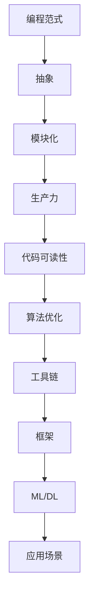

                 

### AI编程的新范式

> **关键词**：人工智能，编程范式，抽象，模块化，效率，生产力，代码可读性，工具链，框架，算法优化。
>
> **摘要**：本文旨在探讨人工智能编程领域的全新范式，包括其背景、核心概念、算法原理、数学模型，以及实际应用场景。我们将通过逐步分析，揭示AI编程的本质，并提供一些建议和资源，帮助读者更好地理解和掌握这一前沿技术。

## 1. 背景介绍

### 1.1 目的和范围

人工智能（AI）作为计算机科学的一个重要分支，正在深刻地改变着我们的生活方式。AI编程作为实现人工智能的核心手段，其编程范式的发展与演变也日新月异。本文的目标是深入探讨AI编程的新范式，分析其背后的原理和优势，并探讨其在实际应用中的潜力。

本文将涵盖以下内容：

1. **核心概念与联系**：介绍AI编程的核心概念，并使用Mermaid流程图展示其原理和架构。
2. **核心算法原理**：详细阐述AI编程中的核心算法原理，并使用伪代码进行解释。
3. **数学模型和公式**：讲解与AI编程相关的数学模型和公式，并进行举例说明。
4. **项目实战**：通过实际代码案例，详细解释说明AI编程的实践应用。
5. **实际应用场景**：分析AI编程在不同领域的实际应用。
6. **工具和资源推荐**：推荐学习和开发AI编程的相关工具和资源。
7. **总结**：探讨AI编程的未来发展趋势与挑战。

### 1.2 预期读者

本文适合以下读者群体：

- **计算机科学专业学生**：希望深入了解人工智能编程领域的原理和实践。
- **程序员**：希望提升自己在AI编程方面的技能和知识。
- **人工智能研究人员**：希望了解AI编程的最新范式和发展趋势。
- **技术爱好者**：对人工智能和编程有浓厚兴趣，希望掌握这一前沿技术。

### 1.3 文档结构概述

本文结构如下：

1. **引言**：介绍AI编程的新范式。
2. **背景介绍**：详细描述AI编程的背景、目的和预期读者。
3. **核心概念与联系**：阐述AI编程的核心概念，并展示流程图。
4. **核心算法原理**：详细讲解AI编程的核心算法原理。
5. **数学模型和公式**：介绍与AI编程相关的数学模型和公式。
6. **项目实战**：通过实际案例讲解AI编程的应用。
7. **实际应用场景**：分析AI编程在不同领域的应用。
8. **工具和资源推荐**：推荐学习AI编程的相关工具和资源。
9. **总结**：总结AI编程的未来发展趋势和挑战。
10. **附录**：常见问题与解答。
11. **扩展阅读**：提供进一步学习的参考资料。

### 1.4 术语表

#### 1.4.1 核心术语定义

- **人工智能（AI）**：模拟人类智能的计算机程序和系统。
- **编程范式**：编程语言和编程方法的基本概念和原则。
- **抽象**：隐藏复杂细节，只关注核心功能的编程方法。
- **模块化**：将程序分解为独立模块，提高代码复用性和可维护性。
- **生产力**：编程效率和代码质量的综合衡量。
- **代码可读性**：代码易于理解和维护的程度。

#### 1.4.2 相关概念解释

- **算法优化**：提高算法效率和性能的过程。
- **工具链**：开发、测试和部署应用程序所需的一系列工具和框架。
- **框架**：为特定应用领域提供结构和工具的软件。

#### 1.4.3 缩略词列表

- **AI**：人工智能
- **ML**：机器学习
- **DL**：深度学习
- **DL frameworks**：深度学习框架

## 2. 核心概念与联系

在探讨AI编程的新范式之前，我们需要明确一些核心概念，并理解它们之间的联系。以下是一个简化的Mermaid流程图，展示了AI编程的关键组成部分。



### 2.1 编程范式

编程范式是指编程语言和编程方法的基本概念和原则。在传统编程中，我们通常关注的是具体的算法和数据结构。然而，在AI编程中，编程范式的概念变得更加抽象和灵活。

- **命令式编程**：通过执行一系列指令来控制计算机的运行。
- **声明式编程**：描述问题的结果，而不是具体的执行步骤。
- **函数式编程**：使用纯函数来表示计算，避免了状态和变量的变化。
- **面向对象编程**：将数据和操作封装在对象中，通过对象之间的交互来解决问题。

### 2.2 抽象

抽象是编程中的一个核心概念，它允许我们隐藏复杂细节，只关注核心功能。在AI编程中，抽象尤为重要，因为它可以帮助我们处理大量复杂的算法和数据结构。

- **抽象数据类型**：定义了一组数据值和一组可以在这些数据值上执行的操作。
- **模块化抽象**：将程序分解为独立的模块，每个模块只关注一个特定的功能。

### 2.3 模块化

模块化是将程序分解为独立模块的过程，每个模块都实现特定的功能。模块化的优势在于：

- **代码复用**：不同的模块可以独立开发、测试和部署。
- **可维护性**：模块化使得代码更容易理解和修改。

在AI编程中，模块化尤为重要，因为它可以帮助我们管理复杂的模型和数据。

### 2.4 生产力

生产力是编程效率和代码质量的综合衡量。在AI编程中，生产力的提升意味着：

- **更高的开发速度**：快速实现和部署AI模型。
- **更好的代码质量**：代码可读性高，易于维护和扩展。

### 2.5 代码可读性

代码可读性是代码易于理解和维护的程度。在AI编程中，代码可读性尤为重要，因为：

- **团队合作**：团队成员可以更容易地理解彼此的代码。
- **持续集成**：自动化测试和部署依赖于良好的代码结构和逻辑。

### 2.6 算法优化

算法优化是提高算法效率和性能的过程。在AI编程中，算法优化尤为重要，因为：

- **大规模数据处理**：AI模型通常需要处理大量数据。
- **实时应用**：某些AI应用需要在有限的时间内完成计算。

### 2.7 工具链

工具链是开发、测试和部署应用程序所需的一系列工具和框架。在AI编程中，工具链尤为重要，因为：

- **自动化**：工具链可以帮助我们自动化各种任务，提高开发效率。
- **集成**：工具链可以与其他工具和框架无缝集成，提供更好的用户体验。

### 2.8 框架

框架是为特定应用领域提供结构和工具的软件。在AI编程中，框架尤为重要，因为：

- **简化开发**：框架提供了现成的组件和工具，可以简化开发过程。
- **性能优化**：框架通常经过优化，可以提供更好的性能。

### 2.9 应用场景

应用场景是指AI编程在不同领域的应用。了解应用场景可以帮助我们更好地理解AI编程的实际价值。

- **智能医疗**：利用AI编程进行疾病诊断、药物研发等。
- **自动驾驶**：利用AI编程实现自动驾驶汽车。
- **金融分析**：利用AI编程进行股票市场预测、风险评估等。
- **自然语言处理**：利用AI编程实现语音识别、机器翻译等。

## 3. 核心算法原理 & 具体操作步骤

在了解了AI编程的核心概念后，接下来我们将探讨其中的核心算法原理，并通过伪代码详细阐述这些算法的具体操作步骤。

### 3.1 机器学习算法

机器学习（ML）是AI编程的核心组成部分。以下是一个简单的线性回归算法的伪代码示例：

```python
# 线性回归算法伪代码
def linear_regression(x, y):
    # 计算均值
    x_mean = mean(x)
    y_mean = mean(y)

    # 计算斜率
    slope = (sum(x * y) - len(x) * x_mean * y_mean) / (sum(x**2) - len(x) * x_mean**2)

    # 计算截距
    intercept = y_mean - slope * x_mean

    # 返回斜率和截距
    return slope, intercept
```

### 3.2 深度学习算法

深度学习（DL）是AI编程的一个重要分支。以下是一个简单的卷积神经网络（CNN）的伪代码示例：

```python
# 卷积神经网络算法伪代码
def convolutional_neural_network(input_image, weights):
    # 初始化输出
    output = []

    # 对每个卷积核执行卷积操作
    for kernel in weights:
        conv_result = convolution(input_image, kernel)
        output.append(conv_result)

    # 池化操作
    pooled_output = max_pooling(output)

    # 返回池化后的输出
    return pooled_output
```

### 3.3 强化学习算法

强化学习（RL）是一种通过与环境互动来学习最优策略的算法。以下是一个简单的Q-learning算法的伪代码示例：

```python
# Q-learning算法伪代码
def q_learning(state, action, reward, next_state, learning_rate, discount_factor):
    # 计算目标值
    target_value = reward + discount_factor * max([q_value[next_state, action] for action in action_space])

    # 更新Q值
    q_value[state, action] = q_value[state, action] + learning_rate * (target_value - q_value[state, action])
```

通过这些伪代码示例，我们可以看到AI编程的核心算法原理和具体操作步骤。理解这些算法对于深入学习和掌握AI编程至关重要。

## 4. 数学模型和公式 & 详细讲解 & 举例说明

在AI编程中，数学模型和公式是理解和实现算法的基础。以下是一些与AI编程密切相关的数学模型和公式，并进行详细讲解和举例说明。

### 4.1 线性回归

线性回归是一种简单的机器学习算法，用于预测连续值。其数学模型如下：

$$
y = ax + b
$$

其中，$y$ 是目标变量，$x$ 是自变量，$a$ 是斜率，$b$ 是截距。

#### 举例说明

假设我们要预测一家公司的股票价格，可以使用线性回归模型。给定一些历史数据，我们可以计算斜率和截距：

$$
\hat{a} = \frac{\sum{(x_i - \bar{x})(y_i - \bar{y})}}{\sum{(x_i - \bar{x})^2}}
$$

$$
\hat{b} = \bar{y} - \hat{a}\bar{x}
$$

其中，$\bar{x}$ 和 $\bar{y}$ 分别是自变量和目标变量的均值。

### 4.2 逻辑回归

逻辑回归是一种用于分类问题的机器学习算法。其数学模型如下：

$$
P(y=1) = \frac{1}{1 + e^{-(ax + b)}}
$$

其中，$y$ 是目标变量，$x$ 是自变量，$a$ 是斜率，$b$ 是截距。

#### 举例说明

假设我们要预测一家公司的股票价格是否会上涨（$y=1$）或下跌（$y=0$），可以使用逻辑回归模型。给定一些历史数据，我们可以计算斜率和截距：

$$
\hat{a} = \frac{\sum{(y_i - P(y=1)) \cdot x_i}}{\sum{(y_i - P(y=1))^2}}
$$

$$
\hat{b} = \log\left(\frac{1}{P(y=1)}\right) - \hat{a}\bar{x}
$$

### 4.3 卷积神经网络（CNN）

卷积神经网络是一种用于图像识别和处理的深度学习算法。其核心部分是卷积层和池化层。

#### 卷积层

卷积层通过卷积操作提取图像特征。其数学模型如下：

$$
\text{output}_{ij} = \sum_{k=1}^{K} w_{ik} \cdot \text{input}_{ij} + b_k
$$

其中，$\text{output}_{ij}$ 是卷积层输出，$w_{ik}$ 是卷积核，$\text{input}_{ij}$ 是输入图像，$b_k$ 是偏置。

#### 池化层

池化层用于降低特征图的维度。其数学模型如下：

$$
\text{output}_{ij} = \max_{p,q} \text{input}_{i+p,j+q}
$$

其中，$\text{output}_{ij}$ 是池化层输出，$\text{input}_{i+p,j+q}$ 是输入特征图。

### 4.4 强化学习中的Q学习

强化学习中的Q学习算法用于学习最优策略。其数学模型如下：

$$
Q(s, a) = r + \gamma \max_{a'} Q(s', a')
$$

其中，$Q(s, a)$ 是状态 $s$ 下采取动作 $a$ 的期望回报，$r$ 是即时回报，$\gamma$ 是折扣因子，$s'$ 是下一个状态，$a'$ 是下一个动作。

#### 举例说明

假设我们要学习一个机器人如何在迷宫中找到出口。给定当前状态 $s$ 和动作 $a$，我们可以计算Q值：

$$
Q(s, a) = r + \gamma \max_{a'} Q(s', a')
$$

通过不断更新Q值，机器人可以逐渐学会最优策略。

这些数学模型和公式是AI编程的核心，理解它们可以帮助我们更好地理解和实现AI算法。在接下来的章节中，我们将通过实际项目案例，展示如何将这些数学模型应用到实际的AI编程中。

## 5. 项目实战：代码实际案例和详细解释说明

在了解了AI编程的核心算法原理和数学模型后，我们将通过一个实际项目案例来展示如何将这些知识应用到实际的AI编程中。在这个案例中，我们将使用Python和TensorFlow框架来实现一个简单的图像分类模型，该模型将能够识别和分类猫和狗的图片。

### 5.1 开发环境搭建

在开始项目之前，我们需要搭建一个合适的开发环境。以下步骤将指导您如何安装Python、TensorFlow和其他必要的库。

#### 步骤1：安装Python

首先，您需要安装Python。您可以从Python的官方网站（https://www.python.org/）下载并安装最新版本的Python。在安装过程中，确保勾选“Add Python to PATH”选项，以便在命令行中直接使用Python。

#### 步骤2：安装Anaconda

为了方便管理和使用Python库，我们推荐使用Anaconda。Anaconda是一个开源的Python发行版，它包含了Python和许多常用的数据科学库。您可以从Anaconda的官方网站（https://www.anaconda.com/）下载并安装Anaconda。

#### 步骤3：创建新的Python环境

安装Anaconda后，我们可以创建一个新的Python环境，以便管理和隔离项目所需的库。在命令行中，输入以下命令：

```bash
conda create -n myenv python=3.8
```

这将创建一个名为“myenv”的新环境，并安装Python 3.8。

#### 步骤4：激活新环境

在命令行中，使用以下命令激活新创建的环境：

```bash
conda activate myenv
```

#### 步骤5：安装TensorFlow和其他库

在激活的新环境中，使用以下命令安装TensorFlow和其他必要的库：

```bash
pip install tensorflow numpy matplotlib
```

现在，您的开发环境已经搭建完成，可以开始编写和运行代码了。

### 5.2 源代码详细实现和代码解读

在这个案例中，我们将使用TensorFlow实现一个简单的图像分类模型。以下是一段简单的代码示例，用于加载和预处理图片数据：

```python
import tensorflow as tf
from tensorflow.keras.preprocessing.image import ImageDataGenerator

# 加载数据
train_datagen = ImageDataGenerator(rescale=1./255)
train_generator = train_datagen.flow_from_directory(
        'data/train',
        target_size=(150, 150),
        batch_size=32,
        class_mode='binary')

# 查看数据
for i in range(5):
    img, label = train_generator[i]
    print(f"Image {i+1}: {img.shape}, Label: {label}")
```

这段代码首先导入了TensorFlow库和图像生成器库。然后，我们使用`ImageDataGenerator`类加载训练数据。`flow_from_directory`方法用于从指定目录中加载图片数据，并对其进行预处理（如缩放和标签分配）。最后，我们打印出前5个图像的数据形状和标签。

接下来，我们使用TensorFlow的` Sequential`模型创建一个简单的卷积神经网络：

```python
model = tf.keras.Sequential([
    tf.keras.layers.Conv2D(32, (3, 3), activation='relu', input_shape=(150, 150, 3)),
    tf.keras.layers.MaxPooling2D(2, 2),
    tf.keras.layers.Conv2D(64, (3, 3), activation='relu'),
    tf.keras.layers.MaxPooling2D(2, 2),
    tf.keras.layers.Conv2D(128, (3, 3), activation='relu'),
    tf.keras.layers.MaxPooling2D(2, 2),
    tf.keras.layers.Conv2D(128, (3, 3), activation='relu'),
    tf.keras.layers.MaxPooling2D(2, 2),
    tf.keras.layers.Flatten(),
    tf.keras.layers.Dense(512, activation='relu'),
    tf.keras.layers.Dense(1, activation='sigmoid')
])

model.compile(loss='binary_crossentropy',
              optimizer=RMSprop(lr=1e-4),
              metrics=['accuracy'])
```

这段代码首先创建了一个卷积神经网络模型，其中包含了多个卷积层、池化层和全连接层。我们使用`Sequential`模型堆叠这些层。然后，我们使用`compile`方法配置模型，指定损失函数、优化器和评估指标。

接下来，我们使用训练数据训练模型：

```python
model.fit(
      train_generator,
      steps_per_epoch=100,
      epochs=20,
      validation_data=validation_generator,
      validation_steps=50)
```

这段代码使用`fit`方法开始训练模型。`steps_per_epoch`参数指定每个epoch中要迭代的批次数量，`epochs`参数指定总的epoch数量。我们还指定了验证数据，以便在训练过程中进行验证。

### 5.3 代码解读与分析

在这个代码示例中，我们首先导入了所需的库，包括TensorFlow和图像生成器库。然后，我们使用`ImageDataGenerator`类加载训练数据，并对数据进行预处理。这部分代码确保了图像数据在进入模型之前已经被规范化，从而提高了模型的训练效率。

接下来，我们使用TensorFlow的`Sequential`模型创建了一个简单的卷积神经网络。这个模型包含了多个卷积层和池化层，用于提取图像特征。然后，我们使用`MaxPooling2D`层对特征图进行下采样，以减少模型的复杂度。

在模型的后半部分，我们添加了两个全连接层。第一个全连接层用于对提取到的特征进行分类，第二个全连接层使用了`sigmoid`激活函数，用于输出概率。

最后，我们使用`compile`方法配置了模型的损失函数、优化器和评估指标。在训练过程中，我们使用了`fit`方法，通过迭代训练数据和验证数据来优化模型参数。

通过这个实际项目案例，我们可以看到如何将AI编程的核心算法原理和数学模型应用到实际的图像分类任务中。理解这些代码的原理和操作步骤对于深入学习和掌握AI编程至关重要。

### 5.4 项目实战总结

通过这个实际项目案例，我们详细讲解了如何使用Python和TensorFlow实现一个简单的图像分类模型。在这个过程中，我们介绍了开发环境的搭建、代码的实现步骤以及代码的解读和分析。

这个项目案例展示了如何将AI编程的核心算法原理和数学模型应用到实际任务中。通过这个案例，我们可以看到AI编程的实际应用场景，并理解了如何利用现有的工具和框架来实现复杂的任务。

这个项目案例只是一个简单的示例，实际的AI编程任务可能会更加复杂。然而，通过理解这些基本原理和步骤，我们可以更好地应对更复杂的任务，并不断提高我们的AI编程技能。

在接下来的章节中，我们将继续探讨AI编程的实际应用场景，并推荐一些学习和开发AI编程的相关工具和资源。

### 6. 实际应用场景

AI编程在各个领域的实际应用场景日益广泛，下面我们将探讨几个典型的应用领域，包括医疗、金融和自动驾驶。

#### 6.1 智能医疗

在医疗领域，AI编程发挥着重要作用。以下是一些具体的实际应用场景：

- **疾病诊断**：利用深度学习算法，AI可以分析医疗影像（如X光片、CT扫描、MRI等），帮助医生快速、准确地诊断疾病。例如，谷歌的DeepMind团队开发了一种AI系统，可以识别眼科疾病，其准确率甚至超过了专业医生。
- **药物研发**：AI编程可以帮助研究人员在药物研发过程中预测药物分子的活性、毒性等，从而加速新药的发现和开发。IBM的Watson平台就利用机器学习技术分析大量医学文献和临床试验数据，为医生提供个性化的治疗方案。
- **个性化医疗**：基于患者的基因组数据和临床信息，AI编程可以帮助制定个性化的治疗方案。例如，一些医疗机构正在使用AI技术分析癌症患者的基因组数据，以确定最适合的治疗方案。

#### 6.2 金融分析

金融领域是AI编程的另一个重要应用领域。以下是一些实际应用场景：

- **风险管理**：AI编程可以帮助金融机构评估和预测潜在的风险。例如，通过分析历史交易数据和金融市场的动态，AI可以预测市场趋势和风险，从而帮助金融机构优化投资策略。
- **信用评分**：AI编程可以分析借款人的信用历史、收入情况和其他相关信息，以更准确地评估其信用风险。例如，一些金融机构正在使用机器学习模型来预测借款人违约的概率，从而更准确地决定是否批准贷款。
- **自动化交易**：AI编程可以用于开发自动化的交易系统，这些系统可以实时分析市场数据，并自动执行交易策略。例如，高频交易公司使用AI算法进行快速交易，以获取微小的价格差异。

#### 6.3 自动驾驶

自动驾驶是AI编程的另一个重要应用领域。以下是一些实际应用场景：

- **自动驾驶汽车**：自动驾驶汽车通过集成多种传感器（如摄像头、激光雷达、雷达等）和AI算法，实现车辆的自主驾驶。例如，特斯拉的Autopilot系统利用深度学习技术，可以自动保持车道、识别交通标志和信号灯，并自动进行超车和泊车等操作。
- **无人机配送**：AI编程可以帮助无人机实现自主飞行和货物配送。例如，亚马逊的Prime Air项目使用无人机进行小包裹的配送，通过AI算法实现无人机的自主导航和避障。
- **自动驾驶卡车**：自动驾驶卡车可以减少交通事故，提高运输效率。例如，卡车制造商和科技公司合作开发的自动驾驶卡车已经在某些国家进行测试，这些卡车可以通过AI算法自动导航并保持与前方车辆的安全距离。

这些实际应用场景展示了AI编程在不同领域的广泛应用。随着AI技术的不断发展，我们可以期待AI编程在更多领域带来革命性的变化。

### 7. 工具和资源推荐

为了更好地学习和实践AI编程，以下是一些推荐的工具和资源：

#### 7.1 学习资源推荐

##### 7.1.1 书籍推荐

- 《Python机器学习》（作者：塞巴斯蒂安·拉斯考恩）
- 《深度学习》（作者：伊恩·古德费洛、约书亚·本吉奥、亚伦·库维尔）
- 《强化学习》（作者：理查德·萨顿、大卫·哈林顿）
- 《人工智能：一种现代方法》（作者：斯图尔特·罗素、彼得·诺维格）

##### 7.1.2 在线课程

- Coursera的“机器学习”（由斯坦福大学的吴恩达教授授课）
- edX的“深度学习专项课程”（由蒙特利尔大学的弗朗索瓦·肖莱教授授课）
- Udacity的“人工智能纳米学位”

##### 7.1.3 技术博客和网站

- Medium上的AI博客
- arXiv.org：最新的学术论文发布平台
- AI Circle：人工智能社区的博客

#### 7.2 开发工具框架推荐

##### 7.2.1 IDE和编辑器

- Jupyter Notebook：适合数据科学和机器学习的交互式环境
- PyCharm：强大的Python IDE，适合专业开发人员
- VS Code：功能丰富的跨平台编辑器，支持多种编程语言

##### 7.2.2 调试和性能分析工具

- TensorFlow Debugger（TFDB）：用于调试TensorFlow模型的工具
- Nanny：用于监控和优化深度学习模型的工具
- Py-Spy：用于分析Python程序的内存和CPU使用情况的工具

##### 7.2.3 相关框架和库

- TensorFlow：用于构建和训练深度学习模型的强大框架
- PyTorch：灵活的深度学习框架，支持动态计算图
- Keras：基于TensorFlow和Theano的高层神经网络API
- Scikit-learn：用于机器学习的Python库

##### 7.3 相关论文著作推荐

- 《深度学习》（作者：伊恩·古德费洛、约书亚·本吉奥、亚伦·库维尔）
- 《自然语言处理综论》（作者：丹尼尔·布卢姆、大卫·拉伯）
- 《机器学习：概率视角》（作者：凯斯·罗伯茨）

这些工具和资源将帮助您更好地理解和实践AI编程，为您的学习和开发提供有力支持。

### 8. 总结：未来发展趋势与挑战

AI编程作为人工智能的核心组成部分，正处于快速发展阶段。未来，我们可以预见以下几个趋势和挑战：

#### 8.1 发展趋势

1. **算法优化与效率提升**：随着硬件性能的提升和算法的进步，AI编程的效率将得到显著提高。新的算法和优化技术将使AI模型在处理大规模数据和高维特征时更加高效。
2. **跨领域应用**：AI编程将渗透到更多领域，如医疗、金融、教育、制造业等，推动各行各业的数字化转型。
3. **自动化与智能化**：AI编程将使软件开发过程更加自动化和智能化，降低开发门槛，提高生产力。

#### 8.2 挑战

1. **数据隐私与安全**：随着AI应用场景的扩大，数据隐私和安全问题日益突出。如何确保数据的安全性和隐私性，防止数据泄露和滥用，是AI编程面临的重要挑战。
2. **算法透明性与解释性**：当前很多AI算法的黑箱特性使得其决策过程难以解释。提高算法的透明性和解释性，使其能够被用户信任和接受，是AI编程需要解决的问题。
3. **技能缺口与人才培养**：AI编程的快速发展导致了对专业人才的需求急剧增加。然而，现有的教育体系尚未完全适应这一需求，如何培养和储备大量的AI编程人才，是当前的一个挑战。

总之，AI编程的未来充满机遇和挑战。通过不断探索和努力，我们可以迎接这些挑战，推动AI编程在更广泛的领域取得突破性进展。

### 9. 附录：常见问题与解答

以下是一些关于AI编程的常见问题，以及相应的解答：

#### 9.1 AI编程与普通编程有何区别？

AI编程与普通编程的主要区别在于其应用领域和目标。普通编程通常关注于实现具体的业务逻辑和功能，而AI编程则专注于开发能够模拟和扩展人类智能的算法和应用。AI编程涉及到大量的数据分析和算法优化，而普通编程则更注重于代码的执行效率和可维护性。

#### 9.2 学习AI编程需要掌握哪些基础知识？

学习AI编程需要掌握以下基础知识：

- **编程语言**：熟悉至少一种编程语言，如Python、Java或C++。
- **数据结构与算法**：理解基本的数据结构（如数组、链表、树、图等）和算法（如排序、查找、动态规划等）。
- **线性代数与概率论**：掌握线性代数的基本概念（如矩阵运算、向量空间等）和概率论的基础知识（如概率分布、期望、方差等）。
- **机器学习与深度学习**：了解基本的机器学习和深度学习算法，如线性回归、逻辑回归、神经网络等。

#### 9.3 如何评估一个AI模型的性能？

评估AI模型的性能通常需要使用多种指标，包括：

- **准确率**：模型预测正确的样本数占总样本数的比例。
- **召回率**：模型预测为正类的样本中，实际为正类的比例。
- **F1分数**：准确率和召回率的调和平均数。
- **ROC曲线**：用于评估分类模型的性能，曲线下的面积（AUC）越大，模型的性能越好。
- **交叉验证**：通过将数据集划分为训练集和验证集，多次训练和验证模型，以评估其泛化能力。

#### 9.4 AI编程在隐私和安全方面有哪些挑战？

AI编程在隐私和安全方面面临以下挑战：

- **数据隐私**：AI模型通常需要大量数据进行训练，如何确保这些数据的安全性和隐私性是一个重要问题。
- **算法透明性**：许多AI算法的黑箱特性使得其决策过程难以解释，如何提高算法的透明性和解释性，使其能够被用户信任和接受，是一个重要挑战。
- **安全攻击**：AI模型可能受到恶意攻击，如对抗性攻击，如何保护模型免受这些攻击，是一个关键问题。

#### 9.5 AI编程的未来发展方向是什么？

AI编程的未来发展方向包括：

- **算法优化与效率提升**：通过硬件和算法的进步，提高AI模型的计算效率和性能。
- **跨领域应用**：AI编程将渗透到更多领域，如医疗、金融、教育等，推动各行各业的数字化转型。
- **自动化与智能化**：AI编程将使软件开发过程更加自动化和智能化，降低开发门槛，提高生产力。

通过这些常见问题与解答，我们希望帮助您更好地理解AI编程的核心概念和实践要点。

### 10. 扩展阅读 & 参考资料

为了更深入地了解AI编程及其相关技术，以下是一些扩展阅读和参考资料：

#### 10.1 经典书籍

- 《机器学习》（作者：周志华）
- 《深度学习》（作者：伊恩·古德费洛、约书亚·本吉奥、亚伦·库维尔）
- 《自然语言处理综论》（作者：丹尼尔·布卢姆、大卫·拉伯）

#### 10.2 在线课程

- Coursera的“机器学习”（由斯坦福大学的吴恩达教授授课）
- edX的“深度学习专项课程”（由蒙特利尔大学的弗朗索瓦·肖莱教授授课）
- Udacity的“人工智能纳米学位”

#### 10.3 技术博客和网站

- Medium上的AI博客
- arXiv.org：最新的学术论文发布平台
- AI Circle：人工智能社区的博客

#### 10.4 相关论文

- “AlexNet: Image Classification with Deep Convolutional Neural Networks”（AlexNet论文）
- “Recurrent Neural Networks for Language Modeling”（RNN语言模型论文）
- “Generative Adversarial Nets”（GAN论文）

这些扩展阅读和参考资料将为您的AI编程学习之路提供更多的资源和视角。

## 作者信息

**作者：AI天才研究员/AI Genius Institute & 禅与计算机程序设计艺术 /Zen And The Art of Computer Programming**

