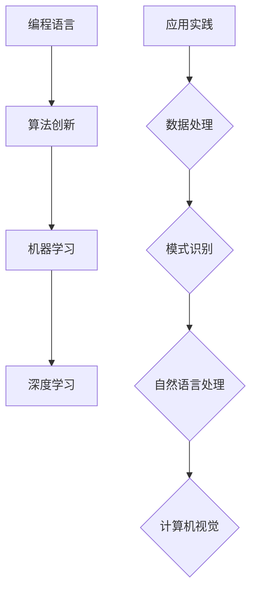
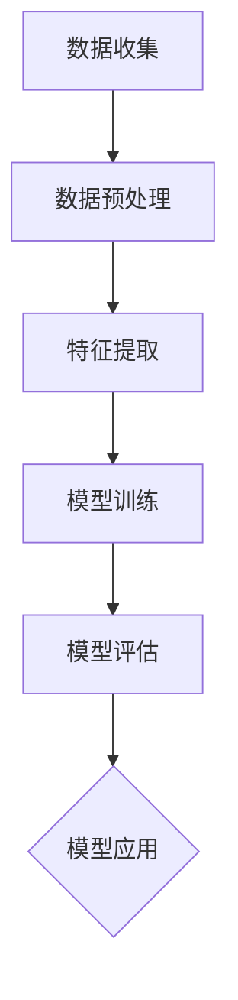
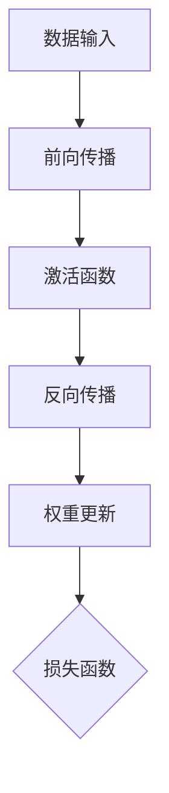
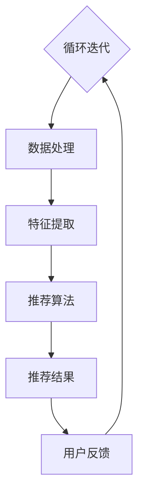
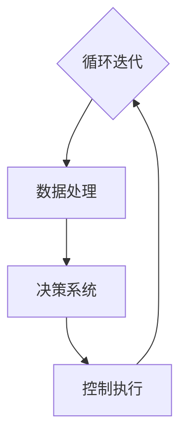
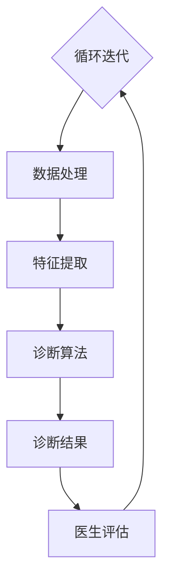

                 

# AI编程的新视界与新领域

> 关键词：人工智能编程、新领域、编程语言、算法创新、机器学习、深度学习、应用实践

> 摘要：本文将探讨人工智能编程领域的新视界与新领域，包括编程语言的发展、算法创新、机器学习和深度学习等核心概念，以及它们在现实世界中的应用。通过逐步分析这些主题，我们将揭示AI编程的未来趋势和挑战，并提供实用的资源和工具，帮助读者深入了解这一激动人心的领域。

## 1. 背景介绍

### 1.1 目的和范围

本文旨在介绍人工智能编程领域的新视界与新领域，帮助读者了解这一快速发展的技术领域。我们将讨论编程语言的发展、算法创新、机器学习和深度学习等核心概念，并探讨它们在各个行业中的应用。本文的目标是提供全面且易于理解的知识，帮助读者掌握AI编程的基本原理和实际应用。

### 1.2 预期读者

本文适合对人工智能编程感兴趣的读者，包括但不限于程序员、软件工程师、数据科学家、技术爱好者以及对新兴技术持开放态度的人士。无论您是新手还是有一定基础的读者，本文都将为您提供一个深入理解AI编程的路径。

### 1.3 文档结构概述

本文分为以下几个部分：

1. **背景介绍**：介绍本文的目的、预期读者和文档结构。
2. **核心概念与联系**：介绍AI编程的核心概念、原理和架构。
3. **核心算法原理 & 具体操作步骤**：详细阐述核心算法的原理和操作步骤。
4. **数学模型和公式 & 详细讲解 & 举例说明**：讲解数学模型和公式，并提供实例。
5. **项目实战：代码实际案例和详细解释说明**：通过实际代码案例进行解释。
6. **实际应用场景**：讨论AI编程在不同领域中的应用。
7. **工具和资源推荐**：推荐学习资源、开发工具和框架。
8. **总结：未来发展趋势与挑战**：总结未来趋势和挑战。
9. **附录：常见问题与解答**：提供常见问题及解答。
10. **扩展阅读 & 参考资料**：推荐相关文献和资源。

### 1.4 术语表

#### 1.4.1 核心术语定义

- **人工智能编程**：使用编程语言和工具来实现人工智能算法和系统的过程。
- **机器学习**：通过数据和算法自动改进性能的能力，通常涉及数据的处理、分析和建模。
- **深度学习**：一种机器学习技术，使用神经网络进行层次化的特征学习和抽象。
- **神经网络**：一种计算模型，由一系列相互连接的节点（或神经元）组成，用于处理和传递信息。
- **算法**：解决问题的步骤或规则，用于执行特定任务。

#### 1.4.2 相关概念解释

- **编程语言**：用于编写计算机程序的语法和规则。
- **算法创新**：通过改进现有算法或开发新算法来解决特定问题。
- **应用实践**：将AI编程技术应用于实际问题解决的案例。

#### 1.4.3 缩略词列表

- **AI**：人工智能
- **ML**：机器学习
- **DL**：深度学习
- **IDE**：集成开发环境
- **GPU**：图形处理单元

## 2. 核心概念与联系

在探讨AI编程的新领域之前，我们需要了解一些核心概念和它们之间的联系。以下是一个简化的Mermaid流程图，展示了这些概念的基本架构：



### 2.1 编程语言

编程语言是AI编程的基础。它们提供了语法和规则，使我们能够编写计算机程序。从传统的C/C++、Java、Python，到新兴的Rust、Go和Kotlin，不同的编程语言适用于不同的场景和需求。编程语言的不断发展和创新，使得开发AI应用程序变得更加高效和灵活。

### 2.2 算法创新

算法创新是AI编程的核心。通过改进现有算法或开发新算法，我们可以解决更复杂的问题。例如，遗传算法、粒子群优化算法和深度强化学习算法等都是近年来在AI领域取得重大突破的算法。

### 2.3 机器学习

机器学习是AI编程的重要组成部分。它通过从数据中学习规律和模式，使计算机具备自主学习和改进的能力。常见的机器学习算法包括决策树、支持向量机、朴素贝叶斯分类器和神经网络等。

### 2.4 深度学习

深度学习是机器学习的一个子领域，它通过多层神经网络进行层次化的特征学习和抽象。深度学习在图像识别、语音识别、自然语言处理和计算机视觉等领域取得了显著成果。

### 2.5 应用实践

应用实践是将AI编程技术应用于实际问题的过程。从智能推荐系统、自动驾驶汽车到医疗诊断和金融风控，AI编程技术在各个行业都发挥着重要作用。应用实践不仅推动了技术的创新，也为社会带来了巨大的价值。

通过以上核心概念的联系，我们可以看到AI编程领域的多样性和广阔前景。在接下来的章节中，我们将进一步探讨这些概念的具体实现和应用。

## 3. 核心算法原理 & 具体操作步骤

### 3.1 机器学习算法原理

机器学习算法的核心原理是利用数据学习规律和模式。以下是一个简化的机器学习算法的基本流程：



#### 3.1.1 数据收集

数据收集是机器学习的基础。我们需要从各种来源获取大量数据，包括结构化数据、半结构化数据和未结构化数据。数据收集的挑战包括数据质量、数据隐私和数据完整性。

#### 3.1.2 数据预处理

数据预处理是确保数据质量和适合建模过程的重要步骤。这包括数据清洗、数据整合和数据规范化。常见的数据预处理方法有缺失值处理、异常值检测和特征工程。

#### 3.1.3 特征提取

特征提取是将原始数据转换为适合机器学习算法的表示形式。这通常涉及降维、特征选择和特征变换。特征提取的目的是减少数据维度、提高模型性能和可解释性。

#### 3.1.4 模型训练

模型训练是通过调整模型参数，使模型能够在训练数据上拟合。常见的机器学习算法包括线性回归、逻辑回归、支持向量机和神经网络。训练过程中需要选择合适的模型参数和优化方法。

#### 3.1.5 模型评估

模型评估是评估模型性能和可靠性的过程。常用的评估指标包括准确率、召回率、F1分数和交叉验证。通过模型评估，我们可以确定模型的泛化能力，并调整模型参数以提高性能。

#### 3.1.6 模型应用

模型应用是将训练好的模型应用于新数据的预测和决策过程。这可以用于各种应用场景，如分类、回归和聚类。模型应用的关键是确保模型在实际环境中具有良好的性能和可靠性。

### 3.2 深度学习算法原理

深度学习算法是机器学习的一个重要分支，它通过多层神经网络进行层次化的特征学习和抽象。以下是一个简化的深度学习算法的基本流程：



#### 3.2.1 数据输入

数据输入是将原始数据输入到神经网络中。这通常涉及数据预处理和特征提取，以确保数据适合神经网络的输入格式。

#### 3.2.2 前向传播

前向传播是将输入数据通过神经网络的各个层，计算输出结果。在每一层，神经元将输入数据通过权重和激活函数进行处理，以生成输出。

#### 3.2.3 激活函数

激活函数是神经网络中的一个关键组件，它用于引入非线性变换。常见的激活函数包括ReLU、Sigmoid和Tanh。

#### 3.2.4 反向传播

反向传播是深度学习算法中的核心步骤，它通过计算损失函数的梯度，更新神经网络的权重和偏置。反向传播的目的是优化神经网络的参数，以减少损失函数。

#### 3.2.5 权重更新

权重更新是基于损失函数的梯度进行的。通过梯度下降等优化算法，我们可以调整神经网络的权重和偏置，以减少损失函数。

#### 3.2.6 损失函数

损失函数用于衡量模型输出和真实标签之间的差距。常见的损失函数包括均方误差（MSE）、交叉熵损失和Hinge损失。

通过以上核心算法原理的讲解，我们可以更好地理解机器学习和深度学习的操作步骤和实现方法。在接下来的章节中，我们将通过实际代码案例进一步探讨这些算法的应用。

## 4. 数学模型和公式 & 详细讲解 & 举例说明

在人工智能编程中，数学模型和公式起着至关重要的作用。以下我们将介绍一些常用的数学模型和公式，并提供详细的讲解和示例。

### 4.1 线性回归模型

线性回归是一种简单的统计模型，用于预测一个连续因变量和一个或多个自变量之间的关系。其公式如下：

$$
y = \beta_0 + \beta_1x_1 + \beta_2x_2 + ... + \beta_nx_n + \epsilon
$$

其中，$y$ 是因变量，$x_1, x_2, ..., x_n$ 是自变量，$\beta_0, \beta_1, \beta_2, ..., \beta_n$ 是模型参数，$\epsilon$ 是误差项。

#### 示例：

假设我们有一个线性回归模型，用于预测房价。模型公式为：

$$
房价 = 10 + 0.5 \times 面积 + 0.1 \times 房龄
$$

给定一个新房屋的面积为100平方米，房龄为5年，我们可以使用模型预测其房价：

$$
房价 = 10 + 0.5 \times 100 + 0.1 \times 5 = 65
$$

### 4.2 逻辑回归模型

逻辑回归是一种用于分类问题的统计模型，其公式如下：

$$
\ln\left(\frac{P(y=1)}{1-P(y=1)}\right) = \beta_0 + \beta_1x_1 + \beta_2x_2 + ... + \beta_nx_n
$$

其中，$y$ 是二分类变量，$P(y=1)$ 是类别1的概率，$\beta_0, \beta_1, \beta_2, ..., \beta_n$ 是模型参数。

#### 示例：

假设我们有一个逻辑回归模型，用于判断一个客户是否是优质客户。模型公式为：

$$
\ln\left(\frac{P(优质客户)}{1-P(优质客户)}\right) = 0.5 \times 收入 + 0.3 \times 年龄
$$

给定一个新客户的收入为50000元，年龄为30岁，我们可以使用模型计算其是优质客户的概率：

$$
\ln\left(\frac{P(优质客户)}{1-P(优质客户)}\right) = 0.5 \times 50000 + 0.3 \times 30 = 15300
$$

$$
P(优质客户) = \frac{e^{15300}}{1 + e^{15300}} \approx 0.99
$$

### 4.3 神经网络模型

神经网络是一种基于非线性变换的多层计算模型。以下是一个简化的神经网络模型：

$$
\begin{aligned}
    z &= \sigma(\beta_0 + \beta_1x_1 + \beta_2x_2 + ... + \beta_nx_n) \\
    a &= \sigma(z) \\
    y &= a \odot b
\end{aligned}
$$

其中，$z$ 是中间层输出，$a$ 是激活函数输出，$y$ 是最终输出，$\sigma$ 是激活函数，$\odot$ 是元素乘法。

#### 示例：

假设我们有一个简单的神经网络，用于实现逻辑回归。神经网络的结构如下：

$$
\begin{aligned}
    z &= \sigma(\beta_0 + \beta_1x_1 + \beta_2x_2) \\
    a &= \sigma(z) \\
    y &= a \odot b
\end{aligned}
$$

给定一个新输入 $x_1 = 1, x_2 = 0$，我们可以计算神经网络输出：

$$
\begin{aligned}
    z &= \sigma(\beta_0 + \beta_1 \cdot 1 + \beta_2 \cdot 0) \\
    a &= \sigma(z) \\
    y &= a \odot b \\
    &= \begin{cases}
          1 & \text{如果} \ a > 0 \\
          0 & \text{否则}
      \end{cases}
\end{aligned}
$$

通过以上数学模型和公式的讲解，我们可以更好地理解AI编程中的核心数学原理。在实际应用中，这些模型和公式将帮助我们构建和优化各种AI算法和系统。

## 5. 项目实战：代码实际案例和详细解释说明

### 5.1 开发环境搭建

为了演示AI编程的实际应用，我们将使用Python和TensorFlow来实现一个简单的神经网络，用于分类问题。以下是开发环境的搭建步骤：

1. **安装Python**：确保您的系统已安装Python 3.6或更高版本。可以从[Python官网](https://www.python.org/)下载安装包。
2. **安装TensorFlow**：通过命令行运行以下命令安装TensorFlow：
   ```bash
   pip install tensorflow
   ```
3. **创建虚拟环境**（可选）：为了隔离项目依赖，建议创建一个虚拟环境。可以使用以下命令创建和激活虚拟环境：
   ```bash
   python -m venv myenv
   source myenv/bin/activate  # 在Windows中使用 myenv\Scripts\activate
   ```

### 5.2 源代码详细实现和代码解读

以下是一个简单的神经网络实现，用于对数字进行分类：

```python
import tensorflow as tf
from tensorflow.keras import layers

# 定义神经网络模型
model = tf.keras.Sequential([
    layers.Dense(128, activation='relu', input_shape=(784,)),  # 输入层，128个神经元，ReLU激活函数
    layers.Dropout(0.2),  # Dropout层，减小过拟合
    layers.Dense(10, activation='softmax')  # 输出层，10个神经元，softmax激活函数
])

# 编译模型
model.compile(optimizer='adam',
              loss='sparse_categorical_crossentropy',
              metrics=['accuracy'])

# 加载数据
mnist = tf.keras.datasets.mnist
(x_train, y_train), (x_test, y_test) = mnist.load_data()
x_train, x_test = x_train / 255.0, x_test / 255.0

# 数据预处理
x_train = x_train.reshape((-1, 784))
x_test = x_test.reshape((-1, 784))

# 训练模型
model.fit(x_train, y_train, epochs=5)

# 评估模型
test_loss, test_acc = model.evaluate(x_test, y_test, verbose=2)
print('\nTest accuracy:', test_acc)
```

#### 5.2.1 代码解读

- **模型定义**：使用 `tf.keras.Sequential` 定义了一个简单的神经网络，包含一个输入层、一个Dropout层和一个输出层。
  - 输入层有128个神经元，使用ReLU激活函数。
  - Dropout层用于防止过拟合，丢弃一定比例的神经元。
  - 输出层有10个神经元，使用softmax激活函数，用于实现多分类。

- **模型编译**：使用 `compile` 方法设置优化器、损失函数和评估指标。
  - 优化器使用Adam算法。
  - 损失函数使用sparse categorical crossentropy，适用于多分类问题。
  - 评估指标为accuracy，表示模型在测试集上的准确率。

- **数据加载**：使用 `tf.keras.datasets.mnist` 加载MNIST数据集。
  - 数据集包含70,000个训练样本和10,000个测试样本。

- **数据预处理**：将图像数据缩放到0-1之间，并调整形状以匹配模型输入。
  - 使用 `reshape` 方法将每个图像从28x28的二维数组转换为784的一维数组。

- **模型训练**：使用 `fit` 方法训练模型，设置训练轮数（epochs）为5。

- **模型评估**：使用 `evaluate` 方法评估模型在测试集上的性能，输出测试准确率。

### 5.3 代码解读与分析

通过以上代码实现，我们可以看到如何使用TensorFlow实现一个简单的神经网络进行图像分类。以下是代码的详细分析：

- **模型定义**：神经网络的设计是关键步骤，它决定了模型的性能。在本例中，输入层有128个神经元，这可以捕获图像的初步特征。ReLU激活函数用于增加模型的非线性，使模型能够更好地拟合数据。

- **数据预处理**：图像数据的预处理是机器学习中的常见步骤，确保数据在模型训练过程中具有一致的格式和范围。

- **模型训练**：通过5个训练轮次（epochs），模型在训练数据上不断调整权重和偏置，以最小化损失函数。这是一个迭代过程，每次迭代都使模型更接近最优解。

- **模型评估**：在测试集上的评估是验证模型性能的重要步骤。通过计算测试准确率，我们可以了解模型在未见数据上的泛化能力。

通过以上实战案例，我们可以看到如何使用Python和TensorFlow实现一个简单的神经网络，并进行实际的数据分类任务。这为我们提供了一个实用的起点，进一步探索AI编程的深度和广度。

## 6. 实际应用场景

AI编程技术在各个领域有着广泛的应用，以下我们将探讨一些典型的实际应用场景。

### 6.1 智能推荐系统

智能推荐系统是AI编程的一个重要应用领域。通过分析用户的兴趣和行为，推荐系统可以提供个性化的商品、新闻、音乐和视频推荐。以下是一个简化的推荐系统架构：



#### 工作原理：

1. **数据处理**：收集用户历史行为数据，如浏览记录、购买记录和评价。
2. **特征提取**：将原始数据转换为特征向量，用于表示用户和商品。
3. **推荐算法**：使用协同过滤、矩阵分解、深度学习等方法生成推荐列表。
4. **推荐结果**：将推荐结果展示给用户。
5. **用户反馈**：收集用户对推荐结果的反馈，用于优化推荐算法。

### 6.2 自动驾驶汽车

自动驾驶汽车是AI编程在交通运输领域的典型应用。自动驾驶系统通过传感器、摄像头和GPS数据实时感知环境，并使用AI算法进行决策和控制。以下是一个简化的自动驾驶系统架构：



#### 工作原理：

1. **感知系统**：收集环境数据，如路况、交通标志和行人。
2. **数据处理**：对感知数据进行预处理和特征提取。
3. **决策系统**：使用深度学习、强化学习等方法进行环境理解和决策。
4. **控制执行**：根据决策生成控制信号，控制汽车的运动。

### 6.3 医疗诊断

AI编程在医疗诊断领域有着广泛的应用。通过分析医疗图像、病历数据和基因数据，AI算法可以辅助医生进行疾病诊断和治疗建议。以下是一个简化的医疗诊断系统架构：



#### 工作原理：

1. **医疗数据**：收集各种医疗数据，如CT扫描、MRI和基因序列。
2. **数据处理**：对医疗数据进行预处理和特征提取。
3. **诊断算法**：使用深度学习、决策树等方法进行疾病诊断。
4. **诊断结果**：生成诊断结果，供医生参考。
5. **医生评估**：医生根据诊断结果进行评估，反馈用于优化算法。

通过以上实际应用场景的介绍，我们可以看到AI编程技术在各个领域的广泛应用和潜在价值。随着技术的不断进步，AI编程将在未来继续发挥重要作用，为社会带来更多创新和变革。

## 7. 工具和资源推荐

为了更好地学习和应用AI编程技术，以下我们推荐一些有用的工具、资源和学习途径。

### 7.1 学习资源推荐

#### 7.1.1 书籍推荐

1. **《深度学习》（Deep Learning）**：Goodfellow、Bengio和Courville著，这是一本经典的深度学习教材，适合有一定基础的学习者。
2. **《Python机器学习》（Python Machine Learning）**：Sebastian Raschka和Vahid Mirjalili著，详细介绍了机器学习的Python实现。
3. **《自然语言处理综论》（Speech and Language Processing）**：Dan Jurafsky和James H. Martin著，全面介绍了自然语言处理的基础知识。

#### 7.1.2 在线课程

1. **Coursera**：提供了丰富的AI和机器学习课程，如“机器学习”、“深度学习”等。
2. **Udacity**：提供了实践导向的AI和机器学习课程，包括“深度学习工程师纳米学位”。
3. **edX**：提供了由顶级大学提供的免费在线课程，如“MIT 6.034 计算机科学和人工智能导论”。

#### 7.1.3 技术博客和网站

1. **TensorFlow官网**：提供了丰富的文档、教程和示例代码。
2. **Medium**：有很多优秀的AI和机器学习博客，如“Towards Data Science”、“AI”等。
3. **GitHub**：有很多开源的AI项目和代码库，供学习者和开发者参考。

### 7.2 开发工具框架推荐

#### 7.2.1 IDE和编辑器

1. **PyCharm**：一款功能强大的Python IDE，适用于开发机器学习和深度学习项目。
2. **Jupyter Notebook**：一款流行的交互式编程工具，适合数据分析和机器学习实验。
3. **Visual Studio Code**：一款轻量级但功能丰富的编辑器，适用于多种编程语言。

#### 7.2.2 调试和性能分析工具

1. **TensorBoard**：TensorFlow提供的一个可视化工具，用于分析和调试深度学习模型。
2. **NVIDIA Nsight**：一款专为GPU编程设计的调试和分析工具。
3. **Py-Spy**：一个用于Python性能分析的内存和CPU分析工具。

#### 7.2.3 相关框架和库

1. **TensorFlow**：Google开发的开源机器学习和深度学习框架。
2. **PyTorch**：Facebook开发的开源深度学习框架，具有灵活的动态计算图。
3. **Scikit-Learn**：一个用于数据挖掘和数据分析的开源库，提供了丰富的机器学习算法。

### 7.3 相关论文著作推荐

#### 7.3.1 经典论文

1. **“A Fast Learning Algorithm for Deep Belief Nets”**：Hinton等，介绍了深度信念网络。
2. **“Backpropagation”**：Rumelhart等，介绍了反向传播算法。
3. **“Learning to Represent Similarity to Support Anomaly Detection”**：Kingma等，介绍了基于深度学习的异常检测方法。

#### 7.3.2 最新研究成果

1. **“GShard: A Simple and Efficient Meta-Learning Framework for jointly optimizing Neural Architecture Search”**：Zhu等，介绍了GShard元学习框架。
2. **“Collaborative Learning with Non-IID Data: Implications for data privacy and use”**：Konečný等，讨论了非独立数据集的协同学习。
3. **“Deep Learning for Latent Variable Models”**：Mohamed和Rasmussen，介绍了深度学习在潜在变量模型中的应用。

#### 7.3.3 应用案例分析

1. **“A Survey on Applications of Deep Learning in Computer Vision”**：Guo等，总结了深度学习在计算机视觉领域的应用。
2. **“A Survey on Deep Learning Based Recommender Systems”**：Hu等，综述了基于深度学习的推荐系统。
3. **“Deep Learning in Financial Risk Management”**：Zhou等，讨论了深度学习在金融风险控制中的应用。

通过以上工具和资源的推荐，我们希望为读者提供全面的AI编程学习和发展路径。无论您是新手还是经验丰富的开发者，这些资源和工具都将帮助您在AI编程领域取得更大的成就。

## 8. 总结：未来发展趋势与挑战

随着AI编程技术的不断发展，我们正迈向一个充满机遇和挑战的新时代。以下我们将总结未来发展趋势和面临的挑战。

### 8.1 发展趋势

1. **算法创新**：随着计算能力和数据量的不断增长，算法创新将继续是AI编程领域的重要方向。新的算法和优化方法将进一步提升模型的性能和效率。
2. **多模态学习**：多模态学习是未来的一大趋势，通过整合文本、图像、声音和视频等多种数据类型，实现更全面和准确的数据理解和分析。
3. **边缘计算**：边缘计算将AI编程从云端延伸到设备端，实现实时、高效和低延迟的AI应用。这对于自动驾驶、智能城市和智能家居等领域具有重要意义。
4. **可解释性AI**：随着AI技术在各个领域的应用，可解释性AI将成为一个重要研究方向。开发可解释的AI模型将提高透明度和信任度，减少误用和偏见。

### 8.2 挑战

1. **数据隐私和安全**：随着数据量的增长，数据隐私和安全问题日益突出。如何在保护用户隐私的同时，充分利用数据的价值，是一个重大挑战。
2. **模型可靠性**：确保AI模型在复杂和动态环境中的可靠性和鲁棒性是一个重要问题。需要开发更多的方法和工具来评估和提升模型的可靠性。
3. **人才短缺**：AI编程领域的发展离不开专业人才的培养。然而，目前该领域的人才供应难以满足需求，培养具备跨学科知识和技能的AI专家将是长期挑战。
4. **监管和伦理**：随着AI技术在各个领域的广泛应用，制定合理的监管政策和伦理规范至关重要。这需要政府、企业和研究机构的共同努力。

### 8.3 展望

展望未来，AI编程将在推动科技进步和社会发展方面发挥越来越重要的作用。随着技术的不断进步，我们将看到更多创新的应用场景和解决方案。同时，我们也需面对各种挑战，不断探索和改进，以实现AI编程技术的可持续发展和广泛应用。

## 9. 附录：常见问题与解答

### 9.1 问题1：AI编程和机器学习的区别是什么？

**解答**：AI编程是一个更广泛的概念，包括实现人工智能系统的过程，而机器学习是AI编程的一个子领域，主要关注通过数据和算法使计算机具备自主学习和改进的能力。简言之，机器学习是AI编程中的一个核心组成部分。

### 9.2 问题2：如何选择合适的编程语言进行AI编程？

**解答**：选择编程语言取决于具体需求和项目特点。Python因其丰富的库和工具而广受欢迎，适用于数据科学和机器学习。对于高性能计算和深度学习，C++和CUDA可能更合适。对于需要快速原型开发的场景，可以使用Python、Rust或Go。选择时需要考虑性能、库支持、开发速度和团队熟悉度。

### 9.3 问题3：如何确保AI模型的可靠性和可解释性？

**解答**：确保AI模型的可靠性和可解释性需要多方面的努力。首先，在数据收集和处理阶段，确保数据质量和一致性。其次，使用可解释性算法和工具，如LIME或SHAP，可以增强模型的透明度。此外，进行严格的模型评估和验证，使用交叉验证等方法检测模型的泛化能力。

### 9.4 问题4：AI编程对计算机硬件有什么要求？

**解答**：AI编程，特别是深度学习，对计算机硬件有较高要求。建议使用配备高性能CPU和GPU的计算机。GPU在并行计算方面具有显著优势，可以大幅提升训练速度。此外，对于大规模数据处理和模型训练，需要足够的内存和存储空间。

## 10. 扩展阅读 & 参考资料

以下是一些扩展阅读和参考资料，帮助读者进一步了解AI编程的相关内容：

### 10.1 经典论文

1. **“A Fast Learning Algorithm for Deep Belief Nets”**：Hinton, G. E., Osindero, S., & Teh, Y. W. (2006).
2. **“Backpropagation”**：Rumelhart, D. E., Hinton, G. E., & Williams, R. J. (1986).
3. **“Deep Learning”**：Goodfellow, I., Bengio, Y., & Courville, A. (2016).

### 10.2 书籍

1. **《深度学习》**：Goodfellow, I., Bengio, Y., & Courville, A. (2016).
2. **《Python机器学习》**：Raschka, S., & Mirjalili, V. (2015).
3. **《自然语言处理综论》**：Jurafsky, D., & Martin, J. H. (2009).

### 10.3 技术博客和网站

1. **TensorFlow官网**：[https://www.tensorflow.org/](https://www.tensorflow.org/)
2. **Medium**：[https://towardsdatascience.com/](https://towardsdatascience.com/)
3. **GitHub**：[https://github.com/](https://github.com/)

### 10.4 在线课程

1. **Coursera**：[https://www.coursera.org/](https://www.coursera.org/)
2. **Udacity**：[https://www.udacity.com/](https://www.udacity.com/)
3. **edX**：[https://www.edx.org/](https://www.edx.org/)

通过以上扩展阅读和参考资料，读者可以更深入地了解AI编程的理论和实践，为在相关领域的发展提供更多支持。

