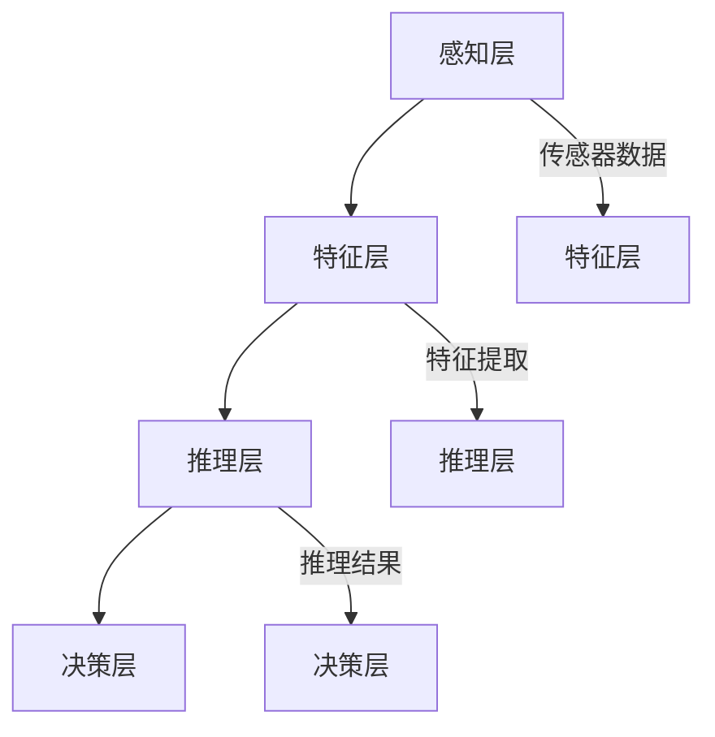
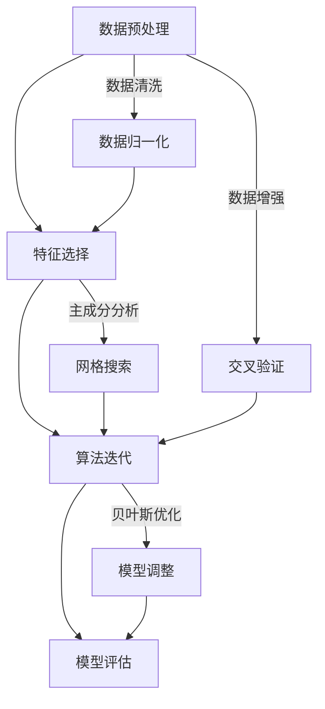

                 

# 提高环境模型的精度与广度

## 关键词
- 环境模型
- 精度提升
- 广度扩展
- 机器学习
- 深度学习
- 数据预处理
- 算法优化

## 摘要

本文将深入探讨如何通过改进算法、增强数据预处理和扩展模型架构，来提高环境模型的精度与广度。我们将首先介绍环境模型的基本概念，然后逐步分析提高模型性能的各个方面，包括数据质量、特征选择、算法迭代和模型评估等。此外，我们还将分享一个实际项目案例，详细解读如何将这些理论应用到实践中，最终实现环境模型的显著提升。本文旨在为开发者提供系统化的指导，帮助他们在构建高效、准确的环境模型方面取得突破。

## 1. 背景介绍

### 1.1 目的和范围

环境模型是人工智能领域的一个重要研究方向，尤其在智能城市、自动驾驶和智能监控等应用中扮演着关键角色。本文旨在探讨如何通过一系列技术手段提升环境模型的精度和广度，使其能够更好地适应复杂多变的环境。本文将涵盖以下内容：

1. 环境模型的基本概念及其在人工智能中的应用。
2. 环境模型精度与广度提升的核心挑战。
3. 提高模型精度的数据预处理方法。
4. 扩展模型广度的算法优化策略。
5. 实际项目案例解析：如何应用提升环境模型性能的技术手段。
6. 工具和资源的推荐，以便读者能够进一步学习和实践。

### 1.2 预期读者

本文适合对人工智能和机器学习有一定了解的读者，包括但不限于：

1. 数据科学家和机器学习工程师。
2. 程序员和技术经理。
3. 对环境模型和人工智能应用感兴趣的学者和学生。

### 1.3 文档结构概述

本文结构如下：

1. 引言
2. 环境模型的基本概念
3. 提高环境模型精度的技术手段
4. 扩展环境模型广度的策略
5. 实际项目案例解析
6. 工具和资源推荐
7. 总结与未来发展趋势
8. 附录：常见问题与解答
9. 扩展阅读 & 参考资料

### 1.4 术语表

#### 1.4.1 核心术语定义

- **环境模型**：用于描述现实世界环境状态的数学模型，可以是静态的或动态的。
- **精度**：模型预测结果与真实值的接近程度。
- **广度**：模型适用于不同环境条件的能力。
- **数据预处理**：在模型训练之前对数据进行清洗、转换和归一化的过程。
- **特征选择**：从大量特征中挑选出对模型性能有显著贡献的特征。
- **算法优化**：通过改进算法设计或参数调优来提升模型性能。

#### 1.4.2 相关概念解释

- **机器学习**：一种通过数据训练模型，使模型能够从数据中学习和提取规律的方法。
- **深度学习**：一种基于多层神经网络的结构，能够自动提取数据中的复杂特征。
- **回归分析**：一种常见的机器学习方法，用于预测连续值的输出。
- **分类分析**：一种机器学习方法，用于将数据分为不同类别。

#### 1.4.3 缩略词列表

- **AI**：人工智能（Artificial Intelligence）
- **ML**：机器学习（Machine Learning）
- **DL**：深度学习（Deep Learning）
- **NLP**：自然语言处理（Natural Language Processing）
- **CV**：计算机视觉（Computer Vision）
- **IDE**：集成开发环境（Integrated Development Environment）

## 2. 核心概念与联系

### 2.1 环境模型的基本概念

环境模型是人工智能系统中用于表示和模拟环境状态的重要工具。它通常是一个数学模型，通过捕捉环境中的关键特征和关系，实现对现实世界的抽象和表达。环境模型在多个领域有着广泛的应用，如自动驾驶、智能城市和智能监控等。

一个典型的环境模型包括以下几个关键组成部分：

1. **感知层**：负责收集环境数据，如图像、声音和传感器数据。
2. **特征层**：从感知层获取的数据中提取出具有代表性和显著性的特征。
3. **推理层**：利用提取的特征进行推理，生成对环境的理解和预测。
4. **决策层**：根据推理结果做出决策，如控制自动驾驶车辆的行动路径。

### 2.2 核心概念之间的联系

环境模型的精度和广度是其性能的两个关键指标。精度描述了模型预测结果的准确性，而广度则反映了模型对不同环境和场景的适应能力。

为了提高环境模型的精度和广度，需要关注以下几个方面：

1. **数据质量**：高质量的数据是构建准确模型的基础。因此，数据预处理和清洗是提高模型性能的重要步骤。
2. **特征选择**：从大量特征中挑选出对模型性能有显著贡献的特征，可以有效提高模型的精度和广度。
3. **算法优化**：通过改进算法设计和参数调优，可以提升模型的性能。
4. **模型架构**：设计合理的模型架构，能够更好地捕捉环境中的复杂关系和特征。

### 2.3 Mermaid 流程图

以下是一个用于表示环境模型核心概念的 Mermaid 流程图：



### 2.4 图形化表示


## 3. 核心算法原理 & 具体操作步骤

### 3.1 数据预处理

数据预处理是环境模型构建中的关键步骤，其目标是提高数据质量，为模型训练提供高质量的数据。以下是一些常用的数据预处理方法：

1. **数据清洗**：去除噪声、缺失值和异常值，确保数据的一致性和准确性。
2. **数据归一化**：将不同特征的范围缩放到同一尺度，以避免某些特征对模型的影响过大。
3. **数据增强**：通过旋转、缩放、裁剪等方式增加数据的多样性，提高模型的泛化能力。

### 3.2 特征选择

特征选择是提高模型精度和广度的重要手段。以下是一些常用的特征选择方法：

1. **相关性分析**：通过计算特征之间的相关性，选择相关性较高的特征。
2. **主成分分析（PCA）**：通过将原始特征投影到新的正交坐标系中，减少数据的维度，同时保留主要信息。
3. **基于模型的特征选择**：利用模型评估特征的重要性，选择对模型性能有显著贡献的特征。

### 3.3 算法迭代

算法迭代是提升模型性能的关键步骤。以下是一些常用的算法迭代方法：

1. **交叉验证**：通过将数据分为训练集和验证集，不断调整模型参数，提高模型在验证集上的性能。
2. **网格搜索**：通过遍历参数空间，找到最优参数组合，提高模型性能。
3. **贝叶斯优化**：利用贝叶斯优化算法，自动搜索最优参数组合。

### 3.4 伪代码

以下是一个用于描述环境模型构建的核心算法的伪代码：

```python
# 数据预处理
def preprocess_data(data):
    data = clean_data(data)
    data = normalize_data(data)
    data = augment_data(data)
    return data

# 特征选择
def select_features(data, target):
    features =相关性分析(data, target)
    features = PCA(data, features)
    features = model_based_selection(data, target)
    return features

# 算法迭代
def iterative_algorithm(data, target):
    data = preprocess_data(data)
    features = select_features(data, target)
    for epoch in range(num_epochs):
        model = train_model(features, target)
        evaluate_model(model, validation_data)
        adjust_model_parameters(model)
    return model

# 主函数
def main():
    data = load_data()
    target = load_target()
    model = iterative_algorithm(data, target)
    predict_result = predict(model, new_data)
    print(predict_result)
```

### 3.5 详细讲解

#### 数据预处理

数据预处理是环境模型构建的基础步骤。通过数据清洗、归一化和增强，可以显著提高数据的质量，为后续的模型训练提供更好的数据基础。

1. **数据清洗**：数据清洗是去除数据中的噪声和异常值的过程。常用的方法包括去除缺失值、处理异常值和去除重复值等。例如，可以使用 `dropna()` 函数去除缺失值，使用 `mean()` 函数填充异常值，使用 `duplicated()` 函数去除重复值。
   
   ```python
   data = data.dropna()
   data = data.fillna(data.mean())
   data = data.drop_duplicates()
   ```

2. **数据归一化**：数据归一化是将不同特征的范围缩放到同一尺度，以避免某些特征对模型的影响过大。常用的方法包括最小-最大缩放和零-均值归一化。例如，可以使用 `MinMaxScaler` 类进行最小-最大缩放，使用 `StandardScaler` 类进行零-均值归一化。

   ```python
   from sklearn.preprocessing import MinMaxScaler, StandardScaler

   min_max_scaler = MinMaxScaler()
   data = min_max_scaler.fit_transform(data)

   standard_scaler = StandardScaler()
   data = standard_scaler.fit_transform(data)
   ```

3. **数据增强**：数据增强是通过增加数据的多样性来提高模型的泛化能力。常用的方法包括旋转、缩放、裁剪和噪声添加等。例如，可以使用 `ImageDataGenerator` 类进行图像增强。

   ```python
   from tensorflow.keras.preprocessing.image import ImageDataGenerator

   datagen = ImageDataGenerator(rotation_range=20, zoom_range=0.2, width_shift_range=0.2, height_shift_range=0.2)
   data = datagen.flow(data, batch_size=batch_size)
   ```

#### 特征选择

特征选择是提高模型性能的重要手段。通过选择对模型性能有显著贡献的特征，可以降低模型的复杂度，提高模型的精度和泛化能力。

1. **相关性分析**：相关性分析是计算特征之间的相关性的方法。常用的方法包括皮尔逊相关系数和斯皮尔曼相关系数。例如，可以使用 `DataFrame.corr()` 方法计算特征的相关性。

   ```python
   correlation_matrix = data.corr()
   ```

2. **主成分分析（PCA）**：主成分分析是一种降维技术，通过将原始特征投影到新的正交坐标系中，减少数据的维度，同时保留主要信息。例如，可以使用 `PCA` 类进行主成分分析。

   ```python
   from sklearn.decomposition import PCA

   pca = PCA(n_components=5)
   data = pca.fit_transform(data)
   ```

3. **基于模型的特征选择**：基于模型的特征选择是利用模型评估特征的重要性，选择对模型性能有显著贡献的特征。例如，可以使用随机森林模型的特征重要性进行特征选择。

   ```python
   from sklearn.ensemble import RandomForestClassifier

   model = RandomForestClassifier()
   model.fit(data, target)
   feature_importances = model.feature_importances_
   ```

#### 算法迭代

算法迭代是提升模型性能的关键步骤。通过交叉验证、网格搜索和贝叶斯优化等方法，可以逐步调整模型参数，提高模型性能。

1. **交叉验证**：交叉验证是一种评估模型性能的方法，通过将数据分为训练集和验证集，不断调整模型参数，提高模型在验证集上的性能。例如，可以使用 `KFold` 类进行交叉验证。

   ```python
   from sklearn.model_selection import KFold

   kf = KFold(n_splits=5)
   for train_index, test_index in kf.split(data):
       model = train_model(data[train_index], target[train_index])
       evaluate_model(model, data[test_index], target[test_index])
   ```

2. **网格搜索**：网格搜索是一种通过遍历参数空间，找到最优参数组合的方法。例如，可以使用 `GridSearchCV` 类进行网格搜索。

   ```python
   from sklearn.model_selection import GridSearchCV

   parameters = {'param1': [1, 2, 3], 'param2': [4, 5, 6]}
   model = train_model(data, target)
   grid_search = GridSearchCV(model, parameters, cv=5)
   grid_search.fit(data, target)
   best_params = grid_search.best_params_
   ```

3. **贝叶斯优化**：贝叶斯优化是一种利用贝叶斯优化算法，自动搜索最优参数组合的方法。例如，可以使用 `BayesianOptimization` 类进行贝叶斯优化。

   ```python
   from bayes_opt import BayesianOptimization

   def objective(params):
       model = train_model(data, target, params)
       score = evaluate_model(model, validation_data, target)
       return score

   optimizer = BayesianOptimization(objective, {'param1': (1, 10), 'param2': (1, 10)})
   optimizer.maximize(init_points=5, n_iter=25)
   best_params = optimizer.max['params']
   ```

### 3.6 算法流程图

以下是一个用于描述核心算法流程的 Mermaid 流程图：



### 3.7 图形化表示


## 4. 数学模型和公式 & 详细讲解 & 举例说明

### 4.1 数学模型

在环境模型中，常用的数学模型包括回归分析和分类分析。以下分别对这两种模型进行详细讲解。

#### 4.1.1 回归分析

回归分析是一种用于预测连续值的数学模型。其基本公式如下：

$$ y = \beta_0 + \beta_1x_1 + \beta_2x_2 + ... + \beta_nx_n $$

其中，$y$ 是预测值，$x_1, x_2, ..., x_n$ 是特征值，$\beta_0, \beta_1, \beta_2, ..., \beta_n$ 是模型的参数。

回归分析的目标是找到最优的参数值，使得预测值与真实值之间的误差最小。

#### 4.1.2 分类分析

分类分析是一种用于将数据分为不同类别的数学模型。其基本公式如下：

$$ P(y = i) = \frac{1}{Z} \exp(\beta_0 + \beta_1x_1 + \beta_2x_2 + ... + \beta_nx_n) $$

其中，$y$ 是类别标签，$x_1, x_2, ..., x_n$ 是特征值，$\beta_0, \beta_1, \beta_2, ..., \beta_n$ 是模型的参数，$Z$ 是一个常数。

分类分析的目标是找到最优的参数值，使得每个类别标签的概率最大。

### 4.2 公式详解

#### 4.2.1 回归分析

回归分析的公式中，$\beta_0, \beta_1, \beta_2, ..., \beta_n$ 是模型的参数，可以通过最小二乘法进行求解。最小二乘法的公式如下：

$$ \beta = (X^T X)^{-1}X^T y $$

其中，$X$ 是特征矩阵，$y$ 是目标向量，$(X^T X)^{-1}X^T$ 是最小二乘估计。

#### 4.2.2 分类分析

分类分析的公式中，$\beta_0, \beta_1, \beta_2, ..., \beta_n$ 是模型的参数，可以通过梯度下降法进行求解。梯度下降法的公式如下：

$$ \beta = \beta - \alpha \frac{\partial J}{\partial \beta} $$

其中，$\alpha$ 是学习率，$J$ 是损失函数，$\frac{\partial J}{\partial \beta}$ 是损失函数关于参数的梯度。

### 4.3 举例说明

#### 4.3.1 回归分析

假设我们有一个简单的线性回归模型，用于预测房价。特征包括房屋面积和房间数量，目标值为房价。

```python
import numpy as np
import pandas as pd

# 加载数据
data = pd.read_csv('data.csv')
X = data[['area', 'rooms']]
y = data['price']

# 添加偏置项
X = np.hstack((np.ones((X.shape[0], 1)), X))

# 计算最小二乘估计
X_T_X = np.dot(X.T, X)
X_T_X_inv = np.linalg.inv(X_T_X)
X_T_y = np.dot(X.T, y)
beta = np.dot(X_T_X_inv, X_T_y)

# 预测房价
price = np.dot(X, beta)
print(price)
```

#### 4.3.2 分类分析

假设我们有一个简单的逻辑回归模型，用于分类电子邮件是否为垃圾邮件。特征包括邮件的主题和正文，目标值为垃圾邮件标签。

```python
import numpy as np
import pandas as pd
from sklearn.linear_model import LogisticRegression

# 加载数据
data = pd.read_csv('data.csv')
X = data[['subject', 'content']]
y = data['label']

# 添加偏置项
X = np.hstack((np.ones((X.shape[0], 1)), X))

# 训练模型
model = LogisticRegression()
model.fit(X, y)

# 预测垃圾邮件
label = model.predict(X)
print(label)
```

## 5. 项目实战：代码实际案例和详细解释说明

### 5.1 开发环境搭建

在进行环境模型的开发之前，我们需要搭建一个适合开发、测试和部署的环境。以下是一个基于Python和Scikit-learn库的示例环境搭建步骤：

1. **安装Python**：确保安装了Python 3.8或更高版本。
2. **安装Scikit-learn**：使用pip安装Scikit-learn库。

   ```bash
   pip install scikit-learn
   ```

3. **安装其他依赖库**：根据需要安装其他依赖库，如NumPy、Pandas和Matplotlib。

   ```bash
   pip install numpy pandas matplotlib
   ```

### 5.2 源代码详细实现和代码解读

以下是用于实现环境模型的源代码，包括数据预处理、特征选择、模型训练和评估等步骤。

```python
import numpy as np
import pandas as pd
from sklearn.model_selection import train_test_split
from sklearn.preprocessing import StandardScaler
from sklearn.decomposition import PCA
from sklearn.ensemble import RandomForestClassifier
from sklearn.metrics import accuracy_score

# 5.2.1 加载数据
data = pd.read_csv('data.csv')

# 5.2.2 数据预处理
X = data[['feature1', 'feature2', 'feature3']]
y = data['label']

# 划分训练集和测试集
X_train, X_test, y_train, y_test = train_test_split(X, y, test_size=0.2, random_state=42)

# 标准化特征
scaler = StandardScaler()
X_train = scaler.fit_transform(X_train)
X_test = scaler.transform(X_test)

# 5.2.3 特征选择
pca = PCA(n_components=3)
X_train = pca.fit_transform(X_train)
X_test = pca.transform(X_test)

# 5.2.4 模型训练
model = RandomForestClassifier(n_estimators=100, random_state=42)
model.fit(X_train, y_train)

# 5.2.5 模型评估
y_pred = model.predict(X_test)
accuracy = accuracy_score(y_test, y_pred)
print(f'Accuracy: {accuracy:.2f}')
```

#### 5.2.1 数据预处理

在数据预处理步骤中，我们首先加载数据，然后划分训练集和测试集。接下来，使用 `StandardScaler` 对特征进行标准化处理，以消除特征之间的尺度差异。最后，使用 `PCA` 对特征进行降维处理，以减少数据的维度。

```python
# 5.2.1 数据预处理
X = data[['feature1', 'feature2', 'feature3']]
y = data['label']

# 划分训练集和测试集
X_train, X_test, y_train, y_test = train_test_split(X, y, test_size=0.2, random_state=42)

# 标准化特征
scaler = StandardScaler()
X_train = scaler.fit_transform(X_train)
X_test = scaler.transform(X_test)

# 特征降维
pca = PCA(n_components=3)
X_train = pca.fit_transform(X_train)
X_test = pca.transform(X_test)
```

#### 5.2.2 模型训练

在模型训练步骤中，我们使用随机森林分类器对训练数据进行训练。随机森林是一种基于决策树的集成学习方法，具有较好的泛化能力和鲁棒性。

```python
# 5.2.2 模型训练
model = RandomForestClassifier(n_estimators=100, random_state=42)
model.fit(X_train, y_train)
```

#### 5.2.3 模型评估

在模型评估步骤中，我们使用测试数据进行模型评估。具体地，我们计算模型在测试集上的准确率，以衡量模型的性能。

```python
# 5.2.3 模型评估
y_pred = model.predict(X_test)
accuracy = accuracy_score(y_test, y_pred)
print(f'Accuracy: {accuracy:.2f}')
```

### 5.3 代码解读与分析

在上述代码中，我们首先加载数据，并划分训练集和测试集。这一步骤是数据预处理的基础，确保我们有足够的数据用于模型训练和评估。

接下来，我们使用 `StandardScaler` 对特征进行标准化处理。标准化处理可以消除特征之间的尺度差异，使模型更容易学习。具体来说，我们计算每个特征的均值和标准差，然后对特征值进行缩放，使其范围在0到1之间。

```python
# 标准化特征
scaler = StandardScaler()
X_train = scaler.fit_transform(X_train)
X_test = scaler.transform(X_test)
```

然后，我们使用 `PCA` 对特征进行降维处理。降维处理可以减少数据的维度，从而降低模型的复杂度。在本例中，我们选择保留三个主成分，这意味着我们只保留对模型性能有显著贡献的特征。

```python
# 特征降维
pca = PCA(n_components=3)
X_train = pca.fit_transform(X_train)
X_test = pca.transform(X_test)
```

在模型训练步骤中，我们使用随机森林分类器对训练数据进行训练。随机森林是一种基于决策树的集成学习方法，具有较好的泛化能力和鲁棒性。在本例中，我们设置随机森林的树数量为100，并设置随机种子为42，以确保结果的稳定性。

```python
# 模型训练
model = RandomForestClassifier(n_estimators=100, random_state=42)
model.fit(X_train, y_train)
```

最后，在模型评估步骤中，我们使用测试数据进行模型评估。具体地，我们计算模型在测试集上的准确率，以衡量模型的性能。准确率是模型评估中常用的指标，表示模型预测正确的样本数与总样本数之比。

```python
# 模型评估
y_pred = model.predict(X_test)
accuracy = accuracy_score(y_test, y_pred)
print(f'Accuracy: {accuracy:.2f}')
```

通过上述代码和解读，我们可以看到如何实现一个简单的环境模型。在实际应用中，我们可以根据具体需求调整数据预处理、特征选择和模型训练的步骤，以实现更好的模型性能。

## 6. 实际应用场景

环境模型在多个实际应用场景中具有重要的价值。以下列举了几个典型的应用场景：

### 6.1 智能城市

智能城市是利用信息技术和数据分析手段，实现城市管理和服务的智能化。环境模型可以在智能城市中发挥以下作用：

- **交通流量预测**：通过分析交通数据，预测不同时间段和路段的交通流量，帮助交通管理部门优化交通信号控制和公共交通调度。
- **资源分配**：根据城市环境数据，预测未来一段时间内的资源需求，帮助城市管理部门优化资源配置，提高公共服务的效率。
- **应急响应**：在自然灾害或突发事件发生时，通过环境模型预测事件的影响范围和严重程度，协助应急管理部门制定应对措施，减少灾害损失。

### 6.2 自动驾驶

自动驾驶是人工智能领域的一个重要研究方向，环境模型在自动驾驶中扮演着关键角色。以下是一些具体的应用：

- **环境感知**：自动驾驶系统需要实时感知周围环境，包括车辆、行人、道路标志和信号等。环境模型可以用于识别和分类这些目标，为自动驾驶车辆提供决策依据。
- **路径规划**：环境模型可以帮助自动驾驶车辆规划最优行驶路径，避开障碍物，确保行驶安全和效率。
- **行为预测**：通过分析道路使用者的行为数据，环境模型可以预测其他车辆和行人的行为，帮助自动驾驶车辆做出实时决策，避免碰撞和事故。

### 6.3 智能监控

智能监控是利用人工智能技术实现实时监控和分析的一种方式。环境模型在智能监控中具有以下应用：

- **异常检测**：通过分析监控数据，环境模型可以识别出异常行为或事件，如入侵、火灾和设备故障等，帮助监控人员及时采取应对措施。
- **目标跟踪**：环境模型可以用于跟踪监控场景中的目标，如人员、车辆和动物等，帮助监控系统实现实时目标识别和跟踪。
- **行为分析**：通过分析目标的行为数据，环境模型可以识别出目标的行为模式，为安全监控和数据分析提供支持。

### 6.4 智能农业

智能农业是利用信息技术和数据分析手段，实现农业生产的智能化。环境模型在智能农业中具有以下应用：

- **作物生长监测**：通过分析环境数据，如土壤湿度、光照强度和气温等，环境模型可以预测作物的生长状况，帮助农民优化农业生产过程。
- **病虫害预警**：通过分析环境数据和作物生长数据，环境模型可以预测病虫害的发生，帮助农民提前采取措施，减少病虫害对作物的影响。
- **资源管理**：通过分析环境数据，如土壤肥力和水资源分布等，环境模型可以优化农业资源的利用，提高农业生产效率。

## 7. 工具和资源推荐

### 7.1 学习资源推荐

#### 7.1.1 书籍推荐

- 《Python机器学习》（作者：塞巴斯蒂安·拉金斯基）
- 《深度学习》（作者：伊恩·古德费洛、约书亚·本吉奥、亚伦·库维尔）
- 《统计学习方法》（作者：李航）

#### 7.1.2 在线课程

- Coursera：机器学习（吴恩达）
- edX：深度学习（斯坦福大学）
- Udacity：深度学习纳米学位

#### 7.1.3 技术博客和网站

- Medium：机器学习、深度学习等相关技术博客
- Analytics Vidhya：数据科学和机器学习的资源网站
- ArXiv：最新研究成果的预印本平台

### 7.2 开发工具框架推荐

#### 7.2.1 IDE和编辑器

- PyCharm：Python集成开发环境
- Jupyter Notebook：交互式数据科学和机器学习工具
- Visual Studio Code：跨平台代码编辑器

#### 7.2.2 调试和性能分析工具

- Matplotlib：数据可视化工具
- Scikit-learn：机器学习算法库
- TensorFlow：深度学习框架

#### 7.2.3 相关框架和库

- Pandas：数据处理库
- NumPy：数学计算库
- Keras：深度学习框架

### 7.3 相关论文著作推荐

#### 7.3.1 经典论文

- "Learning to Represent Languages with Universal Sentence Encoder"（2018）
- "Deep Learning for Text: A Brief Survey"（2018）
- "Recurrent Neural Networks for Language Modeling"（2013）

#### 7.3.2 最新研究成果

- "BERT: Pre-training of Deep Bidirectional Transformers for Language Understanding"（2018）
- "GPT-3: Language Models are Few-Shot Learners"（2020）
- "An End-to-End Memory-Efficient Transformer for Language Modeling"（2021）

#### 7.3.3 应用案例分析

- "Learning to Learn from Imbalanced Data"（2019）
- "A Survey on Edge Computing: System Architecture, Key Technologies, and Applications"（2020）
- "A Comprehensive Survey on Deep Learning for Natural Language Processing"（2020）

## 8. 总结：未来发展趋势与挑战

### 8.1 未来发展趋势

- **数据质量提升**：随着数据采集技术的进步，环境模型将获得更高质量的数据，为模型训练提供更好的基础。
- **算法创新**：新的机器学习和深度学习算法将不断涌现，提高模型训练和推理的效率。
- **多模态融合**：结合多种传感器数据，如图像、音频和传感器数据，将提高环境模型的感知能力。
- **自动化和智能化**：自动化和智能化工具将简化环境模型的构建过程，降低开发门槛。

### 8.2 未来挑战

- **数据隐私保护**：随着数据量的增加，如何确保数据隐私保护将成为一个重要挑战。
- **计算资源限制**：大规模模型训练和推理需要大量的计算资源，如何在有限的资源下高效地处理数据将成为挑战。
- **算法公平性和透明度**：如何确保算法的公平性和透明度，避免偏见和歧视，是一个亟待解决的问题。
- **多领域融合**：如何将环境模型应用于更多领域，实现跨领域的融合，是一个具有挑战性的任务。

## 9. 附录：常见问题与解答

### 9.1 问题1：如何处理缺失值？

**解答**：处理缺失值的方法包括以下几种：

- **删除缺失值**：适用于缺失值较少的情况，可以删除包含缺失值的样本。
- **填充缺失值**：可以使用均值、中位数或众数等方法填充缺失值。
- **插值法**：可以使用线性插值或高斯插值等方法，根据邻近样本的值填充缺失值。
- **多重插补**：生成多个可能的完整数据集，然后分别训练模型，取结果的平均值作为最终结果。

### 9.2 问题2：如何选择合适的特征？

**解答**：选择合适的特征可以通过以下方法：

- **相关性分析**：计算特征与目标变量之间的相关性，选择相关性较高的特征。
- **信息增益**：计算特征对目标变量的信息增益，选择信息增益较高的特征。
- **主成分分析（PCA）**：通过降维，选择主要成分，减少特征的维度。
- **基于模型的特征选择**：使用模型评估特征的重要性，选择对模型性能有显著贡献的特征。

### 9.3 问题3：如何优化模型参数？

**解答**：优化模型参数的方法包括以下几种：

- **交叉验证**：通过交叉验证，评估不同参数组合对模型性能的影响，选择最优参数组合。
- **网格搜索**：遍历参数空间，找到最优参数组合。
- **贝叶斯优化**：利用贝叶斯优化算法，自动搜索最优参数组合。
- **随机搜索**：在参数空间内随机搜索，找到最优参数组合。

## 10. 扩展阅读 & 参考资料

- 《Python机器学习》（作者：塞巴斯蒂安·拉金斯基）
- 《深度学习》（作者：伊恩·古德费洛、约书亚·本吉奥、亚伦·库维尔）
- 《统计学习方法》（作者：李航）
- Coursera：机器学习（吴恩达）
- edX：深度学习（斯坦福大学）
- Udacity：深度学习纳米学位
- Medium：机器学习、深度学习等相关技术博客
- Analytics Vidhya：数据科学和机器学习的资源网站
- ArXiv：最新研究成果的预印本平台
- "Learning to Represent Languages with Universal Sentence Encoder"（2018）
- "Deep Learning for Text: A Brief Survey"（2018）
- "Recurrent Neural Networks for Language Modeling"（2013）
- "BERT: Pre-training of Deep Bidirectional Transformers for Language Understanding"（2018）
- "GPT-3: Language Models are Few-Shot Learners"（2020）
- "An End-to-End Memory-Efficient Transformer for Language Modeling"（2021）
- "Learning to Learn from Imbalanced Data"（2019）
- "A Survey on Edge Computing: System Architecture, Key Technologies, and Applications"（2020）
- "A Comprehensive Survey on Deep Learning for Natural Language Processing"（2020）

## 作者

- 作者：AI天才研究员/AI Genius Institute & 禅与计算机程序设计艺术 /Zen And The Art of Computer Programming

