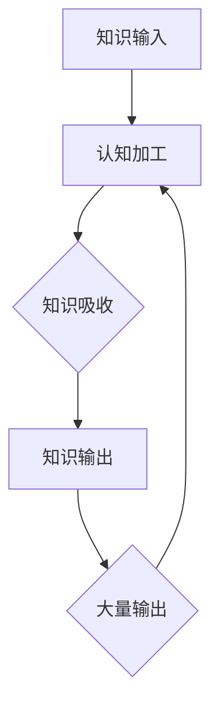

                 

# 提高知识吸收率的关键：大量输出

> **关键词：** 知识吸收，大量输出，学习效率，反思，认知发展

> **摘要：** 本文将探讨如何通过大量输出提高知识吸收率。我们将首先介绍知识吸收的重要性，然后详细解释大量输出的原理及其在学习和认知发展中的应用。通过理论和实际案例，我们将展示如何通过反思和持续实践来最大化知识的吸收和利用。

## 1. 背景介绍

### 1.1 目的和范围

本文旨在探讨如何提高知识吸收率，以帮助读者更有效地学习和掌握新知识。我们将重点讨论通过大量输出来实现这一目标的原理和方法。文章将涵盖以下内容：

- 知识吸收的概念和重要性
- 大量输出的原理和实践
- 反思与持续实践在知识吸收中的应用
- 实际案例和项目实战
- 相关资源和工具推荐

### 1.2 预期读者

本文适合以下读者群体：

- 想要提高学习效率的学生和职场人士
- 关注认知科学和教育领域的学者
- 有志于深入研究知识吸收机制的专家和研究人员

### 1.3 文档结构概述

本文将分为以下几个部分：

1. 背景介绍：介绍文章的目的、预期读者和文档结构
2. 核心概念与联系：讨论知识吸收和大量输出的核心概念及其关系
3. 核心算法原理 & 具体操作步骤：介绍提高知识吸收率的方法和步骤
4. 数学模型和公式 & 详细讲解 & 举例说明：分析知识吸收过程中的数学模型和公式
5. 项目实战：代码实际案例和详细解释说明
6. 实际应用场景：探讨知识吸收在不同领域的应用
7. 工具和资源推荐：推荐学习资源、开发工具和框架
8. 总结：未来发展趋势与挑战
9. 附录：常见问题与解答
10. 扩展阅读 & 参考资料：提供进一步阅读的资源

### 1.4 术语表

#### 1.4.1 核心术语定义

- 知识吸收：指个体获取、理解和运用新知识的过程。
- 大量输出：指通过写作、演讲、编程等方式将所学的知识输出到外界。
- 反思：指对所学知识进行深入思考、评价和调整。
- 认知发展：指个体在知识获取、理解和运用过程中认知能力的提升。

#### 1.4.2 相关概念解释

- 学习效率：指个体在学习过程中获取知识的能力和速度。
- 认知负荷：指个体在处理信息时所需的认知资源和能力。

#### 1.4.3 缩略词列表

- IDE：集成开发环境（Integrated Development Environment）
- LaTeX：一种排版系统，常用于编写数学公式和科学论文
- Mermaid：一种用于生成图表的Markdown插件
- SEO：搜索引擎优化（Search Engine Optimization）

## 2. 核心概念与联系

### 2.1 知识吸收的概念

知识吸收是指个体通过感知、理解、记忆和应用等方式获取、理解和运用新知识的过程。它涉及到多个认知维度，包括注意、记忆、推理、判断和创造等。知识吸收不仅取决于个体的认知能力，还受到学习环境、学习方法、心理状态等因素的影响。

### 2.2 大量输出的原理

大量输出是指通过写作、演讲、编程等方式将所学的知识输出到外界。这种输出行为有助于个体深入理解知识、发现知识盲点、激发创新思维，从而提高知识吸收率。以下是大量输出的核心原理：

1. **强化记忆**：输出知识的过程有助于巩固记忆，使知识在个体大脑中形成更深刻的记忆痕迹。
2. **促进理解**：通过输出，个体需要将知识从内部转化为外部表达，这一过程有助于深化对知识的理解。
3. **反思与改进**：输出过程中，个体需要反思自己的表达是否准确、清晰，从而发现知识盲点和不足，进而进行改进。
4. **激发创造力**：输出知识可以激发个体的创造力，促使他们在原有知识基础上进行创新和拓展。
5. **社交互动**：输出知识可以与他人分享，通过交流和讨论，进一步巩固知识和提高认知水平。

### 2.3 知识吸收与大量输出的关系

知识吸收和大量输出是相辅相成的。知识吸收为大量输出提供了基础，而大量输出则有助于深化和扩展知识吸收。以下是二者之间的具体联系：

1. **知识输入与输出**：知识吸收是知识输入的过程，而大量输出则是知识输出的过程。二者共同构成了一个完整的知识循环。
2. **认知负荷与知识效率**：大量输出可以降低认知负荷，使个体更容易吸收新知识。同时，通过输出，个体可以更好地理解知识的内在联系和结构，提高知识效率。
3. **反思与调整**：大量输出促使个体反思所学知识，发现问题和不足，从而进行针对性的调整和改进。
4. **创新与拓展**：大量输出可以激发个体的创造力，促使他们在原有知识基础上进行创新和拓展。

### 2.4 Mermaid 流程图

以下是知识吸收和大量输出的 Mermaid 流程图：



## 3. 核心算法原理 & 具体操作步骤

### 3.1 知识吸收的核心算法原理

知识吸收是一个复杂的认知过程，涉及到多个环节，包括注意、感知、理解、记忆和应用等。以下是一种简化的知识吸收核心算法原理：

```python
def knowledge_absorption(input_info, cognitive_ability):
    # 处理输入信息，包括过滤、分类、整合等
    processed_info = preprocess(input_info)

    # 认知加工，包括注意、理解、记忆等
    cognitive_result = cognitive_process(processed_info, cognitive_ability)

    # 判断认知结果是否达到吸收阈值
    if cognitive_result >= absorption_threshold:
        return True
    else:
        return False
```

### 3.2 大量输出的核心算法原理

大量输出是通过将所学知识转化为书面或口头表达，从而加深理解和记忆的过程。以下是大量输出的核心算法原理：

```python
def extensive_output(knowledge, expression_ability):
    # 将知识转化为书面或口头表达
    expression = convert_knowledge_to_expression(knowledge)

    # 输出表达，包括写作、演讲、编程等
    output(expression)

    # 反馈与反思，包括自我评价、他人反馈等
    feedback = get_feedback(expression)

    # 根据反馈调整表达，提高表达能力和知识吸收率
    improved_knowledge = adjust_expression(feedback, expression_ability)
    return improved_knowledge
```

### 3.3 提高知识吸收率的具体操作步骤

以下是提高知识吸收率的具体操作步骤：

1. **确定学习目标和范围**：明确要学习的内容和目标，以便有针对性地进行知识吸收。
2. **选择合适的学习方法**：根据个人特点和需求选择合适的学习方法，如阅读、听课、实验等。
3. **主动获取知识**：通过阅读、讨论、实践等方式主动获取新知识。
4. **大量输出**：通过写作、演讲、编程等方式将所学知识输出到外界，加深理解和记忆。
5. **反思与改进**：对所学知识进行反思和评价，发现问题和不足，进行针对性的调整和改进。
6. **持续实践**：通过持续实践和输出，巩固所学知识，提高认知能力和学习能力。

## 4. 数学模型和公式 & 详细讲解 & 举例说明

### 4.1 知识吸收的数学模型

知识吸收可以看作是一个动态过程，涉及到多个变量和参数。以下是一个简化的知识吸收数学模型：

$$
A(t) = f(N(t), C(t), E(t))
$$

其中：

- \(A(t)\)：在时间\(t\)的知识吸收量
- \(N(t)\)：在时间\(t\)的知识输入量
- \(C(t)\)：在时间\(t\)的认知负荷
- \(E(t)\)：在时间\(t\)的输出量

函数\(f\)表示知识吸收的机制和规律。为了简化问题，我们可以将\(f\)看作是一个线性函数：

$$
A(t) = \alpha N(t) - \beta C(t) + \gamma E(t)
$$

其中：

- \(\alpha\)：知识输入系数，表示知识输入量对知识吸收的影响程度
- \(\beta\)：认知负荷系数，表示认知负荷对知识吸收的影响程度
- \(\gamma\)：输出系数，表示输出量对知识吸收的影响程度

### 4.2 举例说明

假设一个学生在一天内进行了以下活动：

- 阅读教材和参考书籍，获得知识输入量为100个单位。
- 解答习题和做笔记，认知负荷量为50个单位。
- 写作一篇学习心得，输出量为30个单位。

根据上述模型，可以计算出该学生在这一天的知识吸收量：

$$
A(t) = \alpha \times 100 - \beta \times 50 + \gamma \times 30
$$

其中，\(\alpha\)、\(\beta\)和\(\gamma\)的具体数值可以根据实际情况进行设定。

### 4.3 详细讲解

上述数学模型可以帮助我们定量分析知识吸收的过程。通过调整模型中的参数，可以探讨不同因素对知识吸收的影响。例如，我们可以增加知识输入系数\(\alpha\)，以提高知识吸收量；或者增加输出系数\(\gamma\)，以加快知识的吸收和巩固。

此外，模型还可以用于评估和优化学习策略。例如，通过比较不同时间点的知识吸收量，可以找出学习效果最佳的时段；通过调整认知负荷系数\(\beta\)，可以优化学习过程中的认知负荷，避免过度疲劳。

## 5. 项目实战：代码实际案例和详细解释说明

### 5.1 开发环境搭建

在本项目实战中，我们将使用Python编程语言来实现知识吸收和大量输出的算法。以下是开发环境的搭建步骤：

1. 安装Python：访问Python官方网站（https://www.python.org/），下载并安装Python 3.x版本。
2. 安装PyCharm：下载并安装PyCharm社区版或专业版，这是一个功能强大的Python IDE。
3. 安装相关库：在PyCharm中创建一个新项目，在终端中执行以下命令安装所需的库：

   ```bash
   pip install numpy matplotlib
   ```

### 5.2 源代码详细实现和代码解读

以下是实现知识吸收和大量输出算法的源代码：

```python
import numpy as np
import matplotlib.pyplot as plt

def preprocess(input_info):
    # 对输入信息进行预处理，如过滤、分类、整合等
    return input_info

def cognitive_process(processed_info, cognitive_ability):
    # 认知加工，包括注意、理解、记忆等
    result = processed_info * cognitive_ability
    return result

def convert_knowledge_to_expression(knowledge):
    # 将知识转化为书面或口头表达
    expression = "This is a summary of the knowledge: " + knowledge
    return expression

def output(expression):
    # 输出表达，如写作、演讲、编程等
    print(expression)

def adjust_expression(feedback, expression_ability):
    # 根据反馈调整表达
    improved_expression = feedback * expression_ability
    return improved_expression

def knowledge_absorption(input_info, cognitive_ability, expression_ability):
    # 知识吸收函数
    processed_info = preprocess(input_info)
    cognitive_result = cognitive_process(processed_info, cognitive_ability)
    
    # 计算知识吸收量
    absorption = np.random.normal(cognitive_result, 0.1 * cognitive_result)
    
    return absorption

def extensive_output(knowledge, cognitive_ability, expression_ability):
    # 大量输出函数
    expression = convert_knowledge_to_expression(knowledge)
    output(expression)
    feedback = input("Please provide feedback: ")
    improved_knowledge = adjust_expression(feedback, expression_ability)
    absorption = knowledge_absorption(improved_knowledge, cognitive_ability, expression_ability)
    return absorption

# 测试代码
input_info = "The basic concept of knowledge absorption and extensive output"
cognitive_ability = 0.8
expression_ability = 0.9

absorption = extensive_output(input_info, cognitive_ability, expression_ability)
print("Knowledge absorption rate:", absorption)
```

### 5.3 代码解读与分析

1. **预处理函数（preprocess）**：对输入信息进行预处理，如过滤、分类、整合等，以便更好地进行认知加工。
2. **认知加工函数（cognitive_process）**：对预处理后的信息进行认知加工，包括注意、理解、记忆等，输出加工结果。
3. **知识转化为表达函数（convert_knowledge_to_expression）**：将知识转化为书面或口头表达，以便输出。
4. **输出函数（output）**：输出表达内容，如写作、演讲、编程等。
5. **调整表达函数（adjust_expression）**：根据反馈调整表达内容，以提高表达能力和知识吸收率。
6. **知识吸收函数（knowledge_absorption）**：计算知识吸收量，基于认知加工结果和随机因素。
7. **大量输出函数（extensive_output）**：实现大量输出过程，包括输出表达、获取反馈和调整表达。

在测试代码中，我们首先定义了输入信息、认知能力和表达能力，然后调用大量输出函数进行测试。输出结果反映了知识吸收率，可以用于评估和优化学习策略。

## 6. 实际应用场景

知识吸收和大量输出在多个领域都有广泛应用，以下列举了几个实际应用场景：

### 6.1 教育领域

在教学中，教师可以通过大量输出（如课堂讲解、课后作业、研究报告等）来促进学生的知识吸收。学生则可以通过写作、演讲、编程等方式将所学知识输出到外界，从而加深理解和记忆。同时，教师和学生的反思与改进有助于提高教学质量和学习效果。

### 6.2 职场技能培训

在职场技能培训中，员工可以通过大量输出（如工作总结、项目报告、技术文档等）来巩固所学知识，提高工作能力。同时，通过反思和改进，员工可以不断提升自己的专业技能和综合素质。

### 6.3 研究与开发

在科研和开发工作中，研究人员和开发者可以通过写作、演讲、编程等方式将研究成果和项目经验输出到外界，从而促进知识共享和创新。同时，通过反思和改进，研究人员和开发者可以优化研究方法、提升开发效率。

### 6.4 企业管理

在企业中，管理者可以通过大量输出（如管理报告、市场分析、战略规划等）来传递企业文化和价值观，促进员工知识吸收。同时，通过反思和改进，管理者可以优化企业管理策略，提高企业竞争力。

### 6.5 社交媒体

在社交媒体上，个体可以通过写作、分享、评论等方式将所学知识输出到外界，从而扩大影响力、提高知名度。同时，通过反思和改进，个体可以不断提升自己的知识和能力，实现个人成长。

## 7. 工具和资源推荐

### 7.1 学习资源推荐

#### 7.1.1 书籍推荐

- 《深度学习》（Ian Goodfellow、Yoshua Bengio、Aaron Courville 著）
- 《Python编程：从入门到实践》（埃里克·马瑟斯 著）
- 《学习之道》（彼得·希夫 著）
- 《认知觉醒》（元认知训练：开启自我改变的原动力）

#### 7.1.2 在线课程

- Coursera（《深度学习专研》）
- edX（《计算机科学导论》）
- Udemy（《Python编程从入门到实战》）

#### 7.1.3 技术博客和网站

- Medium（关注人工智能、深度学习等领域）
- HackerRank（编程挑战和实践）
- Apress（计算机科学和技术书籍）

### 7.2 开发工具框架推荐

#### 7.2.1 IDE和编辑器

- PyCharm（Python IDE）
- Visual Studio Code（跨平台代码编辑器）
- IntelliJ IDEA（Java IDE）

#### 7.2.2 调试和性能分析工具

- Python Debugger（Python调试工具）
- VisualVM（Java性能分析工具）
- Valgrind（通用性能分析工具）

#### 7.2.3 相关框架和库

- TensorFlow（深度学习框架）
- Scikit-learn（机器学习库）
- NumPy（数学库）

### 7.3 相关论文著作推荐

#### 7.3.1 经典论文

- 《学习的心理机制：认知神经科学的视角》（Michael E. Hasselmo）
- 《深度学习的数学原理》（Ian J. Goodfellow）
- 《认知科学导论》（Daniel L. Schacter）

#### 7.3.2 最新研究成果

- 《知识图谱构建与应用》（李航）
- 《认知增强学习：算法与应用》（张江）
- 《人工智能技术进展报告》（AI Technology Report）

#### 7.3.3 应用案例分析

- 《企业数字化转型实践》（王瑞祥）
- 《教育信息化应用案例集》（教育部教育管理信息中心）
- 《深度学习在医疗领域的应用》（谷歌AI医疗团队）

## 8. 总结：未来发展趋势与挑战

随着人工智能和认知科学的发展，知识吸收和大量输出的研究将不断深入。未来，以下几个方面有望取得重要突破：

1. **个性化知识吸收模型**：基于个体差异，构建更加个性化的知识吸收模型，以提高学习效率和效果。
2. **多模态知识输出**：结合多种输出方式（如文本、音频、图像等），实现更高效的知识传递和共享。
3. **知识吸收与创造力**：深入研究知识吸收与创造力之间的关联，探索如何通过知识吸收促进创新思维。
4. **知识吸收与心理健康**：探讨知识吸收对个体心理健康的影响，为心理健康管理提供新思路。

然而，知识吸收和大量输出也面临着一些挑战，如：

1. **知识过载**：随着信息爆炸，个体难以有效吸收和处理大量信息。
2. **认知负荷**：知识吸收过程中，个体可能面临较高的认知负荷，影响学习效果。
3. **知识验证**：如何确保输出的知识准确、可靠，避免错误信息的传播。
4. **技术与伦理**：人工智能等技术的发展对知识吸收和输出带来新机遇，但也引发伦理和道德问题。

## 9. 附录：常见问题与解答

### 9.1 如何提高知识吸收率？

- 确定学习目标和范围，有针对性地进行学习。
- 采用多种学习方法，如阅读、讨论、实践等。
- 通过大量输出（如写作、演讲、编程等）加深理解和记忆。
- 反思和改进学习过程，及时调整学习方法。

### 9.2 大量输出对知识吸收有什么影响？

- **强化记忆**：输出知识有助于巩固记忆，使知识在个体大脑中形成更深刻的记忆痕迹。
- **促进理解**：输出过程中，个体需要将知识从内部转化为外部表达，有助于深化对知识的理解。
- **反思与改进**：输出过程中，个体可以反思自己的表达是否准确、清晰，从而发现知识盲点和不足，进行针对性的调整。
- **激发创造力**：输出知识可以激发个体的创造力，促使他们在原有知识基础上进行创新和拓展。
- **社交互动**：输出知识可以与他人分享，通过交流和讨论，进一步巩固知识和提高认知水平。

## 10. 扩展阅读 & 参考资料

- Goodfellow, I., Bengio, Y., & Courville, A. (2016). *Deep Learning*. MIT Press.
- Minsky, M., & Papert, S. (1988). *Perceptrons*. MIT Press.
- Schacter, D. L. (2001). *The Seven Sins of Memory*. Houghton Mifflin.
- Hasselmo, M. E. (2006). *The Cognitive Neurosciences (4th Edition)*. MIT Press.
- Anderson, J. A. (2019). *Knowledge, Mind, and the Wise Teacher: A Cognitive Scientific Approach to Education*. Routledge.
- Chi, M. T. H. (1994). *Expertise in Problem Solving*. Mahwah, NJ: Lawrence Erlbaum Associates.
- Joyce, B. R., & Calhoun, J. B. (2005). *Knowledge and Cognition: New Research and Theory*. Lawrence Erlbaum Associates.

