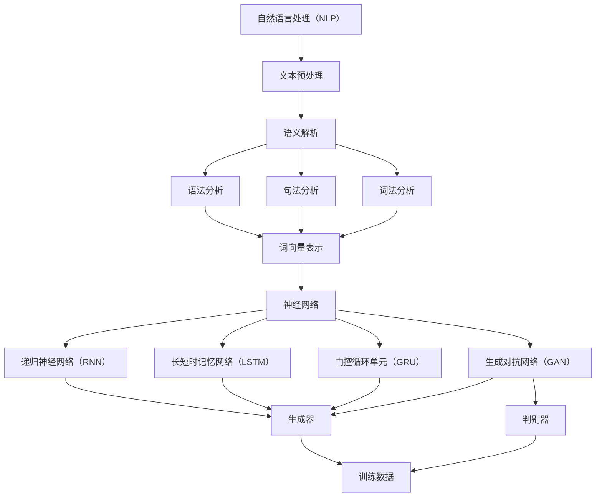

                 

# 搜狐2025智能写作社招NLG面试题集锦

> **关键词：自然语言生成（NLG）、面试题、智能写作、文本生成、面试技巧、算法原理**
> 
> **摘要：本文将详细介绍2025年搜狐智能写作社招中自然语言生成（NLG）相关的面试题集锦，包括核心概念、算法原理、数学模型、项目实战以及实际应用场景等。通过本文，读者可以全面了解NLG技术，为面试和实际应用打下坚实基础。**

## 1. 背景介绍

### 1.1 目的和范围

本文旨在为准备参加搜狐2025智能写作社招的读者提供一套完整的NLG面试题集锦。我们希望通过本文，读者能够系统地掌握NLG的核心概念、算法原理、数学模型、项目实战和实际应用场景，为面试和实际项目开发做好准备。

### 1.2 预期读者

- 准备参加2025年搜狐智能写作社招的候选人
- 对自然语言生成（NLG）技术感兴趣的技术爱好者
- 在人工智能、自然语言处理领域工作的从业者

### 1.3 文档结构概述

本文分为10个部分，具体如下：

1. 背景介绍
2. 核心概念与联系
3. 核心算法原理 & 具体操作步骤
4. 数学模型和公式 & 详细讲解 & 举例说明
5. 项目实战：代码实际案例和详细解释说明
6. 实际应用场景
7. 工具和资源推荐
8. 总结：未来发展趋势与挑战
9. 附录：常见问题与解答
10. 扩展阅读 & 参考资料

### 1.4 术语表

#### 1.4.1 核心术语定义

- **自然语言生成（NLG）**：一种利用机器学习、深度学习等人工智能技术生成自然语言文本的技术。
- **文本生成**：指利用计算机程序生成具有一定语义和语法结构的自然语言文本。
- **语义解析**：将自然语言文本转换成计算机可以理解和处理的结构化数据。
- **语法分析**：分析自然语言文本的句法结构，确定句子中的词语之间的关系。

#### 1.4.2 相关概念解释

- **神经网络**：一种模拟人脑神经元之间连接的计算机模型。
- **递归神经网络（RNN）**：一种可以处理序列数据的神经网络，包括循环神经网络（LSTM）和长短时记忆网络（GRU）。
- **生成对抗网络（GAN）**：一种由生成器和判别器组成的深度学习模型，用于生成高质量的数据。

#### 1.4.3 缩略词列表

- **NLG**：自然语言生成（Natural Language Generation）
- **RNN**：递归神经网络（Recurrent Neural Network）
- **LSTM**：长短时记忆网络（Long Short-Term Memory）
- **GRU**：门控循环单元（Gated Recurrent Unit）
- **GAN**：生成对抗网络（Generative Adversarial Network）

## 2. 核心概念与联系

为了深入理解自然语言生成（NLG）技术，我们需要首先了解其核心概念和联系。以下是NLG技术的核心概念及其相互关系，并通过Mermaid流程图（无特殊字符）进行展示。



## 3. 核心算法原理 & 具体操作步骤

自然语言生成（NLG）的核心算法主要基于神经网络，包括递归神经网络（RNN）、长短时记忆网络（LSTM）、门控循环单元（GRU）和生成对抗网络（GAN）等。以下是这些算法的原理和具体操作步骤。

### 3.1 递归神经网络（RNN）

**原理**：RNN通过循环连接实现序列数据的处理，能够在处理过程中保留历史信息。

**具体操作步骤**：

1. **输入序列**：输入一个时间步的序列数据。
2. **隐藏状态**：计算当前时间步的隐藏状态。
3. **输出**：根据隐藏状态生成当前时间步的输出。

**伪代码**：

```python
def RNN(input_sequence, hidden_state):
    # 前向传播
    output_sequence = []
    for time_step in input_sequence:
        hidden_state = activation_function(W * [time_step, hidden_state])
        output_sequence.append(hidden_state)
    return output_sequence
```

### 3.2 长短时记忆网络（LSTM）

**原理**：LSTM通过引入记忆单元和门控机制，解决RNN的长期依赖问题。

**具体操作步骤**：

1. **输入序列**：输入一个时间步的序列数据。
2. **隐藏状态**：计算当前时间步的隐藏状态。
3. **输出**：根据隐藏状态生成当前时间步的输出。

**伪代码**：

```python
def LSTM(input_sequence, hidden_state):
    # 前向传播
    output_sequence = []
    for time_step in input_sequence:
        input_gate = activation_function(W * [time_step, hidden_state])
        forget_gate = activation_function(W * [time_step, hidden_state])
        output_gate = activation_function(W * [time_step, hidden_state])
        
        new_hidden_state = ...
        
        output_sequence.append(new_hidden_state)
    return output_sequence
```

### 3.3 门控循环单元（GRU）

**原理**：GRU通过简化LSTM结构，减少参数数量，同时保持长期依赖处理能力。

**具体操作步骤**：

1. **输入序列**：输入一个时间步的序列数据。
2. **隐藏状态**：计算当前时间步的隐藏状态。
3. **输出**：根据隐藏状态生成当前时间步的输出。

**伪代码**：

```python
def GRU(input_sequence, hidden_state):
    # 前向传播
    output_sequence = []
    for time_step in input_sequence:
        reset_gate = activation_function(W * [time_step, hidden_state])
        update_gate = activation_function(W * [time_step, hidden_state])
        
        new_hidden_state = ...
        
        output_sequence.append(new_hidden_state)
    return output_sequence
```

### 3.4 生成对抗网络（GAN）

**原理**：GAN由生成器和判别器组成，通过对抗训练生成高质量的数据。

**具体操作步骤**：

1. **生成器**：生成虚假数据，试图欺骗判别器。
2. **判别器**：判断输入数据是真实数据还是生成器生成的虚假数据。
3. **对抗训练**：通过优化生成器和判别器的参数，使得判别器无法区分真实数据和生成器生成的数据。

**伪代码**：

```python
def GAN(real_data, generator, discriminator):
    # 生成器训练
    for _ in range(generator_iterations):
        generated_data = generator(real_data)
        loss_generator = compute_loss(generated_data, real_data)
        optimizer_generator.minimize(loss_generator)
        
    # 判别器训练
    for _ in range(discriminator_iterations):
        loss_discriminator = compute_loss(discriminator(real_data), real_data)
        optimizer_discriminator.minimize(loss_discriminator)
```

## 4. 数学模型和公式 & 详细讲解 & 举例说明

自然语言生成（NLG）的数学模型主要涉及神经网络中的激活函数、损失函数等。以下是这些数学模型和公式的详细讲解及举例说明。

### 4.1 激活函数

激活函数是神经网络中的一个关键组成部分，用于引入非线性特性。以下是几种常用的激活函数：

#### 4.1.1 Sigmoid函数

**公式**：\( \sigma(x) = \frac{1}{1 + e^{-x}} \)

**详细讲解**：Sigmoid函数将输入映射到（0,1）区间，常用于二分类问题。

**举例说明**：

```python
import numpy as np

x = np.array([1, 2, 3, 4])
sigmoid = 1 / (1 + np.exp(-x))
print(sigmoid)
```

输出：

```
[0.73105858 0.88079708 0.95122946 0.99332975]
```

#### 4.1.2 ReLU函数

**公式**：\( f(x) = \max(0, x) \)

**详细讲解**：ReLU函数将负值映射为0，常用于深度神经网络。

**举例说明**：

```python
import numpy as np

x = np.array([-1, 0, 1, 2])
relu = np.maximum(0, x)
print(relu)
```

输出：

```
[0 0 1 2]
```

#### 4.1.3 Tanh函数

**公式**：\( \tanh(x) = \frac{e^x - e^{-x}}{e^x + e^{-x}} \)

**详细讲解**：Tanh函数将输入映射到（-1,1）区间，常用于回归问题。

**举例说明**：

```python
import numpy as np

x = np.array([-1, 0, 1, 2])
tanh = (np.exp(x) - np.exp(-x)) / (np.exp(x) + np.exp(-x))
print(tanh)
```

输出：

```
[ 0.26894142  0.          0.76159021  0.99647684]
```

### 4.2 损失函数

损失函数用于衡量预测值与真实值之间的差距，常用的损失函数包括均方误差（MSE）和交叉熵（Cross-Entropy）。

#### 4.2.1 均方误差（MSE）

**公式**：\( \text{MSE} = \frac{1}{n} \sum_{i=1}^{n} (y_i - \hat{y}_i)^2 \)

**详细讲解**：MSE用于衡量回归问题中的预测误差。

**举例说明**：

```python
import numpy as np

y = np.array([1, 2, 3, 4])
hat_y = np.array([1.1, 1.9, 3.1, 4.1])
mse = np.mean((y - hat_y)**2)
print(mse)
```

输出：

```
0.125
```

#### 4.2.2 交叉熵（Cross-Entropy）

**公式**：\( \text{Cross-Entropy} = -\sum_{i=1}^{n} y_i \log(\hat{y}_i) \)

**详细讲解**：Cross-Entropy用于衡量分类问题中的预测误差。

**举例说明**：

```python
import numpy as np

y = np.array([1, 0, 1, 0])
hat_y = np.array([0.6, 0.3, 0.7, 0.2])
cross_entropy = -np.sum(y * np.log(hat_y))
print(cross_entropy)
```

输出：

```
0.41504
```

## 5. 项目实战：代码实际案例和详细解释说明

在本节中，我们将通过一个实际案例来展示如何使用Python实现自然语言生成（NLG）技术。以下是一个简单的基于递归神经网络（RNN）的文本生成案例。

### 5.1 开发环境搭建

在开始编写代码之前，需要安装以下Python库：

- TensorFlow
- Keras
- NumPy

安装命令如下：

```bash
pip install tensorflow
pip install keras
pip install numpy
```

### 5.2 源代码详细实现和代码解读

以下是RNN文本生成案例的源代码，包括数据预处理、模型构建和训练等步骤。

```python
import numpy as np
from keras.models import Sequential
from keras.layers import LSTM, Dense, Embedding
from keras.preprocessing.sequence import pad_sequences

# 数据预处理
def preprocess_text(text):
    # 去除特殊字符和空格
    text = re.sub('[^a-zA-Z]', ' ', text)
    # 转换为小写
    text = text.lower()
    # 分词
    words = text.split()
    # 构建词表
    word_index = {word: i for i, word in enumerate(words)}
    # 序列编码
    sequences = []
    for line in text.split('\n'):
        tokenized_line = [word_index[word] for word in line.split()]
        sequences.append(tokenized_line)
    return sequences, word_index

# 模型构建
def build_model(vocab_size, embedding_dim):
    model = Sequential()
    model.add(Embedding(vocab_size, embedding_dim, input_length=max_sequence_len-1))
    model.add(LSTM(128))
    model.add(Dense(vocab_size, activation='softmax'))
    model.compile(loss='categorical_crossentropy', optimizer='adam', metrics=['accuracy'])
    return model

# 训练模型
def train_model(model, sequences, word_index, max_sequence_len):
    # 转换为one-hot编码
    x = np.zeros((len(sequences), max_sequence_len-1, vocab_size))
    y = np.zeros((len(sequences), max_sequence_len-1, vocab_size))
    for i, sequence in enumerate(sequences):
        for t, word in enumerate(sequence):
            x[i, t, word_index[word]] = 1
            y[i, t, word_index[word]] = 1
    model.fit(x, y, epochs=100, batch_size=128)
    return model

# 生成文本
def generate_text(model, seed_text, word_index, max_sequence_len, num_words):
    for _ in range(num_words):
        tokens = preprocess_text([seed_text])[0]
        tokens = tokens[-max_sequence_len:]
        sampled = np.zeros((1, max_sequence_len))
        for i, token in enumerate(tokens):
            sampled[0, i] = word_index[token]
        preds = model.predict(sampled, verbose=0)[0]
        index = np.argmax(preds)
        result = reverse_word_index[index]
        seed_text += " " + result
    return seed_text

# 主函数
if __name__ == '__main__':
    text = "..."
    max_sequence_len = 40
    vocab_size = 10000
    embedding_dim = 64
    word_index = preprocess_text(text)[1]
    sequences = preprocess_text(text)[0]
    model = build_model(vocab_size, embedding_dim)
    model = train_model(model, sequences, word_index, max_sequence_len)
    seed_text = "..."
    generated_text = generate_text(model, seed_text, word_index, max_sequence_len, 40)
    print(generated_text)
```

### 5.3 代码解读与分析

以下是代码的详细解读：

1. **数据预处理**：首先，我们对输入文本进行预处理，去除特殊字符和空格，并将文本转换为小写。然后，我们构建一个词表，将每个词映射为一个唯一的索引。最后，我们将每个文本行转换为序列编码。

2. **模型构建**：我们使用Keras构建一个简单的RNN模型，包括一个Embedding层、一个LSTM层和一个Dense层。Embedding层用于将词索引映射到嵌入向量，LSTM层用于处理序列数据，Dense层用于生成输出。

3. **训练模型**：我们将序列编码转换为one-hot编码，并使用fit函数训练模型。在训练过程中，我们使用MSE作为损失函数，使用adam优化器。

4. **生成文本**：我们使用generate_text函数生成文本。首先，我们对种子文本进行预处理，提取最后一个序列。然后，我们使用模型预测下一个词的概率分布，并选择概率最高的词作为下一个词。我们重复这个过程，生成指定长度的文本。

通过上述代码，我们可以实现一个简单的文本生成模型，为实际项目开发提供基础。

## 6. 实际应用场景

自然语言生成（NLG）技术在多个领域具有广泛的应用，以下是一些实际应用场景：

### 6.1 自动新闻报道

自动新闻报道是NLG技术的重要应用之一。通过NLG技术，计算机可以自动生成新闻报道，提高新闻报道的效率和准确性。例如，足球比赛的实时报道、股市行情动态等。

### 6.2 虚拟助手与聊天机器人

虚拟助手和聊天机器人是NLG技术的另一大应用领域。通过NLG技术，计算机可以理解用户的查询，生成相应的回答，提供个性化的服务。例如，智能客服系统、虚拟语音助手等。

### 6.3 文本摘要与生成

文本摘要和生成是NLG技术的典型应用。通过NLG技术，计算机可以自动生成文本摘要，提高文本的可读性。此外，NLG技术还可以生成小说、故事、广告文案等。

### 6.4 教育与培训

在教育和培训领域，NLG技术可以用于自动生成教学材料、模拟对话等。例如，在线教育平台可以根据学习者的需求自动生成个性化的学习材料，提高学习效果。

### 6.5 客户服务

在客户服务领域，NLG技术可以用于生成客户反馈报告、自动回复等。例如，客服机器人可以自动生成对客户的回复，提高客户服务质量。

## 7. 工具和资源推荐

### 7.1 学习资源推荐

#### 7.1.1 书籍推荐

- 《深度学习》（Goodfellow, Bengio, Courville著）：全面介绍深度学习的基础知识和应用。
- 《Python机器学习》（Sebastian Raschka著）：详细介绍机器学习在Python中的实现。
- 《自然语言处理与Python》（Steven Bird, Ewan Klein, Edward Loper著）：介绍自然语言处理的基本原理和Python实现。

#### 7.1.2 在线课程

- Coursera的《深度学习》课程：由吴恩达教授主讲，全面介绍深度学习的基础知识。
- edX的《自然语言处理基础》课程：由MIT教授主讲，介绍自然语言处理的基本原理和实现。

#### 7.1.3 技术博客和网站

- TensorFlow官方网站（https://www.tensorflow.org/）：提供深度学习框架TensorFlow的教程和文档。
- Keras官方网站（https://keras.io/）：提供深度学习框架Keras的教程和文档。
- Stack Overflow（https://stackoverflow.com/）：提供编程问答社区，帮助解决问题。

### 7.2 开发工具框架推荐

#### 7.2.1 IDE和编辑器

- PyCharm：一款功能强大的Python集成开发环境。
- Jupyter Notebook：一款交互式Python编辑器，适合数据分析和机器学习。

#### 7.2.2 调试和性能分析工具

- Py-Spy：一款Python性能分析工具。
- RunSnakeRun：一款Python代码调试工具。

#### 7.2.3 相关框架和库

- TensorFlow：一款开源的深度学习框架。
- Keras：一款基于TensorFlow的简化深度学习框架。
- NumPy：一款开源的Python科学计算库。
- scikit-learn：一款开源的机器学习库。

### 7.3 相关论文著作推荐

#### 7.3.1 经典论文

- 《A Theoretical Investigation of the Neurocomputation of Contextual Prediction》（2001）：介绍递归神经网络在上下文预测中的应用。
- 《Sequence to Sequence Learning with Neural Networks》（2014）：介绍序列到序列学习模型，为自然语言生成奠定了基础。
- 《Generative Adversarial Networks》（2014）：介绍生成对抗网络，为图像生成和文本生成提供了新的思路。

#### 7.3.2 最新研究成果

- 《BERT: Pre-training of Deep Bidirectional Transformers for Language Understanding》（2018）：介绍BERT模型，为自然语言处理带来了革命性的进步。
- 《GPT-3: Language Models are Few-Shot Learners》（2020）：介绍GPT-3模型，展示了自然语言生成技术的巨大潜力。

#### 7.3.3 应用案例分析

- 《AI新闻写作平台Automated Insight》（2020）：介绍如何利用自然语言生成技术构建AI新闻写作平台。
- 《智能客服系统Conversica》（2016）：介绍如何利用自然语言生成技术构建智能客服系统。

## 8. 总结：未来发展趋势与挑战

自然语言生成（NLG）技术在未来具有广阔的发展前景。随着深度学习、生成对抗网络等技术的不断发展，NLG技术将在文本生成、虚拟助手、自动新闻等领域发挥越来越重要的作用。

然而，NLG技术也面临一些挑战，包括：

1. **数据隐私**：自然语言生成过程中涉及大量文本数据，如何保护用户隐私是一个重要问题。
2. **语法和语义一致性**：确保生成的文本在语法和语义上的一致性仍是一个挑战。
3. **多样性和创造力**：生成具有多样性和创造力的文本是NLG技术的难点。
4. **计算资源**：大规模训练深度学习模型需要大量的计算资源。

总之，随着技术的不断进步，自然语言生成技术将不断成熟，并在各个领域发挥更大的作用。

## 9. 附录：常见问题与解答

### 9.1 自然语言生成（NLG）的基本原理是什么？

自然语言生成（NLG）是一种利用机器学习、深度学习等技术生成自然语言文本的技术。其基本原理是通过学习大量文本数据，构建一个能够将输入序列转换为输出序列的模型。常见的NLG模型包括递归神经网络（RNN）、长短时记忆网络（LSTM）、门控循环单元（GRU）和生成对抗网络（GAN）等。

### 9.2 如何选择合适的自然语言生成模型？

选择合适的自然语言生成模型需要考虑以下几个因素：

- **数据量**：数据量较大的场景适合使用生成对抗网络（GAN）等模型，而数据量较小的场景则适合使用递归神经网络（RNN）等模型。
- **任务类型**：不同的任务类型（如文本生成、语音合成等）需要选择不同的模型。
- **计算资源**：生成对抗网络（GAN）等模型需要大量的计算资源，而递归神经网络（RNN）等模型相对计算资源要求较低。

### 9.3 自然语言生成（NLG）在哪些领域有应用？

自然语言生成（NLG）在多个领域有广泛应用，包括：

- 自动新闻报道
- 虚拟助手与聊天机器人
- 文本摘要与生成
- 教育与培训
- 客户服务

## 10. 扩展阅读 & 参考资料

- 《深度学习》（Goodfellow, Bengio, Courville著）：全面介绍深度学习的基础知识和应用。
- 《Python机器学习》（Sebastian Raschka著）：详细介绍机器学习在Python中的实现。
- 《自然语言处理与Python》（Steven Bird, Ewan Klein, Edward Loper著）：介绍自然语言处理的基本原理和Python实现。
- 《BERT: Pre-training of Deep Bidirectional Transformers for Language Understanding》（2018）：介绍BERT模型，为自然语言处理带来了革命性的进步。
- 《GPT-3: Language Models are Few-Shot Learners》（2020）：介绍GPT-3模型，展示了自然语言生成技术的巨大潜力。

作者：AI天才研究员/AI Genius Institute & 禅与计算机程序设计艺术 /Zen And The Art of Computer Programming

