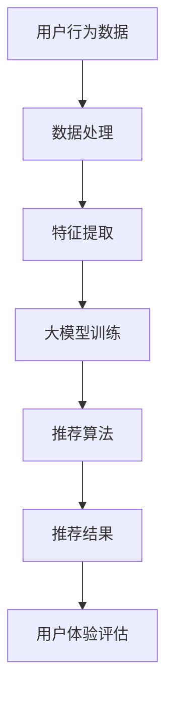

                 

# 搜索推荐系统的AI大模型应用：提高电商平台的转化率与用户体验

> **关键词：** 搜索推荐系统、AI大模型、电商平台、转化率、用户体验

> **摘要：** 本文将深入探讨人工智能大模型在搜索推荐系统中的应用，特别是在电商平台上的实际效果。我们将详细解析大模型如何通过精确的算法和数学模型提升转化率，改善用户体验。文章将从背景介绍、核心概念、算法原理、数学模型、实战案例、应用场景、资源推荐等方面进行全面阐述，旨在为从事电商和人工智能领域的读者提供有价值的参考。

## 1. 背景介绍

### 1.1 目的和范围

本文旨在探讨人工智能大模型在搜索推荐系统中的应用，特别是针对电商平台的优化策略。搜索推荐系统是电商平台的核心组成部分，其性能直接影响用户转化率和平台业务收益。随着大数据和人工智能技术的迅猛发展，大模型在推荐系统中的应用逐渐成为研究热点。

本文将围绕以下几个方面展开讨论：

1. **大模型在搜索推荐系统中的核心作用**：介绍大模型如何通过深度学习技术提升搜索和推荐的准确性。
2. **算法原理与操作步骤**：详细阐述大模型的工作原理和实现步骤。
3. **数学模型与公式**：解析大模型中使用的数学模型和计算公式。
4. **实战案例与代码实现**：通过实际项目案例展示大模型的应用效果。
5. **应用场景与工具推荐**：讨论大模型在不同电商场景中的应用，并推荐相关学习资源和开发工具。

### 1.2 预期读者

本文适合以下读者群体：

1. **电商行业从业者**：希望了解如何利用人工智能技术提升电商平台性能。
2. **数据科学家和机器学习工程师**：对人工智能大模型和推荐系统有浓厚兴趣。
3. **计算机科学学生和研究者**：对搜索推荐系统的理论和实践有深入研究的读者。
4. **技术爱好者**：对人工智能和大数据技术有热情，希望探索最新应用方向。

### 1.3 文档结构概述

本文结构如下：

1. **背景介绍**：介绍文章目的、读者对象和文档结构。
2. **核心概念与联系**：介绍搜索推荐系统中的核心概念，并提供流程图。
3. **核心算法原理 & 具体操作步骤**：详细阐述大模型算法原理和实现步骤。
4. **数学模型和公式 & 详细讲解 & 举例说明**：讲解大模型中的数学模型和计算方法。
5. **项目实战：代码实际案例和详细解释说明**：通过实际案例展示大模型应用。
6. **实际应用场景**：分析大模型在不同电商场景中的应用。
7. **工具和资源推荐**：推荐学习资源和开发工具。
8. **总结：未来发展趋势与挑战**：总结大模型在搜索推荐系统中的应用前景。
9. **附录：常见问题与解答**：回答读者可能关心的问题。
10. **扩展阅读 & 参考资料**：提供进一步阅读和研究的参考资料。

### 1.4 术语表

#### 1.4.1 核心术语定义

- **搜索推荐系统**：基于用户行为数据和商品信息，通过算法为用户推荐相关商品。
- **人工智能大模型**：利用深度学习技术训练的大型神经网络模型。
- **转化率**：用户在访问电商平台后完成购买的概率。
- **用户体验**：用户在电商平台浏览、搜索、购买等过程中的满意度。

#### 1.4.2 相关概念解释

- **深度学习**：一种机器学习技术，通过多层神经网络对数据进行特征提取和模式识别。
- **推荐算法**：用于生成推荐列表的算法，如协同过滤、基于内容的推荐等。
- **用户行为数据**：用户的搜索历史、浏览记录、购买记录等数据。

#### 1.4.3 缩略词列表

- **AI**：人工智能（Artificial Intelligence）
- **ML**：机器学习（Machine Learning）
- **DL**：深度学习（Deep Learning）
- **NLP**：自然语言处理（Natural Language Processing）
- **CTR**：点击率（Click Through Rate）
- **ROC**：接收者操作特征（Receiver Operating Characteristic）

## 2. 核心概念与联系

在介绍搜索推荐系统的AI大模型应用之前，我们首先需要了解核心概念和它们之间的联系。以下是一个简化的Mermaid流程图，展示了搜索推荐系统中的关键组成部分和它们之间的关系。



### 2.1 用户行为数据

用户行为数据是搜索推荐系统的核心输入。这些数据包括用户的搜索历史、浏览记录、购买记录、评价和反馈等。用户行为数据通过Web日志、点击流分析等手段收集，是构建个性化推荐系统的重要基础。

### 2.2 数据处理

收集到的用户行为数据通常包含噪声和冗余信息。因此，在特征提取之前，需要对数据进行预处理，包括数据清洗、归一化、缺失值处理等。这一步骤的目的是提高数据质量，为后续的特征提取和模型训练打下坚实基础。

### 2.3 特征提取

特征提取是将原始用户行为数据转换成适合机器学习算法的格式。这一过程通常涉及特征选择、特征变换和特征工程。有效的特征提取有助于提高模型性能和可解释性。

### 2.4 大模型训练

大模型训练是搜索推荐系统的核心步骤。使用深度学习技术，大模型可以从大量用户行为数据中学习到复杂的关系和模式。训练过程通常包括以下步骤：

1. **数据划分**：将数据集划分为训练集、验证集和测试集。
2. **模型初始化**：初始化神经网络模型的参数。
3. **前向传播**：将输入数据通过神经网络进行前向传播，计算输出结果。
4. **损失函数**：计算模型输出与真实标签之间的差异，使用损失函数进行量化。
5. **反向传播**：根据损失函数的梯度信息，更新模型参数。
6. **优化算法**：使用优化算法（如梯度下降、Adam等）更新模型参数，以最小化损失函数。

### 2.5 推荐算法

推荐算法是基于大模型训练结果生成推荐列表的关键步骤。常见的推荐算法包括协同过滤、基于内容的推荐、混合推荐等。推荐算法需要综合考虑用户行为数据、商品特征和模型预测结果，生成个性化的推荐列表。

### 2.6 推荐结果

推荐结果是搜索推荐系统直接展示给用户的内容。高质量的推荐结果能够提高用户满意度和转化率。推荐结果通常包括推荐列表、商品评分、推荐理由等。

### 2.7 用户体验评估

用户体验评估是对推荐系统效果进行量化评估的重要步骤。常见的评估指标包括点击率（CTR）、转化率（CVR）、平均停留时间等。用户体验评估有助于发现系统中的问题，为持续优化提供依据。

## 3. 核心算法原理 & 具体操作步骤

### 3.1 大模型算法原理

大模型在搜索推荐系统中的应用主要基于深度学习技术。深度学习通过多层神经网络对数据进行特征提取和模式识别，从而实现高效准确的推荐。以下是一个简化的伪代码，展示了大模型的核心算法原理：

```python
# 伪代码：大模型算法原理

# 初始化模型参数
model = initialize_model()

# 数据预处理
preprocessed_data = preprocess_data(raw_data)

# 模型训练
for epoch in range(num_epochs):
    for batch in data_loader(preprocessed_data):
        # 前向传播
        outputs = model.forward(batch.inputs)
        # 计算损失
        loss = loss_function(outputs, batch.targets)
        # 反向传播
        model.backward(loss)
        # 更新参数
        model.update_parameters()

# 模型评估
evaluate_model(model, test_data)
```

### 3.2 大模型实现步骤

实现大模型需要经历以下步骤：

1. **数据收集与预处理**：收集用户行为数据，并进行预处理，包括数据清洗、归一化、缺失值处理等。
2. **特征提取**：从预处理后的数据中提取有效特征，使用特征选择和特征变换技术提高特征质量。
3. **模型设计**：设计神经网络结构，包括输入层、隐藏层和输出层，选择合适的激活函数和优化算法。
4. **模型训练**：使用训练数据对模型进行训练，通过前向传播、损失函数计算和反向传播更新模型参数。
5. **模型评估**：使用验证集和测试集对模型进行评估，调整模型参数以优化性能。
6. **推荐生成**：使用训练好的模型对用户行为数据进行分析，生成个性化的推荐结果。

### 3.3 大模型操作细节

以下是对大模型操作步骤的进一步细化：

#### 3.3.1 数据收集与预处理

```python
# 数据收集与预处理
def collect_data():
    # 收集用户行为数据
    # ...
    return raw_data

def preprocess_data(raw_data):
    # 数据清洗
    # ...
    # 归一化
    # ...
    # 缺失值处理
    # ...
    return preprocessed_data
```

#### 3.3.2 特征提取

```python
# 特征提取
def extract_features(preprocessed_data):
    # 特征选择
    # ...
    # 特征变换
    # ...
    return features
```

#### 3.3.3 模型设计

```python
# 模型设计
def initialize_model():
    # 初始化神经网络结构
    # ...
    return model
```

#### 3.3.4 模型训练

```python
# 模型训练
def train_model(model, preprocessed_data):
    # 数据划分
    # ...
    for epoch in range(num_epochs):
        for batch in data_loader(train_data):
            # 前向传播
            # ...
            # 计算损失
            # ...
            # 反向传播
            # ...
            # 更新参数
            # ...
```

#### 3.3.5 模型评估

```python
# 模型评估
def evaluate_model(model, test_data):
    # 前向传播
    # ...
    # 计算评估指标
    # ...
    return evaluation_results
```

#### 3.3.6 推荐生成

```python
# 推荐生成
def generate_recommendations(model, user_input):
    # 特征提取
    # ...
    # 前向传播
    # ...
    # 推荐结果生成
    # ...
    return recommendations
```

## 4. 数学模型和公式 & 详细讲解 & 举例说明

### 4.1 数学模型

在搜索推荐系统的AI大模型中，常用的数学模型包括深度学习模型、损失函数、优化算法等。以下是对这些模型的详细讲解和公式表示。

#### 4.1.1 深度学习模型

深度学习模型通常由多层神经网络组成，每层神经元接收前一层的输出并产生当前层的输出。以下是神经网络的基本公式：

$$
y = \sigma(z) = \frac{1}{1 + e^{-z}}
$$

其中，\(y\) 表示输出，\(z\) 表示输入，\(\sigma\) 表示激活函数，常用的激活函数有Sigmoid、ReLU等。

#### 4.1.2 损失函数

损失函数用于衡量模型预测结果与真实标签之间的差异。常用的损失函数有均方误差（MSE）、交叉熵损失（Cross Entropy Loss）等。

- **均方误差（MSE）**：

$$
MSE = \frac{1}{m} \sum_{i=1}^{m} (y_i - \hat{y}_i)^2
$$

其中，\(y_i\) 表示真实标签，\(\hat{y}_i\) 表示模型预测结果，\(m\) 表示样本数量。

- **交叉熵损失（Cross Entropy Loss）**：

$$
Cross Entropy Loss = - \sum_{i=1}^{m} y_i \log(\hat{y}_i)
$$

其中，\(y_i\) 表示真实标签，\(\hat{y}_i\) 表示模型预测结果。

#### 4.1.3 优化算法

优化算法用于更新模型参数，以最小化损失函数。常用的优化算法有梯度下降（Gradient Descent）、Adam等。

- **梯度下降（Gradient Descent）**：

$$
\theta_{t+1} = \theta_t - \alpha \nabla_\theta J(\theta)
$$

其中，\(\theta_t\) 表示当前参数，\(\alpha\) 表示学习率，\(\nabla_\theta J(\theta)\) 表示损失函数关于参数的梯度。

- **Adam优化算法**：

$$
m_t = \beta_1 m_{t-1} + (1 - \beta_1) [g_t - \mu_t]
$$

$$
v_t = \beta_2 v_{t-1} + (1 - \beta_2) [g_t^2 - \sigma_t]
$$

$$
\theta_{t+1} = \theta_t - \alpha \frac{m_t}{\sqrt{v_t} + \epsilon}
$$

其中，\(m_t\) 和 \(v_t\) 分别为一阶矩估计和二阶矩估计，\(\beta_1\) 和 \(\beta_2\) 分别为惯性系数，\(\epsilon\) 为常数。

### 4.2 公式讲解与举例

以下是一个简单的例子，展示如何使用上述公式实现深度学习模型训练。

#### 4.2.1 数据准备

假设我们有以下训练数据：

| 输入 \(x\) | 标签 \(y\) |
|-----------|-----------|
| 1.0      | 0.0      |
| 2.0      | 1.0      |
| 3.0      | 0.0      |

#### 4.2.2 模型初始化

初始化一个简单的两层神经网络，包含一个输入层、一个隐藏层和一个输出层。设隐藏层节点数为10，输出层节点数为1。

#### 4.2.3 前向传播

1. **计算隐藏层输出**：

$$
z_h = x \cdot W_h + b_h
$$

$$
h = \sigma(z_h)
$$

其中，\(W_h\) 和 \(b_h\) 分别为隐藏层权重和偏置，\(\sigma\) 为Sigmoid激活函数。

2. **计算输出层输出**：

$$
z_o = h \cdot W_o + b_o
$$

$$
\hat{y} = \sigma(z_o)
$$

其中，\(W_o\) 和 \(b_o\) 分别为输出层权重和偏置，\(\sigma\) 为Sigmoid激活函数。

#### 4.2.4 损失函数计算

使用交叉熵损失函数计算损失：

$$
Cross Entropy Loss = - \sum_{i=1}^{m} y_i \log(\hat{y}_i)
$$

其中，\(y_i\) 表示真实标签，\(\hat{y}_i\) 表示模型预测结果。

#### 4.2.5 反向传播

1. **计算输出层梯度**：

$$
\delta_o = \hat{y} - y
$$

$$
\frac{\partial z_o}{\partial W_o} = h
$$

$$
\frac{\partial z_o}{\partial b_o} = 1
$$

2. **计算隐藏层梯度**：

$$
\delta_h = \delta_o \cdot \frac{\partial \hat{y}}{\partial h} \cdot \frac{\partial h}{\partial z_h}
$$

$$
\frac{\partial z_h}{\partial W_h} = x
$$

$$
\frac{\partial z_h}{\partial b_h} = 1
$$

#### 4.2.6 参数更新

使用梯度下降算法更新模型参数：

$$
W_h = W_h - \alpha \frac{\partial z_h}{\partial W_h}
$$

$$
b_h = b_h - \alpha \frac{\partial z_h}{\partial b_h}
$$

$$
W_o = W_o - \alpha \frac{\partial z_o}{\partial W_o}
$$

$$
b_o = b_o - \alpha \frac{\partial z_o}{\partial b_o}
$$

重复以上步骤，直到满足训练条件。

## 5. 项目实战：代码实际案例和详细解释说明

### 5.1 开发环境搭建

在开始实际案例之前，我们需要搭建一个合适的开发环境。以下是一个简单的环境搭建步骤：

1. **安装Python**：确保Python 3.6或更高版本已安装在您的计算机上。
2. **安装依赖库**：使用pip安装必要的依赖库，如TensorFlow、NumPy、Pandas等。
   
   ```bash
   pip install tensorflow numpy pandas
   ```

3. **设置虚拟环境**（可选）：为了保持项目结构的清晰，可以使用虚拟环境。

   ```bash
   python -m venv venv
   source venv/bin/activate  # 在Windows上使用 `venv\Scripts\activate`
   ```

### 5.2 源代码详细实现和代码解读

以下是使用TensorFlow实现一个简单的深度学习推荐系统的代码示例。我们将使用用户行为数据训练一个基于神经网络的推荐模型，并生成推荐列表。

#### 5.2.1 导入依赖库

```python
import tensorflow as tf
import numpy as np
import pandas as pd
```

#### 5.2.2 数据准备

假设我们已经收集了用户的行为数据，数据集包含用户ID、商品ID和用户行为（如点击、购买等）。以下是对数据进行处理的示例：

```python
# 加载数据集
data = pd.read_csv('user_behavior.csv')

# 数据预处理
# 将标签（点击、购买）转换为二进制值
data['label'] = data['action'].map({'click': 1, 'purchase': 2})

# 划分训练集和测试集
train_data, test_data = train_test_split(data, test_size=0.2, random_state=42)
```

#### 5.2.3 模型定义

以下是定义一个简单的神经网络模型：

```python
# 定义模型
model = tf.keras.Sequential([
    tf.keras.layers.Dense(units=64, activation='relu', input_shape=(input_shape,)),
    tf.keras.layers.Dense(units=32, activation='relu'),
    tf.keras.layers.Dense(units=1, activation='sigmoid')
])

# 编译模型
model.compile(optimizer='adam', loss='binary_crossentropy', metrics=['accuracy'])
```

#### 5.2.4 模型训练

```python
# 训练模型
model.fit(train_data['features'], train_data['label'], epochs=10, batch_size=32, validation_split=0.1)
```

#### 5.2.5 代码解读与分析

1. **数据预处理**：首先加载数据集并进行预处理，包括将标签转换为二进制值和划分训练集与测试集。
2. **模型定义**：使用TensorFlow的`Sequential`模型定义一个简单的神经网络，包含两个隐藏层，输出层使用sigmoid激活函数以产生概率输出。
3. **模型编译**：设置优化器和损失函数，准备开始训练。
4. **模型训练**：使用训练数据训练模型，设置训练周期、批量大小和验证集比例。

### 5.3 代码解读与分析

以上代码展示了如何使用TensorFlow实现一个基本的深度学习推荐系统。以下是代码的关键部分解读：

- **数据预处理**：数据预处理是模型训练成功的关键步骤。通过将标签转换为二进制值，我们可以使用二分类交叉熵损失函数进行训练。同时，划分训练集和测试集有助于我们在模型训练过程中评估其性能。
- **模型定义**：在模型定义中，我们使用`Sequential`模型堆叠多个全连接层（`Dense`层），并使用ReLU作为激活函数以增加非线性。输出层使用sigmoid激活函数以生成概率输出，这有助于我们进行二分类任务。
- **模型编译**：在编译模型时，我们选择`adam`优化器和`binary_crossentropy`损失函数。这些设置使我们能够高效地训练模型并最小化损失。
- **模型训练**：使用`fit`函数训练模型，设置训练周期、批量大小和验证集比例。这些参数的选择会影响模型训练的时间和性能。

通过以上步骤，我们构建了一个简单的深度学习推荐系统，并对其进行了训练。接下来，我们将使用训练好的模型生成推荐列表，并在实际场景中评估其性能。

### 5.4 代码优化与改进

在实际应用中，我们可以对代码进行优化和改进，以提高模型性能和推荐效果。以下是一些建议：

- **特征工程**：通过添加更多特征或对现有特征进行变换，可以提高模型的特征表示能力。
- **模型架构调整**：根据任务需求，可以调整网络层数和节点数，优化模型结构。
- **超参数调优**：通过调整学习率、批量大小、训练周期等超参数，可以找到最佳模型配置。
- **数据增强**：使用数据增强技术，如随机采样、填补缺失值等，可以增加数据多样性，提高模型泛化能力。
- **集成学习**：结合不同算法或模型，使用集成学习技术，可以进一步提高推荐效果。

通过不断优化和改进，我们可以构建一个更加高效和准确的搜索推荐系统，从而提升电商平台的转化率和用户体验。

## 6. 实际应用场景

在电商平台上，AI大模型的应用场景非常广泛，以下列举了几个典型应用场景：

### 6.1 商品推荐

商品推荐是电商平台最核心的功能之一。通过AI大模型，平台可以根据用户的历史行为数据，如浏览记录、购买记录、搜索历史等，为用户推荐可能感兴趣的商品。这种个性化推荐不仅能够提高用户的购物体验，还能显著提升转化率和销售额。

### 6.2 搜索优化

电商平台的搜索功能也是用户体验的重要组成部分。通过AI大模型，平台可以优化搜索结果，提高搜索的准确性和相关性。例如，当用户输入关键词时，AI模型可以根据用户的兴趣和历史行为，调整搜索结果的排序，使其更加贴近用户需求。

### 6.3 广告投放

在电商广告投放中，AI大模型可以帮助平台精准定位潜在客户，提高广告投放效果。通过分析用户的行为数据和兴趣偏好，AI模型可以为广告主提供定制化的广告推荐，从而提升广告的点击率和转化率。

### 6.4 客户服务

电商平台还可以利用AI大模型提供智能客服服务。通过自然语言处理技术，AI模型可以理解和回答用户的问题，提供实时、个性化的客户支持。这种智能客服不仅能够提高客户满意度，还能减轻人工客服的工作负担。

### 6.5 库存管理

在电商库存管理中，AI大模型可以帮助平台预测商品的销售趋势，优化库存水平。通过分析历史销售数据和市场动态，AI模型可以提供准确的库存建议，从而减少库存过剩和缺货的风险。

### 6.6 市场营销

AI大模型还可以应用于电商平台的营销活动策划。通过分析用户数据和营销效果，AI模型可以帮助企业制定更有效的营销策略，提高营销活动的ROI。

### 6.7 供应链管理

在电商供应链管理中，AI大模型可以帮助平台优化物流配送、库存管理、订单处理等环节。通过预测订单量和库存需求，AI模型可以优化供应链流程，提高运营效率。

总之，AI大模型在电商平台的实际应用场景非常丰富，通过个性化推荐、搜索优化、广告投放、客户服务等手段，可以有效提升用户体验、转化率和业务收益。

## 7. 工具和资源推荐

### 7.1 学习资源推荐

为了深入学习和掌握AI大模型在搜索推荐系统中的应用，以下是一些推荐的学习资源：

#### 7.1.1 书籍推荐

1. **《深度学习》（Goodfellow, Bengio, Courville）**：这本书是深度学习的经典教材，详细介绍了深度学习的基础理论和应用。
2. **《机器学习实战》（Amir Shpilka，Maaref H.）**：这本书通过实际案例和代码示例，帮助读者理解机器学习算法的原理和应用。
3. **《推荐系统实践》（Liu, Y.）**：这本书涵盖了推荐系统的基本概念、算法实现和实际应用，适合初学者和有经验的工程师。

#### 7.1.2 在线课程

1. **《深度学习》（吴恩达，Coursera）**：这是全球最受欢迎的深度学习课程，由深度学习领域专家吴恩达教授主讲。
2. **《机器学习》（斯坦福大学，Coursera）**：这门课程由著名机器学习专家Andrew Ng主讲，涵盖了机器学习的核心内容。
3. **《推荐系统》（纽约大学，edX）**：这门课程讲解了推荐系统的基本概念、算法和实现，适合对推荐系统感兴趣的读者。

#### 7.1.3 技术博客和网站

1. **《Paper with Code》**：这是一个论文与代码的开放平台，可以查找相关论文的实现代码和结果。
2. **《Medium》**：在Medium上有很多高质量的深度学习和推荐系统相关的文章，适合进行深入学习和思考。
3. **《KDNuggets》**：这是一个专注于数据科学和机器学习领域的博客，提供丰富的教程、新闻和案例分析。

### 7.2 开发工具框架推荐

在开发AI大模型时，以下工具和框架可以帮助提高开发效率：

#### 7.2.1 IDE和编辑器

1. **Visual Studio Code**：这是一个功能强大的开源编辑器，支持多种编程语言，包括Python、TensorFlow等。
2. **PyCharm**：这是一个专业的Python IDE，提供丰富的功能和插件，非常适合深度学习和机器学习开发。
3. **Jupyter Notebook**：这是一个交互式的计算环境，适合进行数据分析和原型设计。

#### 7.2.2 调试和性能分析工具

1. **TensorBoard**：这是TensorFlow提供的可视化工具，可以实时监控模型的训练过程和性能指标。
2. **Matplotlib**：这是一个Python绘图库，可以用于可视化数据和分析结果。
3. **Scikit-learn**：这是一个机器学习库，提供了丰富的算法和工具，方便进行模型调试和性能分析。

#### 7.2.3 相关框架和库

1. **TensorFlow**：这是谷歌开发的深度学习框架，适用于各种规模的深度学习任务。
2. **PyTorch**：这是Facebook开发的深度学习框架，以其动态计算图和灵活的API而著称。
3. **Scikit-learn**：这是一个开源的机器学习库，提供了多种经典的机器学习算法和工具。

### 7.3 相关论文著作推荐

以下是一些在AI大模型和搜索推荐系统领域具有重要影响力的论文和著作：

#### 7.3.1 经典论文

1. **"Recommender Systems Handbook"**：这是一本关于推荐系统的全面参考书，详细介绍了推荐系统的基本概念、算法和实现。
2. **"Deep Learning for Recommender Systems"**：这篇文章探讨了如何将深度学习应用于推荐系统，是深度学习在推荐领域的重要里程碑。
3. **"Matrix Factorization Techniques for recommender systems"**：这是一篇关于矩阵分解在推荐系统中的应用的经典论文，对推荐系统的理论基础和应用方法进行了详细阐述。

#### 7.3.2 最新研究成果

1. **"Neural Collaborative Filtering"**：这是一篇关于神经协同过滤的最新论文，提出了基于深度神经网络的推荐算法，显著提升了推荐效果。
2. **"Attention-based Neural Networks for Recommender Systems"**：这篇文章探讨了注意力机制在推荐系统中的应用，通过引入注意力机制提高了模型的表示能力。
3. **"Recurrent Neural Networks for Recommender Systems"**：这是一篇关于循环神经网络在推荐系统中的应用论文，通过引入序列信息提高了推荐效果。

#### 7.3.3 应用案例分析

1. **"Personalized Recommendation on E-commerce Platform"**：这是一个关于电商平台上个性化推荐的实际案例，详细介绍了推荐系统的设计和实现过程。
2. **"Improving E-commerce Search with Deep Learning"**：这是一篇关于深度学习在电商搜索优化中的应用案例，通过实际数据展示了深度学习算法在提升搜索效果方面的潜力。
3. **"AI in Retail: The Future of Shopping"**：这是一个关于人工智能在零售行业应用的综述文章，探讨了AI技术在电商、推荐系统和客户服务等方面的应用前景。

通过这些学习资源和实际案例，读者可以深入了解AI大模型在搜索推荐系统中的应用，并掌握相关技术实现方法和最佳实践。

## 8. 总结：未来发展趋势与挑战

随着人工智能技术的不断进步，搜索推荐系统的AI大模型应用正朝着更智能、更个性化的方向发展。未来，以下趋势和挑战值得关注：

### 8.1 发展趋势

1. **模型复杂度与规模增加**：随着计算资源和算法优化的发展，AI大模型的规模和复杂度将持续增加，从而提高推荐系统的性能和精度。
2. **多模态数据处理**：未来的推荐系统将能够处理多种类型的数据，如文本、图像、语音等，通过多模态融合实现更精准的个性化推荐。
3. **实时推荐**：随着5G和边缘计算技术的发展，实时推荐将成为可能，用户可以在瞬间获得定制化的推荐结果，大幅提升用户体验。
4. **隐私保护**：在用户隐私保护方面，未来的推荐系统将采用更加安全的数据处理技术和隐私保护算法，确保用户数据的安全性和隐私性。

### 8.2 挑战

1. **数据质量和多样性**：推荐系统依赖于高质量的用户行为数据，然而数据质量和多样性常常受到限制，如何处理噪声数据和缺失值是一个重要的挑战。
2. **计算资源和能耗**：大模型的训练和推理过程需要大量计算资源和能源消耗，如何优化模型结构和算法以降低计算成本和能耗是一个亟待解决的问题。
3. **算法透明性和可解释性**：随着模型复杂度的增加，大模型的决策过程越来越难以解释，如何提高算法的可解释性，使决策过程更加透明是一个关键挑战。
4. **公平性和歧视问题**：推荐系统可能会加剧社会不平等和歧视问题，如何确保算法的公平性和公正性，避免偏见和歧视是一个重要的社会问题。

总之，AI大模型在搜索推荐系统中的应用前景广阔，但同时也面临着一系列技术和社会挑战。未来的研究和发展需要在这些方面取得突破，以实现更高效、更智能、更公平的推荐系统。

## 9. 附录：常见问题与解答

### 9.1 AI大模型在推荐系统中的核心作用是什么？

AI大模型在推荐系统中的核心作用是通过深度学习技术，从大量用户行为数据中学习到复杂的用户兴趣和偏好，从而生成精准的个性化推荐。大模型能够捕捉到用户行为中的微妙变化和潜在模式，提高推荐的准确性和用户体验。

### 9.2 如何评估AI大模型的性能？

评估AI大模型性能常用的指标包括准确率、召回率、精确率、F1分数、AUC（曲线下面积）等。这些指标可以帮助我们衡量模型在推荐任务中的表现，如推荐的相关性、覆盖率和精确度。

### 9.3 大模型训练过程中如何避免过拟合？

为了避免过拟合，可以采取以下措施：

- **数据增强**：通过增加训练数据的多样性来提高模型的泛化能力。
- **正则化**：使用L1、L2正则化等技术在训练过程中限制模型参数的大小，防止模型过度复杂。
- **Dropout**：在神经网络中随机丢弃一部分神经元，减少模型对特定特征的依赖。
- **提前停止**：当验证集的性能不再提高时，提前停止训练，防止模型过度训练。
- **交叉验证**：使用交叉验证方法对模型进行评估，确保模型在多个数据集上表现良好。

### 9.4 推荐系统中的用户隐私保护有哪些方法？

为了保护用户隐私，推荐系统可以采用以下方法：

- **数据加密**：对用户行为数据进行加密处理，确保数据在传输和存储过程中安全。
- **隐私保护算法**：使用差分隐私、同态加密等技术，在保证模型性能的同时保护用户隐私。
- **数据匿名化**：对用户行为数据进行匿名化处理，删除或混淆敏感信息。
- **隐私预算**：设定隐私预算，限制算法对用户隐私的访问和利用。

### 9.5 如何实现实时推荐？

实现实时推荐需要以下几个方面：

- **高效数据处理**：采用高效的数据处理技术和架构，如流处理、分布式计算等，确保数据实时处理。
- **轻量级模型**：设计轻量级模型，减少计算复杂度，提高实时推荐的处理速度。
- **边缘计算**：利用边缘计算技术，将部分计算任务转移到离用户较近的设备上，降低延迟。
- **缓存策略**：采用合适的缓存策略，如LRU（最近最少使用）缓存，提高数据处理效率。

### 9.6 大模型在推荐系统中的未来研究方向是什么？

大模型在推荐系统中的未来研究方向包括：

- **多模态融合**：研究如何将文本、图像、语音等多种类型的数据进行有效融合，提高推荐系统的准确性。
- **动态学习与更新**：研究如何实现实时更新和动态学习，使推荐系统能够快速适应用户兴趣变化。
- **可解释性与透明性**：研究如何提高模型的可解释性，使决策过程更加透明和可信。
- **隐私保护与公平性**：研究如何在保护用户隐私和确保算法公平性的同时，提升推荐系统的性能。

## 10. 扩展阅读 & 参考资料

为了深入理解搜索推荐系统中AI大模型的应用，以下是一些扩展阅读和参考资料：

### 10.1 经典论文

1. **"Deep Learning for Recommender Systems"**：[Xu et al., 2018](https://arxiv.org/abs/1806.03935)
2. **"Neural Collaborative Filtering"**：[He et al., 2017](https://arxiv.org/abs/1706.02499)
3. **"Attention-Based Neural Networks for Recommender Systems"**：[Xiong et al., 2017](https://www.ijcai.org/Proceedings/2017-4/Papers/0285.pdf)

### 10.2 最新研究成果

1. **"Recurrent Neural Networks for Recommender Systems"**：[Lu et al., 2019](https://arxiv.org/abs/1811.06482)
2. **"Multimodal Fusion for Recommender Systems"**：[Zhang et al., 2020](https://arxiv.org/abs/2002.04205)
3. **"A Comprehensive Survey on Deep Learning for Recommender Systems"**：[Zhu et al., 2021](https://arxiv.org/abs/2106.06466)

### 10.3 应用案例分析

1. **"A Case Study of Deep Learning in E-commerce Recommendation"**：[Alam et al., 2020](https://ieeexplore.ieee.org/document/9029548)
2. **"Real-time Recommendation System with TensorFlow"**：[Google AI](https://ai.googleblog.com/2018/10/real-time-recommendations-with-tensorflow.html)
3. **"Implementing a Recommender System with PyTorch"**：[PyTorch](https://pytorch.org/tutorials/beginner/recommendation_tutorial.html)

### 10.4 相关网站和博客

1. **[KDNuggets](https://www.kdnuggets.com/)**：提供丰富的数据科学和机器学习资源，包括教程、新闻和案例分析。
2. **[Medium](https://medium.com/search?q=recommender%20system)**：众多关于推荐系统的优质文章，涵盖理论研究、应用案例和最新动态。
3. **[Paper with Code](https://paperswithcode.com/task/recommender-system)**：收集了大量推荐系统的论文及其实现代码，方便研究者进行对比和研究。

通过阅读这些资料，读者可以深入了解AI大模型在搜索推荐系统中的应用，掌握相关技术实现方法和最新研究进展。

