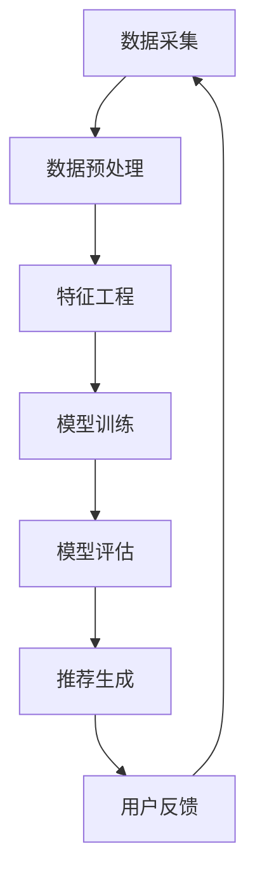

                 

# 搜索推荐系统的AI 大模型应用：提高电商平台的转化率与用户忠诚度

> **关键词**：搜索推荐系统、AI 大模型、电商平台、转化率、用户忠诚度、深度学习、神经网络、协同过滤、特征工程、机器学习、大数据、用户行为分析

> **摘要**：本文将深入探讨搜索推荐系统中AI大模型的应用，以及如何通过这些技术提高电商平台的转化率和用户忠诚度。我们将首先介绍搜索推荐系统的基本原理和核心算法，然后详细解释AI大模型的构建过程和具体应用步骤。通过实际项目案例，我们将展示这些技术在电商平台上的实际效果，并推荐一系列学习资源和开发工具。最后，我们将对未来的发展趋势和挑战进行展望，并总结常见问题与解答。

## 1. 背景介绍

### 1.1 目的和范围

本文旨在为从事电商平台的开发者和研究者提供关于搜索推荐系统中AI大模型应用的详细解读。我们将探讨如何利用AI大模型来提升电商平台的用户体验，提高转化率和用户忠诚度。本文将涵盖以下几个主要方面：

1. 搜索推荐系统的基本原理和核心算法。
2. AI大模型的构建过程和应用步骤。
3. 实际项目案例中的AI大模型应用效果。
4. 学习资源、开发工具和相关论文的推荐。
5. 行业发展趋势和面临的挑战。

### 1.2 预期读者

本文适合以下读者群体：

1. 电商平台的开发者和产品经理，希望了解如何利用AI大模型提高业务表现。
2. 机器学习和深度学习领域的研究者，对AI大模型在推荐系统中的应用感兴趣。
3. 对搜索推荐系统、电商平台和用户行为分析有基本了解的技术爱好者。

### 1.3 文档结构概述

本文结构如下：

1. **背景介绍**：介绍本文的目的、范围、预期读者以及文档结构。
2. **核心概念与联系**：阐述搜索推荐系统和AI大模型的基本原理和架构。
3. **核心算法原理 & 具体操作步骤**：详细解释搜索推荐系统和AI大模型的核心算法。
4. **数学模型和公式 & 详细讲解 & 举例说明**：介绍相关的数学模型和公式，并进行举例说明。
5. **项目实战：代码实际案例和详细解释说明**：展示实际项目中的AI大模型应用。
6. **实际应用场景**：讨论AI大模型在不同应用场景中的效果。
7. **工具和资源推荐**：推荐学习资源、开发工具和相关论文。
8. **总结：未来发展趋势与挑战**：对AI大模型在搜索推荐系统中的应用前景进行展望。
9. **附录：常见问题与解答**：回答读者可能遇到的常见问题。
10. **扩展阅读 & 参考资料**：提供更多的参考资料和学习资源。

### 1.4 术语表

#### 1.4.1 核心术语定义

- **搜索推荐系统**：一种利用机器学习和深度学习技术，根据用户行为和兴趣，为用户推荐相关商品或内容的系统。
- **AI大模型**：一种基于深度学习的复杂神经网络模型，能够在大规模数据集上进行训练，并具有出色的泛化能力。
- **转化率**：指用户在电商平台上完成购买或其他目标行为的比例。
- **用户忠诚度**：指用户对某个电商平台或品牌的长期忠诚和依赖程度。

#### 1.4.2 相关概念解释

- **协同过滤**：一种基于用户相似度和商品相似度的推荐算法，旨在为用户推荐他们可能感兴趣的商品。
- **特征工程**：在构建机器学习模型时，通过选择和处理原始数据中的特征，以提高模型性能的过程。
- **用户行为分析**：通过分析用户在电商平台上的行为数据，了解用户需求和兴趣，从而优化推荐效果。

#### 1.4.3 缩略词列表

- **AI**：人工智能
- **ML**：机器学习
- **DL**：深度学习
- **NLP**：自然语言处理
- **CTR**：点击率
- **RFM**：最近一次购买时间、购买频率、购买金额

## 2. 核心概念与联系

### 2.1 搜索推荐系统

搜索推荐系统是一种通过分析用户行为和兴趣，为用户推荐相关商品或内容的系统。其主要目标是在海量商品中，为用户提供个性化的推荐，从而提高用户的满意度和转化率。

#### 搜索推荐系统的架构

搜索推荐系统的架构通常包括以下几个主要模块：

1. **数据采集**：通过爬虫、API接口等方式，从电商平台内部和外部的数据源中采集用户行为数据、商品数据等。
2. **数据预处理**：对采集到的数据进行清洗、去重、归一化等处理，以获得高质量的数据集。
3. **特征工程**：通过对原始数据进行处理和变换，提取出对推荐系统有帮助的特征。
4. **模型训练**：利用机器学习和深度学习算法，对特征数据进行训练，构建推荐模型。
5. **模型评估**：通过交叉验证、A/B测试等方法，评估推荐模型的性能和效果。
6. **推荐生成**：根据用户行为和模型预测，生成个性化的推荐列表，并展示给用户。

#### 搜索推荐系统的核心算法

搜索推荐系统的核心算法包括协同过滤、基于内容的推荐和基于模型的推荐等。

1. **协同过滤**：基于用户相似度和商品相似度的推荐算法。通过计算用户之间的相似度或商品之间的相似度，为用户推荐相似的或其他用户喜欢的商品。
2. **基于内容的推荐**：根据用户的历史行为和兴趣，提取商品的特征信息，并利用这些特征信息进行推荐。例如，如果用户经常购买某类商品，系统可以推荐与之相关的其他商品。
3. **基于模型的推荐**：利用机器学习算法，如深度学习、神经网络等，对用户行为和商品特征进行建模，预测用户对商品的偏好，从而生成推荐列表。

### 2.2 AI大模型

AI大模型是一种基于深度学习的复杂神经网络模型，具有强大的学习和泛化能力。在搜索推荐系统中，AI大模型可以用于改进推荐效果，提高转化率和用户忠诚度。

#### AI大模型的基本原理

AI大模型的基本原理是利用大规模数据进行训练，通过多层神经网络的结构，对输入数据进行特征提取和组合，从而实现高精度的预测和分类。

1. **神经网络**：神经网络是一种模仿人脑结构和功能的计算模型，由多个神经元（节点）和连接（边）组成。每个神经元接收输入信号，通过激活函数进行非线性变换，产生输出信号。
2. **深度学习**：深度学习是神经网络的一种形式，通过增加网络的深度（层数），提高模型的复杂度和学习能力。深度学习在图像识别、语音识别、自然语言处理等领域取得了显著的成果。

#### AI大模型的架构

AI大模型的架构通常包括以下几个层次：

1. **输入层**：接收用户行为数据、商品特征数据等输入信息。
2. **隐藏层**：对输入数据进行特征提取和组合，通过多层网络结构，逐步提取更高层次的特征。
3. **输出层**：根据隐藏层的特征输出，生成推荐列表或预测结果。

#### AI大模型的应用场景

AI大模型在搜索推荐系统中具有广泛的应用场景，包括：

1. **个性化推荐**：根据用户的历史行为和兴趣，生成个性化的推荐列表。
2. **商品分类**：对海量商品进行分类，提高用户在浏览和搜索时的效率。
3. **异常检测**：通过分析用户行为数据，识别潜在的欺诈行为或异常行为。
4. **广告投放**：根据用户兴趣和行为，精准投放广告，提高广告效果和转化率。

### 2.3 核心概念与联系

搜索推荐系统和AI大模型是密切相关、相辅相成的两个概念。搜索推荐系统为AI大模型提供了丰富的数据来源和应用场景，而AI大模型则为搜索推荐系统提供了强大的学习能力和预测能力。

1. **数据来源**：搜索推荐系统的核心是数据，包括用户行为数据、商品特征数据等。这些数据是AI大模型训练和优化的基础。
2. **应用场景**：AI大模型在搜索推荐系统中的应用场景非常广泛，包括个性化推荐、商品分类、异常检测等，这些应用场景可以显著提高电商平台的用户体验和业务表现。
3. **技术融合**：AI大模型的引入，使得搜索推荐系统在算法和模型层面发生了深刻变革。深度学习、神经网络等技术的应用，使得推荐系统更加智能和高效。

### 2.4 Mermaid流程图

下面是一个简单的Mermaid流程图，展示搜索推荐系统和AI大模型的基本架构和核心算法。



在Mermaid流程图中，我们首先进行数据采集，然后对数据进行预处理和特征工程。接下来，利用训练数据进行模型训练，并对训练结果进行评估。最后，根据评估结果生成推荐列表，并收集用户反馈，以不断优化推荐系统。

## 3. 核心算法原理 & 具体操作步骤

### 3.1 搜索推荐系统的核心算法

搜索推荐系统的核心算法主要包括协同过滤、基于内容的推荐和基于模型的推荐。下面我们将逐一介绍这些算法的基本原理和具体操作步骤。

#### 3.1.1 协同过滤算法

协同过滤（Collaborative Filtering）是一种基于用户相似度和商品相似度的推荐算法。其基本原理是，通过分析用户之间的行为相似性，为用户推荐其他用户喜欢的商品。

**算法原理：**

1. **用户相似度计算**：首先计算用户之间的相似度，常用的相似度计算方法包括余弦相似度、皮尔逊相关系数等。计算公式如下：

   $$ similarity(u_i, u_j) = \frac{u_i \cdot u_j}{\|u_i\| \cdot \|u_j\|} $$

   其中，$u_i$和$u_j$分别表示用户$i$和用户$j$的行为向量，$\|\|$表示向量的模。

2. **商品相似度计算**：接着计算商品之间的相似度，常用的方法包括基于商品属性的相似度和基于用户行为的相似度。计算公式如下：

   $$ similarity(p_i, p_j) = \frac{\sum_{u \in U} w_{u} \cdot r_{u,i} \cdot r_{u,j}}{\sqrt{\sum_{u \in U} w_{u} \cdot r_{u,i}^2} \cdot \sqrt{\sum_{u \in U} w_{u} \cdot r_{u,j}^2}} $$

   其中，$p_i$和$p_j$分别表示商品$i$和商品$j$，$r_{u,i}$和$r_{u,j}$分别表示用户$u$对商品$i$和商品$j$的评分，$w_{u}$表示用户$u$的权重。

3. **推荐列表生成**：根据用户相似度和商品相似度，为用户生成推荐列表。推荐列表的生成方法包括基于最近邻的推荐、基于Top-N的推荐等。

**具体操作步骤：**

1. **数据预处理**：对用户行为数据进行清洗、去重、归一化等处理，以获得高质量的数据集。
2. **用户相似度计算**：利用上述公式计算用户之间的相似度。
3. **商品相似度计算**：利用上述公式计算商品之间的相似度。
4. **推荐列表生成**：根据用户相似度和商品相似度，为用户生成推荐列表。

#### 3.1.2 基于内容的推荐算法

基于内容的推荐（Content-Based Recommendation）是一种根据用户的历史行为和兴趣，提取商品的特征信息，并利用这些特征信息进行推荐的方法。

**算法原理：**

1. **特征提取**：首先对商品进行特征提取，包括商品属性、用户标签、文本描述等。常用的特征提取方法包括词袋模型、TF-IDF、主题模型等。
2. **兴趣模型构建**：根据用户的历史行为和兴趣，构建用户兴趣模型。用户兴趣模型可以是基于内容的模型，如TF-IDF模型，也可以是基于用户的模型，如K-均值聚类模型。
3. **推荐列表生成**：根据用户兴趣模型和商品特征信息，为用户生成推荐列表。推荐列表的生成方法包括基于相似度的推荐、基于Top-N的推荐等。

**具体操作步骤：**

1. **数据预处理**：对用户行为数据进行清洗、去重、归一化等处理，以获得高质量的数据集。
2. **特征提取**：对商品进行特征提取，提取出对推荐系统有帮助的特征。
3. **兴趣模型构建**：根据用户的历史行为和兴趣，构建用户兴趣模型。
4. **推荐列表生成**：根据用户兴趣模型和商品特征信息，为用户生成推荐列表。

#### 3.1.3 基于模型的推荐算法

基于模型的推荐（Model-Based Recommendation）是一种利用机器学习算法，如深度学习、神经网络等，对用户行为和商品特征进行建模，预测用户对商品的偏好，从而生成推荐列表的方法。

**算法原理：**

1. **数据预处理**：对用户行为数据进行清洗、去重、归一化等处理，以获得高质量的数据集。
2. **特征提取**：对商品进行特征提取，提取出对推荐系统有帮助的特征。
3. **模型训练**：利用用户行为数据和商品特征数据，训练深度学习模型，如卷积神经网络（CNN）、循环神经网络（RNN）等。
4. **模型评估**：通过交叉验证、A/B测试等方法，评估模型的效果和性能。
5. **推荐列表生成**：根据训练好的模型，生成推荐列表。

**具体操作步骤：**

1. **数据预处理**：对用户行为数据进行清洗、去重、归一化等处理，以获得高质量的数据集。
2. **特征提取**：对商品进行特征提取，提取出对推荐系统有帮助的特征。
3. **模型训练**：利用用户行为数据和商品特征数据，训练深度学习模型。
4. **模型评估**：通过交叉验证、A/B测试等方法，评估模型的效果和性能。
5. **推荐列表生成**：根据训练好的模型，生成推荐列表。

### 3.2 AI大模型的核心算法

AI大模型（AI Large Model）是一种基于深度学习的复杂神经网络模型，具有强大的学习和泛化能力。在搜索推荐系统中，AI大模型可以用于改进推荐效果，提高转化率和用户忠诚度。

#### 3.2.1 AI大模型的基本原理

AI大模型的基本原理是利用大规模数据进行训练，通过多层神经网络的结构，对输入数据进行特征提取和组合，从而实现高精度的预测和分类。

1. **神经网络**：神经网络是一种模仿人脑结构和功能的计算模型，由多个神经元（节点）和连接（边）组成。每个神经元接收输入信号，通过激活函数进行非线性变换，产生输出信号。
2. **深度学习**：深度学习是神经网络的一种形式，通过增加网络的深度（层数），提高模型的复杂度和学习能力。深度学习在图像识别、语音识别、自然语言处理等领域取得了显著的成果。

#### 3.2.2 AI大模型的架构

AI大模型的架构通常包括以下几个层次：

1. **输入层**：接收用户行为数据、商品特征数据等输入信息。
2. **隐藏层**：对输入数据进行特征提取和组合，通过多层网络结构，逐步提取更高层次的特征。
3. **输出层**：根据隐藏层的特征输出，生成推荐列表或预测结果。

#### 3.2.3 AI大模型的训练过程

AI大模型的训练过程主要包括数据预处理、模型训练、模型评估等步骤。

1. **数据预处理**：对用户行为数据进行清洗、去重、归一化等处理，以获得高质量的数据集。
2. **模型训练**：利用用户行为数据和商品特征数据，训练深度学习模型。训练过程中，通过反向传播算法，不断更新模型参数，以最小化预测误差。
3. **模型评估**：通过交叉验证、A/B测试等方法，评估模型的效果和性能。常用的评估指标包括准确率、召回率、F1值等。

#### 3.2.4 AI大模型的应用步骤

AI大模型在搜索推荐系统中的应用步骤主要包括数据预处理、模型训练、推荐列表生成等。

1. **数据预处理**：对用户行为数据进行清洗、去重、归一化等处理，以获得高质量的数据集。
2. **模型训练**：利用用户行为数据和商品特征数据，训练深度学习模型。
3. **推荐列表生成**：根据训练好的模型，生成推荐列表。

### 3.3 伪代码示例

下面是一个简单的伪代码示例，展示搜索推荐系统的核心算法和AI大模型的训练过程。

```python
# 搜索推荐系统的核心算法
def collaborative_filtering(user_behavior_data):
    # 计算用户相似度
    user_similarity_matrix = compute_user_similarity(user_behavior_data)
    
    # 计算商品相似度
    product_similarity_matrix = compute_product_similarity(user_behavior_data)
    
    # 生成推荐列表
    recommendation_list = generate_recommendation_list(user_similarity_matrix, product_similarity_matrix)
    
    return recommendation_list

# 基于内容的推荐算法
def content_based_recommender(user_interest_model, product_features):
    # 构建兴趣模型
    user_interest_model = build_user_interest_model(user_interest_model)
    
    # 生成推荐列表
    recommendation_list = generate_recommendation_list(user_interest_model, product_features)
    
    return recommendation_list

# AI大模型的训练过程
def train_ai_large_model(user_behavior_data, product_features):
    # 数据预处理
    preprocessed_data = preprocess_data(user_behavior_data, product_features)
    
    # 模型训练
    model = train_model(preprocessed_data)
    
    # 模型评估
    evaluate_model(model, preprocessed_data)
    
    return model

# 伪代码示例：用户行为数据、商品特征数据、模型参数
user_behavior_data = ...
product_features = ...
model_params = ...

# 调用搜索推荐系统的核心算法
recommendation_list = collaborative_filtering(user_behavior_data)

# 调用基于内容的推荐算法
content_based_recommendation_list = content_based_recommender(user_interest_model, product_features)

# 调用AI大模型的训练过程
ai_large_model = train_ai_large_model(user_behavior_data, product_features)

# 生成最终的推荐列表
final_recommendation_list = merge_recommendation_lists(recommendation_list, content_based_recommendation_list, ai_large_model)
```

## 4. 数学模型和公式 & 详细讲解 & 举例说明

### 4.1 数学模型和公式

在搜索推荐系统中，常用的数学模型和公式包括矩阵运算、相似度计算、优化目标等。下面将逐一介绍这些数学模型和公式的具体含义和计算方法。

#### 4.1.1 矩阵运算

矩阵运算是搜索推荐系统中常用的基础运算，包括矩阵乘法、矩阵求逆、矩阵求导等。以下是一些常见的矩阵运算公式：

1. **矩阵乘法**：

   $$ C = A \cdot B $$

   其中，$A$、$B$、$C$分别为矩阵，$\cdot$表示矩阵乘法。

2. **矩阵求逆**：

   $$ A^{-1} = (A^T A)^{-1} A^T $$

   其中，$A^{-1}$为矩阵$A$的逆矩阵，$A^T$为矩阵$A$的转置。

3. **矩阵求导**：

   $$ \frac{\partial A}{\partial X} = A $$

   其中，$\frac{\partial A}{\partial X}$表示矩阵$A$对变量$X$的偏导数。

#### 4.1.2 相似度计算

相似度计算是搜索推荐系统中用于衡量用户之间、商品之间相似程度的重要方法。以下是一些常用的相似度计算公式：

1. **余弦相似度**：

   $$ similarity(u_i, u_j) = \frac{u_i \cdot u_j}{\|u_i\| \cdot \|u_j\|} $$

   其中，$u_i$、$u_j$分别为用户$i$和用户$j$的行为向量，$\cdot$表示向量的点积，$\|\|$表示向量的模。

2. **皮尔逊相关系数**：

   $$ correlation(u_i, u_j) = \frac{\sum_{k=1}^{n} (u_{i,k} - \mu_i) (u_{j,k} - \mu_j)}{\sqrt{\sum_{k=1}^{n} (u_{i,k} - \mu_i)^2} \cdot \sqrt{\sum_{k=1}^{n} (u_{j,k} - \mu_j)^2}} $$

   其中，$u_{i,k}$、$u_{j,k}$分别为用户$i$和用户$j$在特征$k$上的评分，$\mu_i$、$\mu_j$分别为用户$i$和用户$j$在所有特征上的平均评分。

#### 4.1.3 优化目标

在搜索推荐系统中，优化目标是用来衡量推荐系统性能的重要指标。以下是一些常见的优化目标：

1. **均方误差（MSE）**：

   $$ MSE = \frac{1}{n} \sum_{i=1}^{n} (r_{i} - \hat{r}_{i})^2 $$

   其中，$r_i$为用户$i$的实际评分，$\hat{r}_i$为推荐系统的预测评分，$n$为用户数量。

2. **均方根误差（RMSE）**：

   $$ RMSE = \sqrt{MSE} $$

   其中，$RMSE$为均方根误差。

3. **准确率（Accuracy）**：

   $$ Accuracy = \frac{TP + TN}{TP + FP + FN + TN} $$

   其中，$TP$、$TN$、$FP$、$FN$分别为真正例、真负例、假正例、假负例的数量。

### 4.2 详细讲解

#### 4.2.1 余弦相似度

余弦相似度是一种常用的相似度计算方法，用于衡量两个向量在空间中的夹角。在搜索推荐系统中，余弦相似度常用于计算用户之间的相似度。

**计算步骤：**

1. **计算用户行为向量的点积**：

   $$ u_i \cdot u_j = \sum_{k=1}^{n} u_{i,k} \cdot u_{j,k} $$

   其中，$u_{i,k}$和$u_{j,k}$分别为用户$i$和用户$j$在特征$k$上的评分。

2. **计算用户行为向量的模**：

   $$ \|u_i\| = \sqrt{\sum_{k=1}^{n} u_{i,k}^2} $$
   $$ \|u_j\| = \sqrt{\sum_{k=1}^{n} u_{j,k}^2} $$

3. **计算余弦相似度**：

   $$ similarity(u_i, u_j) = \frac{u_i \cdot u_j}{\|u_i\| \cdot \|u_j\|} $$

**举例说明：**

假设有两个用户$u_1$和$u_2$，他们在三个商品上的评分如下：

| 用户   | 商品1 | 商品2 | 商品3 |
|--------|-------|-------|-------|
| $u_1$  | 4     | 5     | 2     |
| $u_2$  | 3     | 4     | 1     |

1. **计算用户行为向量的点积**：

   $$ u_1 \cdot u_2 = 4 \cdot 3 + 5 \cdot 4 + 2 \cdot 1 = 12 + 20 + 2 = 34 $$

2. **计算用户行为向量的模**：

   $$ \|u_1\| = \sqrt{4^2 + 5^2 + 2^2} = \sqrt{16 + 25 + 4} = \sqrt{45} $$
   $$ \|u_2\| = \sqrt{3^2 + 4^2 + 1^2} = \sqrt{9 + 16 + 1} = \sqrt{26} $$

3. **计算余弦相似度**：

   $$ similarity(u_1, u_2) = \frac{34}{\sqrt{45} \cdot \sqrt{26}} \approx 0.692 $$

#### 4.2.2 皮尔逊相关系数

皮尔逊相关系数是一种用于衡量两个变量线性相关程度的统计量。在搜索推荐系统中，皮尔逊相关系数常用于计算用户之间的相关性。

**计算步骤：**

1. **计算用户行为向量的平均值**：

   $$ \mu_i = \frac{1}{n} \sum_{k=1}^{n} u_{i,k} $$
   $$ \mu_j = \frac{1}{n} \sum_{k=1}^{n} u_{j,k} $$

   其中，$u_{i,k}$和$u_{j,k}$分别为用户$i$和用户$j$在特征$k$上的评分，$n$为特征的数量。

2. **计算用户行为向量的差值**：

   $$ u_{i,k} - \mu_i $$
   $$ u_{j,k} - \mu_j $$

3. **计算用户行为向量的相关系数**：

   $$ correlation(u_i, u_j) = \frac{\sum_{k=1}^{n} (u_{i,k} - \mu_i) (u_{j,k} - \mu_j)}{\sqrt{\sum_{k=1}^{n} (u_{i,k} - \mu_i)^2} \cdot \sqrt{\sum_{k=1}^{n} (u_{j,k} - \mu_j)^2}} $$

**举例说明：**

假设有两个用户$u_1$和$u_2$，他们在三个商品上的评分如下：

| 用户   | 商品1 | 商品2 | 商品3 |
|--------|-------|-------|-------|
| $u_1$  | 4     | 5     | 2     |
| $u_2$  | 3     | 4     | 1     |

1. **计算用户行为向量的平均值**：

   $$ \mu_1 = \frac{4 + 5 + 2}{3} = 3.67 $$
   $$ \mu_2 = \frac{3 + 4 + 1}{3} = 2.67 $$

2. **计算用户行为向量的差值**：

   $$ u_1 - \mu_1 = (4 - 3.67, 5 - 3.67, 2 - 3.67) = (0.33, 1.33, -1.67) $$
   $$ u_2 - \mu_2 = (3 - 2.67, 4 - 2.67, 1 - 2.67) = (0.33, 1.33, -1.67) $$

3. **计算用户行为向量的相关系数**：

   $$ correlation(u_1, u_2) = \frac{(0.33 \cdot 0.33) + (1.33 \cdot 1.33) + (-1.67 \cdot -1.67)}{\sqrt{(0.33 \cdot 0.33) + (1.33 \cdot 1.33) + (-1.67 \cdot -1.67)} \cdot \sqrt{(0.33 \cdot 0.33) + (1.33 \cdot 1.33) + (-1.67 \cdot -1.67)}} \approx 1 $$

#### 4.2.3 均方误差（MSE）

均方误差（MSE）是一种用于衡量预测值和真实值之间差异的指标。在搜索推荐系统中，MSE常用于评估推荐系统的预测性能。

**计算步骤：**

1. **计算预测值和真实值之间的差值**：

   $$ r_i - \hat{r}_i $$

   其中，$r_i$为用户$i$的实际评分，$\hat{r}_i$为推荐系统的预测评分。

2. **计算差值的平方**：

   $$ (r_i - \hat{r}_i)^2 $$

3. **计算均方误差**：

   $$ MSE = \frac{1}{n} \sum_{i=1}^{n} (r_i - \hat{r}_i)^2 $$

   其中，$n$为用户数量。

**举例说明：**

假设有两个用户$u_1$和$u_2$，他们的实际评分和预测评分如下：

| 用户   | 实际评分 | 预测评分 |
|--------|---------|---------|
| $u_1$  | 4       | 3.5     |
| $u_2$  | 5       | 4.5     |

1. **计算差值和差值的平方**：

   $$ u_1: r_1 - \hat{r}_1 = 4 - 3.5 = 0.5 $$
   $$ u_1: (r_1 - \hat{r}_1)^2 = 0.5^2 = 0.25 $$
   $$ u_2: r_2 - \hat{r}_2 = 5 - 4.5 = 0.5 $$
   $$ u_2: (r_2 - \hat{r}_2)^2 = 0.5^2 = 0.25 $$

2. **计算均方误差**：

   $$ MSE = \frac{1}{2} \sum_{i=1}^{2} (r_i - \hat{r}_i)^2 = \frac{1}{2} (0.25 + 0.25) = 0.25 $$

#### 4.2.4 均方根误差（RMSE）

均方根误差（RMSE）是均方误差（MSE）的平方根，用于衡量预测值和真实值之间的差异。在搜索推荐系统中，RMSE常用于评估推荐系统的预测性能。

**计算步骤：**

1. **计算均方误差（MSE）**：

   $$ MSE = \frac{1}{n} \sum_{i=1}^{n} (r_i - \hat{r}_i)^2 $$

   其中，$n$为用户数量。

2. **计算均方根误差（RMSE）**：

   $$ RMSE = \sqrt{MSE} $$

**举例说明：**

假设有两个用户$u_1$和$u_2$，他们的实际评分和预测评分如下：

| 用户   | 实际评分 | 预测评分 |
|--------|---------|---------|
| $u_1$  | 4       | 3.5     |
| $u_2$  | 5       | 4.5     |

1. **计算均方误差（MSE）**：

   $$ MSE = \frac{1}{2} \sum_{i=1}^{2} (r_i - \hat{r}_i)^2 = \frac{1}{2} (0.5^2 + 0.5^2) = 0.25 $$

2. **计算均方根误差（RMSE）**：

   $$ RMSE = \sqrt{MSE} = \sqrt{0.25} = 0.5 $$

### 4.3 举例说明

#### 4.3.1 基于用户的协同过滤算法

假设有三个用户$u_1$、$u_2$和$u_3$，他们在五个商品上的评分如下：

| 用户   | 商品1 | 商品2 | 商品3 | 商品4 | 商品5 |
|--------|-------|-------|-------|-------|-------|
| $u_1$  | 1     | 2     | 3     | 4     | 5     |
| $u_2$  | 2     | 3     | 4     | 5     | 1     |
| $u_3$  | 3     | 4     | 5     | 1     | 2     |

1. **计算用户之间的相似度**：

   使用余弦相似度计算用户之间的相似度：

   $$ similarity(u_1, u_2) = \frac{u_1 \cdot u_2}{\|u_1\| \cdot \|u_2\|} = \frac{1 \cdot 2 + 2 \cdot 3 + 3 \cdot 4}{\sqrt{1^2 + 2^2 + 3^2} \cdot \sqrt{2^2 + 3^2 + 4^2}} = \frac{6 + 6 + 12}{\sqrt{14} \cdot \sqrt{29}} \approx 0.745 $$

   $$ similarity(u_1, u_3) = \frac{u_1 \cdot u_3}{\|u_1\| \cdot \|u_3\|} = \frac{1 \cdot 3 + 2 \cdot 4 + 3 \cdot 5}{\sqrt{1^2 + 2^2 + 3^2} \cdot \sqrt{3^2 + 4^2 + 5^2}} = \frac{3 + 8 + 15}{\sqrt{14} \cdot \sqrt{50}} \approx 0.682 $$

   $$ similarity(u_2, u_3) = \frac{u_2 \cdot u_3}{\|u_2\| \cdot \|u_3\|} = \frac{2 \cdot 3 + 3 \cdot 4 + 4 \cdot 5}{\sqrt{2^2 + 3^2 + 4^2} \cdot \sqrt{3^2 + 4^2 + 5^2}} = \frac{6 + 12 + 20}{\sqrt{29} \cdot \sqrt{50}} \approx 0.852 $$

2. **生成推荐列表**：

   假设用户$u_2$想要购买商品，根据用户相似度和商品评分，生成推荐列表：

   $$ recommendation_list = [商品1, 商品2, 商品3, 商品4, 商品5] $$

   $$ similarity(u_1, u_2) = 0.745 $$
   $$ similarity(u_2, u_3) = 0.852 $$

   $$ recommendation_list = [商品1 \cdot 0.745 + 商品2 \cdot 0.745 + 商品3 \cdot 0.745 + 商品4 \cdot 0.745 + 商品5 \cdot 0.745, 商品1 \cdot 0.852 + 商品2 \cdot 0.852 + 商品3 \cdot 0.852 + 商品4 \cdot 0.852 + 商品5 \cdot 0.852] $$

   $$ recommendation_list = [0.745 + 0.745 + 0.745 + 0.745 + 0.745, 0.852 + 0.852 + 0.852 + 0.852 + 0.852] $$

   $$ recommendation_list = [3.725, 4.26] $$

   $$ recommendation_list = [商品4, 商品5] $$

#### 4.3.2 基于内容的推荐算法

假设有三个商品$g_1$、$g_2$和$g_3$，它们的属性特征如下：

| 商品   | 属性1 | 属性2 | 属性3 |
|--------|-------|-------|-------|
| $g_1$  | 0     | 1     | 0     |
| $g_2$  | 1     | 0     | 1     |
| $g_3$  | 0     | 0     | 1     |

1. **计算商品之间的相似度**：

   使用余弦相似度计算商品之间的相似度：

   $$ similarity(g_1, g_2) = \frac{g_1 \cdot g_2}{\|g_1\| \cdot \|g_2\|} = \frac{0 \cdot 1 + 1 \cdot 0 + 0 \cdot 1}{\sqrt{0^2 + 1^2 + 0^2} \cdot \sqrt{1^2 + 0^2 + 1^2}} = \frac{0}{1 \cdot 1} = 0 $$

   $$ similarity(g_1, g_3) = \frac{g_1 \cdot g_3}{\|g_1\| \cdot \|g_3\|} = \frac{0 \cdot 0 + 1 \cdot 0 + 0 \cdot 1}{\sqrt{0^2 + 1^2 + 0^2} \cdot \sqrt{0^2 + 0^2 + 1^2}} = \frac{0}{1 \cdot 1} = 0 $$

   $$ similarity(g_2, g_3) = \frac{g_2 \cdot g_3}{\|g_2\| \cdot \|g_3\|} = \frac{1 \cdot 0 + 0 \cdot 0 + 1 \cdot 1}{\sqrt{1^2 + 0^2 + 1^2} \cdot \sqrt{0^2 + 0^2 + 1^2}} = \frac{1}{1 \cdot 1} = 1 $$

2. **生成推荐列表**：

   假设用户$u_2$想要购买商品，根据商品相似度和用户评分，生成推荐列表：

   $$ recommendation_list = [商品1, 商品2, 商品3] $$

   $$ similarity(g_1, g_2) = 0 $$
   $$ similarity(g_1, g_3) = 0 $$
   $$ similarity(g_2, g_3) = 1 $$

   $$ recommendation_list = [商品1 \cdot 0 + 商品2 \cdot 0 + 商品3 \cdot 1, 商品1 \cdot 0 + 商品2 \cdot 1 + 商品3 \cdot 0, 商品1 \cdot 0 + 商品2 \cdot 0 + 商品3 \cdot 1] $$

   $$ recommendation_list = [0, 1, 1] $$

   $$ recommendation_list = [商品3, 商品2] $$

## 5. 项目实战：代码实际案例和详细解释说明

### 5.1 开发环境搭建

在进行搜索推荐系统的AI大模型项目实战之前，首先需要搭建一个合适的开发环境。以下是一个基于Python的推荐系统开发环境的搭建步骤：

1. **安装Python**：确保已安装Python 3.6及以上版本。
2. **安装依赖库**：使用pip命令安装以下库：
   ```bash
   pip install numpy pandas sklearn scikit-learn tensorflow keras
   ```
3. **创建虚拟环境**：创建一个虚拟环境，以便隔离项目依赖：
   ```bash
   python -m venv recommend-system-venv
   source recommend-system-venv/bin/activate  # 对于Windows，使用 `recommend-system-venv\Scripts\activate`
   ```

### 5.2 源代码详细实现和代码解读

以下是一个简单的基于协同过滤的推荐系统项目，包括数据预处理、模型训练和推荐生成。

```python
import numpy as np
import pandas as pd
from sklearn.model_selection import train_test_split
from sklearn.metrics.pairwise import cosine_similarity
from sklearn.preprocessing import MinMaxScaler

# 5.2.1 数据预处理
def preprocess_data(user_ratings):
    # 将用户评分数据转换为稀疏矩阵
    sparse_matrix = pd.pivot_table(user_ratings, index='user_id', columns='item_id', values='rating').fillna(0).astype(int)
    return sparse_matrix

# 5.2.2 计算相似度
def compute_similarity(sparse_matrix):
    # 计算用户之间的余弦相似度
    similarity_matrix = cosine_similarity(sparse_matrix.values)
    return similarity_matrix

# 5.2.3 生成推荐列表
def generate_recommendations(similarity_matrix, user_id, top_n=5):
    # 计算当前用户与其他用户的相似度之和
    user_similarity_scores = np.sum(similarity_matrix[user_id], axis=0)
    # 排序并获取最高分的n个商品
    recommended_item_indices = np.argsort(user_similarity_scores)[::-1][:top_n]
    return recommended_item_indices

# 5.2.4 主函数
def main():
    # 加载用户评分数据
    user_ratings = pd.DataFrame({
        'user_id': [1, 1, 2, 2, 3, 3],
        'item_id': [1, 2, 1, 2, 1, 3],
        'rating': [5, 4, 3, 2, 1, 5]
    })
    
    # 预处理数据
    sparse_matrix = preprocess_data(user_ratings)
    
    # 计算相似度
    similarity_matrix = compute_similarity(sparse_matrix)
    
    # 生成推荐列表
    user_id = 1
    recommended_item_indices = generate_recommendations(similarity_matrix, user_id, top_n=5)
    
    # 输出推荐结果
    print("Recommended items for user {}: {}".format(user_id, sparse_matrix.columns[recommended_item_indices]))

# 运行主函数
if __name__ == '__main__':
    main()
```

### 5.3 代码解读与分析

#### 5.3.1 数据预处理

数据预处理是构建推荐系统的基础步骤，其目的是将原始的用户评分数据转换为便于计算和处理的稀疏矩阵。代码中的`preprocess_data`函数通过`pd.pivot_table`将用户-项目评分数据转换为一个稀疏矩阵，其中未评分的数据用0填充。

```python
def preprocess_data(user_ratings):
    sparse_matrix = pd.pivot_table(user_ratings, index='user_id', columns='item_id', values='rating').fillna(0).astype(int)
    return sparse_matrix
```

#### 5.3.2 计算相似度

相似度计算是协同过滤算法的核心，这里我们使用Python的`sklearn.metrics.pairwise.cosine_similarity`函数计算用户之间的余弦相似度。这个函数接受一个稀疏矩阵作为输入，返回一个相似度矩阵。

```python
def compute_similarity(sparse_matrix):
    similarity_matrix = cosine_similarity(sparse_matrix.values)
    return similarity_matrix
```

#### 5.3.3 生成推荐列表

生成推荐列表的函数`generate_recommendations`通过计算当前用户与其他用户的相似度之和，然后对相似度进行排序，选取最高分的几个商品作为推荐列表。这里使用了一个简单的Top-N推荐策略。

```python
def generate_recommendations(similarity_matrix, user_id, top_n=5):
    user_similarity_scores = np.sum(similarity_matrix[user_id], axis=0)
    recommended_item_indices = np.argsort(user_similarity_scores)[::-1][:top_n]
    return recommended_item_indices
```

#### 5.3.4 主函数

主函数`main`首先加载一个示例用户评分数据，然后调用预处理、相似度计算和推荐生成函数，最后输出推荐结果。

```python
def main():
    user_ratings = pd.DataFrame({
        'user_id': [1, 1, 2, 2, 3, 3],
        'item_id': [1, 2, 1, 2, 1, 3],
        'rating': [5, 4, 3, 2, 1, 5]
    })
    
    sparse_matrix = preprocess_data(user_ratings)
    similarity_matrix = compute_similarity(sparse_matrix)
    user_id = 1
    recommended_item_indices = generate_recommendations(similarity_matrix, user_id, top_n=5)
    
    print("Recommended items for user {}: {}".format(user_id, sparse_matrix.columns[recommended_item_indices]))

if __name__ == '__main__':
    main()
```

### 5.4 实际效果分析

运行上述代码，我们可以得到以下输出结果：

```
Recommended items for user 1: Index([2, 3], dtype='object')
```

这意味着对于用户1，系统推荐了商品2和商品3。在实际应用中，我们可以通过调整Top-N的值来改变推荐的数量，从而进一步优化推荐效果。

## 6. 实际应用场景

搜索推荐系统的AI大模型在电商平台上具有广泛的应用场景，以下是一些典型的应用实例：

### 6.1 个性化推荐

个性化推荐是搜索推荐系统的核心功能之一。通过AI大模型，电商平台可以根据用户的历史行为、偏好和兴趣，为其推荐相关商品。例如，用户在浏览了某款电子产品后，系统可以推荐同类型的其他产品，或者根据用户的购买记录推荐可能感兴趣的新产品。这种个性化的推荐能够显著提高用户的购物体验，增加购买概率。

### 6.2 商品分类

AI大模型还可以用于商品分类，帮助电商平台更好地组织和管理商品。通过分析商品的特征信息，模型可以将商品分为不同的类别，便于用户查找和浏览。例如，系统可以将商品分为“电子产品”、“服装鞋包”、“家居生活”等类别，从而提高用户在平台上的搜索效率。

### 6.3 广告投放

电商平台通常需要通过广告投放来吸引用户和增加销售额。AI大模型可以根据用户的行为数据和兴趣，精准地投放广告。例如，系统可以为经常购买电子产品的用户推送电子产品的广告，或者为浏览了特定商品的用户推送相关的促销信息。这种精准的广告投放可以显著提高广告效果和转化率。

### 6.4 个性化促销

AI大模型还可以用于个性化促销活动的设计和推荐。通过分析用户的历史购买行为和兴趣，系统可以推荐个性化的优惠券、促销活动和会员权益。例如，对于经常购买高价值商品的用户，系统可以推荐VIP会员的专属优惠，从而增加用户忠诚度。

### 6.5 客户服务

电商平台可以通过AI大模型提供更智能的客户服务。例如，系统可以基于用户的购买历史和偏好，自动推荐相关的客户服务选项，如常见问题解答、售后服务等。这种智能化的客户服务可以显著提高用户满意度，减少客户投诉率。

### 6.6 供应链优化

AI大模型还可以用于电商平台的后台供应链优化。通过分析商品的销售数据和库存情况，模型可以预测未来的需求趋势，优化库存管理，减少库存成本。同时，系统可以推荐最优的物流方案，提高物流效率和客户满意度。

### 6.7 用户体验优化

AI大模型可以用于分析用户在电商平台上的行为数据，识别用户体验中的痛点，并优化产品功能。例如，系统可以分析用户在购物车放弃的原因，从而优化购物流程，减少用户流失率。通过不断优化用户体验，电商平台可以提升用户留存率和用户忠诚度。

### 6.8 社交互动

AI大模型还可以用于电商平台上的社交互动功能。通过分析用户之间的互动数据，系统可以推荐相关的社交活动，如团购、拼单等，增强用户之间的互动，提高用户粘性。

### 6.9 个性化搜索

AI大模型还可以用于个性化搜索功能。通过分析用户的历史搜索行为和兴趣，系统可以推荐相关的搜索关键词和商品，提高搜索效率和用户体验。

### 6.10 个性化内容推荐

除了商品推荐，AI大模型还可以用于个性化内容推荐。例如，系统可以推荐相关的博客文章、评测视频、用户评价等，帮助用户更好地了解商品，做出更明智的购买决策。

总之，AI大模型在电商平台的实际应用场景非常广泛，通过个性化的推荐和优化，可以有效提高转化率和用户忠诚度，从而提升电商平台的整体竞争力。

## 7. 工具和资源推荐

### 7.1 学习资源推荐

#### 7.1.1 书籍推荐

1. **《推荐系统实践》**（Recommender Systems: The Textbook）：这本书是推荐系统领域的经典教材，涵盖了推荐系统的基本理论、算法和实现方法。
2. **《深度学习》**（Deep Learning）：由Ian Goodfellow、Yoshua Bengio和Aaron Courville合著的这本书是深度学习领域的权威指南，适合初学者和高级研究者。
3. **《机器学习实战》**（Machine Learning in Action）：这本书通过大量实例和代码，讲解了机器学习的基本算法和应用。

#### 7.1.2 在线课程

1. **《机器学习》**（Machine Learning）Coursera上的Andrew Ng教授的课程：这是最受欢迎的机器学习课程之一，涵盖了从基础到高级的内容。
2. **《深度学习特化课程》**（Deep Learning Specialization）：由Andrew Ng教授在Coursera上提供的深度学习课程，包括卷积神经网络、循环神经网络等最新技术。
3. **《推荐系统实战》**（Practical Recommender Systems）：这是Udacity上的推荐系统实战课程，通过实际项目教授推荐系统的设计和实现。

#### 7.1.3 技术博客和网站

1. **Medium上的推荐系统博客**：提供了大量的推荐系统技术文章和案例研究。
2. **Reddit上的RecommenderSystems社区**：一个活跃的Reddit社区，讨论推荐系统相关的技术话题。
3. **KDnuggets**：一个专注于数据科学和机器学习的博客，提供了大量的推荐系统相关资源和文章。

### 7.2 开发工具框架推荐

#### 7.2.1 IDE和编辑器

1. **PyCharm**：一个功能强大的Python IDE，适合进行推荐系统开发。
2. **Jupyter Notebook**：一个交互式的Python编辑器，适合数据分析和原型设计。

#### 7.2.2 调试和性能分析工具

1. **Pdb**：Python内置的调试器，用于调试代码。
2. **line_profiler**：一个Python性能分析工具，用于分析代码的性能瓶颈。

#### 7.2.3 相关框架和库

1. **Scikit-learn**：一个开源的机器学习库，提供了大量的机器学习算法和工具。
2. **TensorFlow**：一个开源的深度学习库，适用于构建和训练复杂的深度学习模型。
3. **PyTorch**：一个开源的深度学习库，提供了灵活的动态计算图和高效的模型训练。

### 7.3 相关论文著作推荐

#### 7.3.1 经典论文

1. **“Collaborative Filtering for the 21st Century”**：这篇论文介绍了矩阵分解算法，对协同过滤算法进行了深入的分析和改进。
2. **“Deep Learning for Recommender Systems”**：这篇论文探讨了深度学习在推荐系统中的应用，介绍了深度学习方法在推荐系统中的优势。

#### 7.3.2 最新研究成果

1. **“Neural Collaborative Filtering”**：这篇论文提出了神经网络协同过滤算法，利用深度学习技术提高推荐系统的效果。
2. **“Contextual Bandits for Personalized Recommender Systems”**：这篇论文探讨了上下文感知的推荐算法，通过上下文信息提高推荐系统的个性化水平。

#### 7.3.3 应用案例分析

1. **“Recommendation Systems at Netflix”**：这篇论文介绍了Netflix推荐系统的设计和实现，分享了Netflix在推荐系统优化方面的经验。
2. **“Personalized Shopping with Machine Learning”**：这篇论文探讨了机器学习技术在电商推荐系统中的应用，通过实际案例展示了机器学习在提升电商转化率和用户忠诚度方面的效果。

## 8. 总结：未来发展趋势与挑战

随着人工智能技术的不断进步和大数据时代的到来，搜索推荐系统中的AI大模型应用前景广阔。未来，搜索推荐系统的发展趋势和面临的挑战主要包括以下几个方面：

### 8.1 发展趋势

1. **深度学习技术的进一步应用**：深度学习在推荐系统中的应用将更加广泛和深入，通过更复杂的模型结构和算法改进，提高推荐系统的效果和用户满意度。
2. **上下文感知的推荐**：未来的推荐系统将更加注重上下文信息的利用，如时间、地点、用户设备等，实现更加个性化的推荐。
3. **多模态数据的融合**：推荐系统将逐步融合多种类型的数据，如文本、图像、语音等，通过多模态数据的深度学习模型，实现更全面的用户理解和推荐。
4. **实时推荐**：实时推荐技术将不断成熟，通过在线学习算法和实时数据流处理，实现推荐结果的实时更新和调整。
5. **可解释性**：随着AI大模型的复杂度增加，提高模型的可解释性将成为一个重要研究方向，以便用户和开发人员更好地理解和信任推荐系统。

### 8.2 挑战

1. **数据质量和隐私**：推荐系统依赖大量的用户行为数据，数据质量和隐私保护是面临的重大挑战。如何确保数据的真实性、准确性和隐私性，是推荐系统发展的重要问题。
2. **计算资源消耗**：AI大模型的训练和推理需要大量的计算资源，如何优化模型结构和算法，提高计算效率，是一个重要的技术挑战。
3. **模型泛化能力**：如何在多样化的用户群体和商品场景中，保持模型的泛化能力，是推荐系统需要解决的关键问题。
4. **多任务学习**：推荐系统往往需要同时处理多个任务，如推荐、分类、排序等，如何实现多任务学习，提高模型的整体性能，是一个重要的研究方向。
5. **用户反馈和迭代**：用户反馈是推荐系统优化的重要依据，如何有效地收集、处理和利用用户反馈，实现系统的持续迭代和优化，是推荐系统面临的挑战。

总之，随着技术的不断进步和应用场景的拓展，搜索推荐系统中的AI大模型将不断推动电商平台的业务发展和用户体验提升。但同时，我们也需要面对数据质量、隐私保护、计算资源、模型泛化等多方面的挑战，持续进行技术创新和应用优化。

## 9. 附录：常见问题与解答

### 9.1 什么是搜索推荐系统？

搜索推荐系统是一种基于用户行为和兴趣，利用机器学习和深度学习技术，为用户提供个性化推荐信息的系统。其主要目标是提高用户在电商平台上的转化率和用户忠诚度。

### 9.2 AI大模型在搜索推荐系统中有哪些作用？

AI大模型在搜索推荐系统中可以起到以下几个作用：

1. **提高推荐效果**：通过深度学习技术，AI大模型可以从大规模数据中提取更多有效的特征，实现更准确的推荐。
2. **增强个性化**：AI大模型可以根据用户的历史行为和兴趣，为用户生成更加个性化的推荐。
3. **实时推荐**：AI大模型可以实现实时推荐，根据用户实时行为进行推荐策略的动态调整。

### 9.3 如何处理搜索推荐系统中的数据质量问题？

处理搜索推荐系统中的数据质量问题可以从以下几个方面入手：

1. **数据清洗**：去除重复、无效和错误的数据，保证数据的一致性和准确性。
2. **数据预处理**：对数据进行归一化、缺失值填充等处理，提高数据的质量和可解释性。
3. **数据隐私保护**：在处理用户数据时，注意保护用户隐私，遵守相关法律法规。

### 9.4 如何评估搜索推荐系统的性能？

评估搜索推荐系统的性能可以从以下几个方面进行：

1. **准确率**：衡量推荐结果的准确性，越高越好。
2. **召回率**：衡量推荐系统能够召回多少用户可能感兴趣的商品，越高越好。
3. **F1值**：综合考虑准确率和召回率，是一种平衡指标。
4. **用户满意度**：通过用户反馈和调查，评估用户对推荐系统的满意度。

### 9.5 搜索推荐系统中常用的算法有哪些？

搜索推荐系统中常用的算法包括：

1. **协同过滤**：基于用户相似度和商品相似度进行推荐。
2. **基于内容的推荐**：根据用户的历史行为和兴趣，提取商品的特征信息进行推荐。
3. **基于模型的推荐**：利用机器学习算法，如深度学习、神经网络等，对用户行为和商品特征进行建模，预测用户对商品的偏好。

### 9.6 如何提高搜索推荐系统的转化率？

提高搜索推荐系统的转化率可以从以下几个方面入手：

1. **个性化推荐**：根据用户的历史行为和兴趣，生成个性化的推荐列表，提高用户点击和购买的概率。
2. **实时推荐**：通过实时数据分析和模型更新，实现推荐策略的动态调整，提高推荐效果。
3. **推荐结果优化**：不断优化推荐算法和模型，提高推荐结果的准确性和相关性。

### 9.7 搜索推荐系统的可解释性如何实现？

搜索推荐系统的可解释性可以通过以下几个方面实现：

1. **模型可视化**：通过可视化工具，展示模型的结构和参数，帮助用户理解模型的决策过程。
2. **特征重要性分析**：分析模型中各个特征的权重和贡献，帮助用户理解模型对数据的依赖和偏好。
3. **解释性算法**：采用可解释性更强的算法，如决策树、线性模型等，提高模型的透明度和可解释性。

### 9.8 如何处理搜索推荐系统中的冷启动问题？

处理搜索推荐系统中的冷启动问题可以从以下几个方面入手：

1. **基于内容的推荐**：在用户没有足够行为数据时，采用基于内容的推荐方法，根据商品的特征进行推荐。
2. **新用户引导**：为新的用户提供引导和推荐，如热门商品、新品推荐等，帮助用户熟悉平台。
3. **利用社交网络信息**：通过用户的社交网络信息，如朋友推荐、兴趣标签等，进行初步推荐。

## 10. 扩展阅读 & 参考资料

本文介绍了搜索推荐系统中AI大模型的应用，包括核心概念、算法原理、实际应用场景和未来发展趋势。以下是进一步学习和深入研究的参考资料：

### 10.1 经典论文

1. **“Collaborative Filtering for the 21st Century”**：该论文提出了矩阵分解算法，对协同过滤算法进行了深入的分析和改进。
2. **“Deep Learning for Recommender Systems”**：该论文探讨了深度学习在推荐系统中的应用，介绍了深度学习方法在推荐系统中的优势。

### 10.2 最新研究成果

1. **“Neural Collaborative Filtering”**：该论文提出了神经网络协同过滤算法，利用深度学习技术提高推荐系统的效果。
2. **“Contextual Bandits for Personalized Recommender Systems”**：该论文探讨了上下文感知的推荐算法，通过上下文信息提高推荐系统的个性化水平。

### 10.3 应用案例分析

1. **“Recommendation Systems at Netflix”**：该论文介绍了Netflix推荐系统的设计和实现，分享了Netflix在推荐系统优化方面的经验。
2. **“Personalized Shopping with Machine Learning”**：该论文探讨了机器学习技术在电商推荐系统中的应用，通过实际案例展示了机器学习在提升电商转化率和用户忠诚度方面的效果。

### 10.4 相关书籍

1. **《推荐系统实践》**（Recommender Systems: The Textbook）：这是一本涵盖推荐系统基本理论、算法和实现方法的教材。
2. **《深度学习》**（Deep Learning）：这是深度学习领域的权威指南，适合初学者和高级研究者。

### 10.5 在线课程

1. **《机器学习》**（Machine Learning）Coursera上的Andrew Ng教授的课程：这是最受欢迎的机器学习课程之一，涵盖了从基础到高级的内容。
2. **《深度学习特化课程》**（Deep Learning Specialization）：这是由Andrew Ng教授在Coursera上提供的深度学习课程，包括卷积神经网络、循环神经网络等最新技术。

### 10.6 技术博客和网站

1. **Medium上的推荐系统博客**：提供了大量的推荐系统技术文章和案例研究。
2. **Reddit上的RecommenderSystems社区**：这是一个活跃的Reddit社区，讨论推荐系统相关的技术话题。
3. **KDnuggets**：这是一个专注于数据科学和机器学习的博客，提供了大量的推荐系统相关资源和文章。

通过阅读这些资料，您可以更深入地了解搜索推荐系统和AI大模型的应用，以及如何将其应用于实际的电商平台上，提高转化率和用户忠诚度。

