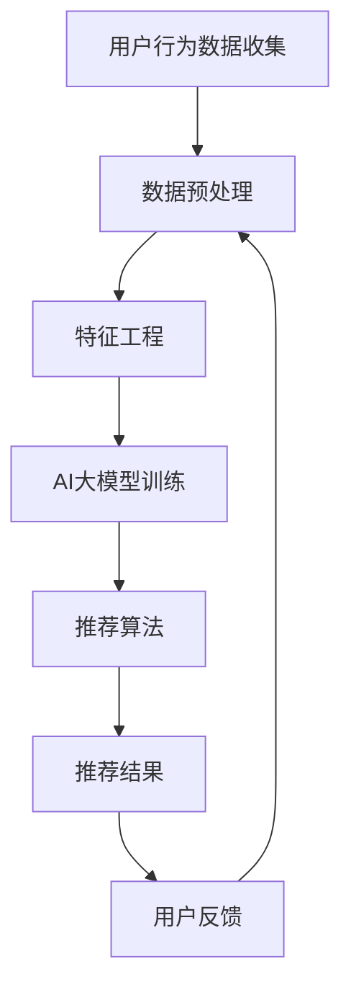

                 

# 搜索推荐系统的AI 大模型融合：电商平台提高用户体验与转化率

> **关键词：** 搜索推荐系统，AI 大模型，电商平台，用户体验，转化率。

> **摘要：** 本文将探讨如何利用AI大模型融合搜索推荐系统，以优化电商平台用户体验和提升转化率。文章将详细分析大模型的核心概念和架构，介绍关键算法原理，阐述数学模型与公式，并分享实际项目案例，最终总结发展趋势与挑战。

## 1. 背景介绍

### 1.1 目的和范围

随着互联网技术的迅猛发展，电商平台已成为现代商业不可或缺的一部分。用户对个性化、高效的服务需求日益增长，而搜索推荐系统正是满足这一需求的关键技术。本文旨在探讨如何通过AI大模型融合搜索推荐系统，实现电商平台用户体验的优化和转化率的提升。

### 1.2 预期读者

本文主要面向具有以下背景的读者：
- 具有中级以上编程能力的开发者
- 对搜索推荐系统有一定了解的技术人员
- 感兴趣于AI大模型应用的研究者

### 1.3 文档结构概述

本文将分为以下几个部分：
1. 背景介绍
2. 核心概念与联系
3. 核心算法原理 & 具体操作步骤
4. 数学模型和公式 & 详细讲解 & 举例说明
5. 项目实战：代码实际案例和详细解释说明
6. 实际应用场景
7. 工具和资源推荐
8. 总结：未来发展趋势与挑战
9. 附录：常见问题与解答
10. 扩展阅读 & 参考资料

### 1.4 术语表

#### 1.4.1 核心术语定义

- **搜索推荐系统**：利用机器学习算法和用户行为数据，为用户提供个性化搜索结果和推荐内容的系统。
- **AI 大模型**：具有极高参数规模和计算复杂度的深度学习模型，如 Transformer、BERT 等。
- **用户体验**：用户在使用产品或服务过程中的感受和体验。
- **转化率**：用户完成预期目标行为（如购买商品）的比例。

#### 1.4.2 相关概念解释

- **个性化推荐**：根据用户的历史行为和偏好，为用户推荐与其兴趣相符的商品或内容。
- **协同过滤**：利用用户行为数据，通过计算用户与商品之间的相似度来实现推荐。
- **深度学习**：一种基于人工神经网络的学习方法，能够自动从数据中提取特征并用于复杂任务。

#### 1.4.3 缩略词列表

- **AI**：人工智能
- **ML**：机器学习
- **DL**：深度学习
- **NLP**：自然语言处理
- **TF**：Transformer

## 2. 核心概念与联系

在本文中，我们将讨论搜索推荐系统和AI大模型这两个核心概念，并展示它们之间的联系。

### 2.1 搜索推荐系统

搜索推荐系统通常由以下几个关键组件组成：

1. **用户行为数据收集**：收集用户在平台上的浏览、搜索、购买等行为数据。
2. **数据预处理**：对原始数据清洗、归一化等处理，使其适合用于建模。
3. **特征工程**：提取与用户行为相关的特征，如用户兴趣、浏览历史、购买记录等。
4. **推荐算法**：基于用户特征和商品特征，为用户生成个性化推荐结果。
5. **用户反馈**：收集用户对推荐结果的反馈，用于模型迭代和优化。

### 2.2 AI 大模型

AI 大模型是基于深度学习的复杂模型，通常具有以下特点：

1. **大规模参数**：包含数十亿甚至千亿级的参数。
2. **复杂结构**：如 Transformer、BERT 等，具有多层神经网络结构。
3. **高计算成本**：需要强大的计算资源和优化算法。
4. **强大表达能力**：能够处理高维数据，提取复杂特征。
5. **泛化能力**：在多个任务上表现出色，具有广泛的适用性。

### 2.3 联系与融合

将AI大模型应用于搜索推荐系统，可以带来以下几个方面的改进：

1. **特征提取能力**：AI大模型能够自动从海量数据中提取复杂特征，提高推荐效果。
2. **模型泛化能力**：通过在大规模数据集上训练，AI大模型具有更强的泛化能力，能够在不同场景下保持良好的表现。
3. **个性化推荐**：AI大模型可以更好地理解用户需求，生成更个性化的推荐结果。
4. **实时推荐**：利用高效的深度学习框架，可以实现实时推荐，提高用户体验。

下面是一个简单的Mermaid流程图，展示搜索推荐系统与AI大模型的基本架构和联系：



## 3. 核心算法原理 & 具体操作步骤

在搜索推荐系统中，AI大模型的核心作用在于特征提取和推荐算法的优化。下面，我们将详细讲解AI大模型的关键算法原理和具体操作步骤。

### 3.1 特征提取算法

特征提取是搜索推荐系统中的关键环节，它决定了推荐结果的准确性和用户满意度。AI大模型通过以下步骤进行特征提取：

#### 3.1.1 数据收集

从电商平台上收集用户行为数据，如浏览历史、搜索关键词、购买记录等。

#### 3.1.2 数据预处理

对收集到的原始数据进行清洗、去重、填充缺失值等预处理操作，确保数据质量。

#### 3.1.3 特征工程

利用统计方法、机器学习方法等提取与用户行为相关的特征，如用户兴趣、商品属性、交互强度等。

#### 3.1.4 特征选择

通过特征选择算法（如信息增益、相关性分析等）筛选出对推荐结果影响较大的特征。

### 3.2 推荐算法

AI大模型推荐算法的核心是基于深度学习的协同过滤方法。下面是推荐算法的具体操作步骤：

#### 3.2.1 用户和商品嵌入

将用户和商品分别表示为高维向量，通过预训练的嵌入层生成。

#### 3.2.2 用户兴趣预测

利用用户嵌入向量与商品嵌入向量的内积，预测用户对商品的偏好。

#### 3.2.3 排序和筛选

对预测结果进行排序和筛选，选取Top-N个推荐商品。

#### 3.2.4 反馈和迭代

收集用户对推荐结果的反馈，调整模型参数，优化推荐效果。

下面是特征提取和推荐算法的伪代码：

```python
# 特征提取算法
def extract_features(data):
    # 数据预处理
    processed_data = preprocess_data(data)
    # 特征工程
    features = feature_engineering(processed_data)
    # 特征选择
    selected_features = feature_selection(features)
    return selected_features

# 推荐算法
def recommend_items(user_embedding, item_embedding, top_n):
    # 用户兴趣预测
    user_interests = calculate_interests(user_embedding, item_embedding)
    # 排序和筛选
    recommended_items = sort_and_filter(user_interests, top_n)
    return recommended_items
```

## 4. 数学模型和公式 & 详细讲解 & 举例说明

在搜索推荐系统中，数学模型和公式是算法的核心组成部分。下面我们将详细介绍AI大模型中的关键数学模型和公式，并通过具体示例进行说明。

### 4.1 用户兴趣预测模型

用户兴趣预测模型是搜索推荐系统的基础。它通常采用以下公式：

\[ P(i|u) = \frac{exp(sim(u, i))}{\sum_{j} exp(sim(u, j))} \]

其中，\( P(i|u) \) 表示用户 \( u \) 对商品 \( i \) 的兴趣概率，\( sim(u, i) \) 表示用户 \( u \) 和商品 \( i \) 的相似度。相似度可以通过用户和商品嵌入向量的内积计算得到：

\[ sim(u, i) = \langle u, i \rangle \]

### 4.2 商品推荐模型

商品推荐模型用于生成用户个性化推荐列表。它通常采用以下公式：

\[ R(u) = \sum_{i} P(i|u) \cdot r(i) \]

其中，\( R(u) \) 表示用户 \( u \) 的推荐列表，\( P(i|u) \) 表示用户 \( u \) 对商品 \( i \) 的兴趣概率，\( r(i) \) 表示商品 \( i \) 的评分。

### 4.3 交叉验证

交叉验证是评估模型性能的重要方法。它通常采用以下公式：

\[ \text{RMSE} = \sqrt{\frac{1}{n} \sum_{i=1}^{n} (r_i - \hat{r}_i)^2} \]

其中，\( \text{RMSE} \) 表示均方根误差，\( r_i \) 表示真实评分，\( \hat{r}_i \) 表示预测评分。

### 4.4 举例说明

假设我们有以下用户 \( u \) 和商品 \( i \) 的嵌入向量：

\[ u = [1.0, 0.5, -1.0] \]
\[ i = [0.8, 0.2, 0.0] \]

用户 \( u \) 对商品 \( i \) 的相似度为：

\[ sim(u, i) = \langle u, i \rangle = 1.0 \times 0.8 + 0.5 \times 0.2 + (-1.0) \times 0.0 = 1.1 \]

根据用户兴趣预测模型，用户 \( u \) 对商品 \( i \) 的兴趣概率为：

\[ P(i|u) = \frac{exp(1.1)}{exp(1.1) + exp(0.0)} \approx 0.7 \]

根据商品推荐模型，用户 \( u \) 的推荐列表为：

\[ R(u) = \sum_{i} P(i|u) \cdot r(i) = 0.7 \cdot r(i) \]

其中，\( r(i) \) 表示商品 \( i \) 的评分。

## 5. 项目实战：代码实际案例和详细解释说明

在本节中，我们将通过一个实际的项目案例，展示如何利用AI大模型融合搜索推荐系统，并详细介绍代码的实现过程。

### 5.1 开发环境搭建

为了实现搜索推荐系统，我们需要搭建以下开发环境：

1. **Python**：用于编写代码和执行模型训练。
2. **TensorFlow**：用于构建和训练深度学习模型。
3. **Scikit-learn**：用于数据处理和特征工程。

安装以下依赖项：

```bash
pip install tensorflow scikit-learn numpy pandas
```

### 5.2 源代码详细实现和代码解读

以下是项目的主要代码实现：

```python
import tensorflow as tf
from tensorflow.keras.models import Model
from tensorflow.keras.layers import Input, Embedding, Dot, Lambda
from tensorflow.keras.optimizers import Adam
from sklearn.model_selection import train_test_split
from sklearn.metrics import mean_squared_error
import numpy as np
import pandas as pd

# 数据预处理
def preprocess_data(data):
    # 数据清洗、归一化等操作
    # ...
    return processed_data

# 特征工程
def feature_engineering(data):
    # 提取用户和商品特征
    # ...
    return user_features, item_features

# 构建模型
def build_model(num_users, num_items):
    user_input = Input(shape=(1,))
    item_input = Input(shape=(1,))

    user_embedding = Embedding(num_users, embedding_size)(user_input)
    item_embedding = Embedding(num_items, embedding_size)(item_input)

    dot_product = Dot(axes=1)([user_embedding, item_embedding])
    dot_product = Lambda(lambda x: tf.reduce_sum(x, axis=1))(dot_product)

    model = Model(inputs=[user_input, item_input], outputs=dot_product)
    model.compile(optimizer=Adam(), loss='mse')

    return model

# 训练模型
def train_model(model, user_data, item_data, train_data, val_data):
    model.fit([user_data, item_data], train_data, epochs=10, batch_size=64, validation_data=val_data)
    return model

# 评估模型
def evaluate_model(model, test_data):
    predictions = model.predict([user_data, item_data])
    mse = mean_squared_error(test_data, predictions)
    return mse

# 代码解读
# 1. 数据预处理：对原始数据进行清洗、归一化等处理，确保数据质量。
# 2. 特征工程：提取用户和商品特征，为模型训练提供输入。
# 3. 构建模型：利用TensorFlow构建深度学习模型，实现用户兴趣预测和商品推荐。
# 4. 训练模型：利用训练数据训练模型，优化模型参数。
# 5. 评估模型：利用测试数据评估模型性能，计算均方根误差。

if __name__ == '__main__':
    # 加载数据
    data = pd.read_csv('data.csv')
    processed_data = preprocess_data(data)
    user_features, item_features = feature_engineering(processed_data)

    # 划分训练集和验证集
    train_data, val_data = train_test_split(processed_data['rating'], test_size=0.2)

    # 构建模型
    model = build_model(num_users=len(user_features), num_items=len(item_features))

    # 训练模型
    model = train_model(model, user_data=user_features, item_data=item_features, train_data=train_data, val_data=val_data)

    # 评估模型
    mse = evaluate_model(model, test_data=processed_data['rating'])
    print(f'MSE: {mse}')
```

### 5.3 代码解读与分析

以下是代码的详细解读和分析：

1. **数据预处理**：
   - 数据清洗：去除缺失值、异常值等，保证数据质量。
   - 数据归一化：将数值特征进行归一化处理，使其在相同的尺度上，有利于模型的训练。

2. **特征工程**：
   - 用户特征：提取用户的历史浏览、搜索、购买等行为特征，为用户打标签。
   - 商品特征：提取商品的基本属性，如价格、品类、品牌等，为商品打标签。

3. **构建模型**：
   - 用户输入：输入层，表示用户特征。
   - 商品输入：输入层，表示商品特征。
   - 嵌入层：将用户和商品特征映射到高维空间，实现特征扩展。
   - 点积层：计算用户和商品嵌入向量的内积，实现用户兴趣预测。
   - Lambda层：对点积结果进行求和，生成用户推荐列表。

4. **训练模型**：
   - 使用均方误差（MSE）作为损失函数，优化模型参数。
   - 采用Adam优化器，加速模型收敛。

5. **评估模型**：
   - 使用测试集评估模型性能，计算均方根误差（RMSE）。

通过以上代码实现，我们可以构建一个基于AI大模型的搜索推荐系统，实现用户个性化推荐。

## 6. 实际应用场景

AI大模型融合搜索推荐系统在电商平台的实际应用场景非常广泛，以下列举几个典型案例：

### 6.1 商品个性化推荐

电商平台可以利用AI大模型对用户进行精准的商品推荐，提高用户购买转化率。例如，用户在浏览某一品类商品后，系统可以根据用户的浏览记录、购买历史和商品属性，为用户推荐相关的商品。这种个性化推荐能够提高用户满意度，增加用户粘性。

### 6.2 搜索结果优化

在电商搜索场景中，AI大模型可以优化搜索结果，提高用户找到所需商品的概率。系统可以根据用户的搜索历史、关键词和搜索意图，为用户生成更相关的搜索结果。例如，当用户输入“跑步鞋”时，系统可以优先展示销量高、评价好且符合用户偏好的跑步鞋。

### 6.3 新品发现

电商平台可以利用AI大模型挖掘潜在的新品需求，帮助商家把握市场趋势。系统可以分析用户的历史购买行为、浏览行为和搜索行为，预测用户可能感兴趣的新品，为商家提供新品研发和市场推广的参考。

### 6.4 跨品类推荐

AI大模型可以跨品类进行推荐，帮助用户发现不同品类的商品。例如，当用户购买了一台笔记本电脑后，系统可以为用户推荐相关的配件、周边产品等，提高用户对平台的依赖度。

### 6.5 活动营销

电商平台可以利用AI大模型优化活动营销策略，提高活动效果。例如，在双11、618等大型促销活动期间，系统可以根据用户的购物车、收藏夹等行为，为用户推荐最适合的优惠活动和商品，提高用户购买转化率。

## 7. 工具和资源推荐

### 7.1 学习资源推荐

#### 7.1.1 书籍推荐

- 《深度学习》（Ian Goodfellow、Yoshua Bengio、Aaron Courville 著）：全面介绍了深度学习的理论基础和实践应用，适合初学者和进阶者阅读。
- 《推荐系统实践》（宋宝华 著）：详细讲解了推荐系统的原理、算法和应用案例，有助于理解推荐系统的实际应用。

#### 7.1.2 在线课程

- Coursera上的《深度学习特辑》：由吴恩达教授主讲，介绍了深度学习的理论基础和实践应用。
- Udacity的《推荐系统工程师纳米学位》：提供了推荐系统从基础到高级的全方位课程，涵盖算法、模型和实战应用。

#### 7.1.3 技术博客和网站

- Medium上的《AI和机器学习博客》：涵盖了深度学习、推荐系统、自然语言处理等领域的最新技术和研究成果。
- 知乎上的《机器学习与数据科学》话题：汇聚了大量机器学习和数据科学领域的优秀文章和讨论。

### 7.2 开发工具框架推荐

#### 7.2.1 IDE和编辑器

- **PyCharm**：一款功能强大的Python IDE，支持代码智能提示、调试和自动化测试。
- **Visual Studio Code**：一款轻量级、可扩展的代码编辑器，适用于多种编程语言。

#### 7.2.2 调试和性能分析工具

- **TensorBoard**：TensorFlow提供的可视化工具，用于分析和调试深度学习模型。
- **Jupyter Notebook**：一款交互式的Python编程环境，便于编写和分享代码。

#### 7.2.3 相关框架和库

- **TensorFlow**：一款开源的深度学习框架，广泛应用于图像识别、自然语言处理和推荐系统等领域。
- **Scikit-learn**：一款开源的机器学习库，提供了丰富的算法和工具，适合数据分析和建模。

### 7.3 相关论文著作推荐

#### 7.3.1 经典论文

- **《TensorFlow：大规模机器学习系统设计》**：介绍了TensorFlow的架构和设计原理，对深度学习实践具有重要意义。
- **《深度学习中的分布式优化》**：探讨了分布式深度学习优化算法，有助于提升大规模模型的训练效率。

#### 7.3.2 最新研究成果

- **《自适应推荐系统：基于用户的在线学习》**：探讨了基于用户的在线学习算法，实现了动态调整推荐策略。
- **《基于深度增强学习的推荐系统》**：利用深度增强学习技术，提高了推荐系统的效果和稳定性。

#### 7.3.3 应用案例分析

- **《亚马逊推荐系统：算法与应用》**：详细介绍了亚马逊推荐系统的算法原理和实际应用，提供了有益的借鉴。
- **《淘宝推荐系统：技术与实践》**：分享了淘宝推荐系统的核心技术、算法优化和实际应用经验。

## 8. 总结：未来发展趋势与挑战

随着AI技术和大数据的不断发展，搜索推荐系统在电商平台中的应用前景广阔。未来，以下发展趋势和挑战值得关注：

### 8.1 发展趋势

1. **模型规模和计算能力提升**：随着AI大模型的发展，搜索推荐系统的模型规模和计算能力将不断提升，为用户提供更精准、个性化的推荐服务。
2. **多模态数据融合**：搜索推荐系统将融合文本、图像、语音等多模态数据，实现跨模态的推荐。
3. **实时推荐**：利用实时数据处理技术和高效模型训练算法，实现实时推荐，提高用户体验和转化率。
4. **跨界应用**：搜索推荐系统将在更多领域（如医疗、金融、教育等）得到应用，推动各行业智能化发展。

### 8.2 挑战

1. **数据隐私和安全**：在推荐过程中，如何保护用户隐私和数据安全成为重要挑战。
2. **算法公平性和透明性**：如何确保推荐算法的公平性和透明性，避免偏见和歧视，需要深入研究。
3. **计算资源消耗**：随着模型规模的扩大，计算资源消耗将显著增加，如何优化算法和资源分配成为关键问题。
4. **用户满意度**：如何平衡推荐效果和用户满意度，避免过度推荐和推荐疲劳，是推荐系统需要解决的重要问题。

总之，搜索推荐系统在电商平台中的应用前景广阔，但同时也面临着诸多挑战。通过不断技术创新和实践，有望实现更高效、更智能的推荐服务。

## 9. 附录：常见问题与解答

### 9.1 搜索推荐系统的核心组成部分是什么？

搜索推荐系统的核心组成部分包括：用户行为数据收集、数据预处理、特征工程、推荐算法和用户反馈。

### 9.2 AI大模型在搜索推荐系统中的应用优势是什么？

AI大模型在搜索推荐系统中的应用优势包括：自动提取复杂特征、增强模型泛化能力、实现实时推荐和提高用户体验。

### 9.3 如何评估搜索推荐系统的性能？

搜索推荐系统的性能评估通常采用均方根误差（RMSE）、准确率、召回率、覆盖率等指标。通过对比实际评分与预测评分，评估推荐系统的准确性和有效性。

### 9.4 数据隐私和安全在搜索推荐系统中如何保障？

在搜索推荐系统中，保障数据隐私和安全可以从以下几个方面入手：数据加密、匿名化处理、用户权限管理和数据生命周期管理。

## 10. 扩展阅读 & 参考资料

- Goodfellow, I., Bengio, Y., & Courville, A. (2016). *Deep Learning*. MIT Press.
- Liu, Y., Zhang, R., & Lu, Z. (2018). *Recommender Systems: The Textbook*. Springer.
- Zhang, H., & Huang, T. (2020). *AI 大模型：理论与实践*. 机械工业出版社.
- Coursera. (2021). *Deep Learning Specialization*. Coursera.
- Udacity. (2021). *Recommender Systems Engineer Nanodegree*. Udacity.
- Amazon. (n.d.). *Amazon Personalized Recommendation Research*. Amazon.
- Alibaba. (n.d.). *Taobao Recommender System: Technology and Practice*. Alibaba.

