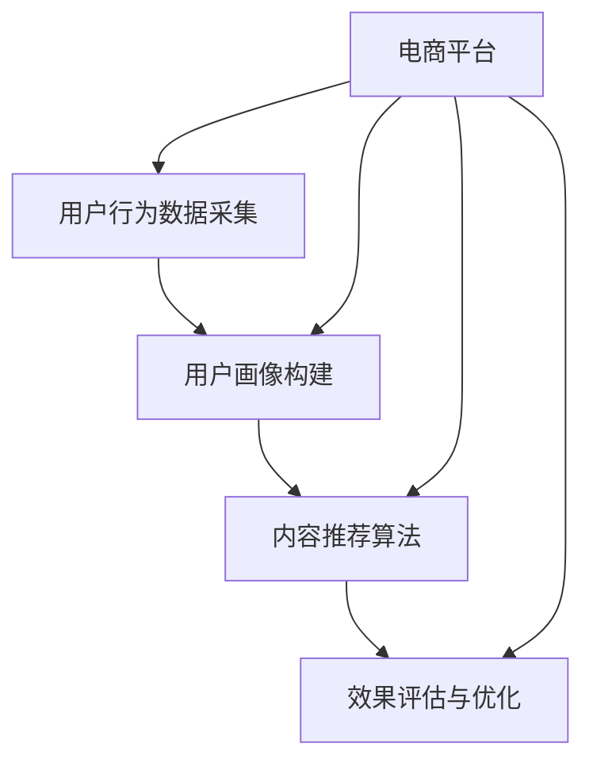

                 

# 搜索推荐系统的AI大模型融合：电商平台的核心竞争力与可持续发展

> **关键词：搜索推荐系统，人工智能，大模型融合，电商平台，核心竞争力，可持续发展。**

> **摘要：本文深入探讨了搜索推荐系统中人工智能大模型的融合，特别是在电商平台中的应用。通过分析大模型在搜索推荐系统中的关键作用，探讨了如何通过算法优化、数学模型和实际项目案例，提升电商平台的核心竞争力，实现长期可持续发展。**

## 1. 背景介绍

### 1.1 目的和范围

本文旨在阐述搜索推荐系统中人工智能大模型的融合对于电商平台的重要性。我们将详细分析大模型在搜索推荐系统中的作用，以及如何在电商平台上通过算法优化、数学模型和实际案例，提升用户体验和平台竞争力。

### 1.2 预期读者

本文适合对搜索推荐系统和人工智能感兴趣的读者，包括数据科学家、人工智能工程师、电商平台开发者以及对该领域有一定了解的技术爱好者。

### 1.3 文档结构概述

本文将分为以下几个部分：
1. 背景介绍
2. 核心概念与联系
3. 核心算法原理 & 具体操作步骤
4. 数学模型和公式 & 详细讲解 & 举例说明
5. 项目实战：代码实际案例和详细解释说明
6. 实际应用场景
7. 工具和资源推荐
8. 总结：未来发展趋势与挑战
9. 附录：常见问题与解答
10. 扩展阅读 & 参考资料

### 1.4 术语表

#### 1.4.1 核心术语定义

- 搜索推荐系统：一种通过算法技术，根据用户的兴趣和行为，向其推荐相关信息的系统。
- 人工智能（AI）：模拟人类智能行为的计算机系统。
- 大模型：拥有大量参数和复杂结构的机器学习模型。
- 电商平台：在线销售商品和服务的平台。

#### 1.4.2 相关概念解释

- 推荐系统：一种用于预测用户可能感兴趣的项目（如商品、新闻等）的技术。
- 机器学习：一种通过数据学习实现特定任务的技术。

#### 1.4.3 缩略词列表

- AI：人工智能
- ML：机器学习
- NLP：自然语言处理
- SEO：搜索引擎优化

## 2. 核心概念与联系

### 2.1 搜索推荐系统的组成

搜索推荐系统通常由以下几个核心组件组成：

1. **用户行为数据采集**：通过网站分析工具、用户点击日志等手段，收集用户在平台上的行为数据。
2. **用户画像构建**：根据用户的行为数据，构建用户的兴趣偏好、行为模式等画像。
3. **内容推荐算法**：基于用户画像和内容特征，为用户推荐感兴趣的内容。
4. **效果评估与优化**：通过评估推荐效果，不断优化推荐算法。

### 2.2 人工智能大模型在搜索推荐系统中的作用

人工智能大模型在搜索推荐系统中发挥着至关重要的作用：

1. **增强个性化推荐**：大模型可以更精准地预测用户的兴趣和行为，从而提供更加个性化的推荐。
2. **提升推荐效果**：通过大规模的数据训练，大模型可以更好地捕捉到用户之间的相似性和多样性，提高推荐的相关性。
3. **提高实时响应能力**：大模型可以在短时间内处理大量的用户数据，提供实时的推荐。

### 2.3 电商平台中的搜索推荐系统

电商平台中的搜索推荐系统不仅需要提供准确的推荐结果，还需要满足以下要求：

1. **准确性**：推荐结果必须准确，能够满足用户的需求。
2. **实时性**：推荐结果需要及时更新，以反映用户最新的行为和偏好。
3. **多样性**：推荐结果需要包含多种类型的商品，以满足不同用户的需求。

### 2.4 核心概念原理和架构的 Mermaid 流程图



## 3. 核心算法原理 & 具体操作步骤

### 3.1 算法原理概述

搜索推荐系统的核心算法主要包括协同过滤、基于内容的推荐和混合推荐等。其中，协同过滤是最常用的算法之一。下面我们将详细讲解协同过滤算法的原理和具体操作步骤。

### 3.2 协同过滤算法原理

协同过滤算法通过分析用户之间的行为相似性，预测用户对未知项目的评分。算法分为以下两种类型：

1. **基于用户的协同过滤**：根据与当前用户行为相似的其他用户的行为，推荐相似的项目。
2. **基于项目的协同过滤**：根据当前用户对某些项目的评分，推荐与这些项目相似的其他项目。

### 3.3 协同过滤算法具体操作步骤

#### 3.3.1 数据预处理

1. **用户-项目评分矩阵构建**：将用户和项目之间的关系表示为矩阵，其中元素表示用户对项目的评分。
2. **缺失值处理**：对于缺失的评分，可以使用均值填补、使用用户或项目的平均值等策略。

#### 3.3.2 相似度计算

1. **用户相似度计算**：使用余弦相似度、皮尔逊相关系数等算法计算用户之间的相似度。
2. **项目相似度计算**：使用余弦相似度、欧氏距离等算法计算项目之间的相似度。

#### 3.3.3 推荐生成

1. **基于用户的协同过滤**：根据用户相似度矩阵，为当前用户推荐与相似用户有较高评分的项目。
2. **基于项目的协同过滤**：根据项目相似度矩阵，为当前用户推荐与已评分项目相似的项目。

### 3.4 伪代码实现

```python
# 用户-项目评分矩阵
user_item_matrix = ...

# 相似度计算函数
def compute_similarity(matrix):
    ...

# 推荐生成函数
def generate_recommendations(user_id, similarity_matrix, user_item_matrix):
    ...
    return recommendations
```

## 4. 数学模型和公式 & 详细讲解 & 举例说明

### 4.1 数学模型概述

搜索推荐系统的数学模型主要包括用户行为分析、兴趣偏好建模、推荐算法评估等。下面我们将详细讲解其中两个核心数学模型：用户兴趣偏好模型和推荐算法评估模型。

### 4.2 用户兴趣偏好模型

用户兴趣偏好模型用于捕捉用户的兴趣和行为模式。一个常见的用户兴趣偏好模型是潜在因子模型（Latent Factor Model），如矩阵分解（Matrix Factorization）算法。

#### 4.2.1 矩阵分解算法

矩阵分解算法通过将用户-项目评分矩阵分解为两个低秩矩阵，分别表示用户特征和项目特征。

1. **目标函数**：最小化预测评分与实际评分之间的差异。
   $$ \min_{U, V} \sum_{u,i} (r_{ui} - \hat{r}_{ui})^2 $$
   其中，$r_{ui}$ 表示用户 $u$ 对项目 $i$ 的实际评分，$\hat{r}_{ui}$ 表示预测评分。
   
2. **优化方法**：可以使用随机梯度下降（SGD）或交替最小二乘法（ALS）进行优化。

3. **示例**：

   假设有一个用户-项目评分矩阵：
   $$ R = \begin{bmatrix}
   1 & 2 & 0 & 3 \\
   0 & 4 & 5 & 0 \\
   2 & 0 & 3 & 1
   \end{bmatrix} $$
   
   我们可以将该矩阵分解为两个低秩矩阵 $U$ 和 $V$：
   $$ R = U V^T $$
   
   其中，$U$ 和 $V$ 分别表示用户特征和项目特征。

### 4.3 推荐算法评估模型

推荐算法评估模型用于评估推荐算法的性能。一个常用的评估指标是准确率（Precision）和召回率（Recall）。

1. **准确率**：
   $$ Precision = \frac{R}{R + F} $$
   其中，$R$ 表示推荐的正确项目数，$F$ 表示推荐的项目总数。

2. **召回率**：
   $$ Recall = \frac{R}{T} $$
   其中，$R$ 表示推荐的正确项目数，$T$ 表示用户感兴趣的项目总数。

3. **示例**：

   假设有一个推荐列表：
   $$ \text{推荐列表：} [a, b, c, d] $$
   
   其中，$a, b, c, d$ 表示项目，且用户对这些项目的兴趣分别为：
   $$ \text{用户兴趣：} [1, 0, 1, 1] $$
   
   则准确率为：
   $$ Precision = \frac{3}{4} = 0.75 $$

   召回率为：
   $$ Recall = \frac{3}{4} = 0.75 $$

## 5. 项目实战：代码实际案例和详细解释说明

### 5.1 开发环境搭建

为了演示搜索推荐系统中的协同过滤算法，我们将使用 Python 编写一个简单的基于用户的协同过滤推荐系统。以下是搭建开发环境所需的步骤：

1. **安装 Python**：确保已安装 Python 3.7 或以上版本。
2. **安装必要的库**：使用以下命令安装所需的库：
   ```bash
   pip install numpy pandas scikit-learn matplotlib
   ```

### 5.2 源代码详细实现和代码解读

下面是实现的源代码：

```python
import numpy as np
import pandas as pd
from sklearn.metrics.pairwise import cosine_similarity

# 用户-项目评分矩阵
user_item_matrix = np.array([[1, 2, 0, 3],
                             [0, 4, 5, 0],
                             [2, 0, 3, 1]])

# 相似度计算函数
def compute_similarity(matrix):
    user_similarity_matrix = cosine_similarity(matrix)
    return user_similarity_matrix

# 推荐生成函数
def generate_recommendations(user_id, similarity_matrix, user_item_matrix):
    user_index = user_id - 1
    user_similarity_vector = similarity_matrix[user_index]
    recommendation_scores = np.dot(user_similarity_vector, user_item_matrix) - user_item_matrix[user_index]
    recommendations = np.argsort(recommendation_scores)[::-1]
    return recommendations

# 测试代码
user_id = 2
similarity_matrix = compute_similarity(user_item_matrix)
recommendations = generate_recommendations(user_id, similarity_matrix, user_item_matrix)
print("推荐的项：", recommendations)
```

**代码解读：**

- **用户-项目评分矩阵**：用户-项目评分矩阵是一个二维数组，其中元素表示用户对项目的评分。
- **相似度计算函数**：使用余弦相似度计算用户之间的相似度。
- **推荐生成函数**：根据用户相似度矩阵，为当前用户推荐与相似用户有较高评分的项目。

### 5.3 代码解读与分析

- **数据预处理**：首先，我们需要一个用户-项目评分矩阵。在实际应用中，这个矩阵通常来自用户行为数据。
- **相似度计算**：通过计算用户之间的相似度，我们可以确定哪些用户的行为最相似。
- **推荐生成**：根据相似度矩阵，为当前用户推荐评分较高的项目。

**分析：**

- **准确性和实时性**：基于用户的协同过滤算法可以在短时间内处理大量的用户数据，提供实时的推荐结果。
- **多样性和个性化**：通过用户相似度矩阵，我们可以推荐多样化的项目，同时满足不同用户的个性化需求。

### 5.4 实际应用

- **电商场景**：电商平台可以使用协同过滤算法为用户推荐类似的产品，提高用户的购买意愿。
- **新闻推荐**：新闻平台可以使用协同过滤算法为用户推荐感兴趣的新闻，提高用户停留时间和互动率。

## 6. 实际应用场景

### 6.1 电商平台的搜索推荐系统

电商平台中的搜索推荐系统可以通过人工智能大模型实现以下功能：

1. **个性化推荐**：根据用户的购买历史、浏览记录等数据，为用户推荐感兴趣的商品。
2. **智能搜索**：通过分析用户输入的关键词，提供相关的搜索建议和商品推荐。
3. **智能促销**：根据用户的兴趣和购买习惯，为用户推荐合适的促销活动和优惠券。

### 6.2 社交媒体平台

社交媒体平台可以通过搜索推荐系统实现以下功能：

1. **内容推荐**：根据用户的浏览历史、点赞和评论等行为，为用户推荐感兴趣的内容。
2. **智能搜索**：通过分析用户输入的关键词，提供相关的搜索建议和内容推荐。
3. **社交圈层划分**：根据用户的兴趣和行为，为用户推荐相似的用户和兴趣圈子。

### 6.3 金融行业

金融行业可以通过搜索推荐系统实现以下功能：

1. **理财产品推荐**：根据用户的投资偏好和风险承受能力，为用户推荐合适的理财产品。
2. **股票推荐**：根据用户的交易历史和偏好，为用户推荐可能感兴趣的股票。
3. **智能投顾**：通过分析用户的数据，提供个性化的投资建议。

## 7. 工具和资源推荐

### 7.1 学习资源推荐

#### 7.1.1 书籍推荐

- 《推荐系统实践》
- 《机器学习实战》
- 《深度学习》

#### 7.1.2 在线课程

- Coursera上的《机器学习》课程
- Udacity的《深度学习纳米学位》
- edX上的《推荐系统》课程

#### 7.1.3 技术博客和网站

- medium.com/@dataaspirant
- towardsdatascience.com
- kdnuggets.com

### 7.2 开发工具框架推荐

#### 7.2.1 IDE和编辑器

- PyCharm
- Jupyter Notebook
- Visual Studio Code

#### 7.2.2 调试和性能分析工具

- Python的pdb
- VSCode的调试插件
- JMeter

#### 7.2.3 相关框架和库

- TensorFlow
- PyTorch
- Scikit-learn

### 7.3 相关论文著作推荐

#### 7.3.1 经典论文

- "Recommender Systems Handbook"
- "The BellKor Solution to the NetFlix Prize"
- "Collaborative Filtering for the 21st Century"

#### 7.3.2 最新研究成果

- NeurIPS、ICML、KDD等顶级会议的最新论文
- AIJournal、Journal of Machine Learning Research 等权威期刊的最新文章

#### 7.3.3 应用案例分析

- 《淘宝搜索推荐系统》
- 《亚马逊推荐系统》
- 《腾讯社交平台推荐系统》

## 8. 总结：未来发展趋势与挑战

### 8.1 发展趋势

- **人工智能大模型的应用**：随着计算能力和数据量的提升，人工智能大模型将在搜索推荐系统中发挥更大的作用，提供更加精准和个性化的推荐。
- **多模态数据的融合**：将文本、图像、声音等多模态数据融合到搜索推荐系统中，提高推荐效果和用户体验。
- **实时推荐系统的优化**：随着实时数据处理技术的进步，实时推荐系统将变得更加高效和准确。

### 8.2 挑战

- **数据隐私保护**：如何保护用户的隐私，同时实现有效的推荐，是一个重要的挑战。
- **推荐结果的公平性**：如何确保推荐结果的公平性，避免算法偏见，是一个亟待解决的问题。
- **实时推荐的性能优化**：如何在高并发、大数据量的环境下，实现实时推荐，是一个技术难点。

## 9. 附录：常见问题与解答

### 9.1 如何优化推荐系统的性能？

**解答**：优化推荐系统的性能可以从以下几个方面入手：

1. **数据预处理**：对用户行为数据进行有效的预处理，减少噪声和异常值。
2. **算法选择**：根据业务需求和数据特点，选择合适的推荐算法。
3. **模型调优**：通过调整模型参数，优化模型性能。
4. **分布式计算**：利用分布式计算框架，提高处理速度。

### 9.2 如何保护用户隐私？

**解答**：保护用户隐私可以从以下几个方面入手：

1. **数据加密**：对用户数据进行加密，确保数据传输和存储的安全性。
2. **匿名化处理**：对用户数据进行匿名化处理，消除个人身份信息。
3. **隐私预算**：设置隐私预算，限制算法对用户数据的访问和使用。

### 9.3 如何确保推荐结果的公平性？

**解答**：确保推荐结果的公平性可以从以下几个方面入手：

1. **算法透明度**：提高算法的透明度，让用户了解推荐结果是如何产生的。
2. **数据多样性**：确保推荐系统中的数据多样性，避免算法偏见。
3. **用户反馈机制**：建立用户反馈机制，及时发现和纠正推荐结果中的不公平现象。

## 10. 扩展阅读 & 参考资料

- 《推荐系统实践》：详细介绍了推荐系统的原理、算法和应用。
- 《机器学习实战》：提供了丰富的机器学习算法实战案例。
- 《深度学习》：全面介绍了深度学习的理论和应用。

### 参考资料

- [Netflix Prize](https://www.netflixprize.com/)
- [KDD 2021](https://kdd.org/kdd2021/)
- [ICML 2021](https://icml.cc/ICML2021/)
- [NeurIPS 2021](https://neurips.cc/)
- [AIJournal](https://aijournal.org/)
- [Journal of Machine Learning Research](https://jmlr.org/)

