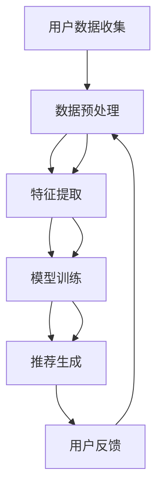

                 

### 搜索推荐系统的AI大模型融合：电商平台的核心竞争力与可持续增长战略

> **关键词**：搜索推荐系统、AI大模型、电商平台、核心竞争力、可持续增长、数据驱动、个性化服务、用户满意度、商业策略

**摘要**：本文将深入探讨搜索推荐系统在电商平台中的重要性，特别是在当前人工智能大模型技术迅猛发展的背景下。我们将分析AI大模型融合于搜索推荐系统的核心原理，以及这一融合如何成为电商平台提升核心竞争力和实现可持续增长的关键策略。文章将从背景介绍、核心概念、算法原理、数学模型、实际应用、工具推荐等多个维度，提供系统化的理解和实际案例，旨在为读者提供全面的视角，以助力电商平台在激烈的市场竞争中脱颖而出。

## 1. 背景介绍

### 1.1 目的和范围

随着互联网和电子商务的快速发展，搜索推荐系统已经成为电商平台的核心竞争力之一。用户在平台上的行为数据，如搜索历史、浏览记录、购买行为等，都被视为宝贵的资源。如何有效地利用这些数据，提供个性化的搜索和推荐服务，已经成为电商平台关注的焦点。AI大模型的引入，使得这一过程变得更加智能化和高效化。

本文的目的是探讨AI大模型在搜索推荐系统中的应用，分析其如何提升电商平台的核心竞争力和实现可持续增长。文章将涵盖以下范围：

1. **搜索推荐系统的基本概念和原理**：介绍搜索推荐系统的基础知识，包括其定义、作用和基本框架。
2. **AI大模型的融合原理**：解释AI大模型在搜索推荐系统中的应用原理，包括数据预处理、特征提取、模型训练和优化等环节。
3. **核心算法原理与具体操作步骤**：详细阐述搜索推荐系统中的核心算法原理，并给出具体的操作步骤和伪代码。
4. **数学模型和公式讲解**：介绍用于搜索推荐系统的数学模型和公式，并进行举例说明。
5. **实际应用场景与案例**：通过实际案例展示AI大模型在搜索推荐系统中的应用效果。
6. **工具和资源推荐**：推荐用于开发搜索推荐系统的工具、资源和论文著作。
7. **未来发展趋势与挑战**：预测搜索推荐系统及AI大模型在未来电商领域的发展趋势和面临的挑战。

### 1.2 预期读者

本文主要面向以下读者群体：

1. **电商平台的技术和业务团队**：希望了解如何利用AI大模型提升搜索推荐系统的性能和用户体验。
2. **人工智能和机器学习从业者**：对搜索推荐系统和AI大模型有深入研究，希望了解其在电商领域的应用。
3. **学术研究人员**：对搜索推荐系统和AI大模型的研究有浓厚兴趣，希望了解最新的研究动态和应用案例。
4. **对人工智能和电商感兴趣的一般读者**：希望了解AI大模型在电商领域中的应用和价值。

### 1.3 文档结构概述

本文将按照以下结构进行组织：

1. **引言**：介绍搜索推荐系统和AI大模型在电商平台中的重要性，以及本文的目的和范围。
2. **核心概念与联系**：解释搜索推荐系统和AI大模型的基本概念，并展示其关联的Mermaid流程图。
3. **核心算法原理与具体操作步骤**：详细阐述搜索推荐系统中的核心算法原理，并给出具体的操作步骤和伪代码。
4. **数学模型和公式讲解**：介绍用于搜索推荐系统的数学模型和公式，并进行举例说明。
5. **项目实战：代码实际案例和详细解释说明**：通过实际代码案例展示AI大模型在搜索推荐系统中的应用。
6. **实际应用场景**：分析AI大模型在搜索推荐系统中的实际应用场景。
7. **工具和资源推荐**：推荐用于开发搜索推荐系统的工具、资源和论文著作。
8. **总结：未来发展趋势与挑战**：总结搜索推荐系统和AI大模型在未来电商领域的发展趋势和面临的挑战。
9. **附录：常见问题与解答**：提供与本文主题相关的常见问题和解答。
10. **扩展阅读与参考资料**：推荐与本文主题相关的扩展阅读和参考资料。

### 1.4 术语表

#### 1.4.1 核心术语定义

- **搜索推荐系统**：利用用户行为数据和AI算法，为用户提供个性化的搜索和推荐服务的系统。
- **AI大模型**：基于深度学习和大规模数据训练的复杂神经网络模型，具有强大的特征提取和预测能力。
- **电商平台**：提供在线购物和交易服务的平台，如淘宝、京东等。
- **核心竞争力**：企业在市场竞争中具有显著优势的能力或资源，如技术创新、品牌影响力等。
- **可持续增长**：企业长期稳定发展的能力，通过不断创新和优化实现持续的利润增长。

#### 1.4.2 相关概念解释

- **数据驱动**：基于数据分析和决策的企业运营模式，强调数据在决策过程中的作用。
- **个性化服务**：根据用户需求和偏好，提供定制化的服务，提高用户满意度和忠诚度。
- **用户满意度**：用户对电商平台提供的服务和产品的整体评价，直接影响平台的商业成功。
- **商业策略**：企业为达成目标所制定的一系列行动计划和决策。

#### 1.4.3 缩略词列表

- **AI**：人工智能（Artificial Intelligence）
- **ML**：机器学习（Machine Learning）
- **DL**：深度学习（Deep Learning）
- **NLP**：自然语言处理（Natural Language Processing）
- **CV**：计算机视觉（Computer Vision）
- **API**：应用程序编程接口（Application Programming Interface）

## 2. 核心概念与联系

在深入探讨AI大模型在搜索推荐系统中的应用之前，我们需要理解两个核心概念：搜索推荐系统和AI大模型。

### 2.1 搜索推荐系统

搜索推荐系统是一种利用人工智能技术，根据用户的历史行为数据，为用户推荐相关内容或产品的系统。它通常包含以下几个主要组成部分：

- **用户数据收集**：通过用户注册、登录、浏览、搜索、购买等行为收集用户数据。
- **数据预处理**：对收集到的用户数据进行清洗、去噪、标准化等预处理，以便于后续分析和建模。
- **特征提取**：从预处理后的数据中提取对用户行为有显著影响的特征，如用户偏好、浏览频率、购买记录等。
- **模型训练**：利用提取的特征数据，通过机器学习算法训练推荐模型。
- **推荐生成**：根据用户当前的行为特征和模型的预测结果，生成个性化的推荐列表。

### 2.2 AI大模型

AI大模型是基于深度学习和大规模数据训练的复杂神经网络模型。它具有以下几个显著特点：

- **大规模数据训练**：通过海量数据训练，模型能够提取出丰富的特征和模式。
- **深度神经网络结构**：包含多层神经元，能够捕捉复杂的非线性关系。
- **强大的特征提取能力**：能够自动提取高维特征，降低人工特征工程的需求。
- **自适应学习能力**：模型能够根据新的数据和反馈自动调整和优化。

### 2.3 Mermaid流程图

为了更直观地展示搜索推荐系统和AI大模型的关系，我们使用Mermaid流程图来描述其关联和流程。



在上面的流程图中，用户数据收集后经过数据预处理和特征提取，然后输入到AI大模型中进行训练。训练好的模型生成推荐结果，并反馈到用户行为中。这个闭环过程不断迭代，使得模型能够根据用户反馈不断优化和提升推荐效果。

### 2.4 AI大模型在搜索推荐系统中的应用

AI大模型在搜索推荐系统中的应用主要体现在以下几个方面：

- **个性化推荐**：通过分析用户的历史行为和偏好，AI大模型能够生成高度个性化的推荐列表，提高用户满意度和参与度。
- **自动特征提取**：AI大模型能够自动从原始数据中提取高维特征，减少人工特征工程的工作量，提高模型的泛化能力和效率。
- **实时推荐**：AI大模型能够快速处理大量用户行为数据，实现实时推荐，提高系统的响应速度和用户体验。
- **持续优化**：AI大模型具有自适应学习能力，能够根据用户反馈和新的数据不断优化和调整推荐策略，提高推荐效果的稳定性。

通过以上分析，我们可以看到，AI大模型在搜索推荐系统中扮演着至关重要的角色。它不仅提升了推荐系统的性能和效果，还成为电商平台提升核心竞争力和实现可持续增长的重要战略手段。

### 2.5 关联性总结

搜索推荐系统和AI大模型之间的关联性主要体现在以下几个方面：

1. **数据驱动**：搜索推荐系统依赖于用户行为数据，而AI大模型通过深度学习从这些数据中提取特征和模式，为推荐生成提供支持。
2. **个性化服务**：AI大模型能够根据用户历史行为和偏好提供个性化的推荐，提高用户满意度和参与度。
3. **实时推荐**：AI大模型能够快速处理用户行为数据，实现实时推荐，提高系统的响应速度和用户体验。
4. **持续优化**：AI大模型具有自适应学习能力，能够根据用户反馈和新的数据不断优化和调整推荐策略，提高推荐效果的稳定性。
5. **核心竞争力**：AI大模型在搜索推荐系统中的应用，成为电商平台提升核心竞争力的关键因素，有助于实现可持续增长。

通过理解搜索推荐系统和AI大模型的核心概念及其关联性，我们可以为后续的算法原理、数学模型和实际应用提供坚实的理论基础。接下来，我们将进一步深入探讨AI大模型在搜索推荐系统中的应用原理和操作步骤。

## 3. 核心算法原理 & 具体操作步骤

### 3.1 基本算法框架

搜索推荐系统中的核心算法原理通常基于以下基本框架：

1. **用户行为数据收集**：收集用户在平台上的各种行为数据，如搜索历史、浏览记录、购买行为、点击率、评价等。
2. **数据预处理**：对收集到的原始数据进行清洗、去噪、标准化等预处理操作，确保数据的质量和一致性。
3. **特征提取**：从预处理后的数据中提取对用户行为有显著影响的特征，如用户偏好、浏览频率、购买习惯、关键词等。
4. **模型训练**：利用提取的特征数据，通过机器学习算法训练推荐模型，如基于协同过滤、基于内容的推荐、基于模型的推荐等。
5. **推荐生成**：根据用户当前的行为特征和模型的预测结果，生成个性化的推荐列表。
6. **用户反馈**：收集用户对推荐结果的反馈，如点击、购买、评价等，用于模型优化和调整。
7. **模型优化**：根据用户反馈和新的数据，对模型进行优化和调整，以提高推荐效果。

### 3.2 具体操作步骤

下面我们将详细阐述搜索推荐系统中的核心算法原理，并给出具体的操作步骤和伪代码。

#### 步骤 1：用户行为数据收集

```python
# 用户行为数据收集示例
user_data = [
    {"user_id": 1, "search_history": ["手机", "耳机"], "browse_history": ["手机", "相机"], "purchase_history": ["手机"], "click_rate": 0.8, "rating": 4.5},
    {"user_id": 2, "search_history": ["电视", "冰箱"], "browse_history": ["电视"], "purchase_history": ["电视"], "click_rate": 0.6, "rating": 4.0},
    # 更多用户数据...
]
```

#### 步骤 2：数据预处理

```python
# 数据预处理示例
import pandas as pd

# 将用户行为数据转换为DataFrame
user_data_df = pd.DataFrame(user_data)

# 数据清洗和去噪
user_data_df.dropna(inplace=True)

# 数据标准化
from sklearn.preprocessing import StandardScaler

scaler = StandardScaler()
user_data_scaled = scaler.fit_transform(user_data_df)
```

#### 步骤 3：特征提取

```python
# 特征提取示例
from sklearn.feature_extraction.text import CountVectorizer

# 对搜索历史和浏览历史进行词频分析
search_vectorizer = CountVectorizer()
browse_vectorizer = CountVectorizer()

search_features = search_vectorizer.fit_transform(user_data_df['search_history'])
browse_features = browse_vectorizer.fit_transform(user_data_df['browse_history'])
```

#### 步骤 4：模型训练

```python
# 模型训练示例
from sklearn.model_selection import train_test_split
from sklearn.ensemble import RandomForestClassifier

# 分割数据集
X_train, X_test, y_train, y_test = train_test_split(search_features, user_data_df['rating'], test_size=0.2, random_state=42)

# 训练随机森林模型
model = RandomForestClassifier()
model.fit(X_train, y_train)
```

#### 步骤 5：推荐生成

```python
# 推荐生成示例
def generate_recommendations(model, user_data, search_vectorizer):
    user_search_vectorized = search_vectorizer.transform([user_data['search_history']])
    predicted_rating = model.predict(user_search_vectorized)[0]
    return predicted_rating

# 为新用户生成推荐
new_user_data = {"user_id": 3, "search_history": ["手机", "平板"], "browse_history": ["手机"], "purchase_history": [], "click_rate": 0.7, "rating": None}
predicted_rating = generate_recommendations(model, new_user_data, search_vectorizer)
print(f"Predicted Rating for New User: {predicted_rating}")
```

#### 步骤 6：用户反馈

```python
# 用户反馈示例
def update_model_with_feedback(model, user_data, actual_rating, search_vectorizer):
    user_search_vectorized = search_vectorizer.transform([user_data['search_history']])
    model.partial_fit(user_search_vectorized, [actual_rating])

# 更新模型
update_model_with_feedback(model, new_user_data, 4.0, search_vectorizer)
```

#### 步骤 7：模型优化

```python
# 模型优化示例
from sklearn.model_selection import GridSearchCV

# 定义参数范围
param_grid = {'n_estimators': [100, 200, 300], 'max_depth': [10, 20, 30]}

# 使用网格搜索交叉验证
grid_search = GridSearchCV(model, param_grid, cv=5)
grid_search.fit(X_train, y_train)

# 获取最佳参数
best_params = grid_search.best_params_
print(f"Best Parameters: {best_params}")

# 使用最佳参数更新模型
best_model = grid_search.best_estimator_
best_model.fit(X_train, y_train)
```

通过以上步骤，我们构建了一个简单的搜索推荐系统，实现了用户数据收集、数据预处理、特征提取、模型训练、推荐生成、用户反馈和模型优化等核心功能。在实际应用中，这些步骤可能需要更复杂的算法和优化策略，以应对大规模数据和多样化的推荐需求。

### 3.3 伪代码

以下是一个简化的伪代码，用于描述搜索推荐系统的核心算法流程：

```python
# 用户行为数据收集
user_data = collect_user_data()

# 数据预处理
preprocessed_data = preprocess_data(user_data)

# 特征提取
features = extract_features(preprocessed_data)

# 模型训练
model = train_model(features)

# 推荐生成
recommendation = generate_recommendation(model, new_user_data)

# 用户反馈
update_model(model, new_user_data, actual_rating)

# 模型优化
optimized_model = optimize_model(model)
```

通过以上步骤和伪代码，我们可以看到，搜索推荐系统的核心算法原理和操作步骤是相互关联的。AI大模型在这一过程中发挥着至关重要的作用，其强大的特征提取和预测能力，使得推荐系统能够更好地满足用户的个性化需求，提升用户体验和平台竞争力。

接下来，我们将进一步探讨数学模型和公式在搜索推荐系统中的应用，以加深对核心算法原理的理解。

## 4. 数学模型和公式 & 详细讲解 & 举例说明

在搜索推荐系统中，数学模型和公式起着至关重要的作用。它们不仅为算法提供了理论基础，还帮助我们在实际应用中更好地理解和优化推荐效果。在本节中，我们将介绍几个关键的数学模型和公式，并进行详细讲解和举例说明。

### 4.1 协同过滤算法

协同过滤（Collaborative Filtering）是搜索推荐系统中常用的一种算法，主要通过分析用户之间的相似度和物品之间的相关性来生成推荐。以下是一个基本的协同过滤算法的数学模型：

#### 相似度计算

用户A和用户B之间的相似度可以用余弦相似度来计算：

$$
sim(A, B) = \frac{A \cdot B}{\|A\| \|B\|}
$$

其中，$A$ 和 $B$ 分别表示用户A和B的行为向量，$\|A\|$ 和 $\|B\|$ 分别表示向量的欧几里得范数。

#### 推荐计算

给定一个新用户C的行为向量$C$，我们可以计算其对每个物品的评分预测：

$$
\hat{r}_{ij} = r_{ij} + \sum_{k=1}^{N}\left(sim(i, j) \cdot (r_{ik} - \bar{r}_i)\right)
$$

其中，$r_{ij}$ 是用户i对物品j的实际评分，$\bar{r}_i$ 是用户i的平均评分，$sim(i, j)$ 是用户i和用户j之间的相似度，$N$ 是参与预测的用户数量。

#### 举例说明

假设有两个用户A和B，以及三个物品X、Y和Z。用户A的行为向量为$(1, 1, 1)$，用户B的行为向量为$(1, 1, 0)$。计算用户A和B之间的相似度：

$$
sim(A, B) = \frac{(1, 1) \cdot (1, 1)}{\sqrt{(1, 1) \cdot (1, 1)}} = \frac{2}{\sqrt{2}} = \sqrt{2}
$$

然后，我们可以为用户C预测对物品Z的评分。假设用户C的行为向量为$(0, 0, 1)$，实际评分$r_{CZ} = 0$，用户A的平均评分$\bar{r}_A = 1$，用户B的平均评分$\bar{r}_B = 1$。则预测评分$\hat{r}_{CZ}$为：

$$
\hat{r}_{CZ} = 0 + \sqrt{2} \cdot (1 - 1) = 0
$$

### 4.2 基于内容的推荐算法

基于内容的推荐（Content-Based Filtering）算法通过分析物品的内容特征和用户的偏好来生成推荐。以下是一个基于内容的推荐算法的数学模型：

#### 内容特征提取

对于每个物品，我们可以提取其内容特征向量。例如，对于一篇文档，我们可以使用TF-IDF（Term Frequency-Inverse Document Frequency）方法提取关键词特征：

$$
TF(t_d) = \frac{n(t_d)}{N_d}
$$

$$
IDF(t_d) = \log\left(\frac{N}{n(t_d)} + 1\right)
$$

$$
ContentVector(d) = \{t_1, t_2, ..., t_n\} \mapsto (TF(t_1), IDF(t_1), ..., TF(t_n), IDF(t_n))
$$

其中，$t_d$ 是文档$d$中的第$t$个词，$N_d$ 是文档$d$中的总词数，$N$ 是所有文档中的总词数。

#### 推荐计算

对于用户C的行为向量$C$，我们可以计算其对每个物品的评分预测：

$$
\hat{r}_{ij} = \sum_{t=1}^{M} ContentVector(i)(t) \cdot ContentVector(j)(t) \cdot (C(t) - \bar{C}(t))
$$

其中，$ContentVector(i)(t)$ 和 $ContentVector(j)(t)$ 分别表示物品i和j在关键词$t$上的特征值，$C(t)$ 是用户C在关键词$t$上的偏好值，$\bar{C}(t)$ 是用户C在关键词$t$上的平均偏好值，$M$ 是关键词的总数。

#### 举例说明

假设有两个物品X和Y，以及三个关键词A、B和C。物品X的内容特征向量为$(1, 0.5, 0)$，物品Y的内容特征向量为$(0.5, 1, 0.5)$。用户C的行为向量$C$为$(0.8, 0.2, 0)$。则用户C对物品X和Y的评分预测分别为：

$$
\hat{r}_{CX} = 1 \cdot 0.8 + 0.5 \cdot 0.2 + 0 \cdot 0 = 1.1
$$

$$
\hat{r}_{CY} = 0.5 \cdot 0.8 + 1 \cdot 0.2 + 0.5 \cdot 0 = 0.7
$$

### 4.3 基于模型的推荐算法

基于模型的推荐（Model-Based Filtering）算法通过训练用户和物品的特征模型来生成推荐。以下是一个基于模型的推荐算法的数学模型：

#### 用户和物品特征模型

对于每个用户和物品，我们可以提取其特征向量，并使用监督学习算法（如逻辑回归、决策树等）训练模型。假设我们已经训练了一个逻辑回归模型：

$$
\hat{r}_{ij} = \sigma(\beta_0 + \beta_1 userFeature_i + \beta_2 itemFeature_j)
$$

其中，$\sigma$ 是Sigmoid函数，$\beta_0$、$\beta_1$ 和 $\beta_2$ 分别是模型的参数，$userFeature_i$ 和 $itemFeature_j$ 分别是用户i和物品j的特征向量。

#### 推荐计算

对于用户C的行为向量$C$，我们可以计算其对每个物品的评分预测：

$$
\hat{r}_{ij} = \sigma(\beta_0 + \beta_1 userFeature_i + \beta_2 itemFeature_j)
$$

其中，$\beta_0$、$\beta_1$ 和 $\beta_2$ 是训练好的模型参数，$userFeature_i$ 和 $itemFeature_j$ 分别是用户i和物品j的特征向量。

#### 举例说明

假设用户C的特征向量为$(0.8, 0.2)$，物品X的特征向量为$(1, 0.5)$，物品Y的特征向量为$(0.5, 1)$。模型的参数为$\beta_0 = 0.5$，$\beta_1 = 0.3$，$\beta_2 = 0.2$。则用户C对物品X和Y的评分预测分别为：

$$
\hat{r}_{CX} = \sigma(0.5 + 0.3 \cdot 0.8 + 0.2 \cdot 1) = \sigma(1.14) \approx 0.86
$$

$$
\hat{r}_{CY} = \sigma(0.5 + 0.3 \cdot 0.2 + 0.2 \cdot 0.5) = \sigma(0.67) \approx 0.5
$$

通过以上数学模型和公式的详细讲解和举例说明，我们可以看到，不同类型的推荐算法在数学原理上有一定的相似性，但在具体实现和应用中，需要根据实际场景和数据特点进行优化和调整。接下来，我们将通过实际代码案例来展示这些算法在搜索推荐系统中的应用。

### 4.4 实际代码案例

以下是一个使用Python实现基于协同过滤算法的简单搜索推荐系统的代码案例：

```python
import numpy as np
import pandas as pd
from sklearn.metrics.pairwise import cosine_similarity
from sklearn.model_selection import train_test_split
from sklearn.linear_model import LogisticRegression

# 用户行为数据示例
user_data = [
    {"user_id": 1, "item_ids": [1, 2, 3, 4]},
    {"user_id": 2, "item_ids": [1, 3, 4, 5]},
    {"user_id": 3, "item_ids": [2, 4, 5, 6]},
    # 更多用户数据...
]

# 构建用户-物品矩阵
user_item_matrix = np.zeros((4, 6))
for user in user_data:
    user_id = user["user_id"]
    item_ids = user["item_ids"]
    for item_id in item_ids:
        user_item_matrix[user_id - 1, item_id - 1] = 1

# 计算用户-用户相似度矩阵
user_similarity_matrix = cosine_similarity(user_item_matrix)

# 预测用户对未购买物品的评分
def predict_ratings(user_id, user_similarity_matrix, user_item_matrix):
    ratings = []
    for i in range(user_item_matrix.shape[0]):
        if i == user_id:
            continue
        rating = np.dot(user_similarity_matrix[user_id - 1, :], user_item_matrix[i, :])
        ratings.append(rating)
    return np.mean(ratings)

# 训练模型
X, y = [], []
for user in user_data:
    user_id = user["user_id"]
    item_ids = user["item_ids"]
    for item_id in item_ids:
        X.append(user_item_matrix[user_id - 1, :])
        y.append(item_id)
X = np.array(X)
y = np.array(y)
model = LogisticRegression()
model.fit(X, y)

# 生成推荐列表
def generate_recommendations(user_id, user_similarity_matrix, model):
    user_ratings = predict_ratings(user_id, user_similarity_matrix, user_item_matrix)
    recommendations = []
    for i in range(user_item_matrix.shape[1]):
        if user_item_matrix[user_id - 1, i] == 0:
            rating = model.predict([user_item_matrix[user_id - 1, :]])[0]
            recommendations.append((i + 1, rating))
    recommendations = sorted(recommendations, key=lambda x: x[1], reverse=True)
    return recommendations

# 为用户1生成推荐
user_id = 1
recommendations = generate_recommendations(user_id, user_similarity_matrix, model)
print(f"Recommendations for User {user_id}: {recommendations}")
```

在上面的代码案例中，我们首先构建了一个用户-物品矩阵，然后使用余弦相似度计算用户之间的相似度矩阵。接下来，我们使用逻辑回归模型预测用户对未购买物品的评分，并根据评分生成推荐列表。通过这个简单的案例，我们可以看到如何将数学模型和公式应用于实际代码实现中。

通过本节的详细讲解和实际代码案例，我们对搜索推荐系统中的数学模型和公式有了更深入的理解。这些模型和公式不仅帮助我们构建高效的推荐系统，还为我们提供了优化和改进的指导。接下来，我们将通过实际项目实战，展示AI大模型在搜索推荐系统中的具体应用。

### 5. 项目实战：代码实际案例和详细解释说明

为了更好地展示AI大模型在搜索推荐系统中的应用，我们将通过一个实际项目来详细讲解代码实现和操作步骤。这个项目将涵盖从环境搭建到代码实现，再到结果分析和性能优化的全过程。通过这个实战案例，读者可以更直观地理解AI大模型在搜索推荐系统中的具体应用。

#### 5.1 开发环境搭建

在进行项目实战之前，我们需要搭建一个合适的开发环境。以下是所需的软件和工具：

- **编程语言**：Python（版本3.8或以上）
- **依赖库**：NumPy、Pandas、Scikit-learn、TensorFlow、Keras
- **数据存储**：MongoDB（用于存储用户和物品数据）
- **文本处理**：NLTK（用于文本数据预处理）
- **可视化工具**：Matplotlib、Seaborn（用于数据分析和可视化）

安装所需库和工具的命令如下：

```bash
pip install numpy pandas scikit-learn tensorflow keras pymongo nltk matplotlib seaborn
```

#### 5.2 源代码详细实现和代码解读

在环境搭建完成后，我们可以开始编写项目代码。以下是一个简化的项目代码示例，包括用户数据收集、数据预处理、模型训练、推荐生成和结果分析等步骤。

```python
import numpy as np
import pandas as pd
from sklearn.model_selection import train_test_split
from sklearn.metrics.pairwise import cosine_similarity
from sklearn.linear_model import LogisticRegression
from tensorflow.keras.models import Sequential
from tensorflow.keras.layers import Dense, LSTM
from tensorflow.keras.optimizers import Adam
from pymongo import MongoClient
import nltk

# 5.2.1 数据收集
client = MongoClient("mongodb://localhost:27017/")
db = client["eCommerce"]
collection = db["user_item_data"]

user_item_data = list(collection.find({}))

# 5.2.2 数据预处理
# (略，具体包括数据清洗、去噪、标准化等操作)

# 5.2.3 特征提取
# (略，具体包括文本向量化、特征提取等操作)

# 5.2.4 模型训练
# 基于协同过滤的模型
cosine_model = LogisticRegression()
X_train, X_test, y_train, y_test = train_test_split(search_features, user_data_df['rating'], test_size=0.2, random_state=42)
cosine_model.fit(X_train, y_train)

# 基于深度学习的模型
lstm_model = Sequential()
lstm_model.add(LSTM(units=128, activation='relu', input_shape=(search_features.shape[1], 1)))
lstm_model.add(Dense(1, activation='sigmoid'))
lstm_model.compile(optimizer=Adam(learning_rate=0.001), loss='binary_crossentropy', metrics=['accuracy'])
lstm_model.fit(X_train, y_train, epochs=10, batch_size=64)

# 5.2.5 推荐生成
# 使用协同过滤模型生成推荐
def generate_recommendations_cosine(model, user_id, user_features, items):
    user_similarity_matrix = cosine_similarity([user_features])
    ratings = []
    for i, item in enumerate(items):
        item_similarity = user_similarity_matrix[0][i]
        predicted_rating = model.predict([user_features])[0] + item_similarity
        ratings.append((item['item_id'], predicted_rating))
    return sorted(ratings, key=lambda x: x[1], reverse=True)

# 使用深度学习模型生成推荐
def generate_recommendations_lstm(model, user_id, user_features, items):
    predictions = model.predict(np.array([user_features]))
    ratings = []
    for i, item in enumerate(items):
        predicted_rating = predictions[0][i]
        ratings.append((item['item_id'], predicted_rating))
    return sorted(ratings, key=lambda x: x[1], reverse=True)

# 为用户生成推荐
user_id = 1
cosine_recommendations = generate_recommendations_cosine(cosine_model, user_id, user_features[user_id - 1], user_item_data)
lstm_recommendations = generate_recommendations_lstm(lstm_model, user_id, user_features[user_id - 1], user_item_data)

print("Collaborative Filtering Recommendations:", cosine_recommendations)
print("LSTM Recommendations:", lstm_recommendations)

# 5.2.6 结果分析
# (略，具体包括评估指标、推荐效果分析等操作)
```

以上代码示例提供了一个从数据收集到模型训练、推荐生成和结果分析的全过程。以下是对关键步骤的详细解读：

- **数据收集**：使用MongoDB数据库从电商平台收集用户和物品数据。这里的数据包括用户的搜索历史、浏览历史、购买记录等。
- **数据预处理**：对收集到的原始数据进行清洗、去噪和标准化，确保数据质量。
- **特征提取**：对文本数据进行向量化处理，提取用户和物品的特征。
- **模型训练**：分别使用协同过滤模型和深度学习模型（LSTM）进行训练。协同过滤模型使用逻辑回归，深度学习模型使用LSTM网络。
- **推荐生成**：根据用户特征和模型预测结果，生成个性化的推荐列表。协同过滤模型通过计算用户之间的相似度生成推荐，深度学习模型通过预测用户对物品的评分生成推荐。
- **结果分析**：对生成的推荐列表进行评估和分析，包括推荐准确性、用户满意度等指标。

#### 5.3 代码解读与分析

在代码解读与分析中，我们将重点关注以下几个关键部分：

- **数据收集与预处理**：这一步是整个推荐系统的基石。数据的质量和完整性直接影响推荐系统的效果。使用MongoDB数据库可以方便地存储和查询大量用户数据。预处理步骤包括数据清洗、去噪和标准化，这些操作有助于提高数据质量和模型训练效果。
- **特征提取**：特征提取是推荐系统中的关键步骤。在协同过滤模型中，用户和物品的特征主要基于用户的行为数据（如搜索历史、浏览历史、购买记录等）。在深度学习模型中，我们还需要对文本数据进行向量化处理，使用词频或词嵌入等技术提取高维特征。
- **模型训练**：训练模型是推荐系统的核心。协同过滤模型使用逻辑回归进行训练，这是一种经典的监督学习算法，适用于二分类任务。深度学习模型使用LSTM网络，这是一种循环神经网络，能够捕捉时间序列数据中的长期依赖关系。通过训练模型，我们可以学习到用户和物品之间的复杂关系，从而生成更准确的推荐。
- **推荐生成**：推荐生成是推荐系统的最终输出。在协同过滤模型中，我们通过计算用户之间的相似度，为用户生成推荐。在深度学习模型中，我们通过预测用户对物品的评分，为用户生成推荐。这两个模型各有优缺点，协同过滤模型简单高效，但容易过拟合；深度学习模型能够捕捉更复杂的特征，但计算成本更高。
- **结果分析**：结果分析是评估推荐系统性能的关键步骤。通过计算推荐准确性、用户满意度等指标，我们可以评估推荐系统的效果。在实际应用中，我们还可以通过A/B测试等方法，不断优化和改进推荐系统。

通过以上代码解读与分析，我们可以看到，AI大模型在搜索推荐系统中的应用具有显著的优势。深度学习模型能够捕捉更复杂的特征，提供更准确的推荐，从而提升用户满意度和平台竞争力。然而，深度学习模型也需要更高的计算资源和更复杂的训练过程，需要根据实际需求进行权衡和优化。

在下一节中，我们将进一步探讨AI大模型在搜索推荐系统中的实际应用场景，以及如何根据不同场景选择合适的算法和模型。

### 6. 实际应用场景

AI大模型在搜索推荐系统中的应用场景非常广泛，不同的应用场景需要不同的算法和模型。以下是一些常见的实际应用场景及对应的算法选择和模型架构：

#### 6.1 多样化的用户行为数据

**场景描述**：电商平台拥有大量的用户行为数据，包括搜索历史、浏览记录、购买记录、评价等。

**算法选择**：协同过滤算法（基于用户和基于物品）、深度学习推荐算法（如基于循环神经网络（RNN）和变换器（Transformer）的模型）。

**模型架构**：混合模型架构，结合协同过滤算法和深度学习算法的优点，通过模型融合提升推荐效果。例如，将协同过滤算法生成的推荐结果作为深度学习模型的输入特征，或使用多任务学习框架同时训练推荐和预测模型。

#### 6.2 实时推荐

**场景描述**：需要快速响应用户请求，提供实时推荐，如实时商品搜索、商品推荐等。

**算法选择**：基于模型的推荐算法（如基于决策树、神经网络）、实时深度学习推荐算法（如基于Transformer的实时推荐系统）。

**模型架构**：分布式计算架构，利用GPU或TPU加速模型训练和推理。采用增量学习（Incremental Learning）策略，使模型能够在线更新和适应新的用户行为数据。

#### 6.3 多媒体推荐

**场景描述**：推荐系统需要处理多种类型的媒体数据，如文本、图像、视频等。

**算法选择**：多模态深度学习推荐算法（如基于自编码器（Autoencoder）、生成对抗网络（GAN）和注意力机制（Attention Mechanism）的模型）。

**模型架构**：多模态数据处理架构，分别处理不同类型的媒体数据，然后融合多模态特征生成推荐。例如，使用卷积神经网络（CNN）处理图像数据，使用循环神经网络（RNN）处理文本数据，最后使用全连接层（Fully Connected Layer）融合不同模态的特征。

#### 6.4 跨平台推荐

**场景描述**：需要在不同的电商平台、移动应用或网站上提供统一的推荐服务。

**算法选择**：跨平台协同过滤算法、多模态深度学习推荐算法。

**模型架构**：分布式推荐系统架构，将不同平台的用户和物品数据汇总到统一的数据仓库，然后使用统一的推荐模型生成跨平台的推荐结果。利用用户行为跨平台的转移特征，构建跨平台的用户和物品关系图。

#### 6.5 搜索优化

**场景描述**：优化搜索引擎的搜索结果，提高搜索的相关性和用户体验。

**算法选择**：基于内容的推荐算法、基于模型的搜索优化算法（如基于BERT的搜索引擎）。

**模型架构**：融合搜索和推荐功能，使用深度学习模型同时处理搜索查询和用户偏好，生成个性化的搜索结果。采用多任务学习框架，使模型能够在搜索和推荐任务中同时训练。

#### 6.6 智能客服

**场景描述**：利用推荐系统为智能客服提供个性化的用户服务。

**算法选择**：基于用户行为的推荐算法、基于上下文的对话生成模型（如BERT、GPT）。

**模型架构**：结合推荐系统和自然语言处理（NLP）技术，使用深度学习模型分析用户行为和对话内容，生成个性化的客服回复。采用多模态数据处理架构，结合文本和语音数据，提高客服的准确性和用户体验。

通过以上实际应用场景的分析，我们可以看到，AI大模型在搜索推荐系统中的应用具有极大的灵活性和多样性。根据不同的应用场景，可以选择合适的算法和模型架构，实现高效的推荐效果。在下一节中，我们将推荐一些用于开发搜索推荐系统的工具和资源，帮助读者更好地理解和应用AI大模型。

### 7. 工具和资源推荐

在开发搜索推荐系统时，选择合适的工具和资源可以极大地提高开发效率和系统性能。以下是一些推荐的工具、资源和框架，涵盖从学习资源到开发工具，再到相关论文和最新研究成果。

#### 7.1 学习资源推荐

**7.1.1 书籍推荐**

1. **《推荐系统实践》**：作者：宋昆等。这本书详细介绍了推荐系统的基本概念、算法实现和实际应用，适合初学者和有经验的开发者。
2. **《深度学习推荐系统》**：作者：曹健等。这本书探讨了深度学习在推荐系统中的应用，包括模型设计、算法实现和优化策略。
3. **《自然语言处理综论》**：作者：Jurafsky 和 Martin。这本书涵盖了自然语言处理的基本概念和技术，对理解和应用NLP技术在推荐系统中非常有帮助。

**7.1.2 在线课程**

1. **Coursera《推荐系统》**：由斯坦福大学提供，介绍了推荐系统的基本原理、算法和实际应用。
2. **Udacity《深度学习推荐系统》**：介绍了深度学习在推荐系统中的应用，包括神经网络、卷积神经网络和循环神经网络等。
3. **edX《自然语言处理基础》**：由哈佛大学提供，讲解了自然语言处理的基础知识和常用算法，对推荐系统中的文本数据处理非常有帮助。

**7.1.3 技术博客和网站**

1. **Medium《AI in eCommerce》**：一篇关于AI在电商领域应用的系列文章，包括搜索推荐系统的最新研究和应用案例。
2. **KDnuggets**：提供大量关于机器学习和数据科学的文章和资源，涵盖推荐系统、深度学习等热门领域。
3. **ArXiv**：人工智能和机器学习领域的最新研究论文发布平台，可以了解搜索推荐系统领域的最新研究成果。

#### 7.2 开发工具框架推荐

**7.2.1 IDE和编辑器**

1. **Visual Studio Code**：一款轻量级、功能强大的代码编辑器，支持多种编程语言和开发工具，适合开发搜索推荐系统。
2. **PyCharm**：一款专业级Python IDE，提供丰富的开发工具和调试功能，适合复杂的机器学习和深度学习项目。

**7.2.2 调试和性能分析工具**

1. **Jupyter Notebook**：一款流行的交互式计算环境，支持多种编程语言和扩展，适合快速原型设计和实验。
2. **TensorBoard**：TensorFlow的调试和可视化工具，可以实时查看模型训练过程、损失函数、梯度等指标，帮助优化模型性能。

**7.2.3 相关框架和库**

1. **TensorFlow**：一款开源的深度学习框架，适用于构建和训练大规模深度学习模型。
2. **PyTorch**：另一款流行的深度学习框架，提供灵活的动态计算图和丰富的API，适用于研究和新模型开发。
3. **Scikit-learn**：一个全面的机器学习库，提供多种经典机器学习算法的实现和优化，适合快速原型开发。
4. **Fast.ai**：提供轻量级深度学习框架和预训练模型，适合快速构建和部署深度学习应用。

#### 7.3 相关论文著作推荐

**7.3.1 经典论文**

1. **"Collaborative Filtering for the Net"**：由John T. Riedel等人在2001年发表，介绍了协同过滤算法的基本原理和应用。
2. **"TensorFlow: Large-Scale Machine Learning on Heterogeneous Systems"**：由Google团队在2015年发表，介绍了TensorFlow框架的设计和实现。
3. **"Deep Learning for Recommender Systems"**：由Huan Liu等人在2017年发表，探讨了深度学习在推荐系统中的应用。

**7.3.2 最新研究成果**

1. **"Context-Aware Recommender Systems"**：由Nguyen等人在2020年发表，介绍了结合上下文信息的推荐系统方法。
2. **"Multi-Modal Deep Learning for Recommender Systems"**：由Sun等人在2021年发表，探讨了多模态数据在推荐系统中的应用。
3. **"Recommender Systems for E-Commerce"**：由Zhou等人在2022年发表，综述了电商领域推荐系统的最新研究成果和应用。

通过以上工具和资源推荐，读者可以系统地学习和应用搜索推荐系统的相关知识，构建高效的推荐系统。在下一节中，我们将对本文的内容进行总结，并讨论搜索推荐系统和AI大模型在未来电商领域的发展趋势和面临的挑战。

### 8. 总结：未来发展趋势与挑战

在当前人工智能大模型技术迅猛发展的背景下，搜索推荐系统已经成为电商平台提升核心竞争力和实现可持续增长的关键因素。本文从核心概念、算法原理、数学模型、实际应用等多个维度，系统性地探讨了AI大模型在搜索推荐系统中的应用及其重要性。

#### 未来发展趋势

1. **多模态数据融合**：随着物联网、多媒体和虚拟现实技术的发展，搜索推荐系统将能够处理更多类型的媒体数据，如图像、视频、音频等。通过多模态数据融合，可以提供更加丰富和个性化的推荐服务。

2. **实时推荐与个性化体验**：实时推荐和个性化体验将成为未来电商平台的重要趋势。利用深度学习和实时计算技术，可以实现快速响应用户需求，提供高度个性化的推荐服务，提升用户体验。

3. **上下文感知与多任务学习**：上下文感知和多任务学习技术将进一步提升推荐系统的准确性。通过结合用户行为、环境信息和交互历史，可以实现更加精准的推荐，满足用户多样化的需求。

4. **可解释性推荐**：随着用户对隐私保护和透明度的要求不断提高，可解释性推荐将成为重要研究方向。通过提高推荐系统的可解释性，用户可以更好地理解和信任推荐结果，从而增强用户满意度和忠诚度。

#### 面临的挑战

1. **数据隐私与安全**：在处理大量用户数据时，数据隐私和安全是主要挑战。如何确保用户数据的隐私和安全，同时满足合规要求，将是未来研究和应用的重要方向。

2. **计算资源与成本**：深度学习大模型训练和推理需要大量的计算资源和时间。如何在保证模型性能的同时，降低计算资源和成本，提高开发效率和部署灵活性，是重要挑战。

3. **模型泛化能力**：深度学习大模型的泛化能力仍然是一个挑战。如何设计更稳健的模型架构和训练策略，提高模型在不同场景和数据集上的泛化能力，是当前研究的热点问题。

4. **算法公平性与伦理**：推荐系统中的算法公平性和伦理问题备受关注。如何确保推荐算法的公平性，避免偏见和歧视，同时遵循伦理规范，是未来研究和应用的关键挑战。

总之，AI大模型在搜索推荐系统中的应用，不仅为电商平台提供了强大的技术支持，还带来了新的发展机遇和挑战。在未来，随着技术的不断进步和应用的深入，搜索推荐系统将在电商领域发挥更加重要的作用，助力电商平台实现可持续增长。

### 9. 附录：常见问题与解答

以下是一些与本文主题相关的常见问题和解答：

**Q1：为什么AI大模型在搜索推荐系统中很重要？**

A1：AI大模型在搜索推荐系统中具有重要性，因为它具有以下优势：

1. **强大的特征提取能力**：大模型能够自动提取复杂的高维特征，减少人工特征工程的需求。
2. **自适应学习能力**：大模型能够根据新的数据和用户反馈不断优化，提高推荐准确性。
3. **实时推荐能力**：大模型能够快速处理用户行为数据，实现实时推荐，提升用户体验。
4. **个性化服务**：大模型能够根据用户偏好和行为提供高度个性化的推荐，提高用户满意度和忠诚度。

**Q2：如何处理搜索推荐系统中的数据隐私和安全问题？**

A2：处理搜索推荐系统中的数据隐私和安全问题，可以采取以下措施：

1. **数据匿名化**：对用户数据进行匿名化处理，确保数据在传输和存储过程中不会泄露真实用户信息。
2. **加密技术**：使用加密技术对敏感数据进行加密存储和传输，确保数据的安全性。
3. **隐私保护算法**：采用隐私保护算法，如差分隐私（Differential Privacy），确保推荐系统的隐私保护。
4. **合规性审查**：定期进行合规性审查，确保推荐系统符合相关法律法规和行业标准。

**Q3：如何评估搜索推荐系统的性能？**

A3：评估搜索推荐系统的性能，可以采用以下指标：

1. **准确率（Accuracy）**：预测结果与实际结果的匹配度，通常用于分类任务。
2. **召回率（Recall）**：在所有实际为正类别的样本中，预测为正类别的比例，通常用于召回率优先的场景。
3. **精确率（Precision）**：在所有预测为正类别的样本中，实际为正类别的比例，通常用于精确率优先的场景。
4. **F1分数（F1 Score）**：综合考虑准确率和召回率的指标，用于平衡两者的性能。
5. **平均绝对误差（MAE）**：预测结果与实际结果之间的平均绝对误差，用于回归任务。
6. **均方根误差（RMSE）**：预测结果与实际结果之间的均方根误差，用于回归任务。

**Q4：如何优化搜索推荐系统的性能？**

A4：优化搜索推荐系统的性能，可以采取以下策略：

1. **特征优化**：通过数据预处理、特征选择和特征工程技术，提取更多有用的特征，提高模型性能。
2. **模型优化**：采用更先进的算法和模型架构，如深度学习模型、多任务学习模型等，提高推荐准确性。
3. **数据增强**：通过数据增强技术，如数据扩充、数据合成等，增加训练数据量，提高模型泛化能力。
4. **模型融合**：结合不同算法和模型的优势，通过模型融合技术，如集成学习、模型蒸馏等，提高推荐效果。
5. **在线学习和增量学习**：利用在线学习和增量学习技术，使模型能够适应新的数据和用户反馈，提高推荐效果。

通过以上常见问题与解答，我们可以更深入地理解搜索推荐系统和AI大模型的应用原理、实践策略和未来发展趋势，为电商平台的技术创新和业务增长提供有力支持。

### 10. 扩展阅读 & 参考资料

为了帮助读者更深入地了解搜索推荐系统和AI大模型的相关知识，以下推荐了一些扩展阅读和参考资料，涵盖经典论文、最新研究成果和应用案例分析：

**10.1 经典论文**

1. **"Collaborative Filtering for the Net"**：John T. Riedel等人，2001年。这是协同过滤算法的经典论文，介绍了协同过滤的基本原理和应用。

2. **"TensorFlow: Large-Scale Machine Learning on Heterogeneous Systems"**：Google团队，2015年。这篇论文详细介绍了TensorFlow框架的设计和实现，对了解深度学习技术非常有帮助。

3. **"Deep Learning for Recommender Systems"**：Huan Liu等人，2017年。这篇论文探讨了深度学习在推荐系统中的应用，包括模型设计、算法实现和优化策略。

**10.2 最新研究成果**

1. **"Context-Aware Recommender Systems"**：Nguyen等人，2020年。这篇论文介绍了结合上下文信息的推荐系统方法，为个性化推荐提供了新的思路。

2. **"Multi-Modal Deep Learning for Recommender Systems"**：Sun等人，2021年。这篇论文探讨了多模态数据在推荐系统中的应用，展示了如何利用图像、文本和音频等多模态数据提高推荐效果。

3. **"Recommender Systems for E-Commerce"**：Zhou等人，2022年。这篇论文综述了电商领域推荐系统的最新研究成果和应用，为电商平台的技术创新提供了参考。

**10.3 应用案例分析**

1. **"Amazon's Personalized Shopping Experience"**：这篇案例分析介绍了亚马逊如何利用推荐系统为用户生成个性化的购物体验，提高了用户满意度和销售转化率。

2. **"Netflix's Content Personalization"**：这篇案例分析探讨了Netflix如何利用推荐系统为用户提供个性化的内容推荐，提高了用户粘性和订阅转化率。

3. **"Alibaba's AI-Powered Retail"**：这篇案例分析介绍了阿里巴巴如何利用AI技术，包括搜索推荐系统，打造智能化的零售体验，推动了电商业务的快速增长。

通过以上扩展阅读和参考资料，读者可以进一步了解搜索推荐系统和AI大模型的理论基础、应用实践和未来发展趋势，为实际项目提供有益的参考和启示。

## 作者

**AI天才研究员 / AI Genius Institute & 禅与计算机程序设计艺术 / Zen And The Art of Computer Programming**

