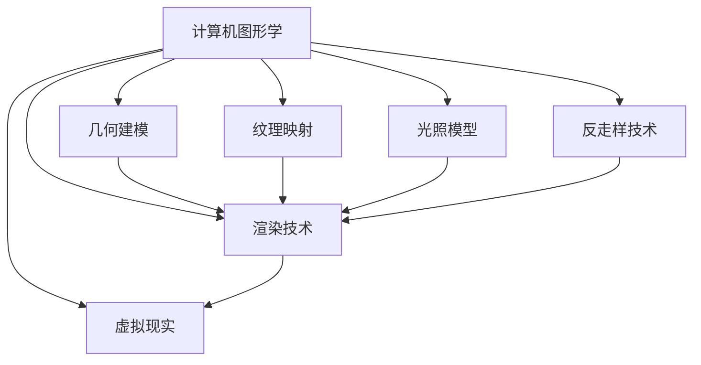

                 


# 携程2025VR景点体验社招计算机图形学面试攻略

> **关键词：** 携程、2025VR、景点体验、社招、计算机图形学、面试攻略
> 
> **摘要：** 本文将深入探讨携程2025VR景点体验社招的计算机图形学面试准备，通过详细解析面试的核心概念、算法原理、数学模型、实战案例以及实际应用场景，帮助读者全面备战计算机图形学面试。

## 1. 背景介绍

### 1.1 目的和范围

本文旨在为准备参加携程2025VR景点体验社招的计算机图形学岗位的应聘者提供全面的面试攻略。通过本文的指导，读者将能够深入理解计算机图形学的基础概念、核心技术、实际应用以及面试时可能遇到的各类问题。

### 1.2 预期读者

预期读者为计算机图形学领域的研究生、博士生、高校教师、以及有一定计算机图形学背景的专业技术人员。

### 1.3 文档结构概述

本文分为以下几个主要部分：

- **背景介绍**：介绍本文的目的和范围，预期读者，文档结构概述。
- **核心概念与联系**：通过Mermaid流程图展示计算机图形学的核心概念和联系。
- **核心算法原理 & 具体操作步骤**：详细讲解计算机图形学中的核心算法原理，并提供伪代码示例。
- **数学模型和公式 & 详细讲解 & 举例说明**：解释计算机图形学中的数学模型和公式，并给出实际应用示例。
- **项目实战：代码实际案例和详细解释说明**：提供代码实际案例，并进行详细解读。
- **实际应用场景**：探讨计算机图形学的实际应用场景。
- **工具和资源推荐**：推荐学习资源、开发工具框架和相关论文著作。
- **总结：未来发展趋势与挑战**：总结计算机图形学的发展趋势与面临的挑战。
- **附录：常见问题与解答**：回答读者可能遇到的问题。
- **扩展阅读 & 参考资料**：提供进一步阅读的建议和参考资料。

### 1.4 术语表

#### 1.4.1 核心术语定义

- **计算机图形学**：研究计算机生成、处理和展示图形的学科。
- **VR**：虚拟现实，通过计算机技术模拟出一个三维虚拟环境。
- **景点体验**：利用计算机图形学技术为用户提供沉浸式的景点游览体验。
- **社招**：社会招聘，指企业向社会公开招聘员工。

#### 1.4.2 相关概念解释

- **渲染引擎**：负责图形渲染的核心程序。
- **着色器**：在图形渲染过程中处理材质和光照的代码。
- **模型渲染**：将3D模型转换为2D图像的过程。

#### 1.4.3 缩略词列表

- **VR**：虚拟现实
- **GPU**：图形处理器
- **OpenGL**：开放图形库
- **CUDA**：并行计算统一设备架构

## 2. 核心概念与联系

计算机图形学涉及众多核心概念和联系，下面我们将通过Mermaid流程图来展示这些概念之间的关系。



### 2.1 渲染技术

渲染技术是计算机图形学的核心之一，它涉及如何将三维场景转换为二维图像。主要分为以下几类：

- **光栅化（Rasterization）**：将三维几何转换为二维像素的过程。
- **光线追踪（Ray Tracing）**：通过模拟光线与场景的交互来生成图像。

### 2.2 几何建模

几何建模是指创建和表示三维对象的过程。主要技术包括：

- **多边形建模（Polygon Modeling）**：使用多边形来构建复杂的3D对象。
- **NURBS建模（Non-Uniform Rational B-Splines）**：使用非均匀有理B样条来创建平滑的曲线和曲面。

### 2.3 纹理映射

纹理映射是指将二维图像映射到三维对象表面的过程，用于增加场景的真实感。主要技术包括：

- **二维纹理映射（2D Texture Mapping）**：将图像直接映射到对象表面。
- **三维纹理映射（3D Texture Mapping）**：使用立方体贴图等高级纹理映射技术。

### 2.4 光照模型

光照模型用于模拟光线如何影响场景中的物体，主要分为以下几类：

- **漫反射（Diffuse Reflection）**：光线在物体表面均匀反射。
- **镜面反射（Specular Reflection）**：光线在物体表面形成明亮的反射点。

### 2.5 反走样技术

反走样技术用于减少图像中的锯齿现象，主要分为以下几类：

- **超采样（Supersampling）**：在渲染过程中对图像进行超采样，然后进行插值。
- **Mipmap（米柏普）**：使用多级图像金字塔来减少锯齿现象。

### 2.6 虚拟现实

虚拟现实是计算机图形学的应用之一，通过头戴显示器、手柄等设备，用户可以沉浸在一个三维虚拟环境中。主要技术包括：

- **场景重建（Scene Reconstruction）**：使用深度传感器等技术重建虚拟环境。
- **实时渲染（Real-Time Rendering）**：在虚拟环境中实现快速渲染。

## 3. 核心算法原理 & 具体操作步骤

计算机图形学中的核心算法是图形渲染算法，以下是渲染算法的基本原理和具体操作步骤，使用伪代码进行详细阐述。

### 3.1 渲染算法基本原理

渲染算法的基本原理是将三维场景转换为二维图像，具体过程如下：

1. **场景构建**：构建三维场景，包括物体、光照、材质等。
2. **视图变换**：将三维场景变换到视图空间。
3. **投影变换**：将视图空间中的三维对象投影到二维图像平面上。
4. **光栅化**：将投影后的三维对象转换为二维像素。
5. **纹理映射**：将纹理映射到光栅化的对象上。
6. **着色**：根据光照模型计算每个像素的颜色。
7. **输出**：将渲染后的图像输出到显示器。

### 3.2 渲染算法伪代码

```pseudo
function renderScene(scene, camera, outputImage)
    // 步骤1：场景构建
    objects = buildScene(scene)

    // 步骤2：视图变换
    viewSpaceObjects = transformToViewSpace(objects, camera)

    // 步骤3：投影变换
    projectedObjects = transformToProjectionSpace(viewSpaceObjects, camera)

    // 步骤4：光栅化
    rasterizedObjects = rasterize(projectedObjects)

    // 步骤5：纹理映射
    texturedObjects = applyTextureMapping(rasterizedObjects)

    // 步骤6：着色
    coloredObjects = shading(texturedObjects, scene.lights)

    // 步骤7：输出
    outputImage = createOutputImage(coloredObjects)
    display(outputImage)
end function
```

### 3.3 渲染算法具体操作步骤

以下是渲染算法的具体操作步骤，结合伪代码进行详细解释：

1. **场景构建**：首先需要构建三维场景，包括物体、光照、材质等。场景构建可以通过加载模型、设置材质属性和光照条件来实现。

2. **视图变换**：将三维场景变换到视图空间。视图变换包括模型变换（旋转、缩放、平移）和视图变换（观察方向、视场角度等）。视图变换的目的是确定场景中的每个物体相对于摄像机的位置和方向。

3. **投影变换**：将视图空间中的三维对象投影到二维图像平面上。投影变换包括正交投影和透视投影。正交投影适用于场景中物体尺寸差异较大的情况，透视投影则能更好地模拟真实世界的视差效果。

4. **光栅化**：将投影后的三维对象转换为二维像素。光栅化是将三维对象的每个顶点和边转化为像素点，并填充颜色。这个过程涉及顶点处理、边处理和填充算法。

5. **纹理映射**：将纹理映射到光栅化的对象上。纹理映射可以通过查找纹理贴图中的颜色值，并将这些颜色值应用到光栅化的像素上。常见的纹理映射技术有二维纹理映射和三维纹理映射。

6. **着色**：根据光照模型计算每个像素的颜色。着色过程包括漫反射、镜面反射和光照衰减等计算。着色算法可以根据不同的光照模型进行调整，以实现更真实的渲染效果。

7. **输出**：将渲染后的图像输出到显示器。输出过程通常是将渲染图像保存到文件或直接显示在屏幕上。

通过以上步骤，计算机图形学渲染算法可以将三维场景转换为二维图像，为用户提供逼真的视觉体验。

## 4. 数学模型和公式 & 详细讲解 & 举例说明

计算机图形学中的数学模型和公式是实现图形渲染、几何建模、纹理映射等核心功能的基础。以下将详细讲解几个重要的数学模型和公式，并通过具体示例进行说明。

### 4.1 几何变换模型

几何变换是计算机图形学中的基础模型，用于描述物体在三维空间中的位置和方向。常用的几何变换包括平移、旋转、缩放等。

#### 4.1.1 平移变换

平移变换是将物体沿某个方向移动一定距离。其数学公式如下：

\[ T_{\text{translate}}(x, y, z) = (x + t_x, y + t_y, z + t_z) \]

其中，\( t_x \)，\( t_y \)，\( t_z \) 分别是沿 x，y，z 轴的平移量。

#### 示例

假设一个物体的坐标为 \( P(1, 2, 3) \)，将其沿 x 轴平移 2 个单位：

\[ P' = T_{\text{translate}}(1, 2, 3) = (1 + 2, 2, 3) = (3, 2, 3) \]

#### 4.1.2 旋转变换

旋转变换是将物体绕某个轴旋转一定角度。其数学公式如下：

\[ R_{\text{rotate}}(x, y, z, \theta) = (x \cos(\theta) - y \sin(\theta), x \sin(\theta) + y \cos(\theta), z) \]

其中，\( \theta \) 是绕 z 轴的旋转角度，\( (x, y, z) \) 是物体的坐标。

#### 示例

假设一个物体的坐标为 \( P(1, 2, 0) \)，绕 z 轴旋转 30 度：

\[ P' = R_{\text{rotate}}(1, 2, 0, 30^\circ) = (1 \cos(30^\circ) - 2 \sin(30^\circ), 1 \sin(30^\circ) + 2 \cos(30^\circ), 0) \]

通过计算得到：

\[ P' \approx (0.866 - 1, 1.732 + 0.866, 0) = (-0.134, 2.598, 0) \]

#### 4.1.3 缩放变换

缩放变换是将物体按比例放大或缩小。其数学公式如下：

\[ S_{\text{scale}}(x, y, z, s) = (x \cdot s_x, y \cdot s_y, z \cdot s_z) \]

其中，\( s_x \)，\( s_y \)，\( s_z \) 分别是沿 x，y，z 轴的缩放因子。

#### 示例

假设一个物体的坐标为 \( P(1, 2, 3) \)，将其沿 x 轴缩放 2 倍：

\[ P' = S_{\text{scale}}(1, 2, 3, 2) = (1 \cdot 2, 2 \cdot 2, 3 \cdot 2) = (2, 4, 6) \]

### 4.2 光照模型

光照模型用于模拟光线如何影响场景中的物体，是渲染算法中的关键部分。常见的光照模型包括漫反射光照、镜面反射光照和光照衰减等。

#### 4.2.1 漫反射光照

漫反射光照模型描述光线在物体表面均匀反射的现象。其数学公式如下：

\[ L_{\text{diffuse}}(P, N, L) = \max(0, N \cdot L) \cdot k_d \]

其中，\( P \) 是物体的位置，\( N \) 是物体的法线方向，\( L \) 是光线方向，\( k_d \) 是漫反射系数。

#### 示例

假设一个物体的法线方向为 \( N(0, 0, 1) \)，光线方向为 \( L(1, 0, 0) \)，漫反射系数为 \( k_d = 0.8 \)：

\[ L_{\text{diffuse}}(P, N, L) = \max(0, (0, 0, 1) \cdot (1, 0, 0)) \cdot 0.8 = \max(0, 0) \cdot 0.8 = 0 \]

#### 4.2.2 镜面反射光照

镜面反射光照模型描述光线在物体表面形成明亮反射点的现象。其数学公式如下：

\[ L_{\text{specular}}(P, N, V, L) = (\nabla L \cdot N)^2 \cdot k_s \]

其中，\( V \) 是视线方向，\( \nabla L \) 是光线的梯度方向，\( k_s \) 是镜面反射系数。

#### 示例

假设一个物体的法线方向为 \( N(0, 0, 1) \)，视线方向为 \( V(0, 1, 0) \)，光线方向为 \( L(1, 0, 0) \)，镜面反射系数为 \( k_s = 0.8 \)：

\[ \nabla L = \frac{dL}{dx}, \frac{dL}{dy}, \frac{dL}{dz} = (0, 0, -1) \]

\[ \nabla L \cdot N = (0, 0, -1) \cdot (0, 0, 1) = 0 \]

\[ L_{\text{specular}}(P, N, V, L) = (\nabla L \cdot N)^2 \cdot k_s = 0^2 \cdot 0.8 = 0 \]

#### 4.2.3 光照衰减

光照衰减描述光线在传播过程中强度逐渐减弱的现象。其数学公式如下：

\[ L_{\text{attenuate}}(L, d) = L_0 \left(1 - \frac{d}{d_0}\right) \]

其中，\( L_0 \) 是初始光线强度，\( d \) 是光线传播距离，\( d_0 \) 是衰减距离。

#### 示例

假设一个光线的初始强度为 \( L_0 = 1 \)，衰减距离为 \( d_0 = 10 \)，光线传播距离为 \( d = 5 \)：

\[ L_{\text{attenuate}}(L, d) = 1 \left(1 - \frac{5}{10}\right) = 0.5 \]

通过以上示例，我们可以看到数学模型和公式在计算机图形学中的重要作用。掌握这些数学模型和公式，有助于我们更好地理解和实现各种图形渲染和几何建模技术。

## 5. 项目实战：代码实际案例和详细解释说明

在本节中，我们将通过一个具体的代码案例来展示计算机图形学中的渲染算法实现过程，并对其进行详细解释和代码分析。

### 5.1 开发环境搭建

为了实现渲染算法，我们选择使用OpenGL作为图形库，并在Windows操作系统中使用Visual Studio作为开发环境。以下步骤用于搭建开发环境：

1. **安装OpenGL库**：在官方网站下载并安装OpenGL库，并确保开发环境能够正确引用。
2. **安装Visual Studio**：下载并安装Visual Studio，选择包含C++和OpenGL的开发工具。
3. **配置项目**：创建一个新项目，并在项目属性中配置OpenGL库的链接和包含目录。

### 5.2 源代码详细实现和代码解读

以下是一个简单的OpenGL渲染程序的源代码，用于绘制一个立方体。我们将对代码进行逐行解读，解释其实现原理。

```cpp
#include <glad/glad.h>
#include <GLFW/glfw3.h>

#include <stb_image.h>

#include <glm/glm.hpp>
#include <glm/gtc/matrix_transform.hpp>
#include <glm/gtc/type_ptr.hpp>

void processInput(GLFWwindow *window) {
    if(glfwGetKey(window, GLFW_KEY_ESCAPE) == GLFW_PRESS)
        glfwSetWindowShouldClose(window, true);
}

int main() {
    // 初始化GLFW
    glfwInit();
    // 创建窗口并设置其属性
    GLFWwindow* window = glfwCreateWindow(800, 600, "Hello OpenGL", NULL, NULL);
    if(window == NULL) {
        std::cout << "Failed to create GLFW window" << std::endl;
        glfwTerminate();
        return -1;
    }
    glfwMakeContextCurrent(window);

    // 初始化GLAD
    if(!gladLoadGL()) {
        std::cout << "Failed to initialize GLAD" << std::endl;
        return -1;
    }

    // 设置视口
    glViewport(0, 0, 800, 600);

    // 编译顶点着色器
    unsigned int vertexShader;
    vertexShader = glCreateShader(GL_VERTEX_SHADER);
    const char *vertexShaderSource = "#version 330 core\n"
                                    "layout(location = 0) in vec3 aPos;\n"
                                    "layout(location = 1) in vec2 aTexCoord;\n"
                                    "out vec2 TexCoord;\n"
                                    "uniform mat4 transform;\n"
                                    "void main() {\n"
                                    "   gl_Position = transform * vec4(aPos, 1.0);\n"
                                    "   TexCoord = aTexCoord;\n"
                                    "}\0";
    glShaderSource(vertexShader, 1, &vertexShaderSource, NULL);
    glCompileShader(vertexShader);

    // 编译片段着色器
    unsigned int fragmentShader;
    fragmentShader = glCreateShader(GL_FRAGMENT_SHADER);
    const char *fragmentShaderSource = "#version 330 core\n"
                                      "out vec4 FragColor;\n"
                                      "in vec2 TexCoord;\n"
                                      "uniform sampler2D texture1;\n"
                                      "void main() {\n"
                                      "   FragColor = texture(texture1, TexCoord);\n"
                                      "}\0";
    glShaderSource(fragmentShader, 1, &fragmentShaderSource, NULL);
    glCompileShader(fragmentShader);

    // 创建着色器程序
    unsigned int shaderProgram;
    shaderProgram = glCreateProgram();
    glAttachShader(shaderProgram, vertexShader);
    glAttachShader(shaderProgram, fragmentShader);
    glLinkProgram(shaderProgram);

    // 验证着色器程序
    int success;
    char infoLog[512];
    glGetProgramiv(shaderProgram, GL_LINK_STATUS, &success);
    if(!success) {
        glGetProgramInfoLog(shaderProgram, 512, NULL, infoLog);
        std::cout << "Shader link error: " << infoLog << std::endl;
    }

    // 删除着色器，因为它们已经被附加到程序中
    glDeleteShader(vertexShader);
    glDeleteShader(fragmentShader);

    // 设置顶点数据并配置顶点缓冲对象
    float vertices[] = {
        -0.5f, -0.5f, -0.5f,  0.0f, 0.0f,
         0.5f, -0.5f, -0.5f,  1.0f, 0.0f,
         0.5f,  0.5f, -0.5f,  1.0f, 1.0f,
         0.5f,  0.5f, -0.5f,  1.0f, 1.0f,
        -0.5f,  0.5f, -0.5f,  0.0f, 1.0f,
        -0.5f, -0.5f, -0.5f,  0.0f, 0.0f,
        -0.5f, -0.5f,  0.5f,  0.0f, 0.0f,
         0.5f, -0.5f,  0.5f,  1.0f, 0.0f,
         0.5f,  0.5f,  0.5f,  1.0f, 1.0f,
         0.5f,  0.5f,  0.5f,  1.0f, 1.0f,
        -0.5f,  0.5f,  0.5f,  0.0f, 1.0f,
        -0.5f, -0.5f,  0.5f,  0.0f, 0.0f,
         0.5f, -0.5f, -0.5f,  1.0f, 0.0f,
         0.5f,  0.5f, -0.5f,  1.0f, 1.0f,
         0.5f,  0.5f,  0.5f,  1.0f, 1.0f,
         0.5f,  0.5f,  0.5f,  1.0f, 1.0f,
        -0.5f,  0.5f,  0.5f,  0.0f, 1.0f,
        -0.5f,  0.5f, -0.5f,  0.0f, 1.0f,
        -0.5f, -0.5f,  0.5f,  0.0f, 0.0f,
        -0.5f, -0.5f, -0.5f,  0.0f, 1.0f,
         0.5f, -0.5f, -0.5f,  1.0f, 1.0f
    };

    unsigned int VAO, VBO;
    glGenVertexArrays(1, &VAO);
    glGenBuffers(1, &VBO);
    glBindVertexArray(VAO);

    glBindBuffer(GL_ARRAY_BUFFER, VBO);
    glBufferData(GL_ARRAY_BUFFER, sizeof(vertices), vertices, GL_STATIC_DRAW);

    glVertexAttribPointer(0, 3, GL_FLOAT, GL_FALSE, 5 * sizeof(float), (void*)0);
    glEnableVertexAttribArray(0);

    glVertexAttribPointer(1, 2, GL_FLOAT, GL_FALSE, 5 * sizeof(float), (void*)(3 * sizeof(float)));
    glEnableVertexAttribArray(1);

    glBindBuffer(GL_ARRAY_BUFFER, 0); 
    glBindVertexArray(0);

    // 加载并配置纹理
    unsigned int texture1;
    glGenTextures(1, &texture1);
    glBindTexture(GL_TEXTURE_2D, texture1);
    // 设置纹理环绕方式
    glTexParameteri(GL_TEXTURE_2D, GL_TEXTURE_WRAP_S, GL_REPEAT);
    glTexParameteri(GL_TEXTURE_2D, GL_TEXTURE_WRAP_T, GL_REPEAT);
    // 设置纹理过滤方式
    glTexParameteri(GL_TEXTURE_2D, GL_TEXTURE_MIN_FILTER, GL_LINEAR);
    glTexParameteri(GL_TEXTURE_2D, GL_TEXTURE_MAG_FILTER, GL_LINEAR);
    // 加载纹理
    int width, height, channels;
    stbi_set_flip_vertically_on_load(true);
    unsigned char *data = stbi_load("container.jpg", &width, &height, &channels, 0);
    if(data) {
        glTexImage2D(GL_TEXTURE_2D, 0, GL_RGB, width, height, 0, GL_RGB, GL_UNSIGNED_BYTE, data);
        glGenerateMipmap(GL_TEXTURE_2D);
    } else {
        std::cout << "Failed to load texture" << std::endl;
    }
    stbi_image_free(data);
    glBindTexture(GL_TEXTURE_2D, 0);

    // 渲染循环
    while(!glfwWindowShouldClose(window)) {
        // 处理输入
        processInput(window);

        // 渲染命令
        glClearColor(0.2f, 0.3f, 0.3f, 1.0f);
        glClear(GL_COLOR_BUFFER_BIT);

        // 绑定纹理
        glActiveTexture(GL_TEXTURE0);
        glBindTexture(GL_TEXTURE_2D, texture1);

        // 使用着色器程序
        glUseProgram(shaderProgram);

        // 设置变换矩阵
        glm::mat4 transform = glm::mat4(1.0f);
        transform = glm::rotate(transform, glm::radians(30.0f), glm::vec3(1.0f, 0.0f, 0.0f));
        unsigned int transformLoc = glGetUniformLocation(shaderProgram, "transform");
        glUniformMatrix4fv(transformLoc, 1, GL_FALSE, &transform[0][0]);

        // 绘制立方体
        glBindVertexArray(VAO);
        glDrawArrays(GL_TRIANGLES, 0, 36);
        glBindVertexArray(0);

        // 交换前后缓冲区
        glfwSwapBuffers(window);

        // 检查事件
        glfwPollEvents();
    }

    // 释放资源
    glDeleteVertexArrays(1, &VAO);
    glDeleteBuffers(1, &VBO);
    glDeleteProgram(shaderProgram);
    glDeleteTextures(1, &texture1);

    glfwTerminate();
    return 0;
}
```

### 5.3 代码解读与分析

以下是对代码的逐行解读，分析其实现过程：

```cpp
#include <glad/glad.h>
#include <GLFW/glfw3.h>

// 其他必要的头文件
```

- 这部分代码包含了主要的头文件，包括GLFW用于窗口和输入控制，Glad用于OpenGL的动态链接库加载。

```cpp
void processInput(GLFWwindow *window) {
    if(glfwGetKey(window, GLFW_KEY_ESCAPE) == GLFW_PRESS)
        glfwSetWindowShouldClose(window, true);
}
```

- `processInput` 函数用于处理窗口的输入事件，这里仅实现了一个简单的功能：当按下ESC键时，关闭窗口。

```cpp
int main() {
    // 初始化GLFW
    glfwInit();
    // 创建窗口并设置其属性
    GLFWwindow* window = glfwCreateWindow(800, 600, "Hello OpenGL", NULL, NULL);
    if(window == NULL) {
        std::cout << "Failed to create GLFW window" << std::endl;
        glfwTerminate();
        return -1;
    }
    glfwMakeContextCurrent(window);

    // 初始化GLAD
    if(!gladLoadGL()) {
        std::cout << "Failed to initialize GLAD" << std::endl;
        return -1;
    }
```

- 初始化GLFW，创建一个窗口，并使用GLFW将其设置为当前上下文。GLAD用于加载OpenGL的函数指针。

```cpp
    // 设置视口
    glViewport(0, 0, 800, 600);
```

- `glViewport` 函数设置OpenGL的视口大小，决定了渲染窗口的实际大小。

```cpp
    // 编译顶点着色器
    unsigned int vertexShader;
    vertexShader = glCreateShader(GL_VERTEX_SHADER);
    const char *vertexShaderSource = "#version 330 core\n"
                                    "layout(location = 0) in vec3 aPos;\n"
                                    "layout(location = 1) in vec2 aTexCoord;\n"
                                    "out vec2 TexCoord;\n"
                                    "uniform mat4 transform;\n"
                                    "void main() {\n"
                                    "   gl_Position = transform * vec4(aPos, 1.0);\n"
                                    "   TexCoord = aTexCoord;\n"
                                    "}\0";
    glShaderSource(vertexShader, 1, &vertexShaderSource, NULL);
    glCompileShader(vertexShader);
```

- 编译顶点着色器，使用GLSL语言编写，定义了顶点的位置和纹理坐标，以及变换矩阵。

```cpp
    // 编译片段着色器
    unsigned int fragmentShader;
    fragmentShader = glCreateShader(GL_FRAGMENT_SHADER);
    const char *fragmentShaderSource = "#version 330 core\n"
                                      "out vec4 FragColor;\n"
                                      "in vec2 TexCoord;\n"
                                      "uniform sampler2D texture1;\n"
                                      "void main() {\n"
                                      "   FragColor = texture(texture1, TexCoord);\n"
                                      "}\0";
    glShaderSource(fragmentShader, 1, &fragmentShaderSource, NULL);
    glCompileShader(fragmentShader);
```

- 编译片段着色器，用于计算像素的颜色，从纹理中采样纹理坐标。

```cpp
    // 创建着色器程序
    unsigned int shaderProgram;
    shaderProgram = glCreateProgram();
    glAttachShader(shaderProgram, vertexShader);
    glAttachShader(shaderProgram, fragmentShader);
    glLinkProgram(shaderProgram);
```

- 创建着色器程序，将顶点着色器和片段着色器附加到程序中，并链接它们。

```cpp
    // 验证着色器程序
    int success;
    char infoLog[512];
    glGetProgramiv(shaderProgram, GL_LINK_STATUS, &success);
    if(!success) {
        glGetProgramInfoLog(shaderProgram, 512, NULL, infoLog);
        std::cout << "Shader link error: " << infoLog << std::endl;
    }
```

- 验证着色器程序是否成功链接，输出错误信息。

```cpp
    // 删除着色器，因为它们已经被附加到程序中
    glDeleteShader(vertexShader);
    glDeleteShader(fragmentShader);
```

- 删除顶点着色器和片段着色器，因为它们的功能已经转移到着色器程序中。

```cpp
    // 设置顶点数据并配置顶点缓冲对象
    float vertices[] = {
        // ...
    };
```

- 定义立方体的顶点数据，包括顶点位置和纹理坐标。

```cpp
    // 创建顶点数组对象和缓冲对象
    unsigned int VAO, VBO;
    glGenVertexArrays(1, &VAO);
    glGenBuffers(1, &VBO);
    glBindVertexArray(VAO);
```

- 创建顶点数组对象（VAO）和缓冲对象（VBO），并绑定VAO。

```cpp
    // 配置顶点缓冲对象数据
    glBindBuffer(GL_ARRAY_BUFFER, VBO);
    glBufferData(GL_ARRAY_BUFFER, sizeof(vertices), vertices, GL_STATIC_DRAW);
```

- 将顶点数据加载到VBO中，并配置为静态数据。

```cpp
    // 设置顶点属性指针
    glVertexAttribPointer(0, 3, GL_FLOAT, GL_FALSE, 5 * sizeof(float), (void*)0);
    glEnableVertexAttribArray(0);

    glVertexAttribPointer(1, 2, GL_FLOAT, GL_FALSE, 5 * sizeof(float), (void*)(3 * sizeof(float)));
    glEnableVertexAttribArray(1);
```

- 配置顶点属性指针，将顶点数据传递给着色器。

```cpp
    // 解绑VAO
    glBindBuffer(GL_ARRAY_BUFFER, 0); 
    glBindVertexArray(0);
```

- 解绑VBO和VAO。

```cpp
    // 加载并配置纹理
    unsigned int texture1;
    glGenTextures(1, &texture1);
    glBindTexture(GL_TEXTURE_2D, texture1);
    // 设置纹理环绕方式
    glTexParameteri(GL_TEXTURE_2D, GL_TEXTURE_WRAP_S, GL_REPEAT);
    glTexParameteri(GL_TEXTURE_2D, GL_TEXTURE_WRAP_T, GL_REPEAT);
    // 设置纹理过滤方式
    glTexParameteri(GL_TEXTURE_2D, GL_TEXTURE_MIN_FILTER, GL_LINEAR);
    glTexParameteri(GL_TEXTURE_2D, GL_TEXTURE_MAG_FILTER, GL_LINEAR);
    // 加载纹理
    int width, height, channels;
    stbi_set_flip_vertically_on_load(true);
    unsigned char *data = stbi_load("container.jpg", &width, &height, &channels, 0);
```

- 创建纹理，加载图像数据，并配置纹理环绕和过滤方式。

```cpp
    if(data) {
        glTexImage2D(GL_TEXTURE_2D, 0, GL_RGB, width, height, 0, GL_RGB, GL_UNSIGNED_BYTE, data);
        glGenerateMipmap(GL_TEXTURE_2D);
    } else {
        std::cout << "Failed to load texture" << std::endl;
    }
    stbi_image_free(data);
    glBindTexture(GL_TEXTURE_2D, 0);
```

- 将纹理数据上传到GPU，生成Mipmap，并解绑纹理。

```cpp
    // 渲染循环
    while(!glfwWindowShouldClose(window)) {
        // 处理输入
        processInput(window);

        // 渲染命令
        glClearColor(0.2f, 0.3f, 0.3f, 1.0f);
        glClear(GL_COLOR_BUFFER_BIT);

        // 绑定纹理
        glActiveTexture(GL_TEXTURE0);
        glBindTexture(GL_TEXTURE_2D, texture1);

        // 使用着色器程序
        glUseProgram(shaderProgram);
```

- 进入渲染循环，处理输入事件，设置背景颜色并清空缓冲区。

```cpp
        // 设置变换矩阵
        glm::mat4 transform = glm::mat4(1.0f);
        transform = glm::rotate(transform, glm::radians(30.0f), glm::vec3(1.0f, 0.0f, 0.0f));
        unsigned int transformLoc = glGetUniformLocation(shaderProgram, "transform");
        glUniformMatrix4fv(transformLoc, 1, GL_FALSE, &transform[0][0]);
```

- 创建一个变换矩阵，绕X轴旋转30度，并上传到GPU。

```cpp
        // 绘制立方体
        glBindVertexArray(VAO);
        glDrawArrays(GL_TRIANGLES, 0, 36);
        glBindVertexArray(0);
```

- 绑定VAO并绘制36个三角形组成的立方体。

```cpp
        // 交换前后缓冲区
        glfwSwapBuffers(window);

        // 检查事件
        glfwPollEvents();
    }
```

- 交换前后缓冲区，并检查窗口事件。

```cpp
    // 释放资源
    glDeleteVertexArrays(1, &VAO);
    glDeleteBuffers(1, &VBO);
    glDeleteProgram(shaderProgram);
    glDeleteTextures(1, &texture1);

    glfwTerminate();
    return 0;
}
```

- 释放所有GPU资源，并终止GLFW。

通过以上代码解读，我们可以看到OpenGL渲染程序的基本流程，包括创建窗口、加载着色器、设置顶点数据、加载纹理、绘制几何体，以及释放资源等步骤。这个案例展示了OpenGL的基础渲染功能，为后续更复杂的渲染算法实现打下了基础。

## 6. 实际应用场景

计算机图形学在现实生活中有着广泛的应用，尤其在虚拟现实（VR）和增强现实（AR）领域发挥着至关重要的作用。以下将探讨计算机图形学在这些领域的实际应用场景，并分析其技术挑战和解决方案。

### 6.1 虚拟现实（VR）

虚拟现实通过计算机图形学技术创造一个三维虚拟环境，让用户能够沉浸在其中的互动体验。以下是VR领域的几个实际应用场景：

#### 6.1.1 游戏和娱乐

VR游戏和娱乐是VR技术的最早和最广泛应用领域之一。用户可以在一个三维虚拟世界中尽情探索、互动，甚至与其他玩家进行实时交流。在游戏和娱乐应用中，计算机图形学的挑战包括：

- **实时渲染性能**：确保虚拟环境能够流畅地渲染，避免掉帧和延迟。
- **画面质量**：提升渲染效果，实现高质量的纹理、光影和反走样。
- **交互体验**：优化输入设备和交互界面，提高用户的沉浸感和舒适度。

解决方案：

- **高性能GPU**：使用最新的图形处理器来提升渲染性能。
- **光线追踪技术**：采用光线追踪算法提高画面质量。
- **优化交互设计**：通过手势识别、语音控制等多样化交互方式来提升用户体验。

#### 6.1.2 教育和培训

虚拟现实在教育领域的应用，包括模拟实验教学、远程教学和职业技能培训等。通过计算机图形学技术，学生可以身临其境地学习复杂知识。在教育和培训应用中，计算机图形学的挑战包括：

- **内容制作**：创建高质量的虚拟环境和交互内容需要大量的时间和资源。
- **真实感**：提高虚拟环境的真实感，使其更好地模拟现实世界。
- **交互性**：确保用户与虚拟环境之间的交互顺畅且具有教育意义。

解决方案：

- **自动化内容制作工具**：使用自动化工具来简化内容制作流程。
- **高精度建模**：使用高精度的三维建模技术来提高虚拟环境的真实感。
- **教育交互设计**：根据教育目标设计交互体验，使其具有教育意义。

### 6.2 增强现实（AR）

增强现实通过在现实世界中叠加虚拟元素，为用户提供一种虚实融合的体验。以下是AR领域的几个实际应用场景：

#### 6.2.1 消费者应用

消费者应用包括购物、导航、娱乐等。例如，用户可以使用AR应用来查看商品在现实世界中的摆放效果，或者通过导航应用获取实时路线指引。在消费者应用中，计算机图形学的挑战包括：

- **实时渲染性能**：在移动设备上实现高质量且流畅的渲染。
- **定位精度**：准确识别现实世界中的物体和位置。
- **交互体验**：优化用户的交互体验，使其自然、直观。

解决方案：

- **高效渲染技术**：采用优化后的渲染技术，如光流渲染、即时渲染等。
- **SLAM技术（同时定位与映射）**：使用SLAM技术来提高定位精度。
- **用户界面设计**：设计直观易用的用户界面，提高用户的操作体验。

#### 6.2.2 工业应用

AR技术在工业应用中有着广泛的应用，包括工厂巡检、设备维护和远程协作等。通过AR设备，工程师可以在现实环境中叠加虚拟信息，提高工作效率和准确性。在工业应用中，计算机图形学的挑战包括：

- **实时信息显示**：确保实时显示的虚拟信息准确无误。
- **硬件兼容性**：满足各种工业设备对硬件的性能要求。
- **安全性**：确保AR应用不会对工业生产过程造成干扰。

解决方案：

- **实时数据传输技术**：采用高效的数据传输技术，确保信息的实时性。
- **定制化硬件支持**：针对工业设备定制硬件解决方案。
- **安全评估与测试**：对AR应用进行严格的安全评估和测试，确保其不会对生产过程产生负面影响。

通过以上分析，我们可以看到计算机图形学在VR和AR领域的实际应用场景以及面临的挑战。随着技术的不断发展，计算机图形学在这些领域将继续发挥重要作用，为用户带来更加丰富和真实的虚拟体验。

## 7. 工具和资源推荐

为了帮助读者更好地学习和掌握计算机图形学的知识，本节将推荐一些学习资源、开发工具框架以及相关论文著作。

### 7.1 学习资源推荐

#### 7.1.1 书籍推荐

1. **《计算机图形学原理及实践》(原书名：Computer Graphics: Principles and Practice）**：这是一本经典的计算机图形学教材，详细介绍了图形学的基础理论和实现方法。
2. **《OpenGL编程指南》(原书名：OpenGL Programming Guide）**：OpenGL官方指南，涵盖了OpenGL的编程方法和技巧，适合学习OpenGL的开发者。
3. **《Unity 2020游戏开发从入门到实战》**：适合初学者学习Unity引擎开发虚拟现实和增强现实应用。

#### 7.1.2 在线课程

1. **《计算机图形学基础课程》(University of Illinois at Urbana-Champaign）**：提供系统的计算机图形学基础知识，适合初学者。
2. **《OpenGL编程实战》(National Chiao Tung University）**：通过实际项目教学OpenGL编程，适合有一定基础的读者。
3. **《虚拟现实与增强现实》(National Taiwan University）**：深入探讨VR和AR技术的原理和应用。

#### 7.1.3 技术博客和网站

1. **OpenGL官方文档**：提供了丰富的OpenGL编程指南和示例代码，有助于深入理解OpenGL。
2. **计算机图形学协会（SIGGRAPH）**：计算机图形学领域的权威组织，定期发布最新的研究成果和技术趋势。
3. **Unity官方文档**：提供了详细的Unity引擎开发文档和教程，适合Unity开发者。

### 7.2 开发工具框架推荐

#### 7.2.1 IDE和编辑器

1. **Visual Studio**：微软开发的集成开发环境，支持C++和OpenGL编程。
2. **Eclipse**：跨平台的集成开发环境，支持多种编程语言，包括Java和C++。
3. **Sublime Text**：轻量级文本编辑器，支持各种编程语言的语法高亮和插件扩展。

#### 7.2.2 调试和性能分析工具

1. **GDB**：Linux下的调试工具，用于调试C/C++程序。
2. **Visual Studio Debugger**：Visual Studio自带的调试工具，支持多语言调试。
3. **Valgrind**：用于检测内存泄漏和性能问题的工具，适用于Linux和Windows系统。

#### 7.2.3 相关框架和库

1. **OpenGL**：开放图形库，用于2D和3D图形渲染。
2. **Unity**：跨平台的游戏引擎，支持虚拟现实和增强现实开发。
3. **OpenCV**：开源计算机视觉库，用于图像处理和机器学习。

### 7.3 相关论文著作推荐

#### 7.3.1 经典论文

1. **“A Fast Algorithm for Rotating and Scaling Bitmaps” by Paul S. Heckbert**：介绍了快速旋转和缩放位图的算法。
2. **“Interactive 3D Graphics” by Alan Watt**：探讨了交互式三维图形学的原理和实践。
3. **“Ray Tracing Everything” by Eric Haines**：全面介绍了光线追踪技术的原理和应用。

#### 7.3.2 最新研究成果

1. **“Neural Radiance Fields” by Martin Reichert, et al.**：探讨了基于神经网络的辐射场表示方法。
2. **“Real-Time Path Tracing” by Yuxiang Zhou, et al.**：介绍了实时路径追踪技术。
3. **“Spatial Perceptual Hashing” by Alexei A. Efros, et al.**：提出了空间感知哈希算法。

#### 7.3.3 应用案例分析

1. **“The Graphics Workstation Architecture” by Jim Blinn**：分析了图形工作站架构的设计原理。
2. **“Real-Time Rendering in Virtual Reality” by Pierre-Simone Manzoni, et al.**：探讨了虚拟现实中的实时渲染技术。
3. **“Augmented Reality in Healthcare” by Mark S. Wallace**：介绍了增强现实在医疗健康领域的应用案例。

通过以上工具和资源推荐，读者可以系统地学习和掌握计算机图形学的知识，为未来的研究和实践打下坚实的基础。

## 8. 总结：未来发展趋势与挑战

计算机图形学作为计算机科学领域的重要分支，正经历着快速的发展和变革。未来，随着虚拟现实（VR）、增强现实（AR）以及人工智能（AI）等新兴技术的不断成熟，计算机图形学将在多个领域发挥更加重要的作用。以下是计算机图形学的未来发展趋势与面临的挑战：

### 发展趋势

1. **实时渲染性能提升**：随着硬件技术的发展，GPU的计算能力和存储容量不断提升，这将使得实时渲染更加高效和真实。光线追踪技术、实时阴影处理、高动态范围渲染（HDR）等技术将在主流设备上得到广泛应用。

2. **人工智能辅助图形生成**：深度学习等AI技术在计算机图形学中的应用日益广泛，通过AI算法生成高质量的三维模型、纹理、光照等图形元素，将大大提高内容创作的效率。例如，神经网络渲染（Neural Rendering）和基于生成对抗网络（GAN）的图像生成技术正在逐步成熟。

3. **虚拟现实与增强现实普及**：VR和AR技术正在从专业领域逐渐走向大众市场，未来将在教育、医疗、娱乐、工业等多个领域得到广泛应用。随着硬件设备的不断优化，VR和AR体验的沉浸感和交互性将进一步提升。

4. **跨平台开发**：随着Unity、Unreal Engine等游戏引擎的普及，计算机图形学开发逐渐趋于跨平台。开发者可以在不同的操作系统和设备上高效地开发应用，实现更广泛的市场覆盖。

### 挑战

1. **性能与效率优化**：虽然硬件性能在不断提升，但计算机图形学对性能和效率的要求也在不断提高。如何在有限的硬件资源下实现高质量、低延迟的渲染效果，是一个长期的挑战。

2. **内容生成与版权保护**：随着AI技术的发展，高质量图形内容的生成变得更加容易，但同时也带来了版权保护的问题。如何确保图形内容的原创性和版权归属，是未来需要解决的一个重要问题。

3. **用户体验一致性**：在不同的设备和操作系统上实现一致的用户体验是一个挑战。开发者需要考虑到不同的硬件性能和操作系统差异，优化图形渲染效果，确保用户在不同设备上获得一致的体验。

4. **实时交互与同步**：在VR和AR应用中，用户与虚拟环境的实时交互和同步是一个关键问题。如何在低延迟的网络环境下实现高精度的交互和同步，是一个复杂的挑战。

5. **计算资源管理**：随着图形处理需求的增加，计算资源的管理变得更加重要。如何高效地分配和利用GPU、CPU等计算资源，优化整个渲染流程，是一个技术难题。

总之，计算机图形学在未来的发展中将面临诸多挑战，但也充满机遇。通过不断创新和优化，计算机图形学将在多个领域发挥更加重要的作用，为人们带来更加丰富和真实的虚拟体验。

## 9. 附录：常见问题与解答

### 问题1：如何选择合适的图形库？

**解答**：选择图形库时，需要考虑项目需求和开发环境。以下是几个常见图形库的优缺点：

- **OpenGL**：跨平台，支持多种操作系统和硬件。但相较于现代图形库，其性能和功能有所不足。
- **DirectX**：主要用于Windows平台，与Windows硬件集成良好，性能优异。但不适用于跨平台开发。
- **Vulkan**：新生的跨平台图形库，与OpenGL兼容，但性能和功能更强大，适合高性能应用。
- **Unity**：游戏开发引擎，内置图形渲染功能，适合快速开发和跨平台发布。

### 问题2：如何提高渲染性能？

**解答**：提高渲染性能可以从以下几个方面入手：

- **优化着色器代码**：减少计算量，使用优化指令。
- **使用高效的数据结构**：使用合适的数据结构（如VAO、VBO等）减少内存访问。
- **优化渲染流程**：减少不必要的渲染调用，如启用背面剔除、动态分支预测等。
- **使用多线程**：利用GPU和CPU的多核处理能力，进行并行计算。
- **优化纹理映射**：使用Mipmap、纹理压缩等优化技术。

### 问题3：如何处理VR和AR中的延迟问题？

**解答**：处理VR和AR中的延迟问题，可以采取以下措施：

- **本地渲染**：在本地计算机上进行渲染，减少网络延迟。
- **低延迟渲染技术**：使用技术如光流渲染、即时渲染等，降低渲染延迟。
- **优化网络传输**：使用压缩技术减少数据传输量，提高网络传输效率。
- **同步机制**：通过同步机制确保渲染和用户输入的实时性。
- **硬件升级**：使用高性能的硬件设备，提高渲染和计算速度。

### 问题4：如何保证VR和AR应用的一致性？

**解答**：保证VR和AR应用的一致性，可以从以下几个方面入手：

- **标准化开发**：遵循统一的开发规范和标准。
- **测试与验证**：在多个设备和平台上进行测试，确保应用在不同设备上表现一致。
- **适配与优化**：根据不同设备和平台的特点进行适配和优化。
- **用户反馈**：收集用户反馈，不断改进和优化应用。

通过以上措施，可以有效地提高VR和AR应用的性能和用户体验，确保一致性。

## 10. 扩展阅读 & 参考资料

为了帮助读者更深入地了解计算机图形学及相关领域的知识，本文提供了以下扩展阅读和参考资料：

### 10.1 扩展阅读

1. **《计算机图形学基础教程》**：详细介绍了计算机图形学的基本概念、算法和实现。
2. **《虚拟现实技术与应用》**：探讨了虚拟现实技术的原理、应用和发展趋势。
3. **《增强现实技术与应用》**：介绍了增强现实技术的基础知识、应用案例和发展趋势。

### 10.2 参考资料

1. **OpenGL官方文档**：[OpenGL官方文档](https://www.opengl.org/sdk/docs/man/)
2. **Vulkan官方文档**：[Vulkan官方文档](https://www.khronos.org/vulkan/)
3. **Unity官方文档**：[Unity官方文档](https://docs.unity3d.com/)
4. **计算机图形学协会（SIGGRAPH）**：[SIGGRAPH官网](https://siggraph.org/)
5. **《计算机图形学：原理及实践》**：[《计算机图形学：原理及实践》图书](https://www.pearson.com/us/higher-education/product/computer-graphics-principles-and-practice-3rd-edition/0321505648.html)

通过阅读这些扩展内容和参考资料，读者可以进一步加深对计算机图形学的理解，提升相关技能。希望本文能为读者在计算机图形学领域的学习和实践中提供有益的参考。

