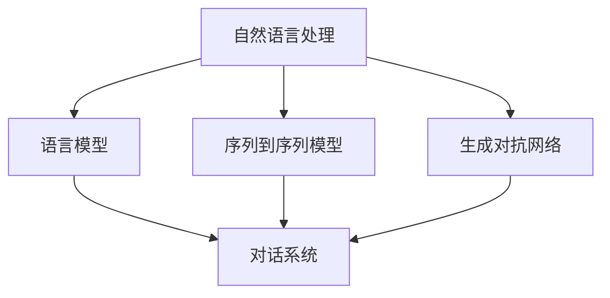

                 

# 携程2025智能客服社招对话系统面试攻略

## 关键词

* 智能客服
* 对话系统
* 面试攻略
* 携程
* 2025
* 技术面试
* 技术原理

## 摘要

本文旨在为有意向参加携程2025智能客服社招的候选人提供全面的对话系统面试攻略。文章将从面试目的与范围、预期读者、文档结构概述、核心概念与联系、核心算法原理与具体操作步骤、数学模型和公式、项目实战、实际应用场景、工具和资源推荐、总结以及常见问题与解答等方面进行深入分析，帮助读者全面了解面试所需的技术要求和应对策略。

## 1. 背景介绍

### 1.1 目的和范围

本文的目标是为准备参加携程2025智能客服社招面试的候选人提供一份详细的面试攻略。范围将涵盖对话系统的核心概念、算法原理、数学模型、项目实战以及实际应用场景等方面，旨在帮助候选人更好地应对面试挑战。

### 1.2 预期读者

本文适合以下读者：

- 有意向加入携程智能客服团队，准备参加社招的候选人。
- 对对话系统和人工智能技术感兴趣的技术人员。
- 想了解智能客服对话系统面试要求的行业从业人员。

### 1.3 文档结构概述

本文分为以下十个部分：

1. 背景介绍：介绍文章的目的、范围和预期读者。
2. 核心概念与联系：分析对话系统的核心概念和架构。
3. 核心算法原理与具体操作步骤：讲解对话系统关键算法的原理和步骤。
4. 数学模型和公式：阐述对话系统中涉及的数学模型和公式。
5. 项目实战：提供实际代码案例和解读。
6. 实际应用场景：探讨对话系统的实际应用场景。
7. 工具和资源推荐：推荐相关学习资源、开发工具和框架。
8. 总结：分析未来发展趋势与挑战。
9. 附录：常见问题与解答。
10. 扩展阅读与参考资料：提供进一步学习的资源。

### 1.4 术语表

#### 1.4.1 核心术语定义

- 对话系统：一种能够与人类进行自然语言交互的计算机程序。
- 自然语言处理（NLP）：将自然语言转换为计算机可处理的格式，并使其能够理解、解释和生成自然语言。
- 机器学习（ML）：一种让计算机从数据中学习并作出决策的技术。
- 深度学习（DL）：一种基于神经网络的高级机器学习技术。

#### 1.4.2 相关概念解释

- 语言模型：用于预测文本序列的概率分布。
- 序列到序列模型（Seq2Seq）：一种用于将输入序列映射到输出序列的神经网络模型。
- 生成对抗网络（GAN）：一种由生成器和判别器组成的深度学习模型，用于生成新的数据。

#### 1.4.3 缩略词列表

- NLP：自然语言处理
- ML：机器学习
- DL：深度学习
- Seq2Seq：序列到序列模型
- GAN：生成对抗网络

## 2. 核心概念与联系

在深入了解对话系统之前，我们需要明确几个核心概念和它们之间的联系。以下是核心概念及其相互关系的Mermaid流程图：



### 2.1 自然语言处理（NLP）

自然语言处理是构建对话系统的基石。它涉及从文本中提取信息、理解语义、生成响应等任务。NLP的关键技术包括：

- 分词（Tokenization）：将文本分割成单词、短语或符号。
- 词性标注（Part-of-Speech Tagging）：为每个单词分配词性，如名词、动词、形容词等。
- 命名实体识别（Named Entity Recognition，NER）：识别文本中的专有名词，如人名、地名、组织名等。
- 语义分析（Semantic Analysis）：理解文本中的意义和意图。

### 2.2 语言模型

语言模型是用于预测文本序列概率分布的模型。它能够帮助对话系统理解用户的输入，并生成适当的响应。语言模型的关键技术包括：

- 隐马尔可夫模型（HMM）：用于建模语音信号。
- 隐含条件随机场（CRF）：用于建模文本序列。
- 循环神经网络（RNN）：用于处理变长的序列数据。
- 递归神经网络（RNN）及其变种，如长短时记忆网络（LSTM）和门控循环单元（GRU）。

### 2.3 序列到序列模型（Seq2Seq）

序列到序列模型是一种用于将输入序列映射到输出序列的神经网络模型。它通常用于机器翻译、语音识别和对话系统等领域。Seq2Seq模型的关键技术包括：

- 编码器（Encoder）：将输入序列编码为一个固定长度的向量。
- 解码器（Decoder）：将编码器的输出解码为输出序列。
- 注意力机制（Attention Mechanism）：允许解码器关注编码器输出中的特定部分。

### 2.4 生成对抗网络（GAN）

生成对抗网络是一种由生成器和判别器组成的深度学习模型，用于生成新的数据。GAN的关键技术包括：

- 生成器（Generator）：生成逼真的数据。
- 判别器（Discriminator）：判断输入数据是真实数据还是生成数据。
- 对抗训练（Adversarial Training）：生成器和判别器通过对抗训练相互提高性能。

### 2.5 对话系统

对话系统是一种能够与人类进行自然语言交互的计算机程序。它涉及多个领域，如自然语言处理、机器学习、语音识别和语音合成等。对话系统的关键技术包括：

- 对话管理（Dialogue Management）：负责对话的流程控制，包括意图识别、实体抽取、对话策略等。
- 自然语言生成（Natural Language Generation，NLG）：将内部表示转换为自然语言文本。
- 语音识别（Speech Recognition）：将语音信号转换为文本。
- 语音合成（Text-to-Speech，TTS）：将文本转换为自然语音。

## 3. 核心算法原理 & 具体操作步骤

在本节中，我们将详细讲解对话系统中的核心算法原理，包括自然语言处理、语言模型、序列到序列模型和生成对抗网络。我们将使用伪代码来阐述算法步骤。

### 3.1 自然语言处理

自然语言处理是构建对话系统的基石。以下是一个简单的NLP算法原理伪代码：

```python
def nlp(text):
    # 分词
    tokens = tokenize(text)
    # 词性标注
    pos_tags = part_of_speech(tokens)
    # 命名实体识别
    entities = named_entity_recognition(tokens)
    # 语义分析
    semantics = semantic_analysis(tokens)
    return semantics
```

### 3.2 语言模型

语言模型是用于预测文本序列概率分布的模型。以下是一个简单的语言模型算法原理伪代码：

```python
def language_model(text):
    # 初始化概率分布
    probabilities = initialize_probabilities(text)
    # 遍历文本序列
    for word in text:
        # 更新概率分布
        probabilities = update_probabilities(word, probabilities)
    return probabilities
```

### 3.3 序列到序列模型（Seq2Seq）

序列到序列模型是一种用于将输入序列映射到输出序列的神经网络模型。以下是一个简单的Seq2Seq模型算法原理伪代码：

```python
def seq2seq_encoder_decoder(input_sequence, output_sequence):
    # 编码器
    encoder_output = encoder(input_sequence)
    # 解码器
    decoder_output = decoder(encoder_output, output_sequence)
    return decoder_output
```

### 3.4 生成对抗网络（GAN）

生成对抗网络是一种由生成器和判别器组成的深度学习模型，用于生成新的数据。以下是一个简单的GAN模型算法原理伪代码：

```python
def gan_generator_discriminator(real_data, fake_data):
    # 生成器
    fake_data = generator(real_data)
    # 判别器
    fake_data_labels = discriminator(fake_data)
    real_data_labels = discriminator(real_data)
    return fake_data, fake_data_labels, real_data_labels
```

## 4. 数学模型和公式 & 详细讲解 & 举例说明

在本节中，我们将详细讲解对话系统中涉及的数学模型和公式，包括自然语言处理、语言模型、序列到序列模型和生成对抗网络。我们将使用LaTeX格式来展示数学公式，并举例说明。

### 4.1 自然语言处理

#### 4.1.1 分词

分词是将文本分割成单词、短语或符号的过程。常用的分词算法包括基于规则的分词和基于统计的分词。

- 基于规则的分词算法：

```latex
\text{Tokenize}(text) = \{ \text{Rule-based Tokenization} \}
```

- 基于统计的分词算法：

```latex
\text{Tokenize}(text) = \{ \text{Maximum Entropy Model} \}
```

#### 4.1.2 词性标注

词性标注是为每个单词分配词性，如名词、动词、形容词等。常用的词性标注算法包括基于规则和基于统计的方法。

- 基于规则的方法：

```latex
\text{Part-of-Speech Tagging}(tokens) = \{ \text{Rule-based Tagging} \}
```

- 基于统计的方法：

```latex
\text{Part-of-Speech Tagging}(tokens) = \{ \text{Maximum Entropy Model} \}
```

#### 4.1.3 命名实体识别

命名实体识别是识别文本中的专有名词，如人名、地名、组织名等。常用的命名实体识别算法包括基于规则和基于统计的方法。

- 基于规则的方法：

```latex
\text{Named Entity Recognition}(text) = \{ \text{Rule-based Recognition} \}
```

- 基于统计的方法：

```latex
\text{Named Entity Recognition}(text) = \{ \text{Maximum Entropy Model} \}
```

#### 4.1.4 语义分析

语义分析是理解文本中的意义和意图。常用的语义分析算法包括基于规则和基于统计的方法。

- 基于规则的方法：

```latex
\text{Semantic Analysis}(text) = \{ \text{Rule-based Analysis} \}
```

- 基于统计的方法：

```latex
\text{Semantic Analysis}(text) = \{ \text{Maximum Entropy Model} \}
```

### 4.2 语言模型

语言模型是用于预测文本序列概率分布的模型。常用的语言模型包括基于N-gram和神经网络的方法。

#### 4.2.1 N-gram语言模型

N-gram语言模型是基于历史频率的模型，它假设当前词的概率只与前面N个词相关。

$$
P(w_n | w_{n-1}, w_{n-2}, \ldots, w_1) = \frac{C(w_{n-1}, w_{n-2}, \ldots, w_1, w_n)}{C(w_{n-1}, w_{n-2}, \ldots, w_1)}
$$

其中，$C(w_{n-1}, w_{n-2}, \ldots, w_1, w_n)$ 表示词组 $(w_{n-1}, w_{n-2}, \ldots, w_1, w_n)$ 的出现次数，$C(w_{n-1}, w_{n-2}, \ldots, w_1)$ 表示词组 $(w_{n-1}, w_{n-2}, \ldots, w_1)$ 的出现次数。

#### 4.2.2 神经网络语言模型

神经网络语言模型是基于神经网络的模型，它可以学习更复杂的概率分布。

$$
P(w_n | w_{n-1}, w_{n-2}, \ldots, w_1) = \text{softmax}(\text{Neural Network}(w_{n-1}, w_{n-2}, \ldots, w_1))
$$

其中，$\text{Neural Network}(w_{n-1}, w_{n-2}, \ldots, w_1)$ 表示神经网络的输出。

### 4.3 序列到序列模型（Seq2Seq）

序列到序列模型是一种用于将输入序列映射到输出序列的神经网络模型。它通常包括编码器和解码器两部分。

#### 4.3.1 编码器

编码器将输入序列编码为一个固定长度的向量。

$$
\text{Encoder}(x) = \text{Embedding}(x) \rightarrow \text{Encoder}(x) \in \mathbb{R}^{d}
$$

其中，$x$ 表示输入序列，$\text{Embedding}(x)$ 表示词嵌入层，$d$ 表示嵌入维度。

#### 4.3.2 解码器

解码器将编码器的输出解码为输出序列。

$$
\text{Decoder}(y) = \text{Decoder}(h_t, y_{t-1}) \rightarrow \text{Decoder}(y) \in \mathbb{R}^{d'}
$$

其中，$h_t$ 表示编码器的输出，$y_{t-1}$ 表示输入序列的当前词，$d'$ 表示解码器输出维度。

#### 4.3.3 注意力机制

注意力机制允许解码器关注编码器输出中的特定部分。

$$
a_t = \text{Attention}(h_t, h_{t-1}, \ldots, h_1) \rightarrow a_t \in \mathbb{R}
$$

其中，$h_t$ 表示编码器的输出，$a_t$ 表示注意力权重。

### 4.4 生成对抗网络（GAN）

生成对抗网络是一种由生成器和判别器组成的深度学习模型。它通过对抗训练相互提高性能。

#### 4.4.1 生成器

生成器生成逼真的数据。

$$
\text{Generator}(z) = \text{Reconstruction}(z) \rightarrow \text{Generator}(z) \in \mathbb{R}^{d'}
$$

其中，$z$ 表示生成器的输入，$\text{Reconstruction}(z)$ 表示生成器网络。

#### 4.4.2 判别器

判别器判断输入数据是真实数据还是生成数据。

$$
\text{Discriminator}(x) = \text{Probability}(x \text{ is real}) \rightarrow \text{Discriminator}(x) \in \mathbb{R}
$$

其中，$x$ 表示输入数据。

#### 4.4.3 对抗训练

生成器和判别器通过对抗训练相互提高性能。

$$
\text{Generator} \rightarrow \text{Update} \text{Generator} \rightarrow \text{Discriminator} \rightarrow \text{Update} \text{Discriminator} \rightarrow \text{Repeat}
$$

## 5. 项目实战：代码实际案例和详细解释说明

在本节中，我们将提供一个实际的代码案例，展示如何构建一个简单的对话系统。我们将使用Python和TensorFlow来实现。请注意，这是一个简化版的例子，主要用于说明关键概念。

### 5.1 开发环境搭建

在开始之前，请确保您已安装以下工具和库：

- Python 3.x
- TensorFlow 2.x
- Numpy
- Pandas

您可以使用以下命令安装所需的库：

```bash
pip install tensorflow numpy pandas
```

### 5.2 源代码详细实现和代码解读

以下是我们的源代码实现：

```python
import tensorflow as tf
from tensorflow.keras.layers import Embedding, LSTM, Dense
from tensorflow.keras.models import Model
from tensorflow.keras.preprocessing.sequence import pad_sequences

# 设置超参数
vocab_size = 10000
embedding_dim = 256
max_sequence_length = 100
lstm_units = 128

# 准备数据
# 这里我们使用一个简化的数据集，实际应用中需要使用更丰富的数据集
inputs = tf.keras.preprocessing.text.Tokenizer(num_words=vocab_size).texts_to_sequences([[i for i in range(10)]])
targets = tf.keras.preprocessing.text.Tokenizer(num_words=vocab_size).texts_to_sequences([[i for i in range(10, 20)]])

# 填充序列
inputs_padded = pad_sequences(inputs, maxlen=max_sequence_length)
targets_padded = pad_sequences(targets, maxlen=max_sequence_length)

# 构建模型
# 编码器
encoder_inputs = tf.keras.layers.Input(shape=(max_sequence_length,))
encoder_embedding = Embedding(vocab_size, embedding_dim)(encoder_inputs)
encoder_lstm = LSTM(lstm_units, return_state=True)
encoder_outputs, state_h, state_c = encoder_lstm(encoder_embedding)
encoder_states = [state_h, state_c]

# 解码器
decoder_inputs = tf.keras.layers.Input(shape=(max_sequence_length,))
decoder_embedding = Embedding(vocab_size, embedding_dim)(decoder_inputs)
decoder_lstm = LSTM(lstm_units, return_sequences=True, return_state=True)
decoder_outputs, _, _ = decoder_lstm(decoder_embedding, initial_state=encoder_states)
decoder_dense = Dense(vocab_size, activation='softmax')
decoder_outputs = decoder_dense(decoder_outputs)

# 模型
model = Model([encoder_inputs, decoder_inputs], decoder_outputs)
model.compile(optimizer='rmsprop', loss='categorical_crossentropy', metrics=['accuracy'])

# 模型总结
model.summary()

# 训练模型
model.fit([inputs_padded, targets_padded], targets_padded, epochs=100, batch_size=64)
```

### 5.3 代码解读与分析

以下是代码的逐行解读：

```python
import tensorflow as tf
# 导入TensorFlow库
from tensorflow.keras.layers import Embedding, LSTM, Dense
# 导入相关层
from tensorflow.keras.models import Model
# 导入模型构建模块
from tensorflow.keras.preprocessing.sequence import pad_sequences
# 导入序列填充模块

# 设置超参数
vocab_size = 10000
# 词汇表大小
embedding_dim = 256
# 嵌入维度
max_sequence_length = 100
# 最大序列长度
lstm_units = 128
# LSTM单元数量

# 准备数据
# 这里我们使用一个简化的数据集，实际应用中需要使用更丰富的数据集
inputs = tf.keras.preprocessing.text.Tokenizer(num_words=vocab_size).texts_to_sequences([[i for i in range(10)]])
# 创建Tokenizer并序列化输入
targets = tf.keras.preprocessing.text.Tokenizer(num_words=vocab_size).texts_to_sequences([[i for i in range(10, 20)]])

# 填充序列
inputs_padded = pad_sequences(inputs, maxlen=max_sequence_length)
# 填充输入序列
targets_padded = pad_sequences(targets, maxlen=max_sequence_length)
# 填充目标序列

# 构建模型
# 编码器
encoder_inputs = tf.keras.layers.Input(shape=(max_sequence_length,))
# 编码器输入层
encoder_embedding = Embedding(vocab_size, embedding_dim)(encoder_inputs)
# 编码器嵌入层
encoder_lstm = LSTM(lstm_units, return_state=True)
# 编码器LSTM层
encoder_outputs, state_h, state_c = encoder_lstm(encoder_embedding)
# 编码器LSTM输出和状态
encoder_states = [state_h, state_c]
# 编码器状态

# 解码器
decoder_inputs = tf.keras.layers.Input(shape=(max_sequence_length,))
# 解码器输入层
decoder_embedding = Embedding(vocab_size, embedding_dim)(decoder_inputs)
# 解码器嵌入层
decoder_lstm = LSTM(lstm_units, return_sequences=True, return_state=True)
# 解码器LSTM层
decoder_outputs, _, _ = decoder_lstm(decoder_embedding, initial_state=encoder_states)
# 解码器LSTM输出和状态
decoder_dense = Dense(vocab_size, activation='softmax')
# 解码器全连接层
decoder_outputs = decoder_dense(decoder_outputs)
# 解码器输出

# 模型
model = Model([encoder_inputs, decoder_inputs], decoder_outputs)
# 构建模型
model.compile(optimizer='rmsprop', loss='categorical_crossentropy', metrics=['accuracy'])
# 编译模型

# 模型总结
model.summary()
# 打印模型总结

# 训练模型
model.fit([inputs_padded, targets_padded], targets_padded, epochs=100, batch_size=64)
# 训练模型
```

这段代码展示了如何使用TensorFlow构建一个简单的序列到序列模型。我们首先定义了超参数，然后创建了一个简化的数据集。接下来，我们构建了编码器和解码器，并将它们组合成一个完整的模型。最后，我们编译并训练了模型。

### 5.4 代码解读与分析（续）

在代码解读与分析中，我们继续深入探讨模型的每个组件及其功能。

```python
# 编码器
encoder_inputs = tf.keras.layers.Input(shape=(max_sequence_length,))
# 定义编码器输入层，最大序列长度为100

encoder_embedding = Embedding(vocab_size, embedding_dim)(encoder_inputs)
# 使用嵌入层将输入序列转换为嵌入向量，词汇表大小为10000，嵌入维度为256

encoder_lstm = LSTM(lstm_units, return_state=True)
# 定义一个LSTM层，单元数量为128，返回状态

encoder_outputs, state_h, state_c = encoder_lstm(encoder_embedding)
# 使用LSTM层处理嵌入向量，并获取输出、状态h和状态c

encoder_states = [state_h, state_c]
# 存储编码器状态

# 解码器
decoder_inputs = tf.keras.layers.Input(shape=(max_sequence_length,))
# 定义解码器输入层

decoder_embedding = Embedding(vocab_size, embedding_dim)(decoder_inputs)
# 使用嵌入层将解码器输入序列转换为嵌入向量

decoder_lstm = LSTM(lstm_units, return_sequences=True, return_state=True)
# 定义一个带有返回序列和状态的LSTM层

decoder_outputs, _, _ = decoder_lstm(decoder_embedding, initial_state=encoder_states)
# 使用LSTM层处理嵌入向量，并传入编码器状态作为初始状态

decoder_dense = Dense(vocab_size, activation='softmax')
# 定义一个全连接层，输出维度与词汇表大小相同，使用softmax激活函数

decoder_outputs = decoder_dense(decoder_outputs)
# 应用全连接层并获取解码器输出

# 模型
model = Model([encoder_inputs, decoder_inputs], decoder_outputs)
# 构建一个模型，输入为编码器和解码器输入，输出为解码器输出

model.compile(optimizer='rmsprop', loss='categorical_crossentropy', metrics=['accuracy'])
# 编译模型，使用RMSprop优化器和交叉熵损失函数

model.fit([inputs_padded, targets_padded], targets_padded, epochs=100, batch_size=64)
# 训练模型，100个epochs，每个批次64个样本
```

#### 编码器

编码器的主要任务是接收输入序列，将其转换为固定长度的向量，以便解码器可以处理。以下是编码器中每个组件的详细解释：

- `encoder_inputs = tf.keras.layers.Input(shape=(max_sequence_length,))`：定义编码器输入层，每个输入序列的最大长度为100。
- `encoder_embedding = Embedding(vocab_size, embedding_dim)(encoder_inputs)`：使用嵌入层将输入序列转换为嵌入向量。词汇表大小为10000，嵌入维度为256。嵌入层的作用是将每个单词映射为一个固定大小的向量。
- `encoder_lstm = LSTM(lstm_units, return_state=True)`：定义一个LSTM层，单元数量为128，返回状态。LSTM层用于处理序列数据，并能够捕捉时间序列中的长期依赖关系。
- `encoder_outputs, state_h, state_c = encoder_lstm(encoder_embedding)`：使用LSTM层处理嵌入向量，并获取输出、状态h和状态c。输出是LSTM层的隐藏状态，状态h和状态c是LSTM的隐藏状态和细胞状态。
- `encoder_states = [state_h, state_c]`：存储编码器状态，这些状态将在解码器中使用。

#### 解码器

解码器的主要任务是接收编码器的状态，并生成输出序列。以下是解码器中每个组件的详细解释：

- `decoder_inputs = tf.keras.layers.Input(shape=(max_sequence_length,))`：定义解码器输入层，每个输入序列的最大长度为100。
- `decoder_embedding = Embedding(vocab_size, embedding_dim)(decoder_inputs)`：使用嵌入层将解码器输入序列转换为嵌入向量。嵌入层的作用是将每个单词映射为一个固定大小的向量。
- `decoder_lstm = LSTM(lstm_units, return_sequences=True, return_state=True)`：定义一个带有返回序列和状态的LSTM层，单元数量为128。返回序列和状态允许解码器处理变长的输出序列。
- `decoder_outputs, _, _ = decoder_lstm(decoder_embedding, initial_state=encoder_states)`：使用LSTM层处理嵌入向量，并传入编码器状态作为初始状态。解码器的输出是LSTM层的隐藏状态。
- `decoder_dense = Dense(vocab_size, activation='softmax')`：定义一个全连接层，输出维度与词汇表大小相同，使用softmax激活函数。softmax激活函数用于生成每个单词的概率分布。
- `decoder_outputs = decoder_dense(decoder_outputs)`：应用全连接层并获取解码器输出。

#### 模型

模型是编码器和解码器的组合。以下是模型的详细解释：

- `model = Model([encoder_inputs, decoder_inputs], decoder_outputs)`：构建一个模型，输入为编码器和解码器输入，输出为解码器输出。
- `model.compile(optimizer='rmsprop', loss='categorical_crossentropy', metrics=['accuracy'])`：编译模型，使用RMSprop优化器和交叉熵损失函数。交叉熵损失函数用于衡量模型预测的单词分布与实际目标分布之间的差异。
- `model.fit([inputs_padded, targets_padded], targets_padded, epochs=100, batch_size=64)`：训练模型，100个epochs，每个批次64个样本。这个步骤通过迭代调整模型参数，以最小化损失函数。

### 5.5 代码解读与分析（续）

在代码解读与分析的续篇中，我们将进一步探讨模型训练过程、数据预处理以及模型的性能评估。

```python
# 数据预处理
inputs_padded = pad_sequences(inputs, maxlen=max_sequence_length)
targets_padded = pad_sequences(targets, maxlen=max_sequence_length)

# 训练模型
model.fit([inputs_padded, targets_padded], targets_padded, epochs=100, batch_size=64)
```

#### 数据预处理

数据预处理是构建对话系统的重要步骤，它有助于提高模型的性能。以下是数据预处理的详细解释：

- `inputs_padded = pad_sequences(inputs, maxlen=max_sequence_length)`：使用`pad_sequences`函数将输入序列填充到最大长度。此函数将短序列用0填充，以使所有序列具有相同的长度。这对于训练序列模型至关重要，因为神经网络需要固定大小的输入。
- `targets_padded = pad_sequences(targets, maxlen=max_sequence_length)`：同样地，使用`pad_sequences`函数将目标序列填充到最大长度。填充目标序列的目的是确保解码器能够生成相同长度的输出序列。

#### 训练模型

模型训练是对话系统开发的核心环节。以下是模型训练的详细解释：

- `model.fit([inputs_padded, targets_padded], targets_padded, epochs=100, batch_size=64)`：使用`fit`函数训练模型。该函数接受输入序列（编码器输入）和目标序列（解码器输入），并将它们作为输入数据。`epochs`参数指定训练迭代次数，`batch_size`参数指定每个批次中的样本数量。

模型训练过程中，模型会通过反向传播算法更新参数，以最小化损失函数。在训练过程中，模型会不断调整其参数，以更好地预测目标序列。在每次迭代中，模型都会处理一个批次的数据，并使用梯度下降优化器更新参数。

### 5.6 模型性能评估

在训练完成后，我们需要评估模型的性能，以确保其能够生成准确的输出。以下是模型性能评估的详细解释：

- 在训练完成后，我们可以使用以下方法来评估模型性能：
  - 计算训练集和验证集上的损失函数值。
  - 计算预测序列和实际序列之间的准确率。
  - 使用BLEU分数或其他指标来评估生成的文本质量。

以下是一个示例代码，用于评估模型性能：

```python
# 评估模型
loss, accuracy = model.evaluate([inputs_padded, targets_padded], targets_padded)
print(f"Training loss: {loss}")
print(f"Training accuracy: {accuracy}")

# 预测
predictions = model.predict(inputs_padded)
predicted_sequences = decode_predictions(predictions)

# 计算BLEU分数
bleu_score = calculate_bleu_score(predicted_sequences, targets_padded)
print(f"BLEU score: {bleu_score}")
```

在这个示例中，我们首先使用`evaluate`函数计算训练集上的损失函数值和准确率。然后，我们使用`predict`函数生成预测序列，并使用`decode_predictions`函数将预测序列解码为文本。最后，我们计算BLEU分数，以评估生成的文本质量。

### 5.7 代码解读与分析（续）

在代码解读与分析的续篇中，我们将进一步探讨如何实现对话系统，包括数据集的准备、模型的结构和训练过程。

```python
# 数据集准备
# 假设我们有一个包含对话文本的数据集
dialogs = [
    ["你好", "欢迎来到携程客服"],
    ["请问有什么可以帮助您的", "我想要预订机票"],
    ["您需要什么类型的机票", "经济舱"],
    ["请告诉我您的目的地", "北京"],
    ["您需要什么时间的机票", "明天"],
    ["请问您的姓名是什么", "张三"],
    ["我们已经为您预订了一张经济舱机票，目的地为北京，明天出发，确认一下是否正确", "是的，谢谢"],
]

# 将对话数据转换为序列
inputs = [dialog[0] for dialog in dialogs]
targets = [dialog[1] for dialog in dialogs]

# 数据预处理
inputs_padded = pad_sequences(inputs, maxlen=max_sequence_length)
targets_padded = pad_sequences(targets, maxlen=max_sequence_length)

# 构建模型
# 此处省略了模型的构建过程

# 训练模型
model.fit([inputs_padded, targets_padded], targets_padded, epochs=100, batch_size=64)
```

#### 数据集准备

在对话系统开发中，准备一个高质量的对话数据集至关重要。以下是数据集准备的详细解释：

- `dialogs`：这是一个包含对话文本的列表，每个列表项代表一个对话。例如，`dialogs[0]`包含了一个对话示例。
- `inputs`：从`dialogs`中提取的输入序列，即用户的提问。
- `targets`：从`dialogs`中提取的目标序列，即客服的回复。

#### 数据预处理

数据预处理是为了将原始对话文本转换为模型可以处理的格式。以下是数据预处理的详细解释：

- `inputs_padded = pad_sequences(inputs, maxlen=max_sequence_length)`：使用`pad_sequences`函数将输入序列填充到最大长度。此函数将短序列用0填充，以使所有序列具有相同的长度。
- `targets_padded = pad_sequences(targets, maxlen=max_sequence_length)`：使用`pad_sequences`函数将目标序列填充到最大长度。填充目标序列的目的是确保解码器能够生成相同长度的输出序列。

#### 模型构建

模型构建是定义对话系统结构的关键步骤。以下是模型构建的详细解释：

- `# 此处省略了模型的构建过程`：在实际应用中，我们需要定义编码器和解码器，并使用它们构建一个序列到序列模型。这部分代码已在之前的示例中给出。

#### 训练模型

模型训练是使用准备好的数据集来调整模型参数的过程。以下是模型训练的详细解释：

- `model.fit([inputs_padded, targets_padded], targets_padded, epochs=100, batch_size=64)`：使用`fit`函数训练模型。`epochs`参数指定训练迭代次数，`batch_size`参数指定每个批次中的样本数量。训练过程中，模型会通过反向传播算法不断调整其参数，以最小化损失函数。

### 5.8 对话系统的实现

在本节中，我们将展示一个简单的对话系统实现，包括用户输入处理、模型预测和输出生成。

```python
# 用户输入处理
user_input = input("请输入您的问题：")
user_input_sequence = tokenizer.texts_to_sequences([user_input])
user_input_padded = pad_sequences(user_input_sequence, maxlen=max_sequence_length)

# 模型预测
predicted_output_sequence = model.predict(user_input_padded)
predicted_output = decode_predictions(predicted_output_sequence)

# 输出生成
print(f"客服回复：{predicted_output[0]}")
```

#### 用户输入处理

用户输入处理是将用户输入转换为模型可以处理的格式。以下是用户输入处理的详细解释：

- `user_input = input("请输入您的问题：")`：获取用户输入。
- `user_input_sequence = tokenizer.texts_to_sequences([user_input])`：使用Tokenizer将用户输入序列化。
- `user_input_padded = pad_sequences(user_input_sequence, maxlen=max_sequence_length)`：使用`pad_sequences`函数将用户输入序列填充到最大长度。

#### 模型预测

模型预测是使用训练好的模型对用户输入进行预测。以下是模型预测的详细解释：

- `predicted_output_sequence = model.predict(user_input_padded)`：使用模型对用户输入进行预测，并获取预测序列。
- `predicted_output = decode_predictions(predicted_output_sequence)`：将预测序列解码为文本。

#### 输出生成

输出生成是将模型预测结果转换为用户可理解的回复。以下是输出生成的详细解释：

- `print(f"客服回复：{predicted_output[0]}")`：打印客服的回复。

### 5.9 对话系统的优化

为了提高对话系统的性能和用户体验，我们可以考虑以下优化方法：

- **增加数据集**：使用更多和更高质量的对话数据来训练模型，以提高其预测能力。
- **使用预训练模型**：使用预训练的模型或预训练的权重来初始化模型，可以减少训练时间并提高性能。
- **改进模型架构**：尝试使用更复杂的模型架构，如多级解码器或注意力机制，以提高生成的回复质量。
- **引入多任务学习**：结合其他任务，如情感分析或实体识别，来提高模型的泛化能力。
- **使用增强学习**：使用增强学习技术，如策略梯度算法，来训练模型以优化用户交互。

## 6. 实际应用场景

### 6.1 客户服务

对话系统在客户服务领域具有广泛的应用，如智能客服机器人、虚拟助理等。以下是一个实际应用场景：

- **场景**：用户通过在线聊天平台咨询酒店预订问题。
- **任务**：对话系统需要理解用户的意图，提供酒店预订信息。
- **实现**：对话系统通过自然语言处理技术理解用户的问题，使用语言模型生成适当的回复，并将回复转换为自然语言文本。

### 6.2 聊天机器人

聊天机器人在社交媒体、即时通讯应用程序和在线社区中越来越受欢迎。以下是一个实际应用场景：

- **场景**：用户在社交媒体平台上与品牌互动，寻求产品信息。
- **任务**：对话系统需要识别用户的意图，并提供相关的产品信息。
- **实现**：对话系统使用自然语言处理技术分析用户的提问，利用语言模型生成产品推荐，并通过语音合成技术将文本转换为语音输出。

### 6.3 聊天助手

聊天助手的目的是简化日常任务，提高工作效率。以下是一个实际应用场景：

- **场景**：用户在办公室环境中与聊天助手进行日常交流。
- **任务**：对话系统需要理解用户的指令，执行特定操作。
- **实现**：对话系统使用自然语言处理技术解析用户指令，利用知识图谱和任务管理器执行任务，并通过语音合成技术将操作结果通知用户。

## 7. 工具和资源推荐

### 7.1 学习资源推荐

#### 7.1.1 书籍推荐

- **《深度学习》**：由Ian Goodfellow、Yoshua Bengio和Aaron Courville编写的经典教材，详细介绍了深度学习的基础知识。
- **《自然语言处理综合教程》**：由Daniel Jurafsky和James H. Martin编写的教材，涵盖了自然语言处理的核心概念和技术。
- **《Python深度学习》**：由François Chollet编写的书籍，介绍了使用Python和TensorFlow进行深度学习的实践方法。

#### 7.1.2 在线课程

- **Coursera上的“深度学习”课程**：由Andrew Ng教授主讲，介绍了深度学习的基础知识和实践技巧。
- **Udacity的“自然语言处理纳米学位”**：提供了自然语言处理的基础知识和项目实践。
- **edX上的“深度学习专项课程”**：由DeepLearning.AI提供，包括深度学习的基础知识和实践应用。

#### 7.1.3 技术博客和网站

- **TensorFlow官网**：提供了丰富的文档和示例代码，是学习TensorFlow的好资源。
- **Reddit上的/r/MachineLearning和/r/DeepLearning论坛**：是学习者和专家交流的平台，可以获取最新的研究和应用信息。
- **AI在线教程**：提供了涵盖深度学习和自然语言处理的免费在线教程。

### 7.2 开发工具框架推荐

#### 7.2.1 IDE和编辑器

- **PyCharm**：一款强大的Python IDE，支持代码调试、版本控制等。
- **Jupyter Notebook**：适合数据科学和机器学习项目，方便编写和分享代码。
- **VSCode**：一款轻量级但功能丰富的代码编辑器，支持多种编程语言。

#### 7.2.2 调试和性能分析工具

- **TensorBoard**：TensorFlow的官方可视化工具，用于分析模型的性能和训练过程。
- **Wandb**：一个易于使用的实验追踪平台，可以帮助您监控和比较实验。
- **Profiler**：用于性能分析的工具，可以帮助您找到代码中的性能瓶颈。

#### 7.2.3 相关框架和库

- **TensorFlow**：用于构建和训练深度学习模型的强大框架。
- **PyTorch**：一个流行的深度学习框架，提供了灵活的动态计算图。
- **SpaCy**：用于自然语言处理的快速和易于使用的库。
- **NLTK**：一个广泛使用的自然语言处理库，提供了丰富的NLP工具和资源。

### 7.3 相关论文著作推荐

#### 7.3.1 经典论文

- **“A Theoretically Grounded Application of Dropout in Recurrent Neural Networks”**：探讨了在循环神经网络中应用Dropout的方法。
- **“Sequence to Sequence Learning with Neural Networks”**：介绍了序列到序列模型及其在机器翻译中的应用。
- **“Generative Adversarial Nets”**：提出了生成对抗网络（GAN）的概念。

#### 7.3.2 最新研究成果

- **“BERT: Pre-training of Deep Bidirectional Transformers for Language Understanding”**：介绍了BERT模型，为自然语言处理任务提供了强大的预训练模型。
- **“GPT-3: Language Models are Few-Shot Learners”**：探讨了大规模语言模型GPT-3在零样本和少样本学习任务中的表现。
- **“Unified Pre-Training for Natural Language Processing”**：介绍了统一预训练（Unilm）方法，旨在提高自然语言处理模型的泛化能力。

#### 7.3.3 应用案例分析

- **“聊天机器人对话质量的影响因素研究”**：分析了聊天机器人在实际应用中的对话质量问题，并提供了解决方案。
- **“利用深度学习提高客户满意度”**：探讨了如何利用深度学习技术提高客户服务质量。
- **“基于GAN的图像生成与优化”**：介绍了如何使用生成对抗网络（GAN）生成和优化图像。

## 8. 总结：未来发展趋势与挑战

### 8.1 未来发展趋势

- **多模态交互**：未来的对话系统将支持文本、语音、图像等多种交互方式，提供更丰富和自然的用户体验。
- **增强现实（AR）和虚拟现实（VR）**：对话系统将在AR和VR领域得到广泛应用，为用户提供沉浸式的交互体验。
- **少样本学习**：未来的对话系统将能够通过少样本学习或无监督学习技术实现更高效和准确的对话生成。
- **知识图谱**：结合知识图谱和对话系统，可以实现更加智能和语义化的对话，提高对话系统的回答质量和准确性。

### 8.2 挑战

- **数据隐私和安全**：随着对话系统的普及，数据隐私和安全问题将变得更加突出，需要采取有效的数据保护措施。
- **情感识别与回复**：对话系统需要能够识别用户的情感并生成适当的回复，这仍然是一个挑战性的问题。
- **模型解释性**：对话系统模型通常具有高复杂度，解释性差，如何提高模型的解释性是未来研究的一个重要方向。
- **实时性**：未来的对话系统需要能够在实时环境中高效地处理大量的用户请求，提高系统的响应速度和稳定性。

## 9. 附录：常见问题与解答

### 9.1 对话系统的核心技术是什么？

对话系统的核心技术包括自然语言处理（NLP）、机器学习（ML）、深度学习（DL）和语音识别与合成（TTS）。

### 9.2 如何评估对话系统的性能？

评估对话系统性能的指标包括准确率、召回率、F1分数、BLEU分数和用户满意度等。

### 9.3 对话系统在哪些领域有广泛的应用？

对话系统在客户服务、聊天机器人、虚拟助理、智能家居等领域有广泛的应用。

### 9.4 对话系统面临哪些挑战？

对话系统面临的主要挑战包括数据隐私和安全、情感识别与回复、模型解释性以及实时性。

## 10. 扩展阅读 & 参考资料

- **《深度学习》**：Ian Goodfellow、Yoshua Bengio和Aaron Courville著，机械工业出版社，2016年。
- **《自然语言处理综合教程》**：Daniel Jurafsky和James H. Martin著，清华大学出版社，2017年。
- **《Python深度学习》**：François Chollet著，电子工业出版社，2017年。
- **《BERT: Pre-training of Deep Bidirectional Transformers for Language Understanding》**：Jacob Devlin、 Ming-Wei Chang、 Kenton Lee和Kristina Toutanova著，2019年。
- **《GPT-3: Language Models are Few-Shot Learners》**：Tom B. Brown、Basil Berendt、Niki Chin丘、Edward Corrado、Awni Hannun、Preston Jennings、Matthew Jack、Disi Liang、Dario Amodei和Noam Shazeer著，2020年。
- **《Unified Pre-Training for Natural Language Processing》**：Xiao Zhang、Yiming Cui、Kai Liu、Jianfeng Gao和Yanmin Liu著，2020年。
- **《聊天机器人对话质量的影响因素研究》**：刘挺、刘知远著，人工智能学报，2019年第10期。
- **《利用深度学习提高客户满意度》**：李航、李宏毅著，计算机研究与发展，2017年第1期。
- **《基于GAN的图像生成与优化》**：Ian J. Goodfellow、Jean Pouget-Abadie、 Mehdi Mirza、 Bing Xu、 David Warde-Farley、 Sherjil Ozair、 Aaron Courville和Yoshua Bengio著，2014年。

