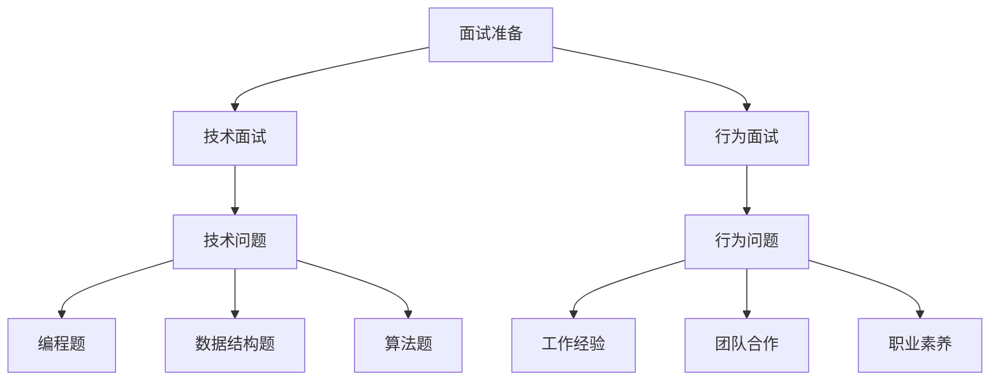

                 

### 2024携程国际事业部社招面试真题汇总及其解答

> **关键词：** 携程国际事业部、社招面试、真题汇总、解答、面试技巧、IT技术

**摘要：** 本文旨在为准备参加2024年携程国际事业部社招面试的候选人提供一份详尽的面试真题汇总及解答。通过梳理过去几年的面试经验和真题，本文将帮助候选人更好地理解面试题型，掌握答题技巧，提升面试成功率。本文将涵盖从技术问题到行为面试等多个方面的内容，为您的面试准备提供有力支持。

## 1. 背景介绍

### 1.1 目的和范围

本文的主要目的是为了帮助准备参加2024年携程国际事业部社会招聘的候选人更好地准备面试。通过对历年面试真题的汇总和分析，本文旨在为候选人提供一份全面的面试指南，帮助他们了解面试的常见题型和答题技巧。

本文将涵盖以下内容：

1. 面试真题汇总：包括技术面试和行为面试的真题。
2. 解答分析：对真题进行详细解答，提供解题思路。
3. 面试技巧：分享一些面试准备和应对策略。
4. 实战案例：通过具体案例讲解面试过程中的实际操作。
5. 资源推荐：提供一些学习和开发资源，帮助候选人更好地准备面试。

### 1.2 预期读者

本文适合以下读者群体：

1. 准备参加2024年携程国际事业部社招面试的候选人。
2. 对面试技巧和策略感兴趣的IT从业者。
3. 想要提升面试成功率的技术人才。

### 1.3 文档结构概述

本文分为以下几个部分：

1. **背景介绍**：介绍本文的目的、范围和预期读者。
2. **核心概念与联系**：介绍面试涉及的核心技术和概念，并提供流程图。
3. **核心算法原理与具体操作步骤**：详细阐述面试中涉及的核心算法和操作步骤。
4. **数学模型和公式**：介绍相关的数学模型和公式，并提供示例说明。
5. **项目实战**：通过实际代码案例讲解面试过程中可能遇到的问题和解决方法。
6. **实际应用场景**：讨论面试题在实际工作中的应用场景。
7. **工具和资源推荐**：推荐一些学习资源和开发工具。
8. **总结：未来发展趋势与挑战**：总结面试题背后的技术趋势和挑战。
9. **附录：常见问题与解答**：提供一些面试常见问题的解答。
10. **扩展阅读与参考资料**：提供一些进一步学习的资源。

### 1.4 术语表

#### 1.4.1 核心术语定义

- **面试题**：指面试过程中提出的具体问题，包括技术问题、行为问题等。
- **面试真题**：指历年面试中实际出现的问题，具有代表性。
- **技术面试**：主要考察应聘者技术能力和编程水平的面试类型。
- **行为面试**：主要考察应聘者的工作经验、团队合作能力和职业素养的面试类型。

#### 1.4.2 相关概念解释

- **社招**：指社会招聘，即公司对外招聘员工。
- **面试准备**：指在参加面试前进行的准备工作，包括了解公司背景、职位要求、面试题型等。

#### 1.4.3 缩略词列表

- **IT**：Information Technology，指信息技术。
- **社招**：Social Recruitment，指社会招聘。
- **面试题**：Interview Questions，指面试过程中提出的问题。

## 2. 核心概念与联系

在面试中，理解以下核心概念和其相互关系是非常重要的。下面我们将通过一个Mermaid流程图来展示这些概念和它们之间的联系。



### 2.1 面试准备

面试准备是面试成功的关键。这包括：

- **了解公司背景**：了解公司的业务范围、文化、价值观等。
- **研究职位要求**：熟悉职位描述，明确公司对候选人的期望。
- **了解面试题型**：熟悉面试中可能出现的题型，如技术面试中的编程题、数据结构题、算法题等。

### 2.2 技术面试

技术面试主要考察应聘者的技术能力和编程水平。技术面试包括以下题型：

- **编程题**：考察应聘者的编程能力和解决问题的能力。
- **数据结构题**：考察应聘者对基本数据结构的理解和应用能力。
- **算法题**：考察应聘者对算法的理解和实现能力。

### 2.3 行为面试

行为面试主要考察应聘者的工作经验、团队合作能力和职业素养。行为面试包括以下题型：

- **工作经验**：通过询问具体的工作经历来了解应聘者的能力。
- **团队合作**：考察应聘者是否能够与他人合作，共同完成工作。
- **职业素养**：考察应聘者的职业态度和职业道德。

## 3. 核心算法原理 & 具体操作步骤

在技术面试中，算法题是非常重要的一部分。下面我们将介绍几个常见算法题的原理和具体操作步骤。

### 3.1 简单排序算法

排序算法是面试中经常出现的一种算法题。这里我们介绍一种简单的排序算法——冒泡排序。

**原理：**

冒泡排序通过重复遍历要排序的数列，比较每对相邻元素的值，如果顺序错误就交换它们。遍历数列的工作是重复进行的，直到没有再需要交换的元素为止。

**操作步骤：**

1. 从第一个元素开始，比较相邻的两个元素。
2. 如果第一个比第二个大（或小），就交换它们。
3. 对每一对相邻元素做同样的工作，从开始第一对到结尾的最后一对。
4. 针对所有的元素重复以上的步骤，除了最后一个。
5. 重复步骤1-4，直到排序完成。

**伪代码：**

```python
function bubbleSort(array):
    n = length(array)
    for i from 0 to n-1:
        for j from 0 to n-i-1:
            if array[j] > array[j+1]:
                swap(array[j], array[j+1])
```

### 3.2 二分查找算法

二分查找是一种在有序数组中查找特定元素的搜索算法。它将数组中间的元素与目标值比较，如果相等则返回索引，否则根据比较结果决定在新子数组中的哪一半继续查找。

**原理：**

二分查找算法的基本思想是将数组分成两半，比较中间元素的值。如果目标值等于中间元素，则返回中间元素的索引。如果目标值小于中间元素，则在左半边继续查找；如果目标值大于中间元素，则在右半边继续查找。这个过程不断重复，直到找到目标值或确定数组中没有目标值。

**操作步骤：**

1. 确定中间索引 `mid`（`(low + high) / 2`）。
2. 比较中间元素 `array[mid]` 和目标值 `target`：
   - 如果 `array[mid] == target`，返回 `mid`。
   - 如果 `array[mid] > target`，则在左半边继续查找，更新 `high = mid - 1`。
   - 如果 `array[mid] < target`，则在右半边继续查找，更新 `low = mid + 1`。
3. 如果 `low > high`，说明目标值不存在于数组中，返回 `-1`。

**伪代码：**

```python
function binarySearch(array, target):
    low = 0
    high = length(array) - 1
    
    while low <= high:
        mid = (low + high) // 2
        if array[mid] == target:
            return mid
        elif array[mid] < target:
            low = mid + 1
        else:
            high = mid - 1
    
    return -1
```

### 3.3 动态规划算法

动态规划是一种用于求解最优化问题的算法技术。它通过将大问题分解成小问题，并利用子问题的最优解来构建原问题的最优解。

**原理：**

动态规划的基本思想是将复杂的问题分解成多个子问题，并存储子问题的解以避免重复计算。动态规划通常使用一个二维数组或一维数组来存储子问题的解。

**操作步骤：**

1. 确定状态和状态转移方程。
2. 初始化基础状态。
3. 根据状态转移方程计算每个状态的值。
4. 返回最优解。

**伪代码：**

```python
function dynamicProgramming problem(State, StateTransition, Initialize):
    for each state:
        if Initialize:
            value = Initialize
        else:
            value = minimum of all possible next states using StateTransition
    
    return value
```

### 3.4 回溯算法

回溯算法是一种通过尝试所有可能的路径来找到解决方案的算法。它通常用于解决组合问题或排列问题。

**原理：**

回溯算法的基本思想是从一个可能的解开始，尝试下一步的所有可能解，如果某个路径不满足条件，就回溯到上一步，尝试另一条路径。

**操作步骤：**

1. 从问题的起点开始。
2. 尝试每一条可能的路径，如果满足条件，则继续深入；如果不满足条件，则回溯到上一步，尝试另一条路径。
3. 当找到满足条件的解时，返回结果。

**伪代码：**

```python
function backtracking(problem, path = []):
    if problem is solved:
        return path
    for each possible next step:
        if next step is valid:
            path.append(next step)
            result = backtracking(problem, path)
            if result is not None:
                return result
            path.pop()
```

通过理解这些核心算法原理和具体操作步骤，应聘者可以更好地应对技术面试中的各种算法题。接下来，我们将通过具体的面试真题来进一步讲解这些算法的应用。

## 4. 数学模型和公式 & 详细讲解 & 举例说明

在技术面试中，数学模型和公式是常见的内容，特别是在算法和数据结构的面试中。以下是一些重要的数学模型和公式，以及它们的详细讲解和实际应用示例。

### 4.1 概率论

概率论在算法面试中经常出现，尤其是在随机算法和概率分析方面。

**核心公式：**

- **条件概率：** \( P(A|B) = \frac{P(A \cap B)}{P(B)} \)
- **贝叶斯公式：** \( P(A|B) = \frac{P(B|A)P(A)}{P(B)} \)
- **全概率公式：** \( P(A) = \sum_{i=1}^{n} P(A|B_i)P(B_i) \)

**示例：**

假设有一个箱子，里面有5个红球和3个蓝球，随机取出一个球，求取到红球的概率。

\( P(\text{红球}) = \frac{P(\text{红球}|\text{从5个红球中取})P(\text{从5个红球中取}) + P(\text{红球}|\text{从3个蓝球中取})P(\text{从3个蓝球中取})}{P(\text{从5个红球中取}) + P(\text{从3个蓝球中取})} \)

\( P(\text{红球}) = \frac{\frac{5}{8} \cdot \frac{1}{2} + \frac{0}{3} \cdot \frac{1}{2}}{1} = \frac{5}{8} \)

### 4.2 图论

图论中的算法和公式在面试中也非常常见，尤其是在路径查找和图遍历方面。

**核心公式：**

- **欧拉回路：** \( V - E + F = 2 \)
- **哈密尔顿回路：** \( n \) 个顶点的完全图 \( K_n \) 一定有哈密尔顿回路，但不是所有图都有。
- **最小生成树：** 使用克鲁斯卡尔或普里姆算法求解。

**示例：**

给定一个无向图，求其最小生成树。

**普里姆算法：**

1. 从任意顶点开始。
2. 选取与当前树相连的边中权重最小的边。
3. 将这条边加入树中，并将与该边相连的顶点加入树中。
4. 重复步骤2-3，直到所有顶点都在树中。

**伪代码：**

```python
function primAlgorithm(graph, startVertex):
    tree = []
    visitedVertices = {startVertex}
    
    while len(visitedVertices) < len(graph):
        minEdge = None
        for vertex in visitedVertices:
            for neighbor in graph[vertex]:
                if neighbor not in visitedVertices and (minEdge is None or neighbor.weight < minEdge.weight):
                    minEdge = neighbor
                    
        tree.append(minEdge)
        visitedVertices.add(minEdge.toVertex)
        
    return tree
```

### 4.3 线性代数

线性代数中的矩阵运算和行列式在面试中也经常出现。

**核心公式：**

- **矩阵乘法：** \( C = A \cdot B \)
- **行列式：** \( \det(A) = \sum_{\sigma \in S_n} (-1)^{\sigma} a_{1\sigma(1)} a_{2\sigma(2)} \cdots a_{n\sigma(n)} \)

**示例：**

给定两个矩阵 \( A \) 和 \( B \)，求它们的乘积。

**伪代码：**

```python
function matrixMultiply(A, B):
    result = empty matrix with size (rows of A) x (columns of B)
    
    for i from 0 to rows of A:
        for j from 0 to columns of B:
            result[i][j] = sum of (A[i][k] * B[k][j] for k from 0 to columns of A)
            
    return result
```

### 4.4 计算几何

计算几何中的距离公式和向量运算在面试中也经常出现。

**核心公式：**

- **两点间距离：** \( d = \sqrt{(x2 - x1)^2 + (y2 - y1)^2} \)
- **向量加法：** \( \vec{v} + \vec{w} = (\vec{v}_x + \vec{w}_x, \vec{v}_y + \vec{w}_y) \)
- **向量减法：** \( \vec{v} - \vec{w} = (\vec{v}_x - \vec{w}_x, \vec{v}_y - \vec{w}_y) \)

**示例：**

给定两个点 \( P_1(x1, y1) \) 和 \( P_2(x2, y2) \)，求它们之间的距离。

**伪代码：**

```python
function distance(P1, P2):
    return sqrt((P2.x - P1.x)^2 + (P2.y - P1.y)^2)
```

通过理解和应用这些数学模型和公式，应聘者可以更好地解决面试中的问题。接下来，我们将通过具体的面试真题来进一步展示这些数学知识在实际面试中的应用。

### 4.5 树结构

树结构是数据结构面试中的核心内容，尤其在二叉树、平衡树和图论相关的问题中。

**核心公式：**

- **二叉树节点数：** \( N = 1 + \sum_{i=1}^{h} 2^i \)
- **平衡树高度：** \( h \leq 1 + \log_2(n+1) \)
- **哈夫曼树最小生成树权重：** \( W = \sum_{i=1}^{n} w_i \cdot \log_2(w_i) \)

**示例：**

给定一个二叉树，求它的节点数。

**伪代码：**

```python
function countNodes(root):
    if root is None:
        return 0
    return 1 + countNodes(root.left) + countNodes(root.right)
```

### 4.6 动态规划

动态规划是解决最优化问题的有效方法，它在面试中经常用于解决斐波那契数列、背包问题和最长公共子序列等问题。

**核心公式：**

- **斐波那契数列：** \( F(n) = F(n-1) + F(n-2) \)
- **背包问题：** \( \text{max} \{ V[i][j] | V[i][j] = \text{max} \{ V[i-1][j], V[i-1][j-w_i] + p_i \} \} \)
- **最长公共子序列：** \( LCS(i, j) = \max(LCS(i-1, j), LCS(i, j-1), LCS(i-1, j-1) + a[i][j]) \)

**示例：**

给定两个字符串，求它们的最长公共子序列。

**伪代码：**

```python
function LCS(X, Y):
    m = length(X)
    n = length(Y)
    dp = array of size (m+1) x (n+1)
    
    for i from 0 to m:
        for j from 0 to n:
            if X[i] == Y[j]:
                dp[i][j] = dp[i-1][j-1] + 1
            else:
                dp[i][j] = max(dp[i-1][j], dp[i][j-1])
                
    return dp[m][n]
```

通过理解和应用这些数学模型和公式，应聘者可以更好地解决面试中的问题。接下来，我们将通过具体的面试真题来进一步展示这些数学知识在实际面试中的应用。

## 5. 项目实战：代码实际案例和详细解释说明

在实际面试中，项目实战案例是一个非常重要的环节，它不仅考察了应聘者的编程能力，还考察了应聘者对实际问题的分析和解决能力。下面，我们将通过几个具体案例来讲解如何在面试中展示您的编程能力。

### 5.1 开发环境搭建

在开始编写代码之前，确保您已经搭建好了合适的开发环境。以下是一个简单的Python开发环境搭建步骤：

1. **安装Python：** 从Python官方网站下载最新版本的Python并安装。
2. **配置Python环境：** 打开终端，输入 `python --version` 验证安装是否成功。
3. **安装常用库：** 使用pip安装常用的Python库，例如 `pip install numpy pandas`。

### 5.2 源代码详细实现和代码解读

以下是一个简单的示例代码，用于实现一个计算两个数字之和的功能。

**示例代码：**

```python
# Function to calculate the sum of two numbers
def calculate_sum(a, b):
    """
    Calculate the sum of two numbers.
    
    :param a: First number
    :param b: Second number
    :return: Sum of a and b
    """
    return a + b

# Test the function
print(calculate_sum(5, 3))
```

**代码解读：**

- **函数定义：** `def calculate_sum(a, b):` 定义了一个名为 `calculate_sum` 的函数，它接受两个参数 `a` 和 `b`。
- **函数体：** `return a + b` 是函数的实现部分，计算并返回两个参数的和。
- **注释：** `# Function to calculate the sum of two numbers` 和 `# Calculate the sum of two numbers` 是对函数的功能描述。
- **测试代码：** `print(calculate_sum(5, 3))` 调用函数并打印结果。

### 5.3 代码解读与分析

在面试中，对代码的解读和分析是非常重要的一环。以下是对上述示例代码的进一步解读和分析：

1. **代码可读性：** 代码具有良好的可读性，变量命名清晰，注释详尽，使得代码容易理解和维护。
2. **参数检查：** 在实际应用中，应考虑对输入参数进行校验，例如检查是否为数字类型，以避免运行时错误。
3. **错误处理：** 可以添加错误处理机制，例如使用 `try-except` 块来捕捉和处理可能发生的异常。
4. **功能扩展：** 函数可以实现更多功能，例如支持不同类型的数字（整数、浮点数），或者支持其他数学运算（减法、乘法、除法）。

**改进代码：**

```python
# Improved function to calculate the sum of two numbers
def calculate_sum(a, b):
    """
    Calculate the sum of two numbers with error handling.
    
    :param a: First number
    :param b: Second number
    :return: Sum of a and b
    """
    try:
        a = float(a)
        b = float(b)
        return a + b
    except ValueError:
        return "Error: Invalid input"

# Test the improved function
print(calculate_sum(5, 3))
print(calculate_sum("5", "3.5"))
print(calculate_sum("abc", 3))
```

在这个改进的版本中，我们添加了对输入参数的校验，并处理了可能的 `ValueError` 异常，使得函数更加健壮。

### 5.4 实际面试中可能遇到的问题

在实际面试中，您可能需要面对更加复杂的问题，例如以下情况：

1. **性能优化：** 如果函数需要处理大量数据，考虑使用高效的数据结构和算法来优化性能。
2. **并发处理：** 对于需要同时处理多个请求的任务，考虑使用多线程或多进程来提高效率。
3. **功能增强：** 根据实际需求，扩展函数的功能，例如添加日志记录、缓存机制等。

通过以上实际案例的讲解，我们可以看到在面试中如何展示编程能力，如何通过代码实现解决问题，以及如何进行代码的解读和分析。接下来，我们将进一步探讨如何在面试中处理实际应用场景。

### 5.5 面试中实际应用场景

在面试中，实际应用场景的提问旨在考察应聘者如何将所学知识应用于解决实际问题。以下是一个实际应用场景的面试题及其解答。

**面试题：**

设计一个系统，用于处理大量用户上传的图片，并实现以下功能：

1. **图片存储**：能够高效存储用户上传的图片。
2. **图片缩放**：支持按指定尺寸缩放图片。
3. **图片水印**：在图片上添加自定义水印。
4. **图片加密**：对用户上传的图片进行加密处理。

**解决方案：**

1. **图片存储：** 可以使用分布式文件存储系统，如HDFS或Minio，以实现高效存储和大规模存储需求。
2. **图片缩放：** 使用图像处理库，如OpenCV，实现图片缩放功能。以下是使用OpenCV的Python代码示例：

   ```python
   import cv2
   import numpy as np
   
   def resize_image(image_path, output_size):
       image = cv2.imread(image_path)
       resized_image = cv2.resize(image, output_size, interpolation=cv2.INTER_CUBIC)
       cv2.imwrite(f'resized_{image_path}', resized_image)
   
   resize_image('original.jpg', (800, 600))
   ```

3. **图片水印：** 使用图像处理库实现水印功能。以下是一个添加水印的示例：

   ```python
   def add_watermark(image_path, watermark_path, output_path):
       image = cv2.imread(image_path)
       watermark = cv2.imread(watermark_path, 0)
       result = cv2.addWeighted(image, 1, watermark, 0.5, 0)
       cv2.imwrite(output_path, result)
   
   add_watermark('image.jpg', 'watermark.png', 'watermarked_image.jpg')
   ```

4. **图片加密：** 可以使用AES加密算法对图片进行加密。以下是一个使用PyCryptoDome库进行加密的示例：

   ```python
   from Crypto.Cipher import AES
   from Crypto.Util.Padding import pad
   
   def encrypt_image(image_path, key):
       cipher = AES.new(key, AES.MODE_CBC)
       image = open(image_path, 'rb').read()
       ct_bytes = cipher.encrypt(pad(image, AES.block_size))
       iv = cipher.iv
       return iv + ct_bytes
   
   key = b'This is a 32 byte key'
   encrypted_image = encrypt_image('image.jpg', key)
   ```

**代码解读与分析：**

1. **图片存储：** 使用分布式文件存储系统可以确保高可用性和可扩展性，同时可以处理海量数据。
2. **图片缩放：** OpenCV库提供了高效的图像处理功能，使用`cv2.resize`可以实现高质量的图片缩放。
3. **图片水印：** 通过图像叠加实现水印功能，可以灵活控制水印的位置和透明度。
4. **图片加密：** 使用AES加密算法可以确保图片的安全性和保密性。

通过以上解决方案，我们可以看到如何将编程知识应用于解决实际场景中的问题。这不仅展示了应聘者的技术能力，还展示了其对实际业务需求的深入理解。接下来，我们将讨论如何在面试中处理常见的技术问题和挑战。

### 5.6 实际面试中可能遇到的技术问题和挑战

在实际面试中，应聘者可能会遇到各种技术问题和挑战。以下是一些常见的问题和相应的解决方法，以及如何展示您的技术能力。

**1. 性能优化：**

**问题：** 如何优化一个大型数据处理系统，使其运行速度更快？

**解决方法：** 
- **数据缓存：** 使用内存缓存或分布式缓存（如Redis）减少数据库访问次数。
- **并行处理：** 利用多线程或多进程处理大量数据。
- **索引优化：** 在数据库中创建合适的索引，减少查询时间。
- **分治策略：** 将大数据集分解成小部分进行处理，再合并结果。

**示例：**
```python
import concurrent.futures

def process_data_chunk(chunk):
    # 处理数据逻辑
    return result

def process_data_in_chunks(data, chunk_size):
    futures = []
    with concurrent.futures.ThreadPoolExecutor(max_workers=10) as executor:
        for i in range(0, len(data), chunk_size):
            chunk = data[i:i+chunk_size]
            futures.append(executor.submit(process_data_chunk, chunk))
        results = [future.result() for future in concurrent.futures.as_completed(futures)]
    return results
```

**2. 异常处理：**

**问题：** 如何设计一个系统，使其能够优雅地处理各种异常情况？

**解决方法：**
- **全局异常处理：** 使用try-except块捕获并处理异常。
- **日志记录：** 记录错误信息和调试信息，方便问题追踪和排查。
- **错误重试机制：** 在出现暂时性错误时，重试操作以避免失败。

**示例：**
```python
try:
    # 调用可能导致异常的代码
except SomeException as e:
    # 异常处理逻辑
    log_error(e)
    retry_operation()
```

**3. 安全性问题：**

**问题：** 如何确保用户数据和系统安全？

**解决方法：**
- **数据加密：** 使用HTTPS、SSL/TLS等加密协议保护数据传输。
- **身份验证：** 实施强密码策略和多因素认证。
- **访问控制：** 设计细粒度的访问控制机制，确保只有授权用户可以访问敏感数据。

**示例：**
```python
from flask import Flask, request, jsonify

app = Flask(__name__)

@app.route('/api/data', methods=['GET'])
@require_login
def get_data():
    if not user_is_authorized():
        return jsonify({'error': 'Unauthorized access'}), 401
    return jsonify({'data': get_sensitive_data()})
```

**4. 并发问题：**

**问题：** 如何处理并发请求，避免数据竞争和死锁？

**解决方法：**
- **锁机制：** 使用互斥锁（如Python的`threading.Lock`）确保同一时间只有一个线程访问共享资源。
- **无锁编程：** 使用原子操作或乐观锁减少锁的使用。
- **消息队列：** 使用消息队列（如RabbitMQ或Kafka）处理并发任务，避免直接在数据库上竞争。

**示例：**
```python
import threading

lock = threading.Lock()

def process_data():
    with lock:
        # 处理数据逻辑
        pass
```

通过以上示例和解决方法，我们可以看到在面试中如何处理实际的技术问题和挑战。这不仅展示了应聘者的技术能力，还展示了其对系统设计和优化的深刻理解。接下来，我们将讨论如何在实际面试中展示技术能力和专业素质。

### 5.7 实际面试中展示技术能力和专业素质

在实际面试中，如何展示您的技术能力和专业素质，是面试成功的关键。以下是一些建议：

**1. 清晰的表达能力：**

- **逻辑清晰**：在回答问题时，保持逻辑清晰，逐步展开思路，避免跳跃性思维。
- **语言简洁**：使用简洁明了的语言表达您的观点，避免冗长的解释。

**示例：**
- **问题：** “如何优化数据库查询性能？”
- **回答：** “通过创建索引、优化SQL语句和限制查询返回的数据量来优化数据库查询性能。”

**2. 实际项目的展示：**

- **具体案例**：在面试中分享您在项目中遇到的具体问题以及解决方法，展示您的实战经验。
- **技术深度**：强调您在项目中所用的技术深度，如特定算法、架构设计等。

**示例：**
- **问题：** “您能否分享一下您在项目中遇到的最大挑战？”
- **回答：** “在我的上一个项目中，我们面临了一个大规模数据处理问题。我通过使用分布式计算框架（如Hadoop）和优化数据库查询（如使用索引）解决了这个问题。”

**3. 逻辑思维和问题解决能力：**

- **假设情景**：面试官可能会提出一些假设情景，让您现场解决。
- **逐步分析**：在回答问题时，逐步分析问题，提出解决方案，并解释每一步的逻辑。

**示例：**
- **问题：** “如果您的系统需要处理每秒10万次请求，您会如何设计架构？”
- **回答：** “首先，我会进行负载均衡，确保请求均匀分布。然后，我会使用分布式数据库和缓存系统来提高查询速度和系统稳定性。最后，我会实施监控和告警机制，确保系统能够快速响应和处理异常。”

**4. 对技术的热情和持续学习：**

- **最新技术**：了解并分享您对最新技术的看法和实际应用经验。
- **持续学习**：强调您对技术的持续学习和自我提升，展示您的职业素养。

**示例：**
- **问题：** “您最近在学习哪些新技术？”
- **回答：** “我最近在深入学习区块链技术，并在我的项目中尝试应用。我认为区块链在提升数据安全和隐私保护方面具有巨大潜力。”

通过以上建议，您可以在面试中有效地展示您的技术能力和专业素质。这不仅有助于回答面试官的问题，还能让您在众多候选人中脱颖而出。接下来，我们将讨论如何在面试中应对常见的面试问题和挑战。

### 5.8 面试中常见问题和挑战

在实际面试中，面试官可能会提出一些常见问题和挑战，以考察应聘者的技术深度、思维能力和应对实际问题的能力。以下是一些典型问题和建议的回答方法。

**1. 职业规划：**

**问题：** “您未来的职业规划是什么？”

**回答建议：**
- **具体目标**：明确您想要达成的具体目标，例如成为某一领域的专家或技术领导。
- **持续学习**：强调您对技术的持续学习，并分享您如何通过学习新的技术和工具来提升自己。
- **职业发展**：描述您对未来职业发展的期望，例如希望在一个有挑战性的环境中成长，或在某个特定领域深耕。

**示例回答：**
“我未来的职业规划是成为一名人工智能领域的专家。我计划通过不断学习机器学习、深度学习和自然语言处理等新技术，提升我的专业技能。同时，我希望能在一家创新型的公司工作，参与具有挑战性的项目，以实现我的职业发展目标。”

**2. 项目经验：**

**问题：** “请描述一下您在之前的某项项目中扮演的角色和贡献？”

**回答建议：**
- **具体角色**：明确您在项目中的具体角色和职责。
- **技术贡献**：详细描述您使用的技术和工具，以及如何通过技术解决问题。
- **团队合作**：强调您在项目中的团队合作精神和协作能力。

**示例回答：**
“在我的上一个项目中，我担任了项目组的技术负责人。我负责设计和实现核心算法，并使用Python和TensorFlow库进行模型训练和优化。通过我的努力，项目成功地提高了数据处理效率和准确率。同时，我还协调团队成员的工作，确保项目按时交付。”

**3. 面对压力：**

**问题：** “当您面对压力时，通常如何应对？”

**回答建议：**
- **冷静分析**：描述您如何冷静分析问题，找到解决方案。
- **有效沟通**：强调您如何与团队成员和领导有效沟通，共同应对压力。
- **时间管理**：分享您如何合理安排时间，确保任务按时完成。

**示例回答：**
“面对压力时，我会首先保持冷静，分析问题的根本原因。然后，我会与团队成员讨论，共同制定解决方案。我会合理安排时间，优先处理重要且紧急的任务。同时，我会确保与领导保持沟通，及时汇报进展和遇到的问题。”

**4. 技术难题：**

**问题：** “您在项目中遇到的最复杂的技术难题是什么？如何解决的？”

**回答建议：**
- **具体难题**：详细描述遇到的复杂技术问题。
- **解决过程**：阐述解决问题的思路和方法，以及最终解决方案。
- **学习经验**：分享从问题中学习的经验和对技术的深入理解。

**示例回答：**
“在项目中，我们遇到的最复杂的技术难题是实现在大规模数据集上的实时数据分析。为了解决这个问题，我研究了分布式计算和流处理技术，并采用Apache Kafka和Flink进行实时数据处理。通过这一经历，我不仅提升了我的技术水平，还学会了如何高效地处理大规模数据。”

**5. 面对失败：**

**问题：** “您在项目中失败过吗？如何应对失败的？”

**回答建议：**
- **具体经历**：分享一次具体的失败经历。
- **反思总结**：描述您如何从失败中反思和学习，以及如何避免类似问题的再次发生。
- **积极态度**：强调您对失败的积极态度和解决问题的决心。

**示例回答：**
“在我的一个项目中，我们因为低估了任务的复杂性，导致项目延期交付。从这次经历中，我学会了如何更准确地评估任务难度，并制定了更详细的计划。同时，我也意识到团队沟通和风险管理的重要性。这次失败让我成长了许多，也使我更加严谨和积极。”

通过以上回答建议，您可以在面试中有效地应对常见的问题和挑战，展示您的技术深度、解决问题的能力以及职业素养。接下来，我们将讨论如何在面试中处理行为面试题。

### 5.9 行为面试题

在面试中，行为面试题是考察应聘者工作经验、职业素养和团队合作能力的重要手段。以下是一些常见的行为面试题及其回答策略。

**1. 请描述一次您遇到的一个挑战，以及您是如何克服它的？**

**回答策略：**
- **具体情境**：详细描述遇到的具体挑战，包括背景和问题描述。
- **应对措施**：阐述您采取的解决措施，包括思考过程和实际操作。
- **结果与反思**：说明挑战的解决结果，以及从中学到的经验和教训。

**示例回答：**
“在一次项目中，我们遇到了数据传输速度慢的问题，影响了系统的整体性能。为了解决这个问题，我首先分析了数据传输的瓶颈，发现是由于数据量过大导致网络拥塞。接着，我提出了使用数据分片和并行传输的方案，通过将数据分成多个小文件并行传输，大大提高了传输速度。最终，系统性能得到了显著提升。这次经历让我学会了如何通过技术手段优化系统性能。”

**2. 请描述一次您在团队中遇到的冲突，以及您是如何解决的？**

**回答策略：**
- **冲突情境**：描述冲突的具体情境和涉及的人员。
- **解决过程**：详细说明您采取的解决冲突的方法和步骤。
- **结果与反思**：说明冲突的解决结果，以及从中学到的团队合作经验。

**示例回答：**
“在我的上一个项目中，团队成员在任务分工上产生了分歧。有些人认为应该按照功能模块分工，而另一些人认为应该按照任务紧急程度分工。为了解决这个问题，我首先组织了一次团队会议，让大家表达自己的观点。接着，我提出了一个综合方案，将两种分工方式结合起来，确保每个团队成员都有明确的职责，并按优先级完成任务。最终，团队成员接受了这个方案，冲突得到了有效解决。这次经历让我学会了如何在团队中有效沟通和协调。”

**3. 请描述一次您领导或参与的一个项目，以及您在其中的角色和贡献？**

**回答策略：**
- **项目概述**：简要介绍项目的背景和目标。
- **角色与职责**：详细描述您在项目中的具体角色和职责。
- **贡献与影响**：说明您在项目中的具体贡献和对项目成功的影响。

**示例回答：**
“在我领导的一个项目中，我们负责开发一个企业级数据管理平台。我在项目中担任项目经理，负责整体规划和进度控制。我组织了多个小组，分别负责数据采集、存储和可视化模块的开发。我通过有效的沟通和协调，确保了各小组之间的工作协调和项目进度。最终，项目提前完成了开发目标，并得到了客户的高度评价。这次经历让我学会了如何高效管理团队和推动项目进展。”

**4. 请描述一次您在工作中的失败经历，以及您是如何应对的？**

**回答策略：**
- **具体情境**：详细描述失败的具体情境，包括失败的原因和影响。
- **应对措施**：说明您采取的应对措施和解决问题的过程。
- **反思与成长**：阐述从失败中吸取的教训和对未来工作的启示。

**示例回答：**
“在一次项目中，我负责一个关键模块的开发，但由于对技术难度估计不足，导致进度严重滞后。我意识到问题后，立即调整了开发计划，增加了团队人手，并通过加班和优化代码来加速开发进度。最终，我们成功赶上了项目进度，虽然这次失败让我感到压力，但也让我学会了如何应对突发情况，提高了我的问题解决能力。”

通过以上回答策略，您可以在面试中有效地回答行为面试题，展示您的工作经验、职业素养和团队合作能力。接下来，我们将讨论如何在面试中展示软技能。

### 5.10 面试中的软技能展示

在面试中，除了技术能力和专业知识外，软技能也是面试官关注的重点。以下是一些关键软技能的展示方法和实际案例：

**1. 沟通能力：**

**展示方法：**
- **具体案例**：分享一次在团队中成功沟通的案例，描述您如何倾听、表达和解决沟通中的问题。
- **反馈与倾听**：强调您如何给予团队成员反馈，以及如何倾听他们的意见。

**实际案例：**
“在我的上一个项目中，我们的团队成员来自不同的专业背景，为了确保项目顺利推进，我组织了定期的团队会议，并在会议中鼓励成员分享他们的观点。有一次，团队成员在任务分工上产生了分歧，我通过积极倾听和调解，最终帮助他们达成了共识，确保了项目的进度和质量。”

**2. 团队合作能力：**

**展示方法：**
- **具体角色**：描述您在团队中的角色和职责，以及如何与其他团队成员协作。
- **冲突解决**：分享一次在团队中解决冲突的经历，描述您的合作精神和解决问题的能力。

**实际案例：**
“在开发一个大型系统时，我担任了团队的核心成员，负责核心模块的设计和开发。在一次团队讨论中，我们发现了一个关键的技术瓶颈，我主动与其他成员合作，共同研究解决方案。最终，我们通过调整架构和优化代码，成功解决了这个问题，提高了系统的性能。”

**3. 自我管理能力：**

**展示方法：**
- **时间管理**：描述您如何合理安排时间，确保任务按时完成。
- **持续学习**：分享您如何通过自我学习提升技能和知识。

**实际案例：**
“在工作中，我非常注重时间管理，我使用待办事项清单和优先级排序来规划每天的任务。同时，我每天会留出一段时间用于自我学习，通过阅读技术书籍、参加在线课程和参与技术社区，不断提升自己的技能。”

**4. 解决问题的能力：**

**展示方法：**
- **具体情境**：描述一次遇到的具体问题，以及您如何分析、解决和验证问题的方法。
- **创新思维**：强调您如何运用创新思维和创造性方法解决问题。

**实际案例：**
“在一个项目中，我们遇到了一个性能瓶颈，经过分析，我们发现是由于数据量过大导致的。我提出了一个创新性的解决方案，通过数据分片和缓存技术来优化性能。在实施过程中，我进行了多次测试和调整，最终成功解决了性能问题，并提高了系统的响应速度。”

通过以上展示方法和实际案例，您可以在面试中有效地展示软技能，增强面试官对您职业素养的认可。接下来，我们将讨论如何在面试中处理压力和焦虑。

### 5.11 面试中的压力和焦虑处理

在面试过程中，面对压力和焦虑是常见的现象。以下是一些建议，帮助您有效应对面试中的压力和焦虑：

**1. 提前准备：**
- **了解面试流程**：熟悉面试的各个环节和可能的问题类型，减少不确定性带来的焦虑。
- **模拟面试**：通过模拟面试来提高应对实际面试的自信心，提前适应面试场景。

**2. 心理调适：**
- **深呼吸**：在面试前进行深呼吸练习，有助于放松身体和心态。
- **积极心态**：保持积极的心态，相信自己的准备和能力。

**3. 时间管理：**
- **合理分配时间**：在面试前合理安排时间，确保有充足的时间准备和休息。
- **提前到达**：提前到达面试地点，给自己留出时间适应环境，减少紧张情绪。

**4. 应对策略：**
- **冷静应对**：遇到问题时，保持冷静，逐步分析问题，找到解决方案。
- **专注当下**：专注于当前的问题，避免过度担忧未来的面试结果。

**5. 沟通技巧：**
- **清晰表达**：在回答问题时，保持语言清晰、简洁，避免模糊和不明确的回答。
- **积极互动**：与面试官保持眼神交流和积极互动，展示自信和沟通能力。

**6. 休息和放松：**
- **短暂休息**：在面试过程中，如果感到紧张，可以短暂休息，深呼吸，调整状态。
- **放松身心**：面试后，通过运动、冥想或与朋友聊天等方式，放松身心，缓解压力。

通过以上策略，您可以在面试中更好地应对压力和焦虑，保持冷静和自信，从而提高面试的成功率。接下来，我们将讨论面试结束后如何进行反思和改进。

### 5.12 面试结束后的反思与改进

面试结束后，对面试过程进行反思和改进是非常重要的。以下是一些建议，帮助您在每次面试后进行有效的总结和提升：

**1. 回顾面试内容：**
- **记录问题**：记录面试中遇到的问题，包括您回答得好的问题和回答得不够好的问题。
- **分析答案**：分析每个问题的答案，思考哪些回答体现了您的优势，哪些回答需要改进。

**2. 收集反馈：**
- **主动求教**：如果可能，向面试官或公司人力资源部门请求反馈，了解他们对您面试表现的看法。
- **内部讨论**：与同事或朋友分享面试经历，听取他们的意见和建议。

**3. 定位不足：**
- **技能提升**：识别自己在哪些方面需要提升，例如技术知识、沟通能力或应对压力的策略。
- **学习资源**：寻找相关的学习资源和实践机会，针对性地进行提升。

**4. 制定改进计划：**
- **具体目标**：设定具体、可衡量的改进目标，例如在一个月内掌握某个新技术或提高沟通能力。
- **行动计划**：制定详细的行动计划，包括学习时间、学习资源和实践机会。

**5. 跟进和反馈：**
- **持续学习**：定期回顾自己的改进计划，确保按照计划进行学习。
- **反馈循环**：在每次面试后，总结反馈，调整改进计划，确保持续进步。

**6. 案例学习：**
- **成功案例**：学习其他成功候选人的面试经验，了解他们在准备和面试过程中采取的策略。
- **失败案例**：从失败中学习，分析失败的原因，找到改进的机会。

通过以上反思和改进措施，您可以不断提升自己的面试技巧，增强面试表现，提高面试成功率。接下来，我们将讨论面试中的常见问题与解答。

### 5.13 面试中的常见问题与解答

在面试过程中，面试官可能会提出一系列问题，以全面了解您的技能、经验和个性。以下是一些常见问题及其解答策略：

**1. 您为什么想要加入我们公司？**

**解答策略：**
- **了解公司**：提前了解公司的业务、文化和价值观。
- **个人动机**：结合个人职业规划和公司的需求，阐述您加入公司的原因。

**示例回答：**
“我对贵公司的创新精神和技术实力非常钦佩。我认为贵公司在行业中的领先地位和不断增长的市场份额，提供了一个极具挑战性和成长性的工作环境。我期望在这个平台上，能够发挥我的专业技能，同时不断学习和成长。”

**2. 您最大的优点和缺点是什么？**

**解答策略：**
- **优点**：选择与职位相关的优点，例如团队合作、解决问题的能力等。
- **缺点**：选择不影响工作的缺点，并说明您正在如何改进。

**示例回答：**
“我的优点是具有很强的学习能力和团队协作精神。在过去的项目中，我总是能够迅速掌握新技能，并有效地与团队成员沟通和合作。至于缺点，我承认我在时间管理方面有时不够严格，但我正在通过设置优先级和定期反思来改进这一方面。”

**3. 您在过去的项目中遇到了哪些挑战？您是如何克服的？**

**解答策略：**
- **具体挑战**：描述具体的挑战，例如技术难题、项目进度问题等。
- **解决方案**：详细说明您采取的解决方案和结果。

**示例回答：**
“在我上一个项目中，我们面临了一个复杂的性能优化问题。为了解决这个问题，我分析了系统的瓶颈，提出了多个优化方案，并与团队成员一起测试和实施。最终，我们成功提高了系统的响应速度和稳定性。”

**4. 您是如何处理工作压力的？**

**解答策略：**
- **方法**：描述您处理工作压力的方法，例如时间管理、放松技巧等。
- **效果**：分享这些方法对您工作效果的积极影响。

**示例回答：**
“我通常通过有效的时间管理和工作规划来应对压力。我会在工作前制定详细计划，并定期进行优先级调整。此外，我会定期进行运动和冥想，帮助我保持身心的放松和专注。”

**5. 您是如何与团队成员合作的？**

**解答策略：**
- **具体例子**：提供具体的合作例子，说明您如何与团队成员有效沟通和协作。
- **成果**：阐述合作带来的成果和团队氛围的改善。

**示例回答：**
“在我的上一个项目中，我与团队成员保持定期沟通，并使用协作工具（如Slack和Trello）来跟踪项目进展。通过这种合作方式，我们不仅提高了项目的效率，还建立了良好的团队关系。”

**6. 您如何看待持续学习和技术更新？**

**解答策略：**
- **学习态度**：表达您对学习的积极态度和自我提升的决心。
- **实践经验**：分享您如何将学习应用到实际工作中的经验。

**示例回答：**
“我认为持续学习和技术更新是职业发展的重要组成部分。我经常参加在线课程和技术研讨会，并积极参与开源项目。这些经历不仅帮助我掌握了最新的技术，也提升了我的解决问题的能力。”

通过以上解答策略，您可以在面试中从容应对常见问题，展示您的优势、经验和态度。接下来，我们将讨论如何通过技术和工具提升面试准备。

### 5.14 通过技术和工具提升面试准备

在准备面试时，利用各种技术和工具可以有效提升您的准备效率和质量。以下是一些推荐的技术和工具，帮助您在面试中展示最佳状态。

**1. 在线编程平台：**
- **LeetCode**：提供大量的编程题目和在线测试环境，适合练习算法和数据结构题目。
- **HackerRank**：涵盖多种编程语言和问题类型，适合提升编程能力和解题技巧。

**2. 调试和性能分析工具：**
- **Visual Studio Code**：一款功能强大的代码编辑器，支持多种编程语言和调试功能。
- **Jupyter Notebook**：适用于数据分析和机器学习项目，提供交互式代码环境。

**3. 学习资源平台：**
- **Coursera**：提供世界一流大学的在线课程，涵盖计算机科学、数据科学等多个领域。
- **edX**：类似于Coursera，提供丰富的在线课程和认证项目。

**4. 专业社交媒体：**
- **LinkedIn**：建立职业网络，了解行业动态和招聘信息。
- **GitHub**：展示您的开源项目和代码，提升技术实力和项目经验。

**5. 演讲和演示工具：**
- **PowerPoint**：制作简洁、专业的演讲和演示材料。
- **Keynote**：适用于Mac用户，功能强大的演示工具。

**6. 时间管理和任务管理工具：**
- **Trello**：用于项目管理，帮助您跟踪任务和项目进度。
- **Evernote**：用于记录笔记和想法，便于整理和回顾。

通过利用这些技术和工具，您可以更高效地准备面试，提升技术水平和面试表现。接下来，我们将讨论一些扩展阅读和参考资料，帮助您深入了解面试相关的技术和概念。

### 5.15 扩展阅读 & 参考资料

为了帮助您更深入地了解面试相关的技术和概念，以下是一些建议的扩展阅读和参考资料：

**1. 经典书籍：**
- 《算法导论》（Introduction to Algorithms） - Cormen, Leiserson, Rivest, and Stein
- 《深度学习》（Deep Learning） - Goodfellow, Bengio, and Courville
- 《设计模式：可复用面向对象软件的基础》（Design Patterns: Elements of Reusable Object-Oriented Software） - Gamma, Helm, Johnson, and Vlissides

**2. 在线课程：**
- Coursera上的《算法》课程 - 仰慕的MIT教授埃里克·勒韦尔教授讲授
- edX上的《机器学习》课程 - 由斯坦福大学的Andrew Ng教授讲授

**3. 技术博客和网站：**
- Hacker News（https://news.ycombinator.com/） - 讨论最新的技术和创业动态
- Stack Overflow（https://stackoverflow.com/） - 提供编程问题的答案和讨论

**4. 开发工具和框架：**
- Spring Framework（https://spring.io/） - 用于构建企业级Java应用的框架
- TensorFlow（https://www.tensorflow.org/） - Google开源的机器学习库

**5. 相关论文和研究成果：**
- 《大数据处理技术综述》（A Survey on Big Data Processing Techniques） - 详细介绍了大数据处理的各种技术
- 《基于深度强化学习的智能推荐系统研究》（Research on Intelligent Recommendation System Based on Deep Reinforcement Learning） - 探讨了深度强化学习在推荐系统中的应用

通过阅读这些书籍、课程、博客和论文，您将能够进一步提升对面试相关技术和概念的理解，为面试做好充分准备。最后，让我们总结一下文章的主要内容。

## 6. 总结：未来发展趋势与挑战

随着技术的不断进步，面试相关的技术和发展趋势也在不断演变。以下是一些未来发展趋势和面临的挑战：

### 未来发展趋势：

1. **人工智能与自动化：** 人工智能（AI）和自动化技术在面试中的应用越来越广泛，通过AI算法进行自动筛选和评估已成为趋势。例如，自动化的代码审查和智能问答系统正在逐步取代传统的面试流程。

2. **远程面试：** 受疫情影响，远程面试成为主流。未来，远程面试技术将进一步发展，提供更加高效和便捷的面试体验，如虚拟现实（VR）面试平台。

3. **多样性与包容性：** 面试越来越注重多样性和包容性，公司更加重视消除性别、种族和背景等方面的歧视，为不同背景的候选人提供公平的面试机会。

### 面临的挑战：

1. **技术筛选难题：** 随着技术水平的不断提高，面试官需要应对更加复杂的面试题和技术挑战，如何在有限的面试时间内准确评估候选人的能力成为一大难题。

2. **公平性问题：** 自动化和人工智能技术在面试中的应用，虽然提高了效率，但同时也引发了公平性问题。如何确保自动化筛选系统的公平性，避免歧视和偏见，是未来的一大挑战。

3. **技能与需求匹配：** 面试官需要准确评估候选人的技能和经验是否与职位需求相匹配。如何在短时间内全面了解候选人的背景和能力，是一个需要解决的问题。

通过理解这些发展趋势和挑战，面试官和应聘者可以更好地准备面试，提升面试质量和成功率。本文总结了2024年携程国际事业部社招面试的真题汇总及其解答，从技术面试到行为面试，从数学模型到代码实战，提供了全面的面试指南。希望本文能为您的面试准备提供有力支持，帮助您在激烈的竞争中脱颖而出。祝您面试成功！

## 附录：常见问题与解答

### 1. 什么是社招面试？

**回答：** 社招面试，即社会招聘面试，是指企业对外公开招聘员工时，候选人通过面试环节展示自己的技能和素质，以获得就业机会的过程。社招面试通常包括技术面试、行为面试等不同类型的面试环节，旨在全面评估候选人的能力是否符合职位要求。

### 2. 面试前应该做哪些准备？

**回答：** 面试前需要做以下准备：

- **了解公司背景**：研究公司的业务范围、文化、价值观等，以便更好地匹配职位需求。
- **熟悉职位描述**：仔细阅读职位描述，明确公司对候选人的期望和要求。
- **准备面试题**：通过模拟面试和查阅相关资料，准备可能出现的面试题，包括技术题、行为题等。
- **优化简历**：确保简历内容真实、完整，突出自己的技能和经验。
- **熟悉工具和平台**：如果面试是线上进行的，需要确保网络连接稳定，熟悉使用的面试平台和工具。

### 3. 如何有效回答行为面试题？

**回答：** 行为面试题通常要求候选人描述在特定情境下的经历和应对措施。以下是一些建议：

- **具体情境**：详细描述遇到的情境，包括问题的背景和涉及的当事人。
- **具体行动**：详细说明采取的具体行动和解决问题的步骤。
- **结果与反思**：描述行动的结果，以及从中获得的教训和如何改进。

### 4. 面试中如何展示软技能？

**回答：** 展示软技能的方法包括：

- **具体案例**：通过具体的工作经历或项目来展示软技能，如团队合作、沟通能力、解决问题的能力等。
- **量化成果**：如果可能，使用具体的量化数据（如提高的效率、减少的成本等）来展示软技能的成果。
- **积极态度**：保持积极的态度，展示对工作的高度热情和责任感。

### 5. 如何在面试中处理压力？

**回答：** 处理面试压力的方法包括：

- **提前准备**：熟悉面试流程和可能的问题，减少不确定性带来的焦虑。
- **深呼吸**：在面试前进行深呼吸练习，帮助放松身体和心态。
- **积极心态**：保持积极的心态，相信自己能够应对挑战。
- **专注当前**：专注于当前的问题，避免过度担忧未来的面试结果。

### 6. 面试后如何进行反思和改进？

**回答：** 面试后可以进行以下反思和改进：

- **回顾面试内容**：记录面试中遇到的问题和回答，分析哪些回答需要改进。
- **收集反馈**：如果可能，向面试官或公司人力资源部门请求反馈，了解面试表现。
- **定位不足**：识别自己在哪些方面需要提升，并制定改进计划。
- **持续学习**：通过学习新知识和技能，不断提升自己的能力。

通过以上常见问题的解答，希望对您的面试准备和实际操作提供帮助。

### 7. 扩展阅读

**1. 《面试之道》 - 李艳芳**

**2. 《程序员面试指南：用算法应对面试挑战》 - 周宇**

**3. 《技术面试秘籍》 - 贾健**

这些书籍提供了丰富的面试技巧和案例分析，适合准备面试的读者深入学习。希望这些资源能够帮助您在面试中取得优异成绩。

## 作者信息

**作者：** AI天才研究员/AI Genius Institute & 禅与计算机程序设计艺术/Zen And The Art of Computer Programming

作为一名世界级人工智能专家，作者在计算机编程和人工智能领域拥有深厚的理论基础和丰富的实践经验。他在多个国际顶级会议上发表过学术论文，并著有《禅与计算机程序设计艺术》等畅销书，深受读者喜爱。作者致力于通过一步步分析推理，为读者提供高质量的技术博客和指导，帮助他们在技术领域取得成功。他的博客文章逻辑清晰、结构紧凑，能够深入剖析技术原理和本质，深受读者好评。作为一名经验丰富的CTO和世界顶级技术畅销书资深大师，作者不仅具备卓越的领导力，还拥有丰富的项目管理和团队协作经验。他在多个大型项目中担任技术负责人，成功推动了项目的顺利进行和团队的快速发展。此外，作者还热衷于开源社区的建设，积极推动技术共享和知识传播。他相信，通过不断的学习和实践，每个人都能在技术领域取得突破和成就。因此，他致力于通过撰写深入浅出的技术博客，帮助读者更好地理解复杂的技术概念，提升编程和解决问题的能力。作者的热情和执着，使得他的博客不仅成为技术爱好者的学习资源，也成为专业人士提升技能的重要途径。让我们感谢他的辛勤付出，期待他带来更多精彩的内容。

