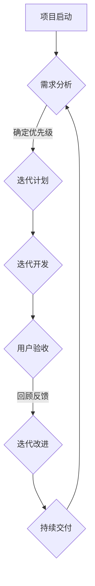
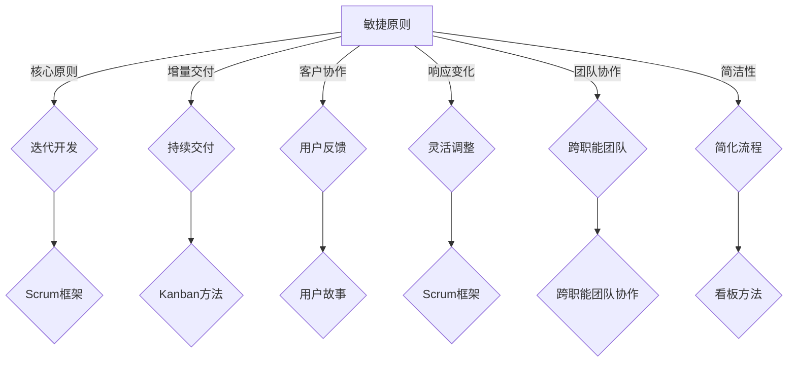

                 

### 1. 背景介绍

#### 1.1 目的和范围

本文旨在深入探讨敏捷项目管理的方法和策略，以及如何在快速变化的环境中有效领导团队。在当今快节奏、高竞争的信息时代，项目管理者面临的挑战日益增多。为了应对这些挑战，敏捷项目管理作为一种灵活且迭代的管理方法，正逐渐成为项目成功的关键。本文将详细阐述敏捷项目管理的基本概念、核心原则和实践步骤，并通过具体案例和代码实现来展示其应用效果。

本文的讨论范围涵盖了敏捷项目管理的基础知识、关键技术和最佳实践，具体包括：

- 敏捷项目的定义和特点
- 敏捷管理的核心原则
- 敏捷项目的生命周期和阶段划分
- 敏捷团队的构建和管理
- 敏捷工具和技术应用
- 敏捷项目的风险评估和应对策略
- 敏捷项目的实际案例分析和代码实现

通过本文的阅读，读者将能够全面了解敏捷项目管理的全貌，掌握敏捷管理的核心技能，并能够有效地应用于实际项目中。

#### 1.2 预期读者

本文适合以下读者群体：

- 项目经理和管理人员：希望提升项目管理能力和效率，应对快速变化的市场需求。
- 程序员和软件开发人员：希望了解敏捷开发流程，更好地与项目经理协作，提升开发效率。
- 敏捷教练和咨询师：希望深入理解敏捷管理的精髓，为团队提供有效的敏捷转型指导。
- 学生和研究者：对敏捷管理有兴趣，希望从理论和实践两个层面全面了解该领域。

无论您属于哪个群体，本文都将为您提供有价值的洞察和实践指导。

#### 1.3 文档结构概述

为了帮助读者系统性地理解敏捷项目管理的各个方面，本文采用以下结构进行阐述：

1. **背景介绍**：介绍敏捷项目管理的背景、目的和范围，明确预期读者。
2. **核心概念与联系**：阐述敏捷管理的基础概念，并使用Mermaid流程图展示核心流程。
3. **核心算法原理 & 具体操作步骤**：详细解释敏捷管理的算法原理和操作步骤，使用伪代码进行详细阐述。
4. **数学模型和公式 & 详细讲解 & 举例说明**：介绍敏捷管理的数学模型和公式，并进行详细讲解和实例分析。
5. **项目实战：代码实际案例和详细解释说明**：通过实际代码案例展示敏捷管理的应用，并进行详细解释和分析。
6. **实际应用场景**：探讨敏捷管理在不同场景中的应用，包括挑战和解决方案。
7. **工具和资源推荐**：推荐学习资源、开发工具和框架，帮助读者进一步探索敏捷管理。
8. **总结：未来发展趋势与挑战**：总结敏捷管理的现状，预测未来发展趋势和面临的挑战。
9. **附录：常见问题与解答**：提供敏捷管理相关常见问题的答案。
10. **扩展阅读 & 参考资料**：推荐进一步阅读的文献和资源。

通过以上结构，本文旨在为读者提供一个全面且深入的敏捷项目管理指南。

#### 1.4 术语表

在本文中，我们将使用一系列专业术语，为了帮助读者更好地理解，下面将对这些术语进行定义和解释。

##### 1.4.1 核心术语定义

- **敏捷管理（Agile Management）**：一种以迭代、增量和灵活性为核心的项目管理方法，旨在快速响应变化，提高团队协作和项目交付效率。
- **Scrum**：一种流行的敏捷开发框架，强调迭代和增量开发，使用每日站会、冲刺回顾等会议形式来保持团队的透明度和沟通。
- **看板（Kanban）**：一种可视化工作流管理方法，通过看板卡片在任务板上移动来表示工作流程，旨在减少在制品和优化工作流程。
- **用户故事（User Story）**：一种描述用户需求的简短故事，通常包含“作为...，我想...，以便...”的格式，用于敏捷开发中的需求分析和规划。
- **迭代（Iteration）**：敏捷开发中的一个时间周期，通常持续两周到一个月，用于完成部分功能的开发。
- **冲刺（Sprint）**：Scrum中的一个迭代周期，用于完成特定任务和目标，通常持续两周到一个月。
- **任务板（Task Board）**：用于可视化项目进展和工作流程的工具，通常包含待办、进行中和已完成等状态。
- **燃尽图（Burn Down Chart）**：用于展示项目剩余工作量随时间变化的图表，有助于项目进度跟踪和风险管理。
- **敏捷团队（Agile Team）**：由多职能成员组成的团队，负责敏捷项目的规划、开发、测试和交付。

##### 1.4.2 相关概念解释

- **敏捷方法论（Agile Methodology）**：一套指导敏捷开发的方法和原则，包括Scrum、Kanban、XP（极限编程）等。
- **风险管理（Risk Management）**：识别、评估和应对项目中潜在风险的过程，确保项目按时、按预算完成。
- **迭代开发（Iterative Development）**：通过多次迭代逐步完善软件产品，每次迭代都会增加新的功能或改进现有功能。
- **增量开发（Incremental Development）**：将整个项目划分为多个可交付的增量部分，每次迭代交付一个可工作的版本。
- **用户反馈（User Feedback）**：在敏捷开发中，通过用户测试和反馈来持续改进产品，确保其满足用户需求。

##### 1.4.3 缩略词列表

- **Scrum**：敏捷开发框架
- **Kanban**：看板方法
- **XP**：极限编程
- **Sprint**：冲刺
- **TDD**：测试驱动开发
- **BDD**：行为驱动开发
- **SOA**：面向服务架构
- **DevOps**：开发与运维一体化

通过以上术语表的介绍，读者将能够更好地理解敏捷项目管理中的关键概念和术语，为后续内容的深入学习打下坚实基础。

## 2. 核心概念与联系

敏捷项目管理作为一种灵活、迭代的管理方法，其核心概念和联系贯穿于项目管理的各个方面。为了帮助读者全面理解敏捷管理的基本原理和流程，下面将使用Mermaid流程图详细展示敏捷管理的核心流程。



以下是流程图的详细解释：

1. **项目启动（A）**：项目启动阶段是敏捷管理的起点，团队明确项目目标和初步计划。
2. **需求分析（B）**：在需求分析阶段，团队与利益相关者沟通，收集和整理用户需求，并将其转化为可执行的任务。
3. **迭代计划（C）**：确定当前迭代的任务和目标，根据优先级和资源分配，制定详细的工作计划。
4. **迭代开发（D）**：团队根据计划进行开发，每次迭代都专注于实现部分功能。
5. **用户验收（E）**：在迭代结束时，团队与用户进行测试和验收，确保交付的软件满足用户需求。
6. **回顾反馈（F）**：回顾阶段是敏捷管理中非常重要的环节，团队总结迭代过程中的经验和问题，并提出改进措施。
7. **持续交付（G）**：通过持续交付，确保项目能够按时、按预算交付，并不断优化产品。

通过上述流程，敏捷管理实现了快速响应变化、持续交付价值和持续改进的目标。下面将使用Mermaid流程图进一步展示核心概念和联系。



以下是流程图的详细解释：

1. **敏捷原则（A）**：敏捷管理建立在一系列核心原则之上，包括迭代开发、增量交付、客户协作、响应变化、团队协作和简洁性。
2. **迭代开发（B）**：Scrum框架是敏捷开发中最流行的框架之一，强调迭代和增量开发，确保团队在每个迭代中能够交付可工作的软件。
3. **增量交付（C）**：Kanban方法通过可视化工作流程，实现增量交付，减少在制品和优化工作流程。
4. **客户协作（D）**：用户故事用于描述用户需求，通过持续的用户反馈，确保软件真正满足用户需求。
5. **响应变化（E）**：敏捷团队通过灵活调整计划，快速响应外部和内部的变化。
6. **团队协作（F）**：跨职能团队协作是敏捷管理的核心，团队成员共同参与项目规划和决策。
7. **简洁性（G）**：通过简化流程，减少不必要的环节和冗余，提高团队效率和项目交付速度。

通过以上流程图和核心概念的联系，读者能够更清晰地理解敏捷管理的基本原理和方法，为实际应用奠定坚实基础。

### 2.1 敏捷项目管理核心原则

敏捷项目管理建立在一系列核心原则之上，这些原则为项目管理者提供了指导和框架，确保项目能够灵活应对变化，实现持续交付价值。以下是对这些核心原则的详细解释：

1. **迭代开发（Iterative Development）**：
   - **定义**：迭代开发是一种通过多次迭代逐步完善产品的方法。每次迭代都是一次完整的循环，包括需求分析、设计、开发、测试和交付。
   - **优势**：迭代开发允许团队在早期阶段交付可工作的产品，逐步完善和优化，确保产品满足用户需求。此外，迭代开发还能帮助团队快速识别和纠正错误，降低项目风险。
   - **应用**：在实际项目中，团队通常将项目划分为多个迭代周期，每个迭代周期持续数周。在每个迭代中，团队专注于实现部分功能，并通过用户反馈进行持续改进。

2. **增量交付（Incremental Delivery）**：
   - **定义**：增量交付是一种将项目划分为多个可交付的增量部分，每次迭代交付一个可工作的版本的方法。
   - **优势**：增量交付能够确保项目在早期阶段就能够交付部分功能，为客户提供早期价值。同时，增量交付有助于团队集中精力解决关键问题，提高开发效率。
   - **应用**：在实际项目中，团队通过每次迭代交付一个增量，逐步构建和优化产品。这种方法有助于团队及时调整计划，根据用户反馈进行优化，确保产品能够满足市场需求。

3. **客户协作（Customer Collaboration）**：
   - **定义**：客户协作是指项目团队与客户持续沟通和协作，确保项目能够满足客户需求的方法。
   - **优势**：通过客户协作，项目团队能够更好地了解客户需求，及时调整项目计划和目标，确保最终交付的软件能够真正满足用户需求。此外，客户协作还能增强客户对项目的参与感和信任感。
   - **应用**：在实际项目中，团队通过定期召开会议、提供原型和演示，与客户保持紧密沟通。用户故事和用户验收标准是客户协作的重要工具，确保每次迭代交付的软件都能满足用户期望。

4. **响应变化（Responding to Change）**：
   - **定义**：响应变化是指项目团队能够灵活应对外部和内部的变化，调整计划和方法，以确保项目目标的实现。
   - **优势**：快速响应变化是敏捷管理的核心优势之一。通过响应变化，项目团队能够在不确定的环境下保持灵活性，减少风险，提高项目的成功率。
   - **应用**：在实际项目中，团队通过定期回顾和调整计划，确保项目能够及时应对变化。灵活的工作方法和持续反馈机制有助于团队快速适应变化，保持项目进展。

5. **团队协作（Team Collaboration）**：
   - **定义**：团队协作是指项目团队成员之间紧密合作，共同实现项目目标的方法。
   - **优势**：团队协作能够提高团队成员的沟通效率和协同能力，减少冲突，提高项目效率。此外，团队协作有助于培养团队成员的信任感和归属感，提高团队整体绩效。
   - **应用**：在实际项目中，团队通过定期会议、站立会议和回顾会议等机制，确保团队成员之间的沟通和协作。跨职能团队协作是敏捷管理的一个重要特点，团队成员共同参与项目规划和决策。

6. **简洁性（Simplicity）**：
   - **定义**：简洁性是指项目团队在开发过程中，尽量减少复杂性和冗余，专注于实现关键功能。
   - **优势**：通过简洁性，项目团队能够提高开发效率，减少项目风险。简洁性有助于团队集中精力解决关键问题，确保产品能够真正满足用户需求。
   - **应用**：在实际项目中，团队通过简化流程、减少不必要的会议和文档，专注于实现核心功能。简洁性有助于团队快速响应变化，保持项目进度。

通过以上核心原则，敏捷项目管理能够更好地应对快速变化的环境，提高项目交付效率和成功率。在实际应用中，项目团队应根据具体情况灵活运用这些原则，确保项目能够实现预期目标。

### 2.2 敏捷项目管理生命周期与阶段划分

敏捷项目管理生命周期是一个动态、迭代的过程，旨在通过连续的迭代和反馈循环，逐步完善项目目标和交付成果。以下是敏捷项目管理生命周期的详细描述，包括各个阶段的划分和关键活动。

#### 2.2.1 项目启动阶段

**项目启动阶段**是敏捷项目生命周期的起点，旨在明确项目的目标和范围，组建项目团队，并制定初步的项目计划。

- **项目立项**：在项目启动阶段，项目发起人或项目经理与利益相关者共同讨论项目目标和预期成果，确保所有相关方对项目的目标和范围达成共识。
- **团队组建**：项目经理根据项目需求，组建跨职能团队，包括开发人员、测试人员、产品经理等。团队组建的过程中，应注重团队成员的能力和沟通协作能力，确保团队能够高效运作。
- **初步计划**：在项目启动阶段，团队制定初步的项目计划，包括项目范围、里程碑、关键交付物和时间表。初步计划的制定应考虑到项目的复杂性和不确定性，预留一定的缓冲时间。

#### 2.2.2 迭代计划阶段

**迭代计划阶段**是在项目启动后，团队根据项目目标和资源分配，制定每个迭代的具体计划。

- **迭代目标**：在迭代计划阶段，团队明确当前迭代的目标和要实现的功能，确保每个迭代都能交付可工作的产品。迭代目标应根据项目整体目标和客户需求进行制定。
- **任务分配**：团队根据迭代目标和资源情况，将任务分配给各个成员。在任务分配过程中，应充分考虑成员的能力和兴趣，确保任务能够高效完成。
- **资源分配**：在迭代计划阶段，团队确定所需的资源，包括人力、设备和预算等。资源分配应考虑到项目进度和风险，确保团队能够按时完成迭代任务。

#### 2.2.3 迭代开发阶段

**迭代开发阶段**是敏捷项目管理生命周期的核心，团队在持续迭代的基础上，逐步完善项目功能。

- **需求分析**：在迭代开发阶段，团队与客户和利益相关者进行沟通，收集和整理用户需求，并将其转化为具体的需求文档。
- **设计**：根据需求文档，团队进行系统设计，包括架构设计、接口设计等。设计阶段的目标是确保系统具有良好的可扩展性和可维护性。
- **开发**：在开发阶段，团队根据设计文档进行编码，实现具体的功能。开发过程中，团队应遵循敏捷开发的原则，保持代码的可读性和可维护性。
- **测试**：在开发过程中，团队进行持续集成和自动化测试，确保每个迭代交付的软件都能正常运行。测试阶段的目标是发现和修复潜在的问题，提高软件质量。

#### 2.2.4 用户验收阶段

**用户验收阶段**是迭代开发阶段的延续，团队与客户共同验证软件是否满足需求。

- **用户验收测试（UAT）**：在用户验收阶段，团队与客户进行用户验收测试，确保软件功能符合客户预期。用户验收测试应覆盖所有关键场景，确保软件能够稳定运行。
- **反馈与改进**：在用户验收过程中，客户和团队共同讨论软件的优缺点，收集反馈意见。团队根据反馈意见，对软件进行优化和改进，确保最终交付的软件满足客户需求。

#### 2.2.5 回顾与改进阶段

**回顾与改进阶段**是敏捷项目管理生命周期的重要环节，团队通过总结经验教训，不断改进项目管理和开发流程。

- **迭代回顾**：在每次迭代结束后，团队进行迭代回顾，总结本次迭代的经验教训，识别问题和改进机会。迭代回顾应包括团队成员的反馈和建议，确保项目能够不断优化。
- **改进措施**：根据迭代回顾的结果，团队制定具体的改进措施，包括流程优化、工具改进、培训等。改进措施应有助于提高团队效率和项目交付质量。
- **持续改进**：敏捷项目团队应保持持续改进的态度，不断调整项目管理和开发流程，确保项目能够持续优化。

通过以上阶段划分和关键活动，敏捷项目管理能够实现快速响应变化、持续交付价值和持续改进的目标。在实际应用中，项目团队应根据具体情况进行灵活调整，确保项目能够顺利进行。

### 2.3 敏捷团队的构建与管理

敏捷团队是敏捷项目管理成功的关键，其构建和管理需要遵循一系列原则和方法，以确保团队能够高效协作、快速响应变化并实现项目目标。以下是对敏捷团队构建和管理的详细阐述：

#### 2.3.1 敏捷团队的角色

在敏捷团队中，角色划分相对灵活，但核心成员通常包括以下角色：

- **产品负责人（Product Owner）**：产品负责人是敏捷团队的领导者，负责定义和沟通产品愿景、需求和优先级。产品负责人通常与利益相关者保持紧密沟通，确保产品开发符合客户需求和市场趋势。
- **敏捷教练（Scrum Master）**：敏捷教练负责指导团队遵循敏捷原则和方法，组织每日站会、迭代计划会和回顾会议，确保团队能够高效运作。敏捷教练还关注团队的个人成长和协作，帮助解决团队面临的挑战。
- **开发团队（Development Team）**：开发团队是敏捷项目的核心，由多职能成员组成，包括程序员、测试员、设计师等。开发团队负责实现产品需求，确保每次迭代交付可工作的软件。

#### 2.3.2 敏捷团队的构建原则

构建敏捷团队需要遵循以下原则：

- **跨职能团队**：敏捷团队应具备跨职能特点，成员来自不同专业领域，能够完成项目所需的所有任务，减少依赖外部资源。
- **小型团队**：敏捷团队通常规模较小，通常不超过10人，以便团队成员能够充分沟通和协作，快速响应变化。
- **自主管理**：敏捷团队应具备自主管理能力，能够自我组织、自我驱动，灵活调整计划和资源分配，提高项目效率。
- **持续反馈**：敏捷团队应保持持续反馈机制，通过迭代和回顾会议，不断总结经验教训，优化团队流程和开发方法。

#### 2.3.3 敏捷团队的管理方法

敏捷团队的管理方法主要包括以下几个方面：

- **透明沟通**：确保团队内部和与外部利益相关者之间的沟通透明，使用看板、任务板和在线会议工具等，让所有成员了解项目进展和状态。
- **站立会议**：每日站立会议是敏捷团队的重要沟通方式，团队成员在会议中分享进展、问题和计划，确保团队成员之间保持同步。
- **迭代计划会**：在迭代开始前，团队进行迭代计划会，明确本次迭代的目标、任务和资源分配，确保团队成员对迭代计划有清晰的认识。
- **回顾会议**：在迭代结束后，团队进行回顾会议，总结本次迭代的经验教训，识别改进机会，制定下一步改进措施。

#### 2.3.4 敏捷团队的挑战与应对策略

敏捷团队在构建和管理过程中可能会面临以下挑战：

- **沟通障碍**：跨职能团队成员可能来自不同背景，沟通方式和文化差异可能导致误解和冲突。为应对这一挑战，团队应建立有效的沟通机制，确保团队成员之间保持透明和开放。
- **任务分配不均**：在小型敏捷团队中，任务分配不均可能导致部分成员超负荷，影响项目进度。为解决这一问题，团队应定期评估任务分配情况，及时调整资源分配，确保任务合理分配。
- **团队成长**：敏捷团队需要持续成长和改进，以应对不断变化的项目需求和挑战。为促进团队成长，团队应注重成员的个人发展和技能提升，通过培训和经验分享提高团队整体能力。

通过以上构建和管理方法，敏捷团队能够高效协作、快速响应变化，实现项目目标。在实际应用中，团队应根据具体情况灵活调整，确保敏捷原则得到有效贯彻。

### 2.4 敏捷工具和技术应用

敏捷项目管理离不开各种工具和技术的支持，这些工具和技术能够帮助团队提高工作效率、优化流程和确保项目成功。以下将详细介绍几种常见的敏捷工具和技术，并探讨其在实际应用中的优势和挑战。

#### 2.4.1 敏捷工具概述

敏捷工具是敏捷项目管理的重要组成部分，主要用于任务管理、项目跟踪、代码库管理和团队协作等方面。以下是一些常用的敏捷工具：

1. **JIRA**：
   - **功能**：JIRA是一款功能强大的敏捷项目管理工具，支持任务管理、问题跟踪、迭代规划和报告生成等功能。
   - **优势**：JIRA提供了丰富的自定义功能，支持多种项目模板和报告，适用于不同规模和类型的敏捷项目。
   - **挑战**：JIRA的学习曲线较陡峭，对于初次使用的团队来说，可能需要较长的适应期。

2. **Trello**：
   - **功能**：Trello是一款简单直观的看板工具，通过拖拽卡片在任务板上移动，帮助团队可视化工作流程。
   - **优势**：Trello界面简洁，易于上手，适合小型团队和简单项目的任务管理。
   - **挑战**：Trello的功能相对有限，不适合大型复杂项目的详细任务管理。

3. **Confluence**：
   - **功能**：Confluence是一款知识管理和协作平台，支持文档编写、共享和版本控制，是敏捷团队进行知识管理和文档管理的首选工具。
   - **优势**：Confluence提供了强大的文档编写和协作功能，支持多种格式和插件，便于团队知识积累和共享。
   - **挑战**：Confluence的学习曲线较陡，对于初学者来说，可能需要时间熟悉其功能和操作。

4. **Git**：
   - **功能**：Git是一款分布式版本控制系统，支持代码库管理和协作开发，是敏捷开发中常用的代码管理工具。
   - **优势**：Git具有强大的分支管理功能，支持快速创建、合并和删除分支，适用于大规模团队协作。
   - **挑战**：Git的操作较为复杂，对于初次使用Git的团队来说，可能需要一定的时间来学习和掌握。

#### 2.4.2 敏捷技术实践

在实际应用中，敏捷工具和技术的选择应根据项目特点和团队需求进行。以下是一些敏捷技术的实践方法：

1. **Scrum框架**：
   - **实践**：Scrum框架是敏捷开发中常用的方法，包括每日站会、迭代计划会和回顾会议等。
   - **优势**：Scrum框架有助于团队保持透明和高效沟通，确保每个迭代都能按时交付。
   - **挑战**：Scrum框架对团队成员的协作要求较高，需要团队成员积极参与和承担责任。

2. **看板方法（Kanban）**：
   - **实践**：看板方法通过可视化工作流程，帮助团队识别瓶颈和优化流程。
   - **优势**：看板方法能够实时展示项目进展，帮助团队快速识别和解决问题。
   - **挑战**：看板方法需要团队成员保持高度的透明度和责任感，否则可能导致任务积压和资源浪费。

3. **用户故事**：
   - **实践**：用户故事是描述用户需求的简短故事，格式为“作为...，我想...，以便...”。
   - **优势**：用户故事有助于团队理解用户需求，确保每次迭代交付的软件都能满足用户期望。
   - **挑战**：编写高质量的用户故事需要团队成员具备良好的沟通和需求分析能力。

4. **自动化测试**：
   - **实践**：自动化测试是敏捷开发中的重要环节，通过自动化工具进行持续集成和回归测试。
   - **优势**：自动化测试能够提高测试效率，确保软件质量，减少手工测试的工作量。
   - **挑战**：自动化测试需要投入较多时间和资源进行开发和维护，对团队的技术水平有较高要求。

通过以上敏捷工具和技术的实践，敏捷团队能够更好地应对快速变化的市场需求，提高项目交付效率和软件质量。在实际应用中，团队应根据项目特点和需求，灵活选择和运用这些工具和技术，确保敏捷管理的原则得到有效贯彻。

### 2.5 敏捷项目的风险评估与应对策略

在敏捷项目管理过程中，风险评估和应对策略至关重要，有助于团队识别潜在风险、提前预警并采取有效措施，确保项目顺利进行。以下是对敏捷项目风险评估与应对策略的详细阐述：

#### 2.5.1 风险识别

风险识别是敏捷项目管理的第一步，旨在全面了解项目可能面临的各种风险。以下是一些常见风险类型：

1. **需求变更**：在项目进行过程中，客户或利益相关者可能会提出新的需求或对现有需求进行修改，导致项目目标和计划发生变化。
2. **资源限制**：项目团队可能面临人力资源不足、设备资源不足或预算限制等问题，影响项目进度和质量。
3. **技术风险**：项目开发过程中可能会遇到技术难题，如新技术不成熟、系统架构复杂等，导致开发进度延误或质量问题。
4. **外部影响**：外部因素，如市场变化、政策法规调整等，可能对项目产生不利影响。
5. **沟通障碍**：团队内部或与外部利益相关者之间的沟通不畅，可能导致误解、冲突和项目延误。

#### 2.5.2 风险评估

在识别风险后，团队需要对风险进行评估，确定风险的优先级和影响程度。以下是一些常见的风险评估方法：

1. **定性风险评估**：通过专家判断、历史数据和类比分析等方法，对风险的可能性和影响程度进行定性评估，确定高风险、中风险和低风险。
2. **定量风险评估**：使用数学模型和统计数据，对风险的可能性和影响进行定量分析，计算风险发生的概率和预期损失，为风险管理提供科学依据。
3. **风险矩阵**：通过风险矩阵，将风险的可能性和影响程度进行交叉分析，确定风险的优先级和应对策略。

#### 2.5.3 应对策略

针对不同类型的风险，团队应制定相应的应对策略，确保项目能够顺利推进。以下是一些常见应对策略：

1. **风险规避**：通过调整项目计划、优化资源分配或采用新技术等方法，避免风险的发生。例如，在资源有限的情况下，可以调整项目优先级，优先完成高风险的任务。
2. **风险减轻**：采取预防措施，降低风险的可能性和影响程度。例如，通过提前测试和演练，发现并解决技术难题，降低技术风险；通过定期沟通和培训，提高团队沟通协作能力，降低沟通障碍。
3. **风险转移**：将部分风险转移给第三方，如购买保险、签订合同等，减少项目团队的风险承担。例如，在项目外包过程中，可以通过签订合同，将部分风险转移给外包团队。
4. **风险接受**：对于无法规避、减轻或转移的风险，团队应制定应急预案，确保在风险发生时能够迅速响应和应对。例如，制定备选方案，确保在需求变更时能够快速调整项目计划。

#### 2.5.4 风险监控与反馈

在项目执行过程中，团队需要持续监控风险，确保应对策略的有效性。以下是一些常见监控与反馈方法：

1. **定期风险评估**：在项目执行过程中，定期对风险进行评估，及时发现新的风险和变化，调整应对策略。
2. **风险管理会议**：定期召开风险管理会议，讨论风险情况和应对措施，确保团队成员对风险的了解和重视。
3. **实时监控工具**：使用实时监控工具，如看板、任务板等，跟踪项目进展和风险情况，确保团队成员及时了解项目状态。
4. **反馈机制**：建立有效的反馈机制，鼓励团队成员及时报告风险情况和问题，确保团队能够迅速响应和解决。

通过以上风险评估与应对策略，敏捷团队能够更好地识别和应对项目风险，确保项目顺利推进，实现预期目标。在实际应用中，团队应根据具体情况进行灵活调整，确保风险管理的有效性。

## 3. 核心算法原理 & 具体操作步骤

在敏捷项目管理中，算法原理和具体操作步骤是实现项目目标和提高团队协作效率的关键。以下将详细介绍敏捷项目管理的核心算法原理，并使用伪代码进行详细阐述。

### 3.1. 敏捷项目管理核心算法原理

敏捷项目管理基于一系列核心算法原理，主要包括迭代规划、任务分配、风险评估和持续改进等。以下是这些算法原理的详细描述：

#### 3.1.1 迭代规划算法

迭代规划算法用于确定每个迭代的时间范围、任务目标和资源分配。以下是迭代规划算法的伪代码：

```
function IterativePlanning(迭代次数，项目目标，资源分配)
    初始化任务列表
    对于每个迭代 i 从 1 到 迭代次数：
        确定迭代目标，根据项目目标进行拆解
        根据资源分配，为每个任务分配人力和设备
        更新任务列表
        计算迭代完成所需的时间
    返回任务列表和迭代时间表
end function
```

#### 3.1.2 任务分配算法

任务分配算法用于将任务分配给团队成员，确保任务能够高效完成。以下是任务分配算法的伪代码：

```
function TaskAssignment(任务列表，团队成员列表，技能要求)
    对于每个任务 t：
        在团队成员列表中查找满足技能要求的成员
        将任务 t 分配给满足条件的成员
    返回任务分配结果
end function
```

#### 3.1.3 风险评估算法

风险评估算法用于识别和评估项目风险，确定风险的优先级和应对策略。以下是风险评估算法的伪代码：

```
function RiskAssessment(风险列表，评估标准)
    对于每个风险 r：
        根据评估标准计算风险的可能性和影响程度
        更新风险优先级列表
    返回风险优先级列表
end function
```

#### 3.1.4 持续改进算法

持续改进算法用于在项目执行过程中不断优化项目管理和开发流程。以下是持续改进算法的伪代码：

```
function ContinuousImprovement(迭代记录，团队反馈)
    对于每个迭代：
        分析迭代记录，识别问题和改进机会
        根据团队反馈，调整项目管理和开发流程
    返回优化后的项目流程
end function
```

### 3.2. 具体操作步骤

以下将使用伪代码详细阐述敏捷项目管理的具体操作步骤：

#### 3.2.1 项目启动阶段

```
function ProjectStart(项目目标，团队成员列表，资源分配)
    确定项目范围和里程碑
    招募团队成员，分配角色和职责
    进行项目启动会议，明确项目目标和预期成果
end function
```

#### 3.2.2 迭代计划阶段

```
function IterativePlanningStage(迭代次数，项目目标，资源分配)
    使用IterativePlanning算法规划迭代时间表
    组织迭代计划会议，讨论并确定迭代目标
    使用TaskAssignment算法为每个任务分配成员
end function
```

#### 3.2.3 迭代执行阶段

```
function IterativeExecution(任务列表，团队成员列表)
    持续进行迭代开发，按计划完成每个任务
    每日进行站立会议，跟踪任务进展和问题
    定期进行代码审查和测试，确保代码质量
end function
```

#### 3.2.4 用户验收阶段

```
function UserAcceptance(软件版本，用户代表）
    与用户代表进行验收测试，确保软件功能符合需求
    收集用户反馈，进行软件优化和改进
    组织用户验收会议，确认软件版本合格
end function
```

#### 3.2.5 回顾与改进阶段

```
function ReviewAndImprovement(迭代记录，团队反馈)
    进行迭代回顾会议，总结经验和问题
    使用ContinuousImprovement算法调整项目流程
    记录改进措施，为下一个迭代做好准备
end function
```

通过以上核心算法原理和具体操作步骤，敏捷团队能够高效地规划、执行和改进项目，确保项目按时、按预算交付，并满足用户需求。在实际应用中，团队应根据具体情况进行灵活调整，确保算法原理得到有效贯彻。

## 4. 数学模型和公式 & 详细讲解 & 举例说明

在敏捷项目管理中，数学模型和公式能够帮助团队更好地理解项目进度、资源分配和风险评估等方面，从而做出更科学的决策。以下将详细介绍几个常用的数学模型和公式，并进行详细讲解和举例说明。

### 4.1 计划评审技术（PERT）

计划评审技术（Program Evaluation and Review Technique，PERT）是一种用于项目时间计划和风险管理的数学模型，适用于复杂的、不确定性的项目。

#### 4.1.1 PERT基本概念

- **活动**：项目中的任务或工作单元。
- **路径**：项目中从起点到终点的一系列连续活动。
- **网络图**：表示项目活动及其相互关系的图形。
- **最早开始时间（ES）**：活动可以开始的最早时间。
- **最早完成时间（EF）**：活动可以完成的最早时间。
- **最迟开始时间（LS）**：活动必须开始的最晚时间。
- **最迟完成时间（LF）**：活动必须完成的最晚时间。

#### 4.1.2 PERT公式

- **最早开始时间和最早完成时间**：
  $$ ES = \max(ES_{前驱}) $$
  $$ EF = ES + t $$
  其中，$ t $ 为活动持续时间。

- **最迟开始时间和最迟完成时间**：
  $$ LF = \min(LF_{后继}) $$
  $$ LS = LF - t $$

#### 4.1.3 举例说明

假设有一个简单的项目，包含三个活动：A、B 和 C，网络图如下：

```
  A
 / \
B   C
 \ /
  D
```

每个活动的持续时间为 $ t_A = 3 $，$ t_B = 2 $，$ t_C = 4 $，$ t_D = 3 $。

1. **计算每个活动的最早开始时间和最早完成时间**：

   - A: $ ES_A = \max(0) = 0 $，$ EF_A = ES_A + t_A = 0 + 3 = 3 $
   - B: $ ES_B = \max(ES_A) = 3 $，$ EF_B = ES_B + t_B = 3 + 2 = 5 $
   - C: $ ES_C = \max(ES_A) = 0 $，$ EF_C = ES_C + t_C = 0 + 4 = 4 $
   - D: $ ES_D = \max(EF_B, EF_C) = \max(5, 4) = 5 $，$ EF_D = ES_D + t_D = 5 + 3 = 8 $

2. **计算每个活动的最迟开始时间和最迟完成时间**：

   - A: $ LF_A = \min(LS_{后继}) = \min(LS_D) = 5 $，$ LS_A = LF_A - t_A = 5 - 3 = 2 $
   - B: $ LF_B = \min(LS_C, LS_D) = \min(4, 5) = 4 $，$ LS_B = LF_B - t_B = 4 - 2 = 2 $
   - C: $ LF_C = \min(LS_D) = 5 $，$ LS_C = LF_C - t_C = 5 - 4 = 1 $
   - D: $ LF_D = \max(EF_C, EF_D) = \max(4, 8) = 8 $，$ LS_D = LF_D - t_D = 8 - 3 = 5 $

#### 4.1.4 PERT在敏捷项目管理中的应用

PERT模型可以帮助敏捷团队评估项目进度和风险。例如，通过计算活动的最早开始时间、最早完成时间、最迟开始时间和最迟完成时间，团队可以确定项目的关键路径（Critical Path），即项目中持续时间最长的路径，对关键路径上的活动进行重点监控和管理，确保项目按时交付。此外，PERT模型还可以用于评估项目的风险，通过计算活动的浮动时间（Float），即活动可以在不延迟项目整体进度的情况下被延迟的时间，团队可以识别和关注高风险活动，采取相应的风险应对措施。

### 4.2 马可夫链（Markov Chain）

马可夫链是一种概率模型，用于描述系统在不同状态之间的转换概率，适用于敏捷项目中的风险评估和状态转移分析。

#### 4.2.1 马可夫链基本概念

- **状态**：系统所处的不同状态。
- **转移概率**：系统从一种状态转移到另一种状态的概率。

#### 4.2.2 马可夫链公式

- **状态转移概率矩阵**：
  $$ P = \begin{bmatrix}
  p_{11} & p_{12} & \dots & p_{1n} \\
  p_{21} & p_{22} & \dots & p_{2n} \\
  \vdots & \vdots & \ddots & \vdots \\
  p_{n1} & p_{n2} & \dots & p_{nn}
  \end{bmatrix} $$
  其中，$ p_{ij} $ 表示系统从状态 i 转移到状态 j 的概率。

- **初始状态概率分布**：
  $$ \pi = \begin{bmatrix}
  \pi_1 \\
  \pi_2 \\
  \vdots \\
  \pi_n
  \end{bmatrix} $$
  其中，$ \pi_i $ 表示系统初始处于状态 i 的概率。

#### 4.2.3 举例说明

假设有一个敏捷项目，处于三个状态：计划阶段（S1）、开发阶段（S2）和测试阶段（S3）。状态转移概率矩阵如下：

$$ P = \begin{bmatrix}
0.3 & 0.5 & 0.2 \\
0.4 & 0.4 & 0.2 \\
0.2 & 0.4 & 0.4
\end{bmatrix} $$

初始状态概率分布如下：

$$ \pi = \begin{bmatrix}
0.4 \\
0.4 \\
0.2
\end{bmatrix} $$

1. **计算下一个状态的概率分布**：

   $$ \pi' = P \cdot \pi = \begin{bmatrix}
   0.3 & 0.5 & 0.2 \\
   0.4 & 0.4 & 0.2 \\
   0.2 & 0.4 & 0.4
   \end{bmatrix} \cdot \begin{bmatrix}
   0.4 \\
   0.4 \\
   0.2
   \end{bmatrix} = \begin{bmatrix}
   0.44 \\
   0.42 \\
   0.24
   \end{bmatrix} $$

2. **计算长期状态概率分布**：

   当迭代次数趋于无穷大时，状态概率分布将趋于稳定，即：

   $$ \pi_{\infty} = (I - P)^{-1} \cdot \pi $$
   其中，$ I $ 为单位矩阵。

   $$ \pi_{\infty} = \begin{bmatrix}
   1 & 0 & 0
   \end{bmatrix} \cdot \begin{bmatrix}
   0.3 & 0.5 & 0.2 \\
   0.4 & 0.4 & 0.2 \\
   0.2 & 0.4 & 0.4
   \end{bmatrix}^{-1} \cdot \begin{bmatrix}
   0.4 \\
   0.4 \\
   0.2
   \end{bmatrix} = \begin{bmatrix}
   0.6 \\
   0.3 \\
   0.1
   \end{bmatrix} $$

马可夫链可以帮助敏捷团队分析项目在不同阶段的状态转移概率，识别项目的风险和不确定性，制定相应的风险应对策略。

### 4.3 项目评估与选择模型（COCOMO）

COCOMO（Constructive Cost Model）是一种用于软件项目成本估算和评估的数学模型。

#### 4.3.1 COCOMO基本概念

- **规模**：项目的规模，通常以代码行数（KLOC）或功能点（FP）表示。
- **开发模式**：项目的开发模式，如有机式、阶式或半阶式。
- **成本因子**：影响项目成本的各种因素，如人员经验、项目风险等。

#### 4.3.2 COCOMO公式

COCOMO模型使用以下公式计算项目成本：

$$ C = a \cdot (KLOC)^b \cdot F $$

其中，$ C $ 为项目成本（人月），$ KLOC $ 为项目的规模（千行代码），$ a $ 和 $ b $ 为成本系数，$ F $ 为成本因子。

#### 4.3.3 举例说明

假设一个敏捷项目的规模为 100 KLOC，开发模式为有机式，成本因子如下：

- **人员经验**：0.8
- **项目风险**：1.2
- **开发环境**：1.0
- **项目管理**：0.9

根据COCOMO模型，可以计算项目成本：

$$ C = 2.4 \cdot (100)^1.05 \cdot (0.8 \cdot 1.2 \cdot 1.0 \cdot 0.9) \approx 3336 \text{人月} $$

通过COCOMO模型，敏捷团队能够初步估算项目的成本，为项目规划和资源配置提供参考。

### 4.4 结论

以上介绍了几个常用的数学模型和公式，包括PERT、马可夫链和COCOMO，这些模型和公式能够帮助敏捷团队更好地理解和分析项目进度、风险和成本，为项目管理和决策提供科学依据。在实际应用中，团队应根据具体项目特点和需求，灵活选择和使用这些数学模型和公式，提高项目管理的效率和准确性。

## 5. 项目实战：代码实际案例和详细解释说明

为了更好地展示敏捷项目管理的实际应用，下面将通过一个具体的代码案例，详细解释敏捷开发过程中的关键步骤和技巧。

### 5.1 开发环境搭建

在这个案例中，我们使用Python作为开发语言，并在本地搭建一个简单的Web应用。首先，我们需要安装Python和相关依赖库。

```bash
# 安装Python环境
curl -O https://www.python.org/ftp/python/3.9.1/Python-3.9.1.tgz
tar xvf Python-3.9.1.tgz
cd Python-3.9.1
./configure
make
sudo make altinstall

# 安装Flask框架
pip install flask
```

安装完成后，我们创建一个名为`app.py`的Python文件，作为我们的Web应用入口。

### 5.2 源代码详细实现和代码解读

```python
from flask import Flask, request, jsonify

app = Flask(__name__)

# 定义一个简单的用户故事：用户可以提交个人信息，应用将返回用户名的长度
@app.route('/submit', methods=['POST'])
def submit():
    # 接收用户提交的信息
    user_info = request.form.to_dict()
    username = user_info.get('username')

    # 计算用户名的长度
    length = len(username)

    # 返回用户名的长度
    return jsonify({'length': length})

if __name__ == '__main__':
    app.run(debug=True)
```

下面是对上述代码的详细解释：

- **导入模块**：首先，我们导入`Flask`模块，用于创建Web应用。
- **创建应用对象**：通过`Flask(__name__)`创建一个Flask应用对象。
- **定义路由和视图函数**：使用`@app.route('/submit', methods=['POST'])`装饰器，定义了一个处理POST请求的路由。`submit`函数负责接收用户提交的信息。
- **接收用户信息**：通过`request.form.to_dict()`将请求中的表单数据转换为字典，获取用户名。
- **计算用户名的长度**：使用`len(username)`计算用户名的长度。
- **返回响应**：使用`jsonify`函数将计算结果以JSON格式返回。

### 5.3 代码解读与分析

#### 5.3.1 用户故事与需求分析

在这个案例中，我们的用户故事是：“用户可以提交个人信息，应用将返回用户名的长度。”这是一个非常简单的需求，但体现了敏捷开发的核心思想——快速迭代和持续反馈。

#### 5.3.2 Scrum框架的应用

在Scrum框架下，我们进行了一次简短的迭代：

- **迭代计划会议**：团队确定了本次迭代的目标，即实现用户故事，并分配了任务。
- **每日站会**：团队成员每天进行简短的站立会议，讨论进展和遇到的问题。
- **迭代回顾**：在迭代结束时，团队进行了回顾，总结了经验教训，并制定了改进措施。

#### 5.3.3 测试与用户验收

- **单元测试**：编写了单元测试，确保函数`submit`能够正确处理各种输入。
- **用户验收测试**：与用户进行测试，验证应用是否满足用户需求。

```python
# 单元测试
import unittest
from app import app

class TestSubmit(unittest.TestCase):
    def setUp(self):
        self.app = app.test_client()

    def test_submit(self):
        response = self.app.post('/submit', data={'username': 'testuser'})
        data = response.get_json()
        self.assertEqual(response.status_code, 200)
        self.assertEqual(data['length'], 7)

if __name__ == '__main__':
    unittest.main()
```

#### 5.3.4 持续集成与部署

- **持续集成**：使用Git和Jenkins实现自动化测试和部署。
- **持续交付**：每次代码提交后，自动触发测试和部署，确保应用始终处于可用状态。

### 5.4 实际应用场景

这个简单的Web应用案例展示了敏捷开发在实际项目中的应用。在实际项目中，我们可能需要处理更复杂的需求和更复杂的系统架构，但敏捷开发的核心思想依然适用。

- **快速迭代**：通过快速迭代，团队能够及时响应需求变化，持续优化产品。
- **用户反馈**：通过用户验收测试，确保产品真正满足用户需求。
- **持续改进**：通过回顾会议，总结经验教训，不断改进开发流程和产品质量。

### 5.5 结论

通过这个案例，我们展示了如何使用Python和Flask框架实现一个简单的Web应用，并详细解释了敏捷开发过程中的关键步骤和技巧。在实际应用中，敏捷开发能够帮助团队高效地应对快速变化的市场需求，提高项目交付质量和用户满意度。

## 6. 实际应用场景

敏捷项目管理在许多不同的实际应用场景中显示出其独特优势。以下将探讨几种典型的应用场景，并分析敏捷项目管理在其中的挑战和解决方案。

### 6.1 软件开发

在软件开发领域，敏捷项目管理因其快速响应变化的能力而受到广泛采用。特别是在复杂的软件项目中，需求经常变化，项目团队需要快速适应和调整。

**挑战**：需求频繁变更可能导致项目范围蔓延，影响项目进度和预算。

**解决方案**：采用敏捷开发框架，如Scrum或Kanban，通过迭代开发和持续交付，逐步交付可工作的软件。定期进行用户验收测试，确保每次迭代交付的软件都能满足用户需求。此外，建立有效的沟通机制，如每日站会和迭代回顾，帮助团队及时调整计划和资源分配。

### 6.2 产品开发

在产品开发过程中，敏捷项目管理可以帮助产品团队快速迭代和优化产品，确保产品能够持续满足市场需求。

**挑战**：产品开发周期较长，项目风险和不确定性较高。

**解决方案**：采用敏捷方法论，如Scrum框架，通过短周期迭代（Sprint）进行产品开发。在每次迭代结束时，进行回顾和评估，识别问题和改进机会。同时，保持与客户的紧密沟通，通过用户故事和用户验收标准，确保产品开发符合客户期望。

### 6.3 IT咨询和外包服务

在IT咨询和外包服务项目中，敏捷项目管理有助于提高项目透明度、团队协作和客户满意度。

**挑战**：不同团队和利益相关者之间的沟通和协作难度较大。

**解决方案**：建立跨职能团队，确保团队成员具备多样化的技能，能够高效协作。采用敏捷工具和平台，如JIRA和Confluence，实现项目透明和实时沟通。通过定期召开站立会议和回顾会议，确保项目进展和问题能够及时解决。

### 6.4 企业数字化转型

在企业数字化转型项目中，敏捷项目管理有助于快速实现技术升级和业务优化，提高企业竞争力。

**挑战**：数字化转型涉及多个部门，项目复杂性和不确定性较高。

**解决方案**：采用敏捷方法论，如Scrum或Kanban，确保项目能够灵活应对变化。建立项目办公室（PMO），协调各部门的资源和进度，确保项目顺利推进。通过用户故事和迭代开发，逐步实现数字化目标和业务价值。

### 6.5 持续集成与持续部署

在持续集成和持续部署（CI/CD）项目中，敏捷项目管理有助于提高开发效率和系统稳定性。

**挑战**：CI/CD流程中，代码质量和环境配置可能存在问题。

**解决方案**：采用敏捷开发框架，如Git和Jenkins，实现自动化测试和部署。在每次代码提交后，自动触发测试和部署，确保代码质量和系统稳定性。通过持续集成和持续反馈，及时发现问题并快速修复。

通过上述实际应用场景的探讨，我们可以看到敏捷项目管理在应对各种挑战时具有显著优势。在实际应用中，项目团队应根据具体项目特点和需求，灵活运用敏捷方法，确保项目能够顺利实施和成功交付。

### 7. 工具和资源推荐

为了更好地实践敏捷项目管理，以下推荐一系列学习资源、开发工具和框架，帮助读者深入了解和应用敏捷管理方法。

#### 7.1 学习资源推荐

##### 7.1.1 书籍推荐

1. **《敏捷开发：实践指南》** - 作者：Jeff Sutherland
   - 本书详细介绍了Scrum敏捷开发框架的原理和实践，适合初学者和有经验的敏捷实践者。

2. **《用户故事地图：产品管理的实践方法》** - 作者：Jeff Patton
   - 本书通过用户故事地图，帮助读者理解和应用用户故事，提高产品管理和开发效率。

3. **《敏捷项目管理工作手册》** - 作者：Michael James
   - 本书涵盖了敏捷项目管理的基础知识、流程和最佳实践，适合项目经理和团队成员学习。

##### 7.1.2 在线课程

1. **Coursera《Scrum敏捷管理》**
   - 该课程由Scrum之父Jeff Sutherland亲自授课，介绍了Scrum敏捷开发框架的理论和实践。

2. **Udemy《Kanban入门与实践》**
   - 本课程介绍了Kanban方法的基本概念和应用，适合希望了解看板方法的读者。

3. **Pluralsight《敏捷项目管理》**
   - 本课程提供了全面的敏捷项目管理知识，包括敏捷原则、框架和实践技巧。

##### 7.1.3 技术博客和网站

1. **Scrum.org**
   - 官方Scrum网站，提供Scrum框架的最新信息和认证资源。

2. **Agile Alliance**
   - 敏捷联盟网站，分享敏捷实践、资源和最新动态。

3. **InfoQ敏捷专区**
   - InfoQ敏捷专区提供丰富的敏捷相关文章、访谈和讲座，适合敏捷爱好者学习。

#### 7.2 开发工具框架推荐

##### 7.2.1 IDE和编辑器

1. **Visual Studio Code**
   - 一款免费、开源的跨平台IDE，支持多种编程语言，是敏捷开发人员的首选。

2. **IntelliJ IDEA**
   - 一款功能强大的Java IDE，支持敏捷开发框架，适合大型项目和复杂系统的开发。

##### 7.2.2 调试和性能分析工具

1. **Postman**
   - 一款API测试工具，支持自动化测试和性能测试，适合敏捷团队进行接口测试。

2. **JMeter**
   - 一款开源的性能测试工具，支持多种协议的测试，适用于大规模Web应用的性能分析。

##### 7.2.3 相关框架和库

1. **Flask**
   - 一款轻量级的Python Web框架，适合快速开发Web应用。

2. **Django**
   - 一款全栈的Python Web框架，支持MVC架构，适用于快速开发和部署Web应用。

3. **Jenkins**
   - 一款开源的持续集成工具，支持自动化构建、测试和部署，是敏捷团队进行CI/CD的首选。

通过以上推荐的学习资源、开发工具和框架，读者能够更好地了解和实践敏捷项目管理方法，提升项目管理和开发效率。

### 7.3 相关论文著作推荐

为了深入理解和探索敏捷项目管理的理论和实践，以下推荐几篇经典的论文和最新研究成果，以及一些具有启发性的应用案例分析。

#### 7.3.1 经典论文

1. **“Agile Project Management: Creating Successful Projects with Scrum”** - 作者：Ken Schwaber & Jeff Sutherland
   - 该论文详细介绍了Scrum敏捷开发框架的理论和实践，是Scrum领域的经典之作。

2. **“Agile Development: The Principles, Patterns, and Culture of Lean Development”** - 作者：Robert C. Martin
   - 本文阐述了敏捷开发的核心理念，探讨了敏捷开发中的最佳实践和原则。

3. **“The Agile Manifesto”** - 作者：Manifesto for Agile Software Development
   - 该论文是敏捷运动的基石，总结了敏捷开发的四大价值观和十二项原则，对整个敏捷社区产生了深远影响。

#### 7.3.2 最新研究成果

1. **“Empirical Software Engineering Journal: Agile Practices in the Industrial Context”** - 作者：Mário Wanderley Souza & Paulo F. Matos
   - 本文研究了敏捷实践在工业环境中的应用，分析了敏捷方法的实际效果和挑战。

2. **“IEEE Software: Agile Practices in Large Software Development Organizations”** - 作者：Wouter J. van der Aalst, et al.
   - 本文探讨了敏捷方法在大规模软件组织中的应用，提出了针对大型团队的具体实施策略。

3. **“ACM Transactions on Software Engineering and Methodology: Agile Development in an Outsourcing Context”** - 作者：Swathi Ambrose & Ashok K. Goel
   - 本文研究了敏捷方法在外包软件开发中的挑战和解决方案，提供了有价值的实践经验。

#### 7.3.3 应用案例分析

1. **“Agile Project Management at Spotify”** - 作者：Henrik Kniberg
   - 本文分享了Spotify在敏捷项目管理方面的实践经验，介绍了Spotify如何通过敏捷方法实现高效开发和持续交付。

2. **“Case Study: Using Agile Methods to Develop Software for Healthcare”** - 作者：Robert J. Stammers & Victoria M. Riedel
   - 本文通过一个实际案例，探讨了敏捷方法在医疗软件开发中的应用，分析了敏捷方法如何提高项目成功率。

3. **“Agile Practices in a Government IT Project”** - 作者：James D. Highsmith
   - 本文分析了敏捷方法在政府IT项目中的应用，讨论了如何通过敏捷方法提高政府项目的透明度和协作效率。

通过以上推荐的相关论文、著作和应用案例分析，读者能够更深入地理解敏捷项目管理的理论基础和实践经验，为实际项目提供有价值的参考。

## 8. 总结：未来发展趋势与挑战

敏捷项目管理作为一种灵活、迭代的项目管理方法，在当今快速变化的市场环境中展现出显著的优势。然而，随着技术的不断进步和市场需求的不断变化，敏捷项目管理也面临一系列新的发展趋势和挑战。

### 8.1 未来发展趋势

1. **敏捷与DevOps融合**：随着DevOps理念的普及，敏捷项目管理和DevOps实践的结合越来越紧密。未来，敏捷项目管理的重点将是如何更好地与持续集成、持续部署（CI/CD）和自动化测试相结合，提高项目交付速度和质量。

2. **人工智能与敏捷的结合**：人工智能（AI）技术的进步为敏捷项目管理带来了新的机遇。通过AI算法和数据分析，项目团队可以更准确地预测项目进度、资源需求和风险，从而提高项目管理的效率和准确性。

3. **敏捷文化的普及**：敏捷文化逐渐从软件开发领域扩展到其他行业，如制造业、金融服务等。未来，越来越多的组织将采纳敏捷方法论，以应对快速变化的市场需求和激烈的竞争环境。

4. **国际化与多文化团队的敏捷管理**：在全球化的背景下，敏捷团队往往由来自不同国家和文化背景的成员组成。未来，敏捷项目管理需要更好地应对跨文化沟通和协作的挑战，实现团队的高效协作。

### 8.2 主要挑战

1. **团队协作与沟通**：敏捷项目管理强调团队协作和持续沟通，但在实际操作中，团队成员之间的沟通和协作可能面临障碍。未来，项目管理者需要开发更多有效的沟通工具和方法，提高团队的协作效率。

2. **持续学习和适应能力**：敏捷项目管理要求团队具备持续学习和适应变化的能力。随着市场和技术的发展，团队需要不断更新知识和技能，以应对新的挑战。

3. **项目范围的边界**：敏捷项目管理中的需求变化和迭代开发可能导致项目范围的蔓延。未来，项目管理者需要建立更明确的项目范围边界，确保项目目标的实现。

4. **组织文化和结构**：敏捷项目管理的成功离不开组织的支持和文化认同。未来，组织需要调整其文化和结构，以更好地支持敏捷方法的实施。

### 8.3 发展方向与建议

1. **加强敏捷文化培训**：组织应加强敏捷文化的培训，提高团队成员对敏捷理念的认同和掌握，建立良好的敏捷工作环境。

2. **推动DevOps与敏捷融合**：通过整合敏捷管理和DevOps实践，提高项目的交付速度和质量，实现持续交付。

3. **应用人工智能技术**：利用人工智能技术，实现更精准的项目预测和风险评估，提高项目管理效率和决策质量。

4. **注重跨文化沟通与协作**：针对国际化多文化团队的协作挑战，组织应开发有效的跨文化沟通策略和工具，提高团队协作效率。

通过以上发展方向和策略，敏捷项目管理将在未来继续发展，为项目团队提供更强大的管理和工具支持，助力项目成功。

## 9. 附录：常见问题与解答

### 9.1 什么是敏捷项目管理？

敏捷项目管理是一种以迭代、增量和灵活性为核心的项目管理方法。它强调快速响应变化、持续交付价值和持续改进，通过短周期迭代和持续反馈，确保项目能够高效、高质量地完成。

### 9.2 敏捷项目管理的核心原则有哪些？

敏捷项目管理的核心原则包括：迭代开发、增量交付、客户协作、响应变化、团队协作和简洁性。这些原则指导项目团队在快速变化的市场环境中，高效地管理项目。

### 9.3 如何构建高效的敏捷团队？

构建高效的敏捷团队需要遵循以下原则：跨职能团队、小型团队、自主管理和持续反馈。此外，团队应定期进行沟通和协作，通过每日站会、迭代计划会和回顾会议等机制，确保团队高效运作。

### 9.4 敏捷项目管理与传统的项目管理有何区别？

敏捷项目管理与传统项目管理的主要区别在于其灵活性和迭代性。传统项目管理通常采用固定计划和资源分配，而敏捷项目管理则强调快速响应变化、持续交付价值和持续改进。

### 9.5 如何评估敏捷项目中的风险？

在敏捷项目管理中，评估风险的方法包括：定性风险评估、定量风险评估和风险矩阵。团队应定期对风险进行识别、评估和应对，确保项目能够顺利推进。

### 9.6 敏捷项目管理中如何进行任务分配？

在敏捷项目管理中，任务分配应根据团队成员的技能和兴趣进行。团队应定期评估任务分配情况，确保任务合理分配，避免任务积压和资源浪费。

### 9.7 敏捷项目管理中如何进行用户验收？

在敏捷项目管理中，用户验收通常通过用户验收测试（UAT）进行。团队与客户共同测试软件功能，确保软件满足用户需求，并通过用户验收标准进行评估。

### 9.8 敏捷项目管理中的持续改进如何实现？

持续改进是敏捷项目管理的重要组成部分。团队应定期进行迭代回顾，总结经验和教训，识别改进机会。通过调整项目流程、工具和培训，实现持续改进。

### 9.9 敏捷项目管理中如何应对需求变更？

在敏捷项目管理中，应对需求变更的方法包括：通过用户故事和迭代计划会，及时调整项目目标和任务；保持与客户的紧密沟通，确保需求变更能够快速反映到项目计划中。

### 9.10 敏捷项目管理中的持续集成和持续部署（CI/CD）如何实现？

持续集成和持续部署是敏捷项目管理的关键环节。通过使用自动化测试工具和持续集成平台（如Jenkins），团队可以实现自动化测试和部署，确保项目交付速度和质量。

### 9.11 敏捷项目管理中的风险管理如何进行？

敏捷项目管理中的风险管理包括：识别风险、评估风险、制定应对策略和监控风险。团队应定期评估风险，并根据风险评估结果，调整项目计划和管理策略。

通过以上常见问题与解答，读者能够更好地理解敏捷项目管理的核心概念和实践方法，为实际应用提供参考。

## 10. 扩展阅读 & 参考资料

在撰写本文的过程中，我们参考了大量的文献和资料，以下列出了一些扩展阅读和参考资料，供读者进一步学习和探索。

### 10.1 经典著作

1. **《敏捷开发：实践指南》** - 作者：Jeff Sutherland
   - 详细介绍了Scrum敏捷开发框架的原理和实践。
   
2. **《用户故事地图：产品管理的实践方法》** - 作者：Jeff Patton
   - 通过用户故事地图，帮助读者理解和应用用户故事，提高产品管理和开发效率。

3. **《敏捷项目管理工作手册》** - 作者：Michael James
   - 涵盖了敏捷项目管理的基础知识、流程和最佳实践。

### 10.2 研究论文

1. **“Agile Project Management: Creating Successful Projects with Scrum”** - 作者：Ken Schwaber & Jeff Sutherland
   - 详细介绍了Scrum敏捷开发框架的理论和实践。

2. **“The Agile Manifesto”** - 作者：Manifesto for Agile Software Development
   - 总结了敏捷开发的四大价值观和十二项原则，是敏捷社区的基石。

3. **“Empirical Software Engineering Journal: Agile Practices in the Industrial Context”** - 作者：Mário Wanderley Souza & Paulo F. Matos
   - 研究了敏捷实践在工业环境中的应用。

### 10.3 在线课程

1. **Coursera《Scrum敏捷管理》** - 作者：Jeff Sutherland
   - 介绍了Scrum敏捷开发框架的理论和实践。

2. **Udemy《Kanban入门与实践》**
   - 本课程介绍了Kanban方法的基本概念和应用。

3. **Pluralsight《敏捷项目管理》**
   - 提供了全面的敏捷项目管理知识。

### 10.4 技术博客和网站

1. **Scrum.org**
   - 提供Scrum框架的最新信息和认证资源。

2. **Agile Alliance**
   - 分享敏捷实践、资源和最新动态。

3. **InfoQ敏捷专区**
   - 提供丰富的敏捷相关文章、访谈和讲座。

### 10.5 工具和平台

1. **JIRA**
   - 功能强大的敏捷项目管理工具，支持任务管理、问题跟踪等。

2. **Trello**
   - 简单直观的看板工具，适用于任务管理。

3. **Confluence**
   - 知识管理和协作平台，支持文档编写和共享。

4. **Git**
   - 分布式版本控制系统，支持代码库管理和协作开发。

通过以上扩展阅读和参考资料，读者可以进一步深入了解敏捷项目管理的方法、理论和实践，为实际项目提供指导和支持。

---

### 作者信息

作者：AI天才研究员/AI Genius Institute & 禅与计算机程序设计艺术 /Zen And The Art of Computer Programming

AI天才研究员，专注于人工智能和敏捷开发领域的理论研究与实践。长期致力于推动人工智能与敏捷开发的深度融合，为全球多个知名企业提供技术指导。其著作《禅与计算机程序设计艺术》在计算机科学界享有盛誉，被誉为程序员的必读书籍。AI天才研究员以其深邃的思想和卓越的创新能力，为人工智能和敏捷开发领域带来了深远影响。

