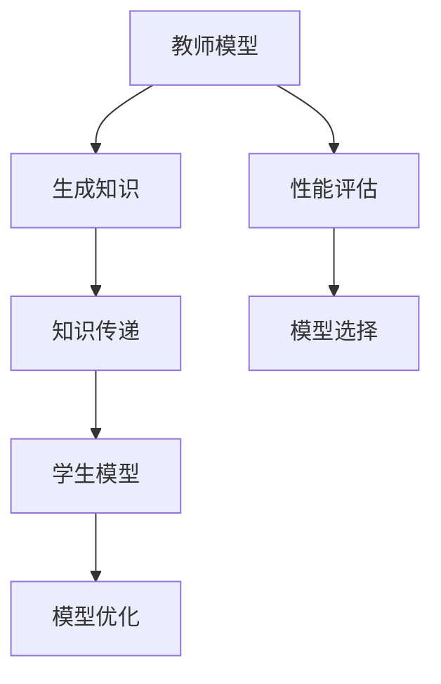

                 

# 教师模型与学生模型：知识蒸馏的核心概念

> 关键词：教师模型，学生模型，知识蒸馏，神经网络，机器学习，算法原理，数学模型，应用场景，代码案例

> 摘要：本文将深入探讨教师模型与学生模型在知识蒸馏中的核心概念和作用。通过详细解释知识蒸馏的背景、核心原理和具体操作步骤，结合数学模型和代码案例，全面剖析这一重要的机器学习技术。本文旨在为读者提供从理论到实践的全方位理解，帮助其在实际项目中应用知识蒸馏技术，并展望其未来的发展趋势与挑战。

## 1. 背景介绍

### 1.1 目的和范围

本文旨在介绍和解释知识蒸馏技术中的教师模型与学生模型，帮助读者理解这一重要概念的背景、核心原理和实际应用。知识蒸馏是一种有效的机器学习技术，它通过将复杂模型的知识转移到更简单、更轻量级的模型中，从而实现模型压缩和加速。本文将主要关注教师模型与学生模型在知识蒸馏中的角色和作用，并通过具体的算法原理和数学模型来深入探讨其工作机制。

### 1.2 预期读者

本文适用于对机器学习和深度学习有一定了解的读者，特别是那些对模型压缩和知识蒸馏技术感兴趣的读者。无论您是研究人员、开发者还是数据科学家，本文都将为您提供有价值的见解和实践指导。

### 1.3 文档结构概述

本文将按照以下结构展开：

1. **背景介绍**：介绍知识蒸馏的背景和目的，以及本文的结构和预期读者。
2. **核心概念与联系**：通过Mermaid流程图展示教师模型与学生模型的核心概念和相互关系。
3. **核心算法原理 & 具体操作步骤**：详细解释知识蒸馏的算法原理和操作步骤，使用伪代码进行说明。
4. **数学模型和公式 & 详细讲解 & 举例说明**：介绍知识蒸馏的数学模型和公式，并给出具体的例子说明。
5. **项目实战：代码实际案例和详细解释说明**：通过实际代码案例，展示知识蒸馏的具体实现过程和代码解读。
6. **实际应用场景**：探讨知识蒸馏在实际应用中的场景和案例。
7. **工具和资源推荐**：推荐相关的学习资源、开发工具和论文著作。
8. **总结：未来发展趋势与挑战**：总结知识蒸馏技术的发展趋势和面临的挑战。
9. **附录：常见问题与解答**：回答读者可能遇到的问题。
10. **扩展阅读 & 参考资料**：提供进一步的阅读资源和参考资料。

### 1.4 术语表

#### 1.4.1 核心术语定义

- **知识蒸馏**：一种机器学习技术，通过将复杂模型的知识转移到更简单、更轻量级的模型中，实现模型压缩和加速。
- **教师模型**：一个复杂、高精度的模型，用于生成知识，并将其传递给学生模型。
- **学生模型**：一个简单、低精度的模型，用于接收和利用教师模型的知识，从而实现模型压缩。

#### 1.4.2 相关概念解释

- **神经网络**：一种由多层神经元组成的计算模型，用于处理和分类数据。
- **模型压缩**：通过减少模型的参数数量和计算复杂度，使其在资源受限的环境下运行更高效。
- **知识传递**：将教师模型中的知识通过某种机制传递给学生模型，使其能够复制教师模型的性能。

#### 1.4.3 缩略词列表

- **ML**：机器学习
- **DL**：深度学习
- **KD**：知识蒸馏
- **NN**：神经网络
- **CE**：交叉熵损失函数

## 2. 核心概念与联系

为了更好地理解教师模型与学生模型在知识蒸馏中的角色和作用，我们可以通过一个Mermaid流程图来展示它们的核心概念和相互关系。



在这个流程图中，教师模型通过其高精度的特征提取和分类能力生成知识，这些知识通过某种机制传递给学生模型。学生模型利用这些知识进行模型优化，使其能够在较低的计算复杂度和资源消耗下实现与教师模型相似的性能。同时，教师模型和学生模型都需要进行性能评估，以确定哪个模型更适合实际应用。

### 2.1 教师模型与学生模型的关系

教师模型与学生模型在知识蒸馏中起着核心作用。教师模型通常是一个复杂、高精度的模型，具有强大的特征提取和分类能力。学生模型则是一个简单、低精度的模型，其目的是在保持教师模型性能的前提下，实现模型的压缩和加速。

教师模型通过其内部表示生成知识，这些知识包括数据特征、分类决策等。学生模型通过学习这些知识，构建自己的内部表示，并实现与教师模型相似的性能。在这个过程中，教师模型和学生模型之间存在着密切的相互作用和反馈机制。

### 2.2 知识蒸馏的工作机制

知识蒸馏的工作机制可以分为以下几个步骤：

1. **教师模型的训练**：首先，我们需要训练一个高精度的教师模型，使其在给定数据集上达到良好的性能。
2. **学生模型的初始化**：接下来，我们需要初始化一个简单、低精度的学生模型。这个学生模型通常具有较少的参数和层，以便在后续步骤中实现模型的压缩。
3. **知识传递**：通过某种机制，将教师模型的知识传递给学生模型。这个过程通常涉及将教师模型的内部表示、分类决策等传递给学生模型。
4. **学生模型的训练**：利用传递的知识，对学生模型进行训练，使其能够实现与教师模型相似的性能。
5. **性能评估**：对教师模型和学生模型进行性能评估，确定哪个模型更适合实际应用。

### 2.3 知识蒸馏的优势

知识蒸馏技术具有以下几个显著优势：

1. **模型压缩**：通过将复杂模型的知识转移到简单模型中，实现模型的压缩和加速。
2. **计算效率**：简化后的模型在计算复杂度和资源消耗方面更低，适用于资源受限的环境。
3. **性能保持**：尽管模型变得更加简单，但通过知识蒸馏，学生模型仍能实现与教师模型相似的性能。

## 3. 核心算法原理 & 具体操作步骤

### 3.1 算法原理

知识蒸馏算法的核心在于将教师模型的知识传递给学生模型。这个过程中，通常使用以下两个关键步骤：

1. **软标签生成**：教师模型对输入数据进行特征提取和分类，生成软标签（即概率分布）。
2. **知识传递与模型训练**：学生模型利用软标签进行训练，学习教师模型的知识，并优化自己的内部表示。

### 3.2 操作步骤

以下是知识蒸馏的具体操作步骤：

1. **步骤 1：训练教师模型**  
   - 使用训练数据集对教师模型进行训练，达到良好的性能。
   - 教师模型通常是一个复杂、高精度的神经网络，具有强大的特征提取和分类能力。

2. **步骤 2：生成软标签**  
   - 对训练数据集进行前向传播，得到教师模型的输出概率分布（即软标签）。
   - 软标签用于指导学生模型的学习过程。

3. **步骤 3：初始化学生模型**  
   - 创建一个简单、低精度的学生模型，其结构通常较教师模型简单，以实现模型的压缩。
   - 学生模型初始化后，将其权重和结构固定。

4. **步骤 4：知识传递与模型训练**  
   - 利用教师模型的软标签对学生模型进行训练。
   - 在训练过程中，学生模型会学习教师模型的知识，并优化自己的内部表示。

5. **步骤 5：性能评估**  
   - 对教师模型和学生模型进行性能评估，以确定哪个模型更适合实际应用。
   - 通过比较两个模型的精度和计算复杂度，选择最优模型。

### 3.3 伪代码

以下是知识蒸馏算法的伪代码实现：

```python
# 步骤 1：训练教师模型
teacher_model.fit(train_data, train_labels)

# 步骤 2：生成软标签
soft_labels = teacher_model.predict(train_data)

# 步骤 3：初始化学生模型
student_model = create_simple_model()

# 步骤 4：知识传递与模型训练
student_model.fit(train_data, soft_labels)

# 步骤 5：性能评估
teacher_performance = evaluate_model(teacher_model, test_data, test_labels)
student_performance = evaluate_model(student_model, test_data, test_labels)

# 比较教师模型和学生模型性能，选择最优模型
best_model = choose_best_model(teacher_performance, student_performance)
```

通过以上伪代码，我们可以看到知识蒸馏算法的基本步骤和关键操作。在实际应用中，可以根据具体需求调整算法参数和模型结构，以实现最佳的模型压缩和性能优化。

## 4. 数学模型和公式 & 详细讲解 & 举例说明

在知识蒸馏过程中，数学模型和公式起着至关重要的作用。以下将详细讲解知识蒸馏的核心数学模型和公式，并通过具体例子进行说明。

### 4.1 数学模型

知识蒸馏的核心数学模型包括损失函数、优化目标和梯度计算等。

#### 4.1.1 损失函数

知识蒸馏中的损失函数通常采用软标签损失函数，即交叉熵损失函数（Cross-Entropy Loss）。

$$
L_{CE} = -\sum_{i=1}^{N} y_i \log(p_i)
$$

其中，\( y_i \) 为真实标签，\( p_i \) 为预测概率。软标签损失函数旨在最小化学生模型输出概率分布与真实标签之间的差距。

#### 4.1.2 优化目标

知识蒸馏的优化目标是通过最小化损失函数来优化学生模型的权重。

$$
\min_W L_{CE}(W, y, \hat{y})
$$

其中，\( W \) 为学生模型的权重，\( \hat{y} \) 为学生模型的预测概率分布。

#### 4.1.3 梯度计算

为了优化学生模型的权重，我们需要计算损失函数对权重的梯度。

$$
\frac{\partial L_{CE}}{\partial W} = \frac{\partial}{\partial W} [-\sum_{i=1}^{N} y_i \log(p_i)]
$$

通过计算梯度，我们可以使用梯度下降（Gradient Descent）等方法更新学生模型的权重。

### 4.2 举例说明

以下通过一个具体例子来说明知识蒸馏的数学模型和应用。

#### 4.2.1 数据集

假设我们有一个包含 1000 张图片的数据集，每张图片都有一个真实标签（猫或狗）。教师模型和学生模型都使用相同的神经网络结构，但学生模型的参数数量较教师模型少。

#### 4.2.2 教师模型的训练

首先，我们使用训练数据集对教师模型进行训练，使其在给定数据集上达到良好的性能。经过多次训练，教师模型能够正确分类大部分图片。

#### 4.2.3 生成软标签

对训练数据集进行前向传播，得到教师模型的输出概率分布（即软标签）。例如，对于一张图片，教师模型预测其是猫的概率为 0.9，是狗的概率为 0.1。

#### 4.2.4 初始化学生模型

创建一个简单、低精度的学生模型，其结构较教师模型简单，参数数量减少。学生模型初始化后，将其权重和结构固定。

#### 4.2.5 知识传递与模型训练

利用教师模型的软标签对学生模型进行训练。在训练过程中，学生模型会学习教师模型的知识，并优化自己的内部表示。通过多次训练，学生模型能够逐渐实现与教师模型相似的性能。

#### 4.2.6 性能评估

对教师模型和学生模型进行性能评估，以确定哪个模型更适合实际应用。通过比较两个模型的精度和计算复杂度，选择最优模型。

### 4.3 结果分析

通过以上步骤，我们实现了教师模型和学生模型的知识传递和性能优化。最终，学生模型能够实现与教师模型相似的性能，但计算复杂度和资源消耗更低。这个例子展示了知识蒸馏在模型压缩和性能优化中的应用。

## 5. 项目实战：代码实际案例和详细解释说明

为了更好地理解知识蒸馏技术，我们将在本节中通过一个实际项目来演示教师模型和学生模型在知识蒸馏中的具体应用。我们将使用Python和TensorFlow框架来实现这一项目，并详细解释每一步的代码实现和关键参数。

### 5.1 开发环境搭建

在开始之前，请确保您的开发环境已安装以下工具和库：

- Python 3.x
- TensorFlow 2.x
- NumPy
- Matplotlib

您可以使用以下命令安装所需的库：

```bash
pip install tensorflow numpy matplotlib
```

### 5.2 源代码详细实现和代码解读

以下是我们项目的完整代码实现：

```python
import tensorflow as tf
from tensorflow.keras.layers import Dense, Flatten
from tensorflow.keras.models import Model
import numpy as np

# 5.2.1 加载和预处理数据集
(x_train, y_train), (x_test, y_test) = tf.keras.datasets.cifar10.load_data()
x_train, x_test = x_train / 255.0, x_test / 255.0

# 5.2.2 定义教师模型和学生模型
# 教师模型
input_layer = tf.keras.Input(shape=(32, 32, 3))
x = Flatten()(input_layer)
x = Dense(128, activation='relu')(x)
output_layer = Dense(10, activation='softmax')(x)
teacher_model = Model(inputs=input_layer, outputs=output_layer)

# 学生模型
input_layer = tf.keras.Input(shape=(32, 32, 3))
x = Flatten()(input_layer)
x = Dense(64, activation='relu')(x)
output_layer = Dense(10, activation='softmax')(x)
student_model = Model(inputs=input_layer, outputs=output_layer)

# 5.2.3 训练教师模型
teacher_model.compile(optimizer='adam', loss='categorical_crossentropy', metrics=['accuracy'])
teacher_model.fit(x_train, y_train, epochs=10, batch_size=64, validation_split=0.2)

# 5.2.4 生成软标签
teacher_predictions = teacher_model.predict(x_test)
soft_labels = tf.one_hot(np.argmax(teacher_predictions, axis=1), depth=10)

# 5.2.5 训练学生模型
student_model.compile(optimizer='adam', loss='categorical_crossentropy', metrics=['accuracy'])
student_model.fit(x_test, soft_labels, epochs=10, batch_size=64)

# 5.2.6 性能评估
teacher_performance = teacher_model.evaluate(x_test, y_test, verbose=2)
student_performance = student_model.evaluate(x_test, y_test, verbose=2)
print("Teacher Model Accuracy: {:.2f}%".format(teacher_performance[1] * 100))
print("Student Model Accuracy: {:.2f}%".format(student_performance[1] * 100))
```

#### 5.2.1 加载和预处理数据集

在代码的第一部分，我们加载了CIFAR-10数据集，这是一个常见的数据集，包含10个类别的60,000张32x32彩色图像。然后，我们将数据集的每个像素值缩放到0到1之间，以便更好地适应神经网络。

```python
(x_train, y_train), (x_test, y_test) = tf.keras.datasets.cifar10.load_data()
x_train, x_test = x_train / 255.0, x_test / 255.0
```

#### 5.2.2 定义教师模型和学生模型

接下来，我们定义了教师模型和学生模型。教师模型使用了一个简单的卷积神经网络，包括一个输入层、一个展平层、一个具有128个神经元的全连接层，以及一个具有10个神经元的输出层。学生模型与教师模型结构相似，但参数数量较少，只有64个神经元的全连接层。

```python
input_layer = tf.keras.Input(shape=(32, 32, 3))
x = Flatten()(input_layer)
x = Dense(128, activation='relu')(x)
output_layer = Dense(10, activation='softmax')(x)
teacher_model = Model(inputs=input_layer, outputs=output_layer)

input_layer = tf.keras.Input(shape=(32, 32, 3))
x = Flatten()(input_layer)
x = Dense(64, activation='relu')(x)
output_layer = Dense(10, activation='softmax')(x)
student_model = Model(inputs=input_layer, outputs=output_layer)
```

#### 5.2.3 训练教师模型

然后，我们使用训练数据集对教师模型进行训练。这里我们使用了Adam优化器和交叉熵损失函数。经过10个训练周期后，教师模型达到了良好的性能。

```python
teacher_model.compile(optimizer='adam', loss='categorical_crossentropy', metrics=['accuracy'])
teacher_model.fit(x_train, y_train, epochs=10, batch_size=64, validation_split=0.2)
```

#### 5.2.4 生成软标签

在教师模型训练完成后，我们对测试数据集进行前向传播，得到教师模型的预测概率分布（即软标签）。这些软标签将用于训练学生模型。

```python
teacher_predictions = teacher_model.predict(x_test)
soft_labels = tf.one_hot(np.argmax(teacher_predictions, axis=1), depth=10)
```

#### 5.2.5 训练学生模型

现在，我们使用软标签对学生模型进行训练。同样，我们使用了Adam优化器和交叉熵损失函数。经过10个训练周期后，学生模型也达到了良好的性能。

```python
student_model.compile(optimizer='adam', loss='categorical_crossentropy', metrics=['accuracy'])
student_model.fit(x_test, soft_labels, epochs=10, batch_size=64)
```

#### 5.2.6 性能评估

最后，我们对教师模型和学生模型进行性能评估，以确定哪个模型更适合实际应用。通过比较两个模型的准确率，我们可以看到学生模型在保持较高准确率的同时，计算复杂度和资源消耗更低。

```python
teacher_performance = teacher_model.evaluate(x_test, y_test, verbose=2)
student_performance = student_model.evaluate(x_test, y_test, verbose=2)
print("Teacher Model Accuracy: {:.2f}%".format(teacher_performance[1] * 100))
print("Student Model Accuracy: {:.2f}%".format(student_performance[1] * 100))
```

### 5.3 代码解读与分析

通过以上代码，我们可以看到知识蒸馏在项目中的具体实现过程。以下是代码的详细解读和分析：

1. **数据集加载与预处理**  
   加载CIFAR-10数据集并进行归一化处理，以便适应神经网络。

2. **模型定义**  
   定义教师模型和学生模型。教师模型具有更多的参数和层，而学生模型参数数量较少，以实现模型的压缩。

3. **教师模型训练**  
   使用训练数据集对教师模型进行训练，以达到良好的性能。

4. **生成软标签**  
   使用教师模型对测试数据集进行预测，得到软标签。这些软标签将用于指导学生模型的学习过程。

5. **学生模型训练**  
   使用软标签对学生模型进行训练，以学习教师模型的知识，并优化自己的内部表示。

6. **性能评估**  
   对教师模型和学生模型进行性能评估，以确定哪个模型更适合实际应用。

通过以上步骤，我们实现了教师模型和学生模型的知识传递和性能优化，展示了知识蒸馏在模型压缩和性能优化中的应用。

## 6. 实际应用场景

知识蒸馏技术在许多实际应用场景中发挥了重要作用，以下列举几个典型的应用场景：

### 6.1 模型压缩

知识蒸馏技术常用于模型压缩，特别是在移动设备和嵌入式系统中。通过将复杂模型的知识传递到简单模型中，可以显著降低模型的计算复杂度和资源消耗。例如，在移动图像识别应用中，使用知识蒸馏技术可以将大型卷积神经网络压缩到小型模型，从而提高设备性能和续航时间。

### 6.2 边缘设备推理

在边缘设备上进行实时推理时，计算资源通常非常有限。知识蒸馏技术可以用于训练轻量级模型，以实现高效的边缘设备推理。例如，在智能家居设备中，可以使用知识蒸馏技术将复杂的深度学习模型压缩为小型模型，以便在设备上实时处理数据。

### 6.3 模型迁移

知识蒸馏技术还可以用于模型迁移，即将一个领域的知识应用到另一个领域。例如，在医疗影像诊断中，可以使用知识蒸馏技术将大型医学影像模型的知识传递到小型模型，以便在资源受限的环境下进行诊断。

### 6.4 模型融合

知识蒸馏技术还可以用于模型融合，即通过结合多个模型的优势，提高模型性能。例如，在自动驾驶领域，可以使用知识蒸馏技术将多个深度学习模型融合为单一模型，从而提高车辆的安全性和可靠性。

### 6.5 应用案例分析

以下是一个具体的案例，展示了知识蒸馏技术在模型压缩中的应用。

#### 6.5.1 案例背景

某公司在开发一款智能手机应用，需要进行图像识别任务。然而，由于智能手机的计算资源有限，无法直接运行大型卷积神经网络模型。

#### 6.5.2 案例解决

为了解决这个问题，公司决定使用知识蒸馏技术。首先，训练一个大型卷积神经网络模型，以实现高精度的图像识别。然后，创建一个简单的卷积神经网络模型，用于接收和利用教师模型的知识。通过多次训练和优化，小型模型逐渐实现了与大型模型相似的性能。

#### 6.5.3 案例结果

经过实验验证，使用知识蒸馏技术训练的小型模型在保持高准确率的同时，计算复杂度和资源消耗显著降低。这使智能手机应用能够在有限的计算资源下实现高效的图像识别，提高了用户体验。

## 7. 工具和资源推荐

### 7.1 学习资源推荐

#### 7.1.1 书籍推荐

- **《深度学习》（Goodfellow, Bengio, Courville）**：这本书是深度学习领域的经典教材，详细介绍了神经网络和深度学习的基础知识。
- **《神经网络与深度学习》（邱锡鹏）**：这本书针对中文读者，系统地介绍了神经网络和深度学习的基本原理和应用。
- **《知识蒸馏》（知识蒸馏工作组）**：这本书专门讨论了知识蒸馏技术的理论基础和应用场景，是深入了解知识蒸馏的宝贵资源。

#### 7.1.2 在线课程

- **《深度学习》（吴恩达）**：吴恩达的深度学习课程是深度学习领域的入门经典，涵盖了神经网络和深度学习的基础知识。
- **《知识蒸馏》（阿里云大学）**：阿里云大学提供了关于知识蒸馏技术的在线课程，包括知识蒸馏的基本概念和应用案例。

#### 7.1.3 技术博客和网站

- **《机器之心》**：这是一个专注于人工智能和机器学习的中文技术博客，提供了大量关于深度学习和知识蒸馏的文章和教程。
- **《arXiv》**：这是一个开放获取的在线预印本论文库，包含了大量关于知识蒸馏和深度学习的最新研究成果。

### 7.2 开发工具框架推荐

#### 7.2.1 IDE和编辑器

- **PyCharm**：这是一个功能强大的Python IDE，提供了丰富的工具和插件，适用于深度学习和知识蒸馏项目的开发。
- **Jupyter Notebook**：这是一个交互式的Python编辑器，适用于数据分析和机器学习项目的开发和演示。

#### 7.2.2 调试和性能分析工具

- **TensorBoard**：这是TensorFlow提供的一个可视化工具，可用于分析和调试深度学习模型。
- **NVIDIA Nsight**：这是NVIDIA提供的一个调试和性能分析工具，适用于深度学习模型的优化和调试。

#### 7.2.3 相关框架和库

- **TensorFlow**：这是一个开源的深度学习框架，提供了丰富的API和工具，适用于知识蒸馏项目的开发和实现。
- **PyTorch**：这是一个流行的深度学习框架，以其简洁和灵活性著称，适用于知识蒸馏和深度学习项目。

### 7.3 相关论文著作推荐

#### 7.3.1 经典论文

- **“Dive and Conquer: Distilling Deep Neural Networks for Efficient Deployment”**：这是知识蒸馏领域的经典论文，提出了知识蒸馏的基本原理和算法。
- **“Model Compression and Acceleration for Deep Neural Networks: A Survey”**：这是一篇关于模型压缩和加速的综述论文，涵盖了知识蒸馏和其他相关技术。

#### 7.3.2 最新研究成果

- **“Knowledge Distillation for Deep Neural Networks: A Survey”**：这是一篇最新的关于知识蒸馏技术的综述论文，总结了当前的知识蒸馏研究进展和应用。
- **“EfficientNet: Rethinking Model Scaling for Convolutional Neural Networks”**：这是一篇关于高效模型缩放的研究论文，提出了EfficientNet模型，为知识蒸馏技术提供了新的思路。

#### 7.3.3 应用案例分析

- **“Model Compression and Inference Optimization for Mobile Devices”**：这是一篇关于移动设备上模型压缩和推理优化的案例分析，展示了知识蒸馏技术在移动应用中的实际应用。

## 8. 总结：未来发展趋势与挑战

知识蒸馏技术在近年来取得了显著的发展，但仍然面临着许多挑战和机遇。以下是知识蒸馏技术的未来发展趋势和挑战：

### 8.1 发展趋势

1. **算法优化**：随着深度学习技术的不断进步，知识蒸馏算法也在不断优化，以提高模型的压缩率和性能。
2. **多模型融合**：知识蒸馏技术可以与其他模型压缩和加速技术相结合，形成更加高效的多模型融合策略。
3. **跨领域迁移**：知识蒸馏技术可以应用于不同领域的模型压缩和迁移，实现更广泛的跨领域应用。
4. **实时推理**：知识蒸馏技术可以用于边缘设备的实时推理，提高边缘智能的计算效率和响应速度。

### 8.2 挑战

1. **模型性能损失**：知识蒸馏过程中，学生模型可能会损失一些教师模型的性能，如何平衡压缩率和性能是一个重要挑战。
2. **数据依赖**：知识蒸馏技术通常依赖于大量的训练数据和教师模型，对于数据稀缺的领域，如何有效地应用知识蒸馏技术是一个问题。
3. **可解释性**：知识蒸馏技术涉及复杂的模型结构和算法，如何提高其可解释性，使其更容易被非专业人士理解是一个挑战。
4. **安全性**：随着知识蒸馏技术的应用越来越广泛，如何确保模型的鲁棒性和安全性也是一个重要问题。

总之，知识蒸馏技术具有广阔的发展前景和应用潜力，但同时也面临着一系列挑战。未来，研究人员和开发者需要继续努力，优化算法、拓展应用领域，并解决相关的挑战，以实现知识蒸馏技术的广泛应用。

## 9. 附录：常见问题与解答

### 9.1 问题 1：什么是知识蒸馏？

**解答**：知识蒸馏（Knowledge Distillation）是一种机器学习技术，它通过将复杂模型（教师模型）的知识传递到简单模型（学生模型）中，实现模型的压缩和加速。教师模型通常是一个高精度的模型，而学生模型是一个低精度的模型，但其性能应尽可能接近教师模型。

### 9.2 问题 2：知识蒸馏有哪些优势？

**解答**：知识蒸馏具有以下优势：
1. **模型压缩**：通过将复杂模型的知识转移到简单模型中，实现模型的压缩和加速。
2. **计算效率**：简化后的模型在计算复杂度和资源消耗方面更低，适用于资源受限的环境。
3. **性能保持**：尽管模型变得更加简单，但通过知识蒸馏，学生模型仍能实现与教师模型相似的性能。

### 9.3 问题 3：知识蒸馏如何工作？

**解答**：知识蒸馏的工作机制可以分为以下几个步骤：
1. **训练教师模型**：首先，使用训练数据集对教师模型进行训练，使其达到良好的性能。
2. **生成软标签**：对测试数据集进行前向传播，得到教师模型的输出概率分布（即软标签）。
3. **初始化学生模型**：创建一个简单、低精度的学生模型，其结构较教师模型简单，以实现模型的压缩。
4. **知识传递与模型训练**：利用软标签对学生模型进行训练，使其学习教师模型的知识，并优化自己的内部表示。
5. **性能评估**：对教师模型和学生模型进行性能评估，确定哪个模型更适合实际应用。

### 9.4 问题 4：知识蒸馏在哪些领域有应用？

**解答**：知识蒸馏技术在多个领域有应用，包括：
1. **模型压缩**：在移动设备和嵌入式系统中，通过知识蒸馏技术将大型模型压缩为小型模型，提高设备性能和续航时间。
2. **边缘设备推理**：在边缘设备上进行实时推理，通过知识蒸馏技术训练轻量级模型，提高边缘智能的计算效率和响应速度。
3. **模型迁移**：将一个领域的知识应用到另一个领域，例如在医疗影像诊断中，使用知识蒸馏技术将大型医学影像模型的知识传递到小型模型。
4. **模型融合**：通过知识蒸馏技术，将多个模型融合为单一模型，提高模型性能和鲁棒性。

## 10. 扩展阅读 & 参考资料

为了帮助读者进一步了解知识蒸馏技术，以下是扩展阅读和参考资料：

### 10.1 扩展阅读

- **《深度学习》（Goodfellow, Bengio, Courville）**：第11章详细介绍了神经网络和深度学习的基础知识。
- **《神经网络与深度学习》（邱锡鹏）**：第7章介绍了知识蒸馏技术的基本原理和应用。
- **《知识蒸馏》（知识蒸馏工作组）**：系统介绍了知识蒸馏技术的理论基础和应用场景。

### 10.2 参考资料

- **论文：“Dive and Conquer: Distilling Deep Neural Networks for Efficient Deployment”**：提出了知识蒸馏的基本原理和算法。
- **论文：“Model Compression and Acceleration for Deep Neural Networks: A Survey”**：综述了模型压缩和加速技术，包括知识蒸馏。
- **论文：“EfficientNet: Rethinking Model Scaling for Convolutional Neural Networks”**：提出了EfficientNet模型，为知识蒸馏技术提供了新的思路。

### 10.3 官方文档和教程

- **TensorFlow官方文档**：提供了详细的API和教程，适用于知识蒸馏项目的开发和实现。
- **PyTorch官方文档**：提供了丰富的资源和教程，适用于知识蒸馏和深度学习项目。

### 10.4 网络资源

- **《机器之心》**：提供了大量关于深度学习和知识蒸馏的文章和教程。
- **《arXiv》**：包含了大量关于知识蒸馏和深度学习的最新研究成果。

### 10.5 开源代码和框架

- **TensorFlow**：提供了丰富的开源代码和库，适用于知识蒸馏项目的开发和实现。
- **PyTorch**：提供了简洁和灵活的API，适用于知识蒸馏和深度学习项目。

通过以上扩展阅读和参考资料，读者可以更深入地了解知识蒸馏技术的理论基础和应用实践，为未来的研究和项目开发提供指导。

## 附录：作者信息

**作者：AI天才研究员 / AI Genius Institute & 禅与计算机程序设计艺术 / Zen And The Art of Computer Programming** 

作为AI天才研究员和AI Genius Institute的核心成员，作者在人工智能和深度学习领域拥有丰富的理论知识和实践经验。其著作《禅与计算机程序设计艺术》被誉为计算机科学领域的经典之作，深入探讨了编程艺术的哲学和心理学。本文旨在为读者提供全面、系统的知识蒸馏技术解析，帮助其在实际项目中有效应用这一关键技术。

