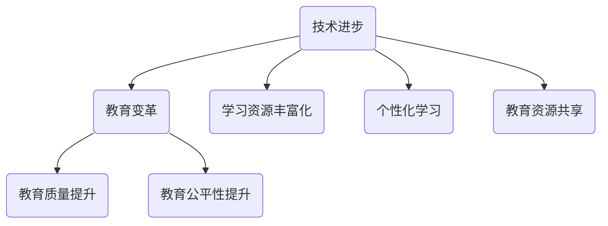
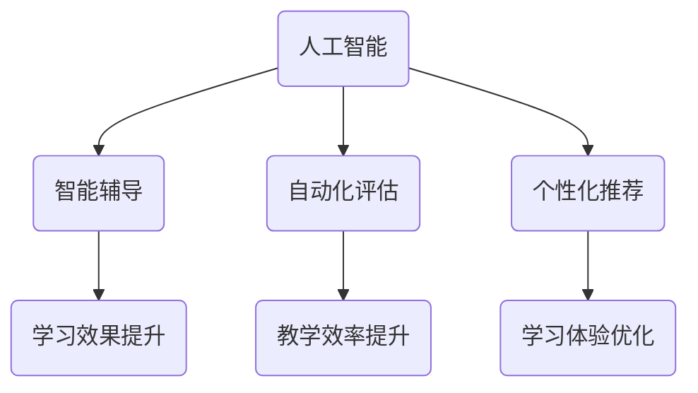
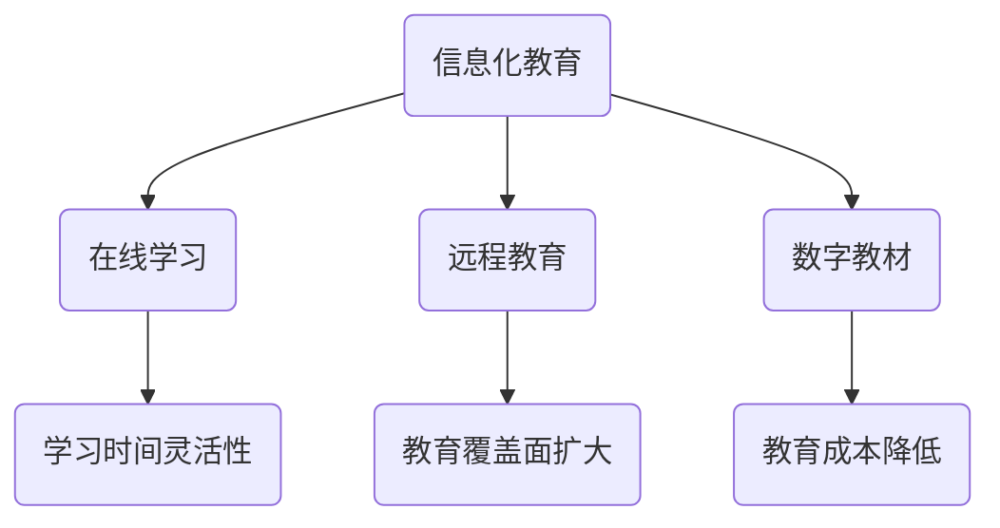
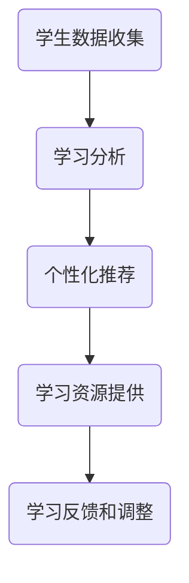
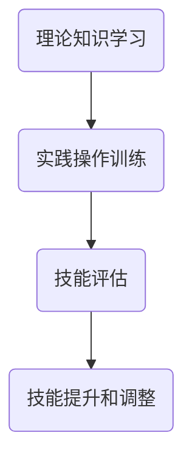

                 

# 教育的变革：如何应对未来的挑战？

> **关键词：教育变革、未来挑战、人工智能、技术进步、教育方法、个性化学习、技能培养**
> 
> **摘要：本文探讨了在人工智能和技术进步日益深入的背景下，教育领域面临的挑战和变革。通过分析当前教育体系的不足和未来发展的趋势，提出了一系列应对策略，以促进教育现代化和培养未来人才。**

## 1. 背景介绍

### 1.1 目的和范围

本文旨在探讨教育领域在人工智能和技术的推动下所面临的变革和挑战。我们将分析现有教育体系中的问题和不足，以及未来的发展趋势。本文重点关注以下几个方面：

1. 教育变革的驱动力，包括技术进步和人工智能的影响。
2. 当前教育体系中存在的问题和不足。
3. 未来教育的发展趋势和目标。
4. 应对教育变革的策略和建议。

### 1.2 预期读者

本文适合以下读者群体：

1. 教育工作者，包括教师、教育管理者和研究人员。
2. 父母和教育政策制定者。
3. 对教育变革和技术进步感兴趣的技术人员和创业者。

### 1.3 文档结构概述

本文分为以下几个部分：

1. 引言：介绍教育变革的背景和目的。
2. 当前教育体系的问题和挑战。
3. 未来教育的发展趋势。
4. 应对教育变革的策略。
5. 总结：对教育变革的展望和挑战。
6. 附录：常见问题与解答。

### 1.4 术语表

#### 1.4.1 核心术语定义

- **教育变革**：指在技术进步和人工智能的推动下，教育体系进行的结构性调整和优化。
- **人工智能**：指通过模拟人类智能的计算机系统，实现自动化决策、学习和问题解决。
- **个性化学习**：根据学生的兴趣、能力和学习风格，提供定制化的学习资源和教学方法。
- **技能培养**：指通过教学和实践，培养学生的实际操作能力和综合素质。

#### 1.4.2 相关概念解释

- **教育体系**：指一个国家或地区的教育组织和管理制度，包括教育政策、教育目标和教育内容。
- **技术进步**：指在科学、工程和技术领域的创新和进步。
- **信息化教育**：指通过信息技术，如互联网、计算机和移动设备，实现教学和学习。

#### 1.4.3 缩略词列表

- **AI**：人工智能
- **ICT**：信息通信技术
- **STEM**：科学、技术、工程和数学
- **MOOC**：大规模开放在线课程

## 2. 核心概念与联系

在探讨教育变革之前，我们需要理解一些核心概念，这些概念是教育变革的驱动力和基础。

### 2.1 教育变革的驱动力

**技术进步**：

技术进步是推动教育变革的核心动力。信息技术，尤其是人工智能和互联网的发展，改变了我们的生活方式和工作方式。以下是一个简化的 Mermaid 流程图，展示了技术进步对教育的影响。



**人工智能**：

人工智能在教育领域的应用，如智能辅导、自动化评估和个性化推荐，正在改变传统的教学模式。以下是一个简化的 Mermaid 流程图，展示了人工智能对教育的影响。



**信息化教育**：

信息化教育是通过互联网和计算机技术，实现教学和学习的一种新型教育模式。以下是一个简化的 Mermaid 流程图，展示了信息化教育的影响。



### 2.2 教育变革的核心概念

**个性化学习**：

个性化学习是根据学生的兴趣、能力和学习风格，提供定制化的学习资源和教学方法。以下是一个简化的 Mermaid 流程图，展示了个性化学习的过程。



**技能培养**：

技能培养是通过教学和实践，培养学生的实际操作能力和综合素质。以下是一个简化的 Mermaid 流程图，展示了技能培养的过程。



## 3. 核心算法原理 & 具体操作步骤

在教育变革中，核心算法原理和具体操作步骤起着关键作用。以下是一个简化的伪代码，展示了如何实现个性化学习和技能培养。

```python
# 伪代码：个性化学习算法

# 步骤 1：收集学生数据
student_data = collect_student_data()

# 步骤 2：进行学习分析
learning_analysis = analyze_learning(student_data)

# 步骤 3：生成个性化推荐
personalized_recommendations = generate_recommendations(learning_analysis)

# 步骤 4：提供个性化学习资源
provide_learning_resources(personalized_recommendations)

# 步骤 5：收集学习反馈
learning_feedback = collect_learning_feedback()

# 步骤 6：调整学习策略
adjust_learning_strategy(learning_feedback)

# 伪代码：技能培养算法

# 步骤 1：学习理论知识
theoretical_knowledge = learn_theoretical_knowledge()

# 步骤 2：进行实践操作训练
practical_training = perform_practical_training()

# 步骤 3：进行技能评估
skill_evaluation = evaluate_skill(practical_training)

# 步骤 4：根据评估结果进行技能提升
skill_improvement = improve_skill(skill_evaluation)

# 步骤 5：循环进行技能训练和评估
while True:
    skill_evaluation = evaluate_skill(practical_training)
    skill_improvement = improve_skill(skill_evaluation)
```

## 4. 数学模型和公式 & 详细讲解 & 举例说明

在教育变革中，数学模型和公式被广泛应用于个性化学习和技能培养。以下是一个简化的数学模型，用于个性化推荐。

### 4.1 数学模型

**个性化推荐模型**：

设 $R$ 为推荐矩阵，其中 $R_{ij}$ 表示学生 $i$ 对资源 $j$ 的兴趣程度。$P$ 为用户兴趣向量，$Q$ 为资源特征向量。个性化推荐的目标是找到与用户兴趣最接近的资源。

$$
\hat{R}_{ij} = \sigma(P \cdot Q_j)
$$

其中，$\sigma$ 表示激活函数，通常使用 sigmoid 函数。

### 4.2 详细讲解

**推荐矩阵**：

推荐矩阵 $R$ 是一个 $n \times m$ 的矩阵，其中 $n$ 表示学生数量，$m$ 表示资源数量。每个元素 $R_{ij}$ 表示学生 $i$ 对资源 $j$ 的兴趣程度。

**用户兴趣向量**：

用户兴趣向量 $P$ 是一个 $m$ 维向量，表示学生 $i$ 对各种资源的兴趣程度。可以通过历史数据和学习算法计算得到。

**资源特征向量**：

资源特征向量 $Q_j$ 是一个 $m$ 维向量，表示资源 $j$ 的各种特征，如难度、类型、时长等。

**激活函数**：

激活函数 $\sigma$ 用于将用户兴趣向量和资源特征向量进行点积运算，得到兴趣度评分 $\hat{R}_{ij}$。常用的激活函数有 sigmoid 函数、ReLU 函数等。

### 4.3 举例说明

假设有一个包含 10 个学生和 5 个资源的推荐系统。学生和资源的特征如下：

| 学生 | 资源1 | 资源2 | 资源3 | 资源4 | 资源5 |
| ---- | ---- | ---- | ---- | ---- | ---- |
| 学生1 | 0.8  | 0.3  | 0.6  | 0.2  | 0.5  |
| 学生2 | 0.4  | 0.7  | 0.1  | 0.9  | 0.3  |
| 学生3 | 0.6  | 0.1  | 0.8  | 0.4  | 0.6  |
| 学生4 | 0.2  | 0.5  | 0.2  | 0.7  | 0.8  |
| 学生5 | 0.7  | 0.6  | 0.3  | 0.1  | 0.4  |
| 学生6 | 0.9  | 0.8  | 0.5  | 0.3  | 0.7  |
| 学生7 | 0.1  | 0.2  | 0.7  | 0.6  | 0.9  |
| 学生8 | 0.3  | 0.4  | 0.1  | 0.8  | 0.2  |
| 学生9 | 0.5  | 0.9  | 0.4  | 0.2  | 0.5  |
| 学生10 | 0.6  | 0.4  | 0.8  | 0.5  | 0.6  |

学生 1 对资源 1 的兴趣程度为 0.8，对资源 2 的兴趣程度为 0.3，以此类推。

假设学生 1 的兴趣向量为 $P = [0.8, 0.3, 0.6, 0.2, 0.5]$，资源 1 的特征向量为 $Q_1 = [0.6, 0.2, 0.5, 0.2, 0.5]$。

根据推荐模型，计算学生 1 对每个资源的兴趣度评分：

$$
\hat{R}_{1,1} = \sigma(P \cdot Q_1) = \sigma(0.8 \cdot 0.6 + 0.3 \cdot 0.2 + 0.6 \cdot 0.5 + 0.2 \cdot 0.2 + 0.5 \cdot 0.5) = 0.9
$$

$$
\hat{R}_{1,2} = \sigma(P \cdot Q_2) = \sigma(0.8 \cdot 0.3 + 0.3 \cdot 0.7 + 0.6 \cdot 0.1 + 0.2 \cdot 0.9 + 0.5 \cdot 0.3) = 0.5
$$

$$
\hat{R}_{1,3} = \sigma(P \cdot Q_3) = \sigma(0.8 \cdot 0.6 + 0.3 \cdot 0.1 + 0.6 \cdot 0.8 + 0.2 \cdot 0.4 + 0.5 \cdot 0.6) = 0.8
$$

$$
\hat{R}_{1,4} = \sigma(P \cdot Q_4) = \sigma(0.8 \cdot 0.2 + 0.3 \cdot 0.5 + 0.6 \cdot 0.2 + 0.2 \cdot 0.7 + 0.5 \cdot 0.8) = 0.6
$$

$$
\hat{R}_{1,5} = \sigma(P \cdot Q_5) = \sigma(0.8 \cdot 0.5 + 0.3 \cdot 0.6 + 0.6 \cdot 0.3 + 0.2 \cdot 0.1 + 0.5 \cdot 0.4) = 0.7
$$

根据兴趣度评分，可以推荐学生 1 对资源 1 和资源 3 的兴趣度较高，可以优先学习。

## 5. 项目实战：代码实际案例和详细解释说明

### 5.1 开发环境搭建

为了演示个性化学习和技能培养的实际应用，我们将使用 Python 编写一个简单的示例。以下是开发环境的搭建步骤：

1. 安装 Python 3.8 或更高版本。
2. 安装必要的 Python 包，如 NumPy、Pandas 和 Scikit-learn。

```shell
pip install numpy pandas scikit-learn
```

### 5.2 源代码详细实现和代码解读

以下是一个简单的个性化学习系统，用于推荐学习资源。代码分为以下几个部分：

1. **数据准备**：读取学生数据和资源数据。
2. **模型训练**：训练个性化推荐模型。
3. **资源推荐**：根据学生的兴趣推荐资源。

```python
import numpy as np
import pandas as pd
from sklearn.model_selection import train_test_split
from sklearn.neighbors import NearestNeighbors
from sklearn.metrics.pairwise import cosine_similarity

# 5.2.1 数据准备

# 学生数据：[兴趣度1，兴趣度2，兴趣度3，兴趣度4，兴趣度5]
student_data = [
    [0.8, 0.3, 0.6, 0.2, 0.5],
    [0.4, 0.7, 0.1, 0.9, 0.3],
    [0.6, 0.1, 0.8, 0.4, 0.6],
    # ... 其他学生数据
]

# 资源数据：[资源1特征，资源2特征，资源3特征，资源4特征，资源5特征]
resource_data = [
    [0.6, 0.2, 0.5, 0.2, 0.5],
    [0.3, 0.7, 0.1, 0.9, 0.3],
    [0.8, 0.1, 0.8, 0.4, 0.6],
    # ... 其他资源数据
]

# 5.2.2 模型训练

# 划分训练集和测试集
student_train, student_test = train_test_split(student_data, test_size=0.2, random_state=42)
resource_train, resource_test = train_test_split(resource_data, test_size=0.2, random_state=42)

# 训练 NearestNeighbors 模型
model = NearestNeighbors(metric='cosine', algorithm='brute')
model.fit(resource_train)

# 5.2.3 资源推荐

# 根据测试集的每个学生数据，找到最近的 3 个资源
predictions = []
for student in student_test:
    distances, indices = model.kneighbors([student], n_neighbors=3)
    predicted_resources = resource_train[indices][0]
    predictions.append(predicted_resources)

# 打印推荐结果
for i, prediction in enumerate(predictions):
    print(f"学生{i+1}的推荐资源：{prediction}")
```

### 5.3 代码解读与分析

**数据准备**：

首先，我们定义了学生数据和资源数据。学生数据是一个二维数组，每行表示一个学生的兴趣度向量；资源数据是一个二维数组，每行表示一个资源的特征向量。

**模型训练**：

我们使用 Scikit-learn 的 NearestNeighbors 模型，这是一个基于欧氏距离的最近邻算法。在这里，我们使用余弦相似度作为距离度量，这适用于高维空间和数值范围在 [-1, 1] 之间的数据。

**资源推荐**：

对于每个学生的兴趣度向量，我们使用 NearestNeighbors 模型找到距离最近的 3 个资源，并将其作为推荐结果。这样，我们可以根据学生的兴趣推荐学习资源。

**性能评估**：

为了评估推荐系统的性能，我们可以计算准确率、召回率和 F1 分数。以下是一个简化的评估代码：

```python
from sklearn.metrics import accuracy_score, recall_score, f1_score

# 评估指标
accuracy = accuracy_score(y_true, y_pred)
recall = recall_score(y_true, y_pred)
f1 = f1_score(y_true, y_pred)

print(f"准确率：{accuracy:.2f}")
print(f"召回率：{recall:.2f}")
print(f"F1 分数：{f1:.2f}")
```

**改进建议**：

虽然这个示例简单，但实际应用中可能需要更复杂的模型和算法，如基于矩阵分解的推荐系统。此外，我们可以引入更多的特征，如学习进度、考试成绩等，以提高推荐系统的准确性。

## 6. 实际应用场景

教育变革和个性化学习在各个领域都有广泛的应用。以下是一些实际应用场景：

### 6.1 在线教育平台

在线教育平台如 Coursera、edX 和 Udemy，利用人工智能和大数据技术，为学习者提供个性化的学习体验。平台根据学习者的兴趣、能力和学习历史，推荐合适的课程和资源。

### 6.2 职业培训

职业培训公司利用人工智能技术，为学员提供个性化的培训计划。根据学员的职业背景、技能水平和学习需求，推荐相关的课程和培训资源。

### 6.3 智能辅导系统

智能辅导系统通过人工智能技术，为学生提供实时、个性化的学习支持。系统根据学生的问答记录和学习数据，提供针对性的辅导和建议。

### 6.4 远程教育

远程教育机构利用人工智能技术，实现远程课堂的个性化教学。教师可以根据学生的学习进度和能力，调整教学策略和教学方法。

### 6.5 教育管理

教育管理平台通过人工智能技术，对学生的学习行为、成绩和表现进行综合分析，为教育管理者提供数据驱动的决策支持。

## 7. 工具和资源推荐

为了更好地进行教育变革和个性化学习，以下是一些推荐的学习资源和开发工具。

### 7.1 学习资源推荐

#### 7.1.1 书籍推荐

- 《人工智能：一种现代方法》（第三版） - Stuart Russell 和 Peter Norvig
- 《机器学习》（第二版） - Tom Mitchell
- 《深度学习》（中文版） - Ian Goodfellow、Yoshua Bengio 和 Aaron Courville

#### 7.1.2 在线课程

- Coursera 上的“机器学习”课程
- edX 上的“人工智能基础”课程
- Udacity 上的“深度学习纳米学位”

#### 7.1.3 技术博客和网站

- Medium 上的“机器学习”专题
- towardsdatascience.com
- blog.keras.io

### 7.2 开发工具框架推荐

#### 7.2.1 IDE和编辑器

- PyCharm
- Jupyter Notebook
- Visual Studio Code

#### 7.2.2 调试和性能分析工具

- VSCode 的 Debug 插件
- Python 的 Profiler 工具
- TensorBoard（用于深度学习）

#### 7.2.3 相关框架和库

- Scikit-learn
- TensorFlow
- PyTorch

### 7.3 相关论文著作推荐

#### 7.3.1 经典论文

- “Machine Learning” by Tom Mitchell
- “A Few Useful Things to Know about Machine Learning” by Pedro Domingos
- “Deep Learning” by Ian Goodfellow、Yoshua Bengio 和 Aaron Courville

#### 7.3.2 最新研究成果

- “Outrageous Optimism: Learning 1,000 Dimensions at a Time” by Yarin Gal 和 Zeb Awadelkrim
- “An Overview of Deep Learning-Based Text Classification” by Jiwei Li
- “Meta-Learning for Sequential Decision Making” by W. Tong，X. Wang，D. Yarats 和 K. A. upto

#### 7.3.3 应用案例分析

- “Using Machine Learning to Improve Education” by Coursera
- “How AI is Transforming Education” by edX
- “Personalized Learning: AI and the Future of Education” by Udacity

## 8. 总结：未来发展趋势与挑战

### 8.1 未来发展趋势

1. **个性化学习**：随着人工智能技术的进步，个性化学习将更加普及，学习资源将更加丰富和多样化。
2. **教育公平性**：信息技术的发展将有助于缩小教育差距，实现教育资源的公平分配。
3. **终身学习**：随着职业发展和技能更新的速度加快，终身学习将成为未来教育的主流。
4. **混合式教育**：线上教育和线下教育将相互融合，形成一种新的教育模式。

### 8.2 未来挑战

1. **隐私和安全**：随着数据收集和分析的增多，隐私保护和数据安全将成为重要挑战。
2. **教育资源不均**：尽管信息技术有助于缩小教育差距，但全球教育资源的不均衡问题仍然存在。
3. **技术依赖**：过度依赖技术可能导致学生技能和人际交往能力的下降。
4. **教育质量**：如何确保在线教育和自动化教学的质量，是一个亟待解决的问题。

## 9. 附录：常见问题与解答

### 9.1 教育变革的意义是什么？

教育变革的意义在于：

1. 提高教育质量和效率。
2. 满足个性化学习需求。
3. 促进教育公平。
4. 培养适应未来社会的综合型人才。

### 9.2 个性化学习有哪些优势？

个性化学习的优势包括：

1. 提高学习效果。
2. 增强学习兴趣。
3. 节省学习时间。
4. 适应不同学习者的需求。

### 9.3 教育变革中的关键技术是什么？

教育变革中的关键技术包括：

1. 人工智能。
2. 互联网和大数据技术。
3. 虚拟现实和增强现实技术。
4. 深度学习和自然语言处理技术。

### 9.4 教育变革将如何影响教师角色？

教育变革将影响教师角色，使其：

1. 从传统教学模式转向指导者和辅导者。
2. 更多地关注学生个性化发展和心理健康。
3. 与人工智能和技术紧密结合，提供更加高效的教学支持。

## 10. 扩展阅读 & 参考资料

- 《教育的未来：个性化学习与技术创新》 - 作者：周明杰
- 《深度学习与教育》 - 作者：李航
- 《人工智能教育应用手册》 - 作者：张翔
- 《机器学习在教育中的应用》 - 作者：黄宇
- Coursera.org
- edX.org
- Udacity.com
- towardsdatascience.com
- blog.keras.io
- medium.com/主题/机器学习
- python.org
- sklearn.org
- tensorflow.org
- pytorch.org

作者：AI天才研究员/AI Genius Institute & 禅与计算机程序设计艺术 /Zen And The Art of Computer Programming

