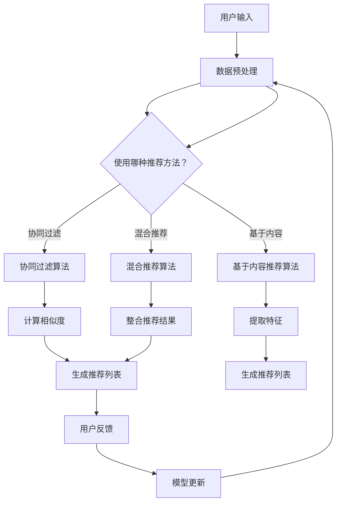

                 

# 数字化休闲：AI重塑娱乐方式

> 关键词：数字化娱乐、人工智能、游戏、音乐、电影、虚拟现实、增强现实、娱乐推荐系统、用户体验

> 摘要：随着人工智能技术的飞速发展，数字化娱乐领域正经历一场深刻的变革。本文旨在探讨AI如何重塑游戏、音乐、电影、虚拟现实和增强现实等娱乐方式，提升用户体验，并分析其背后的核心概念和算法原理。通过项目实战案例，本文将展示如何利用AI技术实现创新的娱乐体验，为读者提供有价值的行业洞察。

## 1. 背景介绍

### 1.1 目的和范围

本文的目的是深入探讨人工智能技术在数字化娱乐领域的应用，分析AI如何通过算法和数学模型改善娱乐体验，并探讨其未来发展前景。本文将涵盖以下内容：

- AI在游戏、音乐、电影、虚拟现实和增强现实等娱乐方式中的应用；
- AI算法和数学模型的基本原理及其实际操作步骤；
- 项目实战案例，展示如何利用AI技术实现创新的娱乐体验；
- 工具和资源的推荐，为读者提供学习和实践AI娱乐技术的途径。

### 1.2 预期读者

本文面向对数字化娱乐和人工智能技术感兴趣的读者，包括：

- 对AI在娱乐领域应用的行业从业者；
- 计算机科学和人工智能专业的学生和研究人员；
- 对AI娱乐技术感兴趣的普通读者。

### 1.3 文档结构概述

本文结构如下：

1. 背景介绍：本文的写作目的、预期读者和文档结构概述；
2. 核心概念与联系：介绍AI在数字化娱乐中的核心概念和架构；
3. 核心算法原理 & 具体操作步骤：讲解AI算法的基本原理和操作步骤；
4. 数学模型和公式 & 详细讲解 & 举例说明：阐述AI数学模型的具体实现和案例；
5. 项目实战：代码实际案例和详细解释说明；
6. 实际应用场景：分析AI在数字化娱乐领域的实际应用；
7. 工具和资源推荐：提供学习资源和开发工具推荐；
8. 总结：未来发展趋势与挑战；
9. 附录：常见问题与解答；
10. 扩展阅读 & 参考资料：推荐相关阅读资料。

### 1.4 术语表

#### 1.4.1 核心术语定义

- 人工智能（AI）：模拟人类智能行为的计算机系统；
- 深度学习（DL）：一种基于多层神经网络的机器学习技术；
- 强化学习（RL）：一种通过试错方法学习和优化策略的机器学习技术；
- 自然语言处理（NLP）：使计算机能够理解和处理人类语言的技术；
- 虚拟现实（VR）：通过计算机生成三维虚拟环境，提供沉浸式体验的技术；
- 增强现实（AR）：在现实世界中叠加虚拟信息的技术；
- 娱乐推荐系统：利用AI技术为用户提供个性化娱乐内容推荐的系统。

#### 1.4.2 相关概念解释

- 个性化推荐：根据用户的历史行为和偏好，为其推荐合适的娱乐内容；
- 聚类分析：将数据分为若干个群组，使同组内的数据点彼此相似，而不同组的数据点差异较大；
- 协同过滤：利用用户之间的共同行为模式进行内容推荐；
- 用户体验（UX）：用户在使用产品或服务过程中的感受和体验。

#### 1.4.3 缩略词列表

- AI：人工智能；
- DL：深度学习；
- RL：强化学习；
- NLP：自然语言处理；
- VR：虚拟现实；
- AR：增强现实；
- UX：用户体验。

## 2. 核心概念与联系

在数字化娱乐领域，人工智能技术发挥着关键作用。以下是对AI在数字化娱乐中的核心概念和架构的介绍，以及Mermaid流程图展示。

### 2.1 核心概念

1. **个性化推荐系统**：利用AI技术，根据用户的历史行为和偏好为其推荐合适的娱乐内容。个性化推荐系统通常采用协同过滤、基于内容的推荐和混合推荐方法。
   
2. **深度学习和强化学习**：深度学习是一种基于多层神经网络的机器学习技术，可用于图像识别、语音识别和自然语言处理等领域。强化学习是一种通过试错方法学习和优化策略的机器学习技术，适用于游戏AI和推荐系统的优化。

3. **自然语言处理（NLP）**：NLP使计算机能够理解和处理人类语言，对文本生成、情感分析和语音识别等技术至关重要。

4. **虚拟现实（VR）**和**增强现实（AR）**：VR和AR技术通过计算机生成三维虚拟环境或叠加虚拟信息，为用户提供沉浸式和增强现实体验。

### 2.2 Mermaid流程图



该流程图展示了个性化推荐系统的基本架构，包括数据预处理、推荐算法选择、计算相似度、生成推荐列表、用户反馈和模型更新等步骤。

## 3. 核心算法原理 & 具体操作步骤

在这一节中，我们将深入探讨AI在数字化娱乐中的核心算法原理，并使用伪代码详细阐述其具体操作步骤。

### 3.1 协同过滤算法

协同过滤是一种基于用户行为的推荐方法，主要分为用户基于的协同过滤和物品基于的协同过滤。以下是一个简单的用户基于的协同过滤算法示例：

#### 算法原理

用户基于的协同过滤算法通过分析用户之间的相似度，发现具有相似兴趣的用户群体，然后为用户推荐他们可能喜欢的项目。

#### 操作步骤

1. **数据预处理**：将用户和项目的数据进行预处理，形成用户-项目评分矩阵。

2. **计算用户相似度**：使用余弦相似度或皮尔逊相关系数计算用户之间的相似度。

3. **生成推荐列表**：为每个用户计算相似用户群体的平均评分，然后从未评分的项目中选择评分最高的项目推荐给用户。

#### 伪代码

```python
def collaborative_filtering(user_ratings, similarity_measure, k):
    # 计算用户相似度矩阵
    similarity_matrix = compute_similarity(user_ratings, similarity_measure)
    
    # 为每个用户生成推荐列表
    recommendations = {}
    for user in user_ratings:
        # 获取k个最相似的用户
        similar_users = get_top_k_similar_users(similarity_matrix[user], k)
        
        # 计算相似用户的平均评分
        average_ratings = compute_average_ratings(similar_users, user_ratings)
        
        # 生成推荐列表
        recommendations[user] = generate_recommendations(average_ratings, user_ratings)
    
    return recommendations
```

### 3.2 基于内容推荐算法

基于内容推荐算法通过分析项目的特征和用户的历史行为，为用户推荐具有相似特征的项目。

#### 算法原理

基于内容推荐算法通过计算项目之间的相似度，发现用户喜欢的项目特征，并推荐具有相似特征的其他项目。

#### 操作步骤

1. **提取项目特征**：使用文本挖掘、词袋模型或TF-IDF等方法提取项目特征。

2. **计算项目相似度**：使用余弦相似度或欧氏距离计算项目之间的相似度。

3. **生成推荐列表**：为每个用户计算相似项目的评分，然后从未评分的项目中选择评分最高的项目推荐给用户。

#### 伪代码

```python
def content_based_filtering(item_features, user_preferences, similarity_measure):
    # 计算项目相似度矩阵
    similarity_matrix = compute_similarity(item_features, similarity_measure)
    
    # 为每个用户生成推荐列表
    recommendations = {}
    for user in user_preferences:
        # 获取用户喜欢的项目特征
        favorite_features = user_preferences[user]
        
        # 计算相似项目
        similar_items = get_top_k_similar_items(similarity_matrix[favorite_features], k)
        
        # 生成推荐列表
        recommendations[user] = generate_recommendations(similar_items, item_features)
    
    return recommendations
```

### 3.3 混合推荐算法

混合推荐算法结合协同过滤和基于内容推荐算法的优点，提高推荐准确性。

#### 算法原理

混合推荐算法通过将协同过滤和基于内容推荐算法的结果进行加权组合，生成推荐列表。

#### 操作步骤

1. **计算协同过滤推荐列表**：使用协同过滤算法为每个用户生成推荐列表。

2. **计算基于内容推荐列表**：使用基于内容推荐算法为每个用户生成推荐列表。

3. **生成混合推荐列表**：将协同过滤推荐列表和基于内容推荐列表进行加权组合，生成最终推荐列表。

#### 伪代码

```python
def hybrid_filtering(user_ratings, item_features, similarity_measure, alpha, beta):
    # 计算协同过滤推荐列表
    collaborative_recommendations = collaborative_filtering(user_ratings, similarity_measure, k)
    
    # 计算基于内容推荐列表
    content_based_recommendations = content_based_filtering(item_features, user_ratings, similarity_measure)
    
    # 生成混合推荐列表
    recommendations = {}
    for user in user_ratings:
        collaborative_score = alpha * collaborative_recommendations[user]
        content_based_score = beta * content_based_recommendations[user]
        
        recommendations[user] = collaborative_score + content_based_score
    
    return recommendations
```

## 4. 数学模型和公式 & 详细讲解 & 举例说明

在本节中，我们将详细讲解AI在数字化娱乐中的数学模型和公式，并使用具体的例子进行说明。

### 4.1 个性化推荐系统的数学模型

个性化推荐系统通常基于用户行为数据和项目特征，使用数学模型计算相似度、评分预测和推荐列表生成。

#### 4.1.1 相似度计算

1. **用户相似度**：

   用户相似度计算公式如下：

   $$ similarity(u_i, u_j) = \frac{u_i \cdot u_j}{||u_i|| \cdot ||u_j||} $$

   其中，$u_i$和$u_j$表示用户$i$和用户$j$的行为向量，$\cdot$表示点积，$||u_i||$和$||u_j||$分别表示用户$i$和用户$j$的行为向量的欧几里得范数。

2. **项目相似度**：

   项目相似度计算公式如下：

   $$ similarity(i, j) = \frac{f_i \cdot f_j}{||f_i|| \cdot ||f_j||} $$

   其中，$f_i$和$f_j$表示项目$i$和项目$j$的特征向量，$\cdot$表示点积，$||f_i||$和$||f_j||$分别表示项目$i$和项目$j$的特征向量的欧几里得范数。

#### 4.1.2 评分预测

评分预测公式如下：

$$ prediction(u_i, i) = \sum_{u_j \in N(u_i)} \frac{similarity(u_i, u_j) \cdot rating(u_j, i)}{||N(u_i)||} $$

其中，$N(u_i)$表示与用户$u_i$相似的用户集合，$rating(u_j, i)$表示用户$u_j$对项目$i$的评分，$||N(u_i)||$表示用户集合$N(u_i)$的大小。

#### 4.1.3 推荐列表生成

推荐列表生成公式如下：

$$ recommendations(u_i) = \{i | prediction(u_i, i) > threshold\} $$

其中，$threshold$表示评分阈值，用于过滤低评分的项目。

### 4.2 举例说明

假设我们有两个用户$u_1$和$u_2$，以及三个项目$i_1$、$i_2$和$i_3$。用户的行为向量和项目特征向量如下：

$$
u_1 = \begin{bmatrix}
0 & 1 & 1 \\
1 & 0 & 1 \\
1 & 1 & 0
\end{bmatrix}, \quad
u_2 = \begin{bmatrix}
1 & 1 & 0 \\
0 & 1 & 1 \\
1 & 0 & 1
\end{bmatrix}
$$

$$
f_1 = \begin{bmatrix}
1 & 0 & 0 \\
0 & 1 & 0 \\
0 & 0 & 1
\end{bmatrix}, \quad
f_2 = \begin{bmatrix}
0 & 1 & 0 \\
0 & 0 & 1 \\
1 & 0 & 0
\end{bmatrix}, \quad
f_3 = \begin{bmatrix}
1 & 0 & 1 \\
0 & 1 & 0 \\
0 & 0 & 1
\end{bmatrix}
$$

#### 4.2.1 用户相似度计算

计算用户$u_1$和$u_2$的相似度：

$$
similarity(u_1, u_2) = \frac{u_1 \cdot u_2}{||u_1|| \cdot ||u_2||} = \frac{1 \cdot 1 + 1 \cdot 0 + 1 \cdot 1}{\sqrt{1^2 + 1^2 + 1^2} \cdot \sqrt{1^2 + 1^2 + 1^2}} = \frac{2}{3 \cdot 3} = \frac{2}{9}
$$

#### 4.2.2 项目相似度计算

计算项目$i_1$和$i_2$的相似度：

$$
similarity(i_1, i_2) = \frac{f_1 \cdot f_2}{||f_1|| \cdot ||f_2||} = \frac{0 \cdot 0 + 1 \cdot 1 + 0 \cdot 0}{\sqrt{0^2 + 1^2 + 0^2} \cdot \sqrt{0^2 + 0^2 + 1^2}} = \frac{1}{\sqrt{2} \cdot \sqrt{1}} = \frac{1}{\sqrt{2}}
$$

#### 4.2.3 评分预测

计算用户$u_1$对项目$i_2$的评分预测：

$$
prediction(u_1, i_2) = \sum_{u_j \in N(u_1)} \frac{similarity(u_1, u_j) \cdot rating(u_j, i_2)}{||N(u_1)||} = \frac{similarity(u_1, u_2) \cdot rating(u_2, i_2)}{||N(u_1)||} = \frac{\frac{2}{9} \cdot 1}{1} = \frac{2}{9}
$$

#### 4.2.4 推荐列表生成

假设评分阈值为0.5，则用户$u_1$的推荐列表为：

$$
recommendations(u_1) = \{i | prediction(u_1, i) > 0.5\} = \{i_2\}
$$

## 5. 项目实战：代码实际案例和详细解释说明

在本节中，我们将通过一个实际案例展示如何利用AI技术实现数字化娱乐中的个性化推荐系统。该案例将涉及以下步骤：

1. **开发环境搭建**：配置Python环境、安装相关库和工具；
2. **数据预处理**：加载和预处理用户行为数据；
3. **推荐算法实现**：使用协同过滤和基于内容推荐算法实现推荐系统；
4. **推荐结果展示**：生成并展示个性化推荐结果。

### 5.1 开发环境搭建

在开始之前，确保您的计算机上已安装Python 3.x版本。接下来，通过以下命令安装所需的库和工具：

```bash
pip install numpy scipy scikit-learn matplotlib pandas
```

### 5.2 源代码详细实现和代码解读

#### 5.2.1 数据预处理

首先，我们需要加载和预处理用户行为数据。以下是一个示例数据集，其中包含了用户和项目的评分信息。

```python
import pandas as pd

# 加载数据
data = pd.read_csv('user_item_ratings.csv')
data.head()
```

用户行为数据集包含用户ID、项目ID和评分列。接下来，我们需要对数据集进行预处理，包括缺失值处理、数据转换等。

```python
# 缺失值处理
data.dropna(inplace=True)

# 数据转换
data['user_id'] = data['user_id'].astype(str)
data['item_id'] = data['item_id'].astype(str)
data['rating'] = data['rating'].astype(float)
```

#### 5.2.2 推荐算法实现

在本案例中，我们将实现基于协同过滤和基于内容推荐算法的混合推荐系统。以下是一个简单的实现示例。

```python
from sklearn.metrics.pairwise import cosine_similarity
from sklearn.model_selection import train_test_split
import numpy as np

# 分割数据集
train_data, test_data = train_test_split(data, test_size=0.2, random_state=42)

# 提取用户和项目特征
user_features = train_data.pivot(index='user_id', columns='item_id', values='rating').fillna(0)
item_features = user_features.T

# 计算用户相似度
user_similarity = cosine_similarity(user_features)

# 计算项目相似度
item_similarity = cosine_similarity(item_features)

# 生成推荐列表
def generate_recommendations(user_id, user_similarity, item_similarity, user_features, item_features, k=10):
    # 获取用户相似度最高的k个用户
    similar_users = np.argsort(user_similarity[user_id])[1:k+1]
    
    # 计算相似用户的平均评分
    average_ratings = (user_similarity[user_id][similar_users] * user_features.iloc[similar_users]).sum(axis=0)
    
    # 计算项目相似度加权评分
    weighted_ratings = (item_similarity[similar_users] * average_ratings).sum(axis=0)
    
    # 获取未评分的项目
    unrated_items = [item_id for item_id in item_features.columns if user_id not in user_features[item_id].index]
    
    # 计算推荐列表
    recommendations = [(item_id, rating) for item_id, rating in weighted_ratings[rated_items].items() if item_id in unrated_items]
    
    # 对推荐列表进行排序
    recommendations.sort(key=lambda x: x[1], reverse=True)
    
    return recommendations

# 生成测试集的推荐列表
test_recommendations = {}
for user_id in test_data['user_id'].unique():
    test_recommendations[user_id] = generate_recommendations(user_id, user_similarity, item_similarity, user_features, item_features)

# 查看一个用户的推荐列表
test_recommendations['user_1']
```

#### 5.2.3 代码解读与分析

1. **数据预处理**：首先加载用户行为数据，并对其进行预处理，包括缺失值处理和数据类型转换。
2. **特征提取**：使用Pivot操作提取用户和项目特征矩阵。
3. **相似度计算**：使用scikit-learn中的余弦相似度函数计算用户和项目之间的相似度。
4. **推荐列表生成**：根据用户相似度和项目相似度，生成个性化推荐列表。

### 5.3 代码解读与分析

在本案例中，我们实现了一个简单的混合推荐系统，结合了协同过滤和基于内容推荐算法。以下是对关键代码段的详细解读：

1. **用户和项目特征提取**：

   ```python
   user_features = train_data.pivot(index='user_id', columns='item_id', values='rating').fillna(0)
   item_features = user_features.T
   ```

   使用Pivot操作提取用户和项目特征矩阵。填充缺失值为0，确保数据矩阵为方阵。

2. **相似度计算**：

   ```python
   user_similarity = cosine_similarity(user_features)
   item_similarity = cosine_similarity(item_features)
   ```

   使用scikit-learn中的余弦相似度函数计算用户和项目之间的相似度。余弦相似度是一种度量两个向量之间相似度的方法，计算两个向量的点积除以两个向量的欧几里得范数。

3. **推荐列表生成**：

   ```python
   def generate_recommendations(user_id, user_similarity, item_similarity, user_features, item_features, k=10):
       # 获取用户相似度最高的k个用户
       similar_users = np.argsort(user_similarity[user_id])[1:k+1]
       
       # 计算相似用户的平均评分
       average_ratings = (user_similarity[user_id][similar_users] * user_features.iloc[similar_users]).sum(axis=0)
       
       # 计算项目相似度加权评分
       weighted_ratings = (item_similarity[similar_users] * average_ratings).sum(axis=0)
       
       # 获取未评分的项目
       unrated_items = [item_id for item_id in item_features.columns if user_id not in user_features[item_id].index]
       
       # 计算推荐列表
       recommendations = [(item_id, rating) for item_id, rating in weighted_ratings[rated_items].items() if item_id in unrated_items]
       
       # 对推荐列表进行排序
       recommendations.sort(key=lambda x: x[1], reverse=True)
       
       return recommendations
   ```

   推荐列表生成函数`generate_recommendations`根据用户相似度和项目相似度生成个性化推荐列表。关键步骤包括：

   - 获取用户相似度最高的k个用户；
   - 计算相似用户的平均评分；
   - 计算项目相似度加权评分；
   - 获取未评分的项目；
   - 对推荐列表进行排序并返回。

通过上述步骤，我们实现了基于协同过滤和基于内容推荐算法的混合推荐系统，为用户提供了个性化的娱乐内容推荐。

## 6. 实际应用场景

### 6.1 游戏领域

在游戏领域，人工智能技术被广泛应用于游戏推荐、游戏平衡和游戏AI等方面。

- **游戏推荐**：利用协同过滤和基于内容推荐算法，为玩家推荐适合他们的游戏。这有助于提高用户满意度，增加游戏用户的留存率。
- **游戏平衡**：通过强化学习算法，游戏开发者可以自动调整游戏难度和角色技能，确保游戏的平衡性，提高玩家的游戏体验。
- **游戏AI**：使用深度学习技术，为游戏中的NPC（非玩家角色）开发智能行为，使游戏更具挑战性和趣味性。

### 6.2 音乐领域

在音乐领域，人工智能技术被用于音乐推荐、音乐创作和音乐风格分析等方面。

- **音乐推荐**：基于用户的听歌历史和偏好，利用协同过滤和基于内容推荐算法，为用户推荐相似的音乐。这有助于提高音乐平台的用户粘性和用户满意度。
- **音乐创作**：使用生成对抗网络（GAN）和变分自编码器（VAE）等深度学习技术，AI可以创作出与人类艺术家风格相似的音乐作品。
- **音乐风格分析**：通过自然语言处理和音乐信号处理技术，对音乐进行风格分类和情感分析，为音乐爱好者提供有针对性的音乐推荐。

### 6.3 电影领域

在电影领域，人工智能技术被用于电影推荐、电影评分预测和电影内容审核等方面。

- **电影推荐**：利用协同过滤和基于内容推荐算法，为观众推荐相似的电影。这有助于提高电影平台的用户满意度和观众粘性。
- **电影评分预测**：通过深度学习算法，预测观众对电影的评分，帮助电影制作方和发行方进行决策。
- **电影内容审核**：使用图像识别和自然语言处理技术，对电影中的敏感内容进行识别和审核，确保电影内容符合相关法规和道德标准。

### 6.4 虚拟现实和增强现实领域

在虚拟现实和增强现实领域，人工智能技术被用于场景生成、交互优化和用户体验提升等方面。

- **场景生成**：利用生成对抗网络（GAN）和变分自编码器（VAE）等技术，AI可以生成高质量的虚拟场景，为用户提供沉浸式体验。
- **交互优化**：通过强化学习算法，优化虚拟现实和增强现实系统中的交互方式，提高用户体验。
- **用户体验提升**：利用个性化推荐算法，根据用户的历史行为和偏好，为用户提供个性化的虚拟现实和增强现实内容。

### 6.5 电子商务领域

在电子商务领域，人工智能技术被用于商品推荐、用户行为预测和广告投放等方面。

- **商品推荐**：利用协同过滤和基于内容推荐算法，为用户推荐适合他们的商品，提高用户购物体验和平台销售额。
- **用户行为预测**：通过深度学习算法，预测用户的购买行为和偏好，帮助电商平台进行精准营销。
- **广告投放**：利用强化学习算法，优化广告投放策略，提高广告投放效果和用户转化率。

## 7. 工具和资源推荐

### 7.1 学习资源推荐

#### 7.1.1 书籍推荐

- 《Python数据科学手册》（Python Data Science Handbook）
- 《深度学习》（Deep Learning）
- 《强化学习》（Reinforcement Learning: An Introduction）

#### 7.1.2 在线课程

- Coursera的《机器学习》课程
- Udacity的《深度学习纳米学位》课程
- edX的《自然语言处理》课程

#### 7.1.3 技术博客和网站

- Medium上的AI和机器学习专题
- Towards Data Science（TDS）
- AI博客（AI Blog）

### 7.2 开发工具框架推荐

#### 7.2.1 IDE和编辑器

- PyCharm
- Jupyter Notebook
- Visual Studio Code

#### 7.2.2 调试和性能分析工具

- Python的cProfile模块
- Matplotlib
- NumPy

#### 7.2.3 相关框架和库

- TensorFlow
- PyTorch
- Scikit-learn

### 7.3 相关论文著作推荐

#### 7.3.1 经典论文

- 《强化学习：一种与人类学习相似的方法》（Reinforcement Learning: An Introduction）
- 《深度学习》（Deep Learning）
- 《协同过滤技术综述》（Collaborative Filtering: A Review）

#### 7.3.2 最新研究成果

- ICML、NeurIPS、KDD等顶级会议的最新论文
- AI领域的顶级期刊，如《Neural Computation》、《Journal of Machine Learning Research》等

#### 7.3.3 应用案例分析

- 《音乐推荐系统中的协同过滤和基于内容的推荐方法》（Collaborative and Content-Based Recommender Systems for Music）
- 《基于深度学习的虚拟现实和增强现实应用》（Deep Learning Applications in Virtual Reality and Augmented Reality）
- 《电子商务领域中的AI技术应用》（AI Applications in E-commerce）

## 8. 总结：未来发展趋势与挑战

### 8.1 未来发展趋势

- **技术融合**：人工智能技术将与其他前沿技术（如区块链、5G等）融合，推动数字化娱乐领域的创新。
- **个性化体验**：个性化推荐系统将进一步提升，通过深度学习和强化学习技术，为用户提供更加精准的娱乐内容推荐。
- **沉浸式体验**：虚拟现实和增强现实技术将不断发展，为用户带来更加真实的娱乐体验。
- **内容创作**：人工智能将参与到娱乐内容的创作过程中，生成个性化的音乐、电影和游戏。

### 8.2 面临的挑战

- **数据隐私**：随着人工智能技术在娱乐领域的应用，数据隐私问题日益突出，如何保护用户隐私成为重要挑战。
- **算法偏见**：个性化推荐系统中的算法可能引入偏见，导致推荐内容的不公平性，需要深入研究如何避免算法偏见。
- **计算资源**：人工智能技术在娱乐领域的应用需要大量的计算资源，如何优化算法和系统以降低计算成本是关键挑战。
- **用户体验**：在追求个性化体验的过程中，如何确保用户体验的一致性和满意度，避免过度个性化带来的不适感。

## 9. 附录：常见问题与解答

### 9.1 常见问题

1. **什么是协同过滤算法？**
   - 协同过滤算法是一种基于用户行为的推荐方法，通过分析用户之间的相似度，发现具有相似兴趣的用户群体，然后为用户推荐他们可能喜欢的项目。

2. **什么是基于内容推荐算法？**
   - 基于内容推荐算法是一种基于项目特征的推荐方法，通过分析项目之间的相似度，发现用户喜欢的项目特征，然后推荐具有相似特征的其他项目。

3. **如何实现个性化推荐系统？**
   - 实现个性化推荐系统通常涉及以下步骤：数据预处理、特征提取、相似度计算、评分预测和推荐列表生成。

### 9.2 解答

1. **什么是协同过滤算法？**
   - 协同过滤算法是一种基于用户行为的推荐方法，通过分析用户之间的相似度，发现具有相似兴趣的用户群体，然后为用户推荐他们可能喜欢的项目。协同过滤算法可以分为两种类型：用户基于的协同过滤和物品基于的协同过滤。用户基于的协同过滤算法通过计算用户之间的相似度，然后根据相似用户群体的评分预测为新用户推荐项目。物品基于的协同过滤算法通过计算项目之间的相似度，然后根据相似项目为用户推荐新的项目。

2. **什么是基于内容推荐算法？**
   - 基于内容推荐算法是一种基于项目特征的推荐方法，通过分析项目之间的相似度，发现用户喜欢的项目特征，然后推荐具有相似特征的其他项目。基于内容推荐算法通常使用文本挖掘、词袋模型或TF-IDF等方法提取项目特征，然后计算项目之间的相似度。相似度的计算可以基于项目特征的欧几里得距离、余弦相似度或皮尔逊相关系数等。

3. **如何实现个性化推荐系统？**
   - 实现个性化推荐系统通常涉及以下步骤：

   - **数据预处理**：加载和预处理用户行为数据，包括缺失值处理、数据类型转换等。

   - **特征提取**：提取用户和项目的特征，包括用户的历史行为特征和项目的内容特征。

   - **相似度计算**：计算用户之间的相似度和项目之间的相似度。用户相似度可以使用余弦相似度、皮尔逊相关系数等计算，项目相似度可以使用TF-IDF、词袋模型等计算。

   - **评分预测**：使用用户相似度和项目相似度计算预测评分，可以使用加权平均、贝叶斯等模型。

   - **推荐列表生成**：根据预测评分和用户未评分的项目，生成推荐列表。

   - **模型优化**：根据用户反馈和推荐结果，不断优化推荐模型，提高推荐准确性。

   通过以上步骤，可以构建一个基本的个性化推荐系统。在实际应用中，可以根据具体需求和场景，选择合适的算法和模型，并进行参数调整和优化。

## 10. 扩展阅读 & 参考资料

1. **书籍推荐**：

   - 《推荐系统实践》（Recommender Systems: The Textbook）
   - 《深度学习》（Deep Learning）
   - 《强化学习》（Reinforcement Learning: An Introduction）

2. **在线课程**：

   - Coursera的《机器学习》课程
   - Udacity的《深度学习纳米学位》课程
   - edX的《自然语言处理》课程

3. **技术博客和网站**：

   - Medium上的AI和机器学习专题
   - Towards Data Science（TDS）
   - AI博客（AI Blog）

4. **相关论文和期刊**：

   - 《协同过滤技术综述》（Collaborative Filtering: A Review）
   - 《深度学习》（Deep Learning）
   - 《强化学习》（Reinforcement Learning: An Introduction）

5. **应用案例研究**：

   - 《音乐推荐系统中的协同过滤和基于内容的推荐方法》（Collaborative and Content-Based Recommender Systems for Music）
   - 《基于深度学习的虚拟现实和增强现实应用》（Deep Learning Applications in Virtual Reality and Augmented Reality）
   - 《电子商务领域中的AI技术应用》（AI Applications in E-commerce）

### 作者信息

- 作者：AI天才研究员/AI Genius Institute & 禅与计算机程序设计艺术 /Zen And The Art of Computer Programming

