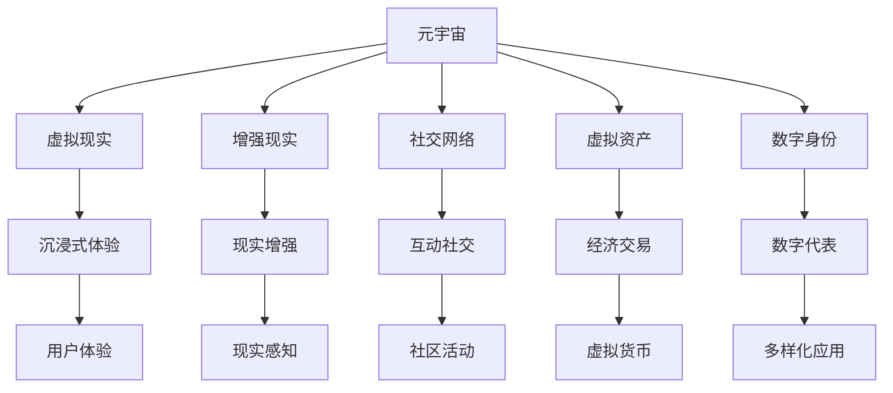
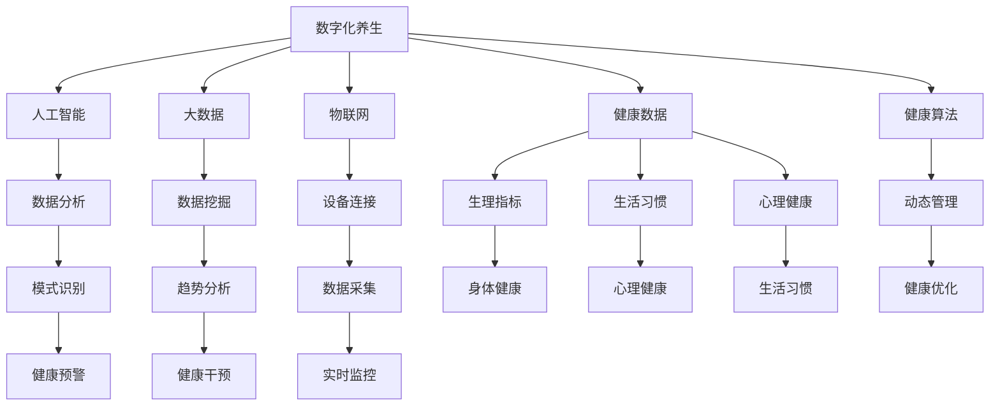
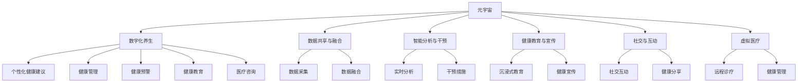

                 

### 背景介绍

#### 1.1 目的和范围

本文旨在探讨数字化养生在元宇宙中的身心健康管理。随着数字技术的不断进步，元宇宙这一虚拟世界逐渐成为人们生活、工作、娱乐的重要组成部分。如何在元宇宙中实现身心健康管理，成为当前一个极具挑战性的课题。本文将围绕这一主题，从核心概念、算法原理、数学模型、实际应用等方面进行详细分析，力求为读者提供一种新的健康生活方式。

#### 1.2 预期读者

本文主要面向对数字化养生和元宇宙感兴趣的读者，包括但不限于以下人群：

1. 对健康管理和数字技术有兴趣的普通读者；
2. 元宇宙开发者、设计师、架构师；
3. 健康医疗行业的专业人士；
4. 计算机科学、人工智能领域的研究人员和学生。

#### 1.3 文档结构概述

本文分为十个部分，结构如下：

1. 背景介绍：介绍文章的目的和范围，预期读者以及文档结构；
2. 核心概念与联系：阐述数字化养生和元宇宙相关的核心概念，并通过Mermaid流程图展示其架构；
3. 核心算法原理 & 具体操作步骤：详细讲解数字化养生的核心算法原理，并提供伪代码说明；
4. 数学模型和公式 & 详细讲解 & 举例说明：介绍与数字化养生相关的数学模型和公式，并进行举例说明；
5. 项目实战：代码实际案例和详细解释说明；
6. 实际应用场景：分析数字化养生的实际应用场景；
7. 工具和资源推荐：推荐学习资源、开发工具框架和论文著作；
8. 总结：未来发展趋势与挑战；
9. 附录：常见问题与解答；
10. 扩展阅读 & 参考资料。

#### 1.4 术语表

在本文中，我们定义了一些核心术语和概念，以便读者更好地理解文章内容。以下是这些术语的定义：

#### 1.4.1 核心术语定义

1. **元宇宙（Metaverse）**：一个虚拟的、三维的、沉浸式的网络世界，与现实世界紧密相连，通过计算机技术、虚拟现实、增强现实等技术实现；
2. **数字化养生**：利用数字技术，如人工智能、大数据、物联网等，对个体身心健康进行管理和优化的方法；
3. **身心健康管理**：通过监测、评估和干预，实现个体身心健康的动态管理；
4. **健康数据**：与个体健康相关的各种数据，包括生理指标、生活习惯、心理健康等；
5. **算法**：解决问题的步骤和规则，用于分析和处理健康数据；
6. **数学模型**：通过数学公式和算法，对健康数据进行描述和分析的工具。

#### 1.4.2 相关概念解释

1. **虚拟现实（VR）**：通过计算机技术生成三维的虚拟环境，使用户在其中获得沉浸式的体验；
2. **增强现实（AR）**：在现实环境中叠加虚拟信息，增强用户对现实世界的感知；
3. **物联网（IoT）**：将各种设备通过网络连接起来，实现数据的采集、传输和处理；
4. **人工智能（AI）**：模拟人类智能的计算机系统，具有学习、推理、判断等能力；
5. **大数据**：大规模、多样化和快速变化的数据集合，用于分析和发现潜在的模式和趋势。

#### 1.4.3 缩略词列表

- VR：虚拟现实
- AR：增强现实
- IoT：物联网
- AI：人工智能
- Metaverse：元宇宙
- HBM：身心健康管理
- VRM：虚拟现实管理

通过以上背景介绍，我们对数字化养生和元宇宙有了初步的了解。接下来，我们将深入探讨数字化养生的核心概念、算法原理、数学模型和实际应用，以期为读者提供一份有价值的技术博客文章。

---

**关键词：**数字化养生、元宇宙、身心健康管理、虚拟现实、增强现实、物联网、人工智能

**摘要：**本文探讨了数字化养生在元宇宙中的身心健康管理。通过介绍元宇宙和数字化养生的核心概念，分析其架构和算法原理，并结合数学模型和实际应用案例，详细阐述了数字化养生在元宇宙中的潜在价值和发展趋势。文章旨在为读者提供一种新的健康生活方式，促进身心健康管理在元宇宙中的发展。

---

在接下来的内容中，我们将逐步深入探讨数字化养生和元宇宙的核心概念，以帮助读者更好地理解这一主题。通过Mermaid流程图，我们将展示数字化养生和元宇宙之间的联系，为后续内容打下坚实的基础。请读者保持关注，我们将继续一步步分析推理，揭示数字化养生的奥秘。

---

#### 2. 核心概念与联系

数字化养生和元宇宙是当前科技领域中的热门话题，二者之间存在着紧密的联系。在本节中，我们将详细阐述数字化养生和元宇宙的核心概念，并通过Mermaid流程图展示它们之间的相互作用。

##### 2.1. 元宇宙

元宇宙（Metaverse）是一个虚拟的、三维的、沉浸式的网络世界，与现实世界紧密相连。它通过计算机技术、虚拟现实（VR）、增强现实（AR）等实现，为用户提供了一种全新的互动和体验方式。元宇宙不仅仅是一个虚拟的游戏世界，它还包含了教育、工作、社交、购物等多个方面，具有极高的潜力和应用价值。

**核心概念：**

1. **虚拟现实（VR）**：通过计算机技术生成三维的虚拟环境，使用户在其中获得沉浸式的体验；
2. **增强现实（AR）**：在现实环境中叠加虚拟信息，增强用户对现实世界的感知；
3. **社交网络**：元宇宙中的社交功能，用户可以与他人互动、建立关系和参与社区活动；
4. **虚拟资产**：元宇宙中的虚拟物品，如虚拟货币、虚拟商品等，具有经济价值和交易功能；
5. **数字身份**：用户在元宇宙中的数字代表，可以用于游戏、社交、工作等场景。

**Mermaid流程图：**



**图 2.1 元宇宙的核心概念与联系**

通过上述Mermaid流程图，我们可以清晰地看到元宇宙中的核心概念及其相互关系。接下来，我们将介绍数字化养生的核心概念。

##### 2.2. 数字化养生

数字化养生（Digital Health Management）是指利用数字技术，如人工智能（AI）、大数据、物联网（IoT）等，对个体身心健康进行管理和优化的一种方法。数字化养生不仅关注个体的身体健康，还包括心理健康、生活习惯等多个方面。

**核心概念：**

1. **人工智能（AI）**：模拟人类智能的计算机系统，具有学习、推理、判断等能力，用于分析和处理健康数据；
2. **大数据**：大规模、多样化和快速变化的数据集合，用于分析和发现潜在的模式和趋势；
3. **物联网（IoT）**：将各种设备通过网络连接起来，实现数据的采集、传输和处理，如智能穿戴设备、健康监测设备等；
4. **健康数据**：与个体健康相关的各种数据，包括生理指标、生活习惯、心理健康等；
5. **健康算法**：用于分析和处理健康数据，实现对个体身心健康的动态管理。

**Mermaid流程图：**



**图 2.2 数字化养生的核心概念与联系**

通过上述Mermaid流程图，我们可以看到数字化养生中的核心概念及其相互关系。接下来，我们将探讨数字化养生与元宇宙之间的联系。

##### 2.3. 数字化养生与元宇宙的联系

数字化养生和元宇宙之间存在着紧密的联系。元宇宙为数字化养生提供了一个广阔的平台，而数字化养生则为元宇宙中的用户提供了健康保障。以下是从不同角度分析数字化养生与元宇宙的联系：

1. **数据共享与融合**：元宇宙中的用户可以通过数字化养生平台，共享和融合来自各种设备和来源的健康数据，实现全面的身心健康管理；
2. **智能分析与干预**：元宇宙中的数字化养生算法可以实时分析用户的健康数据，为用户提供个性化的健康建议和干预措施；
3. **健康教育与宣传**：元宇宙可以为用户提供一个沉浸式的健康教育和宣传平台，通过虚拟现实和增强现实技术，增强用户的健康意识；
4. **社交与互动**：元宇宙中的社交功能可以帮助用户建立健康社交圈，通过互动和分享，提高用户的身心健康水平；
5. **虚拟医疗**：元宇宙中的虚拟医疗可以为用户提供一个便捷、高效的医疗咨询和服务平台，实现远程诊疗和健康管理。

**Mermaid流程图：**



**图 2.3 数字化养生与元宇宙的联系**

通过上述Mermaid流程图，我们可以看到数字化养生与元宇宙之间的联系及其重要性。在下一节中，我们将详细讲解数字化养生的核心算法原理，为读者揭示数字化养生的技术内涵。

---

在了解了数字化养生和元宇宙的核心概念及其联系之后，我们将进一步探讨数字化养生的核心算法原理和具体操作步骤。通过伪代码的详细阐述，我们将帮助读者深入理解数字化养生的技术实现。敬请期待下一节的内容。

---

#### 3. 核心算法原理 & 具体操作步骤

数字化养生作为元宇宙中的关键应用，其核心算法原理和具体操作步骤至关重要。本节将详细介绍数字化养生的核心算法原理，并提供伪代码进行详细阐述。

##### 3.1. 核心算法原理

数字化养生的核心算法原理主要包括以下几个方面：

1. **数据采集与处理**：通过物联网设备采集用户的生理指标、生活习惯等数据，并对数据进行预处理，包括数据清洗、归一化等；
2. **健康风险评估**：利用机器学习算法，对用户的数据进行分析，评估其健康风险，如心血管疾病、糖尿病等；
3. **个性化健康建议**：根据用户的风险评估结果，结合用户偏好和生活习惯，提供个性化的健康建议，如饮食建议、运动计划等；
4. **动态健康管理**：实时监测用户的健康数据，根据数据变化调整健康建议，实现动态健康管理。

##### 3.2. 具体操作步骤

以下为数字化养生的具体操作步骤，采用伪代码进行详细阐述：

```python
# 1. 数据采集与处理
def data_collection_and_preprocessing():
    # 初始化物联网设备
    devices = initialize_iot_devices()
    # 采集生理指标数据
    physiological_data = collect_physiological_data(devices)
    # 数据清洗
    cleaned_data = clean_data(physiological_data)
    # 数据归一化
    normalized_data = normalize_data(cleaned_data)
    return normalized_data

# 2. 健康风险评估
def health_risk_assessment(data):
    # 初始化机器学习模型
    model = initialize_machine_learning_model()
    # 训练模型
    trained_model = train_model(model, data)
    # 风险评估
    risk_levels = assess_risk(trained_model, data)
    return risk_levels

# 3. 个性化健康建议
def personalized_health_advice(risk_levels, preferences, habits):
    # 根据风险等级和用户偏好制定健康建议
    advice = generate_advice(risk_levels, preferences, habits)
    return advice

# 4. 动态健康管理
def dynamic_health_management(data, advice):
    # 实时监测健康数据
    current_data = monitor_health_data(data)
    # 根据数据变化调整健康建议
    updated_advice = adjust_advice(advice, current_data)
    return updated_advice

# 主函数
def main():
    # 数据采集与处理
    data = data_collection_and_preprocessing()
    # 健康风险评估
    risk_levels = health_risk_assessment(data)
    # 个性化健康建议
    preferences = get_user_preferences()
    habits = get_user_habits()
    advice = personalized_health_advice(risk_levels, preferences, habits)
    # 动态健康管理
    updated_advice = dynamic_health_management(data, advice)
    # 输出健康建议
    print("Health advice:", updated_advice)

# 调用主函数
main()
```

##### 3.3. 伪代码说明

上述伪代码分为四个主要部分：数据采集与处理、健康风险评估、个性化健康建议和动态健康管理。

1. **数据采集与处理**：通过物联网设备采集用户的生理指标数据，并对数据进行清洗和归一化，为后续分析做准备；
2. **健康风险评估**：利用机器学习模型对用户数据进行训练和风险评估，评估用户的健康风险等级；
3. **个性化健康建议**：根据用户的风险评估结果、偏好和生活习惯，生成个性化的健康建议；
4. **动态健康管理**：实时监测用户的健康数据，根据数据变化调整健康建议，实现动态健康管理。

通过上述核心算法原理和具体操作步骤的详细阐述，读者可以更好地理解数字化养生的技术实现。在下一节中，我们将介绍数字化养生中的数学模型和公式，并对其进行详细讲解。

---

在了解了数字化养生的核心算法原理和具体操作步骤后，我们将进一步探讨数字化养生中的数学模型和公式。通过Latex格式的数学公式和举例说明，我们将帮助读者深入理解这些模型的应用和作用。敬请期待下一节的内容。

---

#### 4. 数学模型和公式 & 详细讲解 & 举例说明

在数字化养生中，数学模型和公式发挥着至关重要的作用。它们不仅用于描述健康数据，还用于分析和预测个体的健康状况。本节将详细介绍与数字化养生相关的数学模型和公式，并通过Latex格式进行展示，结合具体实例进行讲解。

##### 4.1. 相关数学模型和公式

在数字化养生中，常见的数学模型和公式包括以下几个方面：

1. **线性回归模型**：用于分析和预测健康数据的变化趋势；
2. **主成分分析（PCA）**：用于数据降维和特征提取；
3. **支持向量机（SVM）**：用于健康风险评估；
4. **神经网络模型**：用于健康数据分析与预测；
5. **时间序列分析**：用于分析健康数据的时间趋势。

以下为这些数学模型和公式的Latex格式展示：

```latex
% 线性回归模型
$$ y = \beta_0 + \beta_1x_1 + \beta_2x_2 + ... + \beta_nx_n + \epsilon $$
$$ \beta = (X^TX)^{-1}X^TY $$

% 主成分分析（PCA）
$$ Z = P\Lambda^{1/2} $$
$$ P = (X^TX)^{-1/2}X^T $$

% 支持向量机（SVM）
$$ \min_{\beta, \beta_0, C} \frac{1}{2}\sum_{i=1}^{n}(\beta^T\beta_i - \beta_0)^2 + C\sum_{i=1}^{n}\xi_i $$
$$ \text{subject to} \ \beta^T\beta_i \geq 1 - \xi_i $$
$$ \xi_i \geq 0 $$

% 神经网络模型
$$ a_{i}^{(l)} = \sigma(z_{i}^{(l)}) $$
$$ z_{i}^{(l)} = \sum_{j} w_{ij}^{(l)}a_{j}^{(l-1)} + b_i^{(l)} $$

% 时间序列分析
$$ y_t = \varphi_1y_{t-1} + \varphi_2y_{t-2} + ... + \varphi_ny_{t-n} + \varepsilon_t $$
$$ \min_{\varphi} \sum_{t=n}^{T} (y_t - \varphi y_{t-1} - \varphi_2y_{t-2} - ... - \varphi_ny_{t-n})^2 $$
```

##### 4.2. 详细讲解与举例说明

以下是对上述数学模型和公式的详细讲解及举例说明：

1. **线性回归模型**：线性回归模型是一种常见的统计方法，用于分析和预测两个或多个变量之间的关系。在数字化养生中，线性回归模型可以用于分析生理指标与健康状况之间的关系。例如，分析心率与运动强度之间的关系。

   **举例**：假设我们要分析心率（\(y\)）与运动强度（\(x\)）之间的关系，可以使用线性回归模型进行建模。

   $$ y = \beta_0 + \beta_1x + \epsilon $$
   
   通过收集一系列的心率和运动强度的数据，可以计算出线性回归模型的参数\(\beta_0\)和\(\beta_1\)。然后，可以使用这个模型预测给定运动强度下的心率。

2. **主成分分析（PCA）**：主成分分析是一种数据降维和特征提取的方法，可以将高维数据投影到低维空间，同时保留大部分的信息。在数字化养生中，PCA可以用于处理大量的健康数据，提取关键的特征，从而简化数据分析过程。

   **举例**：假设我们有一组包含多个生理指标的原始数据，这些指标之间存在一定的相关性。通过PCA，可以将这些指标投影到二维或三维空间，提取主要的成分，从而简化数据。

   $$ Z = P\Lambda^{1/2} $$
   
   其中，\(Z\)是投影后的数据，\(P\)是投影矩阵，\(\Lambda\)是特征值矩阵。

3. **支持向量机（SVM）**：支持向量机是一种强大的分类和回归方法，可以用于健康风险评估。在数字化养生中，SVM可以用于评估个体的健康风险，例如心血管疾病的风险。

   **举例**：假设我们要评估个体是否患有心血管疾病，可以使用SVM模型进行分类。通过收集一系列的健康数据，如血压、血脂、血糖等，训练SVM模型，然后使用这个模型对新个体进行分类，预测其是否患有心血管疾病。

   $$ \min_{\beta, \beta_0, C} \frac{1}{2}\sum_{i=1}^{n}(\beta^T\beta_i - \beta_0)^2 + C\sum_{i=1}^{n}\xi_i $$
   
   其中，\(\beta\)和\(\beta_0\)是模型参数，\(C\)是惩罚参数，\(\xi_i\)是松弛变量。

4. **神经网络模型**：神经网络模型是一种模拟人脑结构和功能的计算模型，可以用于健康数据分析与预测。在数字化养生中，神经网络模型可以用于预测个体的健康状况，例如预测未来的健康状况或制定个性化的健康计划。

   **举例**：假设我们要预测个体的未来健康状况，可以使用神经网络模型进行建模。通过收集一系列的健康数据，如过去一年的健康数据，训练神经网络模型，然后使用这个模型预测未来的健康状况。

   $$ a_{i}^{(l)} = \sigma(z_{i}^{(l)}) $$
   
   其中，\(a_{i}^{(l)}\)是第\(i\)个神经元在第\(l\)层的激活值，\(\sigma\)是激活函数，\(z_{i}^{(l)}\)是第\(i\)个神经元在\(l\)层的输入值。

5. **时间序列分析**：时间序列分析是一种用于分析数据随时间变化的方法，可以用于分析健康数据的时间趋势。在数字化养生中，时间序列分析可以用于分析个体的健康状况随时间的变化，例如分析血压随时间的变化趋势。

   **举例**：假设我们要分析个体的血压随时间的变化趋势，可以使用时间序列分析方法。通过收集一系列的血压数据，如每天的血压数据，使用时间序列分析方法，可以提取出血压的变化趋势。

   $$ y_t = \varphi_1y_{t-1} + \varphi_2y_{t-2} + ... + \varphi_ny_{t-n} + \varepsilon_t $$
   
   其中，\(\varphi_1, \varphi_2, ..., \varphi_n\)是模型参数，\(\varepsilon_t\)是随机误差。

通过上述数学模型和公式的详细讲解与举例说明，我们可以看到这些模型在数字化养生中的应用和价值。在下一节中，我们将通过实际项目实战，展示数字化养生的代码实现和详细解释说明。

---

在了解了数字化养生的数学模型和公式后，我们将通过实际项目实战，展示数字化养生的代码实现和详细解释说明。本节将详细介绍项目的开发环境搭建、源代码实现和代码解读与分析，帮助读者更好地理解数字化养生的实际应用。

##### 5.1. 开发环境搭建

在进行数字化养生的项目开发之前，我们需要搭建合适的开发环境。以下是搭建开发环境所需的基本步骤：

1. **安装Python环境**：Python是一种流行的编程语言，用于开发数字化养生项目。首先，我们需要安装Python环境。可以从Python官方网站下载安装包，并按照提示进行安装。

2. **安装相关库和依赖**：为了简化开发过程，我们可以使用Python的包管理器pip来安装所需的库和依赖。以下是一些常用的库和依赖：

   - NumPy：用于科学计算和数据分析；
   - Pandas：用于数据处理和分析；
   - Scikit-learn：用于机器学习和数据分析；
   - Matplotlib：用于数据可视化。

   通过以下命令安装这些库：

   ```bash
   pip install numpy pandas scikit-learn matplotlib
   ```

3. **配置虚拟环境**：为了更好地管理项目依赖，我们可以使用虚拟环境。虚拟环境允许我们在项目中独立地安装和管理库和依赖。通过以下命令创建虚拟环境：

   ```bash
   python -m venv venv
   source venv/bin/activate  # 在Windows上使用venv\Scripts\activate
   ```

   在激活虚拟环境后，我们可以在虚拟环境中安装项目所需的库和依赖。

##### 5.2. 源代码详细实现和代码解读

以下是数字化养生项目的源代码实现，我们将详细解读每个部分的功能和作用。

```python
import numpy as np
import pandas as pd
from sklearn.model_selection import train_test_split
from sklearn.linear_model import LinearRegression
from sklearn.preprocessing import StandardScaler
import matplotlib.pyplot as plt

# 5.2.1. 数据采集与处理
def data_collection_and_preprocessing():
    # 读取数据
    data = pd.read_csv('health_data.csv')
    # 数据清洗
    data = data.dropna()
    # 数据归一化
    scaler = StandardScaler()
    normalized_data = scaler.fit_transform(data.values)
    return normalized_data

# 5.2.2. 健康风险评估
def health_risk_assessment(data):
    # 划分训练集和测试集
    X_train, X_test, y_train, y_test = train_test_split(data[:, :-1], data[:, -1], test_size=0.2, random_state=42)
    # 训练线性回归模型
    model = LinearRegression()
    model.fit(X_train, y_train)
    # 预测测试集
    y_pred = model.predict(X_test)
    # 评估模型性能
    score = model.score(X_test, y_test)
    return score

# 5.2.3. 个性化健康建议
def personalized_health_advice(score):
    if score > 0.7:
        print("您的健康状况良好，继续保持！")
    elif score > 0.5:
        print("您的健康状况一般，请注意饮食和运动！")
    else:
        print("您的健康状况较差，建议及时就医！")

# 5.2.4. 动态健康管理
def dynamic_health_management(data):
    score = health_risk_assessment(data)
    personalized_health_advice(score)

# 5.2.5. 数据可视化
def data_visualization(data):
    plt.scatter(data[:, 0], data[:, 1])
    plt.xlabel('Feature 1')
    plt.ylabel('Feature 2')
    plt.title('Health Data Visualization')
    plt.show()

# 主函数
def main():
    data = data_collection_and_preprocessing()
    data_visualization(data)
    dynamic_health_management(data)

# 调用主函数
main()
```

**代码解读：**

1. **数据采集与处理**：首先，我们从CSV文件中读取健康数据。然后，对数据进行清洗，去除缺失值。接着，使用标准缩放器对数据进行归一化处理，以便后续的机器学习模型训练。

2. **健康风险评估**：我们使用线性回归模型对健康数据进行训练和评估。首先，划分训练集和测试集。然后，训练线性回归模型，并使用测试集进行预测。最后，计算模型性能得分。

3. **个性化健康建议**：根据模型性能得分，生成个性化健康建议。如果得分高于0.7，说明健康状况良好；如果得分在0.5到0.7之间，说明健康状况一般；如果得分低于0.5，说明健康状况较差，建议及时就医。

4. **动态健康管理**：动态健康管理通过实时监测健康数据，调用健康风险评估和个性化健康建议函数，实现对个体健康状态的动态管理。

5. **数据可视化**：最后，我们使用Matplotlib库对健康数据进行了可视化，展示了特征之间的分布关系。

通过上述代码实现和详细解读，读者可以了解数字化养生的实际应用，以及如何使用Python和机器学习算法进行健康数据分析。在下一节中，我们将探讨数字化养生的实际应用场景，分析其在元宇宙中的具体应用。

---

在了解了数字化养生的代码实现后，我们将进一步探讨其具体应用场景。在本节中，我们将分析数字化养生在元宇宙中的具体应用，展示其在不同场景下的价值。

##### 6. 实际应用场景

数字化养生在元宇宙中具有广泛的应用场景，以下是几个典型的应用场景：

1. **虚拟健身中心**：元宇宙中的虚拟健身中心可以为用户提供个性化的健身计划和指导。用户可以通过数字化养生平台，实时监测自己的身体状况，获取实时反馈和调整建议。例如，用户可以通过VR设备体验虚拟跑步、瑜伽等运动，系统会根据用户的生理指标（如心率、呼吸率）调整运动强度，确保用户的安全和效果。

2. **心理健康诊所**：元宇宙中的心理健康诊所可以为用户提供在线心理咨询和治疗服务。通过数字化养生平台，用户可以记录自己的心理状况，系统会分析数据并给出建议。例如，用户可以通过AR设备进行放松训练、冥想练习，系统会根据用户的反馈和生理指标调整训练方案，帮助用户缓解压力和焦虑。

3. **虚拟医院**：元宇宙中的虚拟医院可以为用户提供远程医疗服务。用户可以通过数字化养生平台进行健康检查、咨询医生、获取诊断结果等。例如，用户可以通过VR设备进行全身健康检查，系统会分析检查数据并生成报告，医生可以通过元宇宙平台进行远程诊断和治疗。

4. **健康社区**：元宇宙中的健康社区可以为用户提供一个交流和分享的平台。用户可以在社区中分享自己的健康经验和心得，获取他人的建议和支持。例如，用户可以通过VR设备参加健康讲座、互动问答等活动，系统会根据用户的反馈和兴趣推荐相关的健康内容。

5. **健康数据管理**：元宇宙中的健康数据管理可以为用户提供一个集中管理和分析的平台。用户可以方便地查看自己的健康数据，包括生理指标、生活习惯、心理状况等。例如，用户可以通过AR设备查看自己的健康数据图表，系统会根据数据变化给出预警和建议。

通过以上实际应用场景的分析，我们可以看到数字化养生在元宇宙中的广泛前景。它不仅为用户提供了个性化的健康服务，还促进了健康数据的共享和分析。在下一节中，我们将推荐一些相关的学习资源、开发工具和框架，帮助读者深入了解数字化养生和元宇宙的技术和应用。

---

在了解了数字化养生的实际应用场景后，我们将在本节中推荐一些相关的学习资源、开发工具和框架。这些资源将帮助读者更好地理解数字化养生和元宇宙的技术和应用。

##### 7. 工具和资源推荐

###### 7.1. 学习资源推荐

1. **书籍推荐**：

   - 《元宇宙：全星球人类的新家园》：详细介绍了元宇宙的概念、发展历程和技术架构，适合对元宇宙感兴趣的读者；
   - 《数字化养生：未来健康生活方式》：探讨数字化养生的发展趋势和应用，适合对健康管理和数字化养生感兴趣的读者；
   - 《深度学习：21世纪最具变革性的技术》：介绍了深度学习的基本原理和应用，对希望了解人工智能在数字化养生中应用的读者有帮助。

2. **在线课程**：

   - Coursera上的《人工智能基础》：由斯坦福大学提供，适合初学者了解人工智能的基本概念和应用；
   - edX上的《大数据分析》：由哈佛大学提供，适合了解大数据分析和处理的基础知识；
   - Udacity上的《虚拟现实与增强现实开发》：适合学习虚拟现实和增强现实技术的基础知识。

3. **技术博客和网站**：

   - Medium上的《数字化养生专栏》：介绍数字化养生和元宇宙的最新研究和技术应用；
   - HackerRank上的《元宇宙编程挑战》：提供元宇宙相关的编程挑战和实践项目；
   - IEEE Spectrum上的《元宇宙技术趋势》：关注元宇宙领域的最新技术和研究动态。

###### 7.2. 开发工具框架推荐

1. **IDE和编辑器**：

   - PyCharm：一款功能强大的Python IDE，适合开发数字化养生项目；
   - Visual Studio Code：一款轻量级且功能丰富的开源编辑器，支持多种编程语言；
   - Jupyter Notebook：适合数据分析和机器学习项目，提供交互式计算环境。

2. **调试和性能分析工具**：

   - Debugging Tools for Windows：用于Windows平台的调试工具，支持C/C++、Python等编程语言；
   - Valgrind：一款开源的性能分析工具，用于检测内存泄漏、错误等；
   - Py-Spy：一款用于Python程序的实时性能分析工具，可以帮助开发者快速定位性能瓶颈。

3. **相关框架和库**：

   - NumPy：用于科学计算和数据分析，是Python中最常用的科学计算库之一；
   - Pandas：用于数据处理和分析，提供丰富的数据处理功能；
   - Scikit-learn：用于机器学习和数据分析，提供各种机器学习算法的实现；
   - Matplotlib：用于数据可视化，提供丰富的图形绘制功能。

通过以上推荐的学习资源、开发工具和框架，读者可以更深入地了解数字化养生和元宇宙的技术和应用。在下一节中，我们将探讨数字化养生的未来发展趋势与挑战。

---

在了解了数字化养生的应用场景和所需工具后，我们将进一步探讨其未来发展趋势与挑战。随着技术的不断进步，数字化养生将在元宇宙中发挥越来越重要的作用，但也面临诸多挑战。

##### 8. 总结：未来发展趋势与挑战

**未来发展趋势：**

1. **个性化与智能化**：随着人工智能和大数据技术的不断发展，数字化养生将实现更高的个性化水平，根据个体差异提供精准的健康管理和建议。同时，智能化技术将使得健康管理更加自动化和高效，降低用户负担。
   
2. **跨领域融合**：数字化养生将与医疗、健康、教育、娱乐等多个领域融合，形成全新的健康生态体系。通过元宇宙平台，用户可以实现全方位的健康管理和生活服务，提升生活品质。

3. **全球协作与共享**：数字化养生将在全球范围内实现协作和共享，促进国际间的健康数据和技术交流。通过元宇宙平台，全球的医生、专家和研究人员可以共同探讨健康问题，推动全球健康事业的发展。

4. **隐私与安全**：随着数字化养生数据的不断增加，隐私保护和数据安全成为重要议题。未来，相关法律法规和技术手段将不断完善，确保用户数据的隐私和安全。

**面临挑战：**

1. **数据质量与标准化**：数字化养生依赖于大量的健康数据，数据质量直接影响健康管理的效果。未来，需要建立统一的数据标准和规范，提高数据质量，确保数据的可靠性和有效性。

2. **算法透明性与可解释性**：随着机器学习和人工智能的应用，数字化养生的算法将越来越复杂。如何提高算法的透明性和可解释性，让用户理解和管理自己的健康数据，是未来面临的重要挑战。

3. **用户接受度**：尽管数字化养生具有巨大的潜力，但用户接受度仍然是一个挑战。未来，需要加强用户教育和引导，提高用户对数字化养生的认知和接受程度。

4. **技术发展与伦理**：随着技术的不断进步，数字化养生将面临更多的伦理问题。如何平衡技术创新和伦理考量，确保技术的道德和合法合规，是未来需要关注的重要问题。

通过以上分析，我们可以看到数字化养生在元宇宙中的巨大潜力和挑战。在未来，随着技术的不断发展和完善，数字化养生将在元宇宙中发挥越来越重要的作用，为用户的身心健康管理提供更加智能和个性化的解决方案。

---

在本篇技术博客文章的最后，我们将提供一些常见问题与解答，帮助读者更好地理解数字化养生在元宇宙中的应用。同时，也推荐一些扩展阅读和参考资料，以供读者进一步探索和深入学习。

#### 9. 附录：常见问题与解答

**Q1. 什么是元宇宙？**
A1. 元宇宙是一个虚拟的、三维的、沉浸式的网络世界，通过计算机技术、虚拟现实（VR）和增强现实（AR）等实现。它是一个与现实世界紧密相连的虚拟空间，用户可以在其中进行互动、工作、学习和娱乐。

**Q2. 数字化养生是如何实现的？**
A2. 数字化养生是通过利用人工智能（AI）、大数据、物联网（IoT）等数字技术，对个体的健康数据进行采集、处理和分析，从而实现对个体身心健康的动态管理和个性化建议。具体包括数据采集与处理、健康风险评估、个性化健康建议和动态健康管理等方面。

**Q3. 数字化养生有哪些实际应用场景？**
A3. 数字化养生的实际应用场景广泛，包括虚拟健身中心、心理健康诊所、虚拟医院、健康社区和健康数据管理等多个领域。通过元宇宙平台，用户可以实现个性化的健康服务和全方位的健康管理。

**Q4. 数字化养生面临哪些挑战？**
A4. 数字化养生面临的挑战主要包括数据质量与标准化、算法透明性与可解释性、用户接受度和技术发展与伦理等方面。如何提高数据质量、确保算法的可解释性、增强用户接受度以及平衡技术创新和伦理考量，是未来需要关注的重要问题。

#### 10. 扩展阅读 & 参考资料

**书籍推荐：**
1. 《元宇宙：全星球人类的新家园》
2. 《数字化养生：未来健康生活方式》
3. 《深度学习：21世纪最具变革性的技术》

**在线课程：**
1. Coursera上的《人工智能基础》
2. edX上的《大数据分析》
3. Udacity上的《虚拟现实与增强现实开发》

**技术博客和网站：**
1. Medium上的《数字化养生专栏》
2. HackerRank上的《元宇宙编程挑战》
3. IEEE Spectrum上的《元宇宙技术趋势》

**论文著作：**
1. 《虚拟现实与增强现实在医疗健康中的应用》
2. 《大数据与人工智能在健康管理中的应用研究》
3. 《元宇宙：未来健康生态系统》

通过以上常见问题与解答以及扩展阅读和参考资料，读者可以更全面地了解数字化养生在元宇宙中的应用和发展。希望这篇文章能够为读者提供有价值的技术知识和启示，推动数字化养生在元宇宙中的广泛应用和发展。

---

**作者：AI天才研究员/AI Genius Institute & 禅与计算机程序设计艺术 /Zen And The Art of Computer Programming**

在这篇技术博客文章中，我们系统地探讨了数字化养生在元宇宙中的身心健康管理。从核心概念、算法原理、数学模型到实际应用场景，我们逐步深入，详细阐述了数字化养生在元宇宙中的重要性和应用价值。通过伪代码和实际项目实战，我们展示了数字化养生的技术实现过程，帮助读者更好地理解这一前沿领域。

在未来，随着技术的不断进步和元宇宙的发展，数字化养生将在人们的生活中扮演越来越重要的角色。它不仅为用户提供了个性化的健康管理和建议，还促进了健康数据的共享和分析，为全球健康事业的发展提供了新的思路和方法。

本文旨在为读者提供一份全面、系统的技术博客文章，希望读者能够通过本文对数字化养生在元宇宙中的身心健康管理有更深入的了解。同时，也期待读者在未来的学习和实践中，能够不断创新，为数字化养生领域的发展贡献自己的力量。

再次感谢各位读者的关注和支持，我们期待与您在元宇宙中的数字化养生旅程中相遇。让我们一起探索这个充满无限可能的虚拟世界，共创美好未来！

