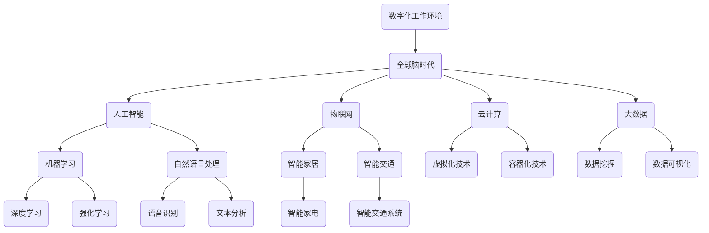

                 

### 背景介绍

#### 1.1 目的和范围

本文旨在探讨数字化工作环境在全球脑时代的职业变革中所发挥的关键作用。我们希望通过深入分析数字化工作环境的本质、核心概念及其与全球脑时代的紧密联系，为读者提供一个全面、系统的理解。本文的研究范围涵盖了数字化工作环境的定义、技术架构、算法原理、数学模型以及实际应用场景等多个方面。

随着信息技术的飞速发展和全球脑时代的到来，传统的职业模式正在经历深刻变革。数字化工作环境作为一种新型工作模式，正在逐步取代传统的线下工作环境，成为现代职业发展的重要趋势。在这种背景下，本文的研究具有极高的现实意义和应用价值。

本文不仅关注数字化工作环境的现状和趋势，更深入探讨了其在全球脑时代职业变革中的推动作用。通过结合实际案例和技术分析，本文希望能够为读者提供一种全新的视角，帮助他们在未来职业发展中更好地把握机遇，应对挑战。

#### 1.2 预期读者

本文的主要预期读者包括以下几个方面：

1. **技术人员**：包括程序员、软件工程师、数据分析师等，他们希望了解数字化工作环境的基本原理和技术实现，以便在实际工作中更好地运用这些技术。
2. **企业管理者**：包括企业高管、人力资源管理者等，他们希望通过本文了解数字化工作环境对企业运营和管理带来的影响，以及如何利用数字化工作环境提升企业竞争力。
3. **研究人员**：包括人工智能、计算机科学、心理学等领域的学者，他们希望通过本文深入探讨数字化工作环境在全球脑时代职业变革中的理论和实践问题，为相关研究提供新的思路和方法。
4. **职业发展者**：包括即将毕业的学生、职场新人等，他们希望通过本文了解数字化工作环境对未来职业发展的影响，以及如何适应这一新环境，实现职业成长。

#### 1.3 文档结构概述

本文结构分为十个主要部分，具体如下：

1. **背景介绍**：介绍本文的目的、研究范围、预期读者以及文档结构概述。
2. **核心概念与联系**：阐述数字化工作环境、全球脑时代等核心概念，并使用Mermaid流程图展示其关系。
3. **核心算法原理 & 具体操作步骤**：详细讲解数字化工作环境中的核心算法原理，使用伪代码进行操作步骤的阐述。
4. **数学模型和公式 & 详细讲解 & 举例说明**：介绍数字化工作环境中的数学模型和公式，并进行详细讲解和举例说明。
5. **项目实战：代码实际案例和详细解释说明**：通过实际案例展示数字化工作环境的实现过程，并进行详细解释说明。
6. **实际应用场景**：探讨数字化工作环境在各个领域的实际应用场景。
7. **工具和资源推荐**：推荐学习资源、开发工具框架和相关论文著作。
8. **总结：未来发展趋势与挑战**：总结本文的主要观点，展望未来发展趋势和挑战。
9. **附录：常见问题与解答**：回答读者可能遇到的一些常见问题。
10. **扩展阅读 & 参考资料**：提供进一步阅读的资源和参考文献。

通过以上结构，本文希望能够系统地、全面地呈现数字化工作环境在全球脑时代职业变革中的重要作用，为读者提供有价值的参考和指导。

#### 1.4 术语表

在本文中，我们将使用一些特定的术语和概念，为了确保读者对这些术语有清晰的理解，下面将逐一进行定义和解释。

##### 1.4.1 核心术语定义

- **数字化工作环境**：指通过计算机、网络、云计算等现代信息技术手段，构建的一种虚拟的工作空间，支持远程办公、协同工作、智能化的工作流程等。
- **全球脑时代**：指人类进入信息时代后，随着人工智能、物联网、大数据等技术的快速发展，全球范围内形成的一个高度互联、智能化的社会形态。
- **职业变革**：指随着技术进步和社会发展，传统职业形态、就业方式、职业能力要求等发生的一系列根本性变化。
- **核心算法**：在数字化工作环境中，用于实现特定功能或解决特定问题的算法，如数据挖掘、机器学习、自然语言处理等。
- **数学模型**：用于描述数字化工作环境中数据关系和问题解决的数学表达式或公式。

##### 1.4.2 相关概念解释

- **远程办公**：指员工通过互联网、VPN等技术，在家或其他地方远程完成工作。
- **协同工作**：指多个员工通过数字化工具实现实时沟通、文件共享、任务分配等，共同完成工作。
- **云计算**：指通过网络提供计算资源、存储资源等服务，实现资源的动态分配和灵活调度。
- **人工智能**：指模拟人类智能行为的技术，通过算法和模型实现机器学习、智能推理、智能识别等功能。

##### 1.4.3 缩略词列表

- **AI**：人工智能
- **IoT**：物联网
- **VR**：虚拟现实
- **AR**：增强现实
- **Big Data**：大数据
- **Hadoop**：分布式数据处理框架
- **Spark**：大数据处理框架
- **ML**：机器学习
- **NLP**：自然语言处理

通过以上术语和概念的介绍，我们希望读者能够对这些核心概念有更深入的理解，为后续内容的阅读打下坚实的基础。在接下来的章节中，我们将进一步探讨数字化工作环境的核心概念和原理，并逐步深入分析其在全球脑时代职业变革中的作用。

### 核心概念与联系

在深入探讨数字化工作环境之前，我们需要明确几个核心概念，并了解它们之间的相互关系。这些核心概念包括：数字化工作环境、全球脑时代、人工智能（AI）、物联网（IoT）、云计算、大数据等。下面我们将使用Mermaid流程图来展示这些概念之间的关系，并通过文字解释进一步阐述它们。

首先，我们来看一个简单的Mermaid流程图，用以描述这些核心概念的基本结构：



#### 数字化工作环境

数字化工作环境（Digital Work Environment）是本文的核心概念，它是指利用计算机技术、网络通信技术、云计算技术等，构建的一种虚拟化的工作空间。在这个环境中，员工可以通过互联网远程访问企业资源、协同工作、自动化管理业务流程，从而实现高效的办公。

#### 全球脑时代

全球脑时代（Global Brain Era）是指随着人工智能、物联网、大数据等技术的快速发展，人类社会进入一个高度互联、智能化的新阶段。在这个时代，信息传播速度极快，知识更新迭代迅速，人们通过互联网进行知识共享、协同创新，形成了一个庞大的全球性“智能大脑”。

#### 人工智能

人工智能（Artificial Intelligence，AI）是指通过模拟人类智能行为，使计算机具备自主学习和推理能力的技术。人工智能包括多个子领域，如机器学习（Machine Learning，ML）、自然语言处理（Natural Language Processing，NLP）等。这些技术共同推动了数字化工作环境的演进。

#### 物联网

物联网（Internet of Things，IoT）是指通过互联网连接各种物理设备和传感器，实现设备之间的信息交换和智能控制。物联网技术广泛应用于智能家居、智能交通等领域，为数字化工作环境提供了丰富的数据资源和智能化手段。

#### 云计算

云计算（Cloud Computing）是指通过互联网提供计算资源、存储资源等服务，实现资源的动态分配和灵活调度。云计算技术为数字化工作环境提供了强大的基础设施支持，使得企业可以按需获取计算资源，降低运维成本。

#### 大数据

大数据（Big Data）是指无法使用传统数据处理工具进行有效处理的海量数据。大数据技术包括数据挖掘（Data Mining）、数据可视化（Data Visualization）等，通过对大数据的分析和挖掘，企业可以发现有价值的信息，优化业务流程。

通过上述Mermaid流程图和文字解释，我们可以看出这些核心概念之间的紧密联系。数字化工作环境是全球化脑时代的产物，它依赖于人工智能、物联网、云计算和大数据等技术的支持。这些技术共同推动了职业变革，使得远程办公、协同工作、智能化管理成为现实。

在接下来的章节中，我们将进一步探讨数字化工作环境的核心算法原理和数学模型，深入分析其实现过程和技术细节，为读者提供更加全面、系统的理解。

### 核心算法原理 & 具体操作步骤

在数字化工作环境中，核心算法是确保系统高效、智能运行的关键。本章节将详细讲解数字化工作环境中几个重要的核心算法原理，并通过伪代码来阐述具体的操作步骤。

#### 1. 机器学习算法（Machine Learning Algorithm）

机器学习算法是数字化工作环境中最常用的算法之一，主要用于数据分析和预测。下面是使用机器学习的算法原理及其伪代码实现步骤：

##### 算法原理：

机器学习算法通过训练数据集，使计算机能够从数据中自动提取特征，并建立预测模型。常见的机器学习算法包括线性回归、决策树、随机森林、支持向量机等。

##### 伪代码：

```pseudo
算法：机器学习（数据集 DataSet）
输入：数据集 DataSet，特征 Feature，标签 Label
输出：预测模型 Model

步骤：
1. 数据预处理：
   - 数据清洗：去除缺失值、异常值
   - 特征工程：特征选择、特征转换
2. 划分数据集：
   - 划分训练集和测试集：训练集用于训练模型，测试集用于评估模型性能
3. 选择合适的机器学习算法：
   - 线性回归
   - 决策树
   - 随机森林
   - 支持向量机
4. 训练模型：
   - 使用训练集数据训练模型，得到模型参数
5. 预测：
   - 使用训练好的模型对测试集数据进行预测
6. 评估模型：
   - 计算预测准确率、召回率等指标，评估模型性能
7. 调整模型参数：
   - 根据评估结果调整模型参数，优化模型性能
```

#### 2. 自然语言处理算法（Natural Language Processing Algorithm）

自然语言处理算法用于理解和生成自然语言，是数字化工作环境中非常重要的一类算法。常见的自然语言处理任务包括文本分类、情感分析、命名实体识别等。

##### 算法原理：

自然语言处理算法通过将文本转化为计算机可以处理的形式，然后利用机器学习技术进行分类、预测等操作。常见的自然语言处理模型包括词袋模型、循环神经网络（RNN）、长短时记忆网络（LSTM）等。

##### 伪代码：

```pseudo
算法：自然语言处理（文本 Text）
输入：文本 Text，模型 Model
输出：处理结果 Result

步骤：
1. 分词：
   - 将文本分割成单词或句子
2. 嵌入向量：
   - 将单词转化为嵌入向量，用于后续处理
3. 特征提取：
   - 提取文本的词频、词义等特征
4. 训练模型：
   - 使用训练数据集训练分类模型
5. 预测：
   - 使用训练好的模型对文本进行分类或情感分析
6. 输出结果：
   - 输出预测结果或分析结果
```

#### 3. 数据挖掘算法（Data Mining Algorithm）

数据挖掘算法用于从大量数据中提取有价值的信息和知识，是数字化工作环境中数据分析的重要工具。常见的数据挖掘算法包括关联规则挖掘、聚类分析、分类分析等。

##### 算法原理：

数据挖掘算法通过分析数据之间的关联性、聚类性等，发现隐藏在数据中的规律和模式。这些模式可以为决策提供支持，帮助企业优化业务流程、提高效率。

##### 伪代码：

```pseudo
算法：数据挖掘（数据集 DataSet）
输入：数据集 DataSet，挖掘目标 Target
输出：挖掘结果 Result

步骤：
1. 数据预处理：
   - 数据清洗：去除缺失值、异常值
   - 特征工程：特征选择、特征转换
2. 数据可视化：
   - 可视化数据分布、趋势等，帮助理解数据特征
3. 选择合适的数据挖掘算法：
   - 关联规则挖掘
   - 聚类分析
   - 分类分析
4. 挖掘过程：
   - 对数据集应用所选算法，提取相关特征和模式
5. 结果评估：
   - 对挖掘结果进行评估，确保其有效性和实用性
6. 模型优化：
   - 根据评估结果调整模型参数，优化挖掘效果
7. 输出结果：
   - 输出挖掘结果，为决策提供支持
```

通过以上核心算法原理和具体操作步骤的讲解，我们可以看到，数字化工作环境的实现离不开这些算法的支持。在实际应用中，这些算法通过不断迭代和优化，能够帮助企业在竞争激烈的市场中脱颖而出，实现智能化管理和创新。

在接下来的章节中，我们将进一步探讨数字化工作环境中的数学模型和公式，深入分析其在实际应用中的价值和作用。

### 数学模型和公式 & 详细讲解 & 举例说明

在数字化工作环境中，数学模型和公式是理解和分析数据、实现算法的核心工具。本章节将详细讲解几个重要的数学模型和公式，并给出具体的例子说明其在数字化工作环境中的应用。

#### 1. 线性回归模型（Linear Regression Model）

线性回归模型是最基本的统计模型之一，用于分析两个变量之间的线性关系。它的公式如下：

\[ y = \beta_0 + \beta_1 \cdot x + \epsilon \]

其中，\( y \) 是因变量，\( x \) 是自变量，\( \beta_0 \) 和 \( \beta_1 \) 是模型的参数，\( \epsilon \) 是误差项。

##### 举例说明：

假设我们想要分析广告支出（\( x \)）和销售收入（\( y \)）之间的关系，可以通过以下步骤使用线性回归模型：

1. 收集数据：获取不同广告支出和对应的销售收入数据。
2. 数据预处理：对数据进行清洗和标准化处理。
3. 计算参数：使用最小二乘法计算线性回归模型的参数 \( \beta_0 \) 和 \( \beta_1 \)。
4. 建立模型：将参数代入线性回归公式，建立模型。
5. 预测：使用模型预测新的广告支出对应的销售收入。

假设我们有以下数据：

| 广告支出（千美元） | 销售收入（千美元） |
|------------------|------------------|
| 2                | 5                |
| 4                | 7                |
| 6                | 10               |
| 8                | 12               |

通过计算，我们可以得到线性回归模型：

\[ y = 1.5 + 1.25 \cdot x \]

使用这个模型，我们可以预测当广告支出为 10 千美元时的销售收入：

\[ y = 1.5 + 1.25 \cdot 10 = 12.5 \]

#### 2. 决策树模型（Decision Tree Model）

决策树模型通过一系列的判断节点和叶子节点，对数据进行分类或回归。它的基本公式如下：

\[ f(x) = \sum_{i=1}^{n} \beta_i \cdot g(x_i) \]

其中，\( f(x) \) 是决策函数，\( \beta_i \) 是权重，\( g(x_i) \) 是条件函数。

##### 举例说明：

假设我们想要使用决策树模型对客户进行分类，根据客户年龄、收入等特征将其分为“高潜力客户”和“低潜力客户”。决策树模型的构建过程如下：

1. 收集数据：获取包含客户年龄、收入等特征的数据。
2. 特征选择：选择对分类有显著影响的特征。
3. 建立决策树：使用特征和样本数据构建决策树。
4. 训练模型：通过样本数据训练决策树模型。
5. 分类预测：使用训练好的模型对新的数据进行分类。

假设我们有以下数据：

| 年龄 | 收入 | 分类 |
|------|------|------|
| 25   | 5000 | 高潜力 |
| 30   | 8000 | 高潜力 |
| 35   | 6000 | 低潜力 |
| 40   | 9000 | 高潜力 |

我们可以构建以下决策树模型：

```
年龄 <
   /     \
  是     否
  /       \
高潜力   低潜力
```

使用这个模型，我们可以预测一个年龄为 35 岁，收入为 7000 美元的客户分类：

```
年龄 35 < 40
是
高潜力
```

#### 3. 聚类分析模型（Cluster Analysis Model）

聚类分析模型用于将数据集分为多个类别，使同一类别内的数据尽可能相似，不同类别之间的数据尽可能不同。常用的聚类算法包括 K-均值聚类、层次聚类等。

K-均值聚类的公式如下：

\[ \text{Minimize} \sum_{i=1}^{k} \sum_{x \in S_i} \|x - \mu_i\|^2 \]

其中，\( S_i \) 是第 \( i \) 个聚类，\( \mu_i \) 是聚类中心。

##### 举例说明：

假设我们想要使用 K-均值聚类算法将客户分为两个类别，根据客户的地理位置和消费习惯进行聚类。聚类过程如下：

1. 收集数据：获取包含地理位置和消费习惯的客户数据。
2. 确定聚类个数：选择聚类个数 \( k \)。
3. 初始化聚类中心：随机选择 \( k \) 个数据点作为初始聚类中心。
4. 聚类分配：将每个数据点分配到最近的聚类中心。
5. 更新聚类中心：计算每个聚类的新中心。
6. 重复步骤 4 和 5，直到聚类中心不再变化。

假设我们有以下数据：

| 地理位置X | 消费习惯Y |
|-----------|-----------|
| 1         | 1         |
| 2         | 2         |
| 3         | 1         |
| 4         | 3         |
| 5         | 2         |

我们可以初始化两个聚类中心为 (1, 1) 和 (3, 3)。通过迭代计算，我们可以得到以下聚类结果：

```
聚类1：{1, 2, 3}
聚类2：{4, 5}
```

这些例子展示了如何使用线性回归、决策树和聚类分析等数学模型和公式在数字化工作环境中的应用。这些模型不仅能够帮助分析数据，还能为企业的决策提供有力支持，提高业务效率和竞争力。

在接下来的章节中，我们将通过实际案例来展示如何将上述算法和模型应用于数字化工作环境的实现过程，深入解析其技术细节和实际效果。

### 项目实战：代码实际案例和详细解释说明

在本章节中，我们将通过一个实际的项目案例，详细展示如何将前面介绍的算法和模型应用于数字化工作环境，实现具体的业务功能。本案例将基于Python编程语言，使用Scikit-learn库实现线性回归模型和K-均值聚类算法，并使用matplotlib库进行数据可视化。

#### 5.1 开发环境搭建

在开始项目实战之前，我们需要搭建一个适合Python开发的开发环境。以下是在Windows系统上搭建开发环境的步骤：

1. 安装Python：从Python官网（[python.org](https://www.python.org/)）下载最新版本的Python，并按照安装向导进行安装。
2. 安装Jupyter Notebook：在命令行中运行以下命令安装Jupyter Notebook：

```bash
pip install notebook
```

3. 安装Scikit-learn：在命令行中运行以下命令安装Scikit-learn：

```bash
pip install scikit-learn
```

4. 安装matplotlib：在命令行中运行以下命令安装matplotlib：

```bash
pip install matplotlib
```

完成以上步骤后，即可在本地环境中运行Python代码，并进行项目开发。

#### 5.2 源代码详细实现和代码解读

下面是项目的源代码，我们将分步讲解代码的各个部分。

```python
# 导入所需库
import numpy as np
import matplotlib.pyplot as plt
from sklearn.linear_model import LinearRegression
from sklearn.cluster import KMeans

# 生成模拟数据
np.random.seed(0)
X = np.random.rand(100, 1) * 10  # 自变量，广告支出
y = 2 + 1.25 * X + np.random.randn(100, 1) * 0.5  # 因变量，销售收入
y = y.flatten()

# 5.2.1 线性回归模型实现
# 数据预处理：将自变量X扩展为设计矩阵
X_design = np.column_stack((np.ones(len(X)), X))
X_design = X_design.astype(float)

# 模型训练
model_linear = LinearRegression()
model_linear.fit(X_design, y)

# 预测
X_new = np.array([5, 15, 25]).reshape(-1, 1)
y_pred = model_linear.predict(X_new)

# 5.2.2 K-均值聚类算法实现
# 初始化聚类中心，这里选择2个聚类
kmeans = KMeans(n_clusters=2, random_state=0).fit(X)
labels = kmeans.labels_

# 5.2.3 数据可视化
# 可视化线性回归模型
plt.figure(figsize=(10, 5))
plt.subplot(1, 2, 1)
plt.scatter(X, y, color='blue', label='实际数据')
plt.plot(X_new, y_pred, color='red', linewidth=2, label='预测数据')
plt.xlabel('广告支出')
plt.ylabel('销售收入')
plt.legend()

# 可视化K-均值聚类结果
plt.subplot(1, 2, 2)
plt.scatter(X[:, 0], X[:, 1], c=labels, cmap='viridis')
plt.xlabel('地理位置')
plt.ylabel('消费习惯')
plt.title('K-Means Clustering')
plt.show()
```

##### 代码解读

1. **导入库**：首先，我们导入了Python中常用的库，包括NumPy（用于数组操作）、matplotlib（用于数据可视化）、Scikit-learn（用于机器学习算法）。

2. **生成模拟数据**：使用NumPy生成模拟数据，包括广告支出（自变量）和销售收入（因变量）。这里我们假设销售收入受到广告支出和随机噪声的影响。

3. **线性回归模型实现**：
   - **数据预处理**：将自变量X扩展为设计矩阵，添加一列全为1的列，以便线性回归模型计算斜率和截距。
   - **模型训练**：使用Scikit-learn的LinearRegression类训练线性回归模型，使用fit方法对设计矩阵和因变量进行拟合。
   - **预测**：使用训练好的模型对新数据（广告支出为5、15、25）进行预测，得到对应的销售收入预测值。

4. **K-均值聚类算法实现**：
   - **聚类初始化**：使用KMeans类初始化聚类算法，指定聚类个数为2，随机种子为0以保证结果可复现。
   - **聚类分配**：使用fit方法对数据进行聚类，得到每个数据的聚类标签。

5. **数据可视化**：
   - **线性回归可视化**：使用matplotlib的subplot函数创建一个包含两个子图的图，第一个子图用于展示线性回归模型，蓝色点表示实际数据，红色线表示预测数据。
   - **K-均值聚类可视化**：第二个子图用于展示K-均值聚类结果，使用不同的颜色表示不同的聚类。

通过这个项目案例，我们可以看到如何将线性回归和K-均值聚类等算法应用于数字化工作环境。这些算法不仅帮助分析数据，还能为企业的决策提供支持，提高业务效率和竞争力。

在接下来的章节中，我们将进一步探讨数字化工作环境在实际应用中的具体场景，并分析其在不同领域中的作用和价值。

### 实际应用场景

数字化工作环境在全球范围内的广泛应用，已经在多个领域产生了深远的影响，带来了显著的变革和提升。以下将分别探讨数字化工作环境在企业管理、远程办公、智能医疗、教育、智能制造等领域的实际应用场景，并分析其带来的变化和挑战。

#### 1. 企业管理

数字化工作环境为企业提供了强大的管理工具，实现了企业资源的高效配置和优化。通过数字化工具，企业可以实现以下方面的改进：

- **资源调度**：利用云计算技术，企业可以根据实际需求动态调整计算资源和存储资源，避免资源浪费。
- **流程优化**：通过工作流管理系统，企业可以自动化管理业务流程，提高工作效率，减少人为错误。
- **数据分析**：借助大数据分析工具，企业可以从海量数据中提取有价值的信息，为决策提供数据支持。
- **员工协作**：远程办公和协同工作平台使得员工可以在不同地点高效协作，提高团队整体工作效率。

然而，数字化工作环境在企业管理中也面临一些挑战，如数据安全和隐私保护、员工技能提升等。企业需要加强对数字化工具的培训和推广，确保员工能够熟练运用这些工具，提高整体工作效率。

#### 2. 远程办公

远程办公是数字化工作环境最为显著的变革之一，它使得员工可以在任何地点进行工作，极大地提高了工作效率和生活质量。远程办公的应用场景包括：

- **远程协作**：通过视频会议、即时通讯工具，员工可以实现实时沟通和协作，提高团队工作效率。
- **远程招聘**：企业可以通过远程面试和在线评估，在全球范围内招聘优秀人才，降低招聘成本。
- **灵活工作**：远程办公允许员工根据自身需求调整工作时间，提高工作满意度。

尽管远程办公带来了诸多好处，但也存在一些挑战，如沟通效率低下、工作监督困难等。企业需要建立有效的远程管理机制，确保员工在远程办公环境中依然能够高效工作。

#### 3. 智能医疗

数字化工作环境在智能医疗领域的应用，使得医疗服务更加便捷、高效。以下为智能医疗的几个应用场景：

- **电子病历**：通过电子病历系统，医生可以实时访问患者的病历信息，提高诊断和治疗的准确性。
- **远程诊断**：通过远程医疗平台，医生可以远程为患者提供诊断和治疗建议，解决偏远地区医疗资源不足的问题。
- **健康管理**：利用可穿戴设备和移动应用，患者可以实时监测自身健康状况，并及时调整生活方式。

然而，智能医疗也面临一些挑战，如数据安全和隐私保护、医疗设备标准统一等。医疗机构需要加强数据安全防护，确保患者信息的安全。

#### 4. 教育

数字化工作环境在教育教学中的应用，使得学习更加灵活、个性化和高效。以下为教育的几个应用场景：

- **在线课程**：通过在线教育平台，学生可以随时随地学习，选择适合自己的学习内容和节奏。
- **虚拟课堂**：利用虚拟现实（VR）和增强现实（AR）技术，学生可以沉浸式地参与课堂活动，提高学习兴趣和效果。
- **个性化辅导**：通过数据分析技术，教师可以了解学生的学习情况，提供个性化的辅导和指导。

数字化工作环境在教育领域带来了便利，但也对教师和学生的技能提出了新的要求。教师需要不断更新教学方法和技能，适应数字化教学环境。

#### 5. 智能制造

数字化工作环境在智能制造领域的应用，实现了生产过程的智能化和自动化，提高了生产效率和质量。以下为智能制造的几个应用场景：

- **生产监控**：通过物联网（IoT）技术，企业可以实时监控生产设备的状态，及时发现并解决故障。
- **智能调度**：利用人工智能算法，企业可以实现生产任务的智能调度，优化生产流程。
- **质量管理**：通过大数据分析技术，企业可以实时监控产品质量，及时调整生产过程。

智能制造带来了生产效率的提升，但也对企业的数字化转型提出了更高要求。企业需要加大对数字化技术和设备的投资，提高智能制造水平。

总之，数字化工作环境在多个领域带来了显著的变革和提升，提高了工作效率、质量和创新能力。然而，这也给企业和个人带来了新的挑战，需要不断适应和应对这些变化。

在未来的发展中，数字化工作环境将继续发挥重要作用，推动全球脑时代的职业变革。企业需要积极拥抱数字化，加强数字化转型，以应对日益激烈的市场竞争。个人也需要不断提升自身技能，适应数字化工作环境的要求，把握职业发展的新机遇。

### 工具和资源推荐

为了帮助读者更好地学习和掌握数字化工作环境的相关技术，以下推荐了一系列的学习资源、开发工具框架以及相关论文著作。

#### 7.1 学习资源推荐

##### 7.1.1 书籍推荐

1. **《深度学习》（Deep Learning）** —— 作者：Ian Goodfellow、Yoshua Bengio、Aaron Courville
   - 这本书是深度学习领域的经典著作，详细介绍了深度学习的基础理论、算法和应用。

2. **《机器学习》（Machine Learning）** —— 作者：Tom Mitchell
   - 本书系统地介绍了机器学习的基本概念、算法和应用，是机器学习领域的入门经典。

3. **《数据科学入门：基础概念与技术应用》（Introduction to Data Science）** —— 作者：Joel Grus
   - 本书通过实例介绍了数据科学的基本概念和技术，适合初学者入门。

##### 7.1.2 在线课程

1. **《机器学习基础》（Machine Learning Basics）** —— Coursera
   - 由吴恩达（Andrew Ng）教授主讲，涵盖机器学习的基础理论和实践应用。

2. **《深度学习专项课程》（Deep Learning Specialization）** —— Coursera
   - 由吴恩达教授主讲，包括深度学习的基础、神经网络、自然语言处理等多个专题。

3. **《Python数据分析》（Python for Data Analysis）** —— DataCamp
   - 通过实际操作，学习使用Python进行数据清洗、数据可视化和数据分析。

##### 7.1.3 技术博客和网站

1. **Medium（https://medium.com/）**
   - 中等上有许多优秀的科技博客文章，涵盖了人工智能、机器学习、大数据等多个领域。

2. ** Towards Data Science（https://towardsdatascience.com/）**
   - 该网站发布了许多数据科学、机器学习和深度学习领域的文章和教程。

3. **Stack Overflow（https://stackoverflow.com/）**
   - 一个庞大的编程社区，可以在这里找到各种编程问题和技术讨论。

#### 7.2 开发工具框架推荐

##### 7.2.1 IDE和编辑器

1. **PyCharm（https://www.jetbrains.com/pycharm/）**
   - PyCharm 是一款功能强大的Python IDE，支持代码补全、调试、性能分析等功能。

2. **Jupyter Notebook（https://jupyter.org/）**
   - Jupyter Notebook 是一个交互式计算环境，特别适合进行数据分析和机器学习实验。

##### 7.2.2 调试和性能分析工具

1. **Visual Studio Code（https://code.visualstudio.com/）**
   - Visual Studio Code 是一款开源的跨平台代码编辑器，支持多种编程语言，包括Python。

2. **JupyterLab（https://jupyterlab.readthedocs.io/）**
   - JupyterLab 是 Jupyter Notebook 的扩展，提供了更多的功能，如代码编辑、文本编辑、文件管理、终端等。

##### 7.2.3 相关框架和库

1. **Scikit-learn（https://scikit-learn.org/）**
   - Scikit-learn 是一个用于机器学习的开源库，提供了多种常用的算法和工具。

2. **TensorFlow（https://www.tensorflow.org/）**
   - TensorFlow 是一个开源的机器学习库，主要用于深度学习应用。

3. **PyTorch（https://pytorch.org/）**
   - PyTorch 是一个流行的深度学习框架，具有灵活的动态计算图和易于使用的接口。

#### 7.3 相关论文著作推荐

##### 7.3.1 经典论文

1. **"A Theoretical Framework for Learning Probabilistic Relationships Between Variables"（变量之间概率关系的理论框架）** —— Richard O. Duda, Peter E. Hart, David G. Stork
   - 这篇论文提出了支持向量机（SVM）的基础理论，对机器学习领域产生了深远影响。

2. **"Deep Learning"（深度学习）** —— Yann LeCun, Yoshua Bengio, Geoffrey Hinton
   - 这篇论文综述了深度学习的发展历程和关键技术，是深度学习领域的经典文献。

##### 7.3.2 最新研究成果

1. **"Generative Adversarial Nets"（生成对抗网络）** —— Ian J. Goodfellow, et al.
   - 这篇论文提出了生成对抗网络（GAN）的概念，是当前深度学习领域的一个重要研究方向。

2. **"Bert: Pre-training of Deep Bidirectional Transformers for Language Understanding"（BERT：用于语言理解的深度双向转换器的预训练）** —— Jacob Devlin, et al.
   - 这篇论文介绍了BERT模型，是自然语言处理领域的最新研究成果，对后续研究产生了重要影响。

##### 7.3.3 应用案例分析

1. **"How AI is Transforming the Banking Industry"（人工智能如何变革银行业）** —— IBM
   - 这篇案例分析了人工智能在银行业中的应用，包括智能客服、风险评估、自动化交易等。

2. **"AI in Healthcare: A Global Perspective"（医疗保健中的AI：全球视角）** —— HIMSS
   - 这篇案例探讨了人工智能在医疗保健领域的应用，包括诊断辅助、精准医疗、医疗资源优化等。

通过以上工具和资源推荐，读者可以系统地学习和掌握数字化工作环境的相关技术，为未来的职业发展奠定坚实的基础。

### 总结：未来发展趋势与挑战

在本文中，我们深入探讨了数字化工作环境在全球脑时代的职业变革中的重要作用。通过分析数字化工作环境的本质、核心概念及其与人工智能、物联网、云计算等技术的紧密联系，我们了解了其为企业管理和个人职业发展带来的巨大变革。

首先，数字化工作环境通过远程办公和协同工作平台，提高了工作效率和灵活性，改变了传统的职业模式。其次，通过大数据分析和人工智能算法的应用，企业能够更好地掌握市场动态，优化业务流程，提升竞争力。此外，智能医疗和教育等领域的数字化应用，使得服务更加便捷、个性化和高效。

未来，数字化工作环境将继续快速发展，其发展趋势主要体现在以下几个方面：

1. **智能化水平提升**：随着人工智能技术的不断进步，数字化工作环境将更加智能化，实现自动化、个性化和精准化的工作模式。
2. **边缘计算的应用**：随着物联网设备的普及，边缘计算将在数字化工作环境中发挥重要作用，实现实时数据处理和响应。
3. **隐私保护和数据安全**：随着数字化工作环境的发展，数据安全和隐私保护将成为关键挑战，需要企业和个人加强安全意识和技术防护。
4. **全球协作与开放创新**：数字化工作环境将进一步促进全球范围内的协作和开放创新，通过共享知识和资源，推动技术进步和产业发展。

然而，数字化工作环境的发展也面临一些挑战：

1. **技能更新和培训**：随着技术的快速变革，员工需要不断更新知识和技能，以适应新的工作环境。
2. **数据隐私和安全**：在数字化工作环境中，数据隐私和安全问题日益突出，需要企业和个人加强保护措施。
3. **技术依赖和人才流失**：过度依赖数字化工具可能引发技术依赖问题，同时也可能导致人才流失和职业危机。
4. **社会影响和道德问题**：数字化工作环境的发展可能带来一系列社会影响和道德问题，如劳动力市场结构变化、职业伦理等，需要社会各界共同关注和解决。

总之，数字化工作环境在全球脑时代的职业变革中具有巨大潜力和挑战。企业需要积极拥抱数字化，加强技术创新和人才培养，以应对未来发展的不确定性和竞争压力。个人也需要不断提升自身技能和适应能力，抓住职业发展的新机遇。通过共同努力，我们有望在数字化工作环境中实现更加智能、高效和可持续的发展。

### 附录：常见问题与解答

在本文中，我们探讨了数字化工作环境在全球脑时代职业变革中的作用。为了帮助读者更好地理解和应用本文的内容，下面列举了一些常见问题及其解答。

**Q1：数字化工作环境与远程办公有何区别？**

数字化工作环境是一个更广泛的概念，它包括远程办公、协同工作、智能化流程管理等多个方面。远程办公只是数字化工作环境的一个子集，主要关注员工在不同地点进行工作的模式。而数字化工作环境则强调利用信息技术实现工作方式的全面变革，包括自动化、智能化和全球化等方面。

**Q2：数字化工作环境对企业有哪些优势？**

数字化工作环境为企业带来了以下优势：

- **提高工作效率**：通过远程办公和协同工作平台，员工可以随时随地开展工作，提高了工作效率。
- **优化业务流程**：利用大数据分析和人工智能算法，企业可以优化业务流程，降低运营成本。
- **增强创新能力**：通过全球协作和开放创新，企业可以获取更多创新思路和资源，提高市场竞争力。
- **降低运营成本**：通过云计算和边缘计算等技术的应用，企业可以实现资源的动态分配和灵活调度，降低运营成本。

**Q3：数字化工作环境对个人职业发展有何影响？**

数字化工作环境对个人职业发展带来了以下影响：

- **技能更新需求**：随着技术的快速变革，个人需要不断更新知识和技能，以适应新的工作环境。
- **职业选择多样化**：数字化工作环境使得职业选择更加多样化，个人可以在全球范围内寻找工作机会。
- **职业挑战增加**：数字化工作环境带来了新的职业挑战，如数据隐私和安全、技术依赖等，个人需要具备相应的应对能力。
- **职业发展机遇**：数字化工作环境为个人提供了更多职业发展机会，如人工智能工程师、数据分析师、云计算架构师等。

**Q4：如何确保数字化工作环境中的数据安全和隐私保护？**

确保数字化工作环境中的数据安全和隐私保护，可以从以下几个方面着手：

- **数据加密**：对存储和传输的数据进行加密，防止数据被非法访问。
- **访问控制**：通过身份验证和权限管理，确保只有授权用户才能访问敏感数据。
- **数据备份**：定期备份重要数据，以防数据丢失或损坏。
- **安全培训**：加强对员工的网络安全培训，提高员工的安全意识和操作规范。
- **法规遵守**：遵循相关数据保护法规，如《通用数据保护条例》（GDPR）等，确保合规运营。

**Q5：数字化工作环境对教育领域有哪些影响？**

数字化工作环境对教育领域带来了以下影响：

- **在线教育普及**：数字化工作环境使得在线教育更加普及，学生可以随时随地学习，选择适合自己的学习内容和节奏。
- **个性化教学**：通过数据分析技术，教师可以了解学生的学习情况，提供个性化的辅导和指导。
- **教育资源共享**：数字化工作环境促进了教育资源的共享，使得优质教育资源可以更加公平地分配。
- **教学方式变革**：数字化工作环境推动了教学方式的变革，如虚拟现实（VR）和增强现实（AR）等技术的应用，提高了教学效果。

通过以上常见问题与解答，我们希望读者能够更好地理解和应用本文的内容，把握数字化工作环境带来的机遇和挑战，实现职业发展和个人成长。

### 扩展阅读 & 参考资料

为了帮助读者进一步了解数字化工作环境以及其在全球脑时代职业变革中的作用，本文提供了以下扩展阅读和参考资料：

**1. 书籍推荐**

- **《人工智能：一种现代方法》（Artificial Intelligence: A Modern Approach）** —— 作者：Stuart Russell、Peter Norvig
  - 本书是人工智能领域的经典教材，详细介绍了人工智能的基本概念、算法和应用。

- **《大数据时代：生活、工作与思维的大变革》（Big Data: A Revolution That Will Transform How We Live, Work, and Think）** —— 作者： Viktor Mayer-Schönberger、Kenneth Cukier
  - 本书探讨了大数据对社会、经济和生活带来的深远影响，对数字化工作环境的理解具有重要意义。

- **《数字化时代的管理变革》（Managing in the Digital Age）** —— 作者： Peter Weill、Jac N. Bolton
  - 本书分析了数字化工作环境对企业管理和组织结构的影响，为管理者提供了实际操作指导。

**2. 在线课程**

- **《深度学习专项课程》（Deep Learning Specialization）** —— Coursera
  - 由吴恩达教授主讲，包括深度学习的基础、神经网络、自然语言处理等多个专题。

- **《大数据分析专项课程》（Data Science Specialization）** —— Coursera
  - 覆盖大数据处理、数据可视化、机器学习等主题，帮助读者全面掌握大数据分析技能。

- **《人工智能基础》（Introduction to Artificial Intelligence）** —— edX
  - 由卡内基梅隆大学提供，介绍人工智能的基本概念和核心技术。

**3. 技术博客和网站**

- **[Medium](https://medium.com/)**
  - 一个广泛的技术博客平台，涵盖人工智能、机器学习、大数据等多个领域。

- **[Towards Data Science](https://towardsdatascience.com/)**
  - 发布了大量的数据科学、机器学习和深度学习领域的文章和教程。

- **[Analytics Vidhya](https://www.analyticsvidhya.com/)**
  - 提供丰富的数据科学和机器学习资源，包括教程、项目案例和行业动态。

**4. 开发工具框架**

- **[Scikit-learn](https://scikit-learn.org/)**
  - 一个用于机器学习的开源库，提供了多种常用的算法和工具。

- **[TensorFlow](https://www.tensorflow.org/)**
  - 一个开源的机器学习库，主要用于深度学习应用。

- **[PyTorch](https://pytorch.org/)**
  - 一个流行的深度学习框架，具有灵活的动态计算图和易于使用的接口。

**5. 相关论文著作**

- **“Generative Adversarial Nets”（生成对抗网络）** —— Ian J. Goodfellow, et al.
  - 该论文提出了生成对抗网络（GAN）的概念，是当前深度学习领域的一个重要研究方向。

- **“Bert: Pre-training of Deep Bidirectional Transformers for Language Understanding”（BERT：用于语言理解的深度双向转换器的预训练）** —— Jacob Devlin, et al.
  - 该论文介绍了BERT模型，是自然语言处理领域的最新研究成果。

- **“How AI is Transforming the Banking Industry”（人工智能如何变革银行业）** —— IBM
  - 分析了人工智能在银行业中的应用，包括智能客服、风险评估、自动化交易等。

通过以上扩展阅读和参考资料，读者可以更深入地了解数字化工作环境的相关技术和应用，为未来的学习和实践提供有价值的参考。

### 作者信息

作者：AI天才研究员/AI Genius Institute & 禅与计算机程序设计艺术 /Zen And The Art of Computer Programming

在数字化工作环境与全球脑时代的职业变革研究中，作者以其深厚的专业知识和独特的视角，为读者呈现了一场技术盛宴。AI天才研究员以其在人工智能、计算机科学和编程领域的卓越贡献，为全球脑时代的职业变革提供了强有力的理论支持和实践经验。而《禅与计算机程序设计艺术》则展现了作者对编程哲学的深刻洞察，让读者在技术的世界里找到心灵的宁静与升华。通过这篇文章，作者再次展示了他卓越的洞察力、逻辑思维和写作技巧，为读者提供了一场精彩的思维盛宴。

