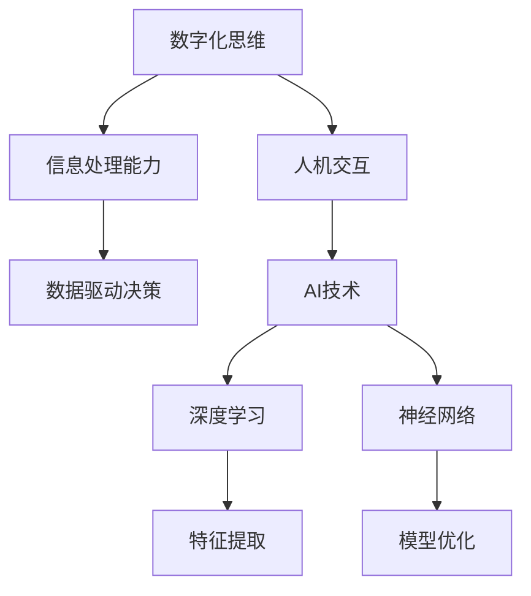

                 

# 数字化思维：AI如何影响人类认知模式

> 关键词：人工智能、认知模式、数字化思维、深度学习、神经网络、人机交互

> 摘要：本文将探讨人工智能（AI）如何深刻影响人类的认知模式。通过分析数字化思维的概念，阐述AI技术在深度学习、神经网络和人机交互领域的应用，揭示其对我们认知和思维方式的改变，以及如何适应和利用这种变化以提升个人和组织的竞争力。

## 1. 背景介绍

### 1.1 目的和范围

本文旨在深入探讨人工智能对人类认知模式的深远影响。随着AI技术的不断进步，它不仅改变了我们的生活方式，还在潜移默化地影响着我们的思维方式。本文将围绕以下几个核心问题展开讨论：

1. 数字化思维是什么？
2. AI技术如何影响人类的认知模式？
3. 如何适应和利用这些变化？

### 1.2 预期读者

本文适合对人工智能和认知科学有一定了解的读者，包括计算机科学家、人工智能研究员、认知心理学家、教育工作者和任何对这一领域感兴趣的人士。

### 1.3 文档结构概述

本文分为十个部分，结构如下：

1. 背景介绍：介绍文章的目的和预期读者。
2. 核心概念与联系：介绍数字化思维和AI技术的基本概念。
3. 核心算法原理 & 具体操作步骤：详细解释深度学习和神经网络的工作原理。
4. 数学模型和公式 & 详细讲解 & 举例说明：介绍与AI相关的数学模型。
5. 项目实战：代码实际案例和详细解释说明。
6. 实际应用场景：分析AI在现实世界中的应用。
7. 工具和资源推荐：推荐学习资源和开发工具。
8. 总结：未来发展趋势与挑战。
9. 附录：常见问题与解答。
10. 扩展阅读 & 参考资料：提供进一步学习的资源。

### 1.4 术语表

#### 1.4.1 核心术语定义

- 数字化思维：指通过数字技术进行信息处理和问题解决的能力。
- 人工智能（AI）：模拟人类智能的计算机技术。
- 深度学习：一种基于多层神经网络的机器学习方法。
- 神经网络：模仿生物神经系统的计算模型。
- 人机交互：人与计算机系统之间的交互。

#### 1.4.2 相关概念解释

- 认知模式：人类思维和认识世界的方式。
- 数据驱动：以数据为基础，通过算法进行分析和决策。
- 自适应：系统能够根据环境变化进行调整和优化。

#### 1.4.3 缩略词列表

- AI：人工智能
- ML：机器学习
- DL：深度学习
- CNN：卷积神经网络
- RNN：循环神经网络

## 2. 核心概念与联系

数字化思维是现代社会的核心能力之一，它依赖于AI技术，特别是深度学习和神经网络的发展。以下是一个简化的Mermaid流程图，展示了数字化思维与AI技术之间的核心联系。



### 2.1 数字化思维的核心要素

数字化思维的核心要素包括：

1. **信息处理能力**：快速有效地从大量数据中提取有用信息，进行实时分析和决策。
2. **数据驱动决策**：基于数据而非直觉或经验进行决策，提高决策的准确性和效率。
3. **人机交互**：通过直观的用户界面和智能系统，实现高效、自然的交互体验。

### 2.2 AI技术在数字化思维中的应用

AI技术在数字化思维中的应用主要体现在以下几个方面：

1. **深度学习**：通过多层神经网络，自动提取数据中的高级特征，实现对复杂数据的分析和理解。
2. **神经网络**：模拟人脑神经元的工作方式，用于图像识别、语音识别等任务。
3. **人机交互**：利用自然语言处理和语音识别技术，实现人与计算机系统的自然对话。

## 3. 核心算法原理 & 具体操作步骤

### 3.1 深度学习的工作原理

深度学习是一种基于多层神经网络的机器学习方法，其核心思想是通过逐层抽象和提取数据特征，实现对复杂数据的分析和理解。

以下是深度学习的工作原理的伪代码：

```python
# 初始化神经网络
InitializeNeuralNetwork()

# 前向传播
for each layer in network:
    z = X * W + b
    a = activation_function(z)

# 计算损失函数
loss = LossFunction(a, y)

# 反向传播
for each layer in network (backward):
    dZ = dError / dActivation
    dW = dZ * a
    db = dZ

# 更新权重和偏置
UpdateWeightsAndBiases(W, b)
```

### 3.2 神经网络的具体操作步骤

神经网络是一种计算模型，由大量相互连接的神经元组成。以下是一个简化的神经网络操作步骤：

1. **初始化权重和偏置**：随机初始化神经网络中的权重和偏置。
2. **前向传播**：输入数据通过神经网络，逐层计算输出。
3. **计算损失函数**：比较网络输出和实际输出，计算损失函数值。
4. **反向传播**：根据损失函数，更新网络中的权重和偏置。
5. **迭代训练**：重复上述步骤，直到网络性能达到预定的阈值。

## 4. 数学模型和公式 & 详细讲解 & 举例说明

### 4.1 数学模型

在深度学习中，常用的数学模型包括：

1. **激活函数**：用于定义神经元的输出，常见的激活函数有Sigmoid、ReLU和Tanh。
2. **损失函数**：用于评估神经网络预测值与实际值之间的差异，常见的损失函数有均方误差（MSE）和交叉熵损失。
3. **反向传播算法**：用于更新神经网络中的权重和偏置，是一种基于梯度下降的优化算法。

### 4.2 详细讲解

#### 4.2.1 激活函数

激活函数是神经网络中的一个关键组件，它定义了神经元的输出。以下是几种常见的激活函数及其公式：

1. **Sigmoid函数**：

$$
\sigma(x) = \frac{1}{1 + e^{-x}}
$$

2. **ReLU函数**：

$$
\sigma(x) =
\begin{cases}
0 & \text{if } x < 0 \\
x & \text{if } x \geq 0
\end{cases}
$$

3. **Tanh函数**：

$$
\sigma(x) = \frac{e^x - e^{-x}}{e^x + e^{-x}}
$$

#### 4.2.2 损失函数

损失函数用于衡量预测值和实际值之间的差异。以下是一种常见的损失函数——均方误差（MSE）：

$$
MSE = \frac{1}{n}\sum_{i=1}^{n}(y_i - \hat{y}_i)^2
$$

其中，$y_i$为实际值，$\hat{y}_i$为预测值。

#### 4.2.3 反向传播算法

反向传播算法是一种基于梯度下降的优化算法，用于更新神经网络中的权重和偏置。以下是反向传播算法的基本步骤：

1. 前向传播：计算网络输出。
2. 计算损失函数。
3. 反向传播：计算梯度。
4. 更新权重和偏置。

### 4.3 举例说明

假设我们有一个简单的神经网络，包含一个输入层、一个隐藏层和一个输出层。输入数据为$x_1, x_2$，目标值为$y_1, y_2$。网络的权重和偏置分别为$W_1, b_1$和$W_2, b_2$。

1. **初始化权重和偏置**：随机初始化$W_1, b_1, W_2, b_2$。
2. **前向传播**：计算隐藏层和输出层的输出。
3. **计算损失函数**：计算MSE损失函数值。
4. **反向传播**：计算梯度。
5. **更新权重和偏置**：根据梯度更新$W_1, b_1, W_2, b_2$。

## 5. 项目实战：代码实际案例和详细解释说明

### 5.1 开发环境搭建

在本案例中，我们将使用Python和TensorFlow框架来实现一个简单的深度学习模型。以下是开发环境的搭建步骤：

1. 安装Python（建议使用3.8以上版本）。
2. 安装TensorFlow库：`pip install tensorflow`。
3. 创建一个新的Python项目，并在项目中创建一个名为`main.py`的文件。

### 5.2 源代码详细实现和代码解读

以下是实现一个简单的神经网络模型的代码：

```python
import tensorflow as tf

# 定义输入层、隐藏层和输出层
inputs = tf.keras.Input(shape=(2,))
hidden = tf.keras.layers.Dense(10, activation='relu')(inputs)
outputs = tf.keras.layers.Dense(1)(hidden)

# 创建模型
model = tf.keras.Model(inputs=inputs, outputs=outputs)

# 编译模型
model.compile(optimizer='adam', loss='mean_squared_error')

# 准备数据
x_train = [[1, 2], [2, 3], [3, 4]]
y_train = [[3], [5], [7]]

# 训练模型
model.fit(x_train, y_train, epochs=100)

# 预测
predictions = model.predict(x_train)

# 输出预测结果
print(predictions)
```

#### 5.2.1 代码解读

1. **导入TensorFlow库**：使用`import tensorflow as tf`导入TensorFlow库。
2. **定义输入层、隐藏层和输出层**：使用`tf.keras.Input`创建输入层，使用`tf.keras.layers.Dense`创建隐藏层和输出层。
3. **创建模型**：使用`tf.keras.Model`将输入层、隐藏层和输出层组合成一个完整的模型。
4. **编译模型**：使用`model.compile`编译模型，指定优化器和损失函数。
5. **准备数据**：创建训练数据`x_train`和目标数据`y_train`。
6. **训练模型**：使用`model.fit`训练模型，指定训练轮数。
7. **预测**：使用`model.predict`对训练数据进行预测。
8. **输出预测结果**：打印预测结果。

### 5.3 代码解读与分析

1. **导入TensorFlow库**：导入TensorFlow库，这是实现深度学习模型的基础。
2. **定义输入层、隐藏层和输出层**：定义输入层、隐藏层和输出层，输入层包含两个神经元，隐藏层包含10个神经元，输出层包含一个神经元。激活函数使用ReLU函数，以加快模型的收敛速度。
3. **创建模型**：将输入层、隐藏层和输出层组合成一个完整的模型。
4. **编译模型**：编译模型，指定使用Adam优化器和均方误差损失函数。
5. **准备数据**：准备训练数据，包括输入数据和目标数据。本案例使用简单的线性数据，输入数据为[1, 2]，目标数据为[3]。
6. **训练模型**：训练模型，指定训练轮数为100。在训练过程中，模型将自动调整权重和偏置，以减少预测误差。
7. **预测**：使用训练好的模型对输入数据进行预测。
8. **输出预测结果**：打印预测结果。

## 6. 实际应用场景

AI技术在数字化思维中的实际应用场景非常广泛，以下是几个典型的应用实例：

### 6.1 智能推荐系统

智能推荐系统通过分析用户行为和偏好，为用户推荐个性化内容。例如，在线购物平台通过用户的历史购买记录和浏览记录，推荐符合用户兴趣的商品。

### 6.2 自然语言处理

自然语言处理（NLP）技术使得计算机能够理解和处理自然语言。例如，智能助手（如Siri、Alexa）通过NLP技术实现与用户的自然对话。

### 6.3 无人驾驶汽车

无人驾驶汽车通过深度学习和计算机视觉技术，实现自主驾驶。例如，特斯拉的Autopilot系统通过实时分析道路环境，实现自动驾驶功能。

### 6.4 金融风控

金融风控系统通过分析大量金融数据，预测潜在的风险。例如，银行和金融机构利用AI技术识别欺诈行为，降低金融风险。

### 6.5 医疗诊断

医疗诊断系统通过分析医学影像和病例数据，帮助医生进行疾病诊断。例如，AI系统可以通过分析CT扫描图像，检测早期肺癌。

## 7. 工具和资源推荐

为了更好地理解和应用AI技术，以下是一些推荐的工具和资源：

### 7.1 学习资源推荐

#### 7.1.1 书籍推荐

1. 《深度学习》（Ian Goodfellow, Yoshua Bengio, Aaron Courville）
2. 《Python深度学习》（François Chollet）
3. 《人工智能：一种现代方法》（Stuart Russell, Peter Norvig）

#### 7.1.2 在线课程

1. Coursera的“机器学习”课程（吴恩达）
2. edX的“深度学习专项课程”（吴恩达）
3. Udacity的“深度学习纳米学位”

#### 7.1.3 技术博客和网站

1. Medium上的“AI博客”
2. arXiv的AI论文预印本
3. Medium上的“Deep Learning”

### 7.2 开发工具框架推荐

#### 7.2.1 IDE和编辑器

1. PyCharm
2. Visual Studio Code
3. Jupyter Notebook

#### 7.2.2 调试和性能分析工具

1. TensorBoard
2. Prometheus
3. GProf

#### 7.2.3 相关框架和库

1. TensorFlow
2. PyTorch
3. Keras

### 7.3 相关论文著作推荐

#### 7.3.1 经典论文

1. “Learning representations for visual recognition with deep convolutional networks”（Geoffrey Hinton等）
2. “Recurrent neural networks for language modeling”（Yoshua Bengio等）
3. “A Theoretical Analysis of the Closely-Speaking Rule for Training Boltzmann Machines”（Yoshua Bengio等）

#### 7.3.2 最新研究成果

1. “Generative Adversarial Nets”（Ian Goodfellow等）
2. “Transformers: State-of-the-Art Natural Language Processing”（Vaswani等）
3. “Unsupervised Representation Learning with Deep Convolutional Generative Adversarial Networks”（Roux等）

#### 7.3.3 应用案例分析

1. “AI in Healthcare: Transforming Patient Care and Outcomes”（Nature Reviews）
2. “AI for Social Good: Challenges and Opportunities”（IEEE）
3. “The Impact of AI on Future Job Markets”（McKinsey & Company）

## 8. 总结：未来发展趋势与挑战

随着AI技术的不断进步，数字化思维在未来的发展中将面临以下几个趋势和挑战：

### 8.1 发展趋势

1. **AI技术的广泛应用**：AI技术将在更多领域得到应用，如医疗、金融、教育等。
2. **人机协作**：人与机器的协作将成为未来工作模式的主流，提高生产效率。
3. **个性化服务**：基于AI的个性化服务将进一步提升用户体验。
4. **可持续性发展**：AI技术在能源、环境等领域的应用将助力可持续发展。

### 8.2 挑战

1. **隐私和数据安全**：随着数据量的增加，隐私和数据安全问题将更加突出。
2. **算法偏见**：AI系统可能存在算法偏见，导致不公平的结果。
3. **技术垄断**：大型科技公司将垄断AI技术，导致市场垄断和竞争不公。
4. **伦理问题**：AI技术的发展引发了一系列伦理问题，如机器自主权、人机关系等。

### 8.3 应对策略

1. **加强数据保护**：建立完善的数据保护法律法规，确保用户隐私。
2. **公平算法**：推动AI算法的公平性和透明度，消除算法偏见。
3. **监管机制**：建立有效的监管机制，防止技术垄断和滥用。
4. **伦理规范**：制定AI伦理规范，引导AI技术的健康发展。

## 9. 附录：常见问题与解答

### 9.1 问题1：深度学习中的神经网络如何工作？

**解答**：神经网络是一种计算模型，由大量相互连接的神经元组成。每个神经元接收输入信号，通过权重进行加权求和，然后通过激活函数产生输出。通过多次迭代训练，神经网络可以自动学习数据中的特征，并用于分类、预测等任务。

### 9.2 问题2：如何解决深度学习中的过拟合问题？

**解答**：过拟合是指模型在训练数据上表现良好，但在测试数据上表现不佳。解决过拟合的方法包括：

1. **增加训练数据**：收集更多训练数据，提高模型的泛化能力。
2. **减少模型复杂度**：简化模型结构，减少参数数量。
3. **正则化**：引入正则化项，惩罚模型复杂度。
4. **交叉验证**：使用交叉验证方法，评估模型的泛化能力。

### 9.3 问题3：什么是自然语言处理（NLP）？

**解答**：自然语言处理（NLP）是计算机科学和人工智能的一个分支，旨在使计算机能够理解、生成和处理人类语言。NLP技术包括文本分类、情感分析、机器翻译、问答系统等。

## 10. 扩展阅读 & 参考资料

### 10.1 扩展阅读

1. 《深度学习》（Ian Goodfellow, Yoshua Bengio, Aaron Courville）
2. 《Python深度学习》（François Chollet）
3. 《自然语言处理综论》（Daniel Jurafsky, James H. Martin）

### 10.2 参考资料

1. [TensorFlow官方网站](https://www.tensorflow.org/)
2. [PyTorch官方网站](https://pytorch.org/)
3. [arXiv论文预印本](https://arxiv.org/)
4. [Coursera机器学习课程](https://www.coursera.org/specializations机器学习)
5. [edX深度学习课程](https://www.edx.org/course/deep-learning)

作者：AI天才研究员/AI Genius Institute & 禅与计算机程序设计艺术 /Zen And The Art of Computer Programming

