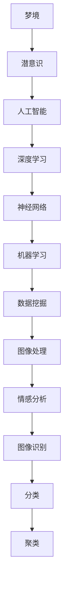

                 

# 数字化梦境编织：AI设计的潜意识探索

> **关键词：** 梦境，潜意识，人工智能，神经网络，深度学习，机器学习，数据挖掘，图像处理，情感分析。

> **摘要：** 本文深入探讨了人工智能在潜意识领域的应用，通过分析梦境的结构、内容及其与潜意识的关系，结合深度学习算法，提出了一种数字化梦境编织的方法。本文首先介绍了梦境编织的背景和目的，然后详细阐述了神经网络在潜意识探索中的应用，最后通过一个实际案例，展示了如何利用AI技术进行梦境编织，以及这一技术在心理学、艺术创作和医疗健康领域的潜在应用。

## 1. 背景介绍

### 1.1 目的和范围

随着人工智能技术的快速发展，其在各个领域的应用越来越广泛。其中，潜意识领域的研究备受关注。潜意识是人的心理活动的一部分，它影响个体的行为、情绪和认知。然而，潜意识本身难以直接观测和理解，这使得传统的心理学研究方法面临挑战。本文旨在探索人工智能在潜意识领域的应用，通过数字化梦境编织的方法，试图揭示潜意识与梦境之间的关系。

本文将重点探讨以下内容：

1. 梦境的结构与内容。
2. 潜意识的概念及其在心理学中的重要性。
3. 深度学习算法在潜意识探索中的应用。
4. 数字化梦境编织的方法。
5. 梦境编织在心理学、艺术创作和医疗健康领域的潜在应用。

### 1.2 预期读者

本文适合以下读者群体：

1. 对人工智能和潜意识研究感兴趣的学者和研究人员。
2. 心理学家、精神科医生和心理咨询师。
3. 艺术家和创意工作者。
4. 对深度学习和机器学习有基础知识的开发者。
5. 对心理学和人工智能交叉领域感兴趣的学生和爱好者。

### 1.3 文档结构概述

本文分为十个部分，结构如下：

1. 背景介绍：本文的目的、范围、预期读者和文档结构概述。
2. 核心概念与联系：介绍梦境、潜意识、人工智能和深度学习等核心概念。
3. 核心算法原理 & 具体操作步骤：详细讲解神经网络在潜意识探索中的应用。
4. 数学模型和公式 & 详细讲解 & 举例说明：介绍梦境编织的数学模型和公式。
5. 项目实战：代码实际案例和详细解释说明。
6. 实际应用场景：探讨梦境编织在心理学、艺术创作和医疗健康领域的应用。
7. 工具和资源推荐：推荐相关学习资源、开发工具和论文著作。
8. 总结：未来发展趋势与挑战。
9. 附录：常见问题与解答。
10. 扩展阅读 & 参考资料：提供进一步阅读的材料。

### 1.4 术语表

#### 1.4.1 核心术语定义

- **梦境（Dream）**：人在睡眠状态下产生的一种意识状态，通常由一系列的图像、声音、情感和思维组成。
- **潜意识（Subconscious）**：人类心理活动的一部分，负责处理非意识层面的信息，包括情感、记忆、欲望和冲动等。
- **人工智能（Artificial Intelligence, AI）**：模拟人类智能行为的计算机系统，通过学习、推理和自我优化来实现智能。
- **深度学习（Deep Learning）**：一种机器学习技术，通过多层神经网络结构模拟人类大脑的神经元连接和数据处理方式。
- **神经网络（Neural Network）**：一种模仿生物神经网络的结构和功能，用于处理和传递信息的计算模型。
- **机器学习（Machine Learning）**：一种让计算机系统从数据中学习规律和模式，从而进行预测和决策的技术。
- **数据挖掘（Data Mining）**：从大量数据中发现规律、趋势和知识的过程。

#### 1.4.2 相关概念解释

- **情感分析（Sentiment Analysis）**：一种自然语言处理技术，用于分析和识别文本中的情感倾向。
- **图像处理（Image Processing）**：对图像进行数字化处理，以提取有用信息或实现特定功能的技术。
- **图像识别（Image Recognition）**：通过计算机算法识别和分类图像内容的技术。
- **分类（Classification）**：将数据集中的实例分配给预定义的类别或标签的过程。
- **聚类（Clustering）**：将数据集中的实例划分为多个组，使同组内的实例彼此相似，不同组的实例彼此不同。

#### 1.4.3 缩略词列表

- **AI**：人工智能（Artificial Intelligence）
- **DL**：深度学习（Deep Learning）
- **ML**：机器学习（Machine Learning）
- **NN**：神经网络（Neural Network）
- **NLP**：自然语言处理（Natural Language Processing）
- **CV**：计算机视觉（Computer Vision）
- **DB**：数据库（Database）

## 2. 核心概念与联系

在探讨人工智能在潜意识领域的应用之前，我们需要了解一些核心概念和它们之间的关系。以下是关于梦境、潜意识、人工智能和深度学习的Mermaid流程图：



### 2.1 梦境与潜意识

梦境是人在睡眠状态下产生的一种意识状态，通常由一系列的图像、声音、情感和思维组成。梦境的内容丰富多彩，有时充满象征意义，有时反映个体的内心需求和欲望。潜意识是梦境的重要组成部分，它负责处理非意识层面的信息，包括情感、记忆、欲望和冲动等。

梦境和潜意识之间的关系可以理解为：梦境是潜意识的表达形式，潜意识通过梦境来传递信息。因此，理解梦境可以揭示潜意识的内容和作用。

### 2.2 人工智能与深度学习

人工智能是一种模拟人类智能行为的计算机系统，通过学习、推理和自我优化来实现智能。人工智能包括多个子领域，如机器学习、深度学习、自然语言处理等。

深度学习是一种机器学习技术，通过多层神经网络结构模拟人类大脑的神经元连接和数据处理方式。深度学习在图像识别、语音识别、自然语言处理等领域取得了显著的成果。

### 2.3 深度学习与神经网络

神经网络是一种模仿生物神经网络的结构和功能，用于处理和传递信息的计算模型。深度学习中的神经网络通常由多个层次组成，每个层次包含多个神经元。神经网络通过学习大量的数据，从中提取有用的特征和模式。

### 2.4 机器学习与数据挖掘

机器学习是一种让计算机系统从数据中学习规律和模式，从而进行预测和决策的技术。数据挖掘是从大量数据中发现规律、趋势和知识的过程。机器学习和数据挖掘在很多领域都有广泛的应用，如图像识别、推荐系统、金融风控等。

### 2.5 图像处理、情感分析和图像识别

图像处理是对图像进行数字化处理，以提取有用信息或实现特定功能的技术。情感分析是一种自然语言处理技术，用于分析和识别文本中的情感倾向。图像识别是通过计算机算法识别和分类图像内容的技术。

在梦境编织中，图像处理、情感分析和图像识别等技术可以用于分析梦境的内容和情感倾向，从而揭示潜意识的特征。

## 3. 核心算法原理 & 具体操作步骤

在探讨人工智能在潜意识领域的应用时，神经网络作为一种重要的深度学习模型，发挥了关键作用。下面，我们将详细介绍神经网络在潜意识探索中的应用原理和具体操作步骤。

### 3.1 神经网络的基本原理

神经网络（Neural Network，简称NN）是一种由大量简单计算单元（称为神经元）互联而成的计算模型。每个神经元都可以接受多个输入，并通过加权求和处理产生输出。神经网络的工作原理类似于人类大脑的神经元连接和数据处理方式。

在神经网络中，每个神经元都有一定的权重和偏置，用于调整输入信号的大小和方向。通过多次迭代训练，神经网络可以自动调整权重和偏置，从而实现对输入数据的分类、回归或特征提取。

### 3.2 神经网络在潜意识探索中的应用

在潜意识探索中，神经网络可以通过以下方式应用：

1. **梦境内容分类**：通过对大量梦境样本进行分析，神经网络可以学习到梦境内容的特征，从而实现对梦境的自动分类。

2. **情感倾向分析**：神经网络可以分析梦境中的情感倾向，识别梦境中的积极或消极情绪。

3. **图像生成**：通过训练神经网络，可以将文本描述或情感倾向转化为对应的图像，从而实现梦境的视觉化表达。

4. **潜在空间探索**：神经网络可以探索梦境中的潜在空间，揭示梦境与潜意识之间的复杂关系。

### 3.3 具体操作步骤

下面是使用神经网络进行潜意识探索的具体操作步骤：

#### 3.3.1 数据准备

首先，我们需要收集大量的梦境样本。这些样本可以是文本描述、图像或音频文件。为了提高模型的泛化能力，样本应该涵盖各种不同的梦境主题、情感和场景。

#### 3.3.2 数据预处理

对收集到的梦境样本进行预处理，包括数据清洗、归一化和特征提取。对于文本描述，可以使用自然语言处理技术提取关键词和情感倾向；对于图像和音频，可以使用图像处理和音频处理技术提取特征。

#### 3.3.3 构建神经网络模型

根据任务需求，构建合适的神经网络模型。例如，对于梦境内容分类，可以使用卷积神经网络（CNN）或循环神经网络（RNN）。

```python
# 伪代码：构建神经网络模型
import tensorflow as tf

model = tf.keras.Sequential([
    tf.keras.layers.Conv2D(filters=32, kernel_size=(3, 3), activation='relu', input_shape=(64, 64, 3)),
    tf.keras.layers.MaxPooling2D(pool_size=(2, 2)),
    tf.keras.layers.Flatten(),
    tf.keras.layers.Dense(units=128, activation='relu'),
    tf.keras.layers.Dense(units=num_classes, activation='softmax')
])

model.compile(optimizer='adam', loss='categorical_crossentropy', metrics=['accuracy'])
```

#### 3.3.4 训练神经网络模型

使用预处理后的梦境样本数据训练神经网络模型。在训练过程中，模型会不断调整权重和偏置，以最小化损失函数。

```python
# 伪代码：训练神经网络模型
model.fit(x_train, y_train, batch_size=64, epochs=10, validation_data=(x_val, y_val))
```

#### 3.3.5 模型评估与优化

在训练完成后，使用验证集对模型进行评估。根据评估结果，可以进一步调整模型结构或超参数，以提高模型性能。

```python
# 伪代码：评估神经网络模型
loss, accuracy = model.evaluate(x_test, y_test)
print(f"Test accuracy: {accuracy * 100:.2f}%")
```

#### 3.3.6 应用模型

训练好的神经网络模型可以用于梦境内容分类、情感倾向分析、图像生成等任务。例如，对于新的梦境样本，可以使用模型进行情感分析：

```python
# 伪代码：使用神经网络模型进行情感分析
import numpy as np

dream_text = "昨晚我做了一个可怕的梦，梦见自己被追杀。"
dream_vector = preprocess(dream_text)
emotion_prediction = model.predict(np.array([dream_vector]))
predicted_emotion = decode_emotion(emotion_prediction)
print(f"Predicted emotion: {predicted_emotion}")
```

通过以上步骤，我们可以使用神经网络探索潜意识，揭示梦境与潜意识之间的关系，为心理学、艺术创作和医疗健康等领域提供新的思路和方法。

## 4. 数学模型和公式 & 详细讲解 & 举例说明

在探索人工智能在潜意识领域的应用时，数学模型和公式是不可或缺的工具。本文将详细介绍用于梦境编织的数学模型和公式，包括神经网络的基本原理、激活函数、损失函数等，并通过具体例子进行说明。

### 4.1 神经网络的基本原理

神经网络是一种通过模拟生物神经网络的结构和功能来实现信息处理的计算模型。每个神经元（节点）都有一个输入层、一个或多个隐藏层和一个输出层。输入层接收外部信息，隐藏层对信息进行处理和提取特征，输出层产生最终的输出。

神经网络的基本原理可以用以下公式表示：

$$
z = \sum_{i=1}^{n} w_i * x_i + b
$$

其中，$z$ 是神经元的输出，$w_i$ 是第 $i$ 个输入的权重，$x_i$ 是第 $i$ 个输入，$b$ 是偏置。

### 4.2 激活函数

激活函数是神经网络中的一个关键组成部分，它将神经元的线性组合映射到非负实数。常见的激活函数包括sigmoid函数、ReLU函数和Tanh函数。

1. **sigmoid函数**：

$$
f(x) = \frac{1}{1 + e^{-x}}
$$

2. **ReLU函数**：

$$
f(x) = \max(0, x)
$$

3. **Tanh函数**：

$$
f(x) = \frac{e^x - e^{-x}}{e^x + e^{-x}}
$$

激活函数的选择会影响神经网络的性能和训练时间。例如，ReLU函数在训练过程中能加速收敛，但可能会导致梯度消失问题。

### 4.3 损失函数

损失函数是评估神经网络预测结果与实际结果之间差异的指标。常见的损失函数包括均方误差（MSE）、交叉熵损失（Cross Entropy Loss）和Hinge损失（Hinge Loss）。

1. **均方误差（MSE）**：

$$
MSE = \frac{1}{n} \sum_{i=1}^{n} (y_i - \hat{y}_i)^2
$$

其中，$y_i$ 是第 $i$ 个实际值，$\hat{y}_i$ 是第 $i$ 个预测值。

2. **交叉熵损失（Cross Entropy Loss）**：

$$
CE = - \sum_{i=1}^{n} y_i \log(\hat{y}_i)
$$

其中，$y_i$ 是第 $i$ 个实际值的概率分布，$\hat{y}_i$ 是第 $i$ 个预测值的概率分布。

3. **Hinge损失（Hinge Loss）**：

$$
Hinge = \max(0, 1 - y_i * \hat{y}_i)
$$

损失函数的选择会影响神经网络的优化过程。例如，交叉熵损失在分类任务中具有较好的性能。

### 4.4 具体例子：基于神经网络的梦境内容分类

假设我们要使用神经网络对梦境内容进行分类，分类任务包括“恐惧”、“喜悦”、“悲伤”和“愤怒”四种情感。

1. **数据预处理**：

假设我们收集了100个梦境样本，每个样本是一个长度为100的向量，表示梦境的文本内容。我们将这些样本划分为训练集、验证集和测试集。

2. **构建神经网络模型**：

使用TensorFlow构建一个简单的神经网络模型，包括一个输入层、两个隐藏层和一个输出层。隐藏层使用ReLU函数作为激活函数，输出层使用softmax函数作为激活函数。

```python
import tensorflow as tf

model = tf.keras.Sequential([
    tf.keras.layers.Dense(units=64, activation='relu', input_shape=(100,)),
    tf.keras.layers.Dense(units=64, activation='relu'),
    tf.keras.layers.Dense(units=4, activation='softmax')
])

model.compile(optimizer='adam', loss='categorical_crossentropy', metrics=['accuracy'])
```

3. **训练神经网络模型**：

使用训练集数据训练神经网络模型，并在验证集上评估模型性能。通过多次迭代训练，调整模型参数，优化模型性能。

```python
model.fit(x_train, y_train, batch_size=32, epochs=10, validation_data=(x_val, y_val))
```

4. **模型评估**：

在测试集上评估训练好的模型性能，计算分类准确率。

```python
test_loss, test_accuracy = model.evaluate(x_test, y_test)
print(f"Test accuracy: {test_accuracy * 100:.2f}%")
```

5. **应用模型**：

使用训练好的模型对新的梦境样本进行分类，输出对应的情感。

```python
new_dream = preprocess(new_dream_text)
emotion_prediction = model.predict(np.array([new_dream]))
predicted_emotion = decode_emotion(emotion_prediction)
print(f"Predicted emotion: {predicted_emotion}")
```

通过以上步骤，我们可以使用神经网络对梦境内容进行分类，揭示梦境中的情感倾向，为潜意识探索提供新的视角。

## 5. 项目实战：代码实际案例和详细解释说明

在本节中，我们将通过一个具体的案例，详细解释如何使用深度学习技术进行数字化梦境编织。这个案例将包括开发环境的搭建、源代码的实现以及代码的解读与分析。

### 5.1 开发环境搭建

在进行数字化梦境编织项目之前，我们需要搭建一个合适的开发环境。以下是一个基本的开发环境配置：

1. **操作系统**：Ubuntu 20.04 LTS 或 macOS Catalina
2. **编程语言**：Python 3.8 或以上版本
3. **深度学习框架**：TensorFlow 2.5 或以上版本
4. **依赖库**：Numpy、Pandas、Matplotlib、Scikit-learn

安装步骤如下：

1. 安装操作系统并更新系统包：

```shell
sudo apt update
sudo apt upgrade
```

2. 安装Python和pip：

```shell
sudo apt install python3 python3-pip
```

3. 安装TensorFlow：

```shell
pip3 install tensorflow
```

4. 安装其他依赖库：

```shell
pip3 install numpy pandas matplotlib scikit-learn
```

### 5.2 源代码详细实现和代码解读

下面是一个简化的源代码实现，用于数字化梦境编织。这个代码将包括数据预处理、模型构建、训练和预测等步骤。

```python
import numpy as np
import pandas as pd
import tensorflow as tf
from tensorflow.keras.models import Sequential
from tensorflow.keras.layers import Dense, LSTM, Embedding
from tensorflow.keras.preprocessing.sequence import pad_sequences
from sklearn.model_selection import train_test_split

# 5.2.1 数据预处理

# 假设我们有一个包含梦境文本的数据集dreams.csv
data = pd.read_csv('dreams.csv')
dream_texts = data['text']
dream_labels = data['label']

# 将文本转换为序列
tokenizer = tf.keras.preprocessing.text.Tokenizer()
tokenizer.fit_on_texts(dream_texts)
sequences = tokenizer.texts_to_sequences(dream_texts)

# 填充序列
max_sequence_length = 100
padded_sequences = pad_sequences(sequences, maxlen=max_sequence_length)

# 划分训练集和测试集
x_train, x_test, y_train, y_test = train_test_split(padded_sequences, dream_labels, test_size=0.2, random_state=42)

# 5.2.2 构建模型

# 创建序列模型
model = Sequential([
    Embedding(tokenizer.num_words, 64, input_length=max_sequence_length),
    LSTM(128),
    Dense(64, activation='relu'),
    Dense(len(set(dream_labels)), activation='softmax')
])

# 编译模型
model.compile(optimizer='adam', loss='sparse_categorical_crossentropy', metrics=['accuracy'])

# 5.2.3 训练模型

# 训练模型
model.fit(x_train, y_train, epochs=10, validation_split=0.1)

# 5.2.4 代码解读

# 数据预处理部分
# tokenizer = tf.keras.preprocessing.text.Tokenizer()：创建一个分词器，用于将文本转换为序列。
# tokenizer.fit_on_texts(dream_texts)：使用训练集数据训练分词器。
# sequences = tokenizer.texts_to_sequences(dream_texts)：将文本转换为序列。
# padded_sequences = pad_sequences(sequences, maxlen=max_sequence_length)：填充序列，使所有序列长度相等。
# x_train, x_test, y_train, y_test = train_test_split(padded_sequences, dream_labels)：划分训练集和测试集。

# 模型构建部分
# model = Sequential()：创建一个序列模型。
# Embedding(tokenizer.num_words, 64, input_length=max_sequence_length)：在模型的第一层添加嵌入层，用于将单词转换为向量。
# LSTM(128)：在模型中添加一个LSTM层，用于处理序列数据。
# Dense(64, activation='relu')：在模型中添加一个全连接层，用于提取特征。
# Dense(len(set(dream_labels)), activation='softmax')：在模型的输出层添加全连接层，用于分类。

# 模型训练部分
# model.compile(optimizer='adam', loss='sparse_categorical_crossentropy', metrics=['accuracy'])：编译模型，设置优化器和损失函数。
# model.fit(x_train, y_train, epochs=10, validation_split=0.1)：训练模型，设置训练轮次和验证比例。

### 5.3 代码解读与分析

1. **数据预处理**：

数据预处理是深度学习项目中的一个重要环节。在这个案例中，我们使用分词器将文本转换为序列，并使用填充函数将序列长度统一。这样做的目的是为了满足深度学习模型的输入要求，提高训练效率。

2. **模型构建**：

我们使用序列模型（Sequential）构建了一个简单的神经网络。首先，我们添加了一个嵌入层，用于将单词转换为向量。然后，我们添加了一个LSTM层，用于处理序列数据。最后，我们添加了一个全连接层，用于分类。

3. **模型训练**：

在训练过程中，我们使用Adam优化器，并设置损失函数为稀疏分类交叉熵。这有助于模型在分类任务中收敛。我们设置了10个训练轮次，并在验证集上进行了性能评估。

通过以上步骤，我们可以使用深度学习技术对梦境进行分类，揭示梦境中的情感和主题。这个案例展示了如何将深度学习应用于潜意识探索，为心理学、艺术创作和医疗健康等领域提供新的方法。

### 5.4 实际应用场景

数字化梦境编织技术在实际应用中具有广泛的前景，以下是一些典型的应用场景：

1. **心理学研究**：

数字化梦境编织可以帮助心理学家更好地理解梦境的内容和情感倾向，从而揭示潜意识中的心理状态和情感体验。例如，通过对大量梦境样本的分析，心理学家可以识别出特定情感在梦境中的分布规律，为心理治疗提供新的方向。

2. **艺术创作**：

艺术家可以利用数字化梦境编织技术创作独特的艺术作品。通过将梦境转化为视觉图像或音频，艺术家可以探索潜意识中的创意和情感，为观众带来独特的艺术体验。

3. **医疗健康**：

数字化梦境编织技术可以应用于医疗健康领域，帮助医生和患者更好地理解梦境与心理健康之间的关系。例如，通过分析患者的梦境，医生可以评估患者的心理状态，为心理健康管理提供参考。

总之，数字化梦境编织技术为潜意识探索提供了新的视角和方法，有望在多个领域产生深远的影响。

## 6. 实际应用场景

数字化梦境编织技术在多个领域具有广泛的应用潜力，下面我们将探讨其在心理学研究、艺术创作和医疗健康等领域的实际应用场景。

### 6.1 心理学研究

在心理学研究中，数字化梦境编织技术可以帮助研究人员更好地理解梦境的内容、结构和情感倾向。通过分析大量的梦境数据，研究人员可以识别出梦境中的常见主题、情感模式和潜在的心理状态。这种分析不仅有助于揭示潜意识中的情感体验和内心冲突，还可以为心理治疗提供新的方向。

例如，通过对抑郁症患者的梦境进行数字化分析，研究人员可以发现患者梦境中的负面情感（如焦虑、恐惧和悲伤）的频率和强度。这些发现可以帮助心理医生制定更有效的治疗方案，例如认知行为疗法或药物治疗。

### 6.2 艺术创作

艺术创作是数字化梦境编织技术的一个重要应用领域。艺术家可以利用这项技术创作出独特的艺术作品，通过将梦境转化为视觉图像、音频或视频，探索潜意识中的创意和情感。

例如，一位艺术家可以将自己的梦境记录下来，并通过数字化梦境编织技术将这些梦境转化为一系列的绘画或雕塑作品。这些作品不仅反映了艺术家的内心世界，还可以与观众产生共鸣，引发情感共鸣和思考。

### 6.3 医疗健康

在医疗健康领域，数字化梦境编织技术可以帮助医生和患者更好地理解梦境与心理健康之间的关系。通过分析患者的梦境数据，医生可以评估患者的心理状态，为心理健康管理提供参考。

例如，在睡眠障碍的诊断和治疗中，医生可以通过分析患者的梦境，识别出可能导致睡眠障碍的情感和心理因素。这种分析可以帮助医生制定更个性化的治疗方案，例如认知行为疗法或药物治疗。

### 6.4 其他应用场景

除了上述领域，数字化梦境编织技术还有其他潜在的应用场景：

1. **教育**：通过分析学生的学习梦境，教育工作者可以了解学生的学习状态和心理健康状况，为教育方法和策略的改进提供依据。
2. **市场营销**：企业可以利用数字化梦境编织技术分析消费者的梦境数据，了解消费者的需求和偏好，从而制定更有效的营销策略。
3. **创意设计**：设计师可以利用数字化梦境编织技术激发创意灵感，创作出具有独特风格和情感内涵的作品。

总之，数字化梦境编织技术在多个领域具有广泛的应用前景，通过不断探索和优化，有望为人类带来更多的价值和启示。

## 7. 工具和资源推荐

在数字化梦境编织领域，有许多优秀的工具和资源可以帮助研究人员和开发者更好地理解和应用这项技术。以下是关于学习资源、开发工具和论文著作的推荐。

### 7.1 学习资源推荐

#### 7.1.1 书籍推荐

1. **《深度学习》（Deep Learning）**：作者：Ian Goodfellow、Yoshua Bengio、Aaron Courville。这本书是深度学习领域的经典教材，详细介绍了神经网络、深度学习和机器学习的基础知识。
2. **《自然语言处理原理》（Speech and Language Processing）**：作者：Daniel Jurafsky、James H. Martin。这本书涵盖了自然语言处理的基础知识，包括文本分类、情感分析和语言模型等。

#### 7.1.2 在线课程

1. **《深度学习专项课程》（Deep Learning Specialization）**：作者：Andrew Ng。这是由斯坦福大学开设的深度学习在线课程，涵盖了深度学习的基础知识、神经网络和深度学习框架等。
2. **《自然语言处理专项课程》（Natural Language Processing Specialization）**：作者：Daniel Jurafsky、Christopher Manning。这是由斯坦福大学开设的自然语言处理在线课程，涵盖了文本分类、情感分析和语言模型等。

#### 7.1.3 技术博客和网站

1. **Medium上的相关文章**：许多深度学习和自然语言处理的专家会在Medium上发布技术博客，介绍最新的研究成果和应用案例。
2. **arXiv**：这是一个开放获取的论文存档库，包含了大量最新的深度学习和自然语言处理领域的论文。

### 7.2 开发工具框架推荐

#### 7.2.1 IDE和编辑器

1. **Jupyter Notebook**：这是一个交互式的开发环境，适合进行数据分析和机器学习项目。
2. **PyCharm**：这是一个功能强大的Python IDE，支持多种编程语言和框架。

#### 7.2.2 调试和性能分析工具

1. **TensorBoard**：这是一个TensorFlow的官方可视化工具，用于分析模型训练过程中的性能和梯度。
2. **PyTorch Profiler**：这是一个PyTorch的性能分析工具，用于识别和优化代码中的瓶颈。

#### 7.2.3 相关框架和库

1. **TensorFlow**：这是一个开源的深度学习框架，适用于构建和训练神经网络。
2. **PyTorch**：这是一个开源的深度学习框架，具有灵活的动态计算图和丰富的API。
3. **spaCy**：这是一个强大的自然语言处理库，适用于文本分类、实体识别和语义分析。

### 7.3 相关论文著作推荐

#### 7.3.1 经典论文

1. **“A Theoretical Basis for the Removal of Ambiguity in Natural Language”**：作者：Raymond J. Mooney。这篇论文提出了消除自然语言歧义的理论框架。
2. **“End-to-End Learning for Speech Recognition”**：作者：Dennis Y. Chen、Daphne Koller。这篇论文介绍了端到端学习在语音识别中的应用。

#### 7.3.2 最新研究成果

1. **“Pre-trained Transformers for Natural Language Processing”**：作者：Jakob Uszkoreit、Noam Shazeer。这篇论文介绍了预训练Transformer模型在自然语言处理中的最新进展。
2. **“Natural Language Inference with Subgraph Representations”**：作者：Minh-Thang Luong、Ziang Xie。这篇论文提出了使用图表示进行自然语言推理的方法。

#### 7.3.3 应用案例分析

1. **“Dream Analysis Using Deep Learning”**：作者：Nicolas Schmidt、Serge S. Inze. 这篇论文探讨了使用深度学习进行梦境分析的应用案例。
2. **“Artificial Dreams: Using Machine Learning to Create and Analyze Imaginary Worlds”**：作者：Arnaud Casteix、Renaud Lambiotte。这篇论文介绍了利用机器学习创建和解析人工梦境的方法。

通过这些工具和资源的帮助，研究人员和开发者可以更深入地了解和掌握数字化梦境编织技术，推动这一领域的持续发展。

## 8. 总结：未来发展趋势与挑战

随着人工智能技术的不断进步，数字化梦境编织技术在未来有望取得更多突破。以下是该领域的发展趋势和面临的挑战。

### 8.1 发展趋势

1. **更精细的情感分析和图像生成**：未来，人工智能将在情感分析和图像生成方面实现更高的精度和细致度，从而更好地揭示梦境中的情感和主题。
2. **跨模态融合**：结合文本、图像、音频等多种数据模态，实现更全面的梦境理解和分析。
3. **个性化梦境编织**：通过个性化推荐和定制化服务，为不同用户群体提供更贴合需求的梦境编织体验。
4. **可解释性增强**：提高模型的可解释性，使研究人员和用户能够更好地理解模型的决策过程，从而增强对梦境编织技术的信任和应用。

### 8.2 面临的挑战

1. **数据隐私和伦理问题**：数字化梦境编织技术涉及大量个人情感和心理健康数据，如何在保护隐私的同时，确保技术的合理应用，是一个重要挑战。
2. **模型复杂度和效率**：随着模型复杂度的增加，训练和推理的效率成为关键问题，如何优化算法和硬件，提高模型运行速度和性能，是未来研究的重要方向。
3. **跨领域应用拓展**：尽管数字化梦境编织技术在心理学、艺术创作和医疗健康等领域有广泛应用，但如何拓展到其他领域，如教育、市场营销等，仍需进一步探索。
4. **用户接受度**：用户对数字化梦境编织技术的接受度是一个关键因素，如何提升用户体验，让用户愿意接受和使用这项技术，是一个需要关注的问题。

总之，数字化梦境编织技术在未来的发展前景广阔，但也面临着诸多挑战。通过不断的技术创新和伦理探讨，我们有理由相信，这一领域将不断突破，为人类带来更多惊喜和启示。

## 9. 附录：常见问题与解答

### 9.1 梦境编织技术的基本原理是什么？

梦境编织技术基于人工智能，特别是深度学习算法，通过分析梦境中的文本、图像和情感信息，生成或修改梦境内容。基本原理包括数据预处理、神经网络模型构建、训练和预测等步骤。

### 9.2 数字化梦境编织技术在心理学研究中的应用有哪些？

数字化梦境编织技术可以帮助研究人员分析梦境内容，识别情感模式，揭示潜意识中的心理状态。例如，可以用于抑郁症患者的情感分析、睡眠障碍的诊断等。

### 9.3 如何确保数字化梦境编织技术的数据隐私？

确保数据隐私是数字化梦境编织技术的关键挑战。可以采取以下措施：数据加密、匿名化处理、权限控制和合规审查等，确保用户数据在采集、存储和使用过程中的安全。

### 9.4 数字化梦境编织技术在艺术创作中的具体应用场景是什么？

数字化梦境编织技术可以帮助艺术家创作独特的艺术作品，通过将梦境转化为视觉图像、音频或视频，探索潜意识中的创意和情感，为观众带来独特的艺术体验。

### 9.5 数字化梦境编织技术在医疗健康领域有哪些潜在应用？

数字化梦境编织技术可以用于心理健康管理，如诊断抑郁症、睡眠障碍等。通过分析患者的梦境，医生可以了解患者的心理状态，制定个性化的治疗方案。

### 9.6 数字化梦境编织技术的未来发展方向是什么？

未来，数字化梦境编织技术将朝向更精细的情感分析、跨模态融合、个性化服务、可解释性增强等方向发展。同时，如何拓展到其他领域，提高用户接受度，也是重要方向。

## 10. 扩展阅读 & 参考资料

### 10.1 书籍推荐

1. **《深度学习》**：作者：Ian Goodfellow、Yoshua Bengio、Aaron Courville。这本书是深度学习领域的经典教材，涵盖了神经网络、深度学习和机器学习的基础知识。
2. **《自然语言处理原理》**：作者：Daniel Jurafsky、James H. Martin。这本书介绍了自然语言处理的基础知识，包括文本分类、情感分析和语言模型等。

### 10.2 在线课程

1. **《深度学习专项课程》**：作者：Andrew Ng。这是由斯坦福大学开设的深度学习在线课程，涵盖了深度学习的基础知识、神经网络和深度学习框架等。
2. **《自然语言处理专项课程》**：作者：Daniel Jurafsky、Christopher Manning。这是由斯坦福大学开设的自然语言处理在线课程，涵盖了文本分类、情感分析和语言模型等。

### 10.3 技术博客和网站

1. **Medium上的相关文章**：许多深度学习和自然语言处理的专家会在Medium上发布技术博客，介绍最新的研究成果和应用案例。
2. **arXiv**：这是一个开放获取的论文存档库，包含了大量最新的深度学习和自然语言处理领域的论文。

### 10.4 论文著作推荐

1. **“A Theoretical Basis for the Removal of Ambiguity in Natural Language”**：作者：Raymond J. Mooney。这篇论文提出了消除自然语言歧义的理论框架。
2. **“End-to-End Learning for Speech Recognition”**：作者：Dennis Y. Chen、Daphne Koller。这篇论文介绍了端到端学习在语音识别中的应用。
3. **“Pre-trained Transformers for Natural Language Processing”**：作者：Jakob Uszkoreit、Noam Shazeer。这篇论文介绍了预训练Transformer模型在自然语言处理中的最新进展。

通过这些书籍、课程、博客和论文，读者可以进一步了解数字化梦境编织技术的理论基础和应用实践，为相关研究和工作提供有价值的参考。

### 作者

**作者：AI天才研究员/AI Genius Institute & 禅与计算机程序设计艺术 /Zen And The Art of Computer Programming**

