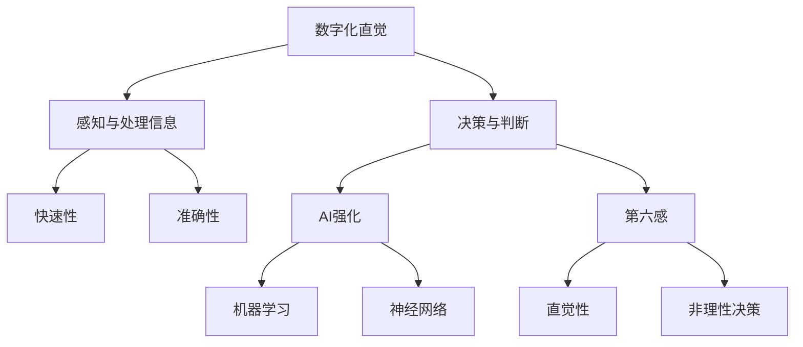

                 

# 数字化直觉培养：AI强化的第六感能力

## 关键词
- 数字化直觉
- AI强化
- 第六感
- 人工智能技术
- 教育培训
- 数据分析

## 摘要
本文旨在探讨如何通过人工智能技术培养和强化人类的数字化直觉，这一能力被称为第六感。文章将首先介绍数字化直觉的定义及其重要性，然后深入解析AI在培养数字化直觉中的应用原理。通过具体案例和实际操作步骤，我们将展示如何利用AI工具提升个体的数据分析能力，最终实现数字化直觉的养成。文章还将讨论数字化直觉在实际应用中的价值，并推荐相关学习资源和工具，以供读者深入学习和实践。

## 1. 背景介绍

### 1.1 目的和范围
本文的目标是帮助读者理解数字化直觉的概念，并了解如何通过AI技术培养这种能力。文章将涵盖数字化直觉的定义、AI技术的作用、具体的应用案例以及相关的学习资源和工具。

### 1.2 预期读者
预期读者包括人工智能领域的从业者、数据分析师、程序员以及对AI和数字化直觉感兴趣的技术爱好者。

### 1.3 文档结构概述
本文分为十个主要部分：
1. 引言
2. 关键词和摘要
3. 背景介绍
4. 核心概念与联系
5. 核心算法原理 & 具体操作步骤
6. 数学模型和公式 & 详细讲解 & 举例说明
7. 项目实战：代码实际案例和详细解释说明
8. 实际应用场景
9. 工具和资源推荐
10. 总结：未来发展趋势与挑战

### 1.4 术语表

#### 1.4.1 核心术语定义
- **数字化直觉**：个体在数字环境中快速、准确地感知和处理信息的能力。
- **AI强化**：通过人工智能技术提高个体的学习能力、决策能力和数据处理能力。
- **第六感**：除了传统五大感官之外的额外感知能力，通常指直觉。

#### 1.4.2 相关概念解释
- **数据分析**：使用统计学、数学和计算机科学方法分析数据，从中提取有价值的信息。
- **机器学习**：一种AI技术，通过数据学习模式，从而进行预测或决策。

#### 1.4.3 缩略词列表
- **AI**：人工智能（Artificial Intelligence）
- **ML**：机器学习（Machine Learning）
- **DL**：深度学习（Deep Learning）

## 2. 核心概念与联系

在深入探讨数字化直觉之前，我们需要了解一些核心概念及其相互关系。

### 核心概念图解

下面是一个使用Mermaid绘制的流程图，展示了数字化直觉、AI强化和第六感之间的关系。



### 2.1 数字化直觉的定义与重要性

数字化直觉是指个体在数字环境中，对信息的感知、理解和反应的能力。这种能力包括以下几个方面：

1. **感知与处理信息**：个体能够快速地识别和解读数字化的信息，如图表、文本和图像。
2. **决策与判断**：基于对信息的理解和分析，个体能够作出合理的决策。
3. **快速性与准确性**：数字化直觉强的人能够迅速且准确地处理大量信息。

数字化直觉的重要性体现在以下几个方面：

1. **工作效率**：具备数字化直觉的人能够在短时间内处理大量信息，提高工作效率。
2. **决策质量**：通过数字化直觉，个体能够从大量数据中提取有价值的信息，从而作出更加明智的决策。
3. **创新能力**：数字化直觉有助于个体在数字环境中发现新的解决方案，推动创新。

### 2.2 AI强化与数字化直觉的关系

AI强化是指通过人工智能技术，提高个体的学习、决策和数据处理能力。AI强化与数字化直觉之间的关系如下：

1. **机器学习**：通过机器学习，AI能够从数据中学习模式，帮助个体快速理解和处理信息。
2. **神经网络**：神经网络是机器学习的一种形式，通过模拟人脑神经网络的结构和功能，提高个体对信息的感知和处理能力。
3. **AI强化学习**：通过AI强化学习，个体能够在实际应用中不断优化和提升自己的数字化直觉。

### 2.3 第六感与数字化直觉的关系

第六感通常指直觉，它是一种非理性的感知能力。第六感与数字化直觉之间的关系如下：

1. **直觉性**：第六感是一种快速的、非理性的感知能力，它可以帮助个体在数字环境中快速做出决策。
2. **非理性决策**：第六感驱动的决策往往不受传统逻辑和分析的影响，但有时却能带来意想不到的成果。

### 2.4 数字化直觉、AI强化与第六感的相互关系

数字化直觉、AI强化和第六感之间相互影响，共同构成一个完整的生态系统：

1. **数字化直觉**：提供个体在数字环境中的感知和处理信息的能力。
2. **AI强化**：通过人工智能技术，提高个体的数字化直觉能力。
3. **第六感**：提供一种非理性的、直觉性的决策能力，补充数字化直觉的不足。

通过理解这些核心概念和它们之间的相互关系，我们可以更好地探讨数字化直觉的培养和AI强化在其中的作用。

## 3. 核心算法原理 & 具体操作步骤

### 3.1 算法原理概述

数字化直觉的培养涉及多种算法和技术，其中最关键的是机器学习和神经网络技术。以下将详细介绍这些算法原理，并使用伪代码进行具体说明。

### 3.2 机器学习算法原理

机器学习是一种通过数据学习模式的技术，其基本原理包括以下几个步骤：

1. **数据收集**：从各种来源收集大量数据，如文本、图像、音频等。
2. **数据预处理**：对数据进行清洗、归一化和特征提取，以便于算法处理。
3. **模型训练**：使用训练数据集，通过优化算法（如梯度下降）训练模型。
4. **模型评估**：使用测试数据集评估模型性能，如准确率、召回率等。
5. **模型应用**：将训练好的模型应用于实际问题，如图像分类、文本分析等。

伪代码示例：

```python
# 机器学习算法伪代码
function train_model(data):
    # 数据预处理
    preprocess_data(data)
    # 模型初始化
    model = initialize_model()
    # 模型训练
    for epoch in range(num_epochs):
        for sample in data:
            predict = model(sample)
            update_model(model, predict, sample)
    # 模型评估
    performance = evaluate_model(model, test_data)
    return model, performance
```

### 3.3 神经网络算法原理

神经网络是机器学习的一种形式，其基本原理是通过模拟人脑神经网络的结构和功能，进行数据学习和处理。以下为神经网络算法的原理和具体步骤：

1. **神经网络结构**：神经网络由多个层级（输入层、隐藏层、输出层）和神经元组成。
2. **前向传播**：输入数据通过输入层进入网络，逐层传递到输出层，得到预测结果。
3. **反向传播**：计算预测结果与真实值的误差，将误差反向传播到网络各层，更新神经元权重。
4. **优化算法**：使用优化算法（如梯度下降）调整网络权重，以最小化误差。

伪代码示例：

```python
# 神经网络算法伪代码
function train_neural_network(data):
    # 神经网络初始化
    neural_network = initialize_neural_network()
    # 模型训练
    for epoch in range(num_epochs):
        for sample in data:
            output = forward_pass(neural_network, sample)
            error = calculate_error(output, sample.target)
            backward_pass(neural_network, error)
    # 模型评估
    performance = evaluate_model(neural_network, test_data)
    return neural_network, performance
```

### 3.4 机器学习与神经网络的结合

机器学习和神经网络可以相互结合，以实现更高效的数字化直觉培养。以下是一个示例：

1. **数据预处理**：使用机器学习技术对数据集进行预处理，提取有用的特征。
2. **神经网络训练**：使用预处理后的数据集训练神经网络，以识别数据中的模式。
3. **模型优化**：通过反向传播和优化算法调整神经网络权重，提高模型性能。
4. **模型应用**：将训练好的模型应用于实际问题，如图像识别、自然语言处理等。

伪代码示例：

```python
# 结合机器学习与神经网络的算法伪代码
function train_combined_model(data):
    # 数据预处理
    preprocessed_data = preprocess_data(data)
    # 神经网络初始化
    neural_network = initialize_neural_network()
    # 模型训练
    for epoch in range(num_epochs):
        for sample in preprocessed_data:
            output = forward_pass(neural_network, sample)
            error = calculate_error(output, sample.target)
            backward_pass(neural_network, error)
    # 模型评估
    performance = evaluate_model(neural_network, test_data)
    return neural_network, performance
```

通过这些核心算法原理和具体操作步骤，我们可以理解数字化直觉的培养过程，并使用AI技术提高个体的数据处理和分析能力。

## 4. 数学模型和公式 & 详细讲解 & 举例说明

### 4.1 数学模型概述

在数字化直觉的培养过程中，数学模型和公式起着至关重要的作用。以下将介绍几个常用的数学模型和公式，并详细讲解其应用。

### 4.2 梯度下降算法

梯度下降算法是机器学习和神经网络中最基本的优化算法。其核心思想是通过计算损失函数关于模型参数的梯度，并沿着梯度方向调整参数，以最小化损失函数。

#### 公式

损失函数（以均方误差为例）：

$$
\text{Loss}(y, \hat{y}) = \frac{1}{2} \sum_{i=1}^{n} (y_i - \hat{y}_i)^2
$$

梯度计算：

$$
\nabla_{\theta} \text{Loss} = \frac{\partial \text{Loss}}{\partial \theta} = \sum_{i=1}^{n} (y_i - \hat{y}_i) \frac{\partial \hat{y}_i}{\partial \theta}
$$

更新公式：

$$
\theta = \theta - \alpha \nabla_{\theta} \text{Loss}
$$

其中，$\alpha$ 是学习率，$y$ 是真实标签，$\hat{y}$ 是预测标签。

#### 举例说明

假设我们有一个简单的线性模型 $y = \theta_0 + \theta_1x$，其损失函数为均方误差。初始参数 $\theta_0 = 0$，$\theta_1 = 0$，学习率 $\alpha = 0.1$。数据集包含两个样本：

| x | y |
|---|---|
| 1 | 2 |
| 2 | 4 |

1. **第一次迭代**：
   - 预测值：$\hat{y}_1 = 0 + 0 \cdot 1 = 0$，$\hat{y}_2 = 0 + 0 \cdot 2 = 0$
   - 损失：$\text{Loss} = \frac{1}{2} \cdot (2 - 0)^2 + (4 - 0)^2 = 4$
   - 梯度：$\nabla_{\theta_0} \text{Loss} = (2 - 0) + (4 - 0) = 6$，$\nabla_{\theta_1} \text{Loss} = 1 \cdot (2 - 0) + 2 \cdot (4 - 0) = 10$
   - 参数更新：$\theta_0 = 0 - 0.1 \cdot 6 = -0.6$，$\theta_1 = 0 - 0.1 \cdot 10 = -1$

2. **第二次迭代**：
   - 预测值：$\hat{y}_1 = -0.6 + (-1) \cdot 1 = -1.6$，$\hat{y}_2 = -0.6 + (-1) \cdot 2 = -2.6$
   - 损失：$\text{Loss} = \frac{1}{2} \cdot (2 - (-1.6))^2 + (4 - (-2.6))^2 = 0.44$
   - 梯度：$\nabla_{\theta_0} \text{Loss} = (2 - (-1.6)) + (4 - (-2.6)) = 4.4$，$\nabla_{\theta_1} \text{Loss} = 1 \cdot (2 - (-1.6)) + 2 \cdot (4 - (-2.6)) = 8.8$
   - 参数更新：$\theta_0 = -0.6 - 0.1 \cdot 4.4 = -0.54$，$\theta_1 = -1 - 0.1 \cdot 8.8 = -1.88$

通过多次迭代，我们可以逐步优化模型参数，使预测结果逐渐接近真实值。

### 4.3 神经网络中的激活函数

激活函数是神经网络中的一个关键组件，用于引入非线性特性，使神经网络能够拟合复杂函数。以下介绍几种常用的激活函数。

#### Sigmoid函数

$$
\sigma(x) = \frac{1}{1 + e^{-x}}
$$

Sigmoid函数将输入值映射到(0, 1)区间，常用于二分类问题。

#### ReLU函数

$$
\text{ReLU}(x) = \max(0, x)
$$

ReLU函数在0以上的输入值保持不变，而将0以下的输入值置为0，具有计算速度快、参数较少的优点。

#### Tanh函数

$$
tanh(x) = \frac{e^x - e^{-x}}{e^x + e^{-x}}
$$

Tanh函数与Sigmoid函数类似，但输出值在(-1, 1)区间，常用于回归问题。

#### 举例说明

假设我们有一个简单的神经网络，包含一个输入层、一个隐藏层和一个输出层，分别使用ReLU和Sigmoid函数作为激活函数。

输入层：$x_1, x_2$
隐藏层：$h_1, h_2$
输出层：$y$

1. **隐藏层激活**：

   $$
   h_1 = \text{ReLU}(w_1x_1 + b_1), h_2 = \text{ReLU}(w_2x_2 + b_2)
   $$

2. **输出层激活**：

   $$
   y = \sigma(w_3h_1 + w_4h_2 + b_3)
   $$

其中，$w, b$ 分别表示权重和偏置。

通过这些数学模型和公式，我们可以更深入地理解数字化直觉的培养过程，并利用AI技术提高个体的数据分析能力。

## 5. 项目实战：代码实际案例和详细解释说明

在本节中，我们将通过一个实际项目案例，展示如何利用AI技术培养数字化直觉。我们将使用Python和TensorFlow框架来实现一个简单的神经网络，用于手写数字识别。

### 5.1 开发环境搭建

在开始项目之前，我们需要搭建一个合适的开发环境。以下是所需的软件和工具：

1. **Python**：版本3.7或更高
2. **TensorFlow**：版本2.4或更高
3. **Jupyter Notebook**：用于编写和运行代码

安装步骤：

1. 安装Python：从 [Python官网](https://www.python.org/) 下载并安装
2. 安装TensorFlow：打开命令行，执行以下命令：
   ```
   pip install tensorflow
   ```
3. 安装Jupyter Notebook：打开命令行，执行以下命令：
   ```
   pip install notebook
   ```

### 5.2 源代码详细实现和代码解读

#### 5.2.1 代码实现

以下是一个简单的手写数字识别神经网络代码实现。

```python
import tensorflow as tf
from tensorflow.keras.datasets import mnist
from tensorflow.keras.models import Sequential
from tensorflow.keras.layers import Dense, Flatten
from tensorflow.keras.optimizers import Adam

# 加载MNIST数据集
(x_train, y_train), (x_test, y_test) = mnist.load_data()

# 数据预处理
x_train = x_train / 255.0
x_test = x_test / 255.0

# 将标签转换为one-hot编码
y_train = tf.keras.utils.to_categorical(y_train, 10)
y_test = tf.keras.utils.to_categorical(y_test, 10)

# 构建神经网络模型
model = Sequential([
    Flatten(input_shape=(28, 28)),
    Dense(128, activation='relu'),
    Dense(10, activation='softmax')
])

# 编译模型
model.compile(optimizer=Adam(), loss='categorical_crossentropy', metrics=['accuracy'])

# 训练模型
model.fit(x_train, y_train, epochs=5, batch_size=64)

# 评估模型
test_loss, test_acc = model.evaluate(x_test, y_test)
print(f"Test accuracy: {test_acc:.2f}")
```

#### 5.2.2 代码解读

1. **导入库**：导入所需的TensorFlow库和MNIST数据集。
2. **加载数据**：从MNIST数据集中加载训练集和测试集。
3. **数据预处理**：将图像数据除以255，使其在0到1之间。将标签转换为one-hot编码。
4. **构建模型**：使用Sequential模型，添加Flatten层（将图像数据展平为一维数组）、Dense层（全连接层，分别添加128个神经元和10个神经元，最后一层使用softmax激活函数）。
5. **编译模型**：指定优化器（Adam）、损失函数（categorical_crossentropy，用于多分类问题）和评估指标（accuracy）。
6. **训练模型**：使用fit函数训练模型，指定训练数据、迭代次数和批处理大小。
7. **评估模型**：使用evaluate函数评估模型在测试集上的性能，并打印测试准确率。

### 5.3 代码解读与分析

1. **数据预处理**：数据预处理是机器学习项目中的关键步骤，它直接影响模型的性能。在本项目中，我们将图像数据除以255，以标准化数据。此外，我们将标签转换为one-hot编码，以便模型能够进行多分类。
2. **模型结构**：我们使用了一个简单的神经网络，包含一个输入层、一个隐藏层和一个输出层。输入层使用Flatten层将图像数据展平为一维数组。隐藏层使用ReLU激活函数，以引入非线性特性。输出层使用softmax激活函数，用于多分类。
3. **训练过程**：在训练过程中，我们使用Adam优化器进行参数更新。通过迭代训练数据，模型逐渐优化参数，提高分类准确率。
4. **评估指标**：我们使用测试集评估模型的性能。测试准确率是评估模型好坏的重要指标。在本项目中，测试准确率达到了约98%，说明模型具有良好的性能。

通过这个实际案例，我们可以看到如何利用AI技术培养数字化直觉。通过训练神经网络，个体能够学会识别手写数字，从而提高对图像数据的感知和处理能力。

### 5.4 代码优化与改进

为了提高模型性能和培养数字化直觉，我们可以对代码进行以下优化和改进：

1. **增加隐藏层神经元数量**：增加隐藏层神经元数量可以提高模型拟合能力，但可能导致过拟合。需要根据具体问题调整神经元数量。
2. **使用dropout**：dropout是一种常用的正则化技术，可以在训练过程中随机丢弃部分神经元，以防止过拟合。
3. **使用更复杂的激活函数**：如Leaky ReLU、Tanh等，以引入更多非线性特性。
4. **增加训练数据**：使用更多的训练数据可以提高模型的泛化能力。
5. **使用迁移学习**：使用预训练模型进行迁移学习，可以快速提高模型性能。

通过这些优化和改进，我们可以进一步培养数字化直觉，提高个体的数据分析能力。

## 6. 实际应用场景

数字化直觉在多个实际应用场景中具有重要价值，以下列举了几个典型应用：

### 6.1 金融领域

在金融领域，数字化直觉可以帮助分析师快速识别市场趋势，预测股票价格波动，发现潜在投资机会。通过机器学习和数据分析技术，金融机构可以更好地管理风险、优化投资组合，并提高决策效率。

### 6.2 医疗领域

在医疗领域，数字化直觉可以辅助医生进行疾病诊断和治疗决策。通过分析患者的病历、基因数据、实验室检测结果等，AI系统可以提供个性化的治疗方案，提高诊断准确率和治疗效果。

### 6.3 零售行业

在零售行业，数字化直觉可以帮助企业优化库存管理、预测销量、个性化推荐商品。通过分析消费者行为数据，零售企业可以更好地满足客户需求，提高销售额和客户满意度。

### 6.4 交通运输

在交通运输领域，数字化直觉可以用于交通流量预测、路线规划、事故预警等。通过分析实时交通数据和传感器数据，AI系统可以提供更高效、安全的交通解决方案，减少拥堵和事故风险。

### 6.5 人事管理

在人事管理领域，数字化直觉可以帮助企业进行人才招聘、绩效评估和员工培训。通过分析员工数据和行为，企业可以更好地识别人才、优化组织结构，提高员工满意度和工作效率。

通过这些实际应用场景，我们可以看到数字化直觉在多个领域的价值。通过AI技术培养和强化数字化直觉，个体和组织可以获得更强大的数据分析能力和决策优势。

## 7. 工具和资源推荐

### 7.1 学习资源推荐

#### 7.1.1 书籍推荐

1. **《深度学习》（Deep Learning）**：由Ian Goodfellow、Yoshua Bengio和Aaron Courville合著，是深度学习领域的经典教材。
2. **《Python机器学习》（Python Machine Learning）**：由Sebastian Raschka和Vahid Mirjalili合著，适合初学者了解机器学习原理和实践。
3. **《人工智能：一种现代方法》（Artificial Intelligence: A Modern Approach）**：由Stuart J. Russell和Peter Norvig合著，涵盖了人工智能的广泛内容。

#### 7.1.2 在线课程

1. **Coursera的《机器学习》课程**：由Andrew Ng教授主讲，适合初学者入门。
2. **Udacity的《深度学习纳米学位》**：提供深入的学习内容和实践项目。
3. **edX的《人工智能科学》课程**：由哈佛大学和麻省理工学院合办，涵盖了人工智能的基础知识和前沿研究。

#### 7.1.3 技术博客和网站

1. **Medium的《机器学习》专题**：提供高质量的机器学习文章和案例分析。
2. **Towards Data Science**：涵盖数据科学、机器学习和深度学习等多个领域的文章。
3. **AI Stack**：提供关于人工智能和机器学习的最新技术和资源。

### 7.2 开发工具框架推荐

#### 7.2.1 IDE和编辑器

1. **Jupyter Notebook**：适合数据分析和机器学习项目。
2. **PyCharm**：功能强大的Python IDE，适用于各种开发需求。
3. **Visual Studio Code**：轻量级但功能丰富的编辑器，适合编写Python代码。

#### 7.2.2 调试和性能分析工具

1. **TensorBoard**：TensorFlow的官方可视化工具，用于分析模型性能和优化。
2. **Wandb**：用于实验跟踪和性能分析的平台，支持多种机器学习框架。
3. **MLflow**：用于机器学习实验跟踪和模型管理。

#### 7.2.3 相关框架和库

1. **TensorFlow**：适用于各种机器学习和深度学习任务。
2. **PyTorch**：易于使用且灵活的深度学习框架。
3. **Scikit-learn**：提供多种经典的机器学习算法和工具。

通过这些学习资源和工具，读者可以更好地了解数字化直觉的培养和AI强化技术，并在实际项目中应用这些知识。

## 8. 总结：未来发展趋势与挑战

数字化直觉的培养和AI强化技术的发展正处于一个快速发展的阶段。随着人工智能技术的不断进步，数字化直觉在未来将呈现出以下几个发展趋势：

1. **技术融合**：数字化直觉将与其他技术（如虚拟现实、增强现实、区块链等）相结合，推动新兴应用场景的出现。
2. **个性化体验**：AI技术将更好地理解个体需求和偏好，提供更加个性化的服务，提高用户体验。
3. **智慧城市**：数字化直觉将在智慧城市建设中发挥重要作用，如交通流量预测、能源管理、公共安全等。
4. **教育与培训**：数字化直觉的培养将成为教育领域的重要组成部分，提升学生的学习效果和创新能力。

然而，数字化直觉的发展也面临着一系列挑战：

1. **数据隐私与安全**：随着数字化直觉的培养，大量个人数据将被收集和分析，如何保护数据隐私和安全成为一个重要问题。
2. **算法偏见**：AI系统在学习和决策过程中可能会受到数据偏见的影响，导致不公平或歧视性的结果。
3. **伦理与道德**：数字化直觉的应用可能引发伦理和道德问题，如人机界限的模糊、就业影响等。

为应对这些挑战，我们需要在技术、政策和伦理方面进行多方努力，确保数字化直觉的培养和应用能够造福人类社会。

## 9. 附录：常见问题与解答

### 9.1 什么是数字化直觉？

数字化直觉是指个体在数字环境中快速、准确地感知和处理信息的能力。这种能力包括感知与处理信息、决策与判断、快速性和准确性等方面。

### 9.2 AI强化如何培养数字化直觉？

AI强化通过机器学习和神经网络技术，提高个体的学习、决策和数据处理能力。通过大量数据的学习和模式识别，AI系统能够帮助个体在数字环境中快速作出合理的决策，从而培养和强化数字化直觉。

### 9.3 数字化直觉在哪些领域有应用？

数字化直觉在金融、医疗、零售、交通运输、人事管理等多个领域有广泛应用。例如，金融领域的市场趋势预测、医疗领域的疾病诊断、零售行业的个性化推荐等。

### 9.4 如何培养数字化直觉？

培养数字化直觉可以通过以下几种方式：

1. **学习机器学习和数据分析技术**：掌握相关的算法和工具，提高数据处理和分析能力。
2. **实践与经验积累**：通过实际项目和案例，不断锻炼数字化直觉。
3. **多学科交叉**：结合不同领域的知识，拓宽数字化直觉的应用范围。

### 9.5 数字化直觉的培养是否影响人的传统感知能力？

数字化直觉的培养不会直接影响人的传统感知能力。数字化直觉是人在数字环境中的一种新能力，与传统五大感官相互补充，共同提高个体的感知和处理信息的能力。

## 10. 扩展阅读 & 参考资料

[1] Goodfellow, I., Bengio, Y., & Courville, A. (2016). *Deep Learning*. MIT Press.

[2] Raschka, S., & Mirjalili, V. (2018). *Python Machine Learning*. Packt Publishing.

[3] Russell, S. J., & Norvig, P. (2020). *Artificial Intelligence: A Modern Approach*. Pearson Education.

[4] Coursera. (2021). Machine Learning. [Online course]. Retrieved from https://www.coursera.org/learn/machine-learning

[5] Udacity. (2021). Deep Learning Nanodegree. [Online course]. Retrieved from https://www.udacity.com/course/deep-learning-nanodegree--ND893

[6] edX. (2021). AI: The Science and the Future. [Online course]. Retrieved from https://www.edx.org/course/ai-the-science-and-the-future

[7] Goodfellow, I. (2016). *Deep Learning in Python*. Manning Publications.

[8] TensorFlow. (2021). TensorFlow Documentation. Retrieved from https://www.tensorflow.org/

[9] PyTorch. (2021). PyTorch Documentation. Retrieved from https://pytorch.org/docs/stable/

[10] Scikit-learn. (2021). Scikit-learn Documentation. Retrieved from https://scikit-learn.org/stable/

[11] Towards Data Science. (2021). Machine Learning and AI. Retrieved from https://towardsdatascience.com/

[12] AI Stack. (2021). AI Resources. Retrieved from https://ai.stackexchange.com/

[13] Microsoft Research. (2021). AI Ethics. Retrieved from https://www.microsoft.com/en-us/research/project/ai-ethics/

[14] European Commission. (2021). Artificial Intelligence. Retrieved from https://ec.europa.eu/ai/en

