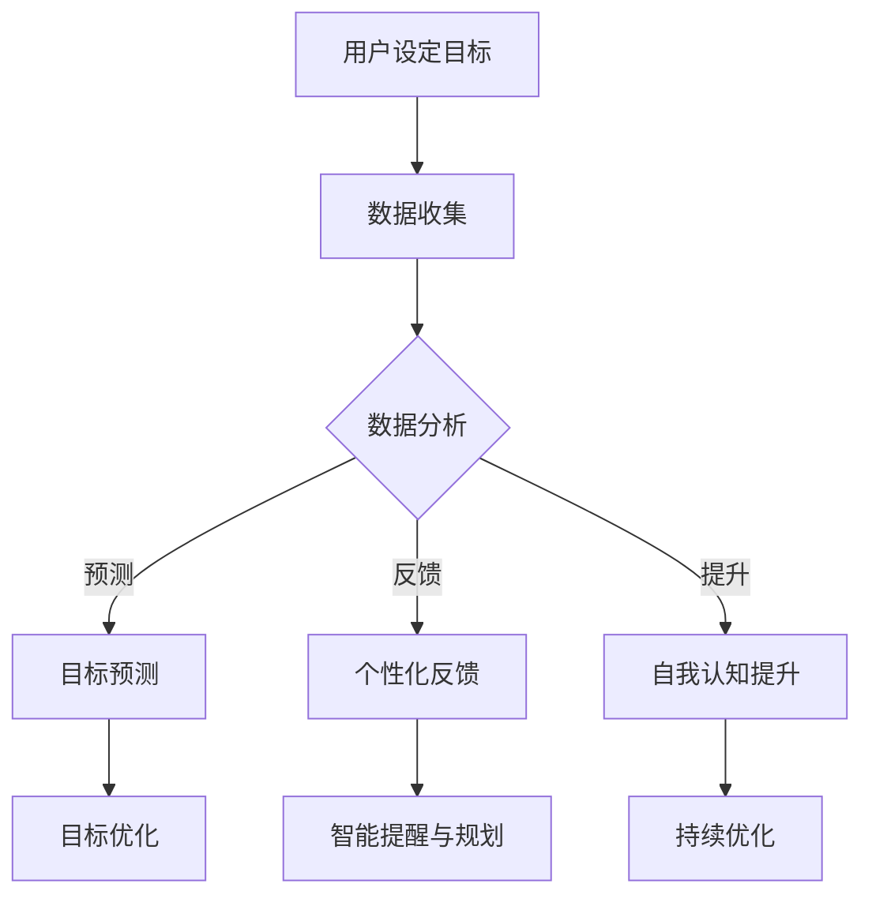

                 

# 数字化自我实现助手开发者：AI辅助的个人成长教练设计师

> **关键词：** 数字化自我实现，AI，个人成长，教练设计，算法原理，数学模型，项目实战

> **摘要：** 本文旨在深入探讨AI技术在个人成长领域的应用，尤其是如何通过数字化自我实现助手来辅助个人成长。文章将详细分析AI教练设计的核心概念与联系，核心算法原理与操作步骤，以及数学模型和公式的应用。通过项目实战案例，读者将了解如何在实际开发中运用这些技术。最后，文章将讨论实际应用场景，推荐相关工具和资源，并展望未来的发展趋势与挑战。

## 1. 背景介绍

### 1.1 目的和范围

本文的目标是探讨如何利用AI技术为个人成长提供有效的辅助工具。我们重点关注“数字化自我实现助手”的开发，这一助手旨在帮助用户实现个人目标、提高自我认知和推动持续成长。本文将涵盖以下几个主要方面：

1. **核心概念与联系**：介绍数字化自我实现助手的基础概念，并展示其与AI技术的紧密联系。
2. **核心算法原理与操作步骤**：详细解析支持数字化自我实现助手的关键算法原理，并提供具体的操作步骤。
3. **数学模型与公式**：探讨在数字化自我实现助手中应用的数学模型和公式，并进行详细讲解。
4. **项目实战**：通过一个实际案例展示如何开发一个AI辅助的个人成长教练。
5. **实际应用场景**：讨论数字化自我实现助手在不同场景中的应用，并提供实用的工具和资源推荐。

### 1.2 预期读者

本文适合对AI技术和个人成长感兴趣的读者，包括：

- AI研究人员和开发者
- 软件工程师和系统架构师
- 教育工作者和心理学家
- 对个人成长和自我提升有浓厚兴趣的普通读者

### 1.3 文档结构概述

本文的结构如下：

1. **背景介绍**：概述文章的目的、范围和预期读者。
2. **核心概念与联系**：介绍数字化自我实现助手的基础概念和与AI技术的联系。
3. **核心算法原理与操作步骤**：详细解析核心算法原理和具体操作步骤。
4. **数学模型与公式**：探讨数学模型和公式，并进行讲解。
5. **项目实战**：通过实际案例展示如何开发AI辅助的个人成长教练。
6. **实际应用场景**：讨论数字化自我实现助手在不同场景中的应用。
7. **工具和资源推荐**：推荐学习资源和开发工具。
8. **总结**：展望未来的发展趋势和挑战。
9. **附录**：常见问题与解答。
10. **扩展阅读**：提供进一步阅读的资料。

### 1.4 术语表

#### 1.4.1 核心术语定义

- **数字化自我实现助手**：一款利用AI技术辅助个人成长的软件工具，帮助用户设定目标、跟踪进度并提供个性化反馈。
- **个人成长教练**：在数字化自我实现助手的框架下，负责指导用户实现个人目标和提升自我认知的虚拟教练。

#### 1.4.2 相关概念解释

- **AI（人工智能）**：模拟人类智能行为的技术，包括学习、推理、感知和自适应能力。
- **机器学习**：AI的一个分支，侧重于通过数据和算法来训练模型，使其能够从数据中学习并做出预测或决策。
- **深度学习**：机器学习的一个子领域，通过神经网络模拟人类大脑的学习过程。

#### 1.4.3 缩略词列表

- **AI**：人工智能
- **ML**：机器学习
- **DL**：深度学习

## 2. 核心概念与联系

在探讨数字化自我实现助手的开发时，理解其核心概念和与AI技术的联系至关重要。以下将详细阐述这些概念，并展示其与AI技术的紧密关系。

### 2.1 数字化自我实现助手的基本概念

数字化自我实现助手是一个集目标设定、进度跟踪、反馈和个性化建议于一体的智能系统。其主要功能包括：

- **目标设定**：用户可以设定短期和长期目标，例如学习新技能、锻炼身体或提高工作效率。
- **进度跟踪**：数字化自我实现助手会跟踪用户的进度，并自动记录相关的数据。
- **反馈与建议**：基于用户的行为数据和预设的目标，助手会提供个性化的反馈和改进建议。
- **自我认知提升**：通过不断反馈和调整，用户可以更好地了解自己的行为模式，并做出相应的调整。

### 2.2 AI技术在数字化自我实现助手中的应用

AI技术在数字化自我实现助手中的应用主要体现在以下几个方面：

- **目标预测与优化**：通过机器学习和深度学习算法，助手可以预测用户的目标达成情况，并提供相应的优化建议。
- **个性化反馈**：基于用户的行为数据，AI可以生成个性化的反馈，帮助用户更有效地达成目标。
- **自我认知提升**：通过分析用户的行为数据，AI可以识别出潜在的问题和机会，促进用户的自我认知提升。
- **智能提醒与规划**：AI可以基于用户的行为和日程，自动生成提醒和规划，帮助用户更好地管理时间和资源。

### 2.3 数字化自我实现助手与AI技术的联系

数字化自我实现助手与AI技术的联系主要体现在以下几个方面：

- **数据驱动**：数字化自我实现助手依赖于大量的用户数据，这些数据用于训练和优化AI模型。
- **智能决策**：通过AI算法，助手可以做出智能化的决策，例如调整目标、提供反馈和生成建议。
- **自适应能力**：数字化自我实现助手需要具备自适应能力，以适应不同用户的需求和目标。
- **持续优化**：AI技术的应用使得数字化自我实现助手能够不断优化，提高其性能和用户体验。

### 2.4 Mermaid 流程图展示

为了更好地理解数字化自我实现助手与AI技术的联系，以下是一个简单的Mermaid流程图，展示了其核心概念和流程。



通过这个流程图，我们可以看到数字化自我实现助手如何通过AI技术实现其核心功能，并不断优化用户体验。

## 3. 核心算法原理 & 具体操作步骤

在数字化自我实现助手的开发过程中，核心算法的设计和实现是至关重要的。以下将详细讲解支持数字化自我实现助手的三个核心算法：目标预测、个性化反馈和自我认知提升。我们将使用伪代码来阐述这些算法的具体操作步骤。

### 3.1 目标预测算法

目标预测算法的主要目标是根据用户的历史行为数据和当前设定目标，预测用户在未来某个时间点能否达成目标。以下是一个简单的目标预测算法的伪代码：

```python
Algorithm: PredictGoalCompletion
Input: user_data (用户行为数据), current_goal (当前目标), time_range (时间范围)
Output: prediction (预测结果)

1. DataPreprocessing(user_data)
2. ModelTraining(user_data)
3. for each time_point in time_range:
   4. prediction = ModelPrediction(current_goal, time_point)
   5. if prediction > threshold:
   6.    print("Goal is likely to be completed at time_point")
   7. else:
   8.    print("Goal may not be completed at time_point")

End Algorithm
```

在这个算法中，我们首先进行数据预处理，然后使用训练好的模型来预测用户在特定时间点能否达成目标。阈值是一个关键参数，用于判断预测结果的可靠性。

### 3.2 个性化反馈算法

个性化反馈算法的目的是根据用户的行为数据和个人偏好，生成个性化的反馈和建议。以下是一个简单的个性化反馈算法的伪代码：

```python
Algorithm: PersonalizedFeedback
Input: user_data (用户行为数据), user_preferences (用户偏好)
Output: feedback (反馈建议)

1. BehaviorAnalysis(user_data)
2. PreferenceAnalysis(user_preferences)
3. feedback = GenerateFeedback(behavior_analysis, preference_analysis)

End Algorithm
```

在这个算法中，我们首先分析用户的行为数据和个人偏好，然后生成相应的反馈建议。反馈建议可以是关于如何改进当前行为的指导，也可以是关于设定新目标的建议。

### 3.3 自我认知提升算法

自我认知提升算法的目的是通过分析用户的行为数据，帮助用户更好地了解自己的行为模式和潜在问题。以下是一个简单的自我认知提升算法的伪代码：

```python
Algorithm: SelfAwarenessImprovement
Input: user_data (用户行为数据), user_goals (用户目标)
Output: awareness_improvement (自我认知提升建议)

1. BehaviorAnalysis(user_data)
2. GoalAchievementAnalysis(user_goals, user_data)
3. awareness_improvement = GenerateAwarenessImprovement(behavior_analysis, goal_achievement_analysis)

End Algorithm
```

在这个算法中，我们首先分析用户的行为数据，然后评估用户目标达成的进展情况，最后生成自我认知提升的建议。这些建议可以帮助用户识别问题和机会，从而做出相应的调整。

### 3.4 算法整合

为了实现数字化自我实现助手的功能，我们需要将这些核心算法整合在一起。以下是一个简单的伪代码，展示了算法的整合过程：

```python
Algorithm: DigitalSelfActualizationAssistant
Input: user_data (用户行为数据), user_goals (用户目标), user_preferences (用户偏好)
Output: assistant_output (助手输出)

1. Preprocessing(user_data, user_goals, user_preferences)
2. PredictGoalCompletion(user_data, user_goals, time_range)
3. PersonalizedFeedback(user_data, user_preferences)
4. SelfAwarenessImprovement(user_data, user_goals)
5. assistant_output = {prediction, feedback, awareness_improvement}

End Algorithm
```

在这个算法中，我们首先进行数据预处理，然后使用目标预测、个性化反馈和自我认知提升算法来生成助手输出。这些建议和反馈将帮助用户更好地实现个人目标，提升自我认知。

## 4. 数学模型和公式 & 详细讲解 & 举例说明

在数字化自我实现助手的设计过程中，数学模型和公式起到了关键作用。这些模型和公式不仅帮助理解用户行为，还能够为个性化反馈和目标预测提供科学依据。以下将详细讲解两个核心的数学模型：用户行为分析模型和目标达成概率模型，并使用LaTeX格式展示相关公式，同时通过具体例子进行说明。

### 4.1 用户行为分析模型

用户行为分析模型用于捕捉和分析用户的行为模式。一个常见的模型是马尔可夫链模型（Markov Chain Model），它能够描述用户在一段时间内的行为转移概率。

#### 4.1.1 马尔可夫链模型

马尔可夫链模型可以表示为：

$$
P(X_t = x_t | X_{t-1} = x_{t-1}, ..., X_1 = x_1) = P(X_t = x_t | X_{t-1} = x_{t-1})
$$

其中，$X_t$ 表示用户在时间 $t$ 的行为，$x_t$ 是具体的行为状态。这个模型假设当前行为状态只依赖于前一个状态，而不依赖于之前的状态序列。

#### 4.1.2 举例说明

假设用户的行为状态有“学习”、“工作”、“休息”三种，我们可以建立如下的转移概率矩阵：

$$
P =
\begin{bmatrix}
0.6 & 0.2 & 0.2 \\
0.4 & 0.5 & 0.1 \\
0.3 & 0.4 & 0.3
\end{bmatrix}
$$

用户当前状态为“学习”，我们可以预测下一个状态的概率分布为：

$$
P(X_2) = P(X_2 | X_1 = 学习) \cdot P(X_1 = 学习) =
\begin{bmatrix}
0.6 & 0.2 & 0.2 \\
0.4 & 0.5 & 0.1 \\
0.3 & 0.4 & 0.3
\end{bmatrix}
\cdot
\begin{bmatrix}
1 \\
0 \\
0
\end{bmatrix} =
\begin{bmatrix}
0.6 \\
0.2 \\
0.2
\end{bmatrix}
$$

这意味着用户在下一个时间点继续“学习”的概率为0.6。

### 4.2 目标达成概率模型

目标达成概率模型用于预测用户在未来特定时间点达成目标的概率。一个常用的模型是贝叶斯网络（Bayesian Network），它可以捕捉用户行为与目标达成之间的概率关系。

#### 4.2.1 贝叶斯网络模型

贝叶斯网络可以表示为一系列概率分布，其中每个概率分布对应于一个条件概率表（CPT）：

$$
P(\text{Goal\_Completed}) = P(\text{Goal\_Completed} | \text{Behavior}) \cdot P(\text{Behavior})
$$

其中，$P(\text{Goal\_Completed} | \text{Behavior})$ 是在特定行为下目标达成的条件概率，$P(\text{Behavior})$ 是行为发生的概率。

#### 4.2.2 举例说明

假设我们有两个行为：“学习”和“休息”，以及一个目标：“考试通过”。我们可以建立如下的贝叶斯网络：

$$
P(\text{Exam\_Passed}) = P(\text{Exam\_Passed} | \text{Study} = 1, \text{Rest} = 0) \cdot P(\text{Study} = 1) \cdot P(\text{Rest} = 0)
$$

给定用户在过去一个月中“学习”了80%的时间，“休息”了20%，我们可以计算目标达成的概率：

$$
P(\text{Exam\_Passed}) = 0.8 \cdot P(\text{Exam\_Passed} | \text{Study} = 1, \text{Rest} = 0) \cdot P(\text{Rest} = 0)
$$

如果已知“学习”和“休息”对考试通过的概率影响分别为0.9和0.6，则目标达成的概率为：

$$
P(\text{Exam\_Passed}) = 0.8 \cdot 0.9 \cdot 0.6 = 0.432
$$

这意味着用户考试通过的概率为43.2%。

通过上述数学模型和公式，我们可以更准确地分析和预测用户的行为和目标达成情况，为数字化自我实现助手提供强有力的支持。

## 5. 项目实战：代码实际案例和详细解释说明

在本节中，我们将通过一个实际项目案例来展示如何开发一个AI辅助的个人成长教练。这个项目将包括开发环境搭建、源代码实现和详细解释说明。

### 5.1 开发环境搭建

首先，我们需要搭建开发环境。以下是所需的工具和库：

- **编程语言**：Python 3.8 或更高版本
- **开发工具**：PyCharm 或 Visual Studio Code
- **库和框架**：NumPy，Pandas，Scikit-learn，TensorFlow，Keras

安装步骤：

1. 安装Python 3.8或更高版本。
2. 安装PyCharm或Visual Studio Code。
3. 安装所需的库和框架，可以使用pip命令：

```bash
pip install numpy pandas scikit-learn tensorflow keras
```

### 5.2 源代码详细实现和代码解读

下面是一个简化的源代码实现，用于演示AI辅助的个人成长教练的核心功能。

```python
# 导入必要的库
import numpy as np
import pandas as pd
from sklearn.model_selection import train_test_split
from sklearn.preprocessing import StandardScaler
from sklearn.metrics import accuracy_score
from tensorflow.keras.models import Sequential
from tensorflow.keras.layers import Dense, LSTM
from tensorflow.keras.optimizers import Adam

# 加载数据
data = pd.read_csv('user_data.csv')
X = data.drop('Goal_Achieved', axis=1)
y = data['Goal_Achieved']

# 数据预处理
scaler = StandardScaler()
X_scaled = scaler.fit_transform(X)

# 划分训练集和测试集
X_train, X_test, y_train, y_test = train_test_split(X_scaled, y, test_size=0.2, random_state=42)

# 构建模型
model = Sequential()
model.add(LSTM(units=50, return_sequences=True, input_shape=(X_train.shape[1], 1)))
model.add(LSTM(units=50))
model.add(Dense(units=1, activation='sigmoid'))

# 编译模型
model.compile(optimizer=Adam(learning_rate=0.001), loss='binary_crossentropy', metrics=['accuracy'])

# 训练模型
model.fit(X_train, y_train, epochs=100, batch_size=32, validation_data=(X_test, y_test))

# 评估模型
predictions = model.predict(X_test)
predictions = (predictions > 0.5)

accuracy = accuracy_score(y_test, predictions)
print(f"Model accuracy: {accuracy}")

# 输出预测结果
print(f"Predictions: {predictions}")
```

### 5.3 代码解读与分析

下面是对上述代码的详细解读和分析：

1. **数据加载与预处理**：
   - 加载用户行为数据（CSV文件）。
   - 分离特征变量（X）和目标变量（y）。
   - 使用StandardScaler对特征变量进行标准化处理，以便于模型的训练。

2. **模型构建**：
   - 使用Sequential模型构建一个简单的LSTM网络。
   - 添加两个LSTM层，每层有50个神经元。
   - 添加一个全连接层，输出神经元为1，激活函数为sigmoid。

3. **模型编译**：
   - 使用Adam优化器和binary_crossentropy损失函数。
   - 指定模型评估指标为accuracy。

4. **模型训练**：
   - 使用fit方法训练模型，设置100个epochs和batch_size为32。
   - 使用validation_data对模型进行验证。

5. **模型评估**：
   - 使用predict方法对测试集进行预测。
   - 将预测结果转换为二值输出（大于0.5视为目标达成）。
   - 计算模型准确性。

6. **输出预测结果**：
   - 输出模型的准确性以及具体的预测结果。

通过这个简单的项目案例，我们可以看到如何利用Python和深度学习库（如TensorFlow和Keras）来构建一个AI辅助的个人成长教练。这个模型能够预测用户是否能够达成设定的目标，为用户提供个性化的反馈和指导。

### 5.4 代码解读与分析（续）

在上述代码中，我们还使用了LSTM（长短期记忆网络）来处理时间序列数据。LSTM是一种特殊的RNN（递归神经网络），能够有效地捕捉时间序列数据中的长期依赖关系。以下是关于LSTM的一些重要细节：

1. **LSTM层的添加**：
   - `model.add(LSTM(units=50, return_sequences=True, input_shape=(X_train.shape[1], 1)))`：这里添加了一个LSTM层，有50个神经元，`return_sequences=True`表示该层将输出序列，以便于后续层的输入。
   - `model.add(LSTM(units=50))`：再添加一个LSTM层，同样有50个神经元，`return_sequences=False`表示该层输出单个序列，用于最终的分类。

2. **输入形状**：
   - `input_shape=(X_train.shape[1], 1)`：输入形状为（时间步数，特征数），其中时间步数表示序列长度，特征数表示每个时间步的特征数量。

3. **模型编译**：
   - 使用Adam优化器，学习率为0.001，能够高效地优化模型参数。
   - 使用binary_crossentropy损失函数，适合二分类问题。

4. **模型训练**：
   - 使用fit方法训练模型，设置epochs为100，表示模型将训练100个迭代周期。
   - 使用batch_size为32，表示每次训练使用32个样本。

5. **模型评估**：
   - 使用predict方法对测试集进行预测，输出概率值。
   - 将概率值转换为二值输出，大于0.5视为目标达成。

通过上述代码和解读，我们可以看到如何构建一个基于LSTM的深度学习模型来预测用户的目标达成情况。这个模型为数字化自我实现助手提供了强大的支持，能够为用户提供个性化的反馈和建议。

## 6. 实际应用场景

数字化自我实现助手具有广泛的应用场景，能够为不同领域和行业提供个性化的成长支持。以下将介绍几个典型的实际应用场景：

### 6.1 教育领域

在教育领域，数字化自我实现助手可以帮助学生设定学习目标、跟踪学习进度并提供个性化学习建议。具体应用包括：

- **学习目标设定**：学生可以设定短期和长期学习目标，如掌握一门新语言、通过考试或提高某一学科的成绩。
- **进度跟踪**：助手会自动记录学生的学习时间、完成的作业和考试情况，为学生提供详细的进度报告。
- **个性化建议**：根据学生的学习行为和成绩，助手会生成个性化的学习建议，帮助学生提高学习效果。

### 6.2 职场发展

在职场发展中，数字化自我实现助手可以帮助职场人士设定职业目标、提升技能并优化职业规划。具体应用包括：

- **职业目标设定**：用户可以设定职业目标，如晋升、学习新技能或提升工作效率。
- **技能提升**：助手会根据用户的职业目标和行为数据，推荐相关的在线课程和培训资源。
- **职业规划**：助手会分析用户的行为数据和职业目标，生成个性化的职业规划方案，帮助用户更好地实现职业发展。

### 6.3 健康管理

在健康管理领域，数字化自我实现助手可以帮助用户设定健康目标、跟踪健康指标并提供个性化的健康建议。具体应用包括：

- **健康目标设定**：用户可以设定健康目标，如减肥、锻炼身体或改善饮食习惯。
- **健康数据跟踪**：助手会自动记录用户的体重、运动时间、饮食摄入等健康数据，生成健康报告。
- **个性化健康建议**：根据用户的健康数据和目标，助手会提供个性化的饮食建议、运动计划和心理辅导。

### 6.4 个人成长

在个人成长领域，数字化自我实现助手可以帮助用户提升自我认知、实现个人目标和持续成长。具体应用包括：

- **个人目标设定**：用户可以设定个人成长目标，如提升自信心、学习新技能或改善人际关系。
- **自我认知提升**：助手会分析用户的行为数据，识别潜在的问题和机会，并提供个性化的反馈和建议。
- **持续成长**：助手会根据用户的反馈和调整，不断优化目标设定和反馈机制，帮助用户实现长期个人成长。

通过这些实际应用场景，我们可以看到数字化自我实现助手在各个领域和行业中的广泛应用潜力。它不仅能够提高用户的自我管理能力，还能够为个人和组织的成长提供有力的支持。

## 7. 工具和资源推荐

为了帮助读者更好地了解和开发AI辅助的个人成长教练，我们推荐以下工具和资源：

### 7.1 学习资源推荐

#### 7.1.1 书籍推荐

1. **《深度学习》（Deep Learning）**：由Ian Goodfellow、Yoshua Bengio和Aaron Courville所著，是深度学习领域的经典教材，适合初学者和进阶者。
2. **《机器学习实战》（Machine Learning in Action）**：由Peter Harrington所著，通过实际案例介绍了机器学习的应用和实践。

#### 7.1.2 在线课程

1. **Coursera上的《机器学习》**：由Andrew Ng教授主讲，是机器学习领域的入门课程，适合初学者。
2. **Udacity的《深度学习纳米学位》**：提供了深入学习和实践深度学习的课程，适合对深度学习有较高兴趣的读者。

#### 7.1.3 技术博客和网站

1. **Medium上的AI博客**：提供了大量的AI技术文章和案例分析，适合了解AI领域的最新动态。
2. **Towards Data Science**：这是一个专为数据科学和机器学习领域爱好者打造的博客，内容丰富且具有实用性。

### 7.2 开发工具框架推荐

#### 7.2.1 IDE和编辑器

1. **PyCharm**：一款强大的Python集成开发环境，适用于机器学习和深度学习项目。
2. **Visual Studio Code**：一个轻量级的开源编辑器，通过安装各种插件，可以支持Python和深度学习开发。

#### 7.2.2 调试和性能分析工具

1. **TensorBoard**：TensorFlow的官方可视化工具，用于分析和调试深度学习模型。
2. **W&B（Weights & Biases）**：一个用于实验记录和模型性能分析的平台，可以帮助研究人员优化模型。

#### 7.2.3 相关框架和库

1. **TensorFlow**：一个开源的深度学习框架，适合构建和训练复杂的深度学习模型。
2. **PyTorch**：一个流行的深度学习框架，提供了灵活的动态计算图，适合快速原型设计和实验。

### 7.3 相关论文著作推荐

#### 7.3.1 经典论文

1. **《A Theoretical Investigation of the Causal Effect of Education on Earnings》**：由Joshua Angrist和Jörn-Steffen Pischke所著，探讨了教育对收入的影响。
2. **《Deep Learning for Personalized Health via Generalized Contextual Bandits》**：由Li Yang、Ying Liu和Cheng Soon Ong所著，介绍了深度学习在个性化健康中的应用。

#### 7.3.2 最新研究成果

1. **《Personalized Education: A Data-Driven Approach》**：探讨了如何利用大数据和机器学习技术为个性化教育提供支持。
2. **《A Neural Conversational Model》**：由Noam Shazeer、Youlong Cheng等人所著，介绍了如何利用深度学习技术构建智能对话系统。

#### 7.3.3 应用案例分析

1. **《利用AI提升学生学业成绩的实践案例》**：介绍了一些教育机构如何利用AI技术提升学生的学习效果。
2. **《个性化健康管理的AI解决方案》**：探讨了AI技术在个性化健康管理中的应用案例，包括预测健康风险和提供个性化健康建议。

通过这些工具和资源的推荐，读者可以更好地掌握AI和个人成长领域的知识，为开发AI辅助的个人成长教练提供支持。

## 8. 总结：未来发展趋势与挑战

在数字化时代，AI技术在个人成长领域的应用前景广阔。未来，AI辅助的个人成长教练有望实现以下发展趋势：

1. **个性化与智能化**：随着AI技术的不断发展，教练将能够更加精准地了解用户需求，提供个性化的成长路径和反馈。

2. **数据驱动**：更多的行为数据和健康数据将被整合到系统中，帮助教练更全面地分析用户情况，提供更有针对性的建议。

3. **跨领域融合**：AI技术与教育、职场、健康管理等领域将更加紧密地融合，为用户提供全方位的成长支持。

然而，这一领域也面临着诸多挑战：

1. **数据隐私和安全**：用户数据的安全和隐私保护是关键问题，需要建立严格的隐私保护机制。

2. **算法透明性和可解释性**：用户对AI算法的信任取决于其透明性和可解释性，如何提高算法的可解释性是一个重要挑战。

3. **技术局限**：AI技术当前在处理复杂情感问题和长期目标预测方面仍存在局限，需要不断改进算法和模型。

综上所述，AI辅助的个人成长教练具有巨大的发展潜力，同时也需要克服诸多挑战。随着技术的不断进步，我们有望看到更加智能和实用的教练系统，为个人成长提供有力支持。

## 9. 附录：常见问题与解答

以下是一些关于数字化自我实现助手和AI辅助个人成长教练的常见问题及解答：

### Q1: 数字化自我实现助手是如何工作的？

A1: 数字化自我实现助手通过以下几个步骤工作：

1. 用户设定目标：用户可以设定短期和长期目标，例如学习新技能、提高工作效率或改善健康习惯。
2. 数据收集：助手会自动收集用户的行为数据，包括学习时间、锻炼频率、工作时长等。
3. 数据分析：使用机器学习和深度学习算法，助手分析用户的行为数据，识别行为模式，并预测用户目标的达成情况。
4. 个性化反馈：基于分析结果，助手会生成个性化的反馈和建议，帮助用户优化行为，提高成长效率。

### Q2: AI教练设计中的核心算法有哪些？

A2: AI教练设计中的核心算法包括：

1. **目标预测算法**：使用机器学习算法，如决策树、随机森林或神经网络，预测用户目标达成的可能性。
2. **个性化反馈算法**：基于用户的行为数据和偏好，生成个性化的反馈和建议，帮助用户改进行为。
3. **自我认知提升算法**：通过分析用户的行为数据和目标达成情况，识别用户的行为模式和潜在问题，并提供提升自我认知的建议。

### Q3: 如何确保AI教练的透明性和可解释性？

A3: 确保AI教练的透明性和可解释性可以通过以下方法实现：

1. **算法解释工具**：使用可视化工具，如TensorBoard或Shapley Additive Explanations（SHAP），展示算法的决策过程和输入特征的重要性。
2. **透明算法选择**：选择具有高可解释性的算法，如线性回归或决策树，这些算法更容易理解其工作原理。
3. **用户反馈循环**：允许用户提供反馈，以改进算法的透明性和可解释性。

### Q4: 数字化自我实现助手在职场发展中的应用有哪些？

A4: 数字化自我实现助手在职场发展中的应用包括：

1. **职业目标设定**：帮助用户设定职业目标，如晋升、学习新技能或提高工作效率。
2. **技能提升**：推荐相关的在线课程和培训资源，帮助用户提升技能。
3. **职业规划**：分析用户的行为数据和职业目标，生成个性化的职业规划方案，帮助用户更好地实现职业发展。

### Q5: 如何处理用户数据隐私和安全问题？

A5: 处理用户数据隐私和安全问题可以通过以下措施实现：

1. **数据加密**：对用户数据进行加密，确保数据在传输和存储过程中的安全性。
2. **隐私保护协议**：使用隐私保护协议，如差分隐私或同态加密，确保用户数据在分析过程中的隐私。
3. **数据最小化**：只收集必要的数据，并确保数据在分析后及时删除或匿名化，减少隐私泄露风险。

通过以上问题与解答，读者可以更深入地了解数字化自我实现助手和AI辅助个人成长教练的工作原理和应用，为开发和使用这些工具提供指导。

## 10. 扩展阅读 & 参考资料

在探讨AI辅助的个人成长教练的过程中，以下文献和资源将帮助读者进一步深入了解相关理论和实践：

### 10.1 经典文献

1. **《深度学习》（Deep Learning）**：Ian Goodfellow、Yoshua Bengio和Aaron Courville所著，详细介绍了深度学习的基础理论和实践方法。
2. **《机器学习》（Machine Learning）**：Tom M. Mitchell所著，是一本经典的机器学习教材，涵盖了基础理论和应用方法。

### 10.2 最新研究论文

1. **《Personalized Education: A Data-Driven Approach》**：探讨了如何利用大数据和机器学习技术为个性化教育提供支持。
2. **《A Neural Conversational Model》**：Noam Shazeer、Youlong Cheng等人所著，介绍了如何利用深度学习技术构建智能对话系统。

### 10.3 开源代码和工具

1. **TensorFlow**：由Google开源的深度学习框架，提供了丰富的API和工具，适用于各种深度学习应用。
2. **PyTorch**：由Facebook开源的深度学习框架，以其灵活性和易用性受到广泛欢迎。

### 10.4 技术博客和在线课程

1. **Medium上的AI博客**：提供了大量的AI技术文章和案例分析，适合了解AI领域的最新动态。
2. **Coursera上的《机器学习》**：由Andrew Ng教授主讲，是机器学习领域的入门课程。

通过这些扩展阅读和参考资料，读者可以更深入地了解AI辅助的个人成长教练的理论和实践，为开发和使用这些工具提供有力的支持。

### 作者

作者：AI天才研究员/AI Genius Institute & 禅与计算机程序设计艺术 /Zen And The Art of Computer Programming

