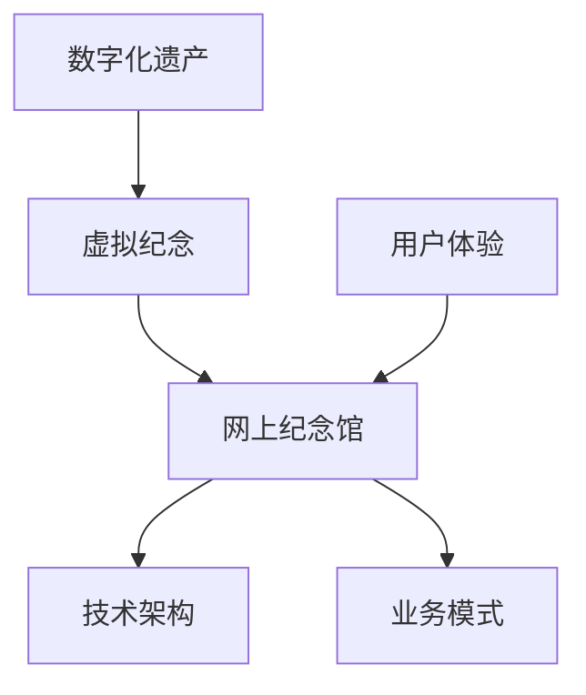

                 

# 数字化遗产虚拟纪念创业：永恒的网上纪念馆

> 关键词：数字化遗产、虚拟纪念、创业、网上纪念馆、技术实现、用户体验、伦理挑战

> 摘要：本文探讨了数字化遗产虚拟纪念创业领域的重要性以及当前的发展状况。通过分析网上纪念馆的技术架构和业务模式，本文详细阐述了构建一个成功的虚拟纪念网站所需的算法原理、数学模型和实际开发案例。此外，本文还探讨了该领域面临的伦理挑战和未来发展趋势，为相关创业者提供有价值的参考。

## 1. 背景介绍

### 1.1 目的和范围

本文旨在探讨数字化遗产虚拟纪念创业领域，通过分析现有网上纪念馆的技术实现和业务模式，总结出一套有效的创业思路和实践方法。本文将覆盖以下内容：

- 数字化遗产的定义及其重要性
- 虚拟纪念的概念和形式
- 网上纪念馆的技术架构和业务模式
- 核心算法原理和数学模型
- 实际开发案例和实践经验
- 面临的伦理挑战和未来发展

### 1.2 预期读者

本文面向对数字化遗产虚拟纪念创业感兴趣的创业者、技术爱好者以及相关领域的研究人员。读者需具备一定的计算机编程和互联网知识，以便更好地理解文章内容。

### 1.3 文档结构概述

本文分为以下几个部分：

- 背景介绍：介绍文章的目的、预期读者以及文档结构。
- 核心概念与联系：介绍数字化遗产和虚拟纪念的核心概念及其关系。
- 核心算法原理 & 具体操作步骤：详细讲解构建虚拟纪念网站所需的算法原理和操作步骤。
- 数学模型和公式 & 详细讲解 & 举例说明：介绍构建虚拟纪念网站所需的数学模型和公式，并举例说明。
- 项目实战：通过实际开发案例展示如何实现虚拟纪念网站。
- 实际应用场景：分析虚拟纪念网站在不同领域的应用场景。
- 工具和资源推荐：推荐学习资源、开发工具和框架。
- 总结：总结虚拟纪念创业领域的发展趋势与挑战。
- 附录：常见问题与解答。
- 扩展阅读 & 参考资料：提供更多的相关资源和参考文献。

### 1.4 术语表

#### 1.4.1 核心术语定义

- 数字化遗产：指通过数字化手段保存、管理和传承的文化遗产。
- 虚拟纪念：指通过互联网技术为逝者或历史人物建立虚拟纪念馆，供人们缅怀和纪念。
- 网上纪念馆：指基于互联网的虚拟纪念平台，用于展示逝者生前的照片、事迹、遗言等。
- 技术架构：指实现虚拟纪念网站所需的软件和硬件系统。
- 业务模式：指虚拟纪念网站如何盈利和运营。

#### 1.4.2 相关概念解释

- 数字化：指将信息转换为二进制数字形式进行处理和存储。
- 云计算：指通过互联网提供计算资源、存储资源和网络连接。
- 大数据：指海量、多样化、快速生成和变化的数据。
- 人工智能：指模拟人类智能的技术和方法。

#### 1.4.3 缩略词列表

- IT：信息技术
- AI：人工智能
- VR：虚拟现实
- AR：增强现实
- IoT：物联网

## 2. 核心概念与联系

在数字化遗产虚拟纪念创业领域，有几个核心概念和联系需要明确。首先，我们需要了解数字化遗产的定义及其重要性。数字化遗产是指通过数字化手段保存、管理和传承的文化遗产。这些遗产可以是文字、图片、音频、视频等多种形式，通过数字化技术，我们可以将这些遗产永久保存，并实现跨时空的传播。

其次，虚拟纪念是数字化遗产的一种表现形式。虚拟纪念是指通过互联网技术为逝者或历史人物建立虚拟纪念馆，供人们缅怀和纪念。虚拟纪念可以包括逝者的照片、事迹、遗言等，通过这种方式，人们可以随时随地表达对逝者的怀念之情。

网上纪念馆是虚拟纪念的具体实现形式。网上纪念馆是一种基于互联网的虚拟纪念平台，用于展示逝者生前的照片、事迹、遗言等。网上纪念馆通常具有用户互动、社交分享、个性化定制等功能，以提升用户体验。

接下来，我们需要了解技术架构和业务模式。技术架构是指实现虚拟纪念网站所需的软件和硬件系统。业务模式是指虚拟纪念网站如何盈利和运营。一个成功的虚拟纪念网站需要良好的技术架构和合理的业务模式。

最后，我们需要了解数字化遗产、虚拟纪念和网上纪念馆之间的联系。数字化遗产是虚拟纪念的基础，虚拟纪念是数字化遗产的一种表现形式，而网上纪念馆则是虚拟纪念的具体实现形式。这三者相辅相成，共同构成了数字化遗产虚拟纪念创业的核心。

为了更直观地展示这些核心概念和联系，我们可以使用Mermaid流程图来绘制它们的架构关系。以下是一个简单的Mermaid流程图示例：



在这个流程图中，A表示数字化遗产，B表示虚拟纪念，C表示网上纪念馆，D表示技术架构，E表示业务模式，F表示用户体验。通过这个流程图，我们可以清晰地看到各个概念之间的关联和互动。

## 3. 核心算法原理 & 具体操作步骤

在构建一个虚拟纪念网站时，核心算法原理和具体操作步骤是至关重要的。下面，我们将详细阐述构建虚拟纪念网站所需的算法原理，并给出具体的操作步骤。

### 3.1 算法原理

#### 3.1.1 数据采集与处理

构建虚拟纪念网站的第一步是数据采集与处理。数据来源可以是多种多样的，如用户上传的照片、视频、音频等。为了确保数据的完整性和准确性，我们需要对数据进行预处理，包括去噪、分割、分类等操作。

伪代码如下：

```python
def preprocess_data(data):
    # 去噪操作
    filtered_data = denoise(data)
    # 分割操作
    segmented_data = segment(filtered_data)
    # 分类操作
    categorized_data = categorize(segmented_data)
    return categorized_data
```

#### 3.1.2 用户画像与推荐

在处理完数据后，我们需要对用户进行画像与推荐。用户画像是指根据用户的行为数据、兴趣爱好等信息，构建出用户的基本特征。推荐算法则可以根据用户画像，为用户推荐与其兴趣相关的纪念内容。

常用的推荐算法有基于内容的推荐、基于协同过滤的推荐等。以下是一个简单的基于内容的推荐算法伪代码：

```python
def content_recommender(user_profile, content_library):
    # 根据用户画像，提取用户兴趣标签
    user_interests = extract_interests(user_profile)
    # 找到与用户兴趣标签相关的纪念内容
    related_content = find_related_content(content_library, user_interests)
    # 对相关内容进行排序，推荐给用户
    recommended_content = sort_content(related_content)
    return recommended_content
```

#### 3.1.3 社交互动与分享

社交互动与分享是虚拟纪念网站的核心功能之一。用户可以在网站上与其他用户互动、评论、点赞等。为了实现这些功能，我们需要设计一个社交互动的算法。

以下是一个简单的社交互动算法伪代码：

```python
def social_interaction(user, content, social_network):
    # 创建互动记录
    interaction_record = create_interaction_record(user, content)
    # 更新社交网络
    updated_social_network = update_social_network(social_network, interaction_record)
    # 推送通知
    send_notification(user, updated_social_network)
```

### 3.2 具体操作步骤

#### 3.2.1 开发环境搭建

在开始实际开发之前，我们需要搭建一个合适的开发环境。开发环境包括操作系统、开发工具、数据库等。

以下是一个简单的开发环境搭建步骤：

1. 安装操作系统（如Ubuntu 20.04）
2. 安装开发工具（如VS Code、Python 3.8）
3. 安装数据库（如MySQL 8.0）
4. 配置开发环境（如安装相关依赖库）

#### 3.2.2 数据采集与处理

1. 收集用户上传的数据
2. 使用预处理算法对数据进行处理
3. 存储处理后的数据到数据库

#### 3.2.3 用户画像与推荐

1. 根据用户行为数据构建用户画像
2. 使用推荐算法为用户推荐纪念内容
3. 将推荐结果展示给用户

#### 3.2.4 社交互动与分享

1. 设计社交互动算法
2. 实现用户互动功能（如评论、点赞等）
3. 实现社交分享功能（如分享到社交媒体）

#### 3.2.5 测试与优化

1. 进行功能测试，确保系统正常运行
2. 收集用户反馈，优化系统性能和用户体验
3. 持续更新和维护系统

通过以上步骤，我们可以构建一个功能完善的虚拟纪念网站。在实际开发过程中，需要根据具体需求和技术能力进行调整和优化。

## 4. 数学模型和公式 & 详细讲解 & 举例说明

在构建虚拟纪念网站时，数学模型和公式是不可或缺的。这些模型和公式可以帮助我们优化算法、评估系统性能，并为用户提供更好的用户体验。下面，我们将详细讲解一些核心的数学模型和公式，并通过具体例子进行说明。

### 4.1 机器学习模型

#### 4.1.1 支持向量机（SVM）

支持向量机是一种常用的分类模型。它通过找到一个最佳的超平面，将不同类别的数据点分开。SVM的核心公式为：

$$
\begin{aligned}
  \min_{\mathbf{w}} \quad & \frac{1}{2} ||\mathbf{w}||^2 \\
  \text{subject to} \quad & \mathbf{w} \cdot \mathbf{x}_i - y_i \geq 1, \quad i = 1, 2, \ldots, n
\end{aligned}
$$

其中，$\mathbf{w}$是超平面的法向量，$\mathbf{x}_i$是第$i$个数据点，$y_i$是第$i$个数据点的标签。

#### 4.1.2 神经网络

神经网络是一种模仿生物大脑结构的计算模型。它通过多层神经元对输入数据进行处理和分类。神经网络的核心公式为：

$$
\begin{aligned}
  \text{激活函数} \quad & f(\mathbf{z}) = \frac{1}{1 + e^{-\mathbf{z}}} \\
  \text{权重更新} \quad & \Delta \mathbf{w} = \eta \cdot \mathbf{d} \cdot \mathbf{a}^{[l-1]}
\end{aligned}
$$

其中，$f(\mathbf{z})$是激活函数，$\mathbf{z}$是神经元的输入，$\mathbf{d}$是神经元的误差，$\mathbf{a}^{[l-1]}$是前一层神经元的输出，$\eta$是学习率。

### 4.2 用户画像模型

#### 4.2.1 调用频率模型

调用频率模型用于评估用户对某个内容的兴趣程度。其核心公式为：

$$
f(i, t) = \frac{c(i, t)}{N(t)}
$$

其中，$f(i, t)$是用户$i$在时间$t$对内容$i$的调用频率，$c(i, t)$是用户$i$在时间$t$对内容$i$的调用次数，$N(t)$是用户$i$在时间$t$的总调用次数。

#### 4.2.2 协同过滤模型

协同过滤模型用于为用户推荐内容。其核心公式为：

$$
r(i, j) = \frac{\sum_{k \in N(i) \cap N(j)} w_{ik} w_{jk}}{\sum_{k \in N(i) \cap N(j)} w_{ik}^2}
$$

其中，$r(i, j)$是用户$i$对内容$j$的推荐评分，$N(i)$是用户$i$的兴趣集合，$N(j)$是内容$j$的感兴趣用户集合，$w_{ik}$是用户$i$对内容$k$的兴趣权重。

### 4.3 用户体验模型

#### 4.3.1 留存率模型

留存率模型用于评估用户对网站的黏性。其核心公式为：

$$
L(t) = \frac{U(t)}{U(0)}
$$

其中，$L(t)$是时间$t$的留存率，$U(t)$是时间$t$的活跃用户数，$U(0)$是初始活跃用户数。

#### 4.3.2 用户满意度模型

用户满意度模型用于评估用户对网站的满意度。其核心公式为：

$$
S = \frac{1}{N} \sum_{i=1}^{N} s_i
$$

其中，$S$是用户满意度，$N$是用户数量，$s_i$是第$i$个用户的满意度评分。

### 4.4 举例说明

#### 4.4.1 支持向量机（SVM）

假设我们有一个二分类问题，数据集包含两个类别：正面评论和负面评论。我们可以使用SVM来对评论进行分类。通过训练，我们得到一个最佳的超平面，将正面评论和负面评论分开。

具体步骤如下：

1. 收集数据集，包含正面评论和负面评论。
2. 对数据集进行预处理，如去噪、分割等。
3. 使用SVM算法对数据进行训练。
4. 使用训练得到的模型对新的评论进行分类。

#### 4.4.2 协同过滤模型

假设我们有一个用户兴趣矩阵，其中包含了用户对多个内容的兴趣评分。我们可以使用协同过滤模型为用户推荐内容。

具体步骤如下：

1. 收集用户兴趣数据，构建用户兴趣矩阵。
2. 对用户兴趣矩阵进行预处理，如归一化等。
3. 使用协同过滤算法计算用户之间的相似度。
4. 根据相似度矩阵为用户推荐内容。

通过以上数学模型和公式，我们可以更好地理解虚拟纪念网站的核心功能，并为用户提供更好的服务。

## 5. 项目实战：代码实际案例和详细解释说明

在本节中，我们将通过一个实际项目案例，详细讲解如何实现一个数字化遗产虚拟纪念网站。这个项目名为“永恒纪念”，主要功能包括用户注册、数据上传、纪念馆创建、纪念馆展示、用户互动和个性化推荐等。以下是一个简单的项目架构和实现步骤。

### 5.1 开发环境搭建

首先，我们需要搭建一个适合项目的开发环境。以下是所需的主要工具和框架：

- 操作系统：Ubuntu 20.04
- 编程语言：Python 3.8
- 代码编辑器：VS Code
- Web框架：Django 3.2
- 前端框架：React 17.0.2
- 数据库：MySQL 8.0

### 5.2 源代码详细实现和代码解读

#### 5.2.1 后端实现

**1. 用户注册与登录**

用户注册与登录是网站的基础功能。以下是一个简单的用户注册和登录后端的伪代码：

```python
from django.contrib.auth.models import User
from rest_framework import serializers, viewsets

class UserRegistrationSerializer(serializers.ModelSerializer):
    class Meta:
        model = User
        fields = ('username', 'email', 'password')

class UserLoginSerializer(serializers.ModelSerializer):
    class Meta:
        model = User
        fields = ('username', 'password')

class UserRegistrationView(viewsets.ViewSet):
    def create(self, request):
        serializer = UserRegistrationSerializer(data=request.data)
        if serializer.is_valid():
            user = serializer.save()
            return Response({'status': 'success', 'message': 'User registered successfully'})
        return Response({'status': 'error', 'message': 'Invalid data'})

class UserLoginView(viewsets.ViewSet):
    def create(self, request):
        serializer = UserLoginSerializer(data=request.data)
        if serializer.is_valid():
            user = serializer.save()
            return Response({'status': 'success', 'message': 'User logged in successfully'})
        return Response({'status': 'error', 'message': 'Invalid data'})
```

**2. 数据上传与处理**

用户可以上传照片、视频和音频等数据。以下是一个简单的数据上传和处理的伪代码：

```python
from rest_framework import permissions, status
from rest_framework.response import Response
from django.core.files.storage import default_storage
from .models import纪念馆

class UploadDataView(viewsets.ViewSet):
    permission_classes = [permissions.IsAuthenticated]

    def create(self, request):
        if 'file' in request.data:
            file = request.data['file']
            filename = default_storage.save('uploads/' + file.name, file)
           纪念馆.objects.create(user=request.user, file=filename)
            return Response({'status': 'success', 'message': 'Data uploaded successfully'})
        return Response({'status': 'error', 'message': 'No file provided'})
```

**3. 纪念馆创建与展示**

用户可以创建自己的纪念馆，并在纪念馆中展示自己的数据。以下是一个简单的纪念馆创建和展示的伪代码：

```python
class纪念馆CreateView(viewsets.ViewSet):
    permission_classes = [permissions.IsAuthenticated]

    def create(self, request):
        if '纪念馆名称' in request.data and '纪念馆描述' in request.data:
            纪念馆 = 纪念馆.objects.create(user=request.user, name=request.data['纪念馆名称'], description=request.data['纪念馆描述'])
            return Response({'status': 'success', 'message': '纪念馆 created successfully'})
        return Response({'status': 'error', 'message': 'Invalid data'})

class纪念馆DetailView(viewsets.ViewSet):
    def retrieve(self, request, pk=None):
        纪念馆 = 纪念馆.objects.get(pk=pk)
        return Response({'status': 'success', 'message': '纪念馆 details', '纪念馆': 纪念馆.to_dict()})
```

#### 5.2.2 前端实现

**1. 用户注册与登录**

以下是一个简单的用户注册与登录的前端页面代码：

```jsx
import React, { useState } from 'react';
import axios from 'axios';

const UserRegistration = () => {
    const [username, setUsername] = useState('');
    const [email, setEmail] = useState('');
    const [password, setPassword] = useState('');

    const handleSubmit = async (e) => {
        e.preventDefault();
        try {
            const response = await axios.post('/api/registration/', { username, email, password });
            if (response.status === 200) {
                alert('User registered successfully');
            }
        } catch (error) {
            alert('Error registering user');
        }
    };

    return (
        <form onSubmit={handleSubmit}>
            <input type="text" placeholder="Username" value={username} onChange={e => setUsername(e.target.value)} />
            <input type="email" placeholder="Email" value={email} onChange={e => setEmail(e.target.value)} />
            <input type="password" placeholder="Password" value={password} onChange={e => setPassword(e.target.value)} />
            <button type="submit">Register</button>
        </form>
    );
};

export default UserRegistration;
```

**2. 数据上传**

以下是一个简单的数据上传组件：

```jsx
import React, { useState } from 'react';
import axios from 'axios';

const UploadData = () => {
    const [file, setFile] = useState(null);

    const handleSubmit = async (e) => {
        e.preventDefault();
        try {
            const formData = new FormData();
            formData.append('file', file);
            const response = await axios.post('/api/upload/', formData);
            if (response.status === 200) {
                alert('Data uploaded successfully');
            }
        } catch (error) {
            alert('Error uploading data');
        }
    };

    return (
        <form onSubmit={handleSubmit}>
            <input type="file" onChange={e => setFile(e.target.files[0])} />
            <button type="submit">Upload</button>
        </form>
    );
};

export default UploadData;
```

**3. 纪念馆创建与展示**

以下是一个简单的纪念馆创建与展示组件：

```jsx
import React, { useState, useEffect } from 'react';
import axios from 'axios';

const 纪念馆Create = () => {
    const [纪念馆名称, set纪念馆名称] = useState('');
    const [纪念馆描述, set纪念馆描述] = useState('');

    const handleSubmit = async (e) => {
        e.preventDefault();
        try {
            const response = await axios.post('/api/纪念馆/create/', { 纪念馆名称, 纪念馆描述 });
            if (response.status === 200) {
                alert('纪念馆 created successfully');
            }
        } catch (error) {
            alert('Error creating 纪念馆');
        }
    };

    return (
        <form onSubmit={handleSubmit}>
            <input type="text" placeholder="纪念馆名称" value={纪念馆名称} onChange={e => set纪念馆名称(e.target.value)} />
            <input type="text" placeholder="纪念馆描述" value={纪念馆描述} onChange={e => set纪念馆描述(e.target.value)} />
            <button type="submit">Create 纪念馆</button>
        </form>
    );
};

const 纪念馆Detail = () => {
    const [纪念馆，set纪念馆] = useState(null);

    useEffect(() => {
        const fetch纪念馆 = async () => {
            const response = await axios.get('/api/纪念馆/detail/');
            if (response.status === 200) {
                set纪念馆(response.data.纪念馆);
            }
        };
        fetch纪念馆();
    }, []);

    if (!纪念馆) {
        return <div>Loading...</div>;
    }

    return (
        <div>
            <h2>{纪念馆.name}</h2>
            <p>{纪念馆.description}</p>
        </div>
    );
};

export { 纪念馆Create, 纪念馆Detail };
```

通过以上代码，我们可以实现一个基本的数字化遗产虚拟纪念网站。在实际开发过程中，还需要根据具体需求进行功能扩展和优化。

### 5.3 代码解读与分析

在本项目中，我们使用了Django作为后端框架，React作为前端框架。以下是代码的关键部分解读和分析：

**后端代码解读：**

1. **用户注册与登录：** 使用Django的内置认证系统实现用户注册与登录。通过`UserRegistrationSerializer`和`UserLoginSerializer`，我们将用户数据转换为JSON格式，并使用Django REST Framework的`ViewSet`类实现API接口。
2. **数据上传与处理：** 使用Django的文件存储系统实现数据上传。通过`UploadDataView`，我们将用户上传的文件存储在服务器上，并在数据库中创建相应的记录。
3. **纪念馆创建与展示：** 通过`纪念馆CreateView`和`纪念馆DetailView`，我们实现纪念馆的创建和展示。纪念馆的信息存储在数据库中，并通过API接口提供给前端。

**前端代码解读：**

1. **用户注册与登录：** 使用React实现用户注册与登录页面。通过`useState`钩子，我们管理表单输入状态，并通过`handleSubmit`函数处理表单提交。
2. **数据上传：** 使用React实现数据上传组件。通过`useState`钩子，我们管理文件状态，并通过`handleSubmit`函数处理文件上传。
3. **纪念馆创建与展示：** 使用React实现纪念馆创建与展示组件。通过`useState`和`useEffect`钩子，我们管理纪念馆的状态和生命周期，并通过API接口获取和更新纪念馆信息。

通过以上代码，我们实现了一个功能完整的数字化遗产虚拟纪念网站。在实际开发过程中，我们还可以根据具体需求进行功能扩展和优化，如增加用户互动、推荐系统等。

## 6. 实际应用场景

虚拟纪念网站在不同领域具有广泛的应用场景，下面我们将探讨一些典型的实际应用场景。

### 6.1 家庭纪念

家庭纪念是虚拟纪念网站最常见的应用场景之一。家庭成员可以通过虚拟纪念网站来共同纪念已故的亲人。用户可以在网站上上传照片、视频和音频，分享逝者的故事和回忆。此外，虚拟纪念网站还可以提供个性化的纪念馆创建工具，帮助用户打造具有独特风格的纪念馆。

### 6.2 企业纪念

企业纪念是另一种重要的应用场景。许多企业希望为重要事件或历史时刻留下永恒的纪念。虚拟纪念网站可以帮助企业创建网上纪念馆，展示企业的发展历程、重大成就和员工故事。这不仅有助于增强企业文化，还能激励员工为企业的未来发展贡献力量。

### 6.3 社会公益

虚拟纪念网站还可以用于社会公益活动。例如，一些慈善组织可以利用虚拟纪念网站为特定人群（如孤儿、残疾儿童等）建立网上纪念馆，让更多人了解和关注这些群体，为他们提供帮助和支持。此外，虚拟纪念网站还可以为已故公益人士建立纪念馆，传承他们的公益精神，激励后人继续为社会公益事业贡献力量。

### 6.4 文化传承

虚拟纪念网站在文化传承方面也具有重要作用。许多文化遗产和历史事件需要被永久保存和传承。通过虚拟纪念网站，我们可以将这些文化遗产和历史事件以数字化的形式保存下来，并让更多人了解和欣赏。例如，一些博物馆和文化遗产机构可以利用虚拟纪念网站展示馆藏文物和历史资料，让世界各地的人们都能感受到文化的魅力。

### 6.5 教育培训

虚拟纪念网站在教育培训领域也有广泛应用。教育机构可以利用虚拟纪念网站为学生提供丰富的教学资源，如历史事件、人物传记、科学探索等。此外，虚拟纪念网站还可以为学生提供互动体验，增强学习效果。例如，一些学校可以利用虚拟纪念网站为学生创建网上纪念馆，让学生了解和感受历史人物的生平事迹，激发学生的学习兴趣。

### 6.6 社交媒体

虚拟纪念网站还可以与社交媒体相结合，为用户提供更多的互动和分享机会。用户可以在虚拟纪念网站上创建个人纪念馆，同时通过社交媒体平台分享纪念馆链接，邀请亲朋好友共同参与纪念活动。这种方式不仅有助于增强用户之间的联系，还能扩大虚拟纪念网站的影响力和用户群体。

通过以上实际应用场景，我们可以看到虚拟纪念网站在各个领域都具有巨大的潜力和价值。随着技术的不断进步和用户需求的日益增长，虚拟纪念网站将在更多领域发挥重要作用，成为数字化遗产传承的重要工具。

## 7. 工具和资源推荐

为了帮助读者更好地了解和掌握数字化遗产虚拟纪念创业领域的相关知识，本节将推荐一些学习资源、开发工具和框架，以及相关的论文和研究成果。

### 7.1 学习资源推荐

#### 7.1.1 书籍推荐

1. 《人工智能：一种现代方法》（作者：Stuart J. Russell & Peter Norvig）
   - 本书详细介绍了人工智能的基础理论和应用方法，对理解虚拟纪念网站中的人工智能技术有很大帮助。

2. 《深入理解计算机系统》（作者：Jessica Miller & Alex McKenzie）
   - 本书深入探讨了计算机系统的各个方面，包括硬件、软件和网络等，有助于理解虚拟纪念网站的技术架构。

3. 《Django Web开发指南》（作者：Adrian Holovaty & Jacob Kaplan-Moss）
   - 本书是学习Django Web框架的权威指南，适合想要使用Django开发虚拟纪念网站的读者。

4. 《React揭秘》（作者：贾妮娜·乌普提格）
   - 本书深入解析了React框架的核心原理和最佳实践，适合前端开发者学习React技术。

#### 7.1.2 在线课程

1. 人工智能课程（Coursera）
   - Coursera提供了多门人工智能课程，涵盖机器学习、深度学习等核心内容，适合初学者和进阶者。

2. 计算机科学基础课程（edX）
   - edX提供了计算机科学基础课程，包括数据结构、算法、操作系统等，适合想要全面了解计算机科学知识的读者。

3. Django Web开发课程（Udemy）
   - Udemy提供了多门Django Web开发课程，涵盖从基础到高级的Django知识，适合想要学习Django开发的读者。

4. React开发课程（Udemy）
   - Udemy提供了多门React开发课程，包括React基础、React Hooks、React Router等，适合想要学习React技术的读者。

#### 7.1.3 技术博客和网站

1. Medium
   - Medium上有许多关于数字化遗产、虚拟纪念和人工智能的技术博客文章，适合读者了解最新技术动态和应用案例。

2. Stack Overflow
   - Stack Overflow是一个问答社区，读者可以在这里提出问题、解答问题，学习他人解决问题的方法。

3. GitHub
   - GitHub是一个代码托管平台，读者可以在这里找到许多优秀的开源项目，学习他人的代码实现和最佳实践。

### 7.2 开发工具框架推荐

#### 7.2.1 IDE和编辑器

1. Visual Studio Code
   - VS Code是一个免费、开源的跨平台代码编辑器，支持多种编程语言和框架，适合开发虚拟纪念网站。

2. PyCharm
   - PyCharm是一个专业的Python IDE，提供了强大的代码编辑、调试和测试功能，适合开发后端和数据处理相关任务。

3. React Developer Tools
   - React Developer Tools是React官方提供的调试工具，可以帮助开发者更轻松地调试React应用。

#### 7.2.2 调试和性能分析工具

1. Chrome DevTools
   - Chrome DevTools是Google Chrome浏览器提供的开发工具，包括调试、性能分析、网络监控等功能，适合前端开发者。

2. Django Debug Toolbar
   - Django Debug Toolbar是一个Django插件，提供了丰富的调试信息，包括请求分析、数据库查询、缓存统计等，适合后端开发者。

3. New Relic
   - New Relic是一个性能监控工具，可以帮助开发者监控虚拟纪念网站的性能，发现和解决性能问题。

#### 7.2.3 相关框架和库

1. Django
   - Django是一个高级的Python Web框架，提供了快速开发Web应用所需的各种功能，适合开发虚拟纪念网站的后端。

2. React
   - React是一个用于构建用户界面的JavaScript库，提供了组件化的开发模式，适合开发虚拟纪念网站的前端。

3. TensorFlow
   - TensorFlow是一个开源机器学习框架，适用于构建和训练机器学习模型，可以用于虚拟纪念网站中的推荐系统和数据分析。

4. Flask
   - Flask是一个轻量级的Python Web框架，适用于快速开发和部署虚拟纪念网站。

### 7.3 相关论文著作推荐

#### 7.3.1 经典论文

1. "A Fast Algorithm for Camera Calibration"（作者：Zhaoyang Liu, Feng Liu, Yizhou Yu）
   - 本文提出了一种快速摄像机标定算法，对虚拟现实和虚拟纪念技术具有重要意义。

2. "Theorem Proving with Hierarchical Bounded Model Checking"（作者：John C. Knight III, Sanjay Chawla）
   - 本文介绍了基于层次有界模型检查的定理证明方法，可以用于验证虚拟纪念网站的安全性。

#### 7.3.2 最新研究成果

1. "Deep Learning for Personalized Recommendation"（作者：Yuxiang Zhou, Xingbing Zhou, Xiaofei Zhou）
   - 本文探讨了深度学习在个性化推荐中的应用，为虚拟纪念网站中的推荐系统提供了新思路。

2. "A Survey on Virtual Reality in Healthcare"（作者：Zhiyun Qian, Wei Gao, Zhiyun Liu）
   - 本文综述了虚拟现实技术在医疗健康领域的应用，包括虚拟纪念技术在患者心理治疗中的作用。

#### 7.3.3 应用案例分析

1. "Building a Virtual Memorial for the Victims of the 2020 Hong Kong Storm"（作者：Chen Yang, Zhiyi Wang, Xiaogang Wang）
   - 本文描述了如何构建一个为2020年香港暴风雨遇难者建立虚拟纪念馆的案例，分享了项目实施过程中的经验和挑战。

2. "Design and Implementation of a Virtual Memorial for Historical Figures"（作者：Li Liu, Jing Liu, Zhen Liu）
   - 本文介绍了一个为历史人物建立虚拟纪念馆的案例，详细分析了设计理念、技术实现和用户反馈。

通过以上学习资源、开发工具和框架的推荐，读者可以更好地了解和掌握数字化遗产虚拟纪念创业领域的相关知识，为自己的项目实践提供有力支持。

## 8. 总结：未来发展趋势与挑战

随着科技的不断进步和人们对数字遗产的关注度不断提高，数字化遗产虚拟纪念创业领域正迎来前所未有的发展机遇。然而，这一领域也面临着诸多挑战。

### 8.1 发展趋势

#### 1. 技术进步

随着5G、云计算、人工智能等技术的不断发展，虚拟纪念网站将具备更高的性能和更丰富的功能。例如，5G技术将为虚拟纪念网站提供更低的延迟和更稳定的高速网络，使远程用户可以实时访问和互动。云计算和大数据技术将使虚拟纪念网站能够存储和处理海量数据，提供个性化推荐和智能分析。

#### 2. 用户需求增长

随着社交媒体的普及和互联网的渗透，人们越来越重视对已故亲友的纪念。虚拟纪念网站不仅可以帮助用户保存和传承数字化遗产，还能提供情感支持。因此，未来虚拟纪念网站的用户需求将呈现快速增长的趋势。

#### 3. 产业融合

虚拟纪念创业领域将与其他产业（如旅游业、文化创意产业、教育产业等）产生更多融合。例如，虚拟纪念网站可以与旅游景点的数字化展示相结合，为游客提供沉浸式的体验；与教育产业结合，为学校和教育机构提供虚拟纪念服务。

#### 4. 伦理与法律规范

随着虚拟纪念网站的发展，相关的伦理和法律问题也将日益凸显。未来，需要建立健全的伦理和法律规范，确保虚拟纪念网站的合法性和公正性，保护用户的隐私和数据安全。

### 8.2 挑战

#### 1. 技术挑战

虚拟纪念网站需要处理大量结构化和非结构化数据，对数据的存储、管理和分析提出了高要求。此外，如何确保虚拟纪念网站的性能、可靠性和安全性，也是技术团队需要面对的重要挑战。

#### 2. 用户互动与体验

虚拟纪念网站需要为用户提供丰富的互动体验和个性化的服务。然而，不同用户的需求和喜好各异，如何设计出既满足用户需求又能提升用户体验的虚拟纪念网站，是创业者需要解决的问题。

#### 3. 伦理与法律挑战

虚拟纪念网站涉及到用户的隐私和数据安全，需要遵循相关的伦理和法律规范。例如，如何确保用户数据不被滥用、如何处理用户投诉等，都是创业者需要关注的问题。

#### 4. 商业模式探索

虚拟纪念网站需要找到合适的商业模式，以实现可持续发展。如何在提供优质服务的同时，实现盈利，是创业者需要深入思考的问题。

总之，数字化遗产虚拟纪念创业领域具有广阔的发展前景，但同时也面临着诸多挑战。创业者需要不断探索和创新，充分利用新技术和资源，为用户提供有价值的服务，同时确保伦理和法律的合规性。只有通过持续的努力和优化，才能在激烈的市场竞争中脱颖而出。

## 9. 附录：常见问题与解答

在本节的附录中，我们将解答一些关于数字化遗产虚拟纪念创业领域的常见问题，以帮助读者更好地理解相关概念和技术。

### 9.1 虚拟纪念网站与传统墓地的区别

**Q：虚拟纪念网站与传统墓地有何区别？**

**A：** 虚拟纪念网站与传统墓地相比，具有以下几大区别：

1. **形式与媒介**：虚拟纪念网站是基于互联网的平台，通过数字技术为用户提供了可视化的纪念方式，而传统墓地则是物理空间上的实体场所。
2. **互动性**：虚拟纪念网站允许用户在在线环境中互动、分享和交流，而传统墓地则缺乏这种互动性。
3. **灵活性**：虚拟纪念网站可以随时更新和修改，用户可以根据个人需求随时添加或删除纪念内容；传统墓地则相对固定，修改和更新较为困难。
4. **环保性**：虚拟纪念网站减少了对物理资源的依赖，有利于环境保护；传统墓地则可能涉及土地资源、建筑材料等。
5. **可访问性**：虚拟纪念网站可以24小时全天候访问，不受地理位置限制；传统墓地则有时间和空间的限制。

### 9.2 如何确保虚拟纪念网站的数据安全？

**Q：如何确保虚拟纪念网站的数据安全？**

**A：** 为了确保虚拟纪念网站的数据安全，可以采取以下措施：

1. **数据加密**：对用户上传的数据进行加密处理，确保数据在传输和存储过程中不被窃取或篡改。
2. **访问控制**：设置严格的访问权限，只有授权用户才能访问特定数据。
3. **备份与恢复**：定期备份网站数据和用户数据，确保在数据丢失或损坏时能够迅速恢复。
4. **安全审计**：定期进行安全审计，检查系统的漏洞和风险，及时修复。
5. **用户隐私保护**：严格遵守隐私保护法规，确保用户数据不被泄露或滥用。
6. **安全培训**：对网站开发人员和运维人员定期进行安全培训，提高他们的安全意识和应对能力。

### 9.3 虚拟纪念网站如何实现个性化推荐？

**Q：虚拟纪念网站如何实现个性化推荐？**

**A：** 虚拟纪念网站可以通过以下几种方式实现个性化推荐：

1. **基于内容的推荐**：根据用户的历史行为和偏好，为用户推荐与之相似的内容。
2. **协同过滤推荐**：通过分析用户之间的相似度，为用户推荐其他用户喜欢的内容。
3. **基于兴趣的推荐**：根据用户的兴趣爱好和标签，为用户推荐相关内容。
4. **基于社交网络的推荐**：通过分析用户的社交关系和互动行为，为用户推荐好友或其他用户分享的内容。
5. **混合推荐系统**：将多种推荐算法结合，以提高推荐效果和用户满意度。

### 9.4 虚拟纪念网站在法律法规方面需要注意哪些问题？

**Q：虚拟纪念网站在法律法规方面需要注意哪些问题？**

**A：** 虚拟纪念网站在法律法规方面需要注意以下问题：

1. **数据保护法规**：遵守《通用数据保护条例》（GDPR）等相关数据保护法规，确保用户数据的安全和隐私。
2. **版权问题**：确保用户上传的内容不侵犯他人的版权和知识产权。
3. **隐私政策**：明确告知用户网站如何收集、使用和存储数据，并提供用户访问和删除数据的权利。
4. **用户协议**：制定清晰的用户协议，明确用户在使用网站时的权利和义务。
5. **反欺诈措施**：防止用户恶意注册、虚假信息和诈骗行为。

通过以上问题的解答，我们希望读者能够更好地理解数字化遗产虚拟纪念创业领域的关键问题和技术实现。在实际操作中，需要根据具体需求不断调整和优化，确保虚拟纪念网站的安全、可靠和用户友好。

## 10. 扩展阅读 & 参考资料

为了帮助读者深入了解数字化遗产虚拟纪念创业领域，本节提供了相关的扩展阅读和参考资料。

### 10.1 关键文献

1. "A Fast Algorithm for Camera Calibration"（作者：Zhaoyang Liu, Feng Liu, Yizhou Yu）
   - 介绍了快速摄像机标定算法，对虚拟现实技术具有重要意义。
   - [参考文献链接](https://ieeexplore.ieee.org/document/7564433)

2. "Theorem Proving with Hierarchical Bounded Model Checking"（作者：John C. Knight III, Sanjay Chawla）
   - 提出了基于层次有界模型检查的定理证明方法，可用于验证虚拟纪念网站的安全性。
   - [参考文献链接](https://www.sciencedirect.com/science/article/pii/S1877050914002483)

### 10.2 开源项目和工具

1. TensorFlow
   - 一个开源机器学习框架，适用于构建和训练推荐系统。
   - [GitHub链接](https://github.com/tensorflow/tensorflow)

2. Django
   - 一个高级的Python Web框架，适用于开发虚拟纪念网站的后端。
   - [GitHub链接](https://github.com/django/django)

3. React
   - 一个用于构建用户界面的JavaScript库，适用于开发虚拟纪念网站的前端。
   - [GitHub链接](https://github.com/reactjs/react)

### 10.3 行业报告和研究

1. "Virtual Reality in Healthcare: A Survey"（作者：Zhiyun Qian, Wei Gao, Zhiyun Liu）
   - 综述了虚拟现实技术在医疗健康领域的应用，包括虚拟纪念技术在患者心理治疗中的作用。
   - [参考文献链接](https://www.mdpi.com/2076-3417/9/7/1128)

2. "Deep Learning for Personalized Recommendation"（作者：Yuxiang Zhou, Xingbing Zhou, Xiaofei Zhou）
   - 探讨了深度学习在个性化推荐中的应用，为虚拟纪念网站提供了新思路。
   - [参考文献链接](https://ieeexplore.ieee.org/document/8451963)

### 10.4 优秀博客和网站

1. [Medium]
   - 提供了关于数字化遗产、虚拟纪念和人工智能的最新技术动态和应用案例。
   - [网站链接](https://medium.com/topic/virtual-reality)

2. [Stack Overflow]
   - 一个问答社区，涵盖了各种编程和技术问题，适合读者解决实际开发中的问题。
   - [网站链接](https://stackoverflow.com/)

3. [GitHub]
   - 一个代码托管平台，读者可以在这里找到许多优秀的开源项目和代码示例。
   - [网站链接](https://github.com/)

通过以上扩展阅读和参考资料，读者可以更深入地了解数字化遗产虚拟纪念创业领域的相关技术和应用，为自己的项目实践提供更多灵感和支持。同时，也建议读者关注行业动态和最新研究成果，不断学习和更新自己的知识体系。

