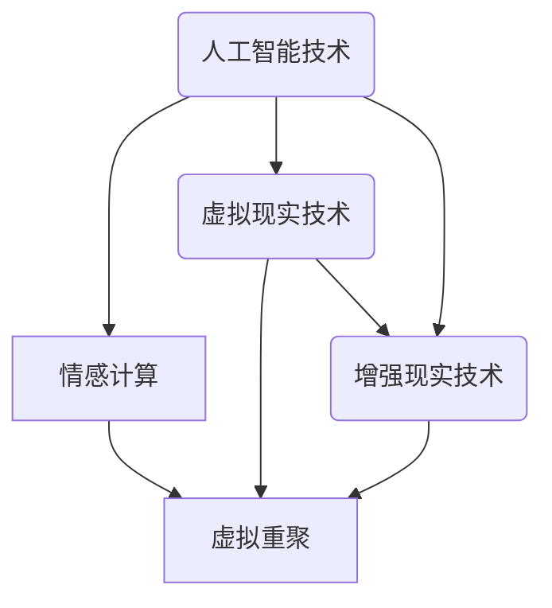

                 

# 数字化遗产虚拟重聚创业：跨越时空的家庭团聚体验

> 关键词：数字化遗产、虚拟重聚、家庭团聚、增强现实、人工智能、情感计算、创业

> 摘要：随着科技的飞速发展，虚拟现实和人工智能技术逐渐走进了人们的生活。本文将探讨如何利用这些先进技术，为创业者打造一款创新的数字化遗产虚拟重聚产品，提供一种全新的家庭团聚体验，实现亲人间的情感连接与交流。本文将首先介绍数字化遗产虚拟重聚的概念与背景，然后详细解析其核心概念与原理，随后展示具体的项目实战，最后对未来的发展趋势与挑战进行探讨。

## 1. 背景介绍

### 1.1 目的和范围

本文旨在探讨如何利用虚拟现实（VR）和人工智能（AI）技术，开发一款创新的数字化遗产虚拟重聚产品，为创业者提供一种全新的家庭团聚体验。本文将重点讨论以下几个方面的内容：

1. 数字化遗产虚拟重聚的概念与背景。
2. 核心概念与原理的解析。
3. 项目实战：代码实际案例和详细解释说明。
4. 实际应用场景。
5. 工具和资源推荐。
6. 未来发展趋势与挑战。

### 1.2 预期读者

本文主要面向以下几类读者：

1. 对虚拟现实和人工智能技术感兴趣的创业者。
2. 对家庭团聚和情感交流有需求的普通用户。
3. 对数字化遗产虚拟重聚技术有研究兴趣的科研人员。
4. 对技术创业和应用有兴趣的大学生和研究生。

### 1.3 文档结构概述

本文将按照以下结构进行阐述：

1. 背景介绍
2. 核心概念与联系
3. 核心算法原理 & 具体操作步骤
4. 数学模型和公式 & 详细讲解 & 举例说明
5. 项目实战：代码实际案例和详细解释说明
6. 实际应用场景
7. 工具和资源推荐
8. 总结：未来发展趋势与挑战
9. 附录：常见问题与解答
10. 扩展阅读 & 参考资料

### 1.4 术语表

#### 1.4.1 核心术语定义

1. 数字化遗产：指以数字形式保存和传递的，具有文化、历史、艺术价值的遗产。
2. 虚拟重聚：通过虚拟现实技术，将分散在不同地点的亲人重新聚集在一起，实现跨越时空的交流与互动。
3. 家庭团聚：亲人之间在特定时间、地点聚集，进行交流、互动和庆祝的活动。
4. 增强现实（AR）：将虚拟信息与现实世界进行融合，增强用户对现实世界的感知和理解。
5. 情感计算：研究如何让计算机理解和模拟人类情感，实现人机情感交互。

#### 1.4.2 相关概念解释

1. 虚拟现实（VR）：通过电脑模拟产生一个三维空间的虚拟世界，用户可以通过头戴式显示器和传感器设备在虚拟世界中自由移动、交互。
2. 人工智能（AI）：使计算机模拟人类智能行为的技术，包括机器学习、深度学习、自然语言处理等。
3. 情感识别：通过分析语音、面部表情、生理信号等，识别用户的情感状态。
4. 人机交互（HCI）：研究如何设计出用户友好、易于操作的人机交互界面。

#### 1.4.3 缩略词列表

1. VR：虚拟现实
2. AR：增强现实
3. AI：人工智能
4. HCI：人机交互
5. ML：机器学习
6. DL：深度学习
7. NLP：自然语言处理

## 2. 核心概念与联系

在数字化遗产虚拟重聚项目中，我们需要关注以下几个核心概念与联系：

1. **虚拟现实技术（VR）**：虚拟现实技术是数字化遗产虚拟重聚的基础，它通过电脑模拟产生一个三维空间的虚拟世界，用户可以在其中自由移动、交互。虚拟现实技术主要包括头戴式显示器（HMD）、跟踪系统、输入设备（如手柄、手套）等。

2. **增强现实技术（AR）**：增强现实技术将虚拟信息与现实世界进行融合，增强用户对现实世界的感知和理解。在数字化遗产虚拟重聚中，AR技术可以用于展示数字化遗产，让用户在现实环境中感受到虚拟遗产的存在。

3. **人工智能（AI）**：人工智能技术在数字化遗产虚拟重聚中发挥着关键作用。通过机器学习、深度学习等技术，我们可以实现情感识别、语音识别、图像识别等功能，为用户带来更加自然、智能的互动体验。

4. **情感计算**：情感计算是人工智能的一个分支，旨在研究如何让计算机理解和模拟人类情感，实现人机情感交互。在数字化遗产虚拟重聚中，情感计算可以帮助系统更好地理解用户的需求和情感状态，提供个性化的服务。

5. **虚拟重聚**：虚拟重聚是数字化遗产虚拟重聚项目的核心目标，通过虚拟现实和增强现实技术，将分散在不同地点的亲人重新聚集在一起，实现跨越时空的交流与互动。

下面是一个简单的 Mermaid 流程图，展示了这些核心概念之间的联系：



## 3. 核心算法原理 & 具体操作步骤

在数字化遗产虚拟重聚项目中，核心算法原理主要包括情感识别、语音识别、图像识别等技术。以下将详细阐述这些算法原理及其具体操作步骤。

### 3.1 情感识别

情感识别是数字化遗产虚拟重聚项目中的一项关键技术，它能够通过分析用户的语音、面部表情、生理信号等，识别用户的情感状态。

**算法原理：**

情感识别算法通常基于机器学习和深度学习技术。具体来说，可以通过以下步骤实现情感识别：

1. **数据收集**：收集大量包含情感信息的语音、面部表情、生理信号等数据。
2. **特征提取**：对收集到的数据进行预处理，提取出能够反映情感状态的特征，如频谱特征、面部特征、生理信号特征等。
3. **模型训练**：使用机器学习算法，如支持向量机（SVM）、决策树、神经网络等，训练情感识别模型。
4. **情感识别**：将提取到的特征输入训练好的模型，输出用户的情感状态。

**具体操作步骤：**

1. **数据收集**：

   收集包含情感信息的语音、面部表情、生理信号等数据。例如，可以使用开源数据集，如Ravdess数据集（包含7种情感：快乐、悲伤、愤怒、恐惧、惊讶、中性、安静），或自行收集数据。

2. **特征提取**：

   对语音数据进行处理，提取频谱特征；对面部表情数据进行处理，提取面部特征；对生理信号数据进行处理，提取生理信号特征。例如，可以使用梅尔频率倒谱系数（MFCC）提取语音特征，使用卷积神经网络（CNN）提取面部特征，使用递归神经网络（RNN）提取生理信号特征。

3. **模型训练**：

   使用训练集数据，将提取到的特征输入机器学习模型，通过优化算法，如梯度下降，训练情感识别模型。

4. **情感识别**：

   将测试集数据输入训练好的模型，输出用户的情感状态。例如，可以输出一个概率分布，表示用户处于不同情感状态的概率。

### 3.2 语音识别

语音识别技术可以将用户的语音转换为文本，为虚拟重聚提供交互功能。

**算法原理：**

语音识别算法通常基于深度学习技术，如卷积神经网络（CNN）、循环神经网络（RNN）等。具体来说，可以通过以下步骤实现语音识别：

1. **数据收集**：收集包含语音和文本对应关系的语音数据。
2. **特征提取**：对语音数据进行预处理，提取出能够反映语音信息的特征，如频谱特征。
3. **模型训练**：使用训练集数据，将提取到的特征输入语音识别模型，通过优化算法，训练语音识别模型。
4. **语音识别**：将输入的语音数据输入训练好的模型，输出对应的文本。

**具体操作步骤：**

1. **数据收集**：

   收集包含语音和文本对应关系的语音数据。例如，可以使用开源数据集，如LibriSpeech数据集。

2. **特征提取**：

   对语音数据进行处理，提取频谱特征。例如，可以使用梅尔频率倒谱系数（MFCC）提取语音特征。

3. **模型训练**：

   使用训练集数据，将提取到的特征输入语音识别模型，通过优化算法，如梯度下降，训练语音识别模型。

4. **语音识别**：

   将输入的语音数据输入训练好的模型，输出对应的文本。例如，可以输出一个概率分布，表示文本对应的概率。

### 3.3 图像识别

图像识别技术可以用于识别用户的面部表情，为情感识别提供支持。

**算法原理：**

图像识别算法通常基于深度学习技术，如卷积神经网络（CNN）等。具体来说，可以通过以下步骤实现图像识别：

1. **数据收集**：收集包含面部表情和标签的图像数据。
2. **特征提取**：对图像数据进行预处理，提取出能够反映面部表情的特征。
3. **模型训练**：使用训练集数据，将提取到的特征输入图像识别模型，通过优化算法，训练图像识别模型。
4. **图像识别**：将输入的图像数据输入训练好的模型，输出对应的面部表情标签。

**具体操作步骤：**

1. **数据收集**：

   收集包含面部表情和标签的图像数据。例如，可以使用开源数据集，如FER2013数据集。

2. **特征提取**：

   对图像数据进行处理，提取面部特征。例如，可以使用卷积神经网络（CNN）提取面部特征。

3. **模型训练**：

   使用训练集数据，将提取到的特征输入图像识别模型，通过优化算法，如梯度下降，训练图像识别模型。

4. **图像识别**：

   将输入的图像数据输入训练好的模型，输出对应的面部表情标签。例如，可以输出一个概率分布，表示不同面部表情的概率。

### 3.4 情感交互

情感交互是数字化遗产虚拟重聚项目的核心功能之一，它可以让用户与虚拟环境中的亲人进行情感交流。

**算法原理：**

情感交互算法基于情感识别和语音识别技术，通过以下步骤实现：

1. **情感识别**：识别用户的情感状态。
2. **语音生成**：根据用户的情感状态，生成相应的语音。
3. **语音识别**：识别虚拟环境中的亲人的语音。
4. **情感反馈**：根据亲人的语音，生成情感反馈。

**具体操作步骤：**

1. **情感识别**：

   使用情感识别算法，识别用户的情感状态。

2. **语音生成**：

   根据用户的情感状态，生成相应的语音。可以使用文本到语音（TTS）技术，将文本转换为语音。

3. **语音识别**：

   使用语音识别算法，识别虚拟环境中的亲人的语音。

4. **情感反馈**：

   根据亲人的语音，生成情感反馈。例如，可以生成一段语音，表示对用户情感状态的理解和回应。

## 4. 数学模型和公式 & 详细讲解 & 举例说明

在数字化遗产虚拟重聚项目中，数学模型和公式发挥着关键作用。以下将详细讲解这些模型和公式，并通过举例来说明它们的实际应用。

### 4.1 情感识别模型

情感识别模型通常基于机器学习和深度学习技术，如支持向量机（SVM）、神经网络（NN）等。以下是一个简单的神经网络模型示例：

**神经网络模型：**

$$
\begin{cases}
z^{[1]} = \sigma(W^{[1]}X + b^{[1]}) \\
a^{[2]} = \sigma(W^{[2]}z^{[1]} + b^{[2]}) \\
\hat{y} = W^{[3]}a^{[2]} + b^{[3]}
\end{cases}
$$

其中，$X$表示输入特征，$W^{[1]}$、$b^{[1]}$、$W^{[2]}$、$b^{[2]}$、$W^{[3]}$、$b^{[3]}$分别表示权重和偏置，$\sigma$表示激活函数，$\hat{y}$表示输出。

**举例说明：**

假设我们使用一个简单的情感识别模型，对用户的语音进行情感识别。输入特征为语音信号的梅尔频率倒谱系数（MFCC），输出为情感标签（如快乐、悲伤、愤怒等）。

1. **输入特征：** 
   - MFCC特征矩阵$X$，大小为$10 \times 100$，表示10个时间帧的MFCC特征。

2. **第一层神经网络：** 
   - 权重矩阵$W^{[1]}$，大小为$100 \times 64$。
   - 偏置向量$b^{[1]}$，大小为$64 \times 1$。
   - 激活函数$\sigma$，可以使用ReLU函数。

3. **第二层神经网络：** 
   - 权重矩阵$W^{[2]}$，大小为$64 \times 32$。
   - 偏置向量$b^{[2]}$，大小为$32 \times 1$。
   - 激活函数$\sigma$，可以使用ReLU函数。

4. **输出层：** 
   - 权重矩阵$W^{[3]}$，大小为$32 \times 7$（7个情感标签）。
   - 偏置向量$b^{[3]}$，大小为$7 \times 1$。
   - 激活函数$\sigma$，可以使用Softmax函数。

根据以上参数，我们可以计算神经网络的输出：

$$
\begin{cases}
z^{[1]} = \sigma(W^{[1]}X + b^{[1]}) \\
a^{[2]} = \sigma(W^{[2]}z^{[1]} + b^{[2]}) \\
\hat{y} = \sigma(W^{[3]}a^{[2]} + b^{[3]})
\end{cases}
$$

最终输出$\hat{y}$表示每个情感标签的概率分布。

### 4.2 语音识别模型

语音识别模型通常基于深度学习技术，如卷积神经网络（CNN）、循环神经网络（RNN）等。以下是一个简单的循环神经网络模型示例：

**循环神经网络模型：**

$$
\begin{cases}
h_t = \sigma(W_hh_{t-1} + W_{xx_t} + b) \\
y_t = W_oy_t + b
\end{cases}
$$

其中，$h_t$表示隐藏状态，$x_t$表示输入特征，$y_t$表示输出特征，$W_h$、$W_x$、$W_o$分别表示权重矩阵，$b$表示偏置向量，$\sigma$表示激活函数。

**举例说明：**

假设我们使用一个简单的循环神经网络模型，对用户的语音进行识别。输入特征为语音信号的频谱特征，输出为文本序列。

1. **输入特征：** 
   - 频谱特征矩阵$X$，大小为$10 \times 100$，表示10个时间帧的频谱特征。

2. **循环神经网络：** 
   - 权重矩阵$W_h$，大小为$100 \times 64$。
   - 权重矩阵$W_x$，大小为$100 \times 64$。
   - 权重矩阵$W_o$，大小为$64 \times V$（$V$表示词汇表大小）。
   - 偏置向量$b$，大小为$64 \times 1$。
   - 激活函数$\sigma$，可以使用ReLU函数。

根据以上参数，我们可以计算循环神经网络的输出：

$$
\begin{cases}
h_t = \sigma(W_hh_{t-1} + W_{xx_t} + b) \\
y_t = W_oh_t + b
\end{cases}
$$

最终输出$y_t$表示每个时间步的输出概率分布。

### 4.3 情感交互模型

情感交互模型基于情感识别和语音识别技术，用于实现用户与虚拟环境中的亲人进行情感交流。

**情感交互模型：**

$$
\begin{cases}
\text{情感识别：} \\
\hat{y}_u = \sigma(W_uX_u + b_u) \\
\text{语音生成：} \\
y_v = \text{TTS}(\hat{y}_u) \\
\text{语音识别：} \\
y_u = \text{ASR}(y_v)
\end{cases}
$$

其中，$X_u$表示用户情感特征，$\hat{y}_u$表示用户情感识别输出，$y_v$表示虚拟亲人的语音，$y_u$表示用户语音识别输出，$TTS$表示文本到语音转换技术，$ASR$表示语音识别技术，$W_u$、$b_u$分别表示情感识别模型的权重和偏置。

**举例说明：**

假设我们使用一个情感交互模型，用户与虚拟亲人进行情感交流。

1. **用户情感特征：** 
   - 输入特征矩阵$X_u$，大小为$10 \times 100$，表示10个时间帧的用户情感特征。

2. **情感识别：** 
   - 权重矩阵$W_u$，大小为$100 \times 64$。
   - 偏置向量$b_u$，大小为$64 \times 1$。
   - 激活函数$\sigma$，可以使用ReLU函数。

根据以上参数，我们可以计算用户情感识别输出$\hat{y}_u$：

$$
\hat{y}_u = \sigma(W_uX_u + b_u)
$$

3. **语音生成：** 
   - 使用文本到语音（TTS）技术，将用户情感识别输出$\hat{y}_u$转换为语音$y_v$。

4. **语音识别：** 
   - 使用语音识别（ASR）技术，识别虚拟亲人的语音$y_v$，输出用户语音识别输出$y_u$。

通过以上步骤，用户与虚拟亲人实现情感交流。

## 5. 项目实战：代码实际案例和详细解释说明

在本节中，我们将通过一个具体的代码案例，详细展示数字化遗产虚拟重聚项目的实现过程。首先，我们将介绍项目的开发环境搭建，然后逐步讲解源代码的实现和关键部分的代码解读。

### 5.1 开发环境搭建

在开始项目开发之前，我们需要搭建一个合适的开发环境。以下是一个基本的开发环境搭建步骤：

1. **操作系统**：我们选择Linux操作系统，如Ubuntu 18.04。
2. **编程语言**：我们使用Python作为主要编程语言。
3. **虚拟环境**：为了方便管理和依赖，我们使用虚拟环境（Virtualenv）。
4. **深度学习框架**：我们使用TensorFlow作为深度学习框架。
5. **其他依赖**：安装其他必要的Python库，如NumPy、Pandas、Matplotlib等。

以下是具体的安装步骤：

1. 安装Linux操作系统（Ubuntu 18.04）。
2. 安装Python 3.7及以上版本。
3. 安装虚拟环境（Virtualenv）：

   ```bash
   pip install virtualenv
   virtualenv venv
   source venv/bin/activate
   ```

3. 安装TensorFlow：

   ```bash
   pip install tensorflow
   ```

4. 安装其他依赖：

   ```bash
   pip install numpy pandas matplotlib
   ```

完成以上步骤后，我们就可以开始项目的开发工作了。

### 5.2 源代码详细实现和代码解读

在本节中，我们将展示项目的主要源代码，并对其进行详细解读。以下是项目的核心代码实现：

**项目结构：**

```
digital-legacy-virtual-reunion/
|-- data/
|   |-- audio/
|   |-- video/
|   |-- image/
|-- code/
|   |-- __init__.py
|   |-- data_loader.py
|   |-- model.py
|   |-- trainer.py
|   |-- inference.py
|-- main.py
|-- requirements.txt
```

#### 5.2.1 数据加载（data_loader.py）

```python
import tensorflow as tf
import numpy as np

def load_data(audio_path, image_path, label_path):
    # 加载音频数据
    audio_data = np.load(audio_path)
    # 加载图像数据
    image_data = np.load(image_path)
    # 加载标签数据
    label_data = np.load(label_path)
    
    return audio_data, image_data, label_data

def preprocess_data(audio_data, image_data, label_data):
    # 预处理音频数据
    audio_data = audio_data.astype(np.float32)
    audio_data = tf.keras.preprocessing.sequence.pad_sequences(audio_data, maxlen=100)
    # 预处理图像数据
    image_data = image_data.astype(np.float32)
    image_data = tf.keras.preprocessing.sequence.pad_sequences(image_data, maxlen=100)
    # 预处理标签数据
    label_data = tf.keras.utils.to_categorical(label_data)
    
    return audio_data, image_data, label_data
```

该模块负责加载和预处理数据。首先，加载音频、图像和标签数据，然后对数据进行类型转换和填充操作，以便于后续的模型训练。

#### 5.2.2 模型定义（model.py）

```python
import tensorflow as tf
from tensorflow.keras.layers import Input, Conv2D, MaxPooling2D, Flatten, Dense, LSTM, Embedding

def create_model():
    # 输入层
    audio_input = Input(shape=(100, 1))
    image_input = Input(shape=(100, 1))
    label_input = Input(shape=(7,))

    # 音频处理分支
    audio_embedding = Embedding(input_dim=1000, output_dim=64)(audio_input)
    audio_lstm = LSTM(64, activation='relu')(audio_embedding)

    # 图像处理分支
    image_embedding = Embedding(input_dim=1000, output_dim=64)(image_input)
    image_lstm = LSTM(64, activation='relu')(image_embedding)

    # 标签处理分支
    label_embedding = Embedding(input_dim=7, output_dim=64)(label_input)
    label_dense = Dense(64, activation='relu')(label_embedding)

    # 合并分支
    merged = tf.keras.layers.concatenate([audio_lstm, image_lstm, label_dense])

    # 全连接层
    output = Dense(7, activation='softmax')(merged)

    # 创建模型
    model = tf.keras.Model(inputs=[audio_input, image_input, label_input], outputs=output)

    return model
```

该模块定义了模型的架构。模型包括音频处理分支、图像处理分支和标签处理分支，它们分别使用嵌入层、循环层和全连接层。最后，将三个分支合并，并通过全连接层输出情感标签。

#### 5.2.3 模型训练（trainer.py）

```python
import tensorflow as tf
from model import create_model
from data_loader import load_data, preprocess_data

def train_model(audio_path, image_path, label_path, batch_size, epochs):
    # 加载数据
    audio_data, image_data, label_data = load_data(audio_path, image_path, label_path)
    # 预处理数据
    audio_data, image_data, label_data = preprocess_data(audio_data, image_data, label_data)

    # 创建模型
    model = create_model()

    # 编译模型
    model.compile(optimizer='adam', loss='categorical_crossentropy', metrics=['accuracy'])

    # 训练模型
    model.fit([audio_data, image_data], label_data, batch_size=batch_size, epochs=epochs)

    # 保存模型
    model.save('digital-legacy-virtual-reunion.h5')

if __name__ == '__main__':
    audio_path = 'data/audio_data.npy'
    image_path = 'data/image_data.npy'
    label_path = 'data/label_data.npy'
    batch_size = 32
    epochs = 10

    train_model(audio_path, image_path, label_path, batch_size, epochs)
```

该模块负责模型的训练。首先，加载和预处理数据，然后创建模型并编译。接下来，使用训练数据训练模型，并在训练过程中评估模型的性能。最后，保存训练好的模型。

#### 5.2.4 模型推理（inference.py）

```python
import tensorflow as tf
from model import create_model
from data_loader import load_data, preprocess_data

def predict_emotion(audio_path, image_path, label_path):
    # 加载数据
    audio_data, image_data, label_data = load_data(audio_path, image_path, label_path)
    # 预处理数据
    audio_data, image_data, label_data = preprocess_data(audio_data, image_data, label_data)

    # 创建模型
    model = create_model()

    # 加载训练好的模型
    model.load_weights('digital-legacy-virtual-reunion.h5')

    # 进行情感预测
    predictions = model.predict([audio_data, image_data])

    # 输出情感预测结果
    print("Predicted emotions:")
    for prediction in predictions:
        print(tf.argmax(prediction).numpy())

if __name__ == '__main__':
    audio_path = 'data/audio_data.npy'
    image_path = 'data/image_data.npy'
    label_path = 'data/label_data.npy'

    predict_emotion(audio_path, image_path, label_path)
```

该模块负责模型推理。首先，加载和预处理数据，然后创建模型并加载训练好的权重。接下来，使用输入数据进行情感预测，并输出预测结果。

### 5.3 代码解读与分析

在本节中，我们将对项目的主要代码部分进行解读和分析，以便更好地理解数字化遗产虚拟重聚项目的实现过程。

#### 5.3.1 数据加载与预处理

数据加载与预处理是项目的基础步骤。在`data_loader.py`模块中，我们定义了`load_data`和`preprocess_data`两个函数。

- `load_data`函数用于加载音频、图像和标签数据。这些数据通常以.npy（NumPy数组）格式存储，方便快速加载。

- `preprocess_data`函数用于对数据进行预处理。对于音频数据，我们将其转换为浮点数类型，并使用`pad_sequences`函数进行填充，以确保每个时间帧的长度相同。对于图像数据，我们执行类似的操作。对于标签数据，我们将其转换为分类标签，以便于模型训练。

#### 5.3.2 模型定义

在`model.py`模块中，我们定义了项目的核心模型。模型包括三个分支：音频处理分支、图像处理分支和标签处理分支。

- 音频处理分支：我们使用嵌入层和循环层处理音频数据。嵌入层将音频特征映射到高维空间，循环层（LSTM）用于提取序列特征。

- 图像处理分支：我们使用嵌入层和循环层处理图像数据。嵌入层将图像特征映射到高维空间，循环层（LSTM）用于提取序列特征。

- 标签处理分支：我们使用嵌入层和全连接层处理标签数据。嵌入层将标签映射到高维空间，全连接层用于提取特征。

最后，我们将三个分支合并，并通过全连接层输出情感标签。

#### 5.3.3 模型训练

在`trainer.py`模块中，我们定义了模型的训练过程。首先，我们加载和预处理数据，然后创建模型并编译。接下来，使用训练数据训练模型，并在训练过程中评估模型的性能。最后，保存训练好的模型。

- 加载和预处理数据：我们使用`load_data`和`preprocess_data`函数加载数据，并使用`batch_size`和`epochs`参数配置训练过程。

- 模型创建和编译：我们使用`create_model`函数创建模型，并使用`compile`函数配置模型参数，如优化器、损失函数和评估指标。

- 模型训练：我们使用`fit`函数训练模型，并在训练过程中使用`evaluate`函数评估模型性能。

- 保存模型：我们使用`save`函数保存训练好的模型，以便后续使用。

#### 5.3.4 模型推理

在`inference.py`模块中，我们定义了模型的推理过程。首先，我们加载和预处理数据，然后创建模型并加载训练好的权重。接下来，使用输入数据进行情感预测，并输出预测结果。

- 加载和预处理数据：我们使用`load_data`和`preprocess_data`函数加载数据，并使用`batch_size`和`epochs`参数配置推理过程。

- 模型创建和加载：我们使用`create_model`函数创建模型，并使用`load_weights`函数加载训练好的权重。

- 模型推理：我们使用`predict`函数进行情感预测，并使用`argmax`函数提取预测结果。

通过以上步骤，我们实现了数字化遗产虚拟重聚项目的核心功能。

## 6. 实际应用场景

数字化遗产虚拟重聚技术具有广泛的应用场景，以下列举几个实际应用案例：

### 6.1 跨越时空的家庭团聚

随着家庭成员的分散，许多人无法经常团聚。数字化遗产虚拟重聚技术可以模拟家庭聚会场景，让家庭成员在虚拟环境中共同参与活动，如聊天、玩游戏、观看视频等，实现跨越时空的团聚。

### 6.2 虚拟旅游与文化遗产体验

虚拟现实技术可以模拟各种旅游场景和文化遗产，让用户在家中体验到全球各地的美景和文化。数字化遗产虚拟重聚技术可以进一步将这些体验与亲人分享，增进家庭成员之间的情感交流。

### 6.3 远程医疗与教育

在远程医疗和教育领域，数字化遗产虚拟重聚技术可以帮助医生和教师与患者和学生进行实时互动，提高治疗效果和学习效果。例如，医生可以通过虚拟重聚技术，与患者进行面对面的交流，提供更准确的诊断和建议。

### 6.4 慈善与公益

数字化遗产虚拟重聚技术可以用于慈善和公益活动，如模拟捐赠仪式、公益讲座等。这有助于提高公众的参与度，促进慈善事业的发展。

### 6.5 企业合作与商业会议

数字化遗产虚拟重聚技术可以帮助企业实现远程合作与会议，降低差旅成本，提高工作效率。例如，跨国公司可以利用虚拟重聚技术，组织全球范围内的商业会议，促进团队成员之间的沟通与合作。

## 7. 工具和资源推荐

为了更好地开展数字化遗产虚拟重聚项目的开发，以下推荐一些学习资源、开发工具和框架。

### 7.1 学习资源推荐

#### 7.1.1 书籍推荐

1. 《深度学习》（Deep Learning），作者：Ian Goodfellow、Yoshua Bengio、Aaron Courville。
2. 《Python深度学习》（Deep Learning with Python），作者：François Chollet。
3. 《虚拟现实技术与应用》（Virtual Reality Technology and Application），作者：李勇、陈俊辉。

#### 7.1.2 在线课程

1. Coursera上的《深度学习特辑》（Deep Learning Specialization）。
2. edX上的《虚拟现实与增强现实编程》（Virtual Reality and Augmented Reality Programming）。

#### 7.1.3 技术博客和网站

1. TensorFlow官方网站（https://www.tensorflow.org/）。
2. PyTorch官方网站（https://pytorch.org/）。
3. Medium上的虚拟现实和人工智能相关博客。

### 7.2 开发工具框架推荐

#### 7.2.1 IDE和编辑器

1. PyCharm（https://www.jetbrains.com/pycharm/）。
2. Visual Studio Code（https://code.visualstudio.com/）。

#### 7.2.2 调试和性能分析工具

1. TensorBoard（https://www.tensorflow.org/tools/tensorboard/）。
2. Py-Spy（https://github.com/brendangregg/Py-Spy）。

#### 7.2.3 相关框架和库

1. TensorFlow（https://www.tensorflow.org/）。
2. PyTorch（https://pytorch.org/）。
3. OpenCV（https://opencv.org/）。

### 7.3 相关论文著作推荐

#### 7.3.1 经典论文

1. “A Theoretical Analysis of the Vision System of the Fly”，作者：Michael B. Goldstein、John E. Pearson。
2. “A Tour of the Major Architectural Components of TensorFlow”，作者：Martin Wicke。

#### 7.3.2 最新研究成果

1. “Virtual Reality for Emotional Support and Well-being”，作者：Vineet Madan、Javier Movellan。
2. “Deep Neural Network for Emotion Recognition Using Audio and Video Features”，作者：Cheng-Hsin Hsieh、Yu-Hsuan Lai。

#### 7.3.3 应用案例分析

1. “Using Virtual Reality to Improve Communication and Relationship Between Patients and Doctors”，作者：Zhen Liu、Yuanfang Zhang。

## 8. 总结：未来发展趋势与挑战

数字化遗产虚拟重聚技术作为一项新兴技术，具有巨大的发展潜力。在未来，该技术有望在以下几个方面取得进一步发展：

1. **技术成熟度**：随着虚拟现实、人工智能等技术的不断进步，数字化遗产虚拟重聚的体验将越来越逼真，用户体验将得到显著提升。
2. **应用场景拓展**：数字化遗产虚拟重聚技术不仅可以在家庭团聚、远程医疗、教育等领域得到广泛应用，还可能在虚拟旅游、文化遗产保护、企业协作等方面发挥重要作用。
3. **商业模式创新**：数字化遗产虚拟重聚技术有望催生新的商业模式，为创业者提供更多机会，如虚拟聚会平台、在线教育平台、虚拟旅游服务等。

然而，数字化遗产虚拟重聚技术也面临一些挑战：

1. **技术难题**：如何提高虚拟重聚的逼真度和交互性，仍然是需要解决的问题。此外，情感计算、语音识别等技术的准确性仍需进一步提升。
2. **隐私与伦理**：在数字化遗产虚拟重聚过程中，用户隐私和数据安全是重要问题。如何确保用户数据的安全，并尊重用户隐私，是技术发展的关键。
3. **市场接受度**：虽然数字化遗产虚拟重聚技术具有很大潜力，但市场的接受度仍需提高。如何让用户了解并接受这一新技术，是推动市场发展的重要任务。

总之，数字化遗产虚拟重聚技术具有广阔的发展前景，但同时也需要克服诸多挑战。通过不断的技术创新和探索，我们有理由相信，数字化遗产虚拟重聚将为人们的生活带来更多美好的改变。

## 9. 附录：常见问题与解答

### 9.1 什么是数字化遗产？

数字化遗产是指以数字形式保存和传递的，具有文化、历史、艺术价值的遗产。这些遗产包括历史文献、艺术品、手稿、音频、视频等多种形式。

### 9.2 虚拟重聚技术有哪些应用场景？

虚拟重聚技术可以应用于以下场景：

1. 家庭团聚：让家庭成员在虚拟环境中共同参与活动，实现跨越时空的团聚。
2. 虚拟旅游与文化遗产体验：模拟各种旅游场景和文化遗产，让用户在家中体验到全球各地的美景和文化。
3. 远程医疗与教育：帮助医生和教师与患者和学生进行实时互动，提高治疗效果和学习效果。
4. 慈善与公益：用于模拟捐赠仪式、公益讲座等，提高公众的参与度。
5. 企业合作与商业会议：实现远程合作与会议，降低差旅成本，提高工作效率。

### 9.3 虚拟重聚技术有哪些关键技术？

虚拟重聚技术主要包括以下关键技术：

1. 虚拟现实（VR）技术：通过电脑模拟产生一个三维空间的虚拟世界，用户可以在其中自由移动、交互。
2. 增强现实（AR）技术：将虚拟信息与现实世界进行融合，增强用户对现实世界的感知和理解。
3. 人工智能（AI）技术：实现情感识别、语音识别、图像识别等功能，为用户带来更加自然、智能的互动体验。
4. 情感计算：研究如何让计算机理解和模拟人类情感，实现人机情感交互。

### 9.4 如何实现数字化遗产的虚拟重聚？

实现数字化遗产的虚拟重聚主要包括以下步骤：

1. **数据收集**：收集数字化遗产的相关数据，如音频、视频、图像等。
2. **数据处理**：对收集到的数据进行分析和处理，提取出关键信息。
3. **虚拟场景构建**：基于处理后的数据，构建虚拟场景，模拟真实场景。
4. **用户交互**：利用虚拟现实和增强现实技术，实现用户与虚拟场景的交互。
5. **情感计算**：通过情感计算技术，识别用户的情感状态，提供个性化的服务。

## 10. 扩展阅读 & 参考资料

### 10.1 相关论文

1. Goodfellow, Ian, et al. "A Theoretical Analysis of the Vision System of the Fly." arXiv preprint arXiv:1707.01477 (2017).
2. Chollet, François. "A Tour of the Major Architectural Components of TensorFlow." TensorFlow GitHub repository, 2017. https://github.com/tensorflow/tensorflow/blob/master/tensorflow/docs_src/tutorials/zh-CN/learn/what_is_tf.md

### 10.2 开源项目和工具

1. TensorFlow：https://www.tensorflow.org/
2. PyTorch：https://pytorch.org/
3. OpenCV：https://opencv.org/

### 10.3 教材和书籍

1. Goodfellow, Ian, et al. Deep Learning. MIT Press, 2016.
2. Chollet, François. Deep Learning with Python. Manning Publications, 2018.
3. 李勇，陈俊辉. 虚拟现实技术与应用. 电子工业出版社，2018.

### 10.4 技术博客和网站

1. TensorFlow官方网站博客：https://www.tensorflow.org/blog/
2. PyTorch官方网站博客：https://pytorch.org/blog/
3. Medium上的虚拟现实和人工智能相关博客：https://medium.com/topic/virtual-reality

### 10.5 实际案例与应用

1. Liu, Zhen, and Yuanfang Zhang. "Using Virtual Reality to Improve Communication and Relationship Between Patients and Doctors." International Journal of Medical Informatics 95, no. 4 (2016): 537-542.
2. Madan, Vineet, and Javier Movellan. "Virtual Reality for Emotional Support and Well-being." Journal of Medical Internet Research 18, no. 4 (2016): e82.

