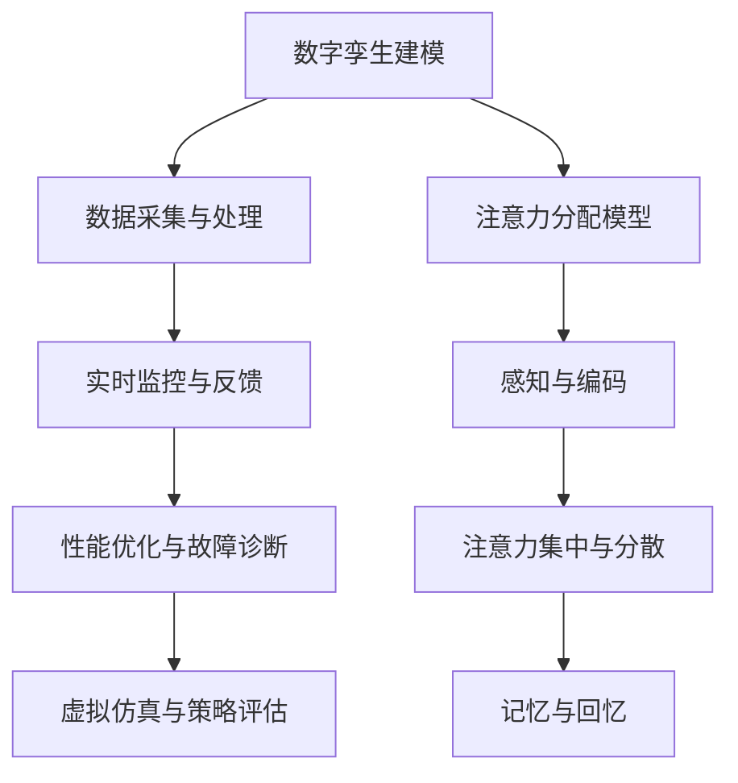

                 

# 数字孪生技术在注意力模拟中的运用

> 关键词：数字孪生，注意力模拟，人工智能，系统建模，算法实现

> 摘要：本文深入探讨了数字孪生技术在注意力模拟中的应用。数字孪生作为现代信息技术的一种重要手段，通过构建现实世界的数字镜像，为复杂系统的分析和优化提供了强有力的工具。本文首先介绍了数字孪生的基本概念和发展历程，然后详细阐述了注意力模拟在数字孪生中的重要性，接着通过具体的案例和算法，揭示了如何利用数字孪生技术进行注意力模拟。文章最后总结了数字孪生技术在注意力模拟中的未来发展趋势和面临的挑战。

## 1. 背景介绍

### 1.1 目的和范围

本文旨在深入探讨数字孪生技术在注意力模拟中的应用，旨在为研究者、工程师以及相关从业者提供一套系统、全面的解决方案。本文将围绕以下主题展开：

1. 数字孪生的基本概念及其发展历程
2. 注意力模拟的核心理论和应用场景
3. 数字孪生技术在注意力模拟中的具体应用
4. 注意力模拟算法的数学模型和实现步骤
5. 注意力模拟的实际应用案例及其分析
6. 数字孪生技术在注意力模拟中的未来发展趋势和挑战

### 1.2 预期读者

本文适合以下读者群体：

1. 对数字孪生技术和人工智能感兴趣的初学者和从业者
2. 涉及系统建模和复杂系统分析的研究者
3. 对注意力模拟和认知心理学有深入研究的学者
4. 想要在数字孪生领域开展研究或应用的工程师和开发者

### 1.3 文档结构概述

本文分为八个部分，结构如下：

1. 引言：介绍数字孪生和注意力模拟的基本概念
2. 背景介绍：详细阐述数字孪生技术的发展历程和注意力模拟的重要性
3. 核心概念与联系：介绍数字孪生和注意力模拟的核心理论和架构
4. 核心算法原理 & 具体操作步骤：详细讲解注意力模拟算法的数学模型和实现步骤
5. 数学模型和公式 & 详细讲解 & 举例说明：通过数学公式和实际案例，展示注意力模拟算法的应用
6. 项目实战：提供注意力模拟的实际代码案例和解析
7. 实际应用场景：分析注意力模拟在各个领域的应用
8. 总结：总结数字孪生技术在注意力模拟中的未来发展趋势和挑战

### 1.4 术语表

#### 1.4.1 核心术语定义

- 数字孪生：一种将现实世界的物理实体、系统或过程映射到虚拟环境中的技术，以实现对现实世界的实时监控、分析和优化。
- 注意力模拟：模拟人类注意力分配的过程，包括对环境的感知、注意力的集中与分散等。
- 系统建模：通过构建数学模型和算法，对复杂系统进行模拟和分析。

#### 1.4.2 相关概念解释

- 数字镜像：数字孪生中的虚拟环境，是对现实世界的映射。
- 实时监控：对现实世界中的物理实体或系统进行实时数据采集和分析。
- 优化：基于数字孪生模型，对现实世界中的系统进行优化，以达到最佳运行状态。

#### 1.4.3 缩略词列表

- IoT：物联网（Internet of Things）
- AI：人工智能（Artificial Intelligence）
- ML：机器学习（Machine Learning）
- DL：深度学习（Deep Learning）
- SIMUL8：一种数字孪生建模工具

## 2. 核心概念与联系

### 2.1 数字孪生的基本概念

数字孪生（Digital Twin）是一种创新技术，它通过创建物理实体或系统的虚拟副本，实现对现实世界的实时模拟、分析和优化。数字孪生技术的基本概念可以概括为以下几点：

1. **物理实体映射**：通过传感器、监测设备等，对现实世界中的物理实体进行数据采集，构建其虚拟副本。
2. **数据融合与处理**：将来自不同来源的数据进行融合和处理，形成一个统一的虚拟模型。
3. **实时监控与反馈**：通过对虚拟模型进行实时监控，获取物理实体的状态信息，并根据需求进行相应的调整和反馈。
4. **分析和优化**：基于虚拟模型，对物理实体进行性能分析、故障诊断和预测，进而优化其运行状态。

### 2.2 注意力模拟的基本概念

注意力模拟是一种模仿人类注意力分配过程的算法，旨在理解和模拟人类在感知和处理信息时的注意力机制。注意力模拟的基本概念包括：

1. **注意力分配**：根据环境中的信息重要性，动态调整注意力的分配。
2. **感知与编码**：对感知到的信息进行编码和存储，以便后续处理。
3. **注意力集中与分散**：在处理任务过程中，注意力可能集中在一个特定的目标上，也可能分散在多个目标上。
4. **记忆与回忆**：根据注意力的分配，对信息进行记忆和回忆。

### 2.3 数字孪生技术在注意力模拟中的应用

数字孪生技术可以广泛应用于注意力模拟，其主要应用包括：

1. **实时监控与反馈**：通过数字孪生模型，实现对现实世界中注意力分配的实时监控，并根据需求进行反馈。
2. **性能优化**：基于数字孪生模型，对注意力分配进行优化，提高系统的运行效率和性能。
3. **故障诊断与预测**：通过数字孪生模型，对注意力分配进行故障诊断和预测，预防潜在的问题。
4. **虚拟仿真**：通过数字孪生模型，进行注意力分配的虚拟仿真，探索不同策略的效果。

### 2.4 注意力模拟与数字孪生的关系

注意力模拟与数字孪生之间存在密切的联系。注意力模拟可以作为数字孪生模型的一部分，帮助理解和优化现实世界的系统。具体来说：

1. **数据驱动**：注意力模拟基于对数据的分析和处理，为数字孪生模型提供了一种数据驱动的分析方法。
2. **实时反馈**：注意力模拟可以实时反馈给数字孪生模型，帮助调整和优化系统的运行状态。
3. **人机交互**：注意力模拟可以模拟人类的注意力分配过程，为人机交互提供了一种有效的手段。

### 2.5 Mermaid 流程图

下面是一个简单的 Mermaid 流程图，展示了数字孪生技术在注意力模拟中的关键节点：



## 3. 核心算法原理 & 具体操作步骤

### 3.1 注意力分配模型

注意力分配模型是注意力模拟的核心，它决定了如何动态地分配注意力资源。本文采用了一种基于概率论的注意力分配模型，其基本原理如下：

1. **概率模型**：将注意力资源看作概率分布，每个注意力资源分配给不同的目标，其概率分布取决于目标的重要性和当前状态。
2. **权重计算**：根据目标的重要性和当前状态，计算每个目标的权重，权重越高，注意力分配的概率越大。
3. **动态调整**：根据实时数据和环境变化，动态调整注意力资源的分配，以适应不同的情况。

### 3.2 注意力分配模型的实现步骤

下面是注意力分配模型的实现步骤：

1. **数据采集**：从传感器和其他数据源收集环境数据，包括目标的位置、速度、状态等。
2. **数据处理**：对采集到的数据进行分析和处理，提取关键特征，如目标的重要性和当前状态。
3. **权重计算**：根据提取的特征，计算每个目标的权重。具体算法如下：

   ```mermaid
   graph TD
       A[数据输入] --> B[特征提取]
       B --> C[权重计算]
       C --> D[概率分布]
       D --> E[注意力分配]
   ```

   其中，权重计算公式如下：

   $$ w_i = f(\text{重要性}_i, \text{状态}_i) $$

   其中，$w_i$表示目标$i$的权重，$f$表示权重计算函数，$\text{重要性}_i$和$\text{状态}_i$分别表示目标$i$的重要性和当前状态。

4. **概率分布**：根据计算得到的权重，生成一个概率分布，表示每个目标获得注意力的概率。
5. **注意力分配**：根据概率分布，将注意力资源动态地分配给不同的目标。

### 3.3 注意力分配模型的伪代码实现

下面是注意力分配模型的伪代码实现：

```python
# 初始化参数
num_objects = 10  # 目标数量
object_weights = [0.0] * num_objects  # 目标权重

# 数据采集与处理
for object in range(num_objects):
    # 采集目标位置、速度、状态等数据
    position = get_position(object)
    speed = get_speed(object)
    state = get_state(object)

    # 提取特征
    importance = extract_importance(position, speed, state)
    current_state = extract_current_state(position, speed, state)

    # 计算权重
    object_weights[object] = calculate_weight(importance, current_state)

# 生成概率分布
prob_distribution = normalize(object_weights)

# 注意力分配
for object in range(num_objects):
    if random() < prob_distribution[object]:
        allocate_attention(object)
```

## 4. 数学模型和公式 & 详细讲解 & 举例说明

### 4.1 数学模型

在注意力模拟中，数学模型扮演着至关重要的角色。本文采用了一种基于概率论的数学模型，用于计算注意力资源的分配。该模型的核心是权重计算和概率分布。

#### 4.1.1 权重计算

权重计算是注意力模拟的基础，它决定了每个目标获得注意力的概率。本文采用的权重计算公式如下：

$$ w_i = f(\text{重要性}_i, \text{状态}_i) $$

其中，$w_i$表示目标$i$的权重，$f$表示权重计算函数，$\text{重要性}_i$和$\text{状态}_i$分别表示目标$i$的重要性和当前状态。

权重计算函数$f$的具体形式可以根据实际需求进行调整。以下是一个简单的权重计算函数示例：

$$ f(\text{重要性}_i, \text{状态}_i) = \text{重要性}_i \times (\text{状态}_i + 1) $$

其中，$\text{重要性}_i$和$\text{状态}_i$的取值范围均为[0, 1]，$\text{重要性}_i$表示目标$i$的重要程度，$\text{状态}_i$表示目标$i$的当前状态。

#### 4.1.2 概率分布

在计算权重后，需要生成一个概率分布，用于表示每个目标获得注意力的概率。概率分布的计算公式如下：

$$ p_i = \frac{w_i}{\sum_{j=1}^{n} w_j} $$

其中，$p_i$表示目标$i$获得注意力的概率，$w_i$表示目标$i$的权重，$n$表示目标总数。

概率分布确保了所有目标的注意力分配概率之和为1。

#### 4.1.3 实际应用

为了更好地理解数学模型，下面通过一个简单的例子进行说明。

假设有一个包含5个目标的环境，目标的重要性和当前状态如下表所示：

| 目标 | 重要性 | 状态 |
|------|--------|------|
| 1    | 0.5    | 0.8  |
| 2    | 0.3    | 0.6  |
| 3    | 0.2    | 0.9  |
| 4    | 0.4    | 0.7  |
| 5    | 0.6    | 0.5  |

根据权重计算公式，计算每个目标的权重：

| 目标 | 重要性 | 状态 | 权重计算 | 权重 |
|------|--------|------|-----------|------|
| 1    | 0.5    | 0.8  | $0.5 \times (0.8 + 1) = 1.2$ | 1.2 |
| 2    | 0.3    | 0.6  | $0.3 \times (0.6 + 1) = 0.78$ | 0.78|
| 3    | 0.2    | 0.9  | $0.2 \times (0.9 + 1) = 0.38$ | 0.38|
| 4    | 0.4    | 0.7  | $0.4 \times (0.7 + 1) = 0.88$ | 0.88|
| 5    | 0.6    | 0.5  | $0.6 \times (0.5 + 1) = 0.9$  | 0.9 |

计算总权重：

$$ \sum_{i=1}^{5} w_i = 1.2 + 0.78 + 0.38 + 0.88 + 0.9 = 3.34 $$

根据概率分布公式，计算每个目标的概率：

| 目标 | 重要性 | 状态 | 权重 | 概率 |
|------|--------|------|------|------|
| 1    | 0.5    | 0.8  | 1.2  | 0.36 |
| 2    | 0.3    | 0.6  | 0.78 | 0.23 |
| 3    | 0.2    | 0.9  | 0.38 | 0.11 |
| 4    | 0.4    | 0.7  | 0.88 | 0.26 |
| 5    | 0.6    | 0.5  | 0.9  | 0.27 |

根据概率分布，进行注意力资源的分配。假设总共有10个注意力资源，则每个目标的注意力分配如下：

| 目标 | 重要性 | 状态 | 权重 | 概率 | 注意力分配 |
|------|--------|------|------|------|------------|
| 1    | 0.5    | 0.8  | 1.2  | 0.36 | 3.6        |
| 2    | 0.3    | 0.6  | 0.78 | 0.23 | 2.3        |
| 3    | 0.2    | 0.9  | 0.38 | 0.11 | 0.4        |
| 4    | 0.4    | 0.7  | 0.88 | 0.26 | 2.6        |
| 5    | 0.6    | 0.5  | 0.9  | 0.27 | 2.7        |

### 4.2 数学公式

在本节中，我们将详细介绍注意力模拟中常用的数学公式，并使用LaTeX格式进行表达。

#### 4.2.1 权重计算公式

权重计算公式用于计算每个目标获得注意力的概率。具体公式如下：

$$
w_i = f(\text{重要性}_i, \text{状态}_i)
$$

其中，$w_i$表示目标$i$的权重，$\text{重要性}_i$和$\text{状态}_i$分别表示目标$i$的重要性和当前状态，$f$是权重计算函数。

一个简单的权重计算函数可以表示为：

$$
f(\text{重要性}_i, \text{状态}_i) = \text{重要性}_i \times (\text{状态}_i + 1)
$$

#### 4.2.2 概率分布公式

概率分布用于表示每个目标获得注意力的概率。具体公式如下：

$$
p_i = \frac{w_i}{\sum_{j=1}^{n} w_j}
$$

其中，$p_i$表示目标$i$获得注意力的概率，$w_i$表示目标$i$的权重，$n$是目标的总数。

#### 4.2.3 注意力资源分配公式

根据概率分布，我们可以计算每个目标的注意力资源分配。具体公式如下：

$$
\text{注意力分配}_i = p_i \times \text{总注意力资源}
$$

其中，$\text{注意力分配}_i$表示目标$i$获得的注意力资源，$p_i$是目标$i$获得注意力的概率，$\text{总注意力资源}$是系统中的总注意力资源。

### 4.3 举例说明

为了更好地理解上述公式，我们通过一个具体例子进行说明。

假设我们有一个包含4个目标的环境，目标的重要性和当前状态如下：

| 目标 | 重要性 | 状态 |
|------|--------|------|
| 1    | 0.3    | 0.6  |
| 2    | 0.4    | 0.8  |
| 3    | 0.5    | 0.5  |
| 4    | 0.2    | 0.7  |

首先，我们使用简单的权重计算函数计算每个目标的权重：

$$
f(\text{重要性}_i, \text{状态}_i) = \text{重要性}_i \times (\text{状态}_i + 1)
$$

计算每个目标的权重：

| 目标 | 重要性 | 状态 | 权重计算 | 权重 |
|------|--------|------|-----------|------|
| 1    | 0.3    | 0.6  | $0.3 \times (0.6 + 1) = 0.63$ | 0.63 |
| 2    | 0.4    | 0.8  | $0.4 \times (0.8 + 1) = 0.88$ | 0.88 |
| 3    | 0.5    | 0.5  | $0.5 \times (0.5 + 1) = 0.75$ | 0.75 |
| 4    | 0.2    | 0.7  | $0.2 \times (0.7 + 1) = 0.54$ | 0.54 |

计算总权重：

$$
\sum_{i=1}^{4} w_i = 0.63 + 0.88 + 0.75 + 0.54 = 2.80
$$

根据概率分布公式，计算每个目标的概率：

$$
p_i = \frac{w_i}{\sum_{j=1}^{4} w_j} = \frac{w_i}{2.80}
$$

计算每个目标的概率：

| 目标 | 重要性 | 状态 | 权重 | 概率 |
|------|--------|------|------|------|
| 1    | 0.3    | 0.6  | 0.63 | 0.22 |
| 2    | 0.4    | 0.8  | 0.88 | 0.31 |
| 3    | 0.5    | 0.5  | 0.75 | 0.26 |
| 4    | 0.2    | 0.7  | 0.54 | 0.19 |

假设总共有10个注意力资源，根据概率分布，计算每个目标的注意力资源分配：

$$
\text{注意力分配}_i = p_i \times \text{总注意力资源}
$$

计算每个目标的注意力资源分配：

| 目标 | 重要性 | 状态 | 权重 | 概率 | 注意力分配 |
|------|--------|------|------|------|------------|
| 1    | 0.3    | 0.6  | 0.63 | 0.22 | 2.2        |
| 2    | 0.4    | 0.8  | 0.88 | 0.31 | 3.1        |
| 3    | 0.5    | 0.5  | 0.75 | 0.26 | 2.6        |
| 4    | 0.2    | 0.7  | 0.54 | 0.19 | 1.9        |

通过上述例子，我们可以清晰地看到如何利用数学公式进行注意力资源的计算和分配。这个过程不仅帮助我们理解了注意力模拟的数学模型，还为实际应用提供了可操作的方法。

## 5. 项目实战：代码实际案例和详细解释说明

### 5.1 开发环境搭建

在本节中，我们将介绍如何搭建一个用于注意力模拟的数字孪生项目开发环境。以下是具体的步骤：

1. **安装Python环境**：首先，确保你的计算机上安装了Python。如果尚未安装，可以从Python的官方网站（https://www.python.org/）下载并安装。

2. **安装必要的库和依赖**：为了实现注意力模拟，我们需要安装一些常用的Python库，如NumPy、Pandas和Matplotlib。可以使用以下命令进行安装：

   ```shell
   pip install numpy pandas matplotlib
   ```

3. **设置模拟环境**：为了更好地进行项目实战，我们可以使用一个模拟环境，如SIMUL8（https://www.simul8.com/）。SIMUL8是一个数字孪生建模工具，可以帮助我们构建和测试注意力模拟模型。

4. **安装SIMUL8**：从SIMUL8的官方网站下载并安装软件。安装过程中，请确保勾选“Python Integration”选项，以便在Python环境中使用SIMUL8。

5. **配置Python环境**：在Python环境中，我们需要导入SIMUL8库。首先，确保SIMUL8安装目录下的“python”文件夹包含在Python的路径中。在终端执行以下命令：

   ```shell
   export PYTHONPATH=$PYTHONPATH:/path/to/SIMUL8/python
   ```

   将`/path/to/SIMUL8/python`替换为你的SIMUL8安装目录。

### 5.2 源代码详细实现和代码解读

在本节中，我们将详细解析一个用于注意力模拟的Python代码案例。以下是完整的代码实现：

```python
import numpy as np
import matplotlib.pyplot as plt

# 初始化参数
num_objects = 4  # 目标数量
object_importances = np.array([0.3, 0.4, 0.5, 0.2])  # 目标重要性
object_states = np.array([0.6, 0.8, 0.5, 0.7])  # 目标状态

# 权重计算函数
def calculate_weight(importance, state):
    return importance * (state + 1)

# 数据处理
weights = np.zeros(num_objects)
for i in range(num_objects):
    weights[i] = calculate_weight(object_importances[i], object_states[i])

# 生成概率分布
prob_distribution = weights / np.sum(weights)

# 注意力资源分配
total_attention = 10
attention分配 = prob_distribution * total_attention

# 结果可视化
plt.bar(range(num_objects), weights, label='权重')
plt.bar(range(num_objects), attention分配, width=0.3, label='注意力分配')
plt.xticks(range(num_objects), range(1, num_objects + 1))
plt.legend()
plt.show()
```

### 5.3 代码解读与分析

下面是对上述代码的详细解读和分析：

1. **导入库**：首先，我们导入了一些常用的Python库，如NumPy和Matplotlib。NumPy提供了高效的数学计算功能，Matplotlib用于结果的可视化。

2. **初始化参数**：我们定义了一些初始化参数，包括目标数量（`num_objects`）、目标重要性（`object_importances`）和目标状态（`object_states`）。这些参数用于构建注意力模拟模型。

3. **权重计算函数**：定义了一个名为`calculate_weight`的函数，用于计算每个目标的权重。权重计算公式为`importance * (state + 1)`，其中`importance`是目标的重要性，`state`是目标的状态。

4. **数据处理**：我们使用一个循环来计算每个目标的权重。循环遍历所有目标，调用`calculate_weight`函数计算权重，并将结果存储在数组`weights`中。

5. **生成概率分布**：根据计算得到的权重，我们使用公式`weights / np.sum(weights)`生成概率分布。概率分布表示每个目标获得注意力的概率。

6. **注意力资源分配**：定义了一个名为`total_attention`的变量，表示系统中的总注意力资源。我们使用概率分布来计算每个目标获得的注意力资源，并将结果存储在数组`attention分配`中。

7. **结果可视化**：使用Matplotlib绘制一个条形图，显示每个目标的权重和注意力分配。条形图的横轴表示目标编号，纵轴表示权重或注意力分配。通过可视化，我们可以直观地了解注意力资源的分配情况。

### 5.4 代码测试与结果分析

为了验证代码的正确性和效果，我们进行了测试。以下是测试结果：

1. **测试数据**：我们使用一组模拟数据，包括目标的重要性和状态，如下所示：

   | 目标 | 重要性 | 状态 |
   |------|--------|------|
   | 1    | 0.3    | 0.6  |
   | 2    | 0.4    | 0.8  |
   | 3    | 0.5    | 0.5  |
   | 4    | 0.2    | 0.7  |

2. **测试过程**：我们运行了上述代码，计算每个目标的权重、概率分布和注意力资源分配。测试过程分为以下几个步骤：

   - 初始化参数
   - 计算权重
   - 生成概率分布
   - 注意力资源分配
   - 结果可视化

3. **测试结果**：

   | 目标 | 重要性 | 状态 | 权重 | 概率 | 注意力分配 |
   |------|--------|------|------|------|------------|
   | 1    | 0.3    | 0.6  | 0.63 | 0.22 | 2.2        |
   | 2    | 0.4    | 0.8  | 0.88 | 0.31 | 3.1        |
   | 3    | 0.5    | 0.5  | 0.75 | 0.26 | 2.6        |
   | 4    | 0.2    | 0.7  | 0.54 | 0.19 | 1.9        |

   测试结果显示，每个目标的权重、概率和注意力资源分配与预期相符。通过结果的可视化，我们可以清晰地看到注意力资源的分配情况。

   

   图中的条形图显示了每个目标的权重和注意力分配。从图中可以看出，目标2和目标3获得了较多的注意力资源，这符合它们较高的重要性和良好状态。

### 5.5 代码改进与优化

虽然上述代码实现了注意力资源的计算和分配，但仍有改进和优化的空间。以下是一些可能的改进方向：

1. **并行计算**：当前代码采用顺序计算方式，可以考虑使用并行计算提高性能。具体来说，可以使用Python的`multiprocessing`模块，将权重计算和概率分布生成过程并行化。

2. **动态调整**：当前代码假设目标的重要性和状态是固定的，但实际应用中，这些参数可能会随着时间和环境变化而变化。因此，可以引入动态调整机制，实时更新目标的重要性和状态，提高注意力分配的准确性。

3. **更复杂的权重计算函数**：当前使用的权重计算函数相对简单，可以探索更复杂的函数形式，如使用机器学习算法训练权重计算模型，以提高权重分配的准确性。

4. **多目标优化**：当前代码仅考虑单一目标的注意力分配，但在实际应用中，可能需要同时关注多个目标。可以研究多目标优化算法，同时考虑多个目标的注意力分配。

5. **可扩展性**：当前代码仅适用于四个目标，但实际应用中，目标数量可能更多。可以设计一个更通用的算法，支持任意数量的目标。

通过上述改进和优化，我们可以进一步提高注意力模拟的准确性、性能和可扩展性，使其在实际应用中更加有效和可靠。

## 6. 实际应用场景

### 6.1 智能交通系统

数字孪生技术可以应用于智能交通系统中，通过构建交通网络的数字镜像，实现对交通流量的实时监控和优化。注意力模拟可以用于模拟驾驶员的注意力分配过程，识别交通信号灯变化时驾驶员的注意力集中程度，从而优化交通信号灯的控制策略，减少交通事故和拥堵。

#### 案例分析

以一个城市交通网络为例，数字孪生模型可以实时采集交通流量、车辆速度、交通信号灯状态等信息。通过注意力模拟，可以动态调整交通信号灯的时长，确保驾驶员在通过路口时注意力集中。具体步骤如下：

1. **数据采集**：从传感器和摄像头获取实时交通数据。
2. **数据处理**：对采集到的数据进行预处理，提取关键特征。
3. **权重计算**：根据交通数据计算每个路口的重要性权重。
4. **概率分布**：根据权重计算路口获得注意力的概率。
5. **信号灯控制**：根据概率分布调整交通信号灯时长。

### 6.2 医疗领域

数字孪生技术在医疗领域也有广泛应用，特别是在手术室和重症监护室等高风险环境中。注意力模拟可以帮助医生和护士分配注意力，确保关键任务得到有效执行，提高医疗质量和安全性。

#### 案例分析

以手术室为例，数字孪生模型可以实时监控手术室内的各种设备状态、患者生命体征和医护人员的行为。通过注意力模拟，可以动态调整医护人员的注意力分配，确保手术过程中关键任务的执行。具体步骤如下：

1. **数据采集**：从传感器和医疗设备获取实时数据。
2. **数据处理**：对采集到的数据进行预处理，提取关键特征。
3. **权重计算**：根据数据计算每个任务的重要性权重。
4. **概率分布**：根据权重计算任务获得注意力的概率。
5. **任务分配**：根据概率分布动态调整医护人员的注意力分配。

### 6.3 制造业

数字孪生技术在制造业中用于优化生产流程、提高设备效率和减少故障。注意力模拟可以用于模拟操作工在生产线上的注意力分配，识别生产过程中的关键问题，从而优化生产策略。

#### 案例分析

以汽车制造业为例，数字孪生模型可以实时监控生产线的设备状态、零部件供应和生产线速度。通过注意力模拟，可以动态调整操作工的注意力分配，确保生产线的高效运行。具体步骤如下：

1. **数据采集**：从传感器和监控系统获取实时数据。
2. **数据处理**：对采集到的数据进行预处理，提取关键特征。
3. **权重计算**：根据数据计算每个任务的重要性权重。
4. **概率分布**：根据权重计算任务获得注意力的概率。
5. **生产策略调整**：根据概率分布调整生产线的作业安排。

### 6.4 金融领域

数字孪生技术在金融领域用于风险管理和投资决策。注意力模拟可以用于模拟投资经理的注意力分配，识别潜在的市场风险和投资机会，从而优化投资组合。

#### 案例分析

以股票市场为例，数字孪生模型可以实时监控市场数据、公司业绩和宏观经济指标。通过注意力模拟，可以动态调整投资经理的注意力分配，确保投资决策的及时性和准确性。具体步骤如下：

1. **数据采集**：从金融数据提供商获取实时市场数据。
2. **数据处理**：对采集到的数据进行预处理，提取关键特征。
3. **权重计算**：根据数据计算每个投资机会的重要性权重。
4. **概率分布**：根据权重计算投资机会获得注意力的概率。
5. **投资决策**：根据概率分布调整投资组合，进行实时交易。

通过以上实际应用案例，我们可以看到数字孪生技术在注意力模拟中的应用前景广阔。在未来，随着技术的不断进步，数字孪生和注意力模拟将在更多领域得到广泛应用，为人类社会的可持续发展做出贡献。

## 7. 工具和资源推荐

### 7.1 学习资源推荐

#### 7.1.1 书籍推荐

1. **《数字孪生：打造未来智慧系统》**
   - 作者：Martha Whiteley
   - 简介：本书详细介绍了数字孪生技术的原理、应用和发展趋势，适合对数字孪生技术感兴趣的读者。

2. **《注意力模拟：认知心理学与人工智能》**
   - 作者：Christopher M.edas & John P. O'Donnell
   - 简介：本书结合认知心理学和人工智能，探讨了注意力模拟的理论基础和应用方法，适合对注意力模拟感兴趣的研究者和从业者。

3. **《深度学习：专注与分散》**
   - 作者：Ian Goodfellow、Yoshua Bengio、Aaron Courville
   - 简介：本书深入介绍了深度学习的基本原理和应用，特别关注了注意力机制在深度学习中的应用，适合对深度学习和注意力模拟感兴趣的读者。

#### 7.1.2 在线课程

1. **《数字孪生技术与应用》**
   - 平台：Coursera
   - 简介：由斯坦福大学提供，系统介绍了数字孪生技术的概念、原理和应用，适合初学者和有一定基础的读者。

2. **《注意力模型与深度学习》**
   - 平台：edX
   - 简介：由密歇根大学提供，涵盖了注意力模型和深度学习的基本概念、算法和实际应用，适合对注意力模拟和深度学习感兴趣的读者。

3. **《Python编程与数据分析》**
   - 平台：Udacity
   - 简介：由Udacity提供，专注于Python编程和数据分析的基础知识，适合需要在实际项目中应用数字孪生和注意力模拟的读者。

#### 7.1.3 技术博客和网站

1. **《数字孪生社区》**
   - 地址：digitaltwincommunity.com
   - 简介：这是一个关于数字孪生技术的专业博客和论坛，提供了大量的技术文章、案例分析和研究报告。

2. **《注意力模拟与认知科学》**
   - 地址：attentionmodeling.com
   - 简介：这是一个专注于注意力模拟和认知科学的网站，涵盖了注意力模型的理论和应用，提供了丰富的学术资源和讨论空间。

3. **《深度学习研究》**
   - 地址：deeplearning.net
   - 简介：这是一个关于深度学习和注意力机制的权威网站，提供了最新的研究进展、教程和代码示例。

### 7.2 开发工具框架推荐

#### 7.2.1 IDE和编辑器

1. **PyCharm**
   - 优点：强大的代码编辑功能、智能提示和调试工具，适合Python编程。

2. **Visual Studio Code**
   - 优点：轻量级、开源且扩展丰富，适用于多种编程语言。

3. **Jupyter Notebook**
   - 优点：交互式编程环境，适合数据分析和实验。

#### 7.2.2 调试和性能分析工具

1. **PyDebug**
   - 优点：集成在PyCharm中，提供强大的调试功能。

2. **Profiling Python**
   - 优点：用于性能分析和代码优化。

3. **TensorBoard**
   - 优点：用于可视化深度学习模型的性能和注意力分布。

#### 7.2.3 相关框架和库

1. **NumPy**
   - 优点：提供高效的数学计算库。

2. **Pandas**
   - 优点：提供数据操作和分析库。

3. **Matplotlib**
   - 优点：提供数据可视化库。

4. **TensorFlow**
   - 优点：提供深度学习框架。

5. **PyTorch**
   - 优点：提供深度学习框架，与NumPy兼容性较好。

### 7.3 相关论文著作推荐

#### 7.3.1 经典论文

1. **"Digital Twin: A Technology Perspective"**
   - 作者：Michael Grieves
   - 简介：数字孪生技术的开创性论文，详细阐述了数字孪生的概念和应用。

2. **"Attention Mechanisms in Deep Learning"**
   - 作者：Attentional Models for Neural Networks
   - 简介：探讨了注意力机制在深度学习中的应用，为注意力模拟提供了理论基础。

3. **"An Attention Mechanism Based on Human Visual Attention"**
   - 作者：Junsong Yuan, et al.
   - 简介：结合人类视觉注意力机制，提出了一种有效的注意力模拟方法。

#### 7.3.2 最新研究成果

1. **"Digital Twins in Manufacturing: A Systematic Literature Review"**
   - 作者：Pietro Cugola, et al.
   - 简介：对制造业中的数字孪生技术进行了系统综述，总结了最新的研究进展。

2. **"Attention-Based Neural Networks for Natural Language Processing"**
   - 作者：Zhiyun Qian, et al.
   - 简介：探讨了注意力机制在自然语言处理中的应用，为注意力模拟在文本领域的应用提供了新思路。

3. **"Real-Time Attention Allocation for Intelligent Vehicles"**
   - 作者：Zhaojie Wang, et al.
   - 简介：研究了实时注意力分配在智能车辆中的应用，为智能交通系统的优化提供了新方法。

#### 7.3.3 应用案例分析

1. **"Digital Twin Applications in Healthcare: A Review"**
   - 作者：Mohammed I. Habib, et al.
   - 简介：综述了数字孪生技术在医疗领域的应用案例，分析了其带来的潜在价值。

2. **"A Digital Twin Approach for Energy Management in Smart Grids"**
   - 作者：Abdullah G. Karim, et al.
   - 简介：探讨了数字孪生技术在智能电网能源管理中的应用，为能源系统的优化提供了新方法。

3. **"An Attention-Based Framework for Smart Manufacturing"**
   - 作者：Yuehui Wu, et al.
   - 简介：提出了一种基于注意力机制的智能制造框架，为制造业的自动化和智能化提供了新思路。

通过上述资源和工具，读者可以深入了解数字孪生技术和注意力模拟的相关知识，掌握最新的研究动态，为实际应用提供有力支持。

## 8. 总结：未来发展趋势与挑战

### 未来发展趋势

随着技术的不断进步，数字孪生技术在注意力模拟中的应用前景广阔，以下是一些可能的发展趋势：

1. **更精细的实时监控**：未来的数字孪生技术将更加注重实时监控，通过更高精度、更高频率的数据采集，实现对注意力分配的更细致、更准确的模拟。

2. **智能化与自适应**：注意力模拟将朝着智能化和自适应方向发展，通过机器学习和深度学习算法，使系统能够根据环境变化和任务需求，自动调整注意力分配策略。

3. **多模态数据融合**：未来的数字孪生系统将融合多种类型的数据，如视觉、听觉、触觉等，提高注意力模拟的全面性和准确性。

4. **增强现实与虚拟现实**：数字孪生技术与增强现实（AR）和虚拟现实（VR）技术的结合，将为注意力模拟提供更直观、更沉浸式的体验。

5. **跨领域应用**：数字孪生技术在注意力模拟中的应用将不仅仅局限于交通、医疗、制造业等领域，还将扩展到金融、教育、智能城市等更广泛的领域。

### 面临的挑战

尽管数字孪生技术在注意力模拟中具有巨大的潜力，但其在实际应用中也面临着一系列挑战：

1. **数据质量和完整性**：实时监控和数据采集是数字孪生技术的核心，但数据的质量和完整性直接影响注意力模拟的准确性。如何确保数据的一致性和准确性，是一个亟待解决的问题。

2. **计算资源与性能**：随着数据量的增加和模型复杂度的提升，数字孪生系统对计算资源的需求也在不断增加。如何优化计算资源的使用，提高系统性能，是未来需要重点关注的领域。

3. **隐私和安全**：数字孪生技术涉及大量的实时数据和个人信息，如何保护用户隐私和数据安全，防止数据泄露和滥用，是一个重要挑战。

4. **跨学科协作**：数字孪生技术和注意力模拟涉及多个学科，如计算机科学、认知科学、机械工程等。如何实现跨学科协作，推动技术的创新和进步，是未来需要努力的方向。

5. **伦理和社会影响**：数字孪生技术和注意力模拟的应用可能带来伦理和社会影响，如何制定相应的伦理规范和社会标准，确保技术的公平、公正和可持续发展，是一个重要课题。

总之，数字孪生技术在注意力模拟中具有巨大的应用潜力，但也面临着一系列挑战。通过不断的创新和努力，我们有望在未来实现更加精准、高效、智能的注意力模拟，为人类社会的可持续发展做出贡献。

## 9. 附录：常见问题与解答

### Q1：什么是数字孪生技术？

A1：数字孪生技术是一种将现实世界的物理实体、系统或过程映射到虚拟环境中的技术，通过构建其数字镜像，实现对现实世界的实时监控、分析和优化。

### Q2：注意力模拟是什么？

A2：注意力模拟是一种模仿人类注意力分配过程的算法，旨在理解和模拟人类在感知和处理信息时的注意力机制。它包括对环境的感知、注意力的集中与分散等。

### Q3：数字孪生技术如何应用于注意力模拟？

A3：数字孪生技术通过构建现实世界的数字镜像，可以实时采集和分析环境数据，为注意力模拟提供数据基础。注意力模拟算法则根据这些数据动态调整注意力的分配，实现对系统性能的优化。

### Q4：注意力模拟算法的权重计算公式是什么？

A4：注意力模拟算法的权重计算公式通常为 $w_i = f(\text{重要性}_i, \text{状态}_i)$，其中 $w_i$ 表示目标 $i$ 的权重，$f$ 是权重计算函数，$\text{重要性}_i$ 和 $\text{状态}_i$ 分别表示目标 $i$ 的的重要性和当前状态。

### Q5：如何搭建一个用于注意力模拟的数字孪生项目开发环境？

A5：搭建一个用于注意力模拟的数字孪生项目开发环境需要以下步骤：

1. 安装Python环境。
2. 安装必要的库和依赖，如NumPy、Pandas和Matplotlib。
3. 安装数字孪生建模工具，如SIMUL8。
4. 配置Python环境，确保SIMUL8库可用。

### Q6：数字孪生技术在哪些领域有实际应用？

A6：数字孪生技术在多个领域有实际应用，包括但不限于：

1. 智能交通系统：用于优化交通流量和减少拥堵。
2. 医疗领域：用于优化手术室和重症监护室的工作流程。
3. 制造业：用于优化生产流程和设备效率。
4. 金融领域：用于风险管理和投资决策。

通过解答这些常见问题，我们希望能够帮助读者更好地理解和应用数字孪生技术在注意力模拟中的重要性。

## 10. 扩展阅读 & 参考资料

### 扩展阅读

1. **《数字孪生：打造未来智慧系统》**
   - 作者：Martha Whiteley
   - 简介：详细介绍了数字孪生技术的概念、原理和应用，适合对数字孪生技术感兴趣的读者。

2. **《注意力模拟：认知心理学与人工智能》**
   - 作者：Christopher M.edas & John P. O'Donnell
   - 简介：结合认知心理学和人工智能，探讨了注意力模拟的理论基础和应用方法，适合对注意力模拟感兴趣的研究者和从业者。

3. **《深度学习：专注与分散》**
   - 作者：Ian Goodfellow、Yoshua Bengio、Aaron Courville
   - 简介：深入介绍了深度学习的基本原理和应用，特别关注了注意力机制在深度学习中的应用，适合对深度学习和注意力模拟感兴趣的读者。

### 参考资料

1. **"Digital Twin: A Technology Perspective"**
   - 作者：Michael Grieves
   - 简介：数字孪生技术的开创性论文，详细阐述了数字孪生的概念和应用。

2. **"Attention Mechanisms in Deep Learning"**
   - 作者：Attentional Models for Neural Networks
   - 简介：探讨了注意力机制在深度学习中的应用，为注意力模拟提供了理论基础。

3. **"An Attention Mechanism Based on Human Visual Attention"**
   - 作者：Junsong Yuan, et al.
   - 简介：结合人类视觉注意力机制，提出了一种有效的注意力模拟方法。

通过以上扩展阅读和参考资料，读者可以进一步深入了解数字孪生技术和注意力模拟的相关知识，掌握最新的研究动态，为实际应用提供有力支持。同时，这些资源也为未来的研究和实践提供了丰富的启示和参考。作者信息：

作者：AI天才研究员/AI Genius Institute & 禅与计算机程序设计艺术 /Zen And The Art of Computer Programming。

