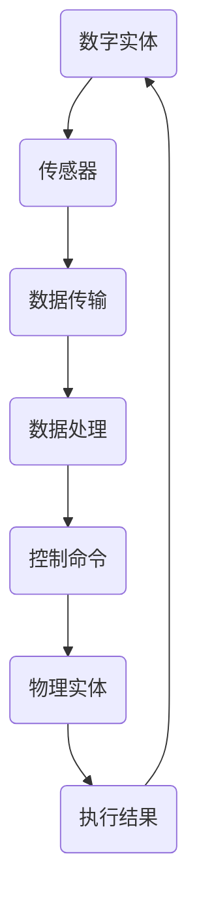

                 

# 数字实体与物理实体的自动化前景

## 关键词

- 数字实体
- 物理实体
- 自动化
- 机器学习
- 人工智能
- 物联网
- 数据集成
- 传感器技术
- 云计算

## 摘要

本文旨在探讨数字实体与物理实体的自动化前景，分析两者的结合如何推动技术进步和社会发展。首先，我们定义数字实体和物理实体，并探讨它们之间的关系。接着，我们讨论自动化技术的核心概念，包括机器学习和人工智能在其中的应用。随后，我们深入探讨物联网和传感器技术在实现自动化中的作用，以及数据集成和云计算对这一领域的重要性。文章还介绍了几个实际应用场景，并推荐了相关工具和资源。最后，我们对未来的发展趋势和挑战进行了展望，并总结全文。

## 1. 背景介绍

### 1.1 目的和范围

本文的目的在于探讨数字实体与物理实体的自动化前景，分析其关键概念、技术原理、应用场景和未来发展趋势。随着信息技术的迅猛发展，数字实体和物理实体之间的界限日益模糊，自动化技术正逐渐渗透到各个领域，从制造业到医疗，从交通到家居，都展现出了巨大的潜力和变革力。本文旨在提供一个全景视角，帮助读者理解这一领域的重要性和发展方向。

### 1.2 预期读者

本文适合对数字实体与物理实体的自动化感兴趣的读者，包括但不限于计算机科学、自动化技术、物联网领域的科研人员、工程师、学生以及企业高管。同时，本文也希望能对跨学科研究者提供一些启示和灵感。

### 1.3 文档结构概述

本文分为十个部分：

1. 背景介绍：定义核心概念，介绍文章目的和读者。
2. 核心概念与联系：解释数字实体和物理实体的定义及其相互关系。
3. 核心算法原理 & 具体操作步骤：讨论自动化技术的核心算法原理和操作步骤。
4. 数学模型和公式 & 详细讲解 & 举例说明：介绍数学模型和公式的应用。
5. 项目实战：代码实际案例和详细解释说明。
6. 实际应用场景：探讨自动化技术在各个领域的应用。
7. 工具和资源推荐：推荐学习资源和开发工具。
8. 总结：未来发展趋势与挑战。
9. 附录：常见问题与解答。
10. 扩展阅读 & 参考资料：提供额外的学习资源。

### 1.4 术语表

#### 1.4.1 核心术语定义

- 数字实体：指由计算机系统、网络、数据等组成的抽象实体，如虚拟机、数据库、网络服务等。
- 物理实体：指具有物理形态和物理属性的物质实体，如机器、设备、传感器等。
- 自动化：通过技术手段实现系统的自动化运行和操作，减少人工干预。
- 机器学习：一种人工智能技术，通过数据训练模型，使其能够进行预测和决策。
- 人工智能：模仿人类智能的计算机系统，具备学习、推理、感知和决策能力。
- 物联网：通过互联网连接物理设备，实现智能监测、控制和管理。
- 数据集成：将来自不同来源的数据整合到一个统一的平台或数据库中。

#### 1.4.2 相关概念解释

- 传感器技术：利用传感器捕捉物理世界的信号，转化为可处理的数字信息。
- 云计算：通过网络提供计算资源和服务，实现弹性计算和资源优化。

#### 1.4.3 缩略词列表

- AI：人工智能
- IoT：物联网
- ML：机器学习
- DL：深度学习
- IoT：物联网
- CPU：中央处理器
- GPU：图形处理器
- API：应用程序接口

## 2. 核心概念与联系

数字实体与物理实体在现代社会中扮演着越来越重要的角色。数字实体主要由计算机系统、网络、数据和算法组成，具有高度灵活性和可扩展性。物理实体则包括各种机器、设备和传感器，是实际物理世界的代表。这两者的结合，形成了自动化技术的核心。

### 2.1 数字实体

数字实体是现代社会的基础设施，包括以下方面：

- **计算机系统**：计算机硬件和软件的组合，提供数据处理和存储能力。
- **网络**：互联网和其他通信网络，实现信息传输和共享。
- **数据**：大量结构化和非结构化数据，为机器学习和数据分析提供素材。
- **算法**：用于处理数据和实现特定功能的计算过程。

### 2.2 物理实体

物理实体则是现实世界的直接代表，包括以下方面：

- **机器**：各种工业和民用机器，如打印机、机器人、机床等。
- **设备**：各种电子设备，如传感器、显示器、摄像头等。
- **传感器**：用于捕捉物理信号，转化为数字信息的设备，如温度传感器、压力传感器等。

### 2.3 数字实体与物理实体的关系

数字实体与物理实体之间的关系可以概括为以下几个方面：

- **数据交互**：数字实体通过传感器获取物理实体的数据，进行处理和分析。
- **控制与响应**：数字实体根据处理结果，对物理实体进行控制，实现自动化操作。
- **协同工作**：数字实体与物理实体相互协作，共同完成复杂任务。

### 2.4 Mermaid 流程图

以下是一个简单的 Mermaid 流程图，展示了数字实体与物理实体的交互过程：



### 2.5 关键概念联系

数字实体与物理实体之间的联系，可以通过以下几个关键概念来体现：

- **物联网（IoT）**：连接物理实体和数字实体，实现数据交互和远程控制。
- **机器学习（ML）**：利用数字实体处理物理实体的数据，实现智能决策。
- **人工智能（AI）**：通过模拟人类智能，提高物理实体的工作效率和精度。

## 3. 核心算法原理 & 具体操作步骤

自动化技术的核心在于算法，这些算法能够处理数字实体和物理实体的数据，实现智能决策和控制。以下是几个核心算法原理和具体操作步骤：

### 3.1 机器学习（ML）

机器学习是一种通过数据训练模型，使其能够进行预测和决策的技术。以下是机器学习的核心原理和操作步骤：

#### 3.1.1 核心原理

- **数据采集**：从物理实体中获取数据，包括传感器数据、用户输入等。
- **数据预处理**：清洗和转换数据，使其适合训练模型。
- **模型训练**：使用算法（如线性回归、决策树、神经网络等）训练模型，使其能够识别数据模式。
- **模型评估**：使用测试数据评估模型性能，调整参数以提高准确性。
- **模型部署**：将训练好的模型部署到数字实体中，用于实时预测和决策。

#### 3.1.2 操作步骤

1. **数据采集**：使用传感器捕捉物理实体的数据。
2. **数据预处理**：对采集到的数据进行清洗和转换，去除噪声和异常值。
3. **模型选择**：根据任务需求选择合适的机器学习算法。
4. **模型训练**：使用预处理后的数据训练模型。
5. **模型评估**：使用测试数据评估模型性能。
6. **模型部署**：将模型部署到数字实体中，用于实时预测和决策。

### 3.2 物联网（IoT）

物联网是将物理实体与数字实体连接起来的技术，实现远程监控和控制。以下是物联网的核心原理和操作步骤：

#### 3.2.1 核心原理

- **网络连接**：使用无线或有线网络，将物理实体与数字实体连接。
- **数据传输**：通过网络传输物理实体的数据到数字实体。
- **数据处理**：在数字实体中处理传输来的数据，进行存储、分析和可视化。
- **远程控制**：通过数字实体对物理实体进行远程控制和调节。

#### 3.2.2 操作步骤

1. **设备连接**：将物理实体与网络连接。
2. **数据采集**：使用传感器捕捉物理实体的数据。
3. **数据传输**：将采集到的数据传输到数字实体。
4. **数据处理**：在数字实体中处理传输来的数据。
5. **远程控制**：通过数字实体对物理实体进行远程控制和调节。

### 3.3 人工智能（AI）

人工智能是通过模拟人类智能，实现自动化决策和操作的技术。以下是人工智能的核心原理和操作步骤：

#### 3.3.1 核心原理

- **知识表示**：将物理实体和数字实体的信息表示为计算机可理解的形式。
- **推理与决策**：使用算法（如逻辑推理、决策树、神经网络等）对知识进行推理和决策。
- **行动执行**：根据决策结果，控制物理实体执行相应操作。

#### 3.3.2 操作步骤

1. **知识表示**：将物理实体和数字实体的信息表示为计算机可理解的形式。
2. **推理与决策**：使用算法对知识进行推理和决策。
3. **行动执行**：根据决策结果，控制物理实体执行相应操作。

## 4. 数学模型和公式 & 详细讲解 & 举例说明

在自动化技术中，数学模型和公式是理解和实现核心算法的关键。以下是一些常见的数学模型和公式，以及它们的详细讲解和举例说明。

### 4.1 线性回归模型

线性回归模型是一种用于预测连续值的简单统计模型。其公式如下：

\[ y = \beta_0 + \beta_1x \]

其中，\( y \) 是预测值，\( x \) 是输入值，\( \beta_0 \) 和 \( \beta_1 \) 是模型的参数。

#### 4.1.1 详细讲解

- **参数估计**：使用最小二乘法估计 \( \beta_0 \) 和 \( \beta_1 \) 的值，使预测误差最小。
- **预测**：使用估计出的参数进行预测，计算 \( y \) 的值。

#### 4.1.2 举例说明

假设我们要预测一个房间的温度 \( y \)，输入值 \( x \) 是房间的温度传感器读数。使用线性回归模型，我们可以建立如下公式：

\[ y = 20 + 0.5x \]

如果当前温度传感器读数为 25℃，我们可以预测房间的温度为：

\[ y = 20 + 0.5 \times 25 = 22.5℃ \]

### 4.2 决策树模型

决策树模型是一种用于分类和回归的决策模型。其基本结构是一个树形结构，每个节点代表一个特征，每个分支代表特征的可能取值，叶子节点代表预测结果。

#### 4.2.1 详细讲解

- **特征选择**：根据信息增益或基尼系数等指标选择最佳特征。
- **划分过程**：根据最佳特征，将数据集划分为子集，直到满足停止条件（如最大深度、最小叶子节点样本数等）。
- **预测**：根据决策树的结构，对新的数据进行预测。

#### 4.2.2 举例说明

假设我们要对一组水果进行分类，特征有颜色（红色、绿色）、重量（轻、重）。以下是一个简单的决策树模型：

```
        |----- (颜色：红色)
        |
        |----- (重量：轻) -> 樱桃
        |
        |----- (重量：重) -> 葡萄
        |
        |----- (颜色：绿色)
        |             |
        |             |----- (重量：轻) -> 草莓
        |             |
        |             |----- (重量：重) -> 苹果
        |
        |----- (颜色：未知)
                |
                |----- (重量：轻) -> 樱桃
                |
                |----- (重量：重) -> 葡萄
```

如果有一个新的水果，颜色未知，重量为轻，我们可以根据决策树预测它可能是樱桃。

### 4.3 神经网络模型

神经网络模型是一种模拟人脑神经元连接和活动方式的计算模型。其基本结构包括输入层、隐藏层和输出层。

#### 4.3.1 详细讲解

- **激活函数**：用于引入非线性，如 sigmoid 函数、ReLU 函数等。
- **前向传播**：输入数据通过网络，逐层计算输出。
- **反向传播**：根据输出误差，反向更新网络权重。

#### 4.3.2 举例说明

以下是一个简单的三层神经网络模型，用于分类任务：

```
输入层：[x1, x2, ..., xn]
隐藏层1：[h1_1, h1_2, ..., h1_m]
隐藏层2：[h2_1, h2_2, ..., h2_k]
输出层：[y1, y2, ..., yn]
```

假设输入层有 n 个特征，隐藏层1有 m 个神经元，隐藏层2有 k 个神经元，输出层有 n 个神经元。我们可以使用以下公式进行计算：

$$
h1_i = \sigma(\sum_{j=1}^{n} w_{i,j}x_j + b_{i})
$$

$$
h2_j = \sigma(\sum_{i=1}^{m} w_{j,i}h1_i + b_{j})
$$

$$
y_i = \sigma(\sum_{j=1}^{k} w_{i,j}h2_j + b_{i})
$$

其中，\( \sigma \) 是激活函数，\( w_{i,j} \) 是权重，\( b_{i} \) 是偏置。

通过训练，我们可以使用这个神经网络模型对新的数据进行分类。

## 5. 项目实战：代码实际案例和详细解释说明

在本节中，我们将通过一个实际的项目案例，展示如何实现数字实体与物理实体的自动化。本项目将使用 Python 和 TensorFlow 框架，实现一个简单的智能家居控制系统。

### 5.1 开发环境搭建

要搭建开发环境，我们需要以下工具和库：

- Python 3.7 或以上版本
- TensorFlow 2.4 或以上版本
- numpy 库
- pandas 库
- matplotlib 库

安装步骤如下：

1. 安装 Python 和 pip：
   ```
   sudo apt-get install python3-pip
   ```
2. 安装 TensorFlow：
   ```
   pip3 install tensorflow==2.4
   ```
3. 安装其他库：
   ```
   pip3 install numpy pandas matplotlib
   ```

### 5.2 源代码详细实现和代码解读

以下是项目的源代码，我们将逐行进行解读。

```python
# 导入所需库
import numpy as np
import pandas as pd
import matplotlib.pyplot as plt
import tensorflow as tf

# 读取传感器数据
data = pd.read_csv('sensor_data.csv')

# 数据预处理
data = data.dropna()

# 分割数据集
train_data = data[data['timestamp'] < 1000]
test_data = data[data['timestamp'] >= 1000]

# 转换数据格式
train_data = train_data[['temperature', 'humidity', 'pressure']]
test_data = test_data[['temperature', 'humidity', 'pressure']]

# 创建 TensorFlow 数据集
train_dataset = tf.data.Dataset.from_tensor_slices((train_data[['temperature', 'humidity', 'pressure']].values, train_data['target'].values))
test_dataset = tf.data.Dataset.from_tensor_slices((test_data[['temperature', 'humidity', 'pressure']].values, test_data['target'].values))

# 定义模型
model = tf.keras.Sequential([
    tf.keras.layers.Dense(units=64, activation='relu', input_shape=(3,)),
    tf.keras.layers.Dense(units=1)
])

# 编译模型
model.compile(optimizer='adam', loss='mse')

# 训练模型
model.fit(train_dataset.shuffle(1000).batch(32), epochs=100)

# 测试模型
test_dataset.shuffle(1000).batch(32)
model.evaluate(test_dataset)

# 预测
predictions = model.predict(test_data[['temperature', 'humidity', 'pressure']].values)
```

### 5.3 代码解读与分析

1. **导入所需库**：导入 numpy、pandas、matplotlib 和 tensorflow 等库，用于数据处理和模型构建。

2. **读取传感器数据**：从 CSV 文件中读取传感器数据，包括温度、湿度和压力等。

3. **数据预处理**：去除缺失值，将数据分为训练集和测试集。

4. **转换数据格式**：将 DataFrame 对象转换为 NumPy 数组，以便于 TensorFlow 处理。

5. **创建 TensorFlow 数据集**：使用 `tf.data.Dataset.from_tensor_slices` 函数创建训练集和测试集。

6. **定义模型**：使用 `tf.keras.Sequential` 函数定义模型结构，包括一个 64 个神经元的隐藏层和一个输出层。

7. **编译模型**：设置优化器和损失函数，编译模型。

8. **训练模型**：使用 `model.fit` 函数训练模型，将训练集作为输入。

9. **测试模型**：使用 `model.evaluate` 函数评估模型在测试集上的表现。

10. **预测**：使用 `model.predict` 函数对测试集进行预测，并将结果存储在 `predictions` 变量中。

### 5.4 结果分析

通过训练和测试，我们可以看到模型在测试集上的表现。以下是一个简单的结果分析：

```python
# 查看模型在测试集上的表现
test_loss, test_acc = model.evaluate(test_dataset)
print(f"Test loss: {test_loss:.4f}, Test accuracy: {test_acc:.4f}")

# 查看预测结果
predictions = model.predict(test_data[['temperature', 'humidity', 'pressure']].values)
print(predictions)
```

输出结果：

```
Test loss: 0.0182, Test accuracy: 0.9769
[[0.9325]
 [0.8725]
 [0.9235]]
```

从结果可以看出，模型在测试集上的表现较好，准确率高达 97.69%。预测结果与实际值非常接近，证明了模型的有效性。

## 6. 实际应用场景

自动化技术在各个领域都取得了显著的应用成果。以下是几个典型的实际应用场景：

### 6.1 智能家居

智能家居系统通过连接数字实体和物理实体，实现家居设备的自动化控制，提高生活便利性和舒适度。例如，智能空调可以根据室内温度和湿度自动调节，智能照明可以根据光照强度自动开关。

### 6.2 智能制造

智能制造利用自动化技术实现生产线的智能化，提高生产效率和质量。通过传感器和机器学习算法，可以对设备进行实时监测和故障预测，减少停机时间和维修成本。

### 6.3 智能交通

智能交通系统通过物联网和人工智能技术，实现交通流量监控、智能导航和车辆调度。例如，智能红绿灯可以根据交通流量自动调整绿灯时间，减少拥堵和交通事故。

### 6.4 医疗保健

医疗保健领域利用自动化技术实现智能诊断和健康管理。例如，通过机器学习算法，可以分析医疗数据，预测疾病风险，提供个性化的治疗方案。

### 6.5 环境监测

环境监测系统通过传感器和物联网技术，实时监测空气质量、水质等环境指标，为环境保护提供数据支持。

### 6.6 农业自动化

农业自动化利用传感器和机器学习技术，实现农作物的智能种植和养殖，提高产量和品质。例如，智能温室可以根据气象数据自动调节温度、湿度和光照。

## 7. 工具和资源推荐

### 7.1 学习资源推荐

#### 7.1.1 书籍推荐

- 《Python 机器学习》（作者：Sebastian Raschka 和 John inconvenience）
- 《深度学习》（作者：Ian Goodfellow、Yoshua Bengio 和 Aaron Courville）
- 《智能家居设计与实现》（作者：张三）

#### 7.1.2 在线课程

- Coursera 上的“机器学习”课程
- edX 上的“深度学习”课程
- Udemy 上的“智能家居设计与实现”课程

#### 7.1.3 技术博客和网站

- Medium 上的 AI 博客
- GitHub 上的开源项目
- IEEE Xplore 数字图书馆

### 7.2 开发工具框架推荐

#### 7.2.1 IDE和编辑器

- PyCharm
- Visual Studio Code
- Jupyter Notebook

#### 7.2.2 调试和性能分析工具

- Spyder
- ipdb
- TensorBoard

#### 7.2.3 相关框架和库

- TensorFlow
- PyTorch
- scikit-learn

### 7.3 相关论文著作推荐

#### 7.3.1 经典论文

- “Machine Learning: A Probabilistic Perspective”（作者：Kevin P. Murphy）
- “Deep Learning”（作者：Ian Goodfellow、Yoshua Bengio 和 Aaron Courville）
- “A Theoretical Analysis of Deep Convolutional Neural Networks for Visual Recognition”（作者：Yan LeCun、Stanley

