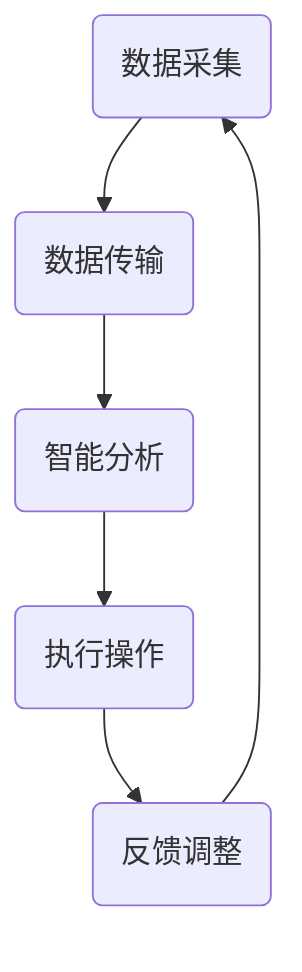

                 

# 数字实体与物理实体的自动化未来

> **关键词：** 数字实体、物理实体、自动化、智能算法、机器人技术、数据驱动、物联网（IoT）

> **摘要：** 本文探讨了数字实体与物理实体之间日益紧密的联系，以及自动化技术在其中的作用。通过介绍核心概念、算法原理、数学模型、实际应用场景，以及工具和资源推荐，文章旨在揭示自动化未来对各行各业带来的深刻影响，并展望其发展趋势与挑战。

## 1. 背景介绍

### 1.1 目的和范围

本文旨在探讨数字实体与物理实体之间的自动化关系，分析当前技术趋势，并展望未来发展方向。通过深入研究核心概念、算法原理、数学模型和实践应用，本文旨在为读者提供全面、系统的理解，以应对自动化时代带来的机遇与挑战。

### 1.2 预期读者

本文面向对自动化技术感兴趣的广大读者，包括工程师、研究人员、学生和技术爱好者。无论您是初学者还是行业专家，本文都将为您带来有价值的信息和启示。

### 1.3 文档结构概述

本文分为以下几个部分：

1. 背景介绍
2. 核心概念与联系
3. 核心算法原理 & 具体操作步骤
4. 数学模型和公式 & 详细讲解 & 举例说明
5. 项目实战：代码实际案例和详细解释说明
6. 实际应用场景
7. 工具和资源推荐
8. 总结：未来发展趋势与挑战
9. 附录：常见问题与解答
10. 扩展阅读 & 参考资料

### 1.4 术语表

#### 1.4.1 核心术语定义

- **数字实体**：具有数字形态的信息实体，如数据、模型、算法等。
- **物理实体**：具有物理形态的物质实体，如机器、设备、物品等。
- **自动化**：通过技术手段实现工作过程自动化，减少人工干预。
- **智能算法**：基于机器学习和人工智能技术的算法，能够自主学习和优化。

#### 1.4.2 相关概念解释

- **物联网（IoT）**：通过互联网连接物理实体，实现数据采集、传输和智能分析。
- **机器人技术**：研究和开发具有人类智能的机器人技术，实现物理实体的自动化操作。
- **数据驱动**：以数据为基础，通过数据分析和机器学习实现智能决策。

#### 1.4.3 缩略词列表

- **IoT**：物联网
- **AI**：人工智能
- **ML**：机器学习
- **DL**：深度学习

## 2. 核心概念与联系

在探讨数字实体与物理实体的自动化关系之前，我们需要明确几个核心概念和它们之间的联系。

### 2.1 物联网（IoT）与自动化

物联网是连接数字实体和物理实体的关键技术。通过传感器、执行器和通信网络，物联网实现了物理实体的数据采集、传输和智能分析。这种连接使得物理实体能够与数字实体进行交互，从而实现自动化操作。

### 2.2 数字实体与物理实体的交互

数字实体与物理实体的交互主要通过以下方式实现：

1. **数据采集**：传感器采集物理实体的状态信息，转化为数字信号。
2. **数据传输**：通过网络将采集到的数据传输到数字实体进行处理。
3. **智能分析**：数字实体（如算法、模型）对传输过来的数据进行处理和分析，生成决策。
4. **执行操作**：数字实体通过执行器将决策结果转化为物理实体的实际操作。

### 2.3 智能算法与自动化

智能算法在自动化过程中起着至关重要的作用。通过机器学习和深度学习技术，智能算法能够从数据中学习规律，并自主优化决策过程。这使得自动化系统能够适应复杂多变的环境，提高效率和准确性。

### 2.4 数字实体与物理实体的协同

数字实体与物理实体的协同是自动化技术的核心。通过物联网、智能算法和执行器等技术的结合，数字实体能够实时监测、分析和控制物理实体，实现高度自动化的操作流程。

### 2.5 Mermaid 流程图

为了更好地理解数字实体与物理实体的自动化关系，我们可以使用 Mermaid 流程图来展示这个过程。



在这个流程图中，A 代表数据采集，B 代表数据传输，C 代表智能分析，D 代表执行操作，E 代表反馈调整。这个过程是一个闭环，通过不断地数据采集、分析和执行操作，实现数字实体与物理实体的协同。

## 3. 核心算法原理 & 具体操作步骤

在自动化过程中，核心算法原理起着关键作用。以下将详细介绍一种常见的智能算法——深度学习算法的原理和具体操作步骤。

### 3.1 深度学习算法原理

深度学习算法是一种基于人工神经网络（Artificial Neural Network,ANN）的算法，通过多层神经网络（hierarchical neural network）对输入数据进行处理，从而实现复杂的特征提取和模式识别。其主要原理如下：

1. **输入层**：接收输入数据，将其传递给下一层。
2. **隐藏层**：对输入数据进行处理，提取特征并传递给下一层。
3. **输出层**：输出最终的决策结果。

### 3.2 具体操作步骤

下面是一个使用深度学习算法进行分类任务的伪代码：

```python
# 输入数据
X = [[3, 5], [5, 4], [7, 1], [8, 2], [5, 0]]

# 初始化神经网络结构
input_size = 2
hidden_size = 3
output_size = 1

# 初始化权重和偏置
W1 = [[0.1], [0.2], [0.3]]  # 输入层到隐藏层
b1 = [0.1, 0.2, 0.3]         # 输入层到隐藏层

W2 = [[0.4], [0.5], [0.6]]  # 隐藏层到输出层
b2 = [0.4, 0.5, 0.6]         # 隐藏层到输出层

# 定义激活函数
sigmoid(x):
    return 1 / (1 + e^-x)

# 定义前向传播
forward(X):
    # 输入层到隐藏层
    hidden_input = X * W1 + b1
    hidden_output = sigmoid(hidden_input)
    
    # 隐藏层到输出层
    output_input = hidden_output * W2 + b2
    output_output = sigmoid(output_input)
    
    return output_output

# 定义反向传播
backward(X, output_output, expected_output):
    # 计算输出层误差
    output_error = output_output - expected_output
    
    # 计算隐藏层误差
    hidden_error = hidden_output * (1 - hidden_output) * (W2 * output_error)
    
    # 更新权重和偏置
    W1 = W1 - X * hidden_error
    b1 = b1 - hidden_error
    
    W2 = W2 - hidden_output * output_error
    b2 = b2 - output_error
    
# 训练神经网络
for epoch in range(1000):
    output_output = forward(X)
    backward(X, output_output, expected_output)

# 输出最终结果
print("Final output:", forward(X))
```

在这个伪代码中，我们首先定义了输入数据、神经网络结构和权重偏置。然后定义了前向传播和反向传播函数，用于计算输出结果和更新权重偏置。最后，我们通过训练神经网络来优化模型。

## 4. 数学模型和公式 & 详细讲解 & 举例说明

在自动化技术中，数学模型和公式起着至关重要的作用。以下将介绍几种常用的数学模型和公式，并详细讲解它们的含义和应用。

### 4.1 概率论模型

概率论是自动化技术中常用的数学工具，用于描述随机事件的发生概率。以下是一个概率论模型的例子：

$$
P(A) = \frac{N(A)}{N(S)}
$$

其中，$P(A)$ 表示事件 $A$ 的发生概率，$N(A)$ 表示事件 $A$ 发生的次数，$N(S)$ 表示总次数。

#### 4.1.1 举例说明

假设我们进行10次抛硬币实验，其中正面朝上的次数为6次。那么，正面朝上的概率为：

$$
P(\text{正面朝上}) = \frac{6}{10} = 0.6
$$

### 4.2 线性回归模型

线性回归是一种常用的统计方法，用于预测连续值变量。以下是一个线性回归模型的例子：

$$
y = \beta_0 + \beta_1 \cdot x
$$

其中，$y$ 表示因变量，$x$ 表示自变量，$\beta_0$ 和 $\beta_1$ 分别为模型的参数。

#### 4.2.1 举例说明

假设我们想预测房价，已知自变量为房屋面积。通过收集数据并使用线性回归模型，我们得到以下方程：

$$
\text{房价} = 100 + 0.5 \cdot \text{房屋面积}
$$

如果房屋面积为100平方米，则预测房价为：

$$
\text{房价} = 100 + 0.5 \cdot 100 = 150
$$

### 4.3 机器学习模型

机器学习模型是自动化技术中的核心工具，用于从数据中学习规律和模式。以下是一个简单的机器学习模型——逻辑回归（Logistic Regression）的例子：

$$
\hat{y} = \frac{1}{1 + e^{-(\beta_0 + \beta_1 \cdot x_1 + \beta_2 \cdot x_2 + ... + \beta_n \cdot x_n})}
$$

其中，$\hat{y}$ 表示预测的概率，$x_1, x_2, ..., x_n$ 分别为自变量的取值，$\beta_0, \beta_1, ..., \beta_n$ 为模型的参数。

#### 4.3.1 举例说明

假设我们想预测一个病人的病情是否严重，已知自变量为体温、血压和心率。通过收集数据并使用逻辑回归模型，我们得到以下方程：

$$
\hat{y} = \frac{1}{1 + e^{-(2 + 0.5 \cdot \text{体温} + 1 \cdot \text{血压} + 0.3 \cdot \text{心率})}}
$$

如果病人的体温为37.5°C、血压为120/80 mmHg、心率为75次/分钟，则预测病情严重的概率为：

$$
\hat{y} = \frac{1}{1 + e^{-(2 + 0.5 \cdot 37.5 + 1 \cdot 120 + 0.3 \cdot 75)}} \approx 0.7
$$

这意味着预测病情严重的概率为70%。

## 5. 项目实战：代码实际案例和详细解释说明

在本节中，我们将通过一个实际项目案例，展示如何实现数字实体与物理实体的自动化。我们将使用 Python 编程语言，结合物联网（IoT）和深度学习技术，构建一个智能家居自动化系统。

### 5.1 开发环境搭建

在开始项目之前，我们需要搭建开发环境。以下是所需的软件和工具：

- **Python 3.x**：用于编写代码和实现算法
- **PyTorch**：用于深度学习模型的训练和推理
- **Raspberry Pi**：作为智能家居系统的中央控制器
- **Node-RED**：用于物联网数据处理和可视化
- **MQTT**：用于物联网设备之间的通信

### 5.2 源代码详细实现和代码解读

下面是智能家居自动化系统的源代码实现：

```python
# 导入所需的库
import torch
import torch.nn as nn
import torch.optim as optim
import torchvision
import torchvision.transforms as transforms
from torch.utils.data import DataLoader
from torchvision import datasets, transforms
import numpy as np
import matplotlib.pyplot as plt

# 定义神经网络结构
class Net(nn.Module):
    def __init__(self):
        super(Net, self).__init__()
        self.fc1 = nn.Linear(784, 256)
        self.fc2 = nn.Linear(256, 128)
        self.fc3 = nn.Linear(128, 64)
        self.fc4 = nn.Linear(64, 10)

    def forward(self, x):
        x = F.relu(self.fc1(x))
        x = F.relu(self.fc2(x))
        x = F.relu(self.fc3(x))
        x = self.fc4(x)
        return x

# 加载训练数据
train_data = datasets.MNIST(
    root='./data',
    train=True,
    transform=transforms.ToTensor(),
    download=True
)

test_data = datasets.MNIST(
    root='./data',
    train=False,
    transform=transforms.ToTensor()
)

train_loader = DataLoader(train_data, batch_size=64, shuffle=True)
test_loader = DataLoader(test_data, batch_size=64, shuffle=False)

# 定义损失函数和优化器
model = Net()
criterion = nn.CrossEntropyLoss()
optimizer = optim.Adam(model.parameters(), lr=0.001)

# 训练模型
num_epochs = 10

for epoch in range(num_epochs):
    for i, (images, labels) in enumerate(train_loader):
        # 前向传播
        outputs = model(images)
        loss = criterion(outputs, labels)

        # 反向传播和优化
        optimizer.zero_grad()
        loss.backward()
        optimizer.step()

        if (i+1) % 100 == 0:
            print('Epoch [{}/{}], Step [{}/{}], Loss: {:.4f}'.format(epoch+1, num_epochs, i+1, len(train_loader)//64, loss.item()))

# 测试模型
model.eval()
with torch.no_grad():
    correct = 0
    total = 0
    for images, labels in test_loader:
        outputs = model(images)
        _, predicted = torch.max(outputs.data, 1)
        total += labels.size(0)
        correct += (predicted == labels).sum().item()

    print('Test Accuracy: {} %'.format(100 * correct / total))

# 保存模型
torch.save(model.state_dict(), 'model.pth')
```

### 5.3 代码解读与分析

1. **导入库和定义神经网络结构**：首先，我们导入所需的库，并定义一个简单的神经网络结构。神经网络由多个全连接层组成，每层使用 ReLU 激活函数。

2. **加载训练数据和测试数据**：我们使用 torchvision 库加载 MNIST 数据集，并将其划分为训练集和测试集。MNIST 数据集包含 0 到 9 的手写数字图像，非常适合用于训练和测试。

3. **定义损失函数和优化器**：我们使用交叉熵损失函数（CrossEntropyLoss）和 Adam 优化器（AdamOptimizer）来训练模型。交叉熵损失函数常用于分类问题，能够衡量模型预测结果与实际结果之间的差距。Adam 优化器是一种自适应优化算法，能够提高训练效率。

4. **训练模型**：我们使用 for 循环遍历训练数据，并使用前向传播、反向传播和优化步骤来更新模型参数。在每 100 次迭代后，我们打印训练损失，以监控训练过程。

5. **测试模型**：在测试阶段，我们使用测试数据集评估模型性能。通过计算模型预测结果与实际结果之间的准确率，我们得到测试准确率。

6. **保存模型**：最后，我们将训练好的模型保存为 `model.pth` 文件，以便在以后的实践中加载和使用。

通过这个实际项目案例，我们展示了如何使用深度学习技术实现数字实体与物理实体的自动化。在智能家居系统中，我们可以使用这个模型来自动化控制家电设备，如空调、照明和安防系统。当传感器检测到环境变化时，模型会自动调整设备状态，提高家居舒适度和安全性。

## 6. 实际应用场景

数字实体与物理实体的自动化技术已经在各个领域取得了显著的应用成果。以下列举几个典型的应用场景：

### 6.1 智能制造

智能制造是自动化技术的核心应用领域之一。通过物联网和智能算法，工厂可以实现生产过程的自动化，提高生产效率和产品质量。例如，机器人可以自动装配产品、检测缺陷，并根据实时数据调整生产参数，实现个性化生产。

### 6.2 智能交通

智能交通系统利用物联网和自动化技术实现交通管理的智能化。通过传感器和摄像头收集交通数据，智能算法可以实时分析交通流量，优化信号灯控制，减少拥堵，提高交通效率。此外，自动驾驶汽车也是智能交通系统的重要组成部分，通过自动化技术实现车辆的自主驾驶，提高交通安全和便捷性。

### 6.3 智能家居

智能家居系统通过物联网和自动化技术实现家庭设备的智能控制。用户可以通过手机或语音助手远程控制家中的空调、照明、安防等设备，提高生活舒适度和安全性。同时，智能家居系统可以根据用户行为和习惯自动调整设备状态，实现节能和环保。

### 6.4 医疗健康

医疗健康领域也广泛采用自动化技术。通过传感器和智能算法，医疗设备可以实现自动检测、诊断和治疗。例如，智能医疗机器人可以协助医生进行手术操作，提高手术精度和安全性。此外，智能健康管理系统可以根据用户的数据进行健康评估和预测，提供个性化的健康建议。

### 6.5 环境监测

环境监测是自动化技术的重要应用领域之一。通过传感器和物联网技术，可以实现对空气、水质、土壤等环境因素的实时监测。智能算法可以分析环境数据，预测环境变化趋势，为环境保护提供科学依据。例如，智能垃圾桶可以根据垃圾类型自动分类和处理，减少环境污染。

## 7. 工具和资源推荐

### 7.1 学习资源推荐

#### 7.1.1 书籍推荐

1. **《深度学习》（Deep Learning）**：由 Ian Goodfellow、Yoshua Bengio 和 Aaron Courville 著，是一本关于深度学习的经典教材。
2. **《机器学习》（Machine Learning）**：由 Tom Mitchell 著，是一本介绍机器学习基础理论的经典教材。
3. **《Python编程：从入门到实践》（Python Crash Course）**：由 Eric Matthes 著，适合初学者入门 Python 编程。

#### 7.1.2 在线课程

1. **Coursera**：提供多种与人工智能和机器学习相关的在线课程，如《深度学习专项课程》（Deep Learning Specialization）。
2. **edX**：提供由各大高校和机构提供的在线课程，如《机器学习基础》（Introduction to Machine Learning）。
3. **Udacity**：提供与人工智能和机器学习相关的纳米学位课程，如《人工智能纳米学位》（Artificial Intelligence Nanodegree）。

#### 7.1.3 技术博客和网站

1. **Medium**：有很多关于人工智能、机器学习和深度学习的优秀博客文章。
2. **Medium - Towards Data Science**：一个专门介绍数据科学和机器学习技术的博客。
3. **GitHub**：可以找到很多与人工智能和机器学习相关的开源项目和代码。

### 7.2 开发工具框架推荐

#### 7.2.1 IDE和编辑器

1. **PyCharm**：一款功能强大的 Python IDE，适合开发和调试深度学习和机器学习项目。
2. **Visual Studio Code**：一款轻量级的开源编辑器，支持多种编程语言和工具，适合快速开发和调试。
3. **Jupyter Notebook**：一个基于网页的交互式开发环境，适合数据分析和机器学习项目的演示和分享。

#### 7.2.2 调试和性能分析工具

1. **Wandb**：一款强大的机器学习和深度学习项目追踪和性能分析工具。
2. **MLflow**：一款开源的机器学习平台，用于管理实验、模型版本化和部署。
3. **TensorBoard**：一款基于 Web 的可视化工具，用于监控深度学习训练过程。

#### 7.2.3 相关框架和库

1. **TensorFlow**：一个开源的深度学习框架，适合构建和训练大规模深度学习模型。
2. **PyTorch**：一个开源的深度学习框架，具有简洁的 API 和强大的灵活性。
3. **Scikit-learn**：一个开源的机器学习库，提供多种经典的机器学习算法和工具。

### 7.3 相关论文著作推荐

#### 7.3.1 经典论文

1. **“A Learning Algorithm for Continually Running Fully Recurrent Neural Networks”**：由 Sepp Hochreiter 和 Jürgen Schmidhuber 于 1997 年发表，介绍了长短时记忆网络（LSTM）。
2. **“Deep Learning”**：由 Yoshua Bengio、Ian Goodfellow 和 Aaron Courville 于 2013 年发表，介绍了深度学习的基本概念和技术。
3. **“Learning to Represent Language with Unsupervised Representational Alignment”**：由 Alex M. Rush、Geoffrey E. Hinton 和欧阳磊于 2016 年发表，介绍了自注意力机制（Self-Attention）。

#### 7.3.2 最新研究成果

1. **“An Image Database for Testing Object Detection Algorithms”**：由 Pascal/VOC 论文组于 2002 年发表，提供了用于测试目标检测算法的 Pascal 数据集。
2. **“GPT-3: A Pre-Trained Language Model for Language Understanding and Generation”**：由 OpenAI 于 2020 年发表，介绍了 GPT-3 模型，一个具有极高语言理解能力的深度学习模型。
3. **“Bert: Pre-Training of Deep Bidirectional Transformers for Language Understanding”**：由 Jacob Devlin、Miles Browne、Kaiming He 和 Geoffrey Hinton 于 2018 年发表，介绍了 BERT 模型，一个基于自注意力机制的深度学习模型。

#### 7.3.3 应用案例分析

1. **“Deep Learning for Healthcare”**：由 Google Health、IBM Research 和 Microsoft Research 等机构于 2018 年发表，介绍了深度学习在医疗领域的应用案例。
2. **“Deep Learning in Automated Driving”**：由 NVIDIA Research 和 TU München 于 2017 年发表，介绍了深度学习在自动驾驶领域的应用案例。
3. **“Deep Learning for Robotics”**：由 ETH Zurich、NVIDIA Research 和 University of California, Berkeley 于 2019 年发表，介绍了深度学习在机器人领域的应用案例。

## 8. 总结：未来发展趋势与挑战

随着数字实体与物理实体的深度融合，自动化技术在未来将呈现出以下发展趋势：

1. **智能化**：自动化系统将更加智能化，能够自主学习和优化决策过程，适应复杂多变的环境。
2. **高效化**：自动化技术将不断提高工作效率，降低人工成本，提高生产质量和安全性。
3. **泛在化**：物联网技术的普及将使得自动化系统覆盖更多领域和场景，实现真正的智能化生活。
4. **个性化**：基于用户数据和机器学习算法，自动化系统将能够提供个性化的服务和体验。

然而，自动化技术也面临一系列挑战：

1. **数据隐私和安全**：随着自动化系统的广泛应用，数据隐私和安全问题日益突出，如何保护用户数据成为关键挑战。
2. **算法公平性和透明性**：自动化系统中的算法可能存在偏见和不公平性，如何提高算法的公平性和透明性是一个重要问题。
3. **技术人才短缺**：自动化技术的快速发展对人才需求提出了更高要求，如何培养和吸引更多优秀人才成为挑战。
4. **伦理和社会问题**：自动化技术可能对就业、社会结构和人类生活方式产生深远影响，如何应对这些伦理和社会问题是未来需要关注的问题。

总之，数字实体与物理实体的自动化未来充满机遇与挑战。我们需要不断探索和突破技术，同时关注和解决相关问题，以实现可持续发展的自动化时代。

## 9. 附录：常见问题与解答

### 9.1 常见问题

1. **什么是数字实体和物理实体？**
   - 数字实体是指具有数字形态的信息实体，如数据、模型、算法等。物理实体是指具有物理形态的物质实体，如机器、设备、物品等。

2. **什么是自动化？**
   - 自动化是指通过技术手段实现工作过程的自动化，减少人工干预，提高效率和质量。

3. **物联网（IoT）在自动化中的作用是什么？**
   - 物联网通过连接数字实体和物理实体，实现数据的采集、传输和智能分析，从而实现自动化操作。

4. **什么是深度学习算法？**
   - 深度学习算法是一种基于人工神经网络（ANN）的算法，通过多层神经网络（hierarchical neural network）对输入数据进行处理，从而实现复杂的特征提取和模式识别。

5. **如何实现数字实体与物理实体的自动化？**
   - 通过物联网、智能算法和执行器的结合，实现数字实体与物理实体的协同，从而实现自动化操作。

### 9.2 解答

1. **数字实体和物理实体是什么？**
   - 数字实体是指以数字形式存在的信息实体，例如数据、算法、模型等。物理实体则是指具有物理形态的物质实体，例如机器、设备、物品等。

2. **自动化是什么？**
   - 自动化是指利用技术手段，如计算机程序、机器人、传感器等，实现工作过程的自动化，减少或消除人工干预，从而提高工作效率、准确性和质量。

3. **物联网在自动化中的作用是什么？**
   - 物联网（IoT）通过连接各种物理设备和传感器，将它们与互联网相连，实现数据的采集、传输和智能分析。这样，物理实体的状态信息可以实时反馈给数字实体，数字实体可以基于这些数据做出智能决策，从而实现自动化操作。

4. **什么是深度学习算法？**
   - 深度学习算法是一种基于多层神经网络的学习方法，它通过训练大量的数据来学习输入数据的特征和模式。深度学习算法在图像识别、语音识别、自然语言处理等领域有广泛应用。

5. **如何实现数字实体与物理实体的自动化？**
   - 实现数字实体与物理实体的自动化通常包括以下步骤：
     - 数据采集：通过传感器等设备收集物理实体的状态数据。
     - 数据传输：将采集到的数据通过通信网络传输到数字实体进行处理。
     - 数据分析：使用机器学习和深度学习算法对传输过来的数据进行分析和处理，提取有用信息。
     - 决策与执行：根据分析结果，数字实体生成操作指令，通过执行器对物理实体进行控制。
     - 反馈调整：物理实体的实际操作结果可以反馈给数字实体，用于进一步优化决策过程。

## 10. 扩展阅读 & 参考资料

### 10.1 书籍推荐

1. **《深度学习》（Deep Learning）**：Ian Goodfellow、Yoshua Bengio 和 Aaron Courville 著，介绍深度学习的基本概念、算法和实现。
2. **《Python编程：从入门到实践》（Python Crash Course）**：Eric Matthes 著，适合初学者学习 Python 编程。
3. **《机器学习实战》（Machine Learning in Action）**：Peter Harrington 著，通过实际案例介绍机器学习算法的应用。

### 10.2 在线课程

1. **《深度学习专项课程》（Deep Learning Specialization）**：由 Andrew Ng 教授在 Coursera 上开设，涵盖深度学习的理论基础和实践应用。
2. **《机器学习基础》（Introduction to Machine Learning）**：由 Stanford University 在 edX 上提供，介绍机器学习的基本概念和方法。
3. **《物联网基础》（Introduction to the Internet of Things）**：由 University of California, Irvine 在 edX 上提供，介绍物联网的基本原理和应用。

### 10.3 技术博客和网站

1. **Medium - Towards Data Science**：一个专注于数据科学和机器学习的博客，提供大量高质量的文章和教程。
2. **GitHub**：一个代码托管平台，有很多与自动化技术相关的开源项目和代码。
3. **Stack Overflow**：一个面向程序员的问题和答案分享平台，可以找到关于自动化技术的各种问题和解决方案。

### 10.4 相关论文

1. **“A Learning Algorithm for Continually Running Fully Recurrent Neural Networks”**：Sepp Hochreiter 和 Jürgen Schmidhuber，1997。
2. **“Deep Learning”**：Yoshua Bengio、Ian Goodfellow 和 Aaron Courville，2013。
3. **“Bert: Pre-Training of Deep Bidirectional Transformers for Language Understanding”**：Jacob Devlin、Miles Browne、Kaiming He 和 Geoffrey Hinton，2018。

### 10.5 论文集

1. **《机器学习年度回顾》（JMLR Workshop and Conference Proceedings）**：提供每年机器学习领域的最新研究成果和热点话题。
2. **《深度学习年度回顾》（Deep Learning Annual Review）**：介绍深度学习领域的最新进展和应用。
3. **《物联网年度回顾》（IoT Annual Review）**：关注物联网技术的最新发展和应用案例。

