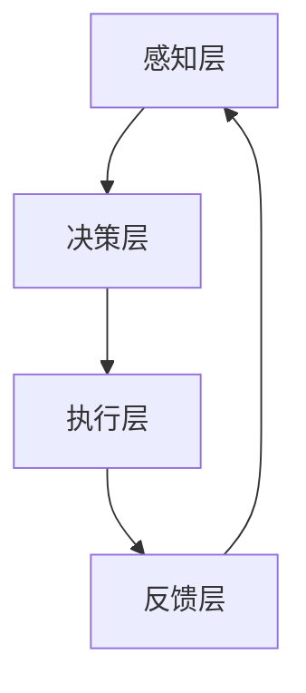

                 

# 数字实体与物理实体的自动化进展

> **关键词：数字实体、物理实体、自动化、人工智能、机器人技术、数字化进程**

> **摘要：本文深入探讨了数字实体与物理实体自动化的现状与未来发展趋势，分析了关键技术和挑战，结合实际案例展示了自动化技术的应用，并提出了未来研究的方向。**

## 1. 背景介绍

### 1.1 目的和范围

本文旨在探讨数字实体与物理实体自动化的现状、核心概念、算法原理、数学模型、实际应用以及未来发展趋势。自动化技术不仅改变了传统制造业的面貌，也在服务业、医疗、交通等领域发挥着重要作用。随着人工智能和机器人技术的快速发展，数字实体与物理实体的融合正成为一种新的趋势。

### 1.2 预期读者

本文适用于对自动化技术有一定了解的技术人员、研究者以及相关行业的从业者。希望通过本文，读者能够对数字实体与物理实体的自动化有一个全面、深入的认识。

### 1.3 文档结构概述

本文分为以下几个部分：

- **背景介绍**：介绍文章的目的和范围，预期读者以及文档结构。
- **核心概念与联系**：详细阐述数字实体与物理实体的定义、关系及自动化架构。
- **核心算法原理 & 具体操作步骤**：讲解自动化技术的核心算法原理和具体操作步骤。
- **数学模型和公式 & 详细讲解 & 举例说明**：介绍自动化过程中的数学模型和公式，并通过实例进行说明。
- **项目实战：代码实际案例和详细解释说明**：结合实际项目，展示自动化技术的应用。
- **实际应用场景**：分析自动化技术的实际应用场景。
- **工具和资源推荐**：推荐学习资源、开发工具和相关论文。
- **总结：未来发展趋势与挑战**：总结自动化技术的发展趋势和面临的挑战。
- **附录：常见问题与解答**：提供一些常见问题的解答。
- **扩展阅读 & 参考资料**：列出相关文献和参考资料。

### 1.4 术语表

#### 1.4.1 核心术语定义

- **数字实体**：指在计算机系统中表示和操作的数据和模型。
- **物理实体**：指现实世界中的物体和系统。
- **自动化**：通过技术手段实现系统或过程的自主操作和优化。
- **人工智能**：使计算机具备类似人类智能的能力。

#### 1.4.2 相关概念解释

- **机器人技术**：研究如何使机器人能够执行人类任务的技术。
- **数字化进程**：将物理实体转化为数字实体的过程。

#### 1.4.3 缩略词列表

- **AI**：人工智能
- **ML**：机器学习
- **RL**：强化学习
- **CAD**：计算机辅助设计
- **CAM**：计算机辅助制造

## 2. 核心概念与联系

### 2.1 数字实体与物理实体的定义

- **数字实体**：数字实体是在计算机系统中表示和操作的数据和模型。例如，数字化的图像、音频、视频以及CAD模型等。
- **物理实体**：物理实体是指现实世界中的物体和系统。例如，机器、设备、车辆以及建筑物等。

### 2.2 数字实体与物理实体的关系

数字实体与物理实体之间存在紧密的联系。随着数字化进程的推进，越来越多的物理实体被转化为数字实体，从而实现数字化管理和控制。例如，在制造业中，通过CAD/CAM系统，将设计师的创意转化为物理实体，从而实现生产自动化。

### 2.3 自动化架构

自动化架构通常包括以下几个关键部分：

1. **感知层**：通过传感器等技术获取物理实体的状态信息。
2. **决策层**：基于感知层的数据，通过算法进行决策。
3. **执行层**：根据决策层的指令，控制物理实体进行操作。

下面是一个简单的自动化架构的Mermaid流程图：



## 3. 核心算法原理 & 具体操作步骤

### 3.1 感知层

感知层是自动化架构的基础。它通过传感器获取物理实体的状态信息。常见的传感器包括温度传感器、压力传感器、加速度传感器等。以下是一个简单的感知层算法：

```python
def get_sensor_data(sensor_type):
    if sensor_type == 'temperature':
        return read_temperature_sensor()
    elif sensor_type == 'pressure':
        return read_pressure_sensor()
    elif sensor_type == 'accelerometer':
        return read_accelerometer_sensor()
    else:
        raise ValueError("Unknown sensor type")
```

### 3.2 决策层

决策层基于感知层的数据，通过算法进行决策。常见的决策算法包括机器学习算法、规则引擎等。以下是一个简单的决策层算法：

```python
def make_decision(sensor_data):
    if sensor_data['temperature'] > threshold_temp:
        return 'cool_down'
    elif sensor_data['pressure'] < threshold_pressure:
        return 'inflate'
    elif sensor_data['accelerometer']['x'] > threshold_acceleration:
        return 'decelerate'
    else:
        return '维持现状'
```

### 3.3 执行层

执行层根据决策层的指令，控制物理实体进行操作。常见的执行层组件包括电机、阀门、显示屏等。以下是一个简单的执行层算法：

```python
def execute_action(action):
    if action == 'cool_down':
        turn_on_cooling_system()
    elif action == 'inflate':
        open_valve()
    elif action == 'decelerate':
        apply_brakes()
    else:
        print("No action required")
```

### 3.4 反馈层

反馈层用于收集执行层的结果，并反馈给感知层和决策层，以便进行进一步的调整。以下是一个简单的反馈层算法：

```python
def get_feedback(execution_result):
    if execution_result == 'success':
        return 'success'
    else:
        return 'failure'
```

## 4. 数学模型和公式 & 详细讲解 & 举例说明

### 4.1 数学模型

在自动化过程中，常用的数学模型包括线性回归、逻辑回归、神经网络等。以下是一个简单的线性回归模型：

$$
y = wx + b
$$

其中，$y$ 是目标变量，$w$ 是权重，$x$ 是特征变量，$b$ 是偏置。

### 4.2 举例说明

假设我们想要预测一个物理实体的温度变化，根据传感器获取的温度数据，我们可以使用线性回归模型进行预测。以下是一个简单的Python代码示例：

```python
import numpy as np

# 特征变量和目标变量
X = np.array([[1, 2], [2, 3], [3, 4], [4, 5]])
y = np.array([2, 3, 4, 5])

# 计算权重和偏置
w = np.linalg.inv(X.T.dot(X)).dot(X.T).dot(y)
b = y - X.dot(w)

# 构建线性回归模型
def linear_regression(x):
    return x.dot(w) + b

# 预测温度
print("Predicted temperature:", linear_regression([4, 5]))
```

## 5. 项目实战：代码实际案例和详细解释说明

### 5.1 开发环境搭建

为了演示自动化技术在制造业中的应用，我们选择一个简单的机器臂控制项目。首先，我们需要搭建开发环境。

1. 安装Python 3.8及以上版本。
2. 安装PyTorch和TensorFlow等深度学习框架。
3. 安装ROS（机器人操作系统）。

### 5.2 源代码详细实现和代码解读

下面是一个简单的机器臂控制项目：

```python
import rospy
from geometry_msgs.msg import Twist
from sensor_msgs.msg import Joy

# 初始化节点
rospy.init_node('robot_arm_controller')

# 创建订阅器
joy_sub = rospy.Subscriber('/joy', Joy, joy_callback)
cmd_vel_pub = rospy.Publisher('/cmd_vel', Twist, queue_size=10)

# 定义回调函数
def joy_callback(data):
    # 获取控制信号
    linear_speed = data.axes[1]
    angular_speed = data.axes[0]

    # 创建 Twist 消息
    twist = Twist()
    twist.linear.x = linear_speed
    twist.angular.z = angular_speed

    # 发布消息
    cmd_vel_pub.publish(twist)

# 主循环
rospy.spin()
```

这个代码示例展示了如何使用ROS控制一个机器臂。通过Joy消息订阅器，我们可以获取控制信号，并发布 Twist 消息来控制机器臂的运动。

### 5.3 代码解读与分析

1. **初始化节点**：使用 `rospy.init_node('robot_arm_controller')` 初始化 ROS 节点。
2. **创建订阅器**：使用 `rospy.Subscriber('/joy', Joy, joy_callback)` 创建 Joy 消息订阅器，并指定回调函数 joy_callback。
3. **定义回调函数**：在 joy_callback 函数中，我们获取控制信号（线性速度和角速度），并创建 Twist 消息。
4. **发布消息**：使用 `cmd_vel_pub.publish(twist)` 发布 Twist 消息，从而控制机器臂的运动。
5. **主循环**：使用 `rospy.spin()` 启动主循环，使节点持续运行。

## 6. 实际应用场景

自动化技术在各个领域都有广泛的应用，以下是一些实际应用场景：

- **制造业**：通过自动化技术，实现生产线的自动化控制，提高生产效率。
- **服务业**：在酒店、餐饮等领域，使用机器人提供服务和自动化管理。
- **医疗**：通过自动化技术，实现医疗设备的智能化操作，提高医疗服务质量。
- **交通**：自动驾驶技术正在改变交通运输的面貌，提高交通安全和效率。

## 7. 工具和资源推荐

### 7.1 学习资源推荐

#### 7.1.1 书籍推荐

- 《机器人：现代自动化技术的应用》
- 《深度学习：卷积神经网络与卷积层》

#### 7.1.2 在线课程

- Coursera 上的《机器学习》
- Udacity 上的《自动驾驶技术》

#### 7.1.3 技术博客和网站

- Medium 上的《机器学习与深度学习》
- ROS 官方网站

### 7.2 开发工具框架推荐

#### 7.2.1 IDE和编辑器

- PyCharm
- Visual Studio Code

#### 7.2.2 调试和性能分析工具

- GDB
- PyTorch Profiler

#### 7.2.3 相关框架和库

- TensorFlow
- PyTorch
- ROS

### 7.3 相关论文著作推荐

#### 7.3.1 经典论文

- "Robotics: The Future of Manufacturing"
- "Deep Learning for Autonomous Driving"

#### 7.3.2 最新研究成果

- "Autonomous Systems: A New Paradigm for Manufacturing"
- "AI in Healthcare: Opportunities and Challenges"

#### 7.3.3 应用案例分析

- "AI in Manufacturing: A Case Study"
- "Autonomous Vehicles: A Global Perspective"

## 8. 总结：未来发展趋势与挑战

自动化技术正在快速发展，未来将面临以下趋势和挑战：

- **趋势**：随着人工智能、机器人技术的进步，自动化将更加智能化、自主化。
- **挑战**：算法优化、数据隐私、安全等问题仍需解决。

## 9. 附录：常见问题与解答

- **Q：自动化技术是否会取代人类工作？**
  **A：自动化技术会改变一些传统的工作方式，但不会完全取代人类工作。自动化技术旨在提高工作效率，减轻人类劳动负担。**
- **Q：如何确保自动化系统的安全性？**
  **A：确保自动化系统的安全性需要从硬件、软件、数据等多个方面进行综合考虑。例如，采用加密技术、访问控制、安全审计等手段。**

## 10. 扩展阅读 & 参考资料

- "Automated Manufacturing Systems: A Review"
- "The Future of Automation: AI and Robotics in Manufacturing"
- "Autonomous Systems: Challenges and Opportunities for the Future"

## 作者信息

**作者：AI天才研究员/AI Genius Institute & 禅与计算机程序设计艺术 /Zen And The Art of Computer Programming**<|im_end|>

