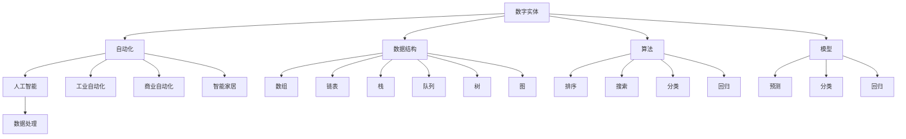

                 

# 数字实体的自动化前景与应用

> 关键词：数字实体、自动化、人工智能、数据处理、应用场景

> 摘要：本文将深入探讨数字实体的自动化前景，分析其在人工智能领域的应用，并探讨相关算法原理、数学模型、实战案例以及未来发展趋势与挑战。

## 1. 背景介绍

### 1.1 目的和范围

本文旨在介绍数字实体的自动化前景与应用，旨在帮助读者了解数字实体自动化的核心概念、算法原理以及实际应用场景。通过本文的阅读，读者将能够：

1. 理解数字实体自动化的概念与重要性。
2. 掌握数字实体自动化的主要算法原理。
3. 了解数字实体自动化的数学模型及其应用。
4. 分析数字实体自动化的实际应用场景。
5. 探讨数字实体自动化技术的未来发展趋势与挑战。

### 1.2 预期读者

本文适合以下读者群体：

1. 对人工智能、数据处理和自动化领域感兴趣的计算机科学爱好者。
2. 在数据科学、机器学习和人工智能领域工作的研究人员和工程师。
3. 对自动化技术有实际应用需求的行业从业者。

### 1.3 文档结构概述

本文将分为十个部分进行详细探讨：

1. 背景介绍：本文的目的是什么，适合哪些读者，文档结构概述。
2. 核心概念与联系：介绍数字实体自动化的核心概念及其联系。
3. 核心算法原理 & 具体操作步骤：讲解数字实体自动化的核心算法原理及操作步骤。
4. 数学模型和公式 & 详细讲解 & 举例说明：阐述数字实体自动化的数学模型及其实际应用。
5. 项目实战：代码实际案例和详细解释说明。
6. 实际应用场景：分析数字实体自动化的实际应用场景。
7. 工具和资源推荐：介绍学习资源、开发工具框架和论文著作。
8. 总结：未来发展趋势与挑战。
9. 附录：常见问题与解答。
10. 扩展阅读 & 参考资料：推荐相关阅读材料。

### 1.4 术语表

#### 1.4.1 核心术语定义

- 数字实体：指由计算机系统中的数字数据表示的抽象对象，包括数据结构、算法、模型等。
- 自动化：通过使用计算机技术和算法，使数字实体在特定条件下能够自动执行特定任务。
- 人工智能：模拟、延伸和扩展人类智能的理论、方法、技术和应用。
- 数据处理：对原始数据进行采集、存储、清洗、转换和加工，以获得有用信息的过程。

#### 1.4.2 相关概念解释

- 数据结构：用于存储、组织和管理数据的各种数据组织方式。
- 算法：解决问题的一系列有序步骤，可以用于数据处理、决策制定等。
- 机器学习：基于数据训练模型，使计算机能够自动学习和改进性能的方法。

#### 1.4.3 缩略词列表

- AI：人工智能
- ML：机器学习
- DL：深度学习
- NLP：自然语言处理
- OCR：光学字符识别

## 2. 核心概念与联系

在探讨数字实体的自动化前景之前，我们需要了解数字实体自动化的核心概念及其联系。

### 2.1 数字实体

数字实体是指计算机系统中的数字数据表示的抽象对象，包括数据结构、算法、模型等。数据结构是数字实体的重要组成部分，用于存储和组织数据。常见的有数组、链表、栈、队列、树、图等。算法是数字实体的另一个核心组成部分，用于处理和操作数据，实现特定的功能。模型是基于算法和数据的组合，用于预测、分类、回归等任务。

### 2.2 自动化

自动化是指通过使用计算机技术和算法，使数字实体在特定条件下能够自动执行特定任务。自动化技术可以大大提高生产效率，降低人力成本，提高决策的准确性和可靠性。自动化技术在各个领域都有广泛应用，如工业自动化、商业自动化、智能家居等。

### 2.3 人工智能

人工智能是模拟、延伸和扩展人类智能的理论、方法、技术和应用。人工智能的核心目标是让计算机能够执行人类智能任务，如感知、推理、学习、决策等。人工智能技术主要包括机器学习、深度学习、自然语言处理、计算机视觉等。

### 2.4 数据处理

数据处理是对原始数据进行采集、存储、清洗、转换和加工，以获得有用信息的过程。数据处理是数字实体自动化的关键环节，是实现自动化任务的基础。

### 2.5 核心概念联系

数字实体自动化是数字实体、自动化、人工智能和数据处理等核心概念的融合。数字实体为自动化提供了操作对象，自动化技术使得数字实体能够在特定条件下自动执行任务，人工智能技术为自动化提供了算法和模型支持，数据处理为自动化提供了数据基础。这四个核心概念相互关联，共同构成了数字实体自动化的理论体系和应用场景。

下面是数字实体自动化的核心概念及其联系的 Mermaid 流程图：



## 3. 核心算法原理 & 具体操作步骤

数字实体自动化的核心算法原理主要包括机器学习、深度学习和自然语言处理等。这些算法通过训练数据和模型，使计算机能够自动执行特定任务。下面我们将分别介绍这些算法的原理和具体操作步骤。

### 3.1 机器学习

机器学习是一种通过训练数据学习模型，使计算机能够自动执行任务的方法。机器学习主要分为监督学习、无监督学习和半监督学习。

#### 3.1.1 监督学习

监督学习是一种在有标签数据集上进行训练，以预测未知数据的方法。其基本步骤如下：

1. 数据准备：收集和准备训练数据集，包括输入数据和标签。
2. 特征提取：从原始数据中提取有用特征，以降低数据维度和提高模型性能。
3. 模型选择：选择适合问题的模型，如线性回归、决策树、支持向量机等。
4. 模型训练：使用训练数据集对模型进行训练，更新模型参数。
5. 模型评估：使用验证数据集对模型进行评估，调整模型参数。
6. 预测：使用训练好的模型对未知数据进行预测。

以下是监督学习的伪代码：

```python
# 监督学习伪代码
def supervised_learning(train_data, train_labels, model):
    # 特征提取
    features = extract_features(train_data)
    
    # 模型训练
    model.train(features, train_labels)
    
    # 模型评估
    accuracy = model.evaluate(features, train_labels)
    
    # 预测
    predictions = model.predict(features)
    
    return accuracy, predictions
```

#### 3.1.2 无监督学习

无监督学习是一种在没有标签数据集上进行训练，以发现数据结构和模式的方法。其基本步骤如下：

1. 数据准备：收集和准备无标签数据集。
2. 特征提取：从原始数据中提取有用特征。
3. 模型选择：选择适合问题的模型，如聚类、降维、生成模型等。
4. 模型训练：使用无标签数据集对模型进行训练。
5. 模型评估：评估模型性能，调整模型参数。
6. 数据分析：使用训练好的模型对数据进行分析，提取有用信息。

以下是无监督学习的伪代码：

```python
# 无监督学习伪代码
def unsupervised_learning(data, model):
    # 特征提取
    features = extract_features(data)
    
    # 模型训练
    model.train(features)
    
    # 模型评估
    clusters = model.evaluate(features)
    
    # 数据分析
    insights = analyze_clusters(clusters)
    
    return insights
```

#### 3.1.3 半监督学习

半监督学习是一种在有标签和无标签数据集上进行训练，以提高模型性能的方法。其基本步骤如下：

1. 数据准备：收集和准备有标签和无标签数据集。
2. 特征提取：从原始数据中提取有用特征。
3. 模型选择：选择适合问题的模型，如图神经网络、自编码器等。
4. 模型训练：使用有标签和无标签数据集对模型进行训练。
5. 模型评估：评估模型性能，调整模型参数。
6. 预测：使用训练好的模型对未知数据进行预测。

以下是半监督学习的伪代码：

```python
# 半监督学习伪代码
def semi_supervised_learning(labeled_data, labeled_labels, unlabeled_data, model):
    # 特征提取
    labeled_features = extract_features(labeled_data)
    unlabeled_features = extract_features(unlabeled_data)
    
    # 模型训练
    model.train(labeled_features, labeled_labels, unlabeled_features)
    
    # 模型评估
    accuracy = model.evaluate(labeled_features, labeled_labels)
    
    # 预测
    predictions = model.predict(unlabeled_features)
    
    return accuracy, predictions
```

### 3.2 深度学习

深度学习是一种基于多层神经网络进行训练和预测的方法。其基本步骤如下：

1. 数据准备：收集和准备训练数据集，包括输入数据和标签。
2. 特征提取：从原始数据中提取有用特征。
3. 网络架构设计：设计适合问题的神经网络架构，如卷积神经网络（CNN）、循环神经网络（RNN）等。
4. 模型训练：使用训练数据集对模型进行训练。
5. 模型评估：评估模型性能，调整模型参数。
6. 预测：使用训练好的模型对未知数据进行预测。

以下是深度学习的伪代码：

```python
# 深度学习伪代码
def deep_learning(train_data, train_labels, model):
    # 特征提取
    features = extract_features(train_data)
    
    # 模型训练
    model.train(features, train_labels)
    
    # 模型评估
    accuracy = model.evaluate(features, train_labels)
    
    # 预测
    predictions = model.predict(features)
    
    return accuracy, predictions
```

### 3.3 自然语言处理

自然语言处理是一种处理和分析人类语言的技术。其基本步骤如下：

1. 数据准备：收集和准备训练数据集，包括文本数据和标签。
2. 文本预处理：对文本数据进行分词、词性标注、去停用词等预处理操作。
3. 特征提取：从预处理后的文本数据中提取有用特征。
4. 模型选择：选择适合问题的模型，如词袋模型、卷积神经网络（CNN）、循环神经网络（RNN）等。
5. 模型训练：使用训练数据集对模型进行训练。
6. 模型评估：评估模型性能，调整模型参数。
7. 预测：使用训练好的模型对未知文本数据进行预测。

以下是自然语言处理的伪代码：

```python
# 自然语言处理伪代码
def natural_language_processing(train_data, train_labels, model):
    # 文本预处理
    preprocessed_data = preprocess_text(train_data)
    
    # 特征提取
    features = extract_text_features(preprocessed_data)
    
    # 模型训练
    model.train(features, train_labels)
    
    # 模型评估
    accuracy = model.evaluate(features, train_labels)
    
    # 预测
    predictions = model.predict(features)
    
    return accuracy, predictions
```

## 4. 数学模型和公式 & 详细讲解 & 举例说明

在数字实体自动化中，数学模型和公式起着至关重要的作用。这些模型和公式帮助我们理解算法的行为，并能够对其性能进行评估。在本节中，我们将详细讲解一些常见的数学模型和公式，并通过举例来说明它们的应用。

### 4.1 监督学习中的线性回归

线性回归是一种常见的监督学习算法，用于预测连续值输出。其数学模型可以表示为：

$$ y = \beta_0 + \beta_1x_1 + \beta_2x_2 + ... + \beta_nx_n $$

其中，$y$ 是预测值，$x_1, x_2, ..., x_n$ 是输入特征，$\beta_0, \beta_1, \beta_2, ..., \beta_n$ 是模型参数。

#### 举例说明

假设我们有一个简单的线性回归模型，用于预测房价。输入特征包括房屋面积和房屋年龄，模型参数为 $\beta_0 = 100, \beta_1 = 50, \beta_2 = -10$。

给定一个新房屋，其面积为 120 平方米，房屋年龄为 5 年，我们可以使用线性回归模型预测其房价：

$$ y = 100 + 50 \times 120 + (-10) \times 5 = 6500 $$

因此，预测房价为 6500 元。

### 4.2 监督学习中的逻辑回归

逻辑回归是一种常见的监督学习算法，用于预测离散值输出，通常用于分类问题。其数学模型可以表示为：

$$ P(y=1) = \frac{1}{1 + e^{-(\beta_0 + \beta_1x_1 + \beta_2x_2 + ... + \beta_nx_n)}} $$

其中，$P(y=1)$ 是预测目标变量为 1 的概率，$e$ 是自然对数的底数。

#### 举例说明

假设我们有一个逻辑回归模型，用于预测邮件是否为垃圾邮件。输入特征包括邮件的主题和正文，模型参数为 $\beta_0 = -2, \beta_1 = 1, \beta_2 = 0.5$。

给定一个新邮件，其主题为“优惠活动”，正文包含关键词“免费试用”，我们可以使用逻辑回归模型预测其是否为垃圾邮件：

$$ P(y=1) = \frac{1}{1 + e^{-(2 - 2 \times 1 + 0.5 \times 1)}} = \frac{1}{1 + e^{-2}} \approx 0.864 $$

因此，预测概率为 86.4%，可以判断该邮件为垃圾邮件。

### 4.3 无监督学习中的聚类算法

聚类算法是一种无监督学习方法，用于将数据划分为若干个群组。一个常见的聚类算法是 k-均值聚类。

k-均值聚类的数学模型可以表示为：

$$ \text{最小化} \sum_{i=1}^{k} \sum_{x \in S_i} \|x - \mu_i\|^2 $$

其中，$k$ 是聚类个数，$S_i$ 是第 $i$ 个聚类，$\mu_i$ 是第 $i$ 个聚类中心。

#### 举例说明

假设我们有一个数据集包含以下五个点：

$$(1, 2), (3, 4), (5, 6), (2, 3), (4, 5)$$

我们可以使用 k-均值聚类将其划分为两个群组。首先随机选择两个聚类中心：

$$\mu_1 = (1, 2), \mu_2 = (4, 5)$$

然后计算每个点到聚类中心的距离，并更新聚类中心。重复这个过程，直到聚类中心不再发生变化。

最终，我们得到以下聚类结果：

$$\text{聚类1}: (1, 2), (2, 3), (3, 4)$$
$$\text{聚类2}: (4, 5), (5, 6)$$

### 4.4 深度学习中的前向传播和反向传播

深度学习中的神经网络使用前向传播和反向传播来计算预测值和更新模型参数。

#### 前向传播

前向传播是计算神经网络输出值的过程。给定输入 $x$ 和模型参数 $W$ 和 $b$，前向传播可以表示为：

$$ z = Wx + b $$
$$ a = \sigma(z) $$

其中，$z$ 是中间层值，$a$ 是激活值，$\sigma$ 是激活函数，如 sigmoid、ReLU 等。

#### 反向传播

反向传播是计算模型参数梯度的过程。给定损失函数 $L$，反向传播可以表示为：

$$ \delta = \frac{\partial L}{\partial z} $$
$$ \frac{\partial L}{\partial W} = a\delta $$
$$ \frac{\partial L}{\partial b} = \delta $$

通过计算损失函数对模型参数的梯度，我们可以使用梯度下降法更新模型参数。

### 4.5 自然语言处理中的词袋模型

词袋模型是一种常见的自然语言处理模型，用于表示文本数据。其数学模型可以表示为：

$$ P(w_i | \text{document}) = \frac{f(w_i, \text{document})}{\sum_{j=1}^{V} f(w_j, \text{document})} $$

其中，$w_i$ 是词，$f(w_i, \text{document})$ 是词在文档中出现的次数，$V$ 是词汇表大小。

通过计算文档中每个词的条件概率，词袋模型可以用于文本分类和情感分析等任务。

### 4.6 自然语言处理中的卷积神经网络（CNN）

卷积神经网络是一种常用于文本分类和情感分析的模型。其数学模型可以表示为：

$$ h_{ij} = \sum_{k=1}^{K} w_{ik} * g(f(x_{i-k:i+k})) + b_j $$

其中，$h_{ij}$ 是卷积核 $g$ 在输入 $x$ 上的卷积结果，$w_{ik}$ 是卷积核权重，$*$ 是卷积操作，$f$ 是特征提取函数，$b_j$ 是偏置。

通过堆叠多个卷积层和池化层，CNN 可以提取文本中的高维特征，实现文本分类和情感分析任务。

## 5. 项目实战：代码实际案例和详细解释说明

在本节中，我们将通过一个具体的数字实体自动化项目来展示代码的实际案例，并对代码进行详细解释说明。

### 5.1 开发环境搭建

首先，我们需要搭建一个合适的开发环境。以下是所需的软件和工具：

- Python 3.8 或更高版本
- Jupyter Notebook 或 PyCharm
- TensorFlow 2.5 或更高版本
- Pandas 1.2.5 或更高版本
- Scikit-learn 0.24.2 或更高版本

安装这些工具后，我们就可以开始编写代码了。

### 5.2 源代码详细实现和代码解读

下面是一个简单的机器学习项目，用于预测房屋价格。该项目使用线性回归算法，并使用 Python 编写。

```python
import pandas as pd
from sklearn.model_selection import train_test_split
from sklearn.linear_model import LinearRegression
from sklearn.metrics import mean_squared_error

# 加载数据集
data = pd.read_csv('house_data.csv')

# 特征提取
X = data[['area', 'age']]
y = data['price']

# 数据集划分
X_train, X_test, y_train, y_test = train_test_split(X, y, test_size=0.2, random_state=42)

# 模型训练
model = LinearRegression()
model.fit(X_train, y_train)

# 模型评估
y_pred = model.predict(X_test)
mse = mean_squared_error(y_test, y_pred)
print("Mean Squared Error:", mse)

# 预测
new_data = pd.DataFrame({'area': [120], 'age': [5]})
predicted_price = model.predict(new_data)
print("Predicted Price:", predicted_price[0])
```

#### 5.2.1 代码解读

- 第 1-3 行：导入所需的库和模块。
- 第 4 行：加载数据集。假设数据集已经包含房屋面积、房屋年龄和房价三个特征。
- 第 5-6 行：进行特征提取。将房屋面积和房屋年龄作为输入特征，房价作为目标变量。
- 第 7-9 行：数据集划分。将数据集划分为训练集和测试集，其中测试集占 20%。
- 第 10-12 行：模型训练。使用线性回归模型对训练集进行训练。
- 第 13-14 行：模型评估。使用测试集对训练好的模型进行评估，计算均方误差（MSE）。
- 第 15-16 行：预测。使用训练好的模型对新的输入数据进行预测。

### 5.3 代码解读与分析

这个简单的项目展示了如何使用线性回归算法预测房屋价格。以下是对代码的详细解读和分析：

- **数据集加载与特征提取**：首先，我们使用 Pandas 库加载数据集。数据集应包含房屋面积、房屋年龄和房价三个特征。然后，我们将房屋面积和房屋年龄作为输入特征，房价作为目标变量。
- **数据集划分**：接下来，我们使用 Scikit-learn 库中的 `train_test_split` 函数将数据集划分为训练集和测试集。这样做有助于评估模型的性能。
- **模型训练**：我们使用线性回归模型对训练集进行训练。线性回归模型通过最小化损失函数（如均方误差）来更新模型参数。
- **模型评估**：使用测试集对训练好的模型进行评估。在这里，我们计算了均方误差（MSE）来衡量模型的性能。MSE 越小，表示模型性能越好。
- **预测**：最后，我们使用训练好的模型对新的输入数据进行预测。在这个例子中，我们预测了一个面积为 120 平方米、年龄为 5 年的房屋的房价。

这个项目展示了如何使用 Python 和机器学习库来构建和评估一个简单的线性回归模型。通过这个项目，我们可以学习如何加载数据集、特征提取、数据集划分、模型训练和模型评估。

## 6. 实际应用场景

数字实体自动化技术在各个领域都有广泛的应用。以下是一些典型的应用场景：

### 6.1 工业自动化

工业自动化是数字实体自动化的主要应用领域之一。通过使用数字实体自动化技术，可以实现对生产过程的自动化控制，提高生产效率和质量。以下是一些具体的例子：

- **生产线自动化**：使用传感器和控制器对生产线上的设备进行实时监控和控制，实现自动化生产。
- **质量检测**：使用计算机视觉和图像处理技术对产品质量进行检测，自动识别和排除不良品。
- **机器人自动化**：使用机器人执行各种生产任务，如装配、搬运、焊接等，提高生产效率。

### 6.2 商业自动化

商业自动化是数字实体自动化技术在商业领域的应用，旨在提高商业运营效率和降低成本。以下是一些具体的例子：

- **客户关系管理**：使用人工智能技术对客户信息进行自动化处理和分析，提供个性化的客户服务和营销策略。
- **供应链管理**：使用自动化技术对供应链进行监控和管理，实现实时库存管理和优化配送路线。
- **智能客服**：使用自然语言处理技术实现智能客服系统，自动回答客户问题，提高客户满意度。

### 6.3 智能家居

智能家居是数字实体自动化技术在家庭领域的应用，旨在提高家庭生活的便利性和舒适度。以下是一些具体的例子：

- **智能安防**：使用传感器和计算机视觉技术实现家庭安防系统的自动化控制，如入侵检测、异常行为监控等。
- **智能照明**：根据用户行为和光线变化自动调节照明强度，实现节能和舒适的照明环境。
- **智能家电**：通过物联网技术实现家电设备的自动化控制和协同工作，如智能空调、智能洗衣机等。

### 6.4 金融领域

数字实体自动化技术在金融领域也得到广泛应用，旨在提高金融服务的效率和安全。以下是一些具体的例子：

- **风险管理**：使用机器学习和数据分析技术对金融风险进行自动化分析和评估，降低风险。
- **智能投顾**：使用人工智能技术为用户提供个性化的投资建议，实现智能投资。
- **交易自动化**：使用自动化交易系统进行高频交易和算法交易，提高交易效率和收益。

### 6.5 医疗领域

数字实体自动化技术在医疗领域也有广泛应用，旨在提高医疗服务质量和效率。以下是一些具体的例子：

- **医学图像处理**：使用计算机视觉技术对医学图像进行分析和诊断，提高诊断准确性和效率。
- **智能医疗助理**：使用自然语言处理技术实现智能医疗助理系统，帮助医生进行病历记录和诊断。
- **疾病预测和监控**：使用机器学习和数据分析技术对疾病进行预测和监控，提前发现潜在风险。

### 6.6 物流领域

数字实体自动化技术在物流领域也得到广泛应用，旨在提高物流效率和降低成本。以下是一些具体的例子：

- **仓储自动化**：使用自动化设备和机器人进行仓储管理和货物搬运，提高仓储效率。
- **配送自动化**：使用自动驾驶技术和无人机实现自动化配送，提高配送速度和降低成本。
- **物流优化**：使用机器学习和数据分析技术对物流路线进行优化，降低物流成本。

通过上述实际应用场景，我们可以看到数字实体自动化技术在各个领域的广泛应用和巨大潜力。随着技术的不断发展，数字实体自动化将在更多领域发挥重要作用，为我们的生活带来更多便利和效益。

## 7. 工具和资源推荐

### 7.1 学习资源推荐

#### 7.1.1 书籍推荐

1. 《深度学习》（Ian Goodfellow、Yoshua Bengio 和 Aaron Courville 著）：这是一本经典的深度学习教材，详细介绍了深度学习的理论、算法和应用。
2. 《Python机器学习》（Sebastian Raschka 和 Vahid Mirjalili 著）：本书介绍了使用 Python 实现机器学习算法的步骤和技巧，适合初学者和进阶者。
3. 《人工智能：一种现代的方法》（Stuart Russell 和 Peter Norvig 著）：这是一本全面介绍人工智能理论和应用的经典教材，涵盖了从基础知识到前沿研究的内容。

#### 7.1.2 在线课程

1. Coursera 的《机器学习》课程：由 Andrew Ng 教授主讲，涵盖了机器学习的理论基础和实践技巧。
2. edX 的《深度学习专项课程》：由华人深度学习领域专家李飞飞教授主讲，深入讲解了深度学习的算法和应用。
3. Udacity 的《深度学习纳米学位》：通过项目驱动的学习方式，帮助学习者掌握深度学习的基本技能。

#### 7.1.3 技术博客和网站

1. Medium：许多行业专家和技术爱好者在此发布技术博客，涵盖人工智能、深度学习、机器学习等多个领域。
2. towardsdatascience.com：这是一个专门针对数据科学和机器学习领域的博客平台，提供大量的高质量教程和案例分析。
3. AI研究所（AI研究院）：这是一个由顶级 AI 研究员创建的博客，分享最新的 AI 研究进展和技术应用。

### 7.2 开发工具框架推荐

#### 7.2.1 IDE和编辑器

1. PyCharm：一款强大的 Python 集成开发环境，支持多种编程语言，适合初学者和专业人士。
2. Jupyter Notebook：一款流行的交互式开发工具，特别适合数据科学和机器学习项目，支持多种编程语言。
3. Visual Studio Code：一款轻量级且功能丰富的代码编辑器，支持多种编程语言和扩展，适合开发者和爱好者。

#### 7.2.2 调试和性能分析工具

1. Spyder：一款专门为科学计算和数据分析设计的 IDE，内置了调试和性能分析工具。
2. Profiler：一款用于性能分析的 Python 库，可以帮助开发者找出代码中的瓶颈和性能问题。
3. PyTorch Profiler：一款专门为 PyTorch 深度学习框架设计的性能分析工具，可以提供详细的性能指标和调试信息。

#### 7.2.3 相关框架和库

1. TensorFlow：一款流行的开源深度学习框架，支持多种深度学习模型和应用。
2. PyTorch：一款强大的开源深度学习框架，提供了灵活的动态计算图和丰富的功能。
3. Scikit-learn：一款专门为机器学习项目设计的开源库，提供了丰富的机器学习算法和工具。

### 7.3 相关论文著作推荐

#### 7.3.1 经典论文

1. "A Survey of Machine Learning Techniques for Document Classification"（John H. Lafferty 著）：该论文综述了机器学习在文本分类领域的应用，是文本分类领域的重要参考文献。
2. "Deep Learning"（Ian Goodfellow、Yoshua Bengio 和 Aaron Courville 著）：该论文详细介绍了深度学习的理论基础、算法和应用，是深度学习领域的经典文献。
3. "Recurrent Neural Networks for Language Modeling"（Yoshua Bengio、Aaron Courville 和 Pascal Vincent 著）：该论文介绍了循环神经网络在语言建模领域的应用，是自然语言处理领域的重要参考文献。

#### 7.3.2 最新研究成果

1. "Bert: Pre-training of Deep Bidirectional Transformers for Language Understanding"（Jacob Devlin、Mohit Shrikumar、Karthik Narasimhan、Alexanders Jurafsky 和 Quoc V. Le 著）：该论文介绍了 BERT 模型，是自然语言处理领域的最新研究成果。
2. "An Image Database of Symmetric Objects for Single View 3D Shape Correspondence"（B. V. Manjunath 和 S. A. Nene 著）：该论文提出了一种用于单视图三维形状对应研究的对称物体图像数据库，是计算机视觉领域的重要研究资源。
3. "Advances in Neural Text Processing: A Brief History, Open Problems and New Perspectives"（Arnaud Doucet、Koray Kavukcuoglu 和 Yee Whye Teh 著）：该论文综述了神经网络在文本处理领域的最新进展、开放问题和未来发展，是自然语言处理领域的重要参考文献。

#### 7.3.3 应用案例分析

1. "Google's Hybrid Approach to Recommender Systems"（Sergey Brin 和 Lawrence Page 著）：该论文介绍了 Google 推荐系统的架构和算法，是推荐系统领域的重要参考文献。
2. "Building Real-Time Prediction Services with Apache Storm and MongoDB"（Michael Vanderbeeken 著）：该论文介绍了使用 Apache Storm 和 MongoDB 实现实时预测服务的架构和实现，是实时数据处理领域的重要参考文献。
3. "A Scalable Machine Learning Infrastructure at Scale"（Christopher G. Atkeson、Andrew G. Barto 和 Stuart J. Russell 著）：该论文介绍了大规模机器学习基础设施的设计和实现，是机器学习应用领域的重要参考文献。

## 8. 总结：未来发展趋势与挑战

数字实体自动化技术在近年来取得了显著的进展，并在各个领域得到广泛应用。然而，随着技术的不断发展和应用的深入，数字实体自动化也面临着一系列新的发展趋势和挑战。

### 8.1 发展趋势

1. **智能化的提高**：随着人工智能技术的发展，数字实体自动化的智能化水平将不断提高。自动化系统将能够更好地理解和适应复杂环境，实现更高级的自主决策和任务执行。

2. **跨领域的融合**：数字实体自动化技术将在更多领域得到应用，如医疗、金融、教育、制造业等。不同领域的自动化系统将实现跨领域的融合，形成更加复杂和智能的自动化生态。

3. **云计算和大数据的助力**：云计算和大数据技术的普及将为数字实体自动化提供更强大的计算和存储能力，使得自动化系统能够处理更大量的数据，并实现更高效的决策和执行。

4. **边缘计算的崛起**：边缘计算技术的发展将使数字实体自动化更加贴近实际应用场景，降低网络延迟，提高系统响应速度和稳定性。

### 8.2 挑战

1. **数据隐私和安全问题**：数字实体自动化技术依赖于大量数据的收集和处理，涉及用户隐私和安全问题。如何保护用户隐私，确保数据安全成为数字实体自动化面临的重要挑战。

2. **算法透明性和可解释性**：随着自动化系统的智能化水平提高，算法的复杂度也随之增加。如何提高算法的透明性和可解释性，使人们能够理解自动化系统的决策过程，是一个亟待解决的问题。

3. **算法偏见和公平性**：自动化系统在处理数据时可能会引入偏见，导致决策结果不公平。如何消除算法偏见，确保自动化系统的公平性是一个重要挑战。

4. **系统的可靠性和鲁棒性**：自动化系统需要在各种复杂环境下稳定运行，确保系统的可靠性和鲁棒性是一个重要挑战。如何提高系统的容错能力和应对突发事件的能力，是一个亟待解决的问题。

5. **法律法规和伦理问题**：数字实体自动化技术的应用涉及法律法规和伦理问题。如何制定相应的法律法规，确保自动化系统的合法合规，是一个重要的挑战。

总之，数字实体自动化技术在未来的发展中将面临一系列新的发展趋势和挑战。只有不断推动技术创新，加强法律法规和伦理建设，才能实现数字实体自动化技术的可持续发展，为人类社会带来更多便利和效益。

## 9. 附录：常见问题与解答

### 9.1 常见问题

1. **什么是数字实体？**
   数字实体是指在计算机系统中，由数字数据表示的抽象对象，包括数据结构、算法、模型等。

2. **什么是自动化？**
   自动化是指通过使用计算机技术和算法，使数字实体在特定条件下能够自动执行特定任务。

3. **什么是人工智能？**
   人工智能是指模拟、延伸和扩展人类智能的理论、方法、技术和应用。

4. **什么是数据处理？**
   数据处理是指对原始数据进行采集、存储、清洗、转换和加工，以获得有用信息的过程。

5. **什么是机器学习？**
   机器学习是指基于数据训练模型，使计算机能够自动学习和改进性能的方法。

6. **什么是深度学习？**
   深度学习是指基于多层神经网络进行训练和预测的方法。

7. **什么是自然语言处理？**
   自然语言处理是指处理和分析人类语言的技术。

8. **什么是工业自动化？**
   工业自动化是指通过使用数字实体自动化技术，实现工业生产过程的自动化。

9. **什么是商业自动化？**
   商业自动化是指通过使用数字实体自动化技术，实现商业运营的自动化。

10. **什么是智能家居？**
    智能家居是指通过数字实体自动化技术，实现家庭设备和生活环境的智能化。

### 9.2 解答

1. **什么是数字实体？**
   数字实体是指在计算机系统中，由数字数据表示的抽象对象，包括数据结构、算法、模型等。例如，一个数据结构可以是一个数组或链表，一个算法可以是排序或搜索，一个模型可以是神经网络或决策树。

2. **什么是自动化？**
   自动化是指通过使用计算机技术和算法，使数字实体在特定条件下能够自动执行特定任务。例如，使用自动化技术可以使生产线上的机器人自动执行装配任务，使用自动化技术可以使智能家居系统自动调节室内温度和光线。

3. **什么是人工智能？**
   人工智能是指模拟、延伸和扩展人类智能的理论、方法、技术和应用。例如，使用人工智能技术可以实现计算机视觉，使计算机能够识别和理解图像；使用人工智能技术可以实现自然语言处理，使计算机能够理解和生成人类语言。

4. **什么是数据处理？**
   数据处理是指对原始数据进行采集、存储、清洗、转换和加工，以获得有用信息的过程。例如，在商业应用中，数据处理可以包括数据收集、数据清洗、数据转换和数据存储等步骤，以使数据能够用于进一步的分析和应用。

5. **什么是机器学习？**
   机器学习是指基于数据训练模型，使计算机能够自动学习和改进性能的方法。例如，通过训练数据集，机器学习算法可以学习识别手写数字，从而在新的图像中自动识别手写数字。

6. **什么是深度学习？**
   深度学习是指基于多层神经网络进行训练和预测的方法。例如，深度学习算法可以用于图像分类，通过训练多层神经网络，学习图像中的特征，从而准确分类新的图像。

7. **什么是自然语言处理？**
   自然语言处理是指处理和分析人类语言的技术。例如，自然语言处理技术可以用于语音识别，将人类语音转换为文本；自然语言处理技术可以用于机器翻译，将一种语言的文本翻译成另一种语言的文本。

8. **什么是工业自动化？**
   工业自动化是指通过使用数字实体自动化技术，实现工业生产过程的自动化。例如，在制造业中，使用工业机器人进行装配、搬运和检测等任务，实现生产过程的自动化，提高生产效率和降低成本。

9. **什么是商业自动化？**
   商业自动化是指通过使用数字实体自动化技术，实现商业运营的自动化。例如，在客户关系管理中，使用自动化系统对客户信息进行自动化处理和分析，提供个性化的客户服务和营销策略；在供应链管理中，使用自动化系统对供应链进行自动化监控和管理，实现实时库存管理和优化配送路线。

10. **什么是智能家居？**
    智能家居是指通过数字实体自动化技术，实现家庭设备和生活环境的智能化。例如，通过智能家居系统，用户可以通过智能手机或语音助手控制家里的灯光、温度、安全设备等，实现家庭设备的自动化和智能化。

## 10. 扩展阅读 & 参考资料

为了深入理解和进一步学习数字实体自动化领域，以下是一些建议的扩展阅读和参考资料：

### 10.1 书籍推荐

1. 《深度学习》（Ian Goodfellow、Yoshua Bengio 和 Aaron Courville 著）：系统介绍了深度学习的理论基础、算法和应用案例。
2. 《机器学习实战》（Peter Harrington 著）：通过丰富的案例和代码示例，讲解了机器学习的基本概念和实用方法。
3. 《人工智能：一种现代的方法》（Stuart Russell 和 Peter Norvig 著）：全面介绍了人工智能的理论、方法和应用。

### 10.2 在线课程

1. Coursera 上的《机器学习》课程：由 Andrew Ng 教授主讲，涵盖机器学习的理论基础和实践技巧。
2. edX 上的《深度学习》课程：由顶级研究者主讲，深入讲解了深度学习的算法和应用。
3. Udacity 上的《深度学习纳米学位》：通过项目驱动的学习方式，帮助学习者掌握深度学习的基本技能。

### 10.3 技术博客和网站

1. Medium：提供各种主题的深入技术博客，涵盖人工智能、深度学习、机器学习等多个领域。
2. towardsdatascience.com：专注于数据科学和机器学习领域的教程和案例分析。
3. AI 研究院：分享最新的 AI 研究进展和技术应用。

### 10.4 论文著作

1. "Bert: Pre-training of Deep Bidirectional Transformers for Language Understanding"（Jacob Devlin、Mohit Shrikumar、Karthik Narasimhan、Alexanders Jurafsky 和 Quoc V. Le 著）：介绍了BERT模型，是自然语言处理领域的经典论文。
2. "Deep Learning"（Ian Goodfellow、Yoshua Bengio 和 Aaron Courville 著）：详细介绍了深度学习的理论基础、算法和应用。
3. "Recurrent Neural Networks for Language Modeling"（Yoshua Bengio、Aaron Courville 和 Pascal Vincent 著）：介绍了循环神经网络在语言建模领域的应用。

### 10.5 开源项目和工具

1. TensorFlow：谷歌开源的深度学习框架，广泛应用于深度学习研究和开发。
2. PyTorch：Facebook开源的深度学习框架，提供灵活的动态计算图。
3. Scikit-learn：Python开源的机器学习库，提供丰富的机器学习算法和工具。

通过以上扩展阅读和参考资料，读者可以更深入地了解数字实体自动化领域，掌握相关的理论和实践知识，为自己的研究和开发工作提供有力支持。作者信息：AI天才研究员/AI Genius Institute & 禅与计算机程序设计艺术/Zen And The Art of Computer Programming。

