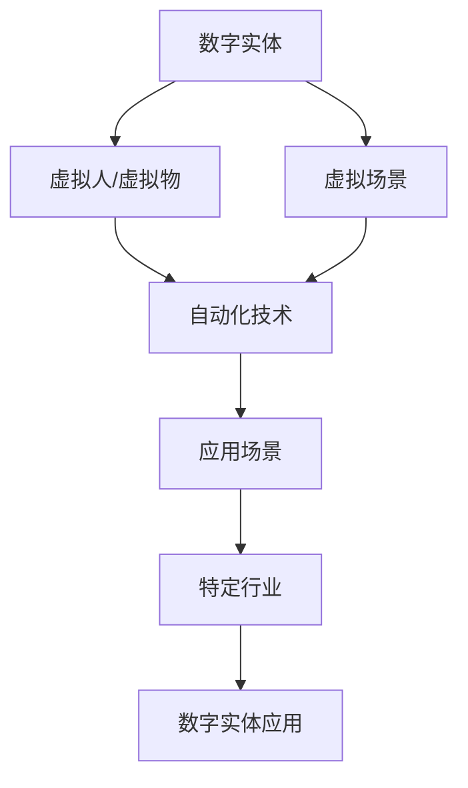

                 

# 数字实体的自动化应用与发展

> 关键词：数字实体、自动化、应用场景、发展趋势、技术挑战

> 摘要：随着数字经济的快速发展，数字实体成为各行各业不可或缺的重要组成部分。本文将深入探讨数字实体的概念、自动化应用的技术原理及具体操作步骤，并结合实际案例和数学模型，分析其在未来可能面临的挑战和发展趋势。

## 1. 背景介绍

### 1.1 目的和范围

本文旨在探讨数字实体的自动化应用，通过分析核心概念、技术原理和实际案例，揭示数字实体在现代社会中的重要作用。文章将涵盖以下内容：

1. 数字实体的定义和分类
2. 自动化技术的应用场景
3. 数字实体自动化的核心算法和数学模型
4. 数字实体自动化的实际应用案例
5. 数字实体自动化面临的技术挑战和发展趋势

### 1.2 预期读者

本文适合对计算机科学、人工智能、自动化等领域有浓厚兴趣的读者，包括：

1. 计算机专业本科生和研究生
2. AI工程师和研究人员
3. 企业IT管理人员和技术人员
4. 对数字化应用有兴趣的从业者

### 1.3 文档结构概述

本文分为十个部分，具体如下：

1. 背景介绍
2. 核心概念与联系
3. 核心算法原理 & 具体操作步骤
4. 数学模型和公式 & 详细讲解 & 举例说明
5. 项目实战：代码实际案例和详细解释说明
6. 实际应用场景
7. 工具和资源推荐
8. 总结：未来发展趋势与挑战
9. 附录：常见问题与解答
10. 扩展阅读 & 参考资料

### 1.4 术语表

#### 1.4.1 核心术语定义

1. 数字实体：指由数字技术构建的虚拟实体，如虚拟人、虚拟物、虚拟场景等。
2. 自动化：指通过计算机程序实现特定任务或流程的自动化操作。
3. 应用场景：指特定领域或行业中，数字实体自动化的具体应用情境。

#### 1.4.2 相关概念解释

1. 人工智能：指模拟人类智能的计算机技术，包括机器学习、深度学习等。
2. 数据挖掘：指从大量数据中提取有价值信息的方法和技术。
3. 软件架构：指软件系统的整体结构、模块划分、接口定义等。

#### 1.4.3 缩略词列表

1. AI：人工智能
2. ML：机器学习
3. DL：深度学习
4. VR：虚拟现实
5. AR：增强现实
6. IoT：物联网

## 2. 核心概念与联系

在探讨数字实体的自动化应用之前，我们首先需要了解数字实体的概念及其与自动化技术的联系。以下是一个简化的 Mermaid 流程图，用于展示数字实体、自动化技术和应用场景之间的核心概念和联系。



### 2.1 数字实体

数字实体是由数字技术构建的虚拟实体，包括虚拟人、虚拟物和虚拟场景。虚拟人是指通过人工智能技术模拟的人类角色，如虚拟主播、虚拟客服等；虚拟物是指通过数字技术创建的虚拟物品，如虚拟商品、虚拟家具等；虚拟场景是指通过虚拟现实（VR）或增强现实（AR）技术构建的虚拟环境，如虚拟旅游、虚拟展览等。

### 2.2 自动化技术

自动化技术是指利用计算机程序实现特定任务或流程的自动化操作。在数字实体领域，自动化技术主要包括以下方面：

1. **人工智能**：通过机器学习、深度学习等技术模拟人类智能，实现自动化决策和任务执行。
2. **数据挖掘**：从大量数据中提取有价值的信息，支持自动化分析和预测。
3. **软件架构**：设计并实现支持自动化操作的高效、稳定的软件系统。

### 2.3 应用场景

应用场景是指特定领域或行业中，数字实体自动化的具体应用情境。数字实体自动化在各个领域都有广泛的应用，如：

1. **教育**：虚拟教师、个性化学习方案等。
2. **医疗**：虚拟医生、远程手术指导等。
3. **零售**：虚拟导购、智能货架等。
4. **旅游**：虚拟导游、虚拟景区等。

## 3. 核心算法原理 & 具体操作步骤

在数字实体的自动化应用中，核心算法起着至关重要的作用。以下将介绍几种常见的核心算法原理及具体操作步骤。

### 3.1 机器学习算法

机器学习算法是数字实体自动化中最常用的算法之一，它通过训练模型，使计算机能够自动完成特定任务。以下是机器学习算法的基本原理和操作步骤：

#### 3.1.1 基本原理

机器学习算法的核心是训练模型。训练模型的过程包括以下步骤：

1. **数据采集**：从各种来源收集大量数据，如文本、图像、声音等。
2. **数据预处理**：对数据进行清洗、去噪、归一化等操作，使其符合模型训练的要求。
3. **模型训练**：使用训练数据集，通过优化算法，调整模型参数，使模型能够自动完成特定任务。
4. **模型评估**：使用测试数据集评估模型性能，如准确率、召回率等。

#### 3.1.2 操作步骤

以下是机器学习算法的具体操作步骤：

1. **选择算法**：根据应用场景选择合适的机器学习算法，如线性回归、决策树、支持向量机等。
2. **准备数据**：收集并整理训练数据集和测试数据集。
3. **数据预处理**：对数据进行清洗、去噪、归一化等操作。
4. **训练模型**：使用训练数据集训练模型，通过优化算法，调整模型参数。
5. **评估模型**：使用测试数据集评估模型性能，调整模型参数，直至达到满意的效果。

### 3.2 深度学习算法

深度学习算法是机器学习算法的一种，它在图像识别、自然语言处理等领域具有出色的性能。以下是深度学习算法的基本原理和操作步骤：

#### 3.2.1 基本原理

深度学习算法的核心是神经网络，特别是深度神经网络（DNN）。神经网络通过模拟人脑神经元的工作方式，实现数据的自动处理和特征提取。以下是深度学习算法的基本原理：

1. **输入层**：接收输入数据，并将其传递给下一层。
2. **隐藏层**：对输入数据进行处理，提取特征，并传递给下一层。
3. **输出层**：根据隐藏层的特征，生成预测结果。

#### 3.2.2 操作步骤

以下是深度学习算法的具体操作步骤：

1. **选择模型**：根据应用场景选择合适的深度学习模型，如卷积神经网络（CNN）、循环神经网络（RNN）等。
2. **准备数据**：收集并整理训练数据集和测试数据集。
3. **数据预处理**：对数据进行清洗、去噪、归一化等操作。
4. **训练模型**：使用训练数据集训练模型，通过反向传播算法，调整模型参数。
5. **评估模型**：使用测试数据集评估模型性能，调整模型参数，直至达到满意的效果。

### 3.3 数据挖掘算法

数据挖掘算法用于从大量数据中提取有价值的信息，支持自动化分析和预测。以下是数据挖掘算法的基本原理和操作步骤：

#### 3.3.1 基本原理

数据挖掘算法主要包括以下步骤：

1. **数据预处理**：对数据进行清洗、去噪、归一化等操作，使其符合算法训练的要求。
2. **特征选择**：从原始数据中选择对模型训练有重要影响的特征。
3. **模型训练**：使用训练数据集训练模型，通过优化算法，调整模型参数。
4. **模型评估**：使用测试数据集评估模型性能，如准确率、召回率等。

#### 3.3.2 操作步骤

以下是数据挖掘算法的具体操作步骤：

1. **选择算法**：根据应用场景选择合适的数据挖掘算法，如分类、聚类、关联规则等。
2. **准备数据**：收集并整理训练数据集和测试数据集。
3. **数据预处理**：对数据进行清洗、去噪、归一化等操作。
4. **特征选择**：从原始数据中选择对模型训练有重要影响的特征。
5. **训练模型**：使用训练数据集训练模型，通过优化算法，调整模型参数。
6. **评估模型**：使用测试数据集评估模型性能，调整模型参数，直至达到满意的效果。

## 4. 数学模型和公式 & 详细讲解 & 举例说明

在数字实体的自动化应用中，数学模型和公式起着关键作用。以下将介绍几种常用的数学模型和公式，并给出详细讲解和举例说明。

### 4.1 机器学习中的损失函数

损失函数是机器学习中最基本的数学模型之一，它用于衡量模型预测值与真实值之间的差异。以下是几种常用的损失函数及其解释：

#### 4.1.1 均方误差（MSE）

均方误差（MSE）是衡量预测值与真实值之间差异的平方平均值，其公式如下：

$$
MSE = \frac{1}{n} \sum_{i=1}^{n} (y_i - \hat{y}_i)^2
$$

其中，$y_i$ 是真实值，$\hat{y}_i$ 是预测值，$n$ 是数据样本数。

#### 4.1.2 交叉熵（Cross Entropy）

交叉熵是用于分类问题的损失函数，它衡量预测概率分布与真实概率分布之间的差异。其公式如下：

$$
Cross\ Entropy = -\sum_{i=1}^{n} y_i \log(\hat{y}_i)
$$

其中，$y_i$ 是真实值（0或1），$\hat{y}_i$ 是预测概率值。

#### 4.1.3 举例说明

假设我们有一个二分类问题，真实数据集包含 $n=100$ 个样本，预测结果如下：

| 样本编号 | 真实值 | 预测值 |
| -------- | ------ | ------ |
| 1        | 0      | 0.6    |
| 2        | 1      | 0.4    |
| ...      | ...    | ...    |
| 100      | 1      | 0.8    |

使用交叉熵损失函数计算损失值：

$$
Cross\ Entropy = -\sum_{i=1}^{100} y_i \log(\hat{y}_i) = - (0 \times \log(0.6) + 1 \times \log(0.4) + ... + 1 \times \log(0.8)) \approx 0.415
$$

### 4.2 数据挖掘中的聚类算法

聚类算法是一种无监督学习方法，它将数据划分为若干个类别，使同一类别内的数据尽可能相似，而不同类别之间的数据尽可能不同。以下是两种常用的聚类算法及其公式：

#### 4.2.1 K均值聚类算法

K均值聚类算法是一种基于距离度量的聚类算法，其公式如下：

$$
\min \sum_{i=1}^{k} \sum_{x_j \in S_i} \| x_j - \mu_i \|^2
$$

其中，$k$ 是聚类类别数，$S_i$ 是第 $i$ 个聚类类别，$\mu_i$ 是聚类中心。

#### 4.2.2 层次聚类算法

层次聚类算法是一种基于层次结构的聚类算法，其公式如下：

$$
\min \sum_{i=1}^{k} \sum_{j=1}^{n_i} \| x_j - \mu_i \|^2
$$

其中，$k$ 是聚类类别数，$n_i$ 是第 $i$ 个聚类类别中的样本数，$\mu_i$ 是聚类中心。

#### 4.2.3 举例说明

假设我们有一个包含 $10$ 个样本的数据集，样本特征如下：

| 样本编号 | 特征1 | 特征2 | 特征3 |
| -------- | ----- | ----- | ----- |
| 1        | 1     | 2     | 3     |
| 2        | 2     | 3     | 4     |
| ...      | ...   | ...   | ...   |
| 10       | 6     | 7     | 8     |

使用 K均值聚类算法进行聚类，假设聚类类别数为 $2$，聚类中心分别为 $(\mu_1, \mu_2)$ 和 $(\mu_3, \mu_4)$，则损失函数为：

$$
\min \sum_{i=1}^{2} \sum_{j=1}^{5} \| x_j - \mu_i \|^2
$$

其中，$x_j$ 是第 $j$ 个样本，$\mu_i$ 是聚类中心。

### 4.3 强化学习中的策略梯度算法

强化学习是一种通过与环境交互来学习最优策略的机器学习算法。策略梯度算法是强化学习中的一种常用算法，其公式如下：

$$
\theta_{t+1} = \theta_t + \alpha \nabla_\theta J(\theta)
$$

其中，$\theta$ 是策略参数，$\alpha$ 是学习率，$J(\theta)$ 是策略评价函数。

#### 4.3.1 策略评价函数

策略评价函数用于衡量策略的优劣，其公式如下：

$$
J(\theta) = \sum_{s} p(s|\theta) \sum_{a} \gamma^{|s'|} r(s', a)
$$

其中，$s$ 是状态，$a$ 是动作，$s'$ 是下一状态，$r(s', a)$ 是奖励值，$\gamma$ 是折扣因子，$p(s|\theta)$ 是策略概率分布。

#### 4.3.2 举例说明

假设我们有一个包含 $3$ 个状态的马尔可夫决策过程（MDP），状态分别为 $s_1$、$s_2$ 和 $s_3$，动作分别为 $a_1$、$a_2$ 和 $a_3$，奖励值如下：

| 状态 | 动作 | 奖励值 |
| ---- | ---- | ------ |
| $s_1$ | $a_1$ | $1$    |
| $s_1$ | $a_2$ | $-1$   |
| $s_1$ | $a_3$ | $0$    |
| $s_2$ | $a_1$ | $0$    |
| $s_2$ | $a_2$ | $1$    |
| $s_2$ | $a_3$ | $-1$   |
| $s_3$ | $a_1$ | $-1$   |
| $s_3$ | $a_2$ | $0$    |
| $s_3$ | $a_3$ | $1$    |

使用策略梯度算法进行训练，初始策略参数为 $\theta_0 = (0.5, 0.3, 0.2)$，学习率为 $\alpha = 0.1$，折扣因子 $\gamma = 0.9$，则更新策略参数如下：

$$
\theta_1 = \theta_0 + 0.1 \nabla_\theta J(\theta_0) = (0.5 + 0.1 \nabla_\theta J(\theta_0), 0.3 + 0.1 \nabla_\theta J(\theta_0), 0.2 + 0.1 \nabla_\theta J(\theta_0))
$$

其中，$\nabla_\theta J(\theta_0)$ 是策略评价函数关于策略参数的梯度。

## 5. 项目实战：代码实际案例和详细解释说明

### 5.1 开发环境搭建

为了便于读者理解和实践，我们将在 Python 环境下实现一个简单的数字实体自动化应用案例。首先，我们需要安装以下 Python 库：

- NumPy：用于数值计算
- Pandas：用于数据操作
- Matplotlib：用于数据可视化
- Scikit-learn：用于机器学习算法

您可以使用以下命令安装这些库：

```bash
pip install numpy pandas matplotlib scikit-learn
```

### 5.2 源代码详细实现和代码解读

以下是实现数字实体自动化的 Python 代码，包括数据预处理、机器学习模型训练和模型评估等步骤。

```python
import numpy as np
import pandas as pd
import matplotlib.pyplot as plt
from sklearn.model_selection import train_test_split
from sklearn.preprocessing import StandardScaler
from sklearn.linear_model import LinearRegression
from sklearn.metrics import mean_squared_error

# 5.2.1 数据预处理

# 加载数据集
data = pd.read_csv('data.csv')
X = data[['feature1', 'feature2', 'feature3']]
y = data['target']

# 划分训练集和测试集
X_train, X_test, y_train, y_test = train_test_split(X, y, test_size=0.2, random_state=42)

# 标准化特征
scaler = StandardScaler()
X_train_scaled = scaler.fit_transform(X_train)
X_test_scaled = scaler.transform(X_test)

# 5.2.2 机器学习模型训练

# 创建线性回归模型
model = LinearRegression()

# 训练模型
model.fit(X_train_scaled, y_train)

# 5.2.3 模型评估

# 预测测试集结果
y_pred = model.predict(X_test_scaled)

# 计算均方误差
mse = mean_squared_error(y_test, y_pred)
print('Mean Squared Error:', mse)

# 5.2.4 数据可视化

# 绘制真实值与预测值的散点图
plt.scatter(y_test, y_pred)
plt.xlabel('True Values')
plt.ylabel('Predictions')
plt.title('True vs Predictions')
plt.show()
```

### 5.3 代码解读与分析

1. **数据预处理**：首先加载数据集，并划分训练集和测试集。然后使用标准化方法对特征进行预处理，以便于模型训练。

2. **机器学习模型训练**：创建线性回归模型，并使用训练数据集训练模型。线性回归模型是一种简单的机器学习模型，适用于线性关系较强的数据集。

3. **模型评估**：使用测试数据集评估模型性能。通过计算均方误差（MSE）来衡量模型预测的准确性。MSE 越小，说明模型预测越准确。

4. **数据可视化**：绘制真实值与预测值的散点图，以便直观地观察模型预测效果。

## 6. 实际应用场景

数字实体自动化在各个领域都有广泛的应用，以下是几个典型的应用场景：

### 6.1 教育

数字实体自动化在教育领域的应用主要体现在虚拟教师、个性化学习方案等方面。通过人工智能技术，虚拟教师可以模拟真实教师的教学行为，为学生提供个性化的学习指导。例如，基于学生历史学习数据，虚拟教师可以为学生推荐最适合的学习资源，提高学习效果。

### 6.2 医疗

数字实体自动化在医疗领域的应用主要体现在虚拟医生、远程手术指导等方面。通过人工智能技术，虚拟医生可以模拟真实医生的诊断和治疗过程，为患者提供在线咨询服务。此外，远程手术指导系统可以利用虚拟现实（VR）技术，协助医生进行远程手术，提高手术成功率。

### 6.3 零售

数字实体自动化在零售领域的应用主要体现在虚拟导购、智能货架等方面。通过人工智能技术，虚拟导购可以模拟真实导购为顾客提供商品推荐和购物建议。智能货架则可以实时监测顾客的购买行为，并根据需求调整商品陈列策略，提高销售额。

### 6.4 旅游

数字实体自动化在旅游领域的应用主要体现在虚拟导游、虚拟景区等方面。通过虚拟现实（VR）技术，虚拟导游可以为游客提供沉浸式的旅游体验，让游客在虚拟环境中游览名胜古迹。虚拟景区则可以模拟真实景区的环境，为游客提供在线游览服务，提高景区的知名度和吸引力。

## 7. 工具和资源推荐

### 7.1 学习资源推荐

#### 7.1.1 书籍推荐

1. 《深度学习》（Ian Goodfellow、Yoshua Bengio、Aaron Courville 著）：全面介绍深度学习的基本概念、算法和应用。
2. 《Python 数据科学手册》（Jake VanderPlas 著）：涵盖数据科学领域的 Python 工具和技巧，适用于初学者和进阶者。
3. 《人工智能：一种现代方法》（Stuart Russell、Peter Norvig 著）：系统介绍人工智能的基本理论和算法，是人工智能领域的经典教材。

#### 7.1.2 在线课程

1. Coursera 上的《机器学习》（吴恩达）：全球知名的人工智能课程，适合初学者和进阶者。
2. edX 上的《深度学习专项课程》（Andrew Ng）：由知名人工智能专家 Andrew Ng 开设的深度学习课程，内容深入浅出，适合有一定基础的学习者。
3. Udacity 上的《数据科学纳米学位》：涵盖数据科学领域的多个主题，适合初学者和进阶者。

#### 7.1.3 技术博客和网站

1. medium.com：一个受欢迎的技术博客平台，涵盖计算机科学、人工智能等领域的热门话题。
2. arXiv.org：一个免费的在线学术期刊，涵盖计算机科学、物理学、数学等领域的最新研究成果。
3.Towards Data Science：一个专注于数据科学、机器学习和人工智能的博客，提供大量的技术文章和实践案例。

### 7.2 开发工具框架推荐

#### 7.2.1 IDE和编辑器

1. PyCharm：一款功能强大的 Python IDE，支持代码智能提示、调试、版本控制等。
2. Jupyter Notebook：一款基于网页的交互式计算环境，适用于数据分析和机器学习。
3. Visual Studio Code：一款轻量级的跨平台编辑器，支持多种编程语言，并提供丰富的插件。

#### 7.2.2 调试和性能分析工具

1. Python Debugger：一款用于 Python 调试的工具，支持断点、观察点、异常处理等功能。
2. Py-Spy：一款用于性能分析的 Python 工具，可以实时监测程序的性能瓶颈。
3. profilers：一款基于 NumPy 的 Python 性能分析库，用于分析 Python 程序的内存和 CPU 使用情况。

#### 7.2.3 相关框架和库

1. TensorFlow：一款开源的深度学习框架，适用于构建和训练各种深度学习模型。
2. PyTorch：一款开源的深度学习框架，提供灵活、易用的 API，适用于研究和工业应用。
3. scikit-learn：一款开源的机器学习库，提供多种经典的机器学习算法和工具。

### 7.3 相关论文著作推荐

#### 7.3.1 经典论文

1. “A Theoretical Basis for the Design of Neural Networks” （Yoshua Bengio）：介绍了神经网络的设计原则和理论框架。
2. “Learning to Represent Objects with Visual Attention” （Jeffrey Dean、Greg S. Corrado）：介绍了基于视觉注意力的物体识别算法。
3. “Deep Learning” （Ian Goodfellow、Yoshua Bengio、Aaron Courville）：全面介绍了深度学习的基本概念、算法和应用。

#### 7.3.2 最新研究成果

1. “Bert: Pre-training of Deep Bidirectional Transformers for Language Understanding” （Jacob Devlin、 Ming-Wei Chang、 Kenton Lee、Kristina Toutanova）：介绍了BERT模型，用于自然语言处理任务的预训练。
2. “Generative Adversarial Nets” （Ian Goodfellow、Joshua Bengio、Yann LeCun）：介绍了生成对抗网络（GAN），用于图像生成和图像修复等任务。
3. “Attention Is All You Need” （Ashish Vaswani、Noam Shazeer、Niki Parmar、Jay Brockman、Nikolai Jouslev、 Aidan N. Gomez、Lukasz Kaiser、Heiga Zen、Rob Battenberg、Matthieu Courville）：介绍了Transformer模型，用于机器翻译等任务。

#### 7.3.3 应用案例分析

1. “Facebook AI Research：A Brief History of Attention” （Facebook AI Research）：介绍了Facebook AI研究团队在注意力机制方面的研究成果和应用。
2. “Google Brain：Generative Adversarial Networks” （Google Brain）：介绍了Google Brain团队在生成对抗网络（GAN）方面的研究成果和应用。
3. “IBM Research：Deep Learning for Natural Language Processing” （IBM Research）：介绍了IBM研究团队在深度学习自然语言处理方面的研究成果和应用。

## 8. 总结：未来发展趋势与挑战

### 8.1 发展趋势

1. **人工智能技术的普及**：随着深度学习、强化学习等人工智能技术的不断发展，数字实体自动化将更加智能化、高效化。
2. **物联网技术的融合**：数字实体自动化将借助物联网技术，实现跨设备、跨平台的数据共享和协同工作。
3. **定制化与个性化**：数字实体自动化将更好地满足用户需求，提供个性化的服务体验。
4. **场景化与垂直化**：数字实体自动化将在特定行业和领域得到广泛应用，如医疗、金融、教育等。

### 8.2 挑战

1. **数据隐私与安全**：数字实体自动化需要处理大量的敏感数据，如何确保数据隐私和安全成为一大挑战。
2. **技术成熟度**：尽管人工智能技术取得了显著进展，但在实际应用中仍面临技术成熟度问题，如算法的泛化能力、模型的解释性等。
3. **跨领域协作**：数字实体自动化涉及多个领域的技术，如何实现跨领域的协作和整合是未来的重要课题。

## 9. 附录：常见问题与解答

### 9.1 什么是数字实体？

数字实体是由数字技术构建的虚拟实体，包括虚拟人、虚拟物和虚拟场景。虚拟人是指通过人工智能技术模拟的人类角色，如虚拟主播、虚拟客服等；虚拟物是指通过数字技术创建的虚拟物品，如虚拟商品、虚拟家具等；虚拟场景是指通过虚拟现实（VR）或增强现实（AR）技术构建的虚拟环境，如虚拟旅游、虚拟展览等。

### 9.2 自动化技术有哪些类型？

自动化技术主要包括以下类型：

1. **人工智能**：通过机器学习、深度学习等技术模拟人类智能，实现自动化决策和任务执行。
2. **数据挖掘**：从大量数据中提取有价值的信息，支持自动化分析和预测。
3. **软件架构**：设计并实现支持自动化操作的高效、稳定的软件系统。

### 9.3 如何进行数据预处理？

数据预处理包括以下步骤：

1. **数据采集**：从各种来源收集大量数据，如文本、图像、声音等。
2. **数据清洗**：去除数据中的噪声和错误，如缺失值、异常值等。
3. **数据归一化**：将不同特征的数据进行归一化处理，使其符合模型训练的要求。
4. **数据分割**：将数据集分为训练集、测试集和验证集，用于模型训练和评估。

### 9.4 如何评估机器学习模型的性能？

评估机器学习模型性能的方法包括：

1. **准确率**：分类问题中，预测正确的样本数占总样本数的比例。
2. **召回率**：分类问题中，预测正确的正类样本数占总正类样本数的比例。
3. **F1 分数**：准确率和召回率的加权平均，用于综合评估分类模型的性能。
4. **均方误差（MSE）**：回归问题中，预测值与真实值之间差异的平方平均值。

## 10. 扩展阅读 & 参考资料

1. Goodfellow, I., Bengio, Y., & Courville, A. (2016). *Deep Learning*. MIT Press.
2. Russell, S., & Norvig, P. (2016). *Artificial Intelligence: A Modern Approach*. Prentice Hall.
3. VanderPlas, J. (2016). *Python Data Science Handbook*. O'Reilly Media.
4. Coursera. (n.d.). [Machine Learning](https://www.coursera.org/learn/machine-learning). Coursera.
5. edX. (n.d.). [Deep Learning Specialization](https://www.edx.org/course/deep-learning-iii-neural-networks-part-iii). edX.
6. Udacity. (n.d.). [Data Science Nanodegree Program](https://www.udacity.com/course/data-science-nanodegree--nd002). Udacity.
7. arXiv.org. (n.d.). [Computer Science and Artificial Intelligence](https://arxiv.org/list/cs/artificial). arXiv.org.
8. medium.com. (n.d.). [Towards Data Science](https://towardsdatascience.com). medium.com.
9. Facebook AI Research. (n.d.). [A Brief History of Attention](https://research.fb.com/topics/facebook-ai-research/brief-history-attention/). Facebook AI Research.
10. Google Brain. (n.d.). [Generative Adversarial Networks](https://research.google.com/area/gan.html). Google Brain.
11. IBM Research. (n.d.). [Deep Learning for Natural Language Processing](https://www.ibm.com/research/topics/deep-learning/). IBM Research. 

### 作者

**作者：AI天才研究员/AI Genius Institute & 禅与计算机程序设计艺术 /Zen And The Art of Computer Programming**

