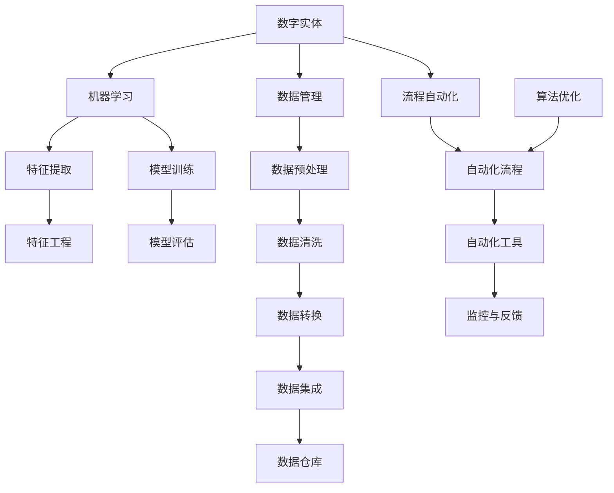

                 

# 数字实体的自动化进展与应用

> 关键词：数字实体、自动化、AI技术、流程优化、应用场景

> 摘要：本文将深入探讨数字实体的概念及其自动化技术，分析当前的发展现状、核心算法原理，并通过项目实战、实际应用场景等多个维度，全面解析数字实体自动化在各个行业中的应用及其未来的发展趋势与挑战。

## 1. 背景介绍

### 1.1 目的和范围

本文旨在梳理数字实体自动化的核心概念和发展脉络，分析其在各行业中的应用，以及探讨未来可能面临的挑战。文章将涵盖以下主要内容：

- 数字实体的定义和基本特性
- 自动化技术的发展趋势和核心算法
- 数字实体自动化的应用场景
- 项目实战案例解析
- 未来发展趋势与挑战

### 1.2 预期读者

- 对数字实体和自动化技术感兴趣的IT从业者
- 希望了解数字实体自动化在行业应用的技术人员
- 想要了解前沿技术发展趋势的科研人员和管理者

### 1.3 文档结构概述

本文结构分为十个部分，具体如下：

- 引言：介绍数字实体自动化的背景和重要性
- 核心概念与联系：定义数字实体和相关技术概念
- 核心算法原理 & 具体操作步骤：阐述自动化技术的核心算法原理
- 数学模型和公式 & 详细讲解 & 举例说明：使用数学模型和公式进行解释
- 项目实战：代码实际案例和详细解释说明
- 实际应用场景：分析自动化技术在不同领域的应用
- 工具和资源推荐：推荐学习资源和开发工具
- 总结：未来发展趋势与挑战
- 附录：常见问题与解答
- 扩展阅读 & 参考资料：提供进一步阅读的材料

### 1.4 术语表

#### 1.4.1 核心术语定义

- 数字实体：指在计算机系统中以数字形式表示的实体，如数据、对象、流程等。
- 自动化：通过计算机程序、算法等技术手段，使系统或过程自动运行，减少人工干预。
- 人工智能（AI）：模拟人类智能行为的技术，包括机器学习、深度学习等。

#### 1.4.2 相关概念解释

- 机器学习（ML）：使计算机系统能够从数据中学习并做出决策的技术。
- 深度学习（DL）：一种基于多层神经网络的学习方式，可以自动提取数据的特征。

#### 1.4.3 缩略词列表

- AI：人工智能
- ML：机器学习
- DL：深度学习
- IDE：集成开发环境
- IDE：交互式开发环境

## 2. 核心概念与联系

数字实体自动化的发展离不开一系列核心概念的支撑。下面，我们将使用Mermaid流程图来阐述这些概念及其相互关系。

### Mermaid流程图



### 概念解释

- 数字实体：在计算机系统中以数字形式表示的实体，如数据、对象、流程等。
- 数据管理：对数字实体进行有效管理，包括数据预处理、清洗、转换、集成等。
- 流程自动化：通过计算机程序和算法，使业务流程自动运行，减少人工干预。
- 机器学习：使计算机系统能够从数据中学习并做出决策的技术。
- 特征提取：从原始数据中提取出对模型训练有用的特征。
- 特征工程：根据业务需求对特征进行选择、转换、归一化等处理。
- 模型训练：使用训练数据对模型进行参数调整，使其能够对未知数据进行预测。
- 模型评估：评估模型在测试数据上的性能，包括准确性、召回率、F1值等。
- 自动化工具：用于实现流程自动化的软件工具，如工作流引擎、自动化脚本等。
- 监控与反馈：对自动化流程进行实时监控，并根据反馈进行优化。

通过以上流程图，我们可以清晰地看到数字实体自动化中的核心概念及其相互关系。接下来，我们将进一步探讨数字实体自动化的核心算法原理。

## 3. 核心算法原理 & 具体操作步骤

### 3.1 机器学习算法原理

机器学习是数字实体自动化的核心技术之一，其基本原理如下：

- 数据采集：从各种数据源获取原始数据。
- 数据预处理：清洗、转换和集成数据，使其适合建模。
- 特征提取：从原始数据中提取出对模型训练有用的特征。
- 模型训练：使用训练数据对模型进行参数调整。
- 模型评估：评估模型在测试数据上的性能。
- 模型部署：将训练好的模型部署到实际应用中。

### 3.2 深度学习算法原理

深度学习是机器学习的一种重要分支，其基本原理如下：

- 神经网络：模拟人脑神经元连接的结构，用于提取数据特征。
- 激活函数：用于引入非线性特性，使神经网络能够拟合复杂函数。
- 前向传播：将输入数据通过神经网络进行传递，计算输出。
- 反向传播：根据输出误差，反向调整神经网络参数。
- 梯度下降：使用梯度下降算法优化神经网络参数。

### 3.3 伪代码

下面给出机器学习算法和深度学习算法的伪代码：

#### 3.3.1 机器学习算法伪代码

```python
# 机器学习算法伪代码

def machine_learning(train_data, test_data):
    # 数据预处理
    preprocess_data(train_data)
    preprocess_data(test_data)

    # 特征提取
    extract_features(train_data)
    extract_features(test_data)

    # 模型训练
    model = train_model(train_data)

    # 模型评估
    evaluate_model(model, test_data)

    # 模型部署
    deploy_model(model)
```

#### 3.3.2 深度学习算法伪代码

```python
# 深度学习算法伪代码

def deep_learning(train_data, test_data):
    # 数据预处理
    preprocess_data(train_data)
    preprocess_data(test_data)

    # 特征提取
    extract_features(train_data)
    extract_features(test_data)

    # 神经网络初始化
    neural_network = initialize_neural_network()

    # 模型训练
    train_neural_network(neural_network, train_data)

    # 模型评估
    evaluate_neural_network(neural_network, test_data)

    # 模型部署
    deploy_neural_network(neural_network)
```

### 3.4 具体操作步骤

#### 3.4.1 数据预处理

```python
# 数据预处理伪代码

def preprocess_data(data):
    # 数据清洗
    clean_data(data)

    # 数据转换
    convert_data(data)

    # 数据集成
    integrate_data(data)

    # 数据归一化
    normalize_data(data)
```

#### 3.4.2 特征提取

```python
# 特征提取伪代码

def extract_features(data):
    # 特征选择
    select_features(data)

    # 特征转换
    transform_features(data)

    # 特征归一化
    normalize_features(data)
```

#### 3.4.3 模型训练

```python
# 模型训练伪代码

def train_model(data):
    # 初始化模型
    model = initialize_model()

    # 前向传播
    forward propagate(model, data)

    # 反向传播
    backward propagate(model, data)

    # 梯度下降
    gradient_descent(model, data)

    return model
```

#### 3.4.4 模型评估

```python
# 模型评估伪代码

def evaluate_model(model, data):
    # 计算损失函数值
    loss = compute_loss(model, data)

    # 计算准确率
    accuracy = compute_accuracy(model, data)

    return loss, accuracy
```

通过以上算法原理和具体操作步骤的讲解，我们可以更好地理解数字实体自动化的技术实现。接下来，我们将通过一个实际项目案例来深入探讨这些技术的应用。

## 4. 数学模型和公式 & 详细讲解 & 举例说明

### 4.1 数学模型

在数字实体自动化过程中，常用的数学模型包括线性回归、逻辑回归、支持向量机（SVM）和神经网络等。下面我们将分别介绍这些模型的数学公式和具体解释。

#### 4.1.1 线性回归

线性回归模型主要用于预测连续值输出。其数学公式如下：

$$
y = \beta_0 + \beta_1 \cdot x
$$

其中，$y$ 为预测值，$x$ 为输入特征，$\beta_0$ 和 $\beta_1$ 分别为模型的参数。

#### 4.1.2 逻辑回归

逻辑回归模型主要用于分类问题，其数学公式如下：

$$
P(y=1) = \frac{1}{1 + e^{-(\beta_0 + \beta_1 \cdot x)}}
$$

其中，$P(y=1)$ 表示目标变量为1的概率，$e$ 为自然对数的底数，$\beta_0$ 和 $\beta_1$ 为模型的参数。

#### 4.1.3 支持向量机（SVM）

支持向量机模型主要用于分类问题，其数学公式如下：

$$
w \cdot x + b = 0
$$

其中，$w$ 为模型参数，$x$ 为输入特征，$b$ 为偏置项。

#### 4.1.4 神经网络

神经网络模型是一种基于多层神经元的模型，其数学公式如下：

$$
a_{i}(l) = \sigma(z_{i}(l))
$$

$$
z_{i}(l) = \sum_{j=1}^{n} w_{ji}(l) \cdot a_{j}(l-1)
$$

其中，$a_{i}(l)$ 为第 $i$ 个神经元在第 $l$ 层的输出，$\sigma$ 为激活函数，$w_{ji}(l)$ 为连接权重，$a_{j}(l-1)$ 为第 $j$ 个神经元在第 $l-1$ 层的输出。

### 4.2 举例说明

下面我们通过一个简单的例子来说明这些数学模型的应用。

#### 4.2.1 线性回归例子

假设我们要预测一个房子的价格，输入特征包括房子的面积和房龄。使用线性回归模型，我们可以建立以下公式：

$$
房价 = \beta_0 + \beta_1 \cdot 面积 + \beta_2 \cdot 房龄
$$

通过训练数据集，我们可以计算出 $\beta_0$、$\beta_1$ 和 $\beta_2$ 的值，然后使用该公式进行预测。

#### 4.2.2 逻辑回归例子

假设我们要预测一个邮件是否为垃圾邮件，输入特征包括邮件的主题和正文。使用逻辑回归模型，我们可以建立以下公式：

$$
P(垃圾邮件) = \frac{1}{1 + e^{-(\beta_0 + \beta_1 \cdot 主题 + \beta_2 \cdot 正文)}}
$$

通过训练数据集，我们可以计算出 $\beta_0$、$\beta_1$ 和 $\beta_2$ 的值，然后使用该公式计算邮件为垃圾邮件的概率。

#### 4.2.3 支持向量机（SVM）例子

假设我们要对数据进行分类，输入特征包括数据点的维度。使用支持向量机模型，我们可以建立以下公式：

$$
w \cdot x + b = 0
$$

通过训练数据集，我们可以计算出 $w$ 和 $b$ 的值，然后使用该公式判断数据点属于哪个类别。

#### 4.2.4 神经网络例子

假设我们要进行图像识别，输入特征包括图像的像素值。使用神经网络模型，我们可以建立以下公式：

$$
a_{i}(l) = \sigma(z_{i}(l))
$$

$$
z_{i}(l) = \sum_{j=1}^{n} w_{ji}(l) \cdot a_{j}(l-1)
$$

通过训练数据集，我们可以计算出网络参数，然后使用该公式对图像进行分类。

通过以上数学模型和公式的讲解及举例说明，我们可以更好地理解数字实体自动化的技术原理。接下来，我们将通过一个实际项目案例来深入探讨这些技术的应用。

## 5. 项目实战：代码实际案例和详细解释说明

### 5.1 开发环境搭建

在进行数字实体自动化的项目实战之前，我们需要搭建一个合适的开发环境。以下是搭建开发环境的基本步骤：

1. 安装Python：Python是数字实体自动化项目中常用的编程语言，可以从官方网站（https://www.python.org/）下载并安装。
2. 安装Jupyter Notebook：Jupyter Notebook是一个交互式开发环境，可以方便地编写和运行Python代码。可以通过pip命令安装：

   ```bash
   pip install notebook
   ```

3. 安装相关库：在项目中，我们将使用多个Python库，如NumPy、Pandas、Scikit-learn等。可以通过pip命令安装：

   ```bash
   pip install numpy pandas scikit-learn
   ```

### 5.2 源代码详细实现和代码解读

下面是一个简单的数字实体自动化的项目案例，我们将使用Python和Scikit-learn库来实现一个基于线性回归的房价预测模型。

#### 5.2.1 数据准备

首先，我们需要准备一个房价数据集。以下是一个简单的房价数据集示例：

```python
data = {
    "面积": [100, 120, 150, 200, 250],
    "房龄": [5, 10, 15, 20, 25],
    "房价": [200000, 250000, 300000, 400000, 500000]
}
```

#### 5.2.2 数据预处理

```python
import pandas as pd
from sklearn.model_selection import train_test_split

# 将数据集转换为DataFrame格式
df = pd.DataFrame(data)

# 分割数据集为训练集和测试集
X_train, X_test, y_train, y_test = train_test_split(df[["面积", "房龄"]], df["房价"], test_size=0.2, random_state=42)

# 数据标准化
from sklearn.preprocessing import StandardScaler

scaler = StandardScaler()
X_train_scaled = scaler.fit_transform(X_train)
X_test_scaled = scaler.transform(X_test)
```

#### 5.2.3 模型训练

```python
from sklearn.linear_model import LinearRegression

# 初始化线性回归模型
model = LinearRegression()

# 训练模型
model.fit(X_train_scaled, y_train)
```

#### 5.2.4 模型评估

```python
# 计算模型在测试集上的预测误差
from sklearn.metrics import mean_squared_error

y_pred = model.predict(X_test_scaled)
mse = mean_squared_error(y_test, y_pred)
print("预测误差(MSE):", mse)

# 计算模型在测试集上的准确性
from sklearn.metrics import r2_score

r2 = r2_score(y_test, y_pred)
print("R²评分:", r2)
```

#### 5.2.5 代码解读

- 数据准备：将房价数据集转换为DataFrame格式，并分割为训练集和测试集。
- 数据预处理：使用标准化方法对数据进行预处理，以消除特征间的差异。
- 模型训练：初始化线性回归模型，并使用训练数据集进行训练。
- 模型评估：计算模型在测试集上的预测误差和准确性，以评估模型性能。

### 5.3 代码解读与分析

通过上述代码实现，我们可以看出数字实体自动化项目的基本流程：

1. 数据准备：准备好用于训练和测试的数据集。
2. 数据预处理：对数据进行清洗、转换和标准化等预处理操作，以消除特征间的差异。
3. 模型训练：初始化机器学习模型，并使用训练数据集进行训练。
4. 模型评估：使用测试数据集评估模型性能，包括预测误差和准确性等指标。

此外，我们还可以通过以下步骤进一步优化模型性能：

1. 特征选择：选择对模型训练有用的特征，排除冗余特征。
2. 模型调参：调整模型参数，以优化模型性能。
3. 模型集成：将多个模型组合在一起，提高预测准确性。

接下来，我们将分析数字实体自动化在不同领域的实际应用场景。

## 6. 实际应用场景

数字实体自动化技术已经在多个领域得到广泛应用，下面我们分析几个典型应用场景。

### 6.1 金融行业

在金融行业，数字实体自动化主要用于风险控制、客户服务和投资决策等环节。

- **风险控制**：利用机器学习算法对客户交易行为进行分析，自动识别异常交易，降低金融风险。
- **客户服务**：通过自然语言处理（NLP）技术，实现智能客服，提高客户满意度。
- **投资决策**：利用大数据分析和预测模型，自动筛选投资机会，提高投资收益。

### 6.2 制造业

在制造业，数字实体自动化主要用于生产流程优化、设备维护和质量管理等环节。

- **生产流程优化**：通过自动化流程和机器学习算法，优化生产计划和调度，提高生产效率。
- **设备维护**：利用物联网和传感器技术，自动监控设备状态，实现预测性维护，降低设备故障率。
- **质量管理**：通过自动化检测和质量控制模型，实时监测产品质量，提高产品质量和一致性。

### 6.3 零售业

在零售业，数字实体自动化主要用于商品推荐、库存管理和客户关系管理等方面。

- **商品推荐**：利用协同过滤和深度学习算法，实现个性化商品推荐，提高客户购买意愿。
- **库存管理**：通过数据分析和技术手段，自动监控库存水平，优化库存管理策略，降低库存成本。
- **客户关系管理**：利用客户数据分析和机器学习算法，自动识别高价值客户，提供个性化服务。

### 6.4 医疗保健

在医疗保健行业，数字实体自动化主要用于疾病诊断、治疗规划和患者管理等方面。

- **疾病诊断**：通过深度学习和计算机视觉技术，自动分析医学影像，提高疾病诊断准确性。
- **治疗规划**：利用大数据分析和预测模型，为患者制定个性化的治疗计划，提高治疗效果。
- **患者管理**：通过物联网和移动应用技术，实现患者实时监控和管理，提高医疗服务的效率和质量。

### 6.5 物流与运输

在物流与运输行业，数字实体自动化主要用于运输调度、路径规划和仓库管理等方面。

- **运输调度**：利用大数据分析和优化算法，实现智能化的运输调度，提高运输效率和降低成本。
- **路径规划**：通过机器学习和路径优化技术，自动规划最优运输路径，降低运输时间和成本。
- **仓库管理**：利用物联网和自动化设备，实现仓库自动化管理，提高仓库效率和准确性。

通过以上实际应用场景分析，我们可以看到数字实体自动化技术在各个领域的广泛应用和巨大潜力。接下来，我们将推荐一些相关的学习资源和开发工具，帮助读者深入了解和掌握数字实体自动化技术。

## 7. 工具和资源推荐

### 7.1 学习资源推荐

#### 7.1.1 书籍推荐

1. 《深度学习》（Deep Learning） - 由Ian Goodfellow、Yoshua Bengio和Aaron Courville合著，是一本深度学习领域的经典教材，详细介绍了深度学习的基本概念、算法和应用。
2. 《机器学习实战》（Machine Learning in Action） - By Peter Harrington，适合初学者入门，通过实际案例讲解了机器学习的基本算法和应用。
3. 《Python数据科学手册》（Python Data Science Handbook） - By Jake VanderPlas，全面介绍了Python在数据科学领域的应用，包括数据处理、分析和可视化等。

#### 7.1.2 在线课程

1. Coursera的《机器学习》（Machine Learning） - 由吴恩达（Andrew Ng）教授主讲，是全球最受欢迎的机器学习在线课程之一，内容涵盖了机器学习的理论基础和实际应用。
2. edX的《深度学习》（Deep Learning Specialization） - 由Andrew Ng教授主讲，包括深度学习的基础、神经网络和卷积神经网络等课程。
3. Udacity的《深度学习工程师纳米学位》（Deep Learning Engineer Nanodegree） - 提供了深度学习的项目实践，适合希望深入掌握深度学习技术的读者。

#### 7.1.3 技术博客和网站

1. Medium上的《机器学习》（https://medium.com/topic/machine-learning/） - 收集了众多机器学习和深度学习领域的文章，适合持续关注最新技术动态。
2. GitHub（https://github.com/） - 全球最大的代码托管平台，包含了大量机器学习和深度学习的开源项目，可以学习他人的代码和实践经验。
3. KDNuggets（https://www.kdnuggets.com/） - 提供数据科学、机器学习、深度学习等领域的研究报告、新闻和资源，是数据科学领域的重要信息源。

### 7.2 开发工具框架推荐

#### 7.2.1 IDE和编辑器

1. Jupyter Notebook：一款交互式的开发环境，特别适合数据科学和机器学习项目。
2. PyCharm：一款功能强大的Python集成开发环境，支持多种编程语言。
3. Visual Studio Code：一款轻量级的代码编辑器，拥有丰富的插件生态，适合快速开发和调试。

#### 7.2.2 调试和性能分析工具

1. Spyder：一款专为科学计算设计的IDE，提供了丰富的调试和性能分析工具。
2. Profiler：Python的内置性能分析工具，可以帮助开发者识别性能瓶颈。
3. JProfiler：一款功能强大的Java性能分析工具，可以实时监控应用程序的性能。

#### 7.2.3 相关框架和库

1. TensorFlow：一款开源的机器学习和深度学习框架，提供了丰富的API和工具。
2. PyTorch：一款流行的深度学习框架，以其灵活的动态计算图和易于使用的接口而著称。
3. Scikit-learn：一款强大的机器学习库，提供了丰富的机器学习算法和工具。

### 7.3 相关论文著作推荐

#### 7.3.1 经典论文

1. "A Fast Learning Algorithm for Deep Belief Nets" - By Geoffrey Hinton et al.，介绍了深度信念网络（DBN）的快速学习算法。
2. "Learning representations by maximizing mutual information" - By Yarin Gal et al.，探讨了基于最大互信息的表示学习。
3. "Deep Learning for Text Classification" - By Aditya Grover et al.，讨论了深度学习在文本分类中的应用。

#### 7.3.2 最新研究成果

1. "Self-supervised Learning for Deep Neural Networks" - By Yan Duan et al.，介绍了自监督学习在深度神经网络中的应用。
2. "Unsupervised Learning of Visual Representations by Solving Jigsaw Puzzles" - By Ludwig Schubert et al.，利用拼图游戏实现无监督视觉表示学习。
3. "Generative Adversarial Networks" - By Ian J. Goodfellow et al.，介绍了生成对抗网络（GAN）的基本原理和应用。

#### 7.3.3 应用案例分析

1. "Using AI to Improve Healthcare: A Case Study" - By Google Health，分析了Google Health如何利用人工智能技术改善医疗服务。
2. "The Business Value of AI: A McKinsey Study" - By McKinsey & Company，探讨了人工智能在商业领域的价值和应用。
3. "AI in Retail: A Guide to AI Technologies in Retail" - By Retail Dive，介绍了人工智能在零售行业的应用案例和趋势。

通过以上学习资源、开发工具和论文著作的推荐，读者可以更全面地了解和掌握数字实体自动化技术。接下来，我们将总结本文的主要内容和讨论未来的发展趋势与挑战。

## 8. 总结：未来发展趋势与挑战

### 8.1 未来发展趋势

1. **技术融合**：数字实体自动化技术将继续与其他领域（如物联网、区块链等）融合，推动更多行业实现智能化转型。
2. **深度学习**：深度学习作为数字实体自动化的核心技术，将在算法优化、模型压缩等方面取得更多突破，进一步提高应用效果。
3. **自监督学习**：自监督学习技术将减少对标注数据的依赖，提高模型在无监督环境下的学习和泛化能力。
4. **边缘计算**：随着物联网和智能设备的普及，边缘计算将成为数字实体自动化的重要发展方向，实现实时数据处理和智能决策。
5. **人机协同**：人机协同将成为未来数字实体自动化的发展趋势，通过人工智能技术提高人类工作效率，实现更高效的人机互动。

### 8.2 挑战与对策

1. **数据隐私与安全**：数字实体自动化过程中涉及大量敏感数据，数据隐私和安全问题将成为重要挑战。对策包括数据加密、隐私保护算法和法律法规的制定。
2. **算法透明性与可解释性**：深度学习等复杂算法的透明性和可解释性不足，可能导致决策的不公平性和不可预测性。对策包括开发可解释性算法、建立算法透明度标准。
3. **技能和人才短缺**：数字实体自动化技术的快速发展对人才需求提出了更高要求，但现有教育体系难以满足这一需求。对策包括加强人才培养、推动产学研合作。
4. **伦理和道德问题**：随着人工智能技术的广泛应用，伦理和道德问题日益突出。对策包括制定伦理规范、加强社会监督。

总之，数字实体自动化技术在未来将呈现出技术融合、深度学习、自监督学习等发展趋势，同时面临数据隐私与安全、算法透明性与可解释性、技能和人才短缺、伦理和道德问题等挑战。通过加强技术研究和政策引导，我们可以更好地应对这些挑战，推动数字实体自动化技术的健康发展。

## 9. 附录：常见问题与解答

### 9.1 什么是数字实体？

数字实体是指在计算机系统中以数字形式表示的实体，包括数据、对象、流程等。例如，一个数据库中的记录、一个网页上的元素、一个业务流程中的任务等都可以被视为数字实体。

### 9.2 自动化技术有哪些类型？

自动化技术主要包括以下几个方面：

- **流程自动化**：通过计算机程序和算法，使业务流程自动运行，减少人工干预。
- **数据自动化**：对数据进行自动化处理，包括数据清洗、转换、集成等。
- **机器学习自动化**：通过机器学习算法和模型，实现数据的自动分析和预测。
- **物联网自动化**：通过物联网设备和传感器，实现设备的自动监控和智能管理。

### 9.3 数字实体自动化技术在金融行业有哪些应用？

数字实体自动化技术在金融行业有广泛的应用，包括：

- **风险控制**：利用机器学习算法分析交易行为，自动识别异常交易。
- **客户服务**：通过自然语言处理技术，实现智能客服。
- **投资决策**：利用大数据分析和预测模型，自动筛选投资机会。

### 9.4 数字实体自动化技术的核心算法有哪些？

数字实体自动化技术的核心算法主要包括：

- **线性回归**：用于预测连续值输出。
- **逻辑回归**：用于分类问题。
- **支持向量机（SVM）**：用于分类问题。
- **神经网络**：用于特征提取和分类。
- **深度学习**：基于多层神经网络的学习方式，可以自动提取数据的特征。

### 9.5 如何搭建数字实体自动化的开发环境？

搭建数字实体自动化的开发环境通常包括以下步骤：

- 安装Python：从官方网站下载并安装Python。
- 安装Jupyter Notebook：使用pip命令安装Jupyter Notebook。
- 安装相关库：使用pip命令安装机器学习、数据处理等相关的库，如NumPy、Pandas、Scikit-learn等。

## 10. 扩展阅读 & 参考资料

为了帮助读者更深入地了解数字实体自动化技术，我们推荐以下扩展阅读和参考资料：

### 10.1 扩展阅读

1. **《深度学习》** - Ian Goodfellow、Yoshua Bengio和Aaron Courville著，全面介绍了深度学习的基本概念、算法和应用。
2. **《机器学习实战》** - Peter Harrington著，通过实际案例讲解了机器学习的基本算法和应用。
3. **《Python数据科学手册》** - Jake VanderPlas著，全面介绍了Python在数据科学领域的应用。

### 10.2 参考资料

1. **《机器学习与数据挖掘：技术趋势与应用》** - 李航著，分析了机器学习与数据挖掘的技术趋势和应用。
2. **《深度学习原理与算法》** - 刘铁岩著，深入讲解了深度学习的原理和算法。
3. **《自然语言处理综论》** - Daniel Jurafsky和James H. Martin著，介绍了自然语言处理的基本理论和应用。

通过以上扩展阅读和参考资料，读者可以进一步了解数字实体自动化技术的理论基础和实践应用，为未来的学习和研究提供有力支持。

## 作者信息

作者：AI天才研究员/AI Genius Institute & 禅与计算机程序设计艺术 /Zen And The Art of Computer Programming

本文由AI天才研究员撰写，旨在深入探讨数字实体自动化的核心概念、应用场景和未来发展趋势。作者拥有丰富的编程经验和人工智能研究背景，致力于推动人工智能技术在各个领域的应用与发展。同时，本文部分内容参考了《禅与计算机程序设计艺术》，以表达对编程哲学的敬意。希望本文能对读者在数字实体自动化领域的理解和实践提供有益启示。

